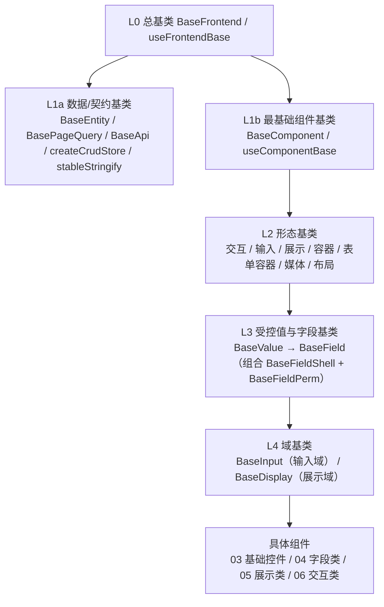
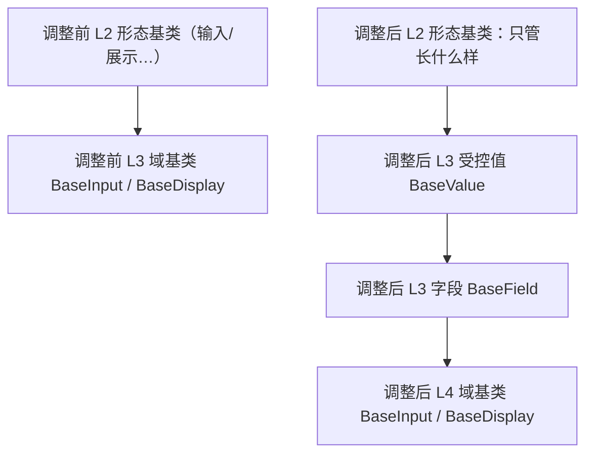

# 前端基类清单

> 前端基类权威清单：已有基类的分层、职责、代码位置、继承链与状态（bms 权威源维护，产品经工作区符号链接引用）

[文档首页](文档首页.md) › 前端基类清单　|　[配套：《前端开发规范》](规范/前端开发规范.md) · [← 后端基类清单](后端基类清单.md)

## 1. 用途与维护 

- **定位**：前端基类**权威清单**——回答「有哪些基类、在哪一层、什么职责、代码在哪、是否已交付」。**强制用法口径与扩展规则**见《[前端开发规范](规范/前端开发规范.md)》「前端基础类体系（L0-L4，强制）」节；分层机制见平台《架构设计 · 前端组件体系》；组件契约见组件设计 00 类节点。
- **口径**：前端所有**基类**收敛为一套 L0-L4 分层体系，**公共字段/方法只在对应层基类维护，任何组件与模块不得重复实现**；**数据/契约基类**与 **UI 组件基类**并列、共同继承自 L0；有新的类型就加一种基类，有新的扩展就加一层基类。
- **状态取值**：`已交付` / `部分` / `占位` / `待交付`；与平台架构节点登记一致。
- **维护**：新增/调整基类须同步本清单 + 组件设计 00 类节点（契约与原型）+ 平台《架构设计 · 前端组件体系》登记；状态列随实施回写。

## 2. 分层总览 

| 层 | 基类 / 能力 | 形态 | 父层 | 代码位置 | 职责 | 状态 |
| --- | --- | --- | --- | --- | --- | --- |
| L0 | 总基类 `BaseFrontend` + `useFrontendBase` | 抽象类 + 组合式 | — | `src/components/base/l0/`（规划） | 一切前端基类之根：通用字段与通用方法（日志、错误上报、配置/环境读取、i18n、生命周期钩子） | 待交付 |
| L1a | 数据/契约基类 `BaseEntity` / `BasePageQuery` / `BaseApi` / `createCrudStore` / `stableStringify` | 接口 / 类 / 工厂 | L0 | `src/api/types.ts`、`src/api/base.ts`、`src/stores/base.ts`、`src/utils/serialize.ts` | 响应与实体契约、请求封装、CRUD store 工厂、稳定序列化 | 部分 |
| L1b | 最基础组件基类 `BaseComponent` + `useComponentBase` | 抽象类 + 组合式 | L0 | `src/components/base/l1/`（规划） | 所有 UI 组件通用：attrs 透传与根元素约定、尺寸/密度/主题令牌、i18n 与命名空间、生命周期与埋点、可访问性(aria)与 ref/expose、通用 loading/disabled/显隐 | 待交付 |
| L2 | 交互基类 `BaseInteractive` | 组合式 | L1b | `src/components/base/l2/`（规划） | 可点击/loading/disabled/焦点语义 | 待交付 |
| L2 | 输入基类 `BaseInputControl` | 组合式 | L1b | 同上 | 通用输入形态：值绑定、前后缀插槽、清空、只读 | 待交付 |
| L2 | 展示基类 `BaseDisplayControl` | 组合式 | L1b | 同上 | 通用只读形态：密度/令牌/空值/省略 | 待交付 |
| L2 | 容器基类 `BaseContainer` | 组合式 | L1b | 同上 | 插槽/折叠/分栏/区域 | 待交付 |
| L2 | 表单容器基类 `BaseFormContainer` | 组合式 | L1b | 同上 | 表单/分区/校验汇总 | 待交付 |
| L2 | 媒体基类 `BaseMedia` | 组合式 | L1b | 同上 | 图片/音视频/文件预览 | 待交付 |
| L2 | 布局基类 `BaseLayout` | 组合式 | L1b | 同上 | 栅格/断点、间距/对齐令牌、布局根元素与透传、显隐 | 待交付 |
| L3 | 受控值基类 `BaseValue` | 组合式 | L2 输入/展示 | `src/components/base/l3/`（规划） | 值归一、格式化调度、三态、`change` 上报 | 待交付 |
| L3 | 字段基类 `BaseField` | 组合式 | `BaseValue` | 同上 | 字段上下文（字段壳）、字段权限、校验触发、`fieldKey`；**组合** `BaseFieldShell` + `BaseFieldPerm` | 待交付 |
| L3 | 字段壳基类 `BaseFieldShell` | 组合式 + 组件 | L3 | 同上 | label/必填/帮助/错误/栅格跨度/只读回显 | 待交付 |
| L3 | 字段权限基类 `BaseFieldPerm` | 组合式 / 指令 | L3 | 同上 | `visible`/`editable`/`required`/脱敏（`v-plain`） | 待交付 |
| L4 | 输入域基类 `BaseInput` | 组合式 + 组件 | `BaseField` | `src/components/base/l4/`（规划） | 输入域细化（受控、校验、字段上下文） | 待交付 |
| L4 | 展示域基类 `BaseDisplay` | 组合式 + 组件 | `BaseDisplayControl` + `BaseValue` | 同上 | 展示域细化（值格式化、空值占位、密度） | 待交付 |
| — | 具体组件 | — | L4 | `src/components/` | 03 布局组件 / 04 容器组件 / 05 基础控件 / 06 字段类 / 07 展示类 / 08 交互类 | — |

## 3. L0 总基类 

- **形态**：抽象类 `BaseFrontend` + 组合式 `useFrontendBase`；**所有基类（含 `BaseApi` / `BaseComponent`）从其派生**。
- **提供**：通用字段（如命名空间、版本/标识）与通用方法（日志、错误上报、配置/环境读取、i18n 取词、生命周期钩子）；不含任何 UI 或业务语义。
- **约束**：L0 只放「所有基类共有」的横切能力；任何一方（数据 / UI）特有逻辑不得上提 L0。

## 4. L1 基类（数据/契约 与 UI 最基础） 

- **L1a 数据/契约基类**：`BaseEntity` / `BasePageQuery`（响应与分页实体契约）、`BaseApi`（模块 API 基类：统一路径前缀与请求方法）、`createCrudStore`（Pinia 通用 CRUD store 工厂）、`stableStringify`（稳定序列化）；已落地于 `src/api/`、`src/stores/`、`src/utils/`，统一声明其继承自 L0。
- **L1b 最基础组件基类 `BaseComponent`**：所有 UI 组件公共能力——
  - attrs 透传（`id` / `class` / `style` / `data-*`）与根元素约定；
  - 尺寸 `size` / 密度 `density` / 主题令牌消费（随亮暗与租户品牌自动适配）；
  - i18n 取词与样式命名空间 / 前缀；
  - 生命周期埋点、错误上报、开发告警；
  - 可访问性（aria、键盘焦点）与 `ref` / `expose` 规范；
  - 通用 `loading` / `disabled` / 显隐态。

## 5. L2 形态基类（七类） 

| 基类 | 职责 |
| --- | --- |
| `BaseInteractive` | 可点击组件的公共（loading / disabled / 焦点 / 键盘触发） |
| `BaseInputControl` | 输入形态公共（值绑定、前后缀插槽、清空、只读），**不含表单字段语义** |
| `BaseDisplayControl` | 展示形态公共（密度、令牌、空值、省略），**不含字段格式化编排** |
| `BaseContainer` | 容器形态公共（插槽 / 折叠 / 分栏 / 区域） |
| `BaseFormContainer` | 表单容器形态公共（表单 / 分区 / 校验汇总） |
| `BaseMedia` | 媒体形态公共（图片 / 音视频 / 文件预览） |
| `BaseLayout` | 布局形态公共（栅格 / 断点、间距 / 对齐令牌、根元素与透传、显隐） |

- L2 只描述「组件长什么样、怎么交互」，不绑定具体业务或表单字段。

## 6. L3 受控值与字段基类 

- `BaseValue`（承前启后）：承接 L2，统一输入与展示共用的**值语义**（值归一、格式化调度、三态、`change`）。
- `BaseField`：在 `BaseValue` 之上提供**表单字段语义**（字段上下文、字段权限、校验触发、`fieldKey`），并**组合** `BaseFieldShell`（字段壳）与 `BaseFieldPerm`（字段权限）。
- `BaseFieldShell` / `BaseFieldPerm`：由原「字段壳」「字段权限」升级为继承链上的基类能力，供 `BaseField` 组合、可独立复用。

## 7. L4 域基类 

- `BaseInput`（输入域）：继承 `BaseField`，做输入域的最终细化，供 06 字段类与 05 基础控件继承。
- `BaseDisplay`（展示域）：组合 `BaseDisplayControl` + `BaseValue`，做展示域细化，供 07 展示类与字段只读回显继承。

## 8. 继承链与代码位置 

- **模拟继承**：Vue 3 无类多继承，统一以**组合式函数 + 组件包装**模拟继承；一个组件可**组合多个基类**（如展示域 = 展示形态基类 + 受控值基类）。
- **字段控件统一继承链**：`具体控件 → BaseInput(L4) → BaseField(L3) → BaseValue(L3) → BaseInputControl(L2) → BaseComponent(L1b) → BaseFrontend(L0)`。
- **依赖方向**：只准上层依赖下层，**禁止反向依赖**（L4 不得依赖具体组件，L0 不得依赖任何上层）。
- **命名**：基类组件 `BaseXxx`、组合式 `useXxxBase` / `useXxx` 统一遵循《[命名规范](规范/命名规范.md)》「前端命名」节；基类字段/方法用统一前缀（如 `base` / `$` 命名空间）。
- **目录**：组件基类按层分子目录（`src/components/base/l0/`、`l1/`、`l2/`、`l3/`、`l4/`）；`src/components/base/README.md` 说明层次；L1a 在 `src/api/`、`src/stores/`、`src/utils/`；组件设计 02 节点按层落地契约与原型。
- **双端同款基线**：frontend 与 frontend-mobile 同步扩展，不得只在单端加基类能力。

## 9. 扩展与演进 

- **加类型**：出现新的组件类型 → 新增对应基类；**加扩展**：出现新的横切能力 → 新增一层基类。
- 公共逻辑只在所属层基类维护，具体组件只负责自身特性；修改公共行为改基类即可全链生效。
- **分层演进原则**：遇到职责冲突就插入中间层承前启后；同一冲突可插入**多层**，每层只解决一类横切职责（加层优先于在既有层堆逻辑）。

**示例（本体系已发生的真实冲突）**：最初构想 L2 形态基类（含「输入/展示」）直接接 L3 域基类 `BaseInput` / `BaseDisplay`，结果「输入/展示」在 L2 与 L3 两处都出现、职责打架——L2 讲「组件长什么样」，L3 讲「表单字段怎么用」。处理方式是**把冲突职责独立成层**：

- 结果：L2 只管形态；新增 L3 `BaseValue`（值归一/格式化/三态/change）与 `BaseField`（字段上下文/权限/校验）承前启后；L4 域基类只做域内细化。
- **可继续加层**：若后续出现新横切职责（如「授权/审计」「实时/订阅」「离线/缓存」），按同一办法再插一层（如 `BaseAuthorized`、`BaseReactive`、`BaseCacheable`），插在合适的两层之间，**不动其它层**。
- 原则：**改一层即全链生效**；禁止把多类横切职责塞进同一层。

## 10. 维护约定 

- **同步范围**：新增 / 调整基类须同步本清单（分层总览表与章节）+ 组件设计 00 类节点（契约与原型）+ 平台《架构设计 · 前端组件体系》登记。
- **状态回写**：实施完成后回写本清单「状态」列与平台架构节点；待交付项随前端阶段更新。
- **口径唯一**：强制用法与扩展流程以《[前端开发规范](规范/前端开发规范.md)》「前端基础类体系（L0-L4，强制）」节为准；基类是否存在、在哪一层、代码位置以本清单为准。

> 前端基类权威清单 · 与《前端开发规范》配套 · 与《后端基类清单》对称
