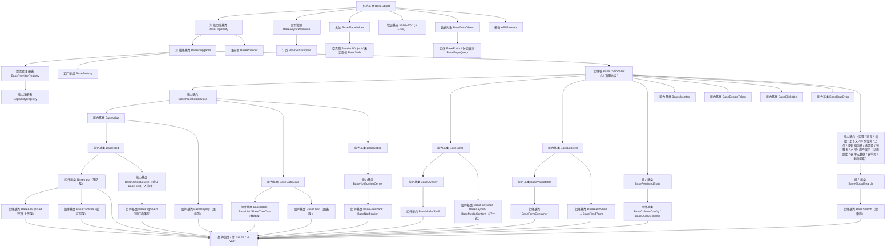

# 前端基类清单

> 前端基类权威清单：**全系统唯一一份前端继承链**——各基类的身份、父基类、形态、代码位置、职责、迁移映射与状态（bms 权威源维护，产品经工作区符号链接引用）

[文档首页](文档首页.md) › 前端基类清单　|　[配套：《前端开发规范》](规范/前端开发规范.md) · [← 后端基类清单](后端基类清单.md)

## 1. 用途与维护 <a id="purpose"></a>

- **定位**：前端基类**权威清单**——回答「有哪些基类、各自继承谁、什么职责、代码在哪、现有实现类怎么迁移、是否已交付」。**强制用法口径与扩展规则**见《[前端开发规范](规范/前端开发规范.md)》「前端基类体系（强制）」节；体系语义见平台《[架构设计 · 前端组件体系](设计/架构设计/05_架构设计_前端组件体系.md)》与《[架构设计 · 扩展点与插件化](设计/架构设计/10_架构设计_子系统_扩展点与插件化.md)》§7；**通用组件的语义与契约边界**见《[组件设计 · 总览](设计/组件设计/01_组件设计_总览.md)》对应节点。
- **继承链唯一（强制）**：前端继承链**全系统只有本清单这一份**。规范、架构、组件设计、任务与产品文档**一律引用本清单**，不重复描述继承关系；重复即口径漂移源，发现重复须改为引用（口径见 §12）。

### 1.1 体系口径（参照后端基类体系） <a id="positioning"></a>

**前端基类体系与后端基类体系同构**：**总基类 → 功能基类（能力域基类）→ 插件基类**为**固定的前三段**（对后端 `BaseObject` → `BaseCapability` → `BasePluggable`）；其下**每条继承链按功能与抽象需要自行延伸、有长有短，不设固定层数**。

- **主体内建必须继承**：平台自有实现一律沿本清单的继承链派生；**公共字段与方法只在链上对应基类维护**，任何组件与模块不得重复实现；**不得绕过链层另起炉灶、不得在链外自由挂接功能**。
- **零例外**：一切基类从**总基类 `BaseObject`** 派生（错误基座亦入链，见 §6.3）。
- **固定三段（强制）**：① **总基类 `BaseObject`**（一切基类之根：命名空间 / 日志 / 错误上报 / 配置读取 / 生命周期）；② **能力域基类 `BaseCapability`**（能力键与依赖登记）；③ **插件基类 `BasePluggable`**（实现名 / 契约版本 / 注册与解析 / 生命周期）——三段之后，各链自由延伸。
- **能力基类 → 组件基类（强制顺序）**：**能力基类**承载正交横切功能（值 / 字段 / 尺寸 / 数据状态 / 浮层 / 通知 / 标签 / 校验 / 持久化 / 令牌 / 挂载 / 可点击 / 拖拽 / 页签 / 语言 / 权限 / 上下文 / 上传 / 编辑器内核 / 选项源 …）；**组件基类**在能力基类之后，形成一类组件的身份骨架（输入 / 展示 / 表格 / 列表 / 树 / 模态 / 表单容器 / 容器 / 布局 / 媒体 / 反馈 / 字段壳 …），**继承相应的能力基类**；具体组件 / 件继承组件基类。全链另立组件根 `BaseComponent`（所有 UI 组件的公共协议）作为组件侧入口。
- **相似基类抽公共段**：两个基类有公共部分 → 提取**能力基类**承前启后；两个能力基类仍有公共部分 → **继续提取**（如 `BaseSized` 承载容器 / 布局 / 媒体的尺寸档位）。
- **插件化（纵向可替换）**：与平台《[扩展点与插件化](设计/架构设计/10_架构设计_子系统_扩展点与插件化.md)》§3 / §7.1 同构——能力域基类（能力键）→ 插件基类（实现名 / 契约版本 / 注册与解析 / 生命周期）→ 注册表（`BaseProviderRegistry` / 注册项 `BaseProvider`）→ 默认实现 / 内建实现 / 定制实现。
- **双轨（继承 + 组合）**：平台内建走继承轨（定义即登记 + 契约测试）；项目二次开发 / 定制走组合轨（注册通道登记接入、不继承平台基类、不回改平台基类）；两轨汇入同一登记与同一套契约测试。
- **命名对齐后端**：通用基类与后端**同名同职责**（`BaseObject` / `BaseCapability` / `BasePluggable` / `BaseProviderRegistry` / `BaseProvider` / `BaseAsyncResource` / `BasePlaceholder` / `BaseNullObject` / `BaseStub`）；前端特有族按功能命名，不强行造无对应的基类。

### 1.2 状态取值 <a id="status"></a>

`已交付` / `部分` / `占位` / `待交付`——与平台架构节点登记一致。

### 1.3 维护流程 <a id="maintain-flow"></a>

新增 / 调整基类走：**候选 → 设计节点（组件设计）→ 评审确认 → 本清单登记 → 代码登记 + 契约用例 → 《架构设计 · 前端组件体系》同步**；状态列随实施回写。历史旧体系内容（`src/base`、`src/components/base` 能力片段层、`useXxx` 组合式能力）已随移动端（S4c）与 PC 宿主（S6）删除，历史经 git 追溯（专项 `02_07`）。

## 2. 继承链总览 <a id="overview"></a>

```text
前端基类继承链（全系统唯一权威源 · 本清单）
│
├─ 固定前三段（强制）                                                      # §3
│  └─ BaseObject 总基类 → BaseCapability 能力域基类 → BasePluggable 插件基类
│
├─ 插件基类之下（平行支线）                                                # §4
│  ├─ BaseProviderRegistry 提供者注册表 → CapabilityRegistry / 各扩展点注册表
│  ├─ BaseProvider 注册项（挂能力域基类）
│  └─ BaseFactory 工厂基类 → 各域工厂基类 → 具体工厂类
│
├─ 组件侧（组件根 → 能力基类 → 组件基类 → 具体件）                          # §5
│  ├─ BaseComponent 组件根（UI 通用协议：透传 / 尺寸密度 / 令牌属性 / 生命周期）
│  ├─ 能力基类：BasePlaceholderState · BaseValue · BaseField · BaseSized · BaseDataState · BaseOverlay
│  │            BaseNotice · BaseLabeled · BaseValidatable · BasePersistedState
│  │            BaseMounted · BaseDesignToken · BaseClickable · BaseDragDrop
│  │            BaseTabs · BaseLocale · BaseAccess · BaseModuleContext · BaseAsyncTask
│  │            BaseUploadEngine · BaseEditorKernel · BaseOptionSource · BasePresignedUrl
│  │            BaseWatermark · BaseUserDisplay · BaseDynamicRoutes · BaseFormMeta · BaseFormPage
│  │            BaseWizard · BaseSelection · BaseBulkAction · BaseTheme · BaseTenant · BasePrintTemplate · BasePrint
│  │            BasePermissionConfig · BaseFileDownload · BaseImportFlow · BaseExportFlow · BaseFormDesigner
│  │            BaseFormRenderer · BaseMessageCatalog
│  │            BaseApprovalFlow · BaseProcessModeler · BaseReportDesigner
│  │            BaseScreenDesigner · BaseScreenPlayer · BaseAiAssistant · BaseGlobalSearch
│  └─ 组件基类（继承相应能力基类）：BaseInput · BaseDisplay · BaseTable · BaseList · BaseTreeData
│                 BaseModalShell · BaseFormContainer · BaseContainer · BaseLayout · BaseMediaContent
│                 BaseFeedback · BaseNotification · BaseColumnConfig · BaseQueryScheme
│                 BaseFieldShell · BaseFieldPerm · BaseChart · BaseSearch · BaseOrgSelect
│
├─ 资源 / 占位 / 错误（挂总基类，对齐后端）                                 # §6
│  ├─ BaseAsyncResource 异步资源 → BaseSubscription 订阅
│  ├─ BasePlaceholder 占位 → BaseNullObject 空实现 / BaseStub 未实现桩
│  └─ BaseError 错误基座（extends BaseObject + Error）
│
└─ 契约基类                                                               # §7
   ├─ BaseApi 模块 API（→ 总基类）
   └─ BaseDataObject 数据对象 → BaseEntity 实体 / BasePageQuery 分页查询
```

### 2.1 全量基类登记表 <a id="registry"></a>

> `父基类`列为**唯一继承来源**；「类别」为体系归口（固定主干 / 插件与注册 / 组件侧 / 资源与占位 / 契约）。「代码位置」为路径前缀 `frontend/packages/core/src/` 之下的相对落点（`已交付`项与现有代码一致，`待交付`项为设计落点）。

| # | 基类 | 父基类 | 类别 | 形态 | 代码位置 | 职责 | 状态 |
| --- | --- | --- | --- | --- | --- | --- | --- |
| 1 | `BaseObject` | —（根） | 固定主干 ① | 类 | `base/BaseObject.ts` | **总基类**：命名空间 / 版本、日志、错误上报、配置读取、生命周期（`dispose`）；不含 UI 与业务语义 | 已交付 |
| 2 | `BaseCapability` | `BaseObject` | 固定主干 ② | 类 | `mechanisms/capability.ts` | **能力域基类**（对齐后端同名基类）：能力键声明、依赖登记、单向校验、开发态告警 | 已交付 |
| 3 | `BasePluggable` | `BaseCapability` | 固定主干 ③ | 类 | `mechanisms/pluggable.ts` | **插件基类**（对齐后端同名基类）：能力键 / 实现名 / 契约版本 / 注册与解析 / 生命周期 / `describe` | 已交付 |
| 4 | `BaseProviderRegistry` | `BasePluggable` | 插件与注册 | 类 | `mechanisms/registry.ts` | 提供者注册表：唯一性拒重（严格域抛错 / 一般域告警保留首个）、未命中返回 `undefined`、保序、只读快照 | 已交付 |
| 5 | `CapabilityRegistry` | `BaseProviderRegistry` | 插件与注册 | 类 | `capabilities/registry.ts` | 能力注册表：能力登记 / 解析 / 能力矩阵 | 已交付 |
| 6 | `BaseProvider` | `BaseCapability` | 插件与注册 | 类 | `mechanisms/provider.ts` | 注册项公共契约：抽象 `key` + 自描述 `describe()`（各扩展点注册项继承） | 已交付 |
| 7 | `BaseFactory` | `BasePluggable` | 插件与注册 | 类 | `mechanisms/factory.ts` | **工厂基类**：一切工厂类之根（创建入口标识 / 参数校验 / 产出物释放登记） | 已交付 |
| 8 | `BaseComponent` | `BasePluggable` | 组件侧 · 组件根 | 类 | `base/BaseComponent.ts` | **组件根**：所有 UI 组件公共协议——标识与命名空间类名、尺寸 / 密度、`loading` / `disabled`、**令牌属性协议**（`data-size` / `data-density` / `aria-*` + 状态类）、attrs 透传（保留键过滤）、生命周期通知、机制装配点 | 已交付 |
| 9 | `BaseValue` | `BasePlaceholderState` | 组件侧 · 能力基类 | 类 | `capabilities/value.ts` | 值语义：值归一、格式化调度、三态、`change` 上报（输入与展示共用） | 已交付 |
| 10 | `BaseField` | `BaseValue` | 组件侧 · 能力基类 | 类 | `capabilities/field.ts` | 字段语义：字段标识、校验触发、字段上下文（输入族的公共能力） | 已交付 |
| 11 | `BaseSized` | `BaseComponent` | 组件侧 · 能力基类 | 类 | `capabilities/sized.ts` | 尺寸档位：尺寸 / 密度档位与设计令牌消费统一入口 | 已交付 |
| 12 | `BaseDataState` | `BasePlaceholderState` | 组件侧 · 能力基类 | 类 | `capabilities/data-state.ts` | 数据状态：`loading → ready / empty / error` 状态机与竞态处理 | 已交付 |
| 13 | `BaseOverlay` | `BaseSized` | 组件侧 · 能力基类 | 类 | `capabilities/overlay.ts` | 浮层：遮罩、挂载点、层级、焦点陷阱、关闭语义 | 已交付 |
| 14 | `BaseNotice` | `BasePlaceholderState` | 组件侧 · 能力基类 | 类 | `capabilities/notice.ts` | 提示通知：类型 / 时长 / 关闭语义 / 队列 | 已交付 |
| 15 | `BaseNotificationCenter` | `BaseNotice` | 组件侧 · 能力基类 | 类 | `capabilities/notification-center.ts` | 通知中心编排：未读与角标 / 列表与详情取数编排 / 实时订阅与断线补偿 / 批量与全部已读 / 单条删除 / 本地乐观与失败回滚 / 轮询占位（取数与实时经注入式处理函数） | 已交付 |
| 16 | `BaseLabeled` | `BaseComponent` | 组件侧 · 能力基类 | 类 | `capabilities/labeled.ts` | 标签语义：label 文案 / 位置 / 宽度、必填标记、帮助与错误位 | 已交付 |
| 17 | `BaseValidatable` | `BaseLabeled` | 组件侧 · 能力基类 | 类 | `capabilities/validatable.ts` | 校验：规则汇总 / 触发时机 / 结果回传 / 错误定位 | 已交付 |
| 18 | `BasePersistedState` | `BaseComponent` | 组件侧 · 能力基类 | 类 | `capabilities/persisted-state.ts` | 偏好持久化：本地即时 / 本地存储读写 / 快照回滚 / 保存与待同步 / 远端偏好同步（占位） | 已交付 |
| 19 | `BaseMounted` | `BaseComponent` | 组件侧 · 能力基类 | 类 | `capabilities/mounted.ts` | 可挂载：挂载 / 卸载生命周期与释放登记统一入口 | 已交付 |
| 20 | `BaseDesignToken` | `BaseComponent` | 组件侧 · 能力基类 | 类 | `capabilities/design-token.ts` | 设计令牌消费：间距 / 色板 / 密度 / 断点 / 主题订阅 | 已交付 |
| 21 | `BaseClickable` | `BaseComponent` | 组件侧 · 能力基类 | 类 | `capabilities/interactive.ts` | 可点击：loading / disabled / 防抖 / 危险确认 / 键盘触发 / 埋点 | 已交付 |
| 22 | `BaseDragDrop` | `BaseComponent` | 组件侧 · 能力基类 | 类 | `capabilities/drag-drop.ts` | 拖拽基座：拖拽 / 排序 / 跨区（表单设计器、报表与大屏设计器、工作台卡片共用） | 已交付 |
| 23 | `BaseTabs` | `BaseComponent` | 组件侧 · 能力基类 | 类 | `capabilities/tabs.ts` | 页签状态：打开 / 关闭 / 固定 / 缓存键清单 | 已交付 |
| 24 | `BaseLocale` | `BaseComponent` | 组件侧 · 能力基类 | 类 | `capabilities/locale.ts` | 语言上下文：locale / 时区 / 格式上下文（切换与缓存） | 已交付 |
| 25 | `BaseAccess` | `BaseComponent` | 组件侧 · 能力基类 | 类 | `capabilities/access.ts` | 权限上下文：权限码集合与判定（`has` / `hasAny` / `hasAll`） | 已交付 |
| 26 | `BaseModuleContext` | `BaseComponent` | 组件侧 · 能力基类 | 类 | `capabilities/module-context.ts` | 上下文基类：宿主注入 router / store / i18n / 用户 / 租户（只读约束） | 已交付 |
| 27 | `BaseAsyncTask` | `BaseComponent` | 组件侧 · 能力基类 | 类 | `capabilities/async-task.ts` | 异步任务：提交 / 轮询进度（退避）/ 取消 / 结果下载；支持两段轮询（提交 → 轮询 → 结果） | 已交付 |
| 28 | `BaseUploadEngine` | `BasePlaceholderState` | 组件侧 · 能力基类 | 类 | `capabilities/upload-engine.ts` | 上传引擎：任务队列 / 分片 / 秒传 / 断点续传 / 并发与重试 / 进度回传 / 取消中断（注入式通路，未注入即占位零请求；既有单文件回调路径保留） | 已交付 |
| 29 | `BaseEditorKernel` | `BaseComponent` | 组件侧 · 能力基类 | 类 | `capabilities/editor-kernel.ts` | 编辑器内核：懒加载 / 创建销毁 / 内容协议（CodeMirror 与富文本 / Markdown 共用） | 已交付 |
| 30 | `BaseOptionSource` | `BaseField` | 组件侧 · 能力基类 | 类 | `capabilities/option-source.ts` | 选项源：加载 / 缓存与版本比对 / 搜索 / 回显（字典、组织、枚举、树、级联共用；**已入值链**——父基类 `BaseField`，`BaseOrgSelect` 即其下位组件基类） | 已交付 |
| 31 | `BasePresignedUrl` | `BaseComponent` | 组件侧 · 能力基类 | 类 | `capabilities/presigned-url.ts` | 预签名：按文件标识缓存 / 用途 / 提前刷新 / 失效重取一次 / 并发合并 / 降级策略（文件预览、下载、上传直传、导出共用；无 key 调用保持单 URL 语义） | 已交付 |
| 32 | `BaseWatermark` | `BaseComponent` | 组件侧 · 能力基类 | 类 | `capabilities/watermark.ts` | 水印：用户 / 租户信息注入（覆盖内容与导出） | 已交付 |
| 33 | `BaseUserDisplay` | `BaseComponent` | 组件侧 · 能力基类 | 类 | `capabilities/user-display.ts` | 用户 / 组织展示：姓名 / 头像 / 状态 / 部门路径 | 已交付 |
| 34 | `BasePlaceholderState` | `BaseComponent` | 组件侧 · 能力基类 | 类 | `capabilities/placeholder-state.ts` | 占位状态：依赖后端数据的组件在数据通路未就绪时的就绪 / 降级、占位零请求计数与状态切换（占位降级组合式共用） | 已交付 |
| 35 | `BaseDynamicRoutes` | `BaseComponent` | 组件侧 · 能力基类 | 类 | `capabilities/dynamic-routes.ts` | 动态路由：菜单树 → 路由构建 / 注册 / 卸载 | 已交付 |
| 36 | `BaseFormMeta` | `BaseComponent` | 组件侧 · 能力基类 | 类 | `capabilities/form-meta.ts` | 表单元数据：加载 / 缓存 / 版本比对 | 已交付 |
| 37 | `BaseFormPage` | `BaseComponent` | 组件侧 · 能力基类 | 类 | `capabilities/form-page.ts` | 表单页组合：三态（新增 / 编辑 / 详情）/ 提交 / 脏数据 / 返回 | 已交付 |
| 38 | `BaseWizard` | `BaseComponent` | 组件侧 · 能力基类 | 类 | `capabilities/wizard.ts` | 向导编排：可见步骤 / 当前步 / 已到达步 / 分步与整体校验 / 结果态 / 草稿（经偏好持久化） | 已交付 |
| 39 | `BaseSelection` | `BaseComponent` | 组件侧 · 能力基类 | 类 | `capabilities/selection.ts` | 选中集合：行键 / 当前页键 / 选中集合 / 跨页全选 / 清除（批量操作与列表多选共用） | 已交付 |
| 40 | `BaseBulkAction` | `BaseSelection` | 组件侧 · 能力基类 | 类 | `capabilities/bulk-action.ts` | 批量动作编排：动作定义 / 权限过滤 / 危险与超量确认 / 执行阶段与进度 / 部分成功汇总 / 完成后清空 | 已交付 |
| 41 | `BaseTheme` | `BaseDesignToken` | 组件侧 · 能力基类 | 类 | `capabilities/theme.ts` | 主题与品牌：模式解析（用户 / 租户 / 平台）/ 系统偏好联动 / 品牌注入 / 品牌色派生（另持 `persisted-state` 通道） | 已交付 |
| 42 | `BaseTenant` | `BaseComponent` | 组件侧 · 能力基类 | 类 | `capabilities/tenant.ts` | 租户切换：当前租户 / 可切换列表 / 切换阶段状态机 / 失败回退（重载步骤宿主注入） | 已交付 |
| 43 | `BasePrintTemplate` | `BaseComponent` | 组件侧 · 能力基类 | 类 | `capabilities/print-template.ts` | 打印模板：页眉 / 标题 / 字段区 / 明细列 / 汇总 / 签章 / 页脚、纸张与方向、黑白、单据级水印标签与单据数据装配（另持水印与语言上下文） | 已交付 |
| 44 | `BasePrint` | `BasePrintTemplate` | 组件侧 · 能力基类 | 类 | `capabilities/print.ts` | 打印与导出编排：预览显隐与缩放 / 模板选择 / 批量逐份·合并 / 浏览器打印阶段 / 导出与批量任务（经异步任务）/ 进度与失败重试（另持权限与提示） | 已交付 |
| 45 | `BasePermissionConfig` | `BasePlaceholderState` | 组件侧 · 能力基类 | 类 | `capabilities/permission-config.ts` | 授权编排：四类授权状态（权限树 / 字段权限矩阵 / 数据范围 / 主体绑定）、隐含推导（菜单→表单→业务只读）、三态联动与全量覆盖提交（内容派生幂等键）、脏基线撤销与权限上下文刷新（组合树族组件基类） | 已交付 |
| 46 | `BaseFileDownload` | `BaseComponent` | 组件侧 · 能力基类 | 类 | `capabilities/file-download.ts` | 下载触发：取址（直连 / 宿主取址 / 预签名回退）、失效重取、降级重试（模板、错误明细、导出结果共用；浏览器触发归件层） | 已交付 |
| 47 | `BaseImportFlow` | `BasePlaceholderState` | 组件侧 · 能力基类 | 类 | `capabilities/import-flow.ts` | 导入流编排：模板下载 / 文件校验 / 内容派生幂等键 / 上传解析阶段与进度 / 错误行报告与明细下载 / 失败重试与重置（组合上传引擎与下载触发） | 已交付 |
| 48 | `BaseExportFlow` | `BasePlaceholderState` | 组件侧 · 能力基类 | 类 | `capabilities/export-flow.ts` | 导出流编排：取数参数同口径 / 筛选与选中范围 / 脱敏与明文 / 同步下载与超阈值异步导出（经异步任务 poller 两段）/ 进度与取消 / 失败重试（组合下载触发） | 已交付 |
| 49 | `BaseFormDesigner` | `BasePlaceholderState` | 组件侧 · 能力基类 | 类 | `capabilities/form-designer.ts` | 表单设计器编排：布局结构操作（分区 / 字段 / 列数 / 跨列 / 顺序）/ 三级层级与只读判定 / 脏基线与拦截 / 保存·发布·恢复默认（逐级回退）/ 自建字段新建与 DDL 重试（组合拖拽与表单元数据；布局元数据契约落 `domain/form-layout.ts`） | 已交付 |
| 50 | `BaseFormRenderer` | `BasePlaceholderState` | 组件侧 · 能力基类 | 类 | `capabilities/form-renderer.ts` | 表单渲染编排：三态（新增 / 编辑 / 查看）与字段权限叠加（权限为终态、双向覆盖）/ 字段渲染计划与控件语义键分发 / 校验规则构建与即时·全量校验定位 / 明细区行级校验与主从单事务提交装配（组合表单元数据 / 字段权限 / 权限 / 提示 / 校验；渲染语义落 `domain/form-render.ts`） | 已交付 |
| 51 | `BaseMessageCatalog` | `BasePlaceholderState` | 组件侧 · 能力基类 | 类 | `capabilities/message-catalog.ts` | 文案目录编排：语言清单增改启停与保护规则（44001 / 44002 / 44004 / 44005）/ 文案行编辑与增删 `msg_key`（命名轻校验 44003）/ 缺失派生与筛选 / 内容派生幂等键批量保存（`i18n:{hash}`）/ 缓存主动失效与语言包重载（失败降级不阻断）/ 脏基线与撤销（组合语言上下文；领域纯函数落 `domain/i18n.ts`） | 已交付 |
| 52 | `BaseApprovalFlow` | `BasePlaceholderState` | 组件侧 · 能力基类 | 类 | `capabilities/approval-flow.ts` | 审批流编排：实例与记录**并行取数**（单失败不整体报错）/ 会签聚合与进度摘要 / 审批提交（内容派生幂等键 `wf:{hash}`、防重复提交、提交后刷新）/ 错误码处置（60005 按成功、60009 置只读）/ 只读图形态三级判定（组合预签名能力；领域纯函数落 `domain/approval.ts`） | 已交付 |
| 53 | `BaseProcessModeler` | `BasePlaceholderState` | 组件侧 · 能力基类 | 类 | `capabilities/process-modeler.ts` | 流程建模编排：定义装载 / XML 更新·导入（两段确认）·导出 / 结构校验与引擎预解析合并 / 保存草稿与版本发布（内容派生幂等键 `wfd:{hash}`）/ 脏基线与只读判定 / 错误码定位与重试（画布与命令栈归件层；领域纯函数落 `domain/process-modeler.ts`） | 已交付 |
| 54 | `BaseReportDesigner` | `BasePlaceholderState` | 组件侧 · 能力基类 | 类 | `capabilities/report-designer.ts` | 报表设计器编排：数据集选择与字段映射 / 图表项增删改与 12 列网格布局（夹取与重叠提示）/ 选中联动 / 脏基线撤销与拦截 / 预览取数（只读从库口径）/ 保存·发布·另存为（覆盖式）；布局与校验落 `domain/report-layout.ts` | 已交付 |
| 55 | `BaseScreenDesigner` | `BasePlaceholderState` | 组件侧 · 能力基类 | 类 | `capabilities/screen-designer.ts` | 大屏设计器编排：页面与组件增删改 / 自由画布绝对定位落点与缩放 / 层级重排与选中联动 / 画布配置（分辨率 / 背景 / 主题）/ 多页管理 / 脏基线撤销与拦截 / 预览取数（只读从库口径）/ 保存·发布·另存为（覆盖式）；布局与校验落 `domain/screen-layout.ts` | 已交付 |
| 56 | `BaseScreenPlayer` | `BasePlaceholderState` | 组件侧 · 能力基类 | 类 | `capabilities/screen-player.ts` | 大屏播放编排：定义取数 / 多页轮播切页（环回）/ 播放态与单页时长 / 按组件并行取数与整页刷新（单组件失败不阻断）/ 查看权限门控；轮播与缩放纯函数落 `domain/screen-play.ts` | 已交付 |
| 57 | `BaseAiAssistant` | `BasePlaceholderState` | 组件侧 · 能力基类 | 类 | `capabilities/ai-assistant.ts` | AI 助手编排：四模式会话与消息 / 流式接收与停止 / 重生成 / 结果与引用装配（问数图表·表格·引用·风险·审计）/ 自动执行强制二次确认与撤销（组合权限·提示·数据状态·选项源·异步任务；取数与流式经注入式处理函数与适配器） | 已交付 |
| 58 | `BaseGlobalSearch` | `BasePlaceholderState` | 组件侧 · 能力基类 | 类 | `capabilities/global-search.ts` | 搜索编排能力基类：关键词 / 域状态 / 即时建议 / 多域分组 / 降级与错误码 / 最近搜索 / 审计日志与文件内容检索（注入式检索引擎，未注入即占位零请求） | 已交付 |
| 59 | `BaseInput` | `BaseField` | 组件侧 · 组件基类 | 类 | `capabilities/input.ts` | **输入组件基类**（输入族）：受控绑定、归一、清空、只读判定、composition、焦点（原 `BaseInputControl` + 输入域工厂） | 已交付 |
| 60 | `BaseDisplay` | `BaseValue` | 组件侧 · 组件基类 | 类 | `capabilities/display.ts` | **展示组件基类**（展示族）：只读呈现、密度、空值占位、省略 / tooltip、点击取值 | 已交付 |
| 61 | `BaseTable` | `BaseDataState` | 组件侧 · 组件基类 | 类 | `capabilities/table.ts` | **表格组件基类**：表格数据 / 分页 / **多列排序（叠加 ≤ 3 列）** / 密度 / **组合选中集合基类（多选权威，`selected` 与 `toggleSelect` 为兼容垫片）** / **组合列配置基类** / 树形·展开·行内编辑状态；列与取数纯函数落 `domain/table.ts`、`domain/filter.ts`、`domain/list-preference.ts` | 已交付 |
| 62 | `BaseList` | `BaseDataState` | 组件侧 · 组件基类 | 类 | `capabilities/list.ts` | **列表组件基类**：列表数据 / 滚动加载 / 空态与错误态 / 刷新 | 已交付 |
| 63 | `BaseTreeData` | `BaseDataState` | 组件侧 · 组件基类 | 类 | `capabilities/tree-data.ts` | **树组件基类**（树族）：加载 / 懒加载 / 归一 / 选中 / 勾选 / 过滤 / 缓存 | 已交付 |
| 64 | `BaseModalShell` | `BaseOverlay` | 组件侧 · 组件基类 | 类 | `capabilities/modal-shell.ts` | **模态组件基类**：模态语义 / 关闭拦截 / 底部操作区 | 已交付 |
| 65 | `BaseFormContainer` | `BaseValidatable` | 组件侧 · 组件基类 | 类 | `capabilities/form-container.ts` | **表单容器基类**：label 位置与宽度 / 栅格 / 规则汇总 / 校验 / 错误定位 / 只读态 | 已交付 |
| 66 | `BaseContainer` | `BaseSized` | 组件侧 · 组件基类 | 类 | `capabilities/container.ts` | **容器组件基类**：插槽 / 折叠 / 分栏 / 区域令牌 | 已交付 |
| 67 | `BaseLayout` | `BaseSized` | 组件侧 · 组件基类 | 类 | `capabilities/layout.ts` | **布局组件基类**：栅格 / 断点、间距与对齐令牌、根元素与透传、显隐 | 已交付 |
| 68 | `BaseMediaContent` | `BaseSized` | 组件侧 · 组件基类 | 类 | `capabilities/media.ts` | **媒体组件基类**：加载状态机 / 宽高比 / 懒加载 / 过期重取 / 回退 | 已交付 |
| 69 | `BaseFeedback` | `BaseNotice` | 组件侧 · 组件基类 | 类 | `capabilities/feedback.ts` | **反馈组件基类**：`loading → ready / empty / error` 反馈状态机与降级呈现 | 已交付 |
| 70 | `BaseNotification` | `BaseNotificationCenter` | 组件侧 · 组件基类 | 类 | `capabilities/notification.ts` | **通知组件基类**：站内信 / 公告的展示与已读状态，类型语义色 / 文案 / 跳转展示语义 | 已交付 |
| 71 | `BaseColumnConfig` | `BasePersistedState` | 组件侧 · 组件基类 | 类 | `capabilities/column-config.ts` | **列配置基类**：显隐（末列保护） / 顺序（移动与重排） / 宽度（夹取） / 冻结 / 恢复默认 / 与列声明归一 / 持久化 | 已交付 |
| 72 | `BaseQueryScheme` | `BasePersistedState` | 组件侧 · 组件基类 | 类 | `capabilities/query-scheme.ts` | **查询方案基类**：条件模型 / 序列化与失效剔除 / 方案保存·应用·删除·重命名 / 默认方案三级作用域解析 / 参数化 | 已交付 |
| 73 | `BaseFieldShell` | `BaseLabeled` | 组件侧 · 组件基类 | 类 | `capabilities/field-shell.ts` | **字段壳基类**：label / 必填 / 帮助 / 错误 / 栅格跨度 / 只读回显 | 已交付 |
| 74 | `BaseFieldPerm` | `BaseFieldShell` | 组件侧 · 组件基类 | 类 | `capabilities/field-perm.ts` | **字段权限基类**：`permVisible` / `editable` / `required` 三态 + 脱敏 | 已交付 |
| 75 | `BaseChart` | `BaseDataState` | 组件侧 · 组件基类 | 类 | `capabilities/chart.ts` | **图表组件基类**：图表实例生命周期（注入式引擎适配器，核心框架无关）/ 尺寸自适应节流 / 主题令牌重建 / 四态与空态（空数据不初始化实例）/ 导出与释放；图表卡、报表设计器、大屏共用 | 已交付 |
| 76 | `BaseSearch` | `BaseGlobalSearch` | 组件侧 · 组件基类 | 类 | `capabilities/search.ts` | **搜索族**：域标签 / 命中稳定键 / 跳转目标 / 命中语义色 / 可见分组（搜索族身份骨架） | 已交付 |
| 77 | `BaseOrgSelect` | `BaseOptionSource` | 组件侧 · 组件基类 | 类 | `capabilities/org-select.ts` | **组织选择族**：用户 / 岗位 / 部门三类远程搜索与查询参数、批量按 id 回显（避免 N+1）、关键词结果短缓存与已选常驻、已删除 / 停用占位、多选去重与上限、部门树一次性加载与路径回显（注入式组织数据源，未注入即占位零请求；用户展示经 `BaseUserDisplay`） | 已交付 |
| 88 | `BaseDictStore` | `BasePlaceholderState` | 组件侧 · 能力基类 | 类 | `capabilities/dict-store.ts` | 字典缓存：版本比对、批量合并（同批多类型一次请求）、同类型并发去重、大小字典缓存、按值子集回填（批量翻译防 N+1）、本地二次缓存注入通道、失效（全局一份缓存，跨件 / 跨表单共享；未就绪 / 未注入即占位零请求） | 已交付 |
| 89 | `BaseDictSelect` | `BaseOptionSource` | 组件侧 · 组件基类 | 类 | `capabilities/dict-select.ts` | **字典选择族**：小字典全量本地过滤 / 大字典远程搜索与探针、禁用项、级联父值、多选去重与上限、批量回显（`values` 子集一次回填）、选项源语义同步（注入式字典数据源 + 缓存能力，未注入即占位零请求） | 已交付 |
| 90 | `BaseDictQuery` | `BasePlaceholderState` | 组件侧 · 能力基类 | 类 | `capabilities/dict-query.ts` | 字典高级查询编排：属性 schema 与提供者清单并行加载、条件组（AND/OR 分组树 + 深度限制）、执行（取项条件引擎 / 业务筛选提供者）、查询方案（列表 / 默认解析 / 应用 / 保存 / 删除）；注入式数据源，未注入即占位零请求 | 已交付 |
| 91 | `BaseFileUpload` | `BaseInput` | 组件侧 · 组件基类 | 类 | `capabilities/file-upload.ts` | **文件上传族**：文件列表 / 类型与大小数量校验 / 多选上限 / 多图排序 / 在途占位与服务端标识替换 / 只读回显与失效占位 / 预览与下载（组合上传引擎、预签名与下载触发；注入式通路，未注入即占位零请求） | 已交付 |
| 92 | `BaseCaptcha` | `BaseInput` | 组件侧 · 组件基类 | 类 | `capabilities/captcha.ts` | **验证码族**：图形 / 滑块 / 短信三形态状态机 / 挑战获取与刷新（一次性失效）/ 短信发送与倒计时（限流不重置）/ 凭证校验与错误分类 / 滑块轨迹提交与失败复位 / 失败阈值联动（注入式数据源，未注入即占位零请求） | 已交付 |
| 78 | `BaseAsyncResource` | `BaseObject` | 资源与占位 | 类 | `mechanisms/resource.ts` | 异步资源：登记 / 逆序释放 / 幂等 / 释放后拒绝登记（对齐后端同名基类） | 已交付 |
| 79 | `BaseSubscription` | `BaseAsyncResource` | 资源与占位 | 类 | `mechanisms/subscription.ts` | 订阅：`topic` 点分小写（与后端事件表同源）、来源解耦、取消登记 | 已交付 |
| 80 | `BasePlaceholder` | `BaseObject` | 资源与占位 | 类 | `mechanisms/placeholder.ts` | 占位标记：三类原因（`pending` / `null` / `stub`）× 三类降级；占位不请求（对齐后端同名基类） | 已交付 |
| 81 | `BaseNullObject` | `BasePlaceholder` | 资源与占位 | 类 | `mechanisms/placeholder.ts` | 空实现（Null Object）：无副作用、恒定返回（对齐后端同名基类） | 已交付 |
| 82 | `BaseStub` | `BasePlaceholder` | 资源与占位 | 类 | `mechanisms/placeholder.ts` | 未实现桩：`_not_implemented()` 统一抛错（对齐后端同名基类） | 已交付 |
| 83 | `BaseError` | `BaseObject` + `Error` | 资源与占位 | 类（多重继承） | `mechanisms/error.ts` | 错误基座（对齐后端 `BizError`）：`code` / `userMessage`、提示映射（i18n `error.{code}`）、上报委托总基类；保留原生 `instanceof Error` 与堆栈 | 已交付 |
| 84 | `BaseApi` | `BaseObject` | 契约 | 类 | `contracts/api.ts` | 模块 API：路径前缀 / 请求方法 / 自动幂等键（请求执行由宿主注入） | 已交付 |
| 85 | `BaseDataObject` | `BaseObject` | 契约 | 类 | `contracts/data-object.ts` | 数据对象：不可变语义、字段声明、归一与稳定序列化 | 已交付 |
| 86 | `BaseEntity` | `BaseDataObject` | 契约 | 类 | `contracts/entity.ts` | 实体：标识 / 记录版本（`recordVersion`，避开总基类根字段）/ 软删除回显 | 已交付 |
| 87 | `BasePageQuery` | `BaseDataObject` | 契约 | 类 | `contracts/page-query.ts` | 分页查询：页码 / 页长 / 排序 / 筛选 | 已交付 |
- **具体工厂类**（表内未逐项列出）：**具体工厂类继承各域工厂基类，各域工厂基类继承 `BaseFactory`**（如 `BaseInputContextFactory` / `BaseConfirmServiceFactory` / `BasePermissionGateFactory` → `BaseFactory` → `BasePluggable`）。
- **非基类身份的实现物**：请求层（`adapter` / `error` / `request` / `token` / `http`）、权限层（`v-perm` / `hasPerm` / `canAccess`）、格式化层（`format` / `useTimezone` / `validators`）、`createCrudStore` / `stableStringify`——登记为**实现物**而非基类，落点见 §9。
- **多重继承**：本表唯一多项为 `BaseError`（`BaseObject` + `Error`），理由与约束见 §6.3。

### 2.2 继承链全景 <a id="tree"></a>



> 图只画主要分叉；完整父子关系以 §2.1 全量表「父基类」列为准。

## 3. 固定前三段 <a id="trunk"></a>

> **固定（强制）**：`BaseObject` → `BaseCapability` → `BasePluggable`——与后端基类体系逐段对应（`BaseObject` / `BaseCapability` / `BasePluggable`）；三段之后各链自由延伸，**不设固定层数**。

### 3.1 总基类 `BaseObject` <a id="root"></a>

- **形态**：类（非抽象）；**一切可继承的前端基类默认从其派生（零例外）**。
- **提供**：命名空间 / 版本、日志（`log`）、错误上报（`reportError`）、配置读取（`getConfig`）、生命周期（`dispose`）——**公共方法唯一落点**。
- **约束**：只放「所有基类共有」的横切职责；任一方的特有逻辑（UI 协议、数据访问流程、框架绑定）不得上提。
- **现状**：已交付（`frontend/packages/core/src/base/BaseObject.ts`，2026-09-18）。

### 3.2 能力域基类 `BaseCapability` <a id="capability"></a>

- **形态**：类，继承总基类；**体系固定第 2 层**（对齐后端 `BaseCapability`）。
- **提供**：**能力键声明与依赖登记机制**——`key`（kebab-case 口径）、`depends` 依赖登记、单向校验（依赖已登记 / 无环 / 键名合法）、开发态告警（违规默认告警，`strict` 抛 `BaseError`）、`describe()` 元信息。
- **约束**：只做「能力如何声明、如何登记、如何被校验」，**不含任何 UI 或业务语义**；登记源为能力依赖登记表（`capabilities/manifest.ts`）。
- **现状**：已交付（`mechanisms/capability.ts`，2026-09-18）。

### 3.3 插件基类 `BasePluggable` <a id="pluggable"></a>

- **形态**：类，继承能力域基类；**体系固定第 3 层**（对齐后端 `BasePluggable`）。
- **提供**：可替换实现的装配语义——**能力键 / 实现名 / 契约版本 / 注册与解析 / 生命周期 / 元信息**；与平台《[扩展点与插件化](设计/架构设计/10_架构设计_子系统_扩展点与插件化.md)》§3「基类承载与双轨」同构。
- **约束**：注册与解析统一走提供者注册表基座（§4），**不注册不可用**；插件基类只承载装配语义，不含具体实现。
- **现状**：已交付（`mechanisms/pluggable.ts`，2026-09-18）。

## 4. 插件基类族与注册表 <a id="plugin-family"></a>

| 基类 | 父基类 | 职责 | 状态 |
| --- | --- | --- | --- |
| `BaseProviderRegistry` | `BasePluggable` | 注册表公共实现：唯一性拒重、未命中返回 `undefined`（不替各域裁决兜底）、`keys` / `values` 保序、只读快照 | 已交付 |
| `CapabilityRegistry` | `BaseProviderRegistry` | 能力注册表：能力登记 / 解析 / 能力矩阵 | 已交付 |
| `BaseProvider` | `BaseCapability` | 注册项公共契约：抽象 `key` + 自描述 `describe()` | 已交付 |
| `BaseChartEngine` / `BaseRealtimeChannel` / `BaseAiStream` / `BaseSearchEngine` / `BaseOrgSource` / `BaseDictSource` / `BaseUploadTransport` / `BaseCaptchaSource` | `BasePluggable` | 可替换实现（纵向）插件基类：图表引擎 / 实时通道 / AI 流式 / 检索引擎 / 组织数据源 / 字典数据源（普通取数与高级查询同一数据源）/ 上传通路（哈希 / 秒传 / 整包 / 分片 / 会话 / 元数据 / 预签名）/ 验证码数据源（出题 / 短信 / 校验 / 策略）；内建与定制实现继承之 | 已交付 |
| `ChartEngineRegistry` / `RealtimeChannelRegistry` / `AiStreamRegistry` / `SearchEngineRegistry` / `OrgSourceRegistry` / `DictSourceRegistry` / `UploadTransportRegistry` / `CaptchaSourceRegistry` | `BaseProviderRegistry` | 各域注册表（注册项 `ChartEngineProvider` / `RealtimeChannelProvider` / `AiStreamProvider` / `SearchEngineProvider` / `OrgSourceProvider` / `DictSourceProvider` / `UploadTransportProvider` / `CaptchaSourceProvider` 继承 `BaseProvider`） | 已交付 |
| `BaseFactory` | `BasePluggable` | 工厂基类：创建入口标识 / 参数校验 / 产出物释放登记 | 待交付 |

- **各扩展点注册表**（路由·菜单、页面区域、通用组件、字段渲染器、图标、工作台卡片、主题令牌、i18n 文案包）**一律基于 `BaseProviderRegistry` 扩展**，其注册项继承 `BaseProvider`；**不得另起映射登记实现**。
- **统一装配**：平台自身注册与模块注册经同一装配通道（平台自身注册 → 模块注册），注册项经 `BaseProvider` 的**来源**字段携带来源（平台 / 模块名）；模块注册项做命名空间校验（防覆盖平台项）。
- **可替换实现（纵向）**：图表引擎 / 实时通道 / AI 流式 / 检索引擎等一律继承对应插件基类并经各域注册表登记（同键拒重）；契约接口保留为契约面，能力经注册表解析、未登记即占位。
- **工厂层级**：`BaseFactory`（工厂基类）→ 各域工厂基类 → 具体工厂类；**公共创建逻辑只在工厂基类维护**，工厂只负责创建与装配、不承载业务判定。

## 5. 组件侧：组件根 → 能力基类 → 组件基类 <a id="component-side"></a>

> **顺序（强制）**：`BaseComponent`（组件根）→ **能力基类**（横切功能）→ **组件基类**（各组件族，继承相应能力基类）→ 具体组件 / 件。

### 5.1 组件根 `BaseComponent` <a id="component-root"></a>

- **形态**：类，继承插件基类；**所有 UI 组件的公共协议**（组件侧入口）。
- **提供**：标识（`identifier`）与命名空间类名（`nsClass`）、尺寸 / 密度、`loading` / `disabled` / 显隐、**令牌属性协议**（`data-size` / `data-density` / `aria-*` + 状态类，`rootAttrs`）、attrs 透传（`passthroughAttrs`，保留键过滤）、运行期字段（`setProps`）、生命周期通知（`notifyLifecycle`）、机制装配点（`mechanisms`）。
- **约束**：纯数据输出（不触 DOM、不依赖渲染框架）；档位只写根元素属性、状态只加状态类；组件只消费令牌语义变量，**不得硬编码色值与尺寸**（豁免项见《[前端开发规范](规范/前端开发规范.md)》§3.1）。

### 5.2 能力基类（横切功能） <a id="ability-bases"></a>

| 能力基类 | 父基类 | 职责 |
| --- | --- | --- |
| `BasePlaceholderState` | `BaseComponent` | 占位状态：依赖后端数据的件在数据通路未就绪时的就绪 / 降级、占位零请求计数（供 `BaseValue` / `BaseDataState` 下位复用） |
| `BaseValue` | `BasePlaceholderState` | 值语义：归一 / 格式化调度 / 三态 / `change` 上报（输入与展示共用） |
| `BaseField` | `BaseValue` | 字段语义：字段标识 / 校验触发 / 字段上下文 |
| `BaseSized` | `BaseComponent` | 尺寸档位与设计令牌消费统一入口 |
| `BaseDataState` | `BasePlaceholderState` | 数据状态：`loading → ready / empty / error` 与竞态 |
| `BaseOverlay` | `BaseSized` | 浮层：遮罩 / 挂载点 / 层级 / 焦点陷阱 / 关闭 |
| `BaseNotice` | `BasePlaceholderState` | 提示通知：类型 / 时长 / 关闭 / 队列 |
| `BaseNotificationCenter` | `BaseNotice` | 通知中心编排：未读与角标 / 列表与详情取数编排 / 实时订阅与断线补偿 / 批量与全部已读 / 单条删除 / 本地乐观与失败回滚 / 轮询占位（取数与实时经注入式处理函数 / 适配器） |
| `BaseLabeled` | `BaseComponent` | 标签语义：label 文案·位置·宽度、必填标记、帮助与错误位 |
| `BaseValidatable` | `BaseLabeled` | 校验：规则汇总 / 触发时机 / 结果回传 / 错误定位 |
| `BasePersistedState` | `BaseComponent` | 偏好持久化：本地即时 / 本地存储读写 / 快照回滚 / 保存与待同步 / 远端同步（占位） |
| `BaseMounted` | `BaseComponent` | 可挂载：挂载 / 卸载生命周期与释放登记 |
| `BaseDesignToken` | `BaseComponent` | 设计令牌消费：间距 / 色板 / 密度 / 断点 / 主题订阅 |
| `BaseClickable` | `BaseComponent` | 可点击：loading / disabled / 防抖 / 危险确认 / 键盘触发 / 埋点 |
| `BaseDragDrop` | `BaseComponent` | 拖拽 / 排序 / 跨区 |
| `BaseTabs` | `BaseComponent` | 页签打开 / 关闭 / 固定 / 缓存键清单 |
| `BaseLocale` | `BaseComponent` | locale / 时区 / 格式上下文 |
| `BaseAccess` | `BaseComponent` | 权限码集合与判定（`has` / `hasAny` / `hasAll`） |
| `BaseModuleContext` | `BaseComponent` | 宿主注入 router / store / i18n / 用户 / 租户（只读约束） |
| `BaseAsyncTask` | `BaseComponent` | 任务提交 / 轮询退避 / 取消 / 结果下载；两段轮询（提交 → 轮询 → 结果） |
| `BaseUploadEngine` | `BasePlaceholderState` | 任务队列 / 分片 / 秒传 / 断点续传 / 并发与重试 / 进度回传 / 取消中断（注入式通路，未注入即占位零请求） |
| `BaseEditorKernel` | `BaseComponent` | 懒加载 / 创建销毁 / 内容协议 |
| `BaseOptionSource` | `BaseField` | 选项源加载 / 缓存 / 搜索 / 回显（已入值链，供字段族派生） |
| `BasePresignedUrl` | `BaseComponent` | 预签名按标识缓存 / 用途 / 提前刷新 / 失效重取一次 / 并发合并 / 降级策略 |
| `BaseWatermark` | `BaseComponent` | 用户 / 租户信息注入 |
| `BaseUserDisplay` | `BaseComponent` | 用户 / 组织展示：姓名 / 头像 / 状态 / 部门路径 |
| `BasePlaceholderState` | `BaseComponent` | 占位状态：依赖后端数据的组件在数据通路未就绪时的就绪 / 降级、占位零请求计数与状态切换 |
| `BaseDynamicRoutes` | `BaseComponent` | 菜单树 → 路由构建 / 注册 / 卸载 |
| `BaseFormMeta` | `BaseComponent` | 表单元数据加载 / 缓存 / 版本比对 |
| `BaseFormPage` | `BaseComponent` | 表单页三态 / 提交 / 脏数据 / 返回 |
| `BaseWizard` | `BaseComponent` | 步骤编排：可见步骤 / 当前步 / 已到达步 / 分步与整体校验 / 结果态 / 草稿 |
| `BaseSelection` | `BaseComponent` | 选中集合：行键 / 当前页键 / 选中集合 / 跨页全选 / 清除 |
| `BaseBulkAction` | `BaseSelection` | 批量动作编排：动作定义 / 权限过滤 / 危险与超量确认 / 执行阶段与进度 / 部分成功汇总 / 完成后清空 |
| `BaseTheme` | `BaseDesignToken` | 主题与品牌：模式解析（用户 / 租户 / 平台）/ 系统偏好联动 / 品牌注入 / 品牌色派生 |
| `BaseTenant` | `BaseComponent` | 租户切换：当前租户 / 可切换列表 / 切换阶段状态机 / 失败回退 |
| `BasePrintTemplate` | `BaseComponent` | 打印模板：页眉 / 标题 / 字段区 / 明细列 / 汇总 / 签章 / 页脚、纸张与方向、黑白、单据级水印标签与数据装配（另持水印与语言上下文） |
| `BasePrint` | `BasePrintTemplate` | 打印与导出编排：预览显隐与缩放 / 模板选择 / 批量逐份·合并 / 浏览器打印阶段 / 导出与批量（经异步任务）/ 进度与失败重试 |
| `BasePermissionConfig` | `BasePlaceholderState` | 授权编排：四类授权状态（权限树 / 字段权限矩阵 / 数据范围 / 主体绑定）、隐含推导（菜单→表单→业务只读）、三态联动与全量覆盖提交（内容派生幂等键）、脏基线撤销与权限上下文刷新（组合树族组件基类） |
| `BaseFileDownload` | `BaseComponent` | 下载触发：取址（直连 / 宿主取址 / 预签名回退）/ 失效重取 / 降级重试 |
| `BaseImportFlow` | `BasePlaceholderState` | 导入流编排：模板下载 / 文件校验 / 内容派生幂等键 / 上传解析阶段与进度 / 错误行报告 / 失败重试与重置 |
| `BaseExportFlow` | `BasePlaceholderState` | 导出流编排：取数参数同口径 / 范围与脱敏 / 同步下载与超阈值异步导出 / 进度与取消 / 失败重试 |
| `BaseFormDesigner` | `BasePlaceholderState` | 表单设计器编排：布局结构操作 / 三级层级与只读判定 / 脏基线与拦截 / 保存·发布·恢复默认（逐级回退）/ 自建字段新建与 DDL 重试（组合拖拽与表单元数据） |
| `BaseFormRenderer` | `BasePlaceholderState` | 表单渲染编排：三态与字段权限叠加（权限为终态、双向覆盖）/ 渲染计划与控件语义键分发 / 校验规则构建与即时·全量定位 / 明细行级校验与主从单事务提交装配 |
| `BaseMessageCatalog` | `BasePlaceholderState` | 文案目录编排：语言清单增改启停与保护规则、文案行编辑与增删 `msg_key`、缺失派生与筛选、内容派生幂等键批量保存、缓存主动失效与语言包重载、脏基线与撤销（组合语言上下文） |
| `BaseApprovalFlow` | `BasePlaceholderState` | 审批流编排：实例与记录并行取数（单失败不整体报错）/ 会签聚合与进度摘要 / 审批提交（内容派生幂等键 `wf:{hash}`、防重复提交、提交后刷新）/ 错误码处置（60005 按成功、60009 置只读）/ 只读图形态三级判定（组合预签名能力） |
| `BaseProcessModeler` | `BasePlaceholderState` | 流程建模编排：定义装载 / XML 更新·导入（两段确认）·导出 / 结构校验与引擎预解析合并 / 保存草稿与版本发布（内容派生幂等键 `wfd:{hash}`）/ 脏基线与只读判定 / 错误码定位与重试（画布与命令栈归件层） |
| `BaseReportDesigner` | `BasePlaceholderState` | 报表设计器编排：数据集选择与字段映射 / 图表项增删改与 12 列网格布局 / 选中联动 / 脏基线与拦截 / 预览取数 / 保存·发布·另存为 |
| `BaseScreenDesigner` | `BasePlaceholderState` | 大屏设计器编排：页面与组件增删改 / 自由画布落点与缩放 / 层级重排与选中联动 / 画布配置 / 多页管理 / 脏基线与拦截 / 预览取数 / 保存·发布·另存为 |
| `BaseScreenPlayer` | `BasePlaceholderState` | 大屏播放编排：定义取数 / 多页轮播切页（环回）/ 播放态与单页时长 / 按组件并行取数与整页刷新（单组件失败不阻断）/ 查看权限门控 |
| `BaseAiAssistant` | `BasePlaceholderState` | AI 助手编排：四模式会话与消息 / 流式接收与停止 / 重生成 / 结果与引用装配（问数图表·表格·引用·风险·审计）/ 自动执行强制二次确认与撤销（组合权限·提示·数据状态·选项源·异步任务；取数与流式经注入式处理函数与适配器） |
| `BaseGlobalSearch` | `BasePlaceholderState` | 搜索编排：关键词与域状态 / 即时建议 / 多域分组 / 降级与错误码 / 最近搜索 / 审计日志与文件内容检索（注入式检索引擎，未注入即占位零请求；组合权限与偏好持久化） |
| `BaseDictStore` | `BasePlaceholderState` | 字典缓存：版本比对 / 批量合并 / 并发去重 / 大小字典缓存 / 子集回填 / 本地二次缓存注入通道 / 失效（全局一份缓存） |
| `BaseDictQuery` | `BasePlaceholderState` | 字典高级查询编排：属性 schema 与提供者清单并行 / 条件组与深度限制 / 执行（取项 / 业务筛选）/ 查询方案 CRUD |

### 5.3 组件基类（各组件族） <a id="component-bases"></a>

| 组件基类 | 父基类（能力基类） | 职责 |
| --- | --- | --- |
| `BaseInput` | `BaseField` | **输入族**：受控绑定 / 归一 / 清空 / 只读判定 / composition / 焦点 |
| `BaseDisplay` | `BaseValue` | **展示族**：只读呈现 / 密度 / 空值占位 / 省略与 tooltip / 点击取值 |
| `BaseTable` | `BaseDataState` | **表格族**：表格数据 / 排序 / 选中 / 分页状态 |
| `BaseList` | `BaseDataState` | **列表族**：列表数据 / 滚动加载 / 空态与错误态 / 刷新 |
| `BaseTreeData` | `BaseDataState` | **树族**：加载 / 懒加载 / 选中 / 勾选 / 过滤 / 缓存 |
| `BaseModalShell` | `BaseOverlay` | **模态族**：模态语义 / 关闭拦截 / 底部操作区 |
| `BaseFormContainer` | `BaseValidatable` | **表单容器族**：label 位置与宽度 / 栅格 / 规则汇总 / 校验 / 错误定位 / 只读态 |
| `BaseContainer` | `BaseSized` | **容器族**：插槽 / 折叠 / 分栏 / 区域令牌 |
| `BaseLayout` | `BaseSized` | **布局族**：栅格 / 断点 / 间距对齐令牌 / 显隐 |
| `BaseMediaContent` | `BaseSized` | **媒体族**：加载状态机 / 宽高比 / 懒加载 / 过期重取 / 回退 |
| `BaseFeedback` | `BaseNotice` | **反馈族**：`loading → ready / empty / error` 反馈状态机与降级呈现 |
| `BaseNotification` | `BaseNotificationCenter` | **通知族**：站内信 / 公告展示与已读状态、类型语义色 / 文案 / 跳转展示语义 |
| `BaseColumnConfig` | `BasePersistedState` | **列配置族**：显隐 / 顺序 / 宽度 / 冻结 / 持久化 |
| `BaseQueryScheme` | `BasePersistedState` | **查询方案族**：条件模型 / 方案保存·应用 / 参数化 |
| `BaseFieldShell` | `BaseLabeled` | **字段壳族**：label / 必填 / 帮助 / 错误 / 栅格跨度 / 只读回显 |
| `BaseFieldPerm` | `BaseFieldShell` | **字段权限族**：`permVisible` / `editable` / `required` 三态 + 脱敏 |
| `BaseChart` | `BaseDataState` | **图表族**：实例生命周期（注入式引擎适配器）/ 尺寸自适应节流 / 主题令牌重建 / 四态与空态 / 导出与释放 |
| `BaseSearch` | `BaseGlobalSearch` | **搜索族**：域标签 / 命中稳定键 / 跳转目标 / 命中语义色 / 可见分组（搜索族身份骨架，后续移动端同契约多实现） |
| `BaseOrgSelect` | `BaseOptionSource` | **组织选择族**：三类远程搜索与查询参数 / 批量回显 / 短缓存与常驻 / 已删除与停用占位 / 多选上限 / 部门树（注入式数据源，未注入即占位零请求；用户展示经 `BaseUserDisplay`） |
| `BaseDictSelect` | `BaseOptionSource` | **字典选择族**：小字典全量过滤 / 大字典远程搜索与探针 / 禁用项 / 级联父值 / 多选上限 / 批量回显（`values` 子集；注入式数据源 + 缓存能力，未注入即占位零请求） |
| `BaseFileUpload` | `BaseInput` | **文件上传族**：文件列表 / 类型与大小数量校验 / 多选上限 / 多图排序 / 在途占位与服务端标识替换 / 只读回显与失效占位 / 预览与下载（组合上传引擎 / 预签名 / 下载触发；注入式通路，未注入即占位零请求） |
| `BaseCaptcha` | `BaseInput` | **验证码族**：图形 / 滑块 / 短信三形态状态机 / 挑战获取与刷新（一次性失效）/ 短信发送与倒计时（限流不重置）/ 凭证校验与错误分类 / 滑块轨迹提交与失败复位 / 失败阈值联动（注入式数据源，未注入即占位零请求） |

- **族基类即组件基类**：具体组件 / 件继承对应族基类（如文本框 → `BaseInput`；标签 → `BaseDisplay`；表格 → `BaseTable`；权限树 → `BaseTreeData`），各族**同契约多实现**（PC `ui-ep` / 移动端 `ui-vant`），一致性由 `@bms/core/testing` 契约用例工厂（同一套断言）保证。
- **字段链汇入**：字段件同时具备值语义与字段壳 / 权限——值链 `BaseValue → BaseField → BaseInput` 与字段侧 `BaseLabeled → BaseFieldShell → BaseFieldPerm` 在**具体字段件**处汇入（字段件继承 `BaseInput`，并以字段壳族基类承载壳与权限）。

## 6. 资源、占位与错误基座 <a id="runtime"></a>

> 三者**挂总基类**（对齐后端 `BaseAsyncResource` / `BasePlaceholder` / `BizError`），不经能力域基类与插件基类。

### 6.1 异步资源与订阅 <a id="resource"></a>

- `BaseAsyncResource`（继承 `BaseObject`）：登记 / **逆序释放** / 幂等 / 释放后拒绝登记；订阅、定时器、请求取消、编辑器实例共用。
- `BaseSubscription`（继承 `BaseAsyncResource`）：`topic` 点分小写（与后端事件表同源）、来源解耦（占位总线 / 本地 / 实时），取消函数登记为异步资源（卸载自动取消）。

### 6.2 占位三件 <a id="placeholder"></a>

- `BasePlaceholder`（继承 `BaseObject`）：三类原因（`pending` / `null` / `stub`）× 三类降级（`empty` / `disabled` / `hidden`）；**占位不请求、不写缓存、无副作用**。
- `BaseNullObject`（继承 `BasePlaceholder`）：空实现（Null Object，无副作用、恒定返回）。
- `BaseStub`（继承 `BasePlaceholder`）：未实现桩，`_not_implemented()` 统一抛错。

### 6.3 错误基座 `BaseError` <a id="error"></a>

- **形态**：类，**多重继承** `BaseError extends BaseObject, Error`——**本体系唯一的多重继承项**，与后端 `BaseSchema → (pydantic.BaseModel, BaseObject)` 同类先例；既入继承链由总基类派生，又保留原生 `instanceof Error` 与堆栈。
- **提供**：`code` / `userMessage`、提示映射（i18n `error.{code}`）、上报委托总基类。
- **约束（不放开滥用）**：仅错误基座可使用多重继承；新增多重继承须经评审并在本清单逐项登记。**「错误基座不入继承链」的旧例外条款已废**——本体系为零例外（《[前端开发规范](规范/前端开发规范.md)》§3.1 已同步）。

## 7. 契约基类 <a id="contract"></a>

| 基类 | 父基类 | 职责 | 状态 |
| --- | --- | --- | --- |
| `BaseApi` | `BaseObject` | 模块 API：路径前缀 / 请求方法 / 自动幂等键 | 已交付 |
| `BaseDataObject` | `BaseObject` | 数据对象：不可变语义 / 字段声明 / 归一 / 稳定序列化 | 已交付 |
| `BaseEntity` | `BaseDataObject` | 实体：标识 / 版本 / 软删除回显 | 已交付 |
| `BasePageQuery` | `BaseDataObject` | 分页查询：页码 / 页长 / 排序 / 筛选 | 已交付 |

> 契约层同时包含**非基类实现物**：`stableStringify`（稳定序列化函数）、`createCrudStore`（Pinia CRUD 工厂）、请求层与权限层横切（见 §9）。

## 8. 继承链与代码位置 <a id="inherit"></a>

> 继承关系沿继承链表达；**前三个固定段之后层次由继承关系确定，不设层数上限**；只准上位依赖下位，禁止反向依赖。

- **固定主干**：`BaseObject`（总基类）→ `BaseCapability`（能力域基类）→ `BasePluggable`（插件基类）。
- **插件与注册**：`BasePluggable → BaseProviderRegistry → CapabilityRegistry`；`BasePluggable → BaseFactory`；`BaseCapability → BaseProvider`；各扩展点注册表继承 `BaseProviderRegistry`，注册项继承 `BaseProvider`。
- **组件侧**：`BasePluggable → BaseComponent`（组件根）→ **能力基类** → **组件基类** → 具体组件 / 件。
  - 值链：`BaseComponent → BaseValue → BaseField → BaseInput`。
  - 展示：`BaseComponent → BaseValue → BaseDisplay`。
  - 数据族：`BaseComponent → BaseDataState → BaseTable / BaseList / BaseTreeData`。
  - 尺寸族：`BaseComponent → BaseSized → BaseOverlay → BaseModalShell`、`BaseSized → BaseContainer / BaseLayout / BaseMediaContent`。
  - 标签校验族：`BaseComponent → BaseLabeled → BaseValidatable → BaseFormContainer`、`BaseLabeled → BaseFieldShell → BaseFieldPerm`。
  - 通知族：`BaseComponent → BasePlaceholderState → BaseNotice`；`BaseNotice → BaseFeedback`；`BaseNotice → BaseNotificationCenter → BaseNotification`。
  - 持久化族：`BaseComponent → BasePersistedState → BaseColumnConfig / BaseQueryScheme`。
  - 搜索族：`BaseComponent → BasePlaceholderState → BaseGlobalSearch → BaseSearch`。
  - 组织选择族：`BaseComponent → BasePlaceholderState → BaseValue → BaseField → BaseOptionSource → BaseOrgSelect`（选项源能力重挂 `BaseField` 入值链）。
  - 字典族：`BaseComponent → BasePlaceholderState → BaseValue → BaseField → BaseOptionSource → BaseDictSelect`（选择族，经投影挂链）；`BaseComponent → BasePlaceholderState → BaseDictStore`（缓存能力，旁挂注入）；`BaseComponent → BasePlaceholderState → BaseDictQuery`（高级查询编排）。
  - 文件上传族：`BaseComponent → BasePlaceholderState → BaseValue → BaseField → BaseInput → BaseFileUpload`（组件基类，经投影挂链）；`BaseComponent → BasePlaceholderState → BaseUploadEngine`（上传引擎能力，组合注入）；`BaseComponent → BasePresignedUrl`（预签名能力，组合注入）。
  - 验证码族：`BaseComponent → BasePlaceholderState → BaseValue → BaseField → BaseInput → BaseCaptcha`（组件基类，经投影挂链；数据源经 `BaseCaptchaSource` 插件轨注入）。
- **资源 / 占位 / 错误 / 契约**：`BaseObject → BaseAsyncResource → BaseSubscription`；`BaseObject → BasePlaceholder → BaseNullObject / BaseStub`；`BaseError → (BaseObject, Error)`；`BaseObject → BaseApi`；`BaseObject → BaseDataObject → BaseEntity / BasePageQuery`。
- **目录**：
  - 核心：`frontend/packages/core/src/`（`base/` 总基类与组件根、`mechanisms/` 能力域基类 / 插件基类 / 注册表 / 资源 / 占位 / 错误 / 工厂、`capabilities/` 能力基类与组件基类、`contracts/` 契约基类、`domain/` 领域纯函数）。
  - 投影：`frontend/packages/vue/src/bindings/`（`useXxx`：核心实例 ↔ Vue 响应式的薄适配，不含判定逻辑）。
  - 组件：`frontend/packages/{ui-ep,ui-vant}/src/components/<族>/`。
  - 宿主：`frontend/apps/{desktop,mobile}/`（路由 / 菜单运行时 / 页面 / 注入接线；`BaseApi` 与横切底座在宿主包）。
  - 契约用例工厂：`frontend/packages/core/testing/`（`@bms/core/testing`）。
- **依赖方向（强制）**：宿主 → 插件（`ui-ep` / `ui-vant` / `vue`）→ 核心（`core`）；核心不得依赖 Vue / UI 库 / 插件 / 宿主（护栏 `guard-core-framework-agnostic`）；插件之间不互相依赖；**基类之间依赖须单向并登记**（本清单 §2.1）。

## 9. 目录与依赖 <a id="layout"></a>

> **现行结构（权威）**：单仓多包 workspace——核心 `frontend/packages/core`（纯 TS：base / mechanisms / capabilities / domain / contracts）+ Vue 绑定 `frontend/packages/vue`（bindings / testing）+ 渲染插件 `frontend/packages/ui-ep`（PC，含 `src/composables/` 渲染层编排与基类投影）/ `frontend/packages/ui-vant`（移动端）+ 宿主 `frontend/apps/desktop` / `frontend/apps/mobile`（装配）。旧体系（`src/base` 与 `src/components/base` 能力片段层）已删除（历史经 git 追溯）。

```text
frontend/
├── packages/
│   ├── core/
│   │   ├── src/
│   │   │   ├── base/                    # BaseObject / BaseComponent / BaseSized / BaseDataState / BaseNotice / BaseLabeled / BaseValidatable / observable
│   │   │   ├── mechanisms/              # BaseCapability / BasePluggable / BaseProviderRegistry / BaseProvider / BaseFactory / BaseAsyncResource / BaseSubscription / BasePlaceholder / BaseNullObject / BaseStub / BaseError / BaseMounted
│   │   │   ├── capabilities/            # 能力基类（值族 / 尺寸族 / 数据状态族 / 通知族 / 令牌族 …）+ 组件基类（输入 / 展示 / 表格 / 树 / 容器 / 布局 / 模态 …）+ manifest.ts 登记
│   │   │   ├── contracts/               # 契约类型 + BaseDataObject / BaseEntity / BasePageQuery
│   │   │   ├── module/                  # 模块契约与模块加载器（defineModule / 清单解析（含加载形态与可见性）/ 契约版本常量 / 清单驱动加载器 + 入口解析器 / 令牌机制 / 文案承载；非基类实现物）
│   │   │   ├── registries/              # 扩展点注册项与八类注册表 + createRegistries + 统一装配器
│   │   │   └── domain/                  # 框架无关领域纯函数与共享工厂
│   │   ├── testing/                     # 契约用例工厂（@bms/core/testing）
│   │   └── tests/                       # 契约与护栏用例
│   ├── vue/src/bindings/                # 通用组合式投影（跨端基类投影）
│   ├── ui-ep/src/components/            # PC 具体组件（按族分目录）
│   ├── ui-ep/src/composables/           # PC 组件编排与基类投影（useBaseXxx / useConfirm / useTabNav 等）
│   └── ui-vant/src/components/          # 移动端具体组件（同契约另一实现）
├── modules/
│   └── <模块名>/                        # 模块工程（MF remote）：自有依赖清单 / 锁文件 / 构建配置 / 产物目录；独立构建、独立发布
├── shared-dependencies.json          # 共享依赖声明单一来源（共享面白名单 + 版本要求 + 受控非共享项）
├── module-contract.json              # 模块契约版本单一来源（脚本与构建侧消费；与核心常量一致性由护栏用例断言）
├── releases/                         # 模块发布存储（版本目录不入库；发布记录随仓库提交）
├── scripts/                          # 前端共享断言与护栏脚本（共享声明读取 / 产物级断言 / 白名单与体积护栏 / 模块隔离扫描 / 产物元数据 / 发布回滚工具 / 清单护栏 / 发布存储服务）
├── apps/
│   ├── desktop/src/                     # PC 宿主：路由 / 菜单运行时 / 页面 / adapters / api / stores / utils / module（清单获取 / 远端解析器 / 模块装配）/ public（模块清单）
│   └── mobile/src/                      # 移动端宿主（同上；横切底座同契约）
```

| 层 | 路径 | 内容 / 状态 |
| --- | --- | --- |
| 核心 | `frontend/packages/core/src/` | 固定三段（总基类 / 能力域基类 / 插件基类）+ 注册表与工厂 + 组件侧（组件根 / 能力基类 / 组件基类）+ 资源占位错误 + 契约基类 + 领域纯函数 + **模块契约与模块加载器**（`module/`：`defineModule` / 模块清单解析（`parseModuleManifest`，含**加载形态** `mode`：构建期合并 / 运行时远端与**可见性** `enabled`）/ **契约版本常量** `MODULE_CONTRACT_VERSION` / `ManifestModuleLoader`（**清单驱动**、唯一加载实现；停用项不加载；契约版本不匹配拒绝；入口来源经**入口解析器** `ModuleEntryResolver` 注入——本地入口表解析器 `createModuleEntryTableResolver` 落核心，远端 MF 解析器落宿主）/ 远端约定常量（入口文件名 `MODULE_REMOTE_ENTRY_FILE` / 暴露键 `MODULE_EXPOSE_KEY` / 入口 URL 拼接）/ 主题令牌汇聚与应用（核心不触 DOM，写回目标由宿主注入）/ 模块文案承载（并入 / 还原 / 取文案），均非基类实现物）+ **扩展点注册表**（`registries/`：`createRegistries` 与路由·菜单 / 页面区域 / 通用组件 / 字段渲染器 / 图标 / 工作台卡片 / 主题令牌 / i18n 文案包八注册表，均基于注册表基座 `BaseProviderRegistry` 与注册项契约 `BaseProvider`；`assemble.ts` 统一装配器承载平台自身注册与模块注册同一通道）；护栏 `guard-core-framework-agnostic` |
| Vue 绑定 | `frontend/packages/vue/src/bindings/` | 跨端通用组合式投影（`useValue` / `useField` / `useInput` / `useContainer` / `useTabs` / `usePersistedState` / `useVirtualRange` / `useAccess` / `useDynamicRoutes` 等）；契约挂载适配 `@bms/vue/testing` |
| 契约用例工厂 | `frontend/packages/core/testing/` | 跨实现同一套断言（`describeConfirmContract` / `describePermissionContract` / 容器件 / 权限按钮 / 反馈件 / 输入控件 / 向导 / 偏好 / 批量操作 / 主题 / 租户 / 打印 / 权限配置 / 导入流 / 导出流 / **表单布局元数据与设计器编排** / **渲染编排** / **文案目录编排** / **审批流编排** / **流程建模器编排** / **表格**（`describeTableContract`） / **查询方案**（`describeQuerySchemeContract`） / **状态语义色**（`describeStatusContract`） / **指标**（`describeMetricContract`） / **通知**（`describeNotificationContract`） / **AI 助手**（`describeAiAssistantContract`） / **全局搜索**（`describeSearchContract`） / **组织选择**（`describeOrgSelectContract`） / **字典**（`describeDictStoreContract` / `describeDictSelectContract` / `describeDictQueryContract` / **验证码**（`describeCaptchaContract`） / **模块契约**（`describeModuleContract`：注入上下文 / 注册声明 / 共享依赖 / 样式约束，全部模块工程跑同一套断言）契约套件） |
| PC 插件 | `frontend/packages/ui-ep/src/` | 具体组件（按族分目录，含专题族 `components/print/`、`components/import-export/`、`components/form-design/`、`components/form-render/`、`components/i18n/`、`components/approval/`、`components/chart/`、`components/report/`、`components/screen/`、`components/data/`、`components/notice/`、`components/ai/` 与 `components/search/`）；布局族含**模块区域插槽件**（按区域标识渲染已登记区域项）；+ 组件编排与基类投影 `composables/`（`useModuleArea` / `useBaseLayout` / `useBaseDisplay` / `useBaseTreeData` / `useBaseDataState` / `useBaseAccess` / `useBaseFormPage` / `useBasePersistedState` / `useBaseInput` / `useBaseField` / `useBaseUploadEngine` / `useBaseAsyncTask` / `useBaseDragDrop` / `useBaseFormMeta` / `useBaseLocale` / `useBaseOptionSource` / `useBaseWizard` / `usePreferences` / `useBaseSelection` / `useBaseBulkAction` / `useBaseTheme` / `useBaseTenant` / `useBasePrintTemplate` / `useBasePrint` / `useBaseSubscription` / `useBasePermissionConfig` / `useBaseFieldPerm` / `useBaseFileDownload` / `useBaseImportFlow` / `useBaseExportFlow` / `useBaseFormDesigner` / `useBaseFormRenderer` / `useBaseMessageCatalog` / `useBaseApprovalFlow` / `useBaseProcessModeler` / `useBaseChart` / `useBaseReportDesigner` / `useBaseScreenDesigner` / `useBaseScreenPlayer` / `useBaseTable` / `useBaseQueryScheme` / `useBaseNotification` / `useBaseAiAssistant` / `useBaseSearch` / `useBaseOrgSelect` / `useBaseDictSelect` / `useBaseDictQuery` / `useBaseFileUpload` / `useBaseCaptcha` / `useModalShell` / `useFeedback` / `useConfirm` / `useFormModal` / `useTabNav` / `useSideMenu` / `useInteractionPlaceholder` / `useCodeKernel` / `useHighlight` / `useIconRegistry`）+ 注入点（`checkPerm` / `confirm` / `menuSource` / `viewResolver` / `setIconRegistry`）+ 浏览器 API 与第三方库单一落点（`utils/printWindow.ts` / `utils/downloadFile.ts` / `utils/dragSortable.ts` / `utils/formWidgets.ts` / `utils/approvalActions.ts` / `utils/bpmnCanvas.ts` / `utils/bpmnRoundTrip.ts` / `utils/echartsKernel.ts` / `utils/vueFlow.ts` / `utils/notificationRealtime.ts` / `utils/notificationChannel.ts` / `utils/aiStream.ts` / `utils/aiMarkdown.ts` / `utils/searchHighlight.ts` / `utils/searchEngine.ts` / `utils/orgSource.ts` / `utils/debounce.ts` / `utils/dictSource.ts` / `utils/dictStorage.ts` / `utils/dictTranslator.ts` / `utils/uploadTransport.ts` / `utils/fileHash.ts` / `utils/fileHash.worker.ts` / `utils/imageProcess.ts` / `utils/imageProcess.worker.ts` / `utils/imageCrop.ts` / `utils/captchaSource.ts`） |
| 移动端插件 | `frontend/packages/ui-vant/src/` | 移动端组件 + 注入点（`checkPerm` / `confirm`）；与 `ui-ep` 同契约、同一套断言 |
| 设计令牌 | `frontend/apps/{desktop,mobile}/src/styles/tokens.scss` | 基础令牌五组（色 / 字 / 间距 / 圆角 / 阴影）+ size / density 档位 + 语义变量 + 属性协议选择器 + 组件库映射 |
| 宿主装配 | `frontend/apps/desktop/`、`frontend/apps/mobile/` | 路由（静态 + 动态菜单 + **模块路由注册 / 卸载**）/ 菜单运行时 / 页面 / `adapters/` / **模块宿主**（`src/module/`：清单获取、**远端入口解析器**（`federation.ts`，Module Federation 运行时登记与加载）、本地入口表解析器（`entries.ts`）、按加载形态分派、加载器装配与上下文注入）/ **模块边界**（`components/ModuleBoundary.vue`，加载失败兜底）；请求 · 权限 · 格式化横切底座在宿主侧 |
| 模块工程 | `frontend/modules/<模块名>/` | 独立构建与独立发布的**运行时模块**（MF remote）：自有依赖清单 / 锁文件 / 构建配置 / 类型与 Lint 配置 / 体积预算脚本 / 独立预览壳；源码导出模块定义（默认导出，**版本构建期注入**、**自报契约版本**）与页面；产物目录 `dist/` 不并入主应用产物（首个工程：`frontend/modules/demo`）。**两个构建目标**：缺省 `dist/` 为**远端产物**（只含容器与暴露模块与产物元数据 `module.meta.json`，不带 HTML 壳）、`build:standalone` → `dist-standalone/` 为**独立预览产物**（带 HTML 壳与本地框架副本）。**契约用例**：`tests/module-contract.spec.ts` 经契约工厂跑同一套断言（含共享 / 隔离事实）。**隔离护栏**：源码面随宿主护栏用例（`desktop-check`），产物面随 `module-build`（`guard:isolation`） |
| 共享依赖声明与护栏 | `frontend/shared-dependencies.json`、`frontend/scripts/` | **共享声明单一来源**（共享面白名单 + 版本要求 + 受控非共享项；宿主与模块两侧构建配置都从它生成）+ 共享断言与护栏脚本（共享声明读取 `shared-deps.mjs`、构建期产物级断言 `check-shared-deps.mjs`、白名单与体积护栏 `check-shared-whitelist.mjs`〔多模块，纯函数供发布前强校验与契约用例复用〕、**模块隔离扫描 `check-module-isolation.mjs`**〔源码面 + 产物面〕） |
| 模块发布治理 | `frontend/module-contract.json`、`frontend/scripts/`、`frontend/releases/` | **契约版本单一来源**（`module-contract.json`，与核心常量一致性由护栏用例断言）+ 产物元数据与版本注入（`module-meta.mjs`：构建期注入 `package.json` 版本、产出 `module.meta.json`）+ **发布 / 回滚 / 停用工具**（`release-module.mjs`：三关强校验 → 版本归档 → 清单更新 → 发布记录；回滚 = 清单版本回退）+ **清单 / 版本发现 / 契约用例齐备护栏**（`check-module-manifest.mjs`）+ **发布存储服务**（`serve-module-releases.mjs`，本地演练形态）；发布记录 `releases/release-log.json`（真源）与 `release-log.md`（摘要）随仓库提交，版本目录不入库 |
| 宿主横切底座（非基类） | `frontend/apps/*/src/{api,stores,utils,directives}/` | 请求层（`adapter` / `error` / `request` / `token` / `http`）、权限层（`usePermissionStore` / `v-perm` / `hasPerm` / `canAccess`）、格式化层（`format` / `useTimezone` / `validators`）、`createCrudStore` / `stableStringify` |

- **同一契约多实现（强制）**：`ui-ep` / `ui-vant` 为同一契约的两个实现（不要求字节级同款），一致性由 `@bms/core/testing` 契约用例工厂（同一套断言）与核心共享逻辑保证。
- **命名（强制）**：通用基类与后端同名；前端特有基类 `BaseXxx`；投影 `useXxx`——跨端通用投影落 `frontend/packages/vue/src/bindings/`，与具体渲染插件强相关的组件编排与基类投影落 `frontend/packages/ui-ep/src/composables/`（同 `ui-vant`）。统一遵循《[命名规范](规范/命名规范.md)》「前端命名」节。
- **组件挂链（强制）**：`ui-ep` 每个组件必须直接引入核心基类，或经 `src/composables/` 基类投影组合式（`useBaseXxx` 等）挂继承链；机器护栏 `ui-ep/tests/guard-component-inheritance.spec.ts` 阻挡链外自由挂接（**类型引入不算挂链**，须值引入核心 `Base*` 或基类投影组合式）。

## 10. 迁移映射（现有实现 → 目标基类） <a id="migration"></a>

> 本次为**设计口径重做**（原「固定分层 + 能力片段」口径已废，改为「参照后端的固定三段 + 能力基类 → 组件基类」）；代码随域 05+ 回补波与专项任务按本表迁移；本表为**迁移权威依据**。

| 现有实现（已交付） | 目标基类 | 迁移动作 |
| --- | --- | --- |
| `BaseFrontend`（`base/BaseFrontend.ts`） | `BaseObject` | 改名；职责不变 |
| `BaseCapability`（`mechanisms/capability.ts`） | `BaseCapability` | **父基类由组件根上移至总基类**（回到固定第 2 层） |
| — | `BasePluggable` | **新增**插件基类（固定第 3 层：实现名 / 契约版本 / 注册解析 / 生命周期） |
| `BaseRegistry` / `ProviderRegistry` / `CapabilityRegistry` | `BaseProviderRegistry` / `CapabilityRegistry` | `BaseRegistry` 改名；父基类改 `BasePluggable` |
| `RegistryItemLike` | `BaseProvider` | 由接口改基类（抽象 `key` + `describe()`），父基类 `BaseCapability` |
| — | `BaseFactory` | **新增**工厂基类；`createInputContext` / `createConfirmService` / `createPermissionGate` 改为各域工厂基类下的具体工厂类 |
| `BaseComponent` | `BaseComponent` | **父基类由总基类改插件基类**（组件根移到插件基类之后） |
| 31 个 `BaseXxx extends BaseCapability` | 按 §2.1 / §5 重挂：**能力基类**挂组件根、**组件基类**挂相应能力基类 | 见下表「能力类迁移对照」 |
| `BaseInputControl` | `BaseInput`（组件基类，父 `BaseField`）+ 输入域工厂逻辑上移 | 改名 + 重挂 |
| `BaseDisplayControl` | `BaseDisplay`（组件基类，父 `BaseValue`） | 改名 + 重挂 |
| `BaseInteractive` | `BaseClickable`（能力基类，父 `BaseComponent`） | 改名 |
| `BaseMedia` | `BaseMediaContent`（组件基类，父 `BaseSized`） | 改名 + 重挂 |
| `BaseValue` / `BaseFieldShell` / `BaseFieldPerm` / `BaseField` | `BaseValue` / `BaseFieldShell`（组件基类，父 `BaseLabeled`）/ `BaseFieldPerm`（父 `BaseFieldShell`）/ `BaseField`（能力基类） | `BaseField` 保留为能力基类（父 `BaseValue`）；`BaseFieldShell` 挂 `BaseLabeled` |
| 域基类（输入 / 展示 / 树 / 编辑器域，仅输入域有实现） | `BaseInput` / `BaseDisplay` / `BaseTreeData` / `BaseEditorKernel` | **取消「域基类」口径**，按族归入**组件基类**；「图表域」已按组件基类 `BaseChart`（父 `BaseDataState`）落地（`07_06` 已交付） |
| `BaseAsyncResource`（父 `BaseComponent`） | `BaseAsyncResource` | **父基类改总基类**（对齐后端） |
| `BaseSubscription` | 不变 | 链上位置不变 |
| `BasePlaceholder`（父 `BaseComponent`） | `BasePlaceholder` + 新增 `BaseNullObject` / `BaseStub` | **父基类改总基类**；拆三件对齐后端 |
| `BaseError extends Error` | `BaseError extends BaseObject, Error` | 改多重继承入链 |
| `BaseEntity` / `BasePageQuery`（宿主纯接口） | `BaseEntity` / `BasePageQuery` → `BaseDataObject` → `BaseObject` | 上提为类 |
| `BaseApi`（宿主，继承 `BaseFrontend`） | `BaseApi → BaseObject` | 随总基类改名 |
| `useModalShell`（插件层组合式） | `BaseModalShell`（组件基类，父 `BaseOverlay`） | 上提为核心基类 |
| `useFeedback`（宿主组合式） | `BaseFeedback`（组件基类，父 `BaseNotice`） | 上提为核心基类 |
| `useListPage`（宿主组合式） | `BaseTable` / `BaseList`（组件基类，父 `BaseDataState`） | 上提为核心基类，宿主保留编排 |
| 能力注册（`registerKnownCapabilities` / `knownCapabilitiesView` / `CapabilityRegistry`） | 随 `BaseCapability` 保留 | `manifest.ts` 由「能力清单」改称「**能力依赖登记表**」（登记源与对账口径不变） |

**能力类迁移对照（31 项）**：

| 原能力类 | 目标基类 | 归属与父基类变化 |
| --- | --- | --- |
| `BaseValue` | `BaseValue` | 能力基类（`BaseCapability` → `BaseComponent`） |
| `BaseField` | `BaseField` | 能力基类（`BaseCapability` → `BaseValue`） |
| `BaseFieldShell` | `BaseFieldShell` | **组件基类**（`BaseCapability` → `BaseLabeled`） |
| `BaseFieldPerm` | `BaseFieldPerm` | **组件基类**（`BaseCapability` → `BaseFieldShell`） |
| `BaseInputControl` | `BaseInput` | **组件基类**（`BaseCapability` → `BaseField`） |
| `BaseDisplayControl` | `BaseDisplay` | **组件基类**（`BaseCapability` → `BaseValue`） |
| `BaseInteractive` | `BaseClickable` | 能力基类（`BaseCapability` → `BaseComponent`） |
| `BaseContainer` | `BaseContainer` | **组件基类**（`BaseCapability` → `BaseSized`） |
| `BaseFormContainer` | `BaseFormContainer` | **组件基类**（`BaseCapability` → `BaseValidatable`） |
| `BaseMedia` | `BaseMediaContent` | **组件基类**（`BaseCapability` → `BaseSized`） |
| `BaseLayout` | `BaseLayout` | **组件基类**（`BaseCapability` → `BaseSized`） |
| `BaseTabs` | `BaseTabs` | 能力基类（`BaseCapability` → `BaseComponent`） |
| `BasePersistedState` | `BasePersistedState` | 能力基类（`BaseCapability` → `BaseComponent`） |
| `BaseOptionSource` | `BaseOptionSource` | 能力基类（`BaseCapability` → `BaseComponent`） |
| `BaseUploadEngine` | `BaseUploadEngine` | 能力基类（`BaseCapability` → `BaseComponent`） |
| `BaseAsyncTask` | `BaseAsyncTask` | 能力基类（`BaseCapability` → `BaseComponent`） |
| `BaseEditorKernel` | `BaseEditorKernel` | 能力基类（`BaseCapability` → `BaseComponent`） |
| `BaseTreeData` | `BaseTreeData` | **组件基类**（`BaseCapability` → `BaseDataState`） |
| `BaseUserDisplay` | `BaseUserDisplay` | 能力基类（`BaseCapability` → `BaseComponent`） |
| `BaseDynamicRoutes` | `BaseDynamicRoutes` | 能力基类（`BaseCapability` → `BaseComponent`） |
| `BaseFormMeta` | `BaseFormMeta` | 能力基类（`BaseCapability` → `BaseComponent`） |
| `BasePresignedUrl` | `BasePresignedUrl` | 能力基类（`BaseCapability` → `BaseComponent`） |
| `BaseDragDrop` | `BaseDragDrop` | 能力基类（`BaseCapability` → `BaseComponent`） |
| `BaseDesignToken` | `BaseDesignToken` | 能力基类（`BaseCapability` → `BaseComponent`） |
| `BaseFormPage` | `BaseFormPage` | 能力基类（`BaseCapability` → `BaseComponent`） |
| `BaseLocale` | `BaseLocale` | 能力基类（`BaseCapability` → `BaseComponent`） |
| `BaseAccess` | `BaseAccess` | 能力基类（`BaseCapability` → `BaseComponent`） |
| `BaseColumnConfig` | `BaseColumnConfig` | **组件基类**（`BaseCapability` → `BasePersistedState`） |
| `BaseQueryScheme` | `BaseQueryScheme` | **组件基类**（`BaseCapability` → `BasePersistedState`） |
| `BaseWatermark` | `BaseWatermark` | 能力基类（`BaseCapability` → `BaseComponent`） |
| `BaseModuleContext` | `BaseModuleContext` | 能力基类（`BaseCapability` → `BaseComponent`） |

## 11. 演进与扩展 <a id="extend"></a>

### 11.1 口径修正（2026-09-17 · 第三次） <a id="evolve-capability"></a>

原体系把横切功能做成「**能力片段 + 组合式调用**」（31 个平级类 + `useXxx` 组合式），导致功能平铺、无层次、无统一管理；第二次修正改为「能力入继承链 + 固定分层」仍未对齐后端。**本清单最终口径：完全参照后端基类体系**——固定前三段（总基类 → 能力域基类 → 插件基类），其后**能力基类 → 组件基类 → 具体件**逐级细化，各链长短不一；**「能力类」这一实体不再存在**（`BaseCapability` 仅作为能力域基类 / 能力声明机制）。**不允许再退回能力片段口径或固定分层口径**。

### 11.2 扩展规则 <a id="extend-rule"></a>

- **新增横切功能 → 新增能力基类**：定其父基类（组件根或已有能力基类）；**两个基类出现公共段 → 提取能力基类承前启后**；不改总基类与固定三段。
- **新增组件族 → 新增组件基类**：继承相应能力基类（无合适能力基类时先补能力基类），登记本清单。
- **新增可替换实现（纵向）→ 继承插件基类 `BasePluggable`** 并经提供者注册表登记；扩展点注册表统一基于 `BaseProviderRegistry`，注册项继承 `BaseProvider`。
- **新增即登记**：候选 → 组件设计节点 → 评审确认 → 本清单登记 → 代码登记（能力依赖登记表 `capabilities/manifest.ts`）+ 契约用例 → 《架构设计 · 前端组件体系》同步；**未登记的基类不得散落在具体组件内重复实现**。
- **兼容性**：新增基类 / 中间层为兼容变更；调整既有基类契约（行为 / 参数 / 事件）须评估使用方并升**主版本**标注（组件设计节点与本清单同步）。

### 11.3 加层演练（真实案例） <a id="evolve-example"></a>

最初「输入 / 展示」在形态与域两处出现、职责打架。处理方式是**按功能拆成链上的独立基类**：`BaseValue`（值归一 / 格式化 / 三态 / `change`）与 `BaseField`（字段标识 / 校验触发 / 字段上下文）作为**能力基类**，输入形态再作为**组件基类** `BaseInput` 挂在 `BaseField` 之下；后续出现新横切职责时按同一办法新增能力基类（如 `BaseSized` / `BaseNotice` / `BaseDataState`），**不动既有链**。


## 12. 维护约定 <a id="maintain"></a>

- **继承链唯一（强制）**：前端继承链**只在本清单维护一份**；规范 / 架构 / 组件设计 / 任务与产品文档**一律引用**本清单，不得重复描述继承关系（重复即口径漂移源）。发现重复描述时**改为引用**并在本清单登记变更。
- **同步范围**：新增 / 调整基类须同步本清单（§2.1 全量表 + 对应章节）+ 《组件设计》对应节点（契约与原型）+ 平台《架构设计 · 前端组件体系》与《扩展点与插件化》§7 登记 + 相关任务文档；本清单状态列随实施回写。
- **护栏**：
  - 核心框架无关由 `guard-core-framework-agnostic`（`frontend/packages/core/tests/`）随 CI `core-check` 校验；
  - **注释齐备**由 `guard-jsdoc`（`frontend/packages/core/tests/`，模块头 / 导出定义 / 类与接口成员均有 JSDoc）随 CI `core-check` 校验；
  - 「同契约多实现」由契约用例工厂 `@bms/core/testing` 保证（各插件 spec 跑同一套断言）；
  - **清单 ↔ 代码对账护栏（新体系版）**：`guard-base-registry`（`frontend/packages/core/tests/`）双向校验「本清单 §2.1 + §4 ↔ 核心源码定义 ↔ 核心入口具名导出 ↔ 插件与宿主导入」——漏登记 / 僵尸条目 / 僵尸位置 / 父基类口径漂移 / 未导出 / 未登记引用六面零差集（含 fixture 拦截），随 CI `core-check` 执行。
- **机制未挂接评估**：保持**开发态告警**、不升级构建期硬失败（基类允许脱离组件根独立实例化；再评估条件随新护栏批次）。
- **状态回写**：实施完成后回写本清单「状态」列与平台架构节点；待交付项（插件基类族 / 能力基类 / 组件基类 / 契约上提）随前端阶段更新。
- **口径唯一**：强制用法与扩展流程以《[前端开发规范](规范/前端开发规范.md)》「前端基类体系（强制）」节为准；基类是否存在、继承谁、代码位置、迁移映射**以本清单为准**。

> 前端基类权威清单 · 与《前端开发规范》配套 · 与《后端基类清单》同构（固定三段一致、开放扩展口径一致）
