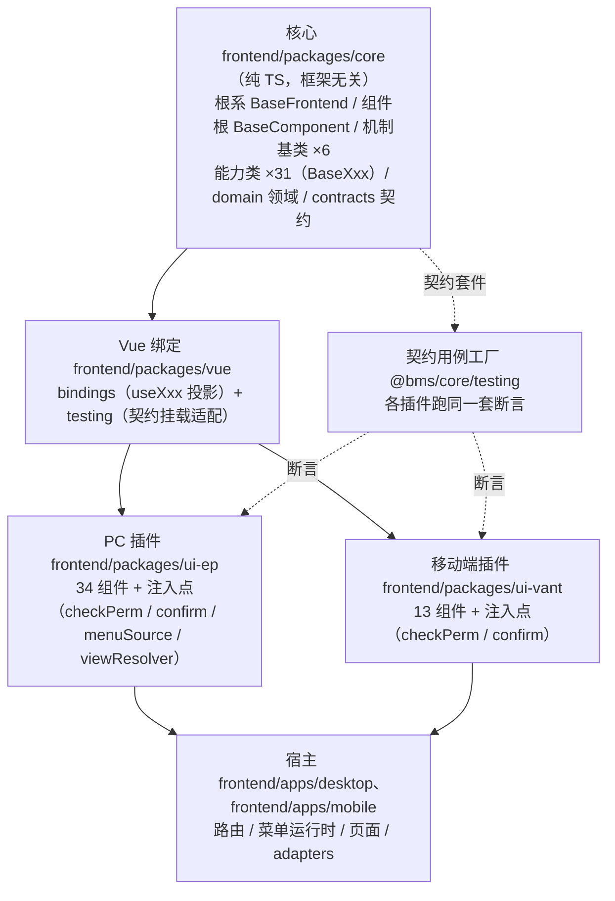

# 前端基类清单

> 前端基类权威清单：基类 / 能力类 / 投影与插件实现、职责、代码位置、依赖与状态（**开放扩展**，对齐后端基类体系；bms 权威源维护，产品经工作区符号链接引用）

[文档首页](文档首页.md) › 前端基类清单　|　[配套：《前端开发规范》](规范/前端开发规范.md) · [← 后端基类清单](后端基类清单.md)

## 1. 用途与维护 

- **定位**：前端基类**权威清单**——回答「有哪些基类 / 能力类 / 投影与插件实现、什么职责、代码在哪、是否已交付」。**强制用法口径与扩展规则**见《[前端开发规范](规范/前端开发规范.md)》「前端基类体系（开放式，强制）」节；体系机制见平台《[架构设计 · 前端组件体系](设计/架构设计/05_架构设计_前端组件体系.md)》；组件契约见《[组件设计 · 总览](设计/组件设计/01_组件设计_总览.md)》对应节点。
- **口径（新体系：纯 TS 核心 + 可替换渲染插件）**：前端基类分四层——**核心**（`frontend/packages/core`，纯 TS，框架无关）→ **Vue 绑定**（`frontend/packages/vue`，组合式投影 `useXxx`）→ **渲染插件**（`frontend/packages/ui-ep` / `ui-vant`，同契约多实现）→ **宿主装配**（`frontend/apps/desktop` / `apps/mobile`）。**能力 = 核心能力类（`BaseXxx extends BaseCapability`，登记于 `capabilities/manifest.ts`）+ 按需的 Vue 投影**；**同一契约多实现 + 契约测试同一套断言**（`@bms/core/testing`）替代原「双端同款」口径；公共字段/方法只在对应基类或能力类维护，任何组件与模块不得重复实现；**有新的能力就加一个能力类、有新的域语义就加一个域基类、体系级公共机制入机制基类，新增即登记**——不设层数 / 数量上限，不做封闭枚举（31 项为**预置能力**，开放集合）。
- **状态取值**：`已交付` / `部分` / `占位` / `待交付`；与平台架构节点登记一致。
- **维护（候选机制，对齐后端）**：新增/调整基类或能力须走「**候选 → 设计节点（组件设计）→ 评审确认 → 本清单登记 → 代码登记（`manifest.ts`）+ 契约用例**」，并同步《架构设计 · 前端组件体系》登记；状态列随实施回写。历史旧体系内容（`src/base`、`src/components/base` 能力层）已随移动端（S4c）与 PC 宿主（S6）删除，历史经 git 追溯（专项 `02_07`）。

## 2. 角色总览 

> **为何是「角色」而非「分层」**（对照《[后端基类清单](后端基类清单.md)》「分层总览」）：前端为**继承 + 组合双轨**——能力类是组合轨、**不在继承链上**（彼此无父子、可任意组合、不设层数上限），无法用「第几层」描述；故以「角色」（根系 / 组件根 / 机制基类 / 能力 / 域基类）表达职责定位。两套体系**同构**（根 → 组件根 / 模块基类 → 机制 / 横切 → 具体 + 旁路），关系链见『继承链与代码位置』节（口径见《[架构设计 · 前端组件体系](设计/架构设计/05_架构设计_前端组件体系.md)》「框架无关核心与插件架构」节）。

| 角色 | 内容 | 形态 | 依赖 | 代码位置 | 职责 | 状态 |
| --- | --- | --- | --- | --- | --- | --- |
| 根系 | `BaseFrontend`（+ 投影 `useFrontendBase`） | 类 + 组合式投影 | —（根） | `frontend/packages/core/src/base/BaseFrontend.ts`（投影 `frontend/packages/vue/src/bindings/useFrontendBase.ts`） | 一切前端基类之根：命名空间 / 版本、日志、错误上报、配置读取、生命周期钩子；不含 UI 或业务语义 | 已交付 |
| 组件根 | `BaseComponent`（+ 投影 `useComponentBase`） | 类 + 组合式投影 | 根系 | `frontend/packages/core/src/base/BaseComponent.ts`（投影 `frontend/packages/vue/src/bindings/useComponentBase.ts`） | 所有 UI 组件公共：标识与命名空间类名、尺寸/密度、`loading` / `disabled`、**令牌属性协议**（`data-size` / `data-density` / `aria-*` + 状态类）、attrs 透传（保留键过滤）、生命周期通知、**机制装配点 `mechanisms`** | 已交付 |
| 机制基类 | `BaseCapability` + 能力注册（`registerKnownCapabilities` / `knownCapabilitiesView` / `CapabilityRegistry`） | 类 + 注册表 | 组件根 | `frontend/packages/core/src/mechanisms/capability.ts`、`frontend/packages/core/src/capabilities/{manifest.ts,registry.ts}` | 能力组合的公共机制（`key` 声明 / 依赖登记 / 单向校验 / 开发告警 / 注册表登记）；供全部能力类复用（对齐后端 `BaseCapability`） | 已交付 |
| 机制基类 | `BasePlaceholder`（占位标记 / 空态·禁用·降级语义） | 类 | 组件根 | `frontend/packages/core/src/mechanisms/placeholder.ts` | **占位先行**承载：占位组件 / 能力统一标记与语义（三类原因 `pending` / `null` / `stub` × 三类降级；占位不请求）；对齐后端 `BasePlaceholder` / `BaseNullObject` / `BaseStub` | 已交付 |
| 机制基类 | `BaseAsyncResource`（登记 / 逆序释放 / 幂等 / 释放后拒绝登记） | 类 | 组件根 | `frontend/packages/core/src/mechanisms/resource.ts` | 异步资源生命周期（对齐后端 `BaseAsyncResource` / `ResourceManager`）；订阅 / 定时器 / AbortController 释放复用 | 已交付 |
| 机制基类 | `BaseSubscription`（事件订阅：注册 / 取消 / 占位总线） | 类（继承 `BaseAsyncResource`） | `BaseAsyncResource` | `frontend/packages/core/src/mechanisms/subscription.ts` | 事件订阅基座（对齐后端 `BaseEventWorker` / 事件域）；`topic` 点分小写同源后端事件表，来源解耦（占位总线 / 本地 / 实时），取消函数登记异步资源 | 已交付 |
| 机制基类 | `BaseRegistry<T>` + `RegistryItemLike`（唯一性拒重 / 未命中返回 `undefined` / 保序 / 只读快照） | 泛型类（独立，不入组件根继承链） | — | `frontend/packages/core/src/mechanisms/registry.ts` | 注册表基座（**命名按项目口径** `BaseRegistry` / `RegistryItemLike`，对齐后端同职责基类 `BaseProviderRegistry` / `BaseProvider`）；供能力 / 扩展点（路由·菜单、组件、字段渲染器、图标、工作台卡片）注册复用（域 10 微前端骨架） | 已交付 |
| 机制基类 | `BaseError` + `ErrorCodes`（错误码 + 用户提示 + 上报委托） | 类（`extends Error`） | —（挂接机制层，不入组件根继承链） | `frontend/packages/core/src/mechanisms/error.ts` | 前端异常基座（对齐后端 `BizError` 体系）；携带 `code` / `userMessage`，提示映射（i18n `error.{code}`）与上报委托宿主根系 | 已交付 |
| 能力（开放集合） | 预置 31 个能力类：`BaseValue` / `BaseFieldShell` / `BaseFieldPerm` / `BaseField` / `BaseInteractive` / `BaseInputControl` / `BaseDisplayControl` / `BaseContainer` / `BaseFormContainer` / `BaseMedia` / `BaseLayout` / `BaseTabs` / `BasePersistedState` / `BaseOptionSource` / `BaseUploadEngine` / `BaseAsyncTask` / `BaseEditorKernel` / `BaseTreeData` / `BaseUserDisplay` / `BaseDynamicRoutes` / `BaseFormMeta` / `BasePresignedUrl` / `BaseDragDrop` / `BaseDesignToken` / `BaseFormPage` / `BaseLocale` / `BaseAccess` / `BaseColumnConfig` / `BaseQueryScheme` / `BaseWatermark` / `BaseModuleContext` | 类（+ 按需组合式投影） | 组件根（+ 能力机制） | `frontend/packages/core/src/capabilities/<能力域>.ts`（一域一文件；登记表 `capabilities/manifest.ts`）；投影按需落 `frontend/packages/vue/src/bindings/useXxx.ts`（`useXxx` 只存在于此） | 每能力一类横切能力；组件按需组合多个（经投影）；**新增能力直接加文件 + 登记 + 契约用例**（§6 与 `manifest.ts` 同步） | 已交付 |
| 契约 / 领域层 | `contracts/`（能力与注入契约）+ `domain/`（滚动位置 / 尺寸 / 虚拟区 / 注入共享工厂） | 接口 / 类型 / 纯函数 | 核心内部 | `frontend/packages/core/src/contracts/`、`frontend/packages/core/src/domain/` | 渲染插件必须满足的稳定接口面（能力描述 / 绑定 / 确认 / 权限 / 菜单源 / 视图解析）与框架无关领域逻辑 | 已交付 |
| 契约用例工厂 | `@bms/core/testing`（`describeXxxContract` / 组件契约套件） | 测试工具（纯 TS） | 核心 | `frontend/packages/core/testing/` | 各插件对同一契约跑同一套断言——「同接口多实现」的机器保障 | 已交付 |
| 域基类（按需） | 原 4 件域包装（`BaseInput` / `BaseDisplay` / `BaseTree` / `BaseEditor` + `useXxxBase`）随旧层删除 | — | — | 域 05+ 回补波按新体系重建（核心能力 + 投影 + 插件包装） | 域语义归类与最终细化（可选派生，不强制固定长链）；**新增域按需登记** | 待交付（回补波） |
| 具体组件 | 布局 / 容器 / 菜单 / 标签 / 弹窗 / 反馈（PC 34 件）+ 容器 / 权限按钮 / 反馈件（移动端 13 件） | Vue 组件（挂组件根） | 能力 / 组件根 | `frontend/packages/{ui-ep,ui-vant}/src/components/<域>/` | 两端同契约多实现；域 05+（基础控件 / 字段 / 展示 / 交互）随各域任务交付 | 部分（域 02 ~ 04 已交付） |

> 关联机制（非基类）：前端扩展点与注册表基座（路由/菜单、组件、字段渲染器、图标、工作台卡片注册）见《[架构设计 · 前端架构](设计/架构设计/08_架构设计_前端架构.md)》「前端插件化与运行时组合」与需求域九（阶段四先行、阶段五运行时加载）。

## 3. 根系 根基类 

| 角色 | 基类 / 投影 | 形态 | 依赖 | 代码位置 | 职责 | 状态 |
| --- | --- | --- | --- | --- | --- | --- |
| 根系 | `BaseFrontend`（+ 投影 `useFrontendBase`） | 类 + 组合式投影 | —（根） | `frontend/packages/core/src/base/BaseFrontend.ts`；投影 `frontend/packages/vue/src/bindings/useFrontendBase.ts` | 一切前端基类之根：命名空间 / 版本、日志（`log`）、错误上报（`reportError`）、配置读取（`getConfig`）、生命周期钩子（`dispose`）；不含 UI 或业务语义 | 已交付 |

> 根系只放「所有基类共有」的横切能力，任何一方特有逻辑不得上提；组件根 `BaseComponent` 与契约/数据根（宿主 `BaseApi`）均自其派生。旧 `BaseFrontend.vue` / `BaseComponent.vue` 组件包装随旧层删除；模板层如需包装件，随域 05+ 回补波按新体系评估重建。

## 4. 组件根 

| 角色 | 基类 / 投影 | 形态 | 依赖 | 代码位置 | 职责 | 状态 |
| --- | --- | --- | --- | --- | --- | --- |
| 组件根 | `BaseComponent`（+ 投影 `useComponentBase`） | 类 + 组合式投影 | 根系 | `frontend/packages/core/src/base/BaseComponent.ts`；投影 `frontend/packages/vue/src/bindings/useComponentBase.ts` | 所有 UI 组件公共：标识（`identifier`）与命名空间类名（`nsClass`）、尺寸 / 密度、`loading` / `disabled`、令牌属性协议（`data-size` / `data-density` / `aria-*` + 状态类，`rootAttrs`）、attrs 透传（`passthroughAttrs` 保留键过滤）、运行期字段（`setProps`）、生命周期通知（`notifyLifecycle`）、机制装配点 `mechanisms` | 已交付 |

> 组件根公共能力细项：attrs 透传（`id` / `class` / `style` / `data-*`）与根元素约定；尺寸 `size` / 密度 `density` / 主题令牌消费（随亮暗与租户品牌自动适配）；生命周期埋点、错误上报、开发告警；可访问性（aria、键盘焦点）与 `expose` 规范；通用 `loading` / `disabled` / 显隐态。

## 5. 机制基类 

| 角色 | 基类 | 形态 | 依赖 | 代码位置 | 职责 | 状态 |
| --- | --- | --- | --- | --- | --- | --- |
| 能力机制 | `BaseCapability` + `CapabilityRegistry` + `registerKnownCapabilities` | 类 + 注册表 | 组件根 | `frontend/packages/core/src/mechanisms/capability.ts`、`capabilities/registry.ts` | 能力组合的公共机制（`key` 声明 / `depends` 登记 / 单向校验 / 开发态告警 / 注册表登记）；依赖登记表见『能力』节与 `capabilities/manifest.ts`；反向依赖校验由核心护栏把关 | 已交付 |
| 机制基类 | `BasePlaceholder`（占位标记 / 空态·禁用·降级语义） | 类 | 组件根 | `frontend/packages/core/src/mechanisms/placeholder.ts` | **占位先行**承载：占位组件 / 能力统一标记与语义（三类原因 `pending` / `null` / `stub` × 三类降级；占位不请求）；对齐后端 `BasePlaceholder` / `BaseNullObject` / `BaseStub` | 已交付 |
| 机制基类 | `BaseAsyncResource`（登记 / 逆序释放 / 幂等 / 释放后拒绝登记） | 类 | 组件根 | `frontend/packages/core/src/mechanisms/resource.ts` | 异步资源生命周期（对齐后端 `BaseAsyncResource` / `ResourceManager`）；订阅 / 定时器 / AbortController 释放复用 | 已交付 |
| 机制基类 | `BaseSubscription`（事件订阅） | 类（继承 `BaseAsyncResource`） | `BaseAsyncResource` | `frontend/packages/core/src/mechanisms/subscription.ts` | 事件订阅基座（对齐后端 `BaseEventWorker` / 事件域）；`topic` 点分小写同源后端事件表，来源解耦（占位总线 / 本地 / 实时），取消函数登记异步资源 | 已交付 |
| 机制基类 | `BaseRegistry<T>` + `RegistryItemLike` | 泛型类（独立，不入组件根继承链） | — | `frontend/packages/core/src/mechanisms/registry.ts` | 注册表基座（唯一性拒重 / 未命中返回 `undefined` / 保序 / 只读快照）；供能力与扩展点注册复用（域 10 微前端骨架） | 已交付 |
| 机制基类 | `BaseError` + `ErrorCodes` | 类（`extends Error`） | —（挂接机制层） | `frontend/packages/core/src/mechanisms/error.ts` | 前端异常基座（对齐后端 `BizError` 体系）；`code` / `userMessage`、提示映射与上报委托 | 已交付 |

> 机制基类由能力 / 组件根统一复用（能力经 `BaseCapability` 继承；注册与订阅等经工厂 / 实例装配）；旧 `usePlaceholderBase` / `useAsyncResourceBase` / `useRegistryBase` / `useSubscriptionBase` 组合式随旧层删除——如需新的组合式入口，按「核心类 + `@bms/vue` 投影」口径按需补（当前仅根系 / 组件根 / 值 / 字段 / 容器 / 页签 / 偏好 / 权限 / 动态路由 / 可视区有投影）。

## 6. 能力（开放集合，预置 31） 

`key` 为能力标识（代码侧权威表 `capabilities/manifest.ts` 的 `capabilityManifest`，模块加载即登记）；`depends` 为**能力→能力的单向依赖**（开发态校验依据；节点正文的「协作 / 消费」关系不入表）。「投影」列为 `@bms/vue` 中已提供的组合式（未列出的能力按需在组件内以 `createCapability` 实例化，或随使用方补投影）。

| 能力类 | key | depends | 投影（`@bms/vue`） | 职责 |
| --- | --- | --- | --- | --- |
| `BaseValue` | `value` | — | `useValue` | 值语义：值归一、格式化调度、三态、`change` 上报（输入与展示共用） |
| `BaseFieldShell` | `field-shell` | — | — | 字段壳：label / 必填 / 帮助 / 错误 / 栅格跨度 / 只读回显 |
| `BaseFieldPerm` | `field-perm` | — | — | 字段权限：`permVisible` / `editable` / `required` 三态 + 脱敏（元数据来源随后端接入） |
| `BaseField` | `field` | `value`、`field-shell`、`field-perm` | `useField` | 字段编排：组合值语义 + 字段壳 + 字段权限 + 校验触发 + `fieldKey` |
| `BaseInteractive` | `interactive` | — | — | 可点击组件的公共（loading / disabled / 防抖 / 危险确认 / 键盘触发 / 埋点） |
| `BaseInputControl` | `input-control` | — | — | 输入形态公共（受控绑定、清空、只读、composition、focus / blur），**不含表单字段语义** |
| `BaseDisplayControl` | `display-control` | — | — | 展示形态公共（密度、空值占位、省略 / tooltip、点击取值），**不含字段格式化编排** |
| `BaseContainer` | `container` | — | `useContainer` | 容器形态公共（插槽 / 折叠 / 分栏 / 区域令牌） |
| `BaseFormContainer` | `form-container` | — | — | 表单容器形态公共（label 位置与宽度 / 栅格 / 规则汇总 / 校验 / 错误定位 / 只读态） |
| `BaseMedia` | `media` | `presigned-url` | — | 媒体形态公共（加载状态机 / 宽高比 / 懒加载 / 过期重取 / 回退） |
| `BaseLayout` | `layout` | `design-token` | — | 布局形态公共（栅格 / 断点、间距 / 对齐令牌、根元素与透传、显隐） |
| `BaseTabs` | `tabs` | — | `useTabs` | 页签状态：打开 / 关闭 / 固定 / 缓存键清单（多标签导航、表单框架双层 Tab、内容页签共用） |
| `BasePersistedState` | `persisted-state` | — | `usePersistedState` | 偏好持久化：本地即时 + 远端偏好同步（`sys_user_preference` / `sys_query_scheme`；列配置、查询方案、偏好面板、主题与语言共用） |
| `BaseOptionSource` | `option-source` | `value` | — | 选项源：加载 / 缓存与版本比对 / 搜索 / 回显（字典、组织、枚举、树、级联共用；后端未接入占位降级） |
| `BaseUploadEngine` | `upload-engine` | `presigned-url` | — | 上传引擎：分片 / 秒传 / 断点续传 / 进度 / 取消（文件上传、富文本、头像、导入共用；占位降级） |
| `BaseAsyncTask` | `async-task` | — | — | 异步任务：提交 / 轮询进度（退避）/ 取消 / 结果下载（导入导出、报表与大屏导出共用；占位先行） |
| `BaseEditorKernel` | `editor-kernel` | — | — | 编辑器内核：懒加载 / 创建销毁 / 内容协议（CodeMirror 与富文本 / Markdown 共用） |
| `BaseTreeData` | `tree-data` | — | — | 树数据：加载 / 懒加载 / 选中 / 勾选 / 过滤（树选择、组织树、权限树、树形主从共用；归域基类「树域」） |
| `BaseUserDisplay` | `user-display` | — | — | 用户 / 组织展示：姓名 / 头像 / 状态 / 部门路径（头像组件、组织选择回显、审批流、通知共用） |
| `BaseDynamicRoutes` | `dynamic-routes` | — | `useDynamicRoutes` | 动态路由：菜单树 → 路由构建 / 注册 / 卸载（前端不硬编码路由表；配合宿主薄壳与注册表基座） |
| `BaseFormMeta` | `form-meta` | — | — | 表单元数据：加载 / 缓存 / 版本比对（菜单下发表单元数据；表单渲染器与设计器共用） |
| `BasePresignedUrl` | `presigned-url` | — | — | 预签名：获取 / 失效重取 / 降级下载（文件预览、下载、导出共用；占位降级） |
| `BaseDragDrop` | `drag-drop` | — | — | 拖拽基座：拖拽 / 排序 / 跨区（表单设计器、报表与大屏设计器、工作台卡片共用） |
| `BaseDesignToken` | `design-token` | — | — | 设计令牌消费：间距 / 色板 / 密度 / 断点 / 主题订阅（组件根令牌统一入口） |
| `BaseFormPage` | `form-page` | — | — | 表单页组合：三态（新增 / 编辑 / 详情）/ 提交 / 脏数据 / 返回（与 `useListPage` / `useFormModal` 对称） |
| `BaseLocale` | `locale` | — | — | 语言上下文：locale / 时区 / 格式上下文（切换与缓存；收敛时区格式化） |
| `BaseAccess` | `access` | — | `useAccess` | 权限上下文：权限码集合与判定（`has` / `hasAny` / `hasAll`）；路由·菜单过滤与按钮显隐由宿主 / 插件组合（占位空集） |
| `BaseColumnConfig` | `column-config` | `persisted-state` | — | 列配置：显隐 / 顺序 / 宽度 / 冻结 / 持久化（通用表格与明细区共用） |
| `BaseQueryScheme` | `query-scheme` | `persisted-state` | — | 查询方案：条件模型 / 方案保存·应用 / 参数化（`sys_query_scheme`；查询筛选区） |
| `BaseWatermark` | `watermark` | — | — | 水印：用户 / 租户信息注入（覆盖内容与导出；与打印导出共用） |
| `BaseModuleContext` | `module-context` | — | — | 上下文能力：宿主注入 router / store / i18n / 用户 / 租户（只读约束；能力侧统一入口） |

- 能力只描述「组件具备什么能力」，不绑定具体业务或页面语义；**新能力（如授权 `authorized`、订阅 `reactive`、缓存 `cacheable`）按需新增，不扩充封闭枚举**（新增即补 `manifest.ts`、本表与契约用例）。
- **占位先行**：依赖后端的能力（选项源 / 上传 / 异步任务 / 预签名 / 用户展示 / 表单元数据 / 偏好远端 / 权限码 / 动态路由菜单源）在后端就绪前按占位语义运行（不请求、空结果 / 降级 / 禁用态），占位契约纳入前端门禁。
- **上下文机制（非能力）**：字段壳 ↔ 控件的 `provide` / `inject` 通道（原 `useFieldContext`）随旧层删除，归域 05+ 回补波按新体系重建（拟落 `frontend/packages/vue/src/bindings/`，不占本表 `key`）。
- **旧口径对照**：原组合式（`useXxx` + `declareFragment` / `fragments.ts`）已类化为核心 `BaseXxx` + `@bms/vue` 投影；`useXxx` 命名仅保留在投影层（如 `useValue` / `useField`），旧组合式落点 `src/components/base/<能力域>/` 已删除。

## 7. 域基类（按需） 

| 域 | 形态（新体系） | 组合面 | 代码位置 | 说明 | 状态 |
| --- | --- | --- | --- | --- | --- |
| 输入域 | 核心能力 + 投影 + 插件包装（重建中） | `field` + `input-control`（+ 字段上下文，随回补波） | `frontend/packages/core/src/capabilities/{field,input-control,field-shell,field-perm}.ts` | 输入域最终细化，供基础控件类与字段类使用 | 能力已交付；域包装待重建 |
| 展示域 | 核心能力 + 投影 + 插件包装（重建中） | `value` + `display-control` | `frontend/packages/core/src/capabilities/{value,display-control}.ts` | 展示域细化，供展示类与字段只读回显使用 | 能力已交付；域包装待重建 |
| 树域 | 核心能力 + 投影 + 插件包装（重建中） | `tree-data` | `frontend/packages/core/src/capabilities/tree-data.ts` | 树选择 / 组织树 / 权限树 / 树形主从共用 | 能力已交付；域包装待重建 |
| 编辑器域 | 核心能力 + 投影 + 插件包装（重建中） | `editor-kernel` | `frontend/packages/core/src/capabilities/editor-kernel.ts` | CodeMirror 与富文本 / Markdown 共用 | 能力已交付；域包装待重建 |
| 图表域 | （规则与登记已就位） | （ECharts 独立分包） | 随图表卡任务 `07_06` 演练新增 | **实现随图表卡任务 `07_06` 交付**（契约见组件设计 04 节点） | 规则已交付（实现待回补波） |

> 域基类**框架无关**（核心能力 + 可替换渲染）；原 `BaseInput.vue` / `BaseDisplay.vue` / `BaseTree.vue` / `BaseEditor.vue` 与 `useXxxBase` 组合式随旧层删除（历史经 git 追溯），域 05+ 回补波按「核心能力 + `@bms/vue` 投影（+ 插件层包装）」重建。新增域按需新增并登记；域基类只做**语义归类**，组件组合能力即可工作（不强制经域基类）。

## 8. 契约与横切底座 

### 8.1 核心契约与领域层（`frontend/packages/core`）

| 项 | 形态 | 落点 | 职责 | 状态 |
| --- | --- | --- | --- | --- |
| `CapabilityDescriptor` / `RenderBinding` | 接口 / 类型 | `src/contracts/index.ts` | 能力描述契约（注册项下限）与渲染插件绑定契约 | 已交付 |
| `ConfirmOptions` / `ConfirmHandler` | 类型 + 共享工厂 | `src/contracts/confirm.ts`、`src/domain/confirm-service.ts` | 确认对话框契约（覆盖 / 恢复语义；默认实现由各插件提供） | 已交付 |
| `PermissionChecker` / `PermissionMode` | 类型 + 共享工厂 | `src/contracts/permission.ts`、`src/domain/permission-gate.ts` | 权限判定契约（空码放行 / 未注入拒绝语义） | 已交付 |
| `MenuItem` / `MenuSourceProvider` | 类型 + 共享工厂 | `src/contracts/menu-source.ts`、`src/domain/menu-source-service.ts` | 菜单状态契约（非受控模式宿主注入） | 已交付 |
| `ViewResolver<TView>` | 类型 + 共享工厂 | `src/contracts/view-resolver.ts`、`src/domain/view-resolver-service.ts` | 视图解析契约（泛型去 Vue，插件专化） | 已交付 |
| 领域共享逻辑 | 纯函数 / 工厂 | `src/domain/{scroll-position,size,virtual-range}.ts` | 滚动位置存储、尺寸解析、虚拟区计算（框架无关单实现） | 已交付 |
| 契约用例工厂 | 测试工具（仅测试消费） | `frontend/packages/core/testing/`（`@bms/core/testing`） | `describeConfirmContract` / `describePermissionContract` / 容器件与反馈件契约套件（各插件同一套断言） | 已交付 |

### 8.2 契约 / 数据根（宿主层）

| 项 | 形态 | 落点 | 职责 | 状态 |
| --- | --- | --- | --- | --- |
| `BaseEntity` / `BasePageQuery` | 接口 / 类 | `frontend/apps/*/src/api/types.ts` | 响应与分页实体契约 | 已交付 |
| `BaseApi` | 类（继承核心根系 `BaseFrontend`） | `frontend/apps/*/src/api/base.ts` | 模块 API 基类（路径前缀、请求方法、自动幂等键） | 已交付 |
| `createCrudStore` | 工厂 | `frontend/apps/*/src/stores/base.ts` | Pinia 通用 CRUD store 工厂 | 已交付 |
| `stableStringify` | 函数 | `frontend/apps/*/src/utils/serialize.ts` | 稳定序列化（缓存 key / 比对） | 已交付 |

> 均声明其与根系关系（`BaseApi` 继承核心 `BaseFrontend`；`request()` 业务错误与 401 经宿主根系上报）；两宿主各自维护，若后续需单实现，随请求层收口批次评估下沉。

### 8.3 横切底座（宿主层）

| 层 | 落点 | 内容 | 状态 |
| --- | --- | --- | --- |
| 请求层 | `frontend/apps/*/src/api/`、`src/utils/` | `adapter.ts`（适配注入）/ `error.ts`（`ApiError` 继承核心 `BaseError` + `errorMessage`）/ `request.ts` / `token.ts`（单飞刷新）/ `http.ts`（实例与拦截器）；组合式 `useRequest` / `useListPage` | 已交付 |
| 权限层 | `frontend/apps/*/src/{stores,stores/permission.ts,directives/perm.ts,utils/perm.ts}` | `usePermissionStore`（经 `@bms/vue` `useAccess` 投影）/ `v-perm`（判定经插件注入点 `checkPerm`）/ `hasPerm` / `canAccess` | 已交付 |
| 格式化层 | `frontend/apps/*/src/utils/{format,useTimezone,validators}.ts` | 格式化纯函数 + 默认基准注入 / 时区组合式 / 规则补强；名义格式化器注册表随展示域回补波重建 | 已交付 |
| 反馈状态机 | `frontend/apps/*/src/utils/useFeedback.ts` | `loading → ready / empty / error` 状态机（宿主级，两宿主同契约；复用本端 `useRequest` 与 `ApiError`） | 已交付 |

## 9. 目录与依赖 

> **现行结构（权威）**：单仓多包 workspace——核心 `frontend/packages/core`（纯 TS：base / mechanisms / capabilities / domain / contracts）+ Vue 绑定 `frontend/packages/vue`（bindings / testing）+ 渲染插件 `frontend/packages/ui-ep`（PC）/ `frontend/packages/ui-vant`（移动端）+ 宿主 `frontend/apps/desktop` / `frontend/apps/mobile`（装配）。旧体系（`src/base` 与 `src/components/base` 能力层）已删除（历史经 git 追溯）；依赖方向与护栏见《[前端开发规范](规范/前端开发规范.md)》§3。

| 层 | 路径 | 内容 / 状态 |
| --- | --- | --- |
| 核心（新体系） | `frontend/packages/core/src/` | base（`BaseFrontend` / `BaseComponent` / `observable`）/ mechanisms（`BaseCapability` / `BasePlaceholder` / `BaseAsyncResource` / `BaseSubscription` / `BaseRegistry` / `BaseError`）/ capabilities（31 能力类 + `manifest.ts` 登记）/ domain（滚动位置 / 尺寸 / 虚拟区 / 注入共享工厂）/ contracts（能力与注入契约）；护栏 `guard-core-framework-agnostic` |
| Vue 绑定（新体系） | `frontend/packages/vue/src/bindings/` | 组合式投影（`useValue` / `useField` / `useContainer` / `useTabs` / `usePersistedState` / `useVirtualRange` / `useAccess` / `useFrontendBase` / `useComponentBase` / `useDynamicRoutes`）；契约挂载适配 `@bms/vue/testing` |
| 契约用例工厂 | `frontend/packages/core/testing/` | `describeConfirmContract` / `describePermissionContract` / 容器件 + 权限按钮 + 反馈件契约套件（`@bms/core/testing`，各插件跑同一套断言） |
| PC 插件（新体系） | `frontend/packages/ui-ep/src/` | 具体组件（34 件，S3 全量迁入；旧件目录 S5c 已删除）+ 注入点（`checkPerm` / `confirm` / `menuSource` / `viewResolver`）——`import … from '@bms/ui-ep'` |
| 移动端插件（新体系） | `frontend/packages/ui-vant/src/` | 移动端组件（13 件：容器 8 + 权限按钮 + 反馈件 4（03-2-1）；S4b 建立 / 03-2-1 补齐）+ 注入点（`checkPerm` / `confirm`）——`import … from '@bms/ui-vant'`；与 `ui-ep` 同契约（契约套件同一套断言） |
| 设计令牌 | `frontend/apps/{desktop,mobile}/src/styles/tokens.scss` | 基础令牌五组（色 / 字 / 间距 / 圆角 / 阴影，`--bms-*`）+ size / density 档位 + 语义变量 + 属性协议选择器 + 组件库映射（PC=Element Plus、移动端=Vant）（**基础令牌已交付** `03_06`；令牌化下沉 `frontend/packages/vue/styles` 与暗色主题 / 品牌覆盖随品牌化任务评估） |
| 宿主装配（新体系） | `frontend/apps/desktop/`、`frontend/apps/mobile/` | 路由 / 菜单运行时（`@bms/vue` `useDynamicRoutes`）/ 页面 / `adapters/`（注入接线 + 宿主根系出口）；请求 / 权限 / 格式化层在宿主侧（判定经插件注入点） |

- **依赖方向（强制）**：宿主 → 插件（`ui-ep` / `ui-vant` / `vue`）→ 核心（`core`）；核心不得依赖 Vue / UI 库 / 插件 / 宿主（护栏 `guard-core-framework-agnostic`）；插件之间不互相依赖；能力之间依赖须单向并登记（`manifest.ts`）。**层次由依赖关系决定，不设层数上限**（继承链与组合依赖链见「继承链与代码位置」节）。
- **命名**：基类组件 `BaseXxx`（核心类与锚点常量）、投影 `useXxx`（仅 `frontend/packages/vue/src/bindings/`）、宿主组合式 `useXxxBase` 视需要另评；遵循《[命名规范](规范/命名规范.md)》「前端命名」节；字段 / 方法用统一前缀（如 `base` / `$`）。
- **同一契约多实现**：`frontend/packages/ui-ep` / `frontend/packages/ui-vant` 为同一契约的两个实现（不要求字节级同款），一致性由 `@bms/core/testing` 契约用例工厂（同一套断言）与 core 共享逻辑保证；新增基础能力先落 core / vue，再按需在各插件实现并跑契约套件（见《[前端开发规范](规范/前端开发规范.md)》§3）。

## 10. 继承链与代码位置 

> 前端不做固定层号（见『角色总览』节命名理由），继承关系以「**继承链 + 组合依赖链**」双轨表达：**身份经继承（类）、横切能力经组合（能力 + 投影）**——与《[后端基类清单](后端基类清单.md)》「继承链与代码位置」节同构（后端为类单轨，前端为类 + 能力双轨）。

- **继承链（类，身份轨）**：
  - `BaseComponent → BaseFrontend`（组件根挂根系）。
  - 能力类 `BaseXxx → BaseCapability → BaseComponent`（31 项在 `capabilities/` 一类一文件、登记于 `manifest.ts`）。
  - 机制基类 `BasePlaceholder` / `BaseAsyncResource` → `BaseComponent`；`BaseSubscription → BaseAsyncResource`。
  - `BaseRegistry<T>` 为独立泛型类（不入组件根继承链；能力注册表 `CapabilityRegistry` 基于它扩展）。
  - `BaseError → Error`（前端错误基座，挂接机制层，与后端 `BizError` 同口径）；宿主 `ApiError → BaseError`。
- **组合依赖链（能力 + 投影，组合轨）**：
  - 具体组件 → 组件根 + 按需能力：`useComponentBase()`（`@bms/vue`）+ `useXxx()`（投影）/ `createCapability()`（核心实例化）——**不经域基类亦合法**（组合轨默认；域基类只是可选语义归类）。
  - 能力之间**单向**（`depends` 登记，权威表 `capabilities/manifest.ts` 与 §6）、**无环**、不得依赖上层；核心护栏扫 import 方向。
  - 投影（`frontend/packages/vue/src/bindings/useXxx.ts`）只做「核心实例 ↔ Vue 响应式」桥接，不重复实现能力逻辑。
- **具体组件挂接**（代码位置）：
  - PC 插件 34 件（`frontend/packages/ui-ep/src/components/{layout,container,menu,tabs,modal,feedback,common}/`）：`useComponentBase`（组件根）——S3 全量迁入时逐件保持组件根挂接；旧件（原 `frontend/apps/desktop/src/components/*`）S5c 已删除（历史经 git 追溯）。
  - 移动端插件 13 件（`frontend/packages/ui-vant/src/components/{container,common,feedback}/`：容器 8 + `PermButton` + 反馈件 4）：S4b / 03-2-1 迁入补齐（`PermButton` 判定经插件注入点 `checkPerm`）；与 `ui-ep` 同契约，契约套件（`@bms/core/testing`）双实现同一套断言全绿。
  - 域 05+（基础控件 / 字段 / 展示 / 交互）与域包装：随各域任务按「核心能力 + 投影 + 插件实现」交付。
- **目录**：核心在 `frontend/packages/core/src/`（base / mechanisms / capabilities / domain / contracts；测试工具 `frontend/packages/core/testing/`）；Vue 投影在 `frontend/packages/vue/src/bindings/`；具体组件在各插件 `frontend/packages/{ui-ep,ui-vant}/src/components/<域>/`；宿主装配在 `frontend/apps/{desktop,mobile}/`。
- **权威校验**：
  - `frontend/packages/core/tests/guard-core-framework-agnostic.spec.ts`：核心零框架依赖 + 包依赖面为空（护栏）；
  - `frontend/packages/core/testing/`：契约用例工厂（各插件 spec 跑同一套断言：确认 / 权限 / 容器件 / 权限按钮 / 反馈件）；
  - 旧双端 `guard-*`（继承 / 依赖 / 清单对账）随旧层删除；**清单 ↔ 代码对账护栏**（新体系版）列入域 05+ 前的工程化待办（候选，见 §12）。

## 11. 扩展与演进 

- **新增能力 → 核心能力类 + 登记（+ 按需投影）**：正交、可组合；新增域语义 → 新增域基类（核心能力 + 投影 + 插件包装）；机制变更 → 改机制基类（须评估全链影响）。三者均**不改封闭枚举、不设上限**。
- **新增即登记**：候选 → 组件设计节点（契约与原型）→ 评审确认 → 本清单登记 → 代码登记（`capabilities/manifest.ts`）+ 契约用例 → 《架构设计 · 前端组件体系》同步；未登记的能力不得散落在具体组件内重复实现。
- **兼容性**：新增能力 / 基类为兼容变更；调整既有能力契约（行为 / 参数 / 事件）须评估使用方并升**主版本**标注（组件设计节点与本清单同步）。
- **新增演练（可执行步骤，随每次新增执行）**：① **候选**（满足「多模块复用 + 接口可定 / 可占位」）；② **设计节点**（《组件设计》契约 + 可交互原型）；③ **评审**确认（question 逐项）；④ **登记**（本清单 §6 + `manifest.ts`）；⑤ **护栏**通过（核心护栏 + 契约用例 + 本项新增的组件契约用例）；⑥ **消费方**回引（任务文档补「前置契约（已交付）」）。真实案例：`02_07` S4a（共享逻辑与注入契约下沉核心）、S4b（`ui-vant` 9 件同契约实现）、03-2-1（移动端反馈件四件 + 契约套件）均按此链路交付。

**示例（本体系已发生的真实演进）**：最初「输入 / 展示」在形态与域两处出现、职责打架——「形态」讲组件长什么样，「域」讲表单字段怎么用。处理方式是**把冲突职责拆成独立能力**：`value`（值归一 / 格式化 / 三态 / `change`）与 `field`（字段编排：壳 + 权限 + 校验），域基类只做域内细化。后续出现新横切职责时按同一办法新增能力（如 `authorized` / `reactive` / `cacheable`），**不动既有能力**。

## 12. 维护约定 

- **同步范围**：新增 / 调整基类或能力须同步本清单（角色总览表与章节）+ 组件设计对应节点（契约与原型）+ 平台《架构设计 · 前端组件体系》登记。
- **护栏**：核心框架无关由 `guard-core-framework-agnostic`（`frontend/packages/core/tests/`）随 CI `core-check` 校验；**「同接口多实现」由契约用例工厂 `@bms/core/testing` 保证**（各插件 spec 跑同一套断言）；本清单与代码的双向对账护栏（漏登记 / 僵尸条目）待按新体系重建（候选：扫 `manifest.ts` ↔ 本清单 §6 与插件导出 ↔ 组件清单）。
- **机制未挂接评估**：保持**开发态告警**、不升级构建期硬失败（能力允许脱离组件根独立实例化；再评估条件随新护栏批次）。
- **状态回写**：实施完成后回写本清单「状态」列与平台架构节点；待交付项（域 05+ / 域包装重建 / 图表卡）随前端阶段更新。
- **口径唯一**：强制用法与扩展流程以《[前端开发规范](规范/前端开发规范.md)》「前端基类体系（开放式，强制）」节为准；基类 / 能力是否存在、什么角色、代码位置以本清单为准。

> 前端基类权威清单 · 与《前端开发规范》配套 · 与《后端基类清单》对称（开放扩展口径一致）
