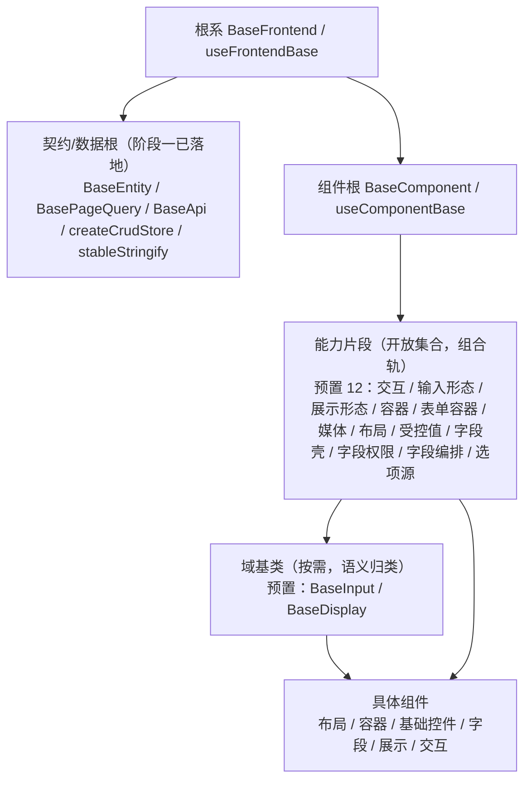

# 前端基类清单

> 前端基类权威清单：基类角色（根系 / 组件根 / 能力片段 / 域基类）、职责、代码位置、依赖与状态（**开放扩展**，对齐后端基类体系；bms 权威源维护，产品经工作区符号链接引用）

[文档首页](文档首页.md) › 前端基类清单　|　[配套：《前端开发规范》](规范/前端开发规范.md) · [← 后端基类清单](后端基类清单.md)

## 1. 用途与维护 

- **定位**：前端基类**权威清单**——回答「有哪些基类 / 能力片段、什么职责、代码在哪、是否已交付」。**强制用法口径与扩展规则**见《[前端开发规范](规范/前端开发规范.md)》「前端基类体系（开放式，强制）」节；体系机制见平台《[架构设计 · 前端组件体系](设计/架构设计/05_架构设计_前端组件体系.md)》；组件契约见《[组件设计 · 总览](设计/组件设计/01_组件设计_总览.md)》对应节点。
- **口径（开放扩展，对齐后端基类体系）**：前端基类按**角色**组织——**根系 → 组件根 → 能力片段（开放集合，组合轨）→ 域基类（按需）**；**公共字段/方法只在对应基类或能力片段维护，任何组件与模块不得重复实现**；**有新的能力就加一个片段、有新的域语义就加一个域基类，新增即登记**——不设层数 / 数量上限，不做封闭枚举（七形态仅为**预置片段**）。
- **状态取值**：`已交付` / `部分` / `占位` / `待交付`；与平台架构节点登记一致。
- **维护（候选机制，对齐后端）**：新增/调整基类或片段须走「**候选 → 设计节点（组件设计）→ 评审确认 → 本清单登记**」，并同步《架构设计 · 前端组件体系》登记；状态列随实施回写。

## 2. 角色总览 

| 角色 | 基类 / 片段 | 形态 | 依赖 | 代码位置 | 职责 | 状态 |
| --- | --- | --- | --- | --- | --- | --- |
| 根系 | `BaseFrontend` + `useFrontendBase` | 类 + 组合式 | —（根） | `src/base/base.ts`（规划） | 一切前端基类之根：通用字段（命名空间、版本/标识）与通用方法（日志、错误上报、配置/环境读取、i18n、生命周期钩子）；不含 UI 或业务语义 | 待交付 |
| 契约/数据根 | `BaseEntity` / `BasePageQuery` / `BaseApi` / `createCrudStore` / `stableStringify` | 接口 / 类 / 工厂 | 根系 | `src/api/types.ts`、`src/api/base.ts`、`src/stores/base.ts`、`src/utils/serialize.ts` | 响应与实体契约、请求封装、CRUD store 工厂、稳定序列化 | 部分（阶段一已落地） |
| 组件根 | `BaseComponent` + `useComponentBase` | 类 + 组合式 | 根系 | `src/base/component.ts`（规划） | 所有 UI 组件公共：attrs 透传与根元素约定、尺寸/密度/主题令牌、i18n 与命名空间、生命周期与埋点、可访问性（aria / 焦点）与 `ref` / `expose`、通用 `loading` / `disabled` / 显隐 | 待交付 |
| 片段机制 | `useCapabilityBase`（组合轨辅助：片段声明 / 依赖登记 / 契约校验） | 组合式 | 组件根 | `src/base/capability.ts`（规划） | 片段组合的公共机制（登记、依赖单向校验、开发告警），供全部能力片段复用 | 待交付 |
| 机制基类 | `BasePlaceholder` + `usePlaceholder`（占位标记 / `describe` / 空态·禁用·降级语义） | 类 + 组合式 | 组件根 | `src/base/placeholder.ts`（规划） | **占位先行**承载：占位组件 / 片段统一标记与语义（对齐后端 `BasePlaceholder` / `BaseNullObject`） | 待交付 |
| 机制基类 | `useAsyncResource`（订阅 / 定时器 / AbortController 自动释放，`onScopeDispose`） | 组合式 | 组件根 | `src/base/resource.ts`（规划） | 异步资源生命周期（对齐后端 `BaseAsyncResource`）；组件卸载自动清理 | 待交付 |
| 机制基类 | `BaseRegistry` + `BaseRegistryItem`（注册项 `key` + `describe`；唯一性 / 未命中 / 查询） | 类 + 组合式 | 组件根 | `src/base/registry.ts`（规划） | 通用注册表基座（对齐后端 `BaseProviderRegistry` / `BaseProvider`）；供路由·菜单、组件、字段渲染器、图标、工作台卡片注册复用（09-2） | 待交付 |
| 机制基类 | `BaseError`（错误码 + 用户提示映射 + 上报钩子） | 类 | 组件根 | `src/base/error.ts`（规划） | 前端异常基座（对齐后端 `BizError` 体系）；统一错误边界与提示口径 | 待交付 |
| 机制基类 | `useSubscription`（事件订阅：注册 / 取消 / 占位实现） | 组合式 | 组件根 | `src/base/subscription.ts`（规划） | 事件订阅基座（对齐后端事件域）；解耦具体来源（socket / store），便于占位与替换 | 待交付 |
| 能力片段（开放集合） | 预置 12：`useInteractive` / `useInputControl` / `useDisplayControl` / `useContainer` / `useFormContainer` / `useMedia` / `useLayout` / `useValue` / `useFieldShell` / `useFieldPerm` / `useField` / `useOptionSource` | 组合式（正交可组合） | 组件根（+ 片段机制） | `src/components/base/<能力域>/index.ts`（规划） | 每片段一类横切能力；组件按需组合多个；**新增片段直接加文件 + 登记** | 待交付 |
| 域基类（按需） | 预置 `BaseInput`（输入域）/ `BaseDisplay`（展示域）；示例新增 `BaseTree`（树域：树选择 / 组织树 / 权限树共用）/ `BaseChart`（图表域，随图表卡）；后续如 `BaseEditor` 等按需 | 组合式 + 组件 | 片段组合 | 同上（`<能力域>/`） | 域语义归类与最终细化（可选派生，不强制固定长链）；**新增域按需登记** | 待交付 |
| — | 具体组件 | — | 片段 / 域基类 | `src/components/` | 布局 / 容器 / 基础控件 / 字段 / 展示 / 交互 | — |

> 关联机制（非基类）：前端扩展点与注册表基座（路由/菜单、组件、字段渲染器、图标、工作台卡片注册）见《[架构设计 · 前端架构](设计/架构设计/08_架构设计_前端架构.md)》「前端插件化与运行时组合」与需求域九（阶段四先行、阶段五运行时加载）。

## 3. 根系与组件根 

- **根系 `BaseFrontend`**：一切基类（含契约/数据根 `BaseApi`、组件根 `BaseComponent`）从其派生；只放「所有基类共有」的横切能力，任何一方特有逻辑不得上提。**不含 UI 或业务语义**。
- **组件根 `BaseComponent`**：所有 UI 组件公共能力——
  - attrs 透传（`id` / `class` / `style` / `data-*`）与根元素约定；
  - 尺寸 `size` / 密度 `density` / 主题令牌消费（随亮暗与租户品牌自动适配）；
  - i18n 取词与样式命名空间 / 前缀；
  - 生命周期埋点、错误上报、开发告警；
  - 可访问性（aria、键盘焦点）与 `ref` / `expose` 规范；
  - 通用 `loading` / `disabled` / 显隐态。
- **片段机制 `useCapabilityBase`**：片段组合的公共约定（片段标识 / 依赖声明 / 单向依赖校验 / 开发态告警），避免各片段各写一套。

## 4. 契约/数据根（阶段一已落地） 

- `BaseEntity` / `BasePageQuery`：响应与分页实体契约；
- `BaseApi`：模块 API 基类（统一路径前缀与请求方法，响应按 `{code, message, data}` 解析）；
- `createCrudStore`：Pinia 通用 CRUD store 工厂；
- `stableStringify`：稳定序列化（缓存 key / 比对）。
- 已落地于 `src/api/`、`src/stores/`、`src/utils/`，统一声明其继承自根系；**本阶段不重复建设**。

## 5. 能力片段（开放集合，预置 11） 

| 片段 | 职责 |
| --- | --- |
| `useInteractive` | 可点击组件的公共（loading / disabled / 焦点 / 键盘触发） |
| `useInputControl` | 输入形态公共（值绑定、前后缀插槽、清空、只读），**不含表单字段语义** |
| `useDisplayControl` | 展示形态公共（密度、令牌、空值、省略），**不含字段格式化编排** |
| `useContainer` | 容器形态公共（插槽 / 折叠 / 分栏 / 区域） |
| `useFormContainer` | 表单容器形态公共（表单 / 分区 / 校验汇总） |
| `useMedia` | 媒体形态公共（图片 / 音视频 / 文件预览） |
| `useLayout` | 布局形态公共（栅格 / 断点、间距 / 对齐令牌、根元素与透传、显隐） |
| `useValue` | 值语义：值归一、格式化调度、三态、`change` 上报（输入与展示共用） |
| `useFieldShell` | 字段壳：label / 必填 / 帮助 / 错误 / 栅格跨度 / 只读回显 |
| `useFieldPerm` | 字段权限：`visible` / `editable` / `required` / 脱敏（`v-plain`） |
| `useField` | 字段编排：组合值语义 + 字段壳 + 字段权限 + 校验触发 + `fieldKey` |
| `useOptionSource` | 远程选项源：加载 / 缓存与版本比对 / 搜索 / 回显（字典、组织、枚举、树、级联共用；依赖后端能力占位降级） |

- 片段只描述「组件具备什么能力」，不绑定具体业务或页面语义；**新能力（如授权 `useAuthorized`、订阅 `useReactive`、缓存 `useCacheable`）按需新增，不扩充封闭枚举**。

## 6. 域基类（按需） 

- `BaseInput`（输入域）：组合 `useInputControl` + `useField`，做输入域最终细化，供基础控件类与字段类使用。
- `BaseDisplay`（展示域）：组合 `useDisplayControl` + `useValue`，做展示域细化，供展示类与字段只读回显使用。
- 新增域（如 `BaseChart` / `BaseEditor`）按需新增并登记；域基类只做**语义归类**，组件组合片段即可工作。

## 7. 目录与依赖 

- **机制层**：`src/base/`——`base.ts`（根系）/ `component.ts`（组件根）/ `capability.ts`（片段机制）/ `placeholder.ts` / `resource.ts` / `registry.ts` / `error.ts` / `subscription.ts`（机制基类）；
- **能力片段与域基类**：`src/components/base/<能力域>/index.ts`（一案一域，新增即加目录 / 文件 + 登记）；
- **契约/数据根**：`src/api/`、`src/stores/`、`src/utils/`；
- **依赖方向**：只准上层依赖下层（具体组件 → 域基类 / 片段 → 组件根 → 根系）；基类不得依赖具体组件；片段之间依赖须单向并登记。**层次由依赖关系决定，不设层数上限**。
- **命名**：基类组件 `BaseXxx`、组合式 `useXxxBase` / `useXxx` 遵循《[命名规范](规范/命名规范.md)》「前端命名」节；字段 / 方法用统一前缀（如 `base` / `$`）。
- **双端同款基线**：frontend 与 frontend-mobile 同步扩展，不得只在单端加基类能力。

## 8. 扩展与演进 

- **新增能力 → 新增片段**：正交、可组合；新增域语义 → 新增域基类；机制变更 → 改根系 / 组件根（须评估全链影响）。三者均**不改封闭枚举、不设上限**。
- **新增即登记**：候选 → 组件设计节点（契约与原型）→ 评审确认 → 本清单登记 → 《架构设计 · 前端组件体系》同步；未登记的能力不得散落在具体组件内重复实现。
- **兼容性**：新增片段 / 基类为兼容变更；调整既有片段契约（行为 / 参数 / 事件）须评估使用方并升**主版本**标注（组件设计节点与本清单同步）。

**示例（本体系已发生的真实演进）**：最初「输入 / 展示」在形态与域两处出现、职责打架——「形态」讲组件长什么样，「域」讲表单字段怎么用。处理方式是**把冲突职责拆成独立片段**：`useValue`（值归一 / 格式化 / 三态 / `change`）与 `useField`（字段编排：壳 + 权限 + 校验），域基类只做域内细化。后续出现新横切职责时按同一办法新增片段（如 `useAuthorized` / `useReactive` / `useCacheable`），**不动既有片段**。

## 9. 维护约定 

- **同步范围**：新增 / 调整基类或片段须同步本清单（角色总览表与章节）+ 组件设计对应节点（契约与原型）+ 平台《架构设计 · 前端组件体系》登记。
- **状态回写**：实施完成后回写本清单「状态」列与平台架构节点；待交付项随前端阶段更新。
- **口径唯一**：强制用法与扩展流程以《[前端开发规范](规范/前端开发规范.md)》「前端基类体系（开放式，强制）」节为准；基类 / 片段是否存在、什么角色、代码位置以本清单为准。

> 前端基类权威清单 · 与《前端开发规范》配套 · 与《后端基类清单》对称（开放扩展口径一致）
