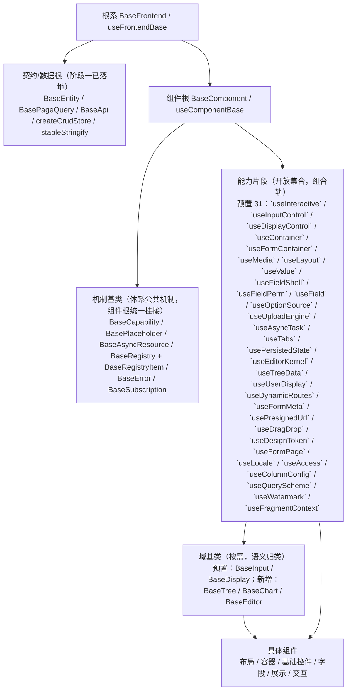

# 前端基类清单

> 前端基类权威清单：基类角色（根系 / 组件根 / 能力片段 / 域基类）、职责、代码位置、依赖与状态（**开放扩展**，对齐后端基类体系；bms 权威源维护，产品经工作区符号链接引用）

[文档首页](文档首页.md) › 前端基类清单　|　[配套：《前端开发规范》](规范/前端开发规范.md) · [← 后端基类清单](后端基类清单.md)

## 1. 用途与维护 

- **定位**：前端基类**权威清单**——回答「有哪些基类 / 能力片段、什么职责、代码在哪、是否已交付」。**强制用法口径与扩展规则**见《[前端开发规范](规范/前端开发规范.md)》「前端基类体系（开放式，强制）」节；体系机制见平台《[架构设计 · 前端组件体系](设计/架构设计/05_架构设计_前端组件体系.md)》；组件契约见《[组件设计 · 总览](设计/组件设计/01_组件设计_总览.md)》对应节点。
- **口径（开放扩展，对齐后端基类体系）**：前端基类按**角色**组织——**根系 → 组件根 → 机制基类 / 能力片段（开放集合，组合轨）→ 域基类（按需）**；**继承承载身份与家族契约、组合承载正交横切能力**（分工与禁止见《[前端开发规范](规范/前端开发规范.md)》§3.1 / §3.4）；**公共字段/方法只在对应基类或能力片段维护，任何组件与模块不得重复实现**；**有新的能力就加一个片段、有新的域语义就加一个域基类、体系级公共机制入机制基类，新增即登记**——不设层数 / 数量上限，不做封闭枚举（七形态仅为**预置片段**）。
- **状态取值**：`已交付` / `部分` / `占位` / `待交付`；与平台架构节点登记一致。
- **维护（候选机制，对齐后端）**：新增/调整基类或片段须走「**候选 → 设计节点（组件设计）→ 评审确认 → 本清单登记**」，并同步《架构设计 · 前端组件体系》登记；状态列随实施回写。

## 2. 角色总览 

| 角色 | 基类 / 片段 | 形态 | 依赖 | 代码位置 | 职责 | 状态 |
| --- | --- | --- | --- | --- | --- | --- |
| 根系 | `BaseFrontend` + `useFrontendBase`（+ 可选组件包装 `BaseFrontend.vue`） | 类 + 组合式 + 组件 | —（根） | `src/base/BaseFrontend.ts`、`src/base/useFrontendBase.ts`、`src/base/BaseFrontend.vue` | 一切前端基类之根：通用字段（命名空间、版本/标识）与通用方法（日志、错误上报、配置/环境读取、i18n、生命周期钩子）；不含 UI 或业务语义 | 已交付 |
| 契约/数据根 | `BaseEntity` / `BasePageQuery` / `BaseApi` / `createCrudStore` / `stableStringify` | 接口 / 类 / 工厂 | 根系 | `src/api/types.ts`、`src/api/base.ts`、`src/stores/base.ts`、`src/utils/serialize.ts` | 响应与实体契约、请求封装、CRUD store 工厂、稳定序列化 | 部分（阶段一已落地） |
| 组件根 | `BaseComponent` + `useComponentBase`（+ 可选组件包装 `BaseComponent.vue`） | 类 + 组合式 + 组件 | 根系 | `src/base/BaseComponent.ts`、`src/base/useComponentBase.ts`、`src/base/BaseComponent.vue` | 所有 UI 组件公共：attrs 透传与根元素约定、尺寸/密度与**令牌属性协议**（`data-size` / `data-density` / `data-test` / `aria-*` + 状态类）、i18n 与命名空间、生命周期与埋点、可访问性与 `expose`、通用 `loading` / `disabled` / 显隐、**机制装配点 `mechanisms`** | 已交付 |
| 片段机制 | `BaseCapability` + `useCapabilityBase`（组合轨机制：片段声明 / 依赖登记 / 单向校验 / 开发告警） | 类 + 组合式 | 组件根 | `src/base/capability.ts` | 片段组合的公共机制（声明 / 依赖登记 / 单向校验 / 开发告警），供全部能力片段复用（对齐后端 `BaseCapability`）；**依赖登记表见 §5**，反向依赖校验归 `02_05` 静态护栏 | 已交付 |
| 机制基类 | `BasePlaceholder` + `usePlaceholderBase`（占位标记 / `describe` / 空态·禁用·降级语义） | 类 + 组合式 | 组件根 | `src/base/placeholder.ts` | **占位先行**承载：占位组件 / 片段统一标记与语义（三类原因 `pending` / `null` / `stub` × 三类降级；占位不请求）；对齐后端 `BasePlaceholder` / `BaseNullObject` / `BaseStub` | 已交付 |
| 机制基类 | `BaseAsyncResource` + `useAsyncResourceBase`（订阅 / 定时器 / AbortController 自动释放，`onScopeDispose`） | 类 + 组合式 | 组件根 | `src/base/resource.ts` | 异步资源生命周期（登记 / 逆序释放 / 幂等 / 释放后拒绝登记；对齐后端 `BaseAsyncResource` / `ResourceManager`）；组件卸载自动清理 | 已交付 |
| 机制基类 | `BaseRegistry` + `BaseRegistryItem` + `useRegistryBase`（注册项 `key` + `describe`；唯一性拒重 / 未命中返回 `undefined` / 保序 / 只读快照，组合轨） | 类 + 组合式 | 组件根 | `src/base/provider.ts` | 注册表基座（**命名按项目口径** `BaseRegistry` / `BaseRegistryItem`，对齐后端同职责基类 `BaseProviderRegistry` / `BaseProvider`）；供路由·菜单、组件、字段渲染器、图标、工作台卡片注册复用（域 10 微前端骨架） | 已交付 |
| 机制基类 | `BaseError`（错误码 + 用户提示映射 + 上报钩子） | 类（`extends Error`） | 组件根（挂接机制层） | `src/base/error.ts` | 前端异常基座（对齐后端 `BizError` 体系）；统一响应解析、提示映射（i18n `error.{code}`）与上报委托 | 已交付 |
| 机制基类 | `BaseSubscription` + `useSubscriptionBase`（事件订阅：注册 / 取消 / 占位实现） | 类 + 组合式 | 组件根 | `src/base/subscription.ts` | 事件订阅基座（对齐后端 `BaseEventWorker` / 事件域）；`topic` 点分小写同源后端事件表，来源解耦（占位总线 / 本地 / 实时），取消函数登记异步资源 | 已交付 |
| 能力片段（开放集合） | 预置 31：`useInteractive` / `useInputControl` / `useDisplayControl` / `useContainer` / `useFormContainer` / `useMedia` / `useLayout` / `useValue` / `useFieldShell` / `useFieldPerm` / `useField` / `useOptionSource` / `useUploadEngine` / `useAsyncTask` / `useTabs` / `usePersistedState` / `useEditorKernel` / `useTreeData` / `useUserDisplay` / `useDynamicRoutes` / `useFormMeta` / `usePresignedUrl` / `useDragDrop` / `useDesignToken` / `useFormPage` / `useLocale` / `useAccess` / `useColumnConfig` / `useQueryScheme` / `useWatermark` / `useFragmentContext` | 组合式（正交可组合） | 组件根（+ 片段机制） | `src/components/base/<能力域>/useXxx.ts`（一域一目录 + 域内 `index.ts`；总出口 `src/components/base/index.ts`） | 每片段一类横切能力；组件按需组合多个；**新增片段直接加文件 + 登记**（`fragments.ts` 与 §5 同步） | 已交付 |
| 域基类（按需） | 预置 `BaseInput`（输入域）/ `BaseDisplay`（展示域）；新增 `BaseTree`（树域：树选择 / 组织树 / 权限树共用）/ `BaseChart`（图表域，随图表卡）/ `BaseEditor`（编辑器域：组合 `useEditorKernel`） | 组合式 + 组件 | 片段组合 | `src/components/base/{input,display,tree,editor}/`（`BaseXxx.vue` + `useXxxBase.ts`） | 域语义归类与最终细化（可选派生，不强制固定长链）；**新增域按需登记** | 已交付（`BaseChart` 规则登记，实现随 `07_06`） |
| — | 具体组件 | — | 片段 / 域基类 | `src/components/` | 布局 / 容器 / 基础控件 / 字段 / 展示 / 交互 | — |

> 关联机制（非基类）：前端扩展点与注册表基座（路由/菜单、组件、字段渲染器、图标、工作台卡片注册）见《[架构设计 · 前端架构](设计/架构设计/08_架构设计_前端架构.md)》「前端插件化与运行时组合」与需求域九（阶段四先行、阶段五运行时加载）。

## 3. 根系与组件根 

- **根系 `BaseFrontend`**：一切基类（含契约/数据根 `BaseApi`、组件根 `BaseComponent`）从其派生；只放「所有基类共有」的横切能力，任何一方特有逻辑不得上提。**不含 UI 或业务语义**。
- **组件根 `BaseComponent`**：所有 UI 组件公共能力——
  - attrs 透传（`id` / `class` / `style` / `data-*`）与根元素约定；
  - 尺寸 `size` / 密度 `density` / 主题令牌消费（随亮暗与租户品牌自动适配）；
  - i18n 取词与样式命名空间 / 前缀；
  - 生命周期埋点、错误上报、开发告警；
  - 可访问性（aria、键盘焦点）与 `ref` / `expose` 规范；
  - 通用 `loading` / `disabled` / 显隐态。
- **片段机制 `BaseCapability` + `useCapabilityBase`**：片段组合的公共约定（片段标识 / 依赖声明 / 单向依赖校验 / 开发态告警），避免各片段各写一套；对齐后端 `BaseCapability`。

## 4. 契约/数据根（阶段一已落地） 

- `BaseEntity` / `BasePageQuery`：响应与分页实体契约；
- `BaseApi`：模块 API 基类（统一路径前缀与请求方法，响应按 `{code, message, data}` 解析）；
- `createCrudStore`：Pinia 通用 CRUD store 工厂；
- `stableStringify`：稳定序列化（缓存 key / 比对）。
- 已落地于 `src/api/`、`src/stores/`、`src/utils/`，统一声明其继承自根系（`BaseApi` 继承、`createCrudStore` 组合、`request()` 业务错误与 401 经根系上报）；**本阶段不重复建设**。
- **请求层（`02_06_01` 已交付，2026-09-16）**：`src/api/adapter.ts`（适配注入）/ `error.ts`（`ApiError` + `errorMessage`）/ `request.ts`（`request<T>` + `RequestOptions`）/ `token.ts`（`tokenManager` 单飞刷新）/ `http.ts`（实例与拦截器）/ `axios-extensions.ts`（类型扩展）；组合式 `useRequest` / `useListPage`（`src/utils/`，`query` 为 reactive）。
- **权限层（`02_06_02` 已交付，2026-09-16）**：`src/stores/permission.ts`（`usePermissionStore`，内包 `useAccess` 片段）/ `src/directives/perm.ts`（`v-perm`，双端注册）/ `src/utils/perm.ts`（`hasPerm` / `canAccess`）/ `src/components/common/PermButton.vue`（框架无关）。

## 5. 能力片段（开放集合，预置 31） 

`key` 为片段标识（`useCapabilityBase({ key })` 声明）；`depends` 为**片段→片段的单向依赖**
（片段机制开发态校验依据；节点正文的「协作 / 消费」关系不入表）。代码侧权威表 `src/components/base/fragments.ts` 与本节逐项对齐。

| 片段 | key | depends | 职责 |
| --- | --- | --- | --- |
| `useInteractive` | `interactive` | — | 可点击组件的公共（loading / disabled / 防抖 / 危险确认 / 键盘触发 / 埋点） |
| `useInputControl` | `input-control` | — | 输入形态公共（受控绑定、清空、只读、composition、focus / blur），**不含表单字段语义** |
| `useDisplayControl` | `display-control` | — | 展示形态公共（密度、空值占位、省略 / tooltip、点击取值），**不含字段格式化编排** |
| `useContainer` | `container` | — | 容器形态公共（插槽 / 折叠 / 分栏 / 区域令牌） |
| `useFormContainer` | `form-container` | — | 表单容器形态公共（label 位置与宽度 / 栅格 / 规则汇总 / 校验 / 错误定位 / 只读态） |
| `useMedia` | `media` | `presigned-url` | 媒体形态公共（加载状态机 / 宽高比 / 懒加载 / 过期重取 / 回退） |
| `useLayout` | `layout` | `design-token` | 布局形态公共（栅格 / 断点、间距 / 对齐令牌、根元素与透传、显隐） |
| `useValue` | `value` | — | 值语义：值归一、格式化调度、三态、`change` 上报（输入与展示共用） |
| `useFieldShell` | `field-shell` | — | 字段壳：label / 必填 / 帮助 / 错误 / 栅格跨度 / 只读回显 |
| `useFieldPerm` | `field-perm` | — | 字段权限：`visible` / `editable` / `required` 三态 + 脱敏（`v-plain` 协作；元数据来源随后端接入） |
| `useField` | `field` | `value`、`field-shell`、`field-perm` | 字段编排：组合值语义 + 字段壳 + 字段权限 + 校验触发 + `fieldKey` |
| `useOptionSource` | `option-source` | `value` | 选项源：加载 / 缓存与版本比对 / 搜索 / 回显（字典、组织、枚举、树、级联共用；后端未接入占位降级） |
| `useUploadEngine` | `upload-engine` | `presigned-url` | 上传引擎：分片 / 秒传 / 断点续传 / 进度 / 取消（文件上传、富文本、头像、导入共用；占位降级） |
| `useAsyncTask` | `async-task` | — | 异步任务：提交 / 轮询进度（退避）/ 取消 / 结果下载（导入导出、报表与大屏导出共用；占位先行） |
| `useTabs` | `tabs` | — | 页签状态：打开 / 关闭 / 固定 / 缓存键清单（多标签导航、表单框架双层 Tab、内容页签共用） |
| `usePersistedState` | `persisted-state` | — | 偏好持久化：本地即时 + 远端偏好同步（`sys_user_preference` / `sys_query_scheme`；列配置、查询方案、偏好面板、主题与语言共用） |
| `useEditorKernel` | `editor-kernel` | — | 编辑器内核：懒加载 / 创建销毁 / 内容协议（CodeMirror 与富文本 / Markdown 共用） |
| `useTreeData` | `tree-data` | — | 树数据：加载 / 懒加载 / 选中 / 勾选 / 过滤（树选择、组织树、权限树、树形主从共用；归 `BaseTree` 域） |
| `useUserDisplay` | `user-display` | — | 用户 / 组织展示：姓名 / 头像 / 状态 / 部门路径（头像组件、组织选择回显、审批流、通知共用） |
| `useDynamicRoutes` | `dynamic-routes` | — | 动态路由注册：菜单树 → 路由 → 注册 / 卸载（前端不硬编码路由表；配合宿主薄壳与注册表基座） |
| `useFormMeta` | `form-meta` | — | 表单元数据：加载 / 缓存 / 版本比对（菜单下发表单元数据；表单渲染器与设计器共用） |
| `usePresignedUrl` | `presigned-url` | — | 预签名：获取 / 失效重取 / 降级下载（文件预览、下载、导出共用；占位降级） |
| `useDragDrop` | `drag-drop` | — | 拖拽基座：拖拽 / 排序 / 跨区（表单设计器、报表与大屏设计器、工作台卡片共用） |
| `useDesignToken` | `design-token` | — | 设计令牌消费：间距 / 色板 / 密度 / 断点 / 主题订阅（组件根令牌统一入口） |
| `useFormPage` | `form-page` | — | 表单页组合：三态（新增 / 编辑 / 详情）/ 提交 / 脏数据 / 返回（与 `useListPage` / `useFormModal` 对称） |
| `useLocale` | `locale` | — | 语言上下文：locale / 时区 / 格式上下文（切换与缓存；收敛时区格式化） |
| `useAccess` | `access` | — | 权限上下文：权限码集合 / 路由·菜单过滤 / 按钮显隐（动作权限与动态菜单共用；占位空集） |
| `useColumnConfig` | `column-config` | `persisted-state` | 列配置：显隐 / 顺序 / 宽度 / 冻结 / 持久化（通用表格与明细区共用） |
| `useQueryScheme` | `query-scheme` | `persisted-state` | 查询方案：条件模型 / 方案保存·应用 / 参数化（`sys_query_scheme`；查询筛选区） |
| `useWatermark` | `watermark` | — | 水印：用户 / 租户信息注入（覆盖内容与导出；与打印导出共用） |
| `useFragmentContext` | `fragment-context` | — | 片段上下文：宿主注入 router / store / i18n / 用户 / 租户（只读约束；片段侧统一入口） |

- 片段只描述「组件具备什么能力」，不绑定具体业务或页面语义；**新能力（如授权 `useAuthorized`、订阅 `useReactive`、缓存 `useCacheable`）按需新增，不扩充封闭枚举**（新增即补 `fragments.ts` 与本节两列）。
- **占位先行**：依赖后端能力的片段（选项源 / 上传 / 异步任务 / 预签名 / 用户展示 / 表单元数据 / 偏好远端 / 权限码 / 动态路由菜单源）在后端就绪前按占位语义运行（不请求、空结果 / 降级 / 禁用态），占位契约纳入前端门禁。
- **上下文机制（非片段）**：`useFieldContext`（字段壳 ↔ 控件 `provide` / `inject` 通道）不声明片段 `key`、不占本节片段表；落 `src/components/base/field-shell/useFieldContext.ts`（输入域 `useInputBase` 消费，字段壳 / 字段类后续提供）。

## 6. 域基类（按需） 

- `BaseInput`（输入域）：组合 `useInputControl` + `useField`，做输入域最终细化，供基础控件类与字段类使用——`BaseInput.vue` + `useInputBase`（双轨，落 `src/components/base/input/`）。
- `BaseDisplay`（展示域）：组合 `useDisplayControl` + `useValue`，做展示域细化，供展示类与字段只读回显使用——`BaseDisplay.vue` + `useDisplayBase`（落 `display/`）。
- `BaseTree`（树域）：组合 `useTreeData`，供树选择 / 组织树 / 权限树 / 树形主从共用——`BaseTree.vue` + `useTreeBase`（落 `tree/`）；`BaseEditor`（编辑器域）：组合 `useEditorKernel`——`BaseEditor.vue` + `useEditorBase`（落 `editor/`）。
- `BaseChart`（图表域）：**规则与登记已就位，实现随图表卡任务 `07_06` 演练新增**（ECharts 独立分包，契约见组件设计 04 节点）。
- 域基类**框架无关**（原生元素 + 插槽 + 片段；`el-input` / `el-tree` / 编辑器内核由子类接入），双端同款；字段上下文机制 `useFieldContext` 见 §5 注记。
- 新增域按需新增并登记；域基类只做**语义归类**，组件组合片段即可工作。

## 7. 目录与依赖 

- **机制层**：`src/base/`——`BaseFrontend.ts` + `useFrontendBase.ts` + `BaseFrontend.vue`（根系，**已交付**）/ `BaseComponent.ts` + `useComponentBase.ts` + `BaseComponent.vue`（组件根，**已交付**）/ `placeholder.ts`（占位，**已交付**）/ `resource.ts`（异步资源，**已交付**）/ `error.ts`（错误，**已交付**）/ `subscription.ts`（订阅，**已交付**）/ `capability.ts`（片段机制，**已交付**）/ `provider.ts`（注册表基座 + 注册项，**已交付**）——各文件口径以对应《组件设计》节点 §2「位置」列为准；
- **设计令牌**：`src/styles/tokens.scss`（双端同款，`main.ts` 导入；size / density 档位 + 语义变量 + 属性协议选择器）——基础令牌（color / font / space / radius）随布局域令牌任务落地；
- **能力片段**：`src/components/base/<能力域>/useXxx.ts` + 域内 `index.ts`（一域一目录、每片段一文件；总出口 `src/components/base/index.ts`，预置表 `src/components/base/fragments.ts`）——**已交付 31 个预置片段**（key / depends 见 §5）；
- **片段包装**：`BaseXxx.vue`（如 `BaseInteractive.vue` / `BaseFormPage.vue`）**按需交付**（随具体组件任务），不属预置片段必备件；
- **域基类**：`src/components/base/{input,display,tree,editor}/`（`BaseXxx.vue` + `useXxxBase.ts` + 域内 `index.ts`，**已交付 4 件**；`BaseChart` 实现随 `07_06`；双端同款、框架无关）；
- **契约/数据根**：`src/api/`、`src/stores/`、`src/utils/`；
- **请求层**：`src/api/`（实例 / 请求函数 / 错误 / token / 适配 + 类型扩展；双端同款、框架无关）——**已交付**（`02_06_01`，2026-09-16）；提示 / 跳转 / 刷新经适配注入（PC=`ElMessage` + 路由，移动端随后续任务）；
- **权限层**：`src/stores/permission.ts` / `src/directives/perm.ts` / `src/utils/perm.ts` / `src/components/common/PermButton.vue`（双端同款；权限集合与判定唯一来源 `useAccess` 片段）——**已交付**（`02_06_02`，2026-09-16）；路由守卫紧随登录页 / 菜单任务；
- **依赖方向**：只准上层依赖下层（具体组件 → 域基类 / 片段 → 组件根 → 根系）；基类不得依赖具体组件；片段之间依赖须单向并登记。**层次由依赖关系决定，不设层数上限**。
- **命名**：基类组件 `BaseXxx`、组合式 `useXxxBase` / `useXxx` 遵循《[命名规范](规范/命名规范.md)》「前端命名」节；字段 / 方法用统一前缀（如 `base` / `$`）。
- **双端同款基线**：frontend 与 frontend-mobile 同步扩展，不得只在单端加基类能力。

## 8. 扩展与演进 

- **新增能力 → 新增片段**：正交、可组合；新增域语义 → 新增域基类；机制变更 → 改根系 / 组件根（须评估全链影响）。三者均**不改封闭枚举、不设上限**。
- **新增即登记**：候选 → 组件设计节点（契约与原型）→ 评审确认 → 本清单登记 → 《架构设计 · 前端组件体系》同步；未登记的能力不得散落在具体组件内重复实现。
- **兼容性**：新增片段 / 基类为兼容变更；调整既有片段契约（行为 / 参数 / 事件）须评估使用方并升**主版本**标注（组件设计节点与本清单同步）。
- **新增演练（可执行步骤，2026-09-16 起随每次新增执行）**：① **候选**（满足「多模块复用 + 接口可定 / 可占位」）；② **设计节点**（《组件设计》契约 + 可交互原型）；③ **评审**确认（question 逐项）；④ **登记**（本清单 §5 / §6 + 代码 `fragments.ts` / 域目录）；⑤ **护栏**通过（`tests/guard-*.spec.ts` 继承 / 依赖边界 / 清单对账 / 新增演练四类用例全绿）；⑥ **消费方**回引（任务文档补「前置契约（已交付）」）。真实案例：`02_04` 域基类（输入 / 展示 / 树 / 编辑器 + `BaseChart` 规则）按此链路交付。

**示例（本体系已发生的真实演进）**：最初「输入 / 展示」在形态与域两处出现、职责打架——「形态」讲组件长什么样，「域」讲表单字段怎么用。处理方式是**把冲突职责拆成独立片段**：`useValue`（值归一 / 格式化 / 三态 / `change`）与 `useField`（字段编排：壳 + 权限 + 校验），域基类只做域内细化。后续出现新横切职责时按同一办法新增片段（如 `useAuthorized` / `useReactive` / `useCacheable`），**不动既有片段**。

## 9. 维护约定 

- **同步范围**：新增 / 调整基类或片段须同步本清单（角色总览表与章节）+ 组件设计对应节点（契约与原型）+ 平台《架构设计 · 前端组件体系》登记。
- **护栏**：本清单与代码的一致性由 `tests/guard-manifest.spec.ts`（**双向对账**：漏登记 / 僵尸条目）随 CI `test:cov` 校验；继承（AST）、依赖边界、新增演练护栏见 `tests/guard-*.spec.ts`（`02_05` 落地，2026-09-16）。执行护栏清单见《架构设计 · 前端组件体系》「执行护栏」节与阶段四任务完成标准（口径指引见《[前端开发规范](规范/前端开发规范.md)》§3.5）。
- **机制未挂接评估**：保持**开发态告警**、不升级构建期硬失败（片段 / 域基类组合式允许脱离组件根独立使用；再评估触发条件见 `02_05` 详细设计 §4.6）。
- **状态回写**：实施完成后回写本清单「状态」列与平台架构节点；待交付项随前端阶段更新。
- **口径唯一**：强制用法与扩展流程以《[前端开发规范](规范/前端开发规范.md)》「前端基类体系（开放式，强制）」节为准；基类 / 片段是否存在、什么角色、代码位置以本清单为准。

> 前端基类权威清单 · 与《前端开发规范》配套 · 与《后端基类清单》对称（开放扩展口径一致）
