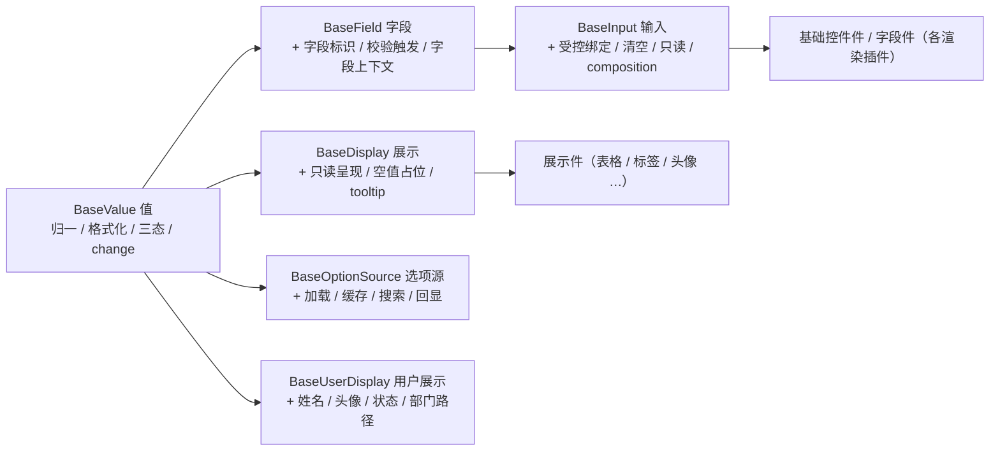
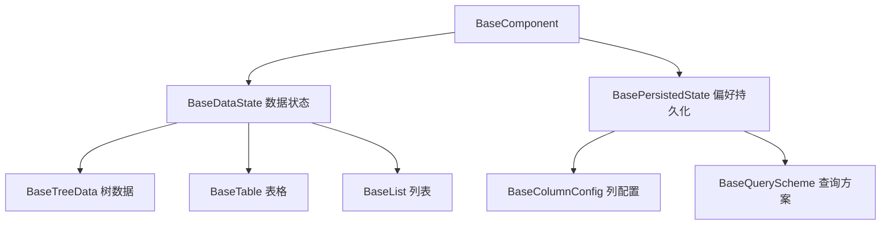

# 前端基类清单

> 前端基类权威清单：**全系统唯一一份前端继承链**——各基类的身份、父基类、形态、代码位置、职责、迁移映射与状态（bms 权威源维护，产品经工作区符号链接引用）

[文档首页](文档首页.md) › 前端基类清单　|　[配套：《前端开发规范》](规范/前端开发规范.md) · [← 后端基类清单](后端基类清单.md)

## 1. 用途与维护 <a id="purpose"></a>

- **定位**：前端基类**权威清单**——回答「有哪些基类、各自继承谁、什么职责、代码在哪、现有实现类怎么迁移、是否已交付」。**强制用法口径与扩展规则**见《[前端开发规范](规范/前端开发规范.md)》「前端基类体系（强制）」节；体系语义见平台《[架构设计 · 前端组件体系](设计/架构设计/05_架构设计_前端组件体系.md)》；**通用组件的语义与契约边界**见《[组件设计 · 总览](设计/组件设计/01_组件设计_总览.md)》对应节点。
- **继承链唯一（强制）**：前端继承链**全系统只有本清单这一份**。规范、架构、组件设计、任务与产品文档**一律引用本清单**，不重复描述继承关系；重复即口径漂移源，发现重复须改为引用（口径见本清单 §11）。

### 1.1 体系口径（继承 + 抽象，不设固定层数） <a id="positioning"></a>

- **主体内建必须继承**：平台自有实现一律沿本清单的继承链派生；**公共字段与方法只在链上对应基类维护**，任何组件与模块不得重复实现；**不得绕过链层另起炉灶、不得在链外自由挂接功能**。
- **零例外**：一切基类从总基类 `BaseObject` 派生，**没有例外条款**（错误基座亦入链，见 §2.4；《前端开发规范》原「错误基座例外」已废，回写一致）。
- **不设固定层数**：链的深浅由**功能与抽象的需要**决定——需要公共段就插一个基类，**每条链长短不一**；同一位置上的两个基类不构成「一层」。顶层固定三段：**总基类 → 组件根 → 插件基类**。
- **相似基类抽公共段**：两个基类有公共部分 → 提取中间层基类；两个中间层仍有公共部分 → **继续提取**（如 `BaseLabeled` 承载 `BaseFieldShell` 与 `BaseFormContainer` 的 label 语义）。
- **功能横切即基类**：横切功能（值 / 字段 / 权限 / 数据源 / 上传 / 拖拽 …）落为**继承链上的基类**（原「能力类 / 能力片段」口径已废，见 §10.1）；新增横切功能即新增基类并登记。
- **插件化（纵向可替换）**：与平台《[扩展点与插件化](设计/架构设计/10_架构设计_子系统_扩展点与插件化.md)》同构——`BaseCapability`（能力域，能力键）→ `BasePluggable`（插件基类，实现名 / 契约版本 / 注册与解析 / 生命周期）→ 各能力域基类 → 默认实现 / 内建实现 / 定制实现。
- **双轨（继承 + 组合）**：平台内建走继承轨（定义即登记 + 契约测试）；项目二次开发 / 定制走组合轨（注册通道登记接入、不继承平台基类、不回改平台基类）；两轨汇入同一登记与同一套契约测试。
- **命名对齐后端**：通用基类与后端**同名同职责**（`BaseObject` / `BaseCapability` / `BasePluggable` / `BaseProviderRegistry` / `BaseProvider` / `BaseAsyncResource` / `BasePlaceholder` / `BaseNullObject` / `BaseStub`）；前端特有族按功能命名，不强行造无对应的基类。

### 1.2 状态取值 <a id="status"></a>

`已交付` / `部分` / `占位` / `待交付`——与平台架构节点登记一致。

### 1.3 维护流程 <a id="maintain-flow"></a>

新增 / 调整基类走：**候选 → 设计节点（组件设计）→ 评审确认 → 本清单登记 → 代码登记 + 契约用例 → 《架构设计 · 前端组件体系》同步**；状态列随实施回写。历史旧体系内容（`src/base`、`src/components/base` 能力层、`useXxx` 组合式能力）已随移动端（S4c）与 PC 宿主（S6）删除，历史经 git 追溯（专项 `02_07`）。

## 2. 继承链总览 <a id="overview"></a>

```text
前端基类继承链（全系统唯一权威源 · 本清单）
│
├─ 顶层（固定三段 + 支线）                                                 # §3
│  ├─ BaseObject 总基类 ................................................ 一切基类之根
│  ├─ BaseComponent 组件根 ............................................. UI 通用协议
│  ├─ BasePluggable 插件基类 ........................................... 可替换实现装配
│  │  ├─ BaseProviderRegistry 提供者注册表 ............................. 注册 / 解析
│  │  │  └─ CapabilityRegistry 能力注册表
│  │  └─ BaseFactory 工厂基类 .......................................... 具体工厂基类之根
│  └─ BaseError 错误基座（extends BaseObject + Error） ................. 多重继承（有理由的例外）
│
├─ 中间层基类（跨链公共段提取，可按需再提）                                 # §4
│  ├─ BaseMounted 可挂载 ──→ BaseAsyncResource 异步资源 ──→ BaseSubscription 订阅
│  ├─ BasePlaceholder 占位 ──→ BaseNullObject 空实现 / BaseStub 未实现桩
│  ├─ BaseLabeled 标签语义 ──→ BaseValidatable 可校验
│  ├─ BaseOverlay 浮层 · BaseSized 尺寸档位 · BaseDataState 数据状态 · BaseNotice 提示通知
│  └─ BaseValueObject 值对象 ──→ BaseEntity 实体 / BasePageQuery 分页查询
│
├─ 能力域基类（功能横切，按族分组）                                         # §5
│  ├─ 值族：BaseValue → BaseField → BaseInput；BaseValue → BaseDisplay
│  ├─ 选项族：BaseOptionSource · BaseTreeData · BasePresignedUrl
│  ├─ 容器布局族：BaseContainer / BaseFormContainer → BaseOverlay · BaseLayout
│  ├─ 交互族：BaseClickable · BaseDragDrop · BaseTabs
│  ├─ 媒体族：BaseMediaContent（→ BaseSized）· BaseUploadEngine · BaseEditorKernel
│  ├─ 数据状态族：BaseDataState → BaseTreeData · BaseTable · BaseList
│  ├─ 查询配置族：BasePersistedState → BaseColumnConfig / BaseQueryScheme
│  └─ 上下文族：BaseLocale · BaseAccess · BaseModuleContext · BaseDesignToken · BaseUserDisplay
│
└─ 契约与值对象基类                                                        # §6
   ├─ 契约族：BaseApi（模块 API）· BaseEntity（实体）· BasePageQuery（分页查询）
   └─ 值对象族：BaseValueObject；各域工厂基类继承 BaseFactory，具体工厂类继承工厂基类
```

### 2.1 全量基类登记表 <a id="registry"></a>

> `父基类`列为**唯一继承来源**（除 `BaseError` 的多重继承，已单独标注）；「代码位置」为路径前缀 `frontend/packages/core/src/` 之下的相对落点（`已交付`项与现有代码一致，`待交付`项为设计落点）。

| # | 基类 | 父基类 | 形态 | 代码位置 | 职责 | 状态 |
| --- | --- | --- | --- | --- | --- | --- |
| 1 | `BaseObject` | —（根） | 类 | `base/BaseObject.ts` | 一切前端基类之根：命名空间 / 版本、日志、错误上报、配置读取、生命周期（`dispose`）；不含 UI 与业务语义 | 已交付（现名 `BaseFrontend`，待改名） |
| 2 | `BaseComponent` | `BaseObject` | 类 | `base/BaseComponent.ts` | 所有 UI 组件公共：标识与命名空间类名、尺寸 / 密度、`loading` / `disabled`、**令牌属性协议**（`data-size` / `data-density` / `aria-*` + 状态类）、attrs 透传（保留键过滤）、生命周期通知、机制装配点 | 已交付 |
| 3 | `BasePluggable` | `BaseComponent` | 类 | `mechanisms/pluggable.ts` | **插件基类**（对齐后端 `BasePluggable`）：能力键 / 实现名 / 契约版本 / 注册与解析 / 生命周期 / `describe` | 待交付 |
| 4 | `BaseProviderRegistry` | `BasePluggable` | 类 | `mechanisms/registry.ts` | 注册表基座：唯一性拒重（严格域抛错 / 一般域告警保留首个）、未命中返回 `undefined`（不替各域裁决）、保序、只读快照 | 已交付（现名 `BaseRegistry`，待改名） |
| 5 | `CapabilityRegistry` | `BaseProviderRegistry` | 类 | `capabilities/registry.ts` | 能力注册表：能力登记 / 解析 / 能力矩阵（现继承 `ProviderRegistry`，链上位置不变） | 已交付 |
| 6 | `BaseFactory` | `BasePluggable` | 类 | `mechanisms/factory.ts` | **工厂基类**：一切工厂类之根（创建入口标识 / 参数校验 / 产出物释放登记） | 待交付 |
| 7 | `BaseError` | `BaseObject` + `Error` | 类（多重继承） | `mechanisms/error.ts` | 前端异常基座（对齐后端 `BizError`）：`code` / `userMessage`、提示映射（i18n `error.{code}`）、上报委托根系；`instanceof Error` 与堆栈须保留，见 §3.4 | 已交付（继承须调整） |
| 8 | `BaseMounted` | `BaseComponent` | 类 | `mechanisms/mounted.ts` | **可挂载**：挂载 / 卸载生命周期与释放登记的统一入口（DOM 监听 / 定时器 / 订阅 / 异步资源） | 待交付 |
| 9 | `BaseAsyncResource` | `BaseMounted` | 类 | `mechanisms/resource.ts` | 异步资源生命周期：登记 / 逆序释放 / 幂等 / 释放后拒绝登记 | 已交付（继承须调整） |
| 10 | `BaseSubscription` | `BaseAsyncResource` | 类 | `mechanisms/subscription.ts` | 事件订阅基座：`topic` 点分小写（与后端事件表同源）、来源解耦（占位 / 本地 / 实时）、取消函数登记为异步资源 | 已交付 |
| 11 | `BasePlaceholder` | `BaseComponent` | 类 | `mechanisms/placeholder.ts` | **占位标记**：三类原因（`pending` / `null` / `stub`）× 三类降级（`empty` / `disabled` / `hidden`）；占位不请求、不写缓存、无副作用 | 已交付 |
| 12 | `BaseNullObject` | `BasePlaceholder` | 类 | `mechanisms/placeholder.ts` | **空实现**（Null Object）：无副作用、恒定返回（对齐后端 `BaseNullObject`） | 待交付 |
| 13 | `BaseStub` | `BasePlaceholder` | 类 | `mechanisms/placeholder.ts` | **未实现桩**：`_not_implemented()` 统一抛错（对齐后端 `BaseStub`） | 待交付 |
| 14 | `BaseLabeled` | `BaseComponent` | 类 | `base/labeled.ts` | **标签语义**：label 文案 / 位置 / 宽度、必填标记、帮助与错误位 | 待交付 |
| 15 | `BaseValidatable` | `BaseLabeled` | 类 | `base/validatable.ts` | **可校验**：校验规则汇总 / 触发时机 / 结果回传 / 错误定位 | 待交付 |
| 16 | `BaseOverlay` | `BaseSized` | 类 | `capabilities/overlay.ts` | **浮层**：遮罩、挂载点、层级、焦点陷阱、关闭语义（容器 / 模态 / 反馈共用） | 待交付 |
| 17 | `BaseSized` | `BaseComponent` | 类 | `base/sized.ts` | **尺寸档位**：尺寸 / 密度档位与设计令牌消费统一入口（组件根令牌属性协议之上） | 待交付 |
| 18 | `BaseDataState` | `BaseComponent` | 类 | `base/data-state.ts` | **数据状态**：`loading → ready / empty / error` 状态机与竞态处理 | 待交付 |
| 19 | `BaseNotice` | `BaseComponent` | 类 | `base/notice.ts` | **提示通知**：提示类型 / 时长 / 关闭语义 / 队列（反馈件与通知共用） | 待交付 |
| 20 | `BaseValueObject` | `BaseComponent` | 类 | `contracts/value-object.ts` | **值对象**：不可变语义、字段声明、归一与稳定序列化 | 待交付 |
| 21 | `BaseEntity` | `BaseValueObject` | 类 | `contracts/entity.ts` | **实体**：标识 / 版本 / 软删除回显（宿主 `BaseEntity` 由纯接口上提为类） | 部分（现为接口） |
| 22 | `BasePageQuery` | `BaseValueObject` | 类 | `contracts/page-query.ts` | **分页查询**：页码 / 页长 / 排序 / 筛选参数契约（宿主 `BasePageQuery` 上提） | 部分（现为接口） |
| 23 | `BaseValue` | `BaseComponent` | 类 | `capabilities/value.ts` | 值语义：值归一、格式化调度、三态、`change` 上报（输入与展示共用） | 已交付 |
| 24 | `BaseField` | `BaseValue` | 类 | `capabilities/field.ts` | 字段：组合值语义 + 字段标识 + 校验触发 + 字段上下文；是输入族的身份基类 | 已交付 |
| 25 | `BaseFieldShell` | `BaseLabeled` | 类 | `capabilities/field-shell.ts` | 字段壳：label / 必填 / 帮助 / 错误 / 栅格跨度 / 只读回显 | 已交付（继承须调整） |
| 26 | `BaseFieldPerm` | `BaseFieldShell` | 类 | `capabilities/field-perm.ts` | 字段权限：`permVisible` / `editable` / `required` 三态 + 脱敏（元数据来源随后端接入） | 已交付（继承须调整） |
| 27 | `BaseInput` | `BaseField` | 类 | `capabilities/input.ts` | **输入族基类**（原「输入域基类」）：受控绑定、归一、清空、只读判定、composition、焦点 / 失焦 | 部分（现为 `input-control` + 域工厂） |
| 28 | `BaseDisplay` | `BaseValue` | 类 | `capabilities/display.ts` | **展示族基类**（原「展示域基类」）：只读呈现、密度、空值占位、省略 / tooltip、点击取值 | 已交付（现名 `BaseDisplayControl`） |
| 29 | `BaseOptionSource` | `BaseValue` | 类 | `capabilities/option-source.ts` | 选项源：加载 / 缓存与版本比对 / 搜索 / 回显（字典、组织、枚举、树、级联共用；后端未接入占位降级） | 已交付（继承须调整） |
| 30 | `BaseTreeData` | `BaseDataState` | 类 | `capabilities/tree-data.ts` | **树族基类**（原「树域基类」）：加载 / 懒加载 / 归一 / 选中 / 勾选 / 过滤 / 缓存 | 已交付（继承须调整） |
| 31 | `BaseContainer` | `BaseSized` | 类 | `capabilities/container.ts` | 容器族基类：插槽 / 折叠 / 分栏 / 区域令牌 | 已交付（继承须调整） |
| 32 | `BaseFormContainer` | `BaseValidatable` | 类 | `capabilities/form-container.ts` | 表单容器：label 位置与宽度 / 栅格 / 规则汇总 / 校验 / 错误定位 / 只读态（沿 `BaseValidatable → BaseLabeled` 取得公共段） | 已交付（继承须调整） |
| 33 | `BaseLayout` | `BaseSized` | 类 | `capabilities/layout.ts` | 布局：栅格 / 断点、间距与对齐令牌、根元素与透传、显隐 | 已交付（继承须调整） |
| 34 | `BaseMediaContent` | `BaseSized` | 类 | `capabilities/media.ts` | 媒体内容：加载状态机 / 宽高比 / 懒加载 / 过期重取 / 回退（现名 `BaseMedia`，改名避与媒体组件类同名） | 已交付（须改名 + 继承调整） |
| 35 | `BaseClickable` | `BaseComponent` | 类 | `capabilities/interactive.ts` | 可点击族基类：loading / disabled / 防抖 / 危险确认 / 键盘触发 / 埋点（现名 `BaseInteractive`，改名避与交互组件类同名） | 已交付（须改名） |
| 36 | `BaseDragDrop` | `BaseComponent` | 类 | `capabilities/drag-drop.ts` | 拖拽基座：拖拽 / 排序 / 跨区（表单设计器、报表与大屏设计器、工作台卡片共用） | 已交付 |
| 37 | `BaseTabs` | `BaseComponent` | 类 | `capabilities/tabs.ts` | 页签状态：打开 / 关闭 / 固定 / 缓存键清单（多标签导航、表单框架双层 Tab、内容页签共用） | 已交付 |
| 38 | `BasePersistedState` | `BaseComponent` | 类 | `capabilities/persisted-state.ts` | 偏好持久化：本地即时 + 远端偏好同步（`sys_user_preference` / `sys_query_scheme`） | 已交付 |
| 39 | `BaseModalShell` | `BaseOverlay` | 类 | `capabilities/modal-shell.ts` | 模态壳：模态语义 / 关闭拦截 / 底部操作区 | 已交付（现为插件层 `useModalShell`，待上提基类） |
| 40 | `BaseFeedback` | `BaseNotice` | 类 | `capabilities/feedback.ts` | 反馈基座：`loading → ready / empty / error` 反馈状态机与降级呈现 | 已交付（现为宿主 `useFeedback`，待上提基类） |
| 41 | `BaseNotification` | `BaseNotice` | 类 | `capabilities/notification.ts` | 通知消息：站内信 / 公告的展示与已读状态 | 待交付 |
| 42 | `BaseUploadEngine` | `BaseComponent` | 类 | `capabilities/upload-engine.ts` | 上传引擎：分片 / 秒传 / 断点续传 / 进度 / 取消（文件上传、富文本、头像、导入共用；占位降级） | 已交付 |
| 43 | `BaseAsyncTask` | `BaseComponent` | 类 | `capabilities/async-task.ts` | 异步任务：提交 / 轮询进度（退避）/ 取消 / 结果下载（导入导出、报表与大屏导出共用；占位先行） | 已交付 |
| 44 | `BaseEditorKernel` | `BaseComponent` | 类 | `capabilities/editor-kernel.ts` | **编辑器族基类**（原「编辑器域基类」）：懒加载 / 创建销毁 / 内容协议（CodeMirror 与富文本 / Markdown 共用） | 已交付 |
| 45 | `BasePresignedUrl` | `BaseComponent` | 类 | `capabilities/presigned-url.ts` | 预签名：获取 / 失效重取 / 降级下载（文件预览、下载、导出共用；占位降级） | 已交付 |
| 46 | `BaseUserDisplay` | `BaseValue` | 类 | `capabilities/user-display.ts` | 用户 / 组织展示：姓名 / 头像 / 状态 / 部门路径（头像组件、组织选择回显、审批流、通知共用） | 已交付（继承须调整） |
| 47 | `BaseDesignToken` | `BaseComponent` | 类 | `capabilities/design-token.ts` | 设计令牌消费：间距 / 色板 / 密度 / 断点 / 主题订阅 | 已交付 |
| 48 | `BaseDynamicRoutes` | `BaseComponent` | 类 | `capabilities/dynamic-routes.ts` | 动态路由：菜单树 → 路由构建 / 注册 / 卸载（前端不硬编码路由表） | 已交付 |
| 49 | `BaseFormMeta` | `BaseComponent` | 类 | `capabilities/form-meta.ts` | 表单元数据：加载 / 缓存 / 版本比对（菜单下发表单元数据；表单渲染器与设计器共用） | 已交付 |
| 50 | `BaseFormPage` | `BaseComponent` | 类 | `capabilities/form-page.ts` | 表单页组合：三态（新增 / 编辑 / 详情）/ 提交 / 脏数据 / 返回 | 已交付 |
| 51 | `BaseWatermark` | `BaseComponent` | 类 | `capabilities/watermark.ts` | 水印：用户 / 租户信息注入（覆盖内容与导出；与打印导出共用） | 已交付 |
| 52 | `BaseLocale` | `BaseComponent` | 类 | `capabilities/locale.ts` | 语言上下文：locale / 时区 / 格式上下文（切换与缓存；收敛时区格式化） | 已交付 |
| 53 | `BaseAccess` | `BaseComponent` | 类 | `capabilities/access.ts` | 权限上下文：权限码集合与判定（`has` / `hasAny` / `hasAll`）；路由与菜单过滤由宿主 / 插件组合 | 已交付 |
| 54 | `BaseModuleContext` | `BaseComponent` | 类 | `capabilities/module-context.ts` | 上下文基类：宿主注入 router / store / i18n / 用户 / 租户（只读约束） | 已交付 |
| 55 | `BaseColumnConfig` | `BasePersistedState` | 类 | `capabilities/column-config.ts` | 列配置：显隐 / 顺序 / 宽度 / 冻结 / 持久化（通用表格与明细区共用） | 已交付（继承须调整） |
| 56 | `BaseQueryScheme` | `BasePersistedState` | 类 | `capabilities/query-scheme.ts` | 查询方案：条件模型 / 方案保存·应用 / 参数化（`sys_query_scheme`） | 已交付（继承须调整） |
| 57 | `BaseTable` | `BaseDataState` | 类 | `capabilities/table.ts` | 表格族基类：表格数据 / 排序 / 选中 / 分页状态 / 行操作 | 部分（现为宿主 `useListPage`，待上提基类） |
| 58 | `BaseList` | `BaseDataState` | 类 | `capabilities/list.ts` | 列表族基类：列表数据 / 滚动加载 / 空态与错误态 / 刷新 | 部分（宿主级，待上提基类） |
| 59 | `BaseApi` | `BaseObject` | 类 | `host/api/base.ts`（宿主包） | 模块 API 基类：路径前缀、请求方法、自动幂等键 | 已交付（继承 `BaseFrontend`，待改名） |

- **具体工厂类**（继承各域工厂基类；工厂基类继承 `BaseFactory`）：`BaseInputContextFactory`、`BaseConfirmServiceFactory`、`BasePermissionGateFactory` 等——**具体工厂类继承工厂基类，工厂基类继承 `BaseFactory`**（本表只登记工厂基类族，具体工厂类随域任务登记）。
- **横切底座（非基类身份的实现物）**：请求层（`adapter` / `error` / `request` / `token` / `http`）、权限层（`v-perm` / `hasPerm` / `canAccess`）、格式化层（`format` / `useTimezone` / `validators`）、`createCrudStore` / `stableStringify`——登记为**实现物**而非基类，落点与状态见 §8。
- **`BaseError` 的多重继承**：本表唯一的多重继承项，理由与约束见 §3.4（不放开滥用）。

```mermaid
flowchart TD
    OBJ["总基类 BaseObject"]
    COMP["组件根 BaseComponent"]
    PLG["插件基类 BasePluggable"]
    REG["提供者注册表 BaseProviderRegistry"]
    CAPREG["能力注册表 CapabilityRegistry"]
    FAC["工厂基类 BaseFactory"]
    ERR["错误基座 BaseError（+ Error）"]
    MOU["可挂载 BaseMounted"]
    AR["异步资源 BaseAsyncResource"]
    SUB["订阅 BaseSubscription"]
    PH["占位 BasePlaceholder"]
    NO["空实现 BaseNullObject"]
    ST["未实现桩 BaseStub"]
    LA["标签语义 BaseLabeled"]
    VA["可校验 BaseValidatable"]
    FS["字段壳 BaseFieldShell"]
    FPC["字段权限 BaseFieldPerm"]
    FC["表单容器 BaseFormContainer"]
    OV["浮层 BaseOverlay"]
    SZ["尺寸档位 BaseSized"]
    DS["数据状态 BaseDataState"]
    NT["提示通知 BaseNotice"]
    VO["值对象 BaseValueObject"]
    EN["实体 BaseEntity"]
    PQ["分页查询 BasePageQuery"]
    VL["值 BaseValue"]
    FL["字段 BaseField"]
    IN["输入 BaseInput"]
    DP["展示 BaseDisplay"]
    OPT["选项源 BaseOptionSource"]
    TD["树数据 BaseTreeData"]
    TB["表格 BaseTable"]
    LS["列表 BaseList"]
    PS["偏好持久化 BasePersistedState"]
    CC["列配置 BaseColumnConfig"]
    QS["查询方案 BaseQueryScheme"]
    MC["模态壳 BaseModalShell"]
    FB["反馈 BaseFeedback"]
    NF["通知 BaseNotification"]
    CT["容器 BaseContainer"]
    LY["布局 BaseLayout"]
    MD["媒体内容 BaseMediaContent"]
    CL["可点击 BaseClickable"]
    OBJ --> COMP
    COMP --> PLG
    PLG --> REG
    PLG --> FAC
    REG --> CAPREG
    COMP --> ERR
    COMP --> MOU
    MOU --> AR
    AR --> SUB
    COMP --> PH
    PH --> NO
    PH --> ST
    COMP --> LA
    LA --> VA
    LA --> FS
    FS --> FPC
    LA --> FC
    VA --> FC
    COMP --> SZ
    SZ --> OV
    SZ --> CT
    SZ --> LY
    SZ --> MD
    COMP --> DS
    DS --> TD
    DS --> TB
    DS --> LS
    COMP --> NT
    NT --> FB
    NT --> NF
    COMP --> VO
    VO --> EN
    VO --> PQ
    COMP --> VL
    VL --> FL
    FL --> IN
    VL --> DP
    VL --> OPT
    VL --> UD["用户展示 BaseUserDisplay"]
    COMP --> PS
    PS --> CC
    PS --> QS
    OV --> MC
    COMP --> CL
```

### 2.2 继承链全景 <a id="tree"></a>



> 图只画主干与主要分叉；完整父子关系以 §2.1 全量表「父基类」列为准（图不含 `BasePersistedState` 之外的上下文族单链，见 §5）。

## 3. 顶层基类 <a id="top"></a>

### 3.1 总基类 `BaseObject` <a id="root"></a>

- **形态**：类（非抽象）；**一切可继承的前端基类默认从其派生**。
- **提供**：命名空间 / 版本、日志（`log`）、错误上报（`reportError`）、配置读取（`getConfig`）、生命周期（`dispose`）——**公共方法唯一落点**。
- **约束**：只放「所有基类共有」的横切能力；任一方的特有逻辑（组件协议、数据访问流程、框架绑定）不得上提总基类。
- **现状**：已交付，现名 `BaseFrontend`（`frontend/packages/core/src/base/BaseFrontend.ts`），按本清单改名为 `BaseObject` 并对齐后端命名。

### 3.2 组件根 `BaseComponent` <a id="component-root"></a>

- **形态**：类；所有 UI 组件的公共协议（组件根）。
- **提供**：标识（`identifier`）与命名空间类名（`nsClass`）、尺寸 / 密度、`loading` / `disabled` / 显隐、**令牌属性协议**（`data-size` / `data-density` / `aria-*` + 状态类，`rootAttrs`）、attrs 透传（`passthroughAttrs`，保留键过滤）、运行期字段（`setProps`）、生命周期通知（`notifyLifecycle`）、机制装配点（`mechanisms`）。
- **约束**：纯数据输出（不触 DOM、不依赖渲染框架）；档位只写根元素属性、状态只加状态类；组件只消费令牌语义变量，**不得硬编码色值与尺寸**（豁免项见《[前端开发规范](规范/前端开发规范.md)》§3.1）。

### 3.3 插件基类 `BasePluggable` 与注册表族 <a id="pluggable"></a>

- **`BasePluggable`（插件基类，对齐后端同名基类）**：承载可替换实现的装配语义——**能力键 / 实现名 / 契约版本 / 注册与解析 / 生命周期 / 元信息**；与平台《[扩展点与插件化](设计/架构设计/10_架构设计_子系统_扩展点与插件化.md)》§3「基类承载与双轨」同构。
- **`BaseProviderRegistry`（提供者注册表）**：注册表公共实现——唯一性拒重（严格域抛错、一般域告警保留首个）、`get` 未命中返回 `undefined`（不替各域裁决兜底）、`keys` / `values` 保序、只读快照；各扩展点注册表（路由·菜单、组件、字段渲染器、图标、工作台卡片）**一律基于它扩展，不得另起映射登记实现**。
- **`BaseProvider`（注册项，对齐后端）**：注册项公共契约——抽象 `key` + 自描述 `describe()`；各注册项改继承之（现有 `RegistryItemLike` 按本清单改名）。
- **`CapabilityRegistry`**：能力注册表（能力登记 / 解析 / 能力矩阵），继承 `BaseProviderRegistry`（现经 `ProviderRegistry`，链上位置不变）。

### 3.4 错误基座 `BaseError` <a id="error"></a>

- **形态**：类，**多重继承** `BaseError extends BaseObject, Error`——**本体系唯一的多重继承项**，与后端 `BaseSchema → (pydantic.BaseModel, BaseObject)` 同类先例。
- **提供**：`code` / `userMessage`、提示映射（i18n `error.{code}`）、上报委托总基类；保留原生 `instanceof Error` 与堆栈（全局错误边界、日志与监控 SDK 依赖此语义）。
- **约束（不放开滥用）**：仅错误基座可使用多重继承；新增多重继承须经评审并在本清单逐项登记。**原「错误基座因须保留 `Error` 链而不入组件根继承链」的例外条款已废**——《[前端开发规范](规范/前端开发规范.md)》§3.1 与《组件设计 · 错误基类》同步回写，**本体系为零例外**。
- **现状**：已交付（`mechanisms/error.ts`，`extends Error`），按本清单改为多重继承入链。

### 3.5 工厂基类 `BaseFactory` <a id="factory"></a>

- **形态**：类，继承 `BasePluggable`；**一切工厂类之根**。
- **层级**：`BaseFactory`（工厂基类）→ 各域工厂基类（如 `BaseInputContextFactory` / `BaseConfirmServiceFactory` / `BasePermissionGateFactory`）→ 具体工厂类；**公共创建逻辑只在工厂基类维护**。
- **约束**：工厂只负责创建与装配，不承载业务判定；产出物的释放须登记到链上的资源释放入口（`BaseMounted` / `BaseAsyncResource`）。

## 4. 中间层基类 <a id="middle"></a>

> 中间层由**跨链公共段**提取而来（两个基类有公共部分即提取；两个中间层仍有公共部分继续提取）。中间层**不直接面向具体组件**，由链上各能力域基类复用。

| 中间层基类 | 父基类 | 提取自（公共段） | 职责 | 状态 |
| --- | --- | --- | --- | --- |
| `BaseMounted` | `BaseComponent` | 一切需在卸载时释放的基类 | 挂载 / 卸载生命周期与释放登记统一入口 | 待交付 |
| `BaseAsyncResource` | `BaseMounted` | 订阅 / 请求 / 定时器 / 上传 | 异步资源：登记 / 逆序释放 / 幂等 / 释放后拒绝登记 | 已交付（继承须调整） |
| `BaseSubscription` | `BaseAsyncResource` | 事件订阅类基类 | 订阅：`topic` 点分小写 / 来源解耦 / 取消登记 | 已交付 |
| `BasePlaceholder` | `BaseComponent` | 占位组件与占位能力 | 占位标记与三类原因 × 三类降级；占位不请求 | 已交付 |
| `BaseNullObject` | `BasePlaceholder` | 各域 Null 实现 | 空实现（无副作用、恒定返回） | 待交付 |
| `BaseStub` | `BasePlaceholder` | 未实现占位 | 未实现统一抛错（`_not_implemented`） | 待交付 |
| `BaseLabeled` | `BaseComponent` | 字段壳 / 表单容器 | 标签语义：label 文案·位置·宽度、必填标记、帮助与错误位 | 待交付 |
| `BaseValidatable` | `BaseLabeled` | 字段 / 表单容器 | 校验：规则汇总 / 触发时机 / 结果回传 / 错误定位 | 待交付 |
| `BaseOverlay` | `BaseSized` | 容器 / 模态 / 反馈 | 浮层：遮罩 / 挂载点 / 层级 / 焦点陷阱 / 关闭 | 待交付 |
| `BaseSized` | `BaseComponent` | 容器 / 布局 / 媒体 | 尺寸档位与设计令牌消费统一入口 | 待交付 |
| `BaseDataState` | `BaseComponent` | 树 / 表格 / 列表 | 数据状态：`loading → ready / empty / error` 与竞态处理 | 待交付 |
| `BaseNotice` | `BaseComponent` | 反馈 / 通知 | 提示通知：类型 / 时长 / 关闭 / 队列 | 待交付 |
| `BaseValueObject` | `BaseComponent` | 契约实体 / 查询对象 | 值对象：不可变语义 / 字段声明 / 归一 / 稳定序列化 | 待交付 |

## 5. 能力域基类 <a id="domains"></a>

> **功能横切即基类**：原「能力类」并入本清单后即为**继承链上的能力域基类**（不再有「能力层 / 域基类」两套叫法）。各基类按**族**分组，同族内以继承逐级细化；族与族之间不交叉派生。

### 5.1 值族 <a id="family-value"></a>



| 基类 | 父基类 | 职责 | 迁移（现有 → 目标） |
| --- | --- | --- | --- |
| `BaseValue` | `BaseComponent` | 值归一、格式化调度、三态、`change` 上报 | 保留 |
| `BaseField` | `BaseValue` | 字段标识、校验触发、字段上下文；输入族身份基类 | 保留（原依赖 `field-shell` / `field-perm` 的关系改为继承链上下位） |
| `BaseInput` | `BaseField` | 受控绑定、归一、清空、只读判定、composition、焦点 | `BaseInputControl` + 输入域工厂 `createInputContext` → 本基类 |
| `BaseDisplay` | `BaseValue` | 只读呈现、密度、空值占位、省略 / tooltip、点击取值 | `BaseDisplayControl` → `BaseDisplay`（改名） |
| `BaseOptionSource` | `BaseValue` | 选项源加载 / 缓存 / 搜索 / 回显 | 继承由 `BaseCapability` 改 `BaseValue`（值语义复用） |
| `BaseUserDisplay` | `BaseValue` | 用户 / 组织展示 | 继承由 `BaseCapability` 改 `BaseValue` |

### 5.2 字段壳与表单族 <a id="family-field"></a>

| 基类 | 父基类 | 职责 | 迁移 |
| --- | --- | --- | --- |
| `BaseFieldShell` | `BaseLabeled` | 字段壳：label / 必填 / 帮助 / 错误 / 栅格跨度 / 只读回显 | 继承由 `BaseCapability` 改 `BaseLabeled` |
| `BaseFieldPerm` | `BaseFieldShell` | 字段权限三态 + 脱敏 | 继承由 `BaseCapability` 改 `BaseFieldShell` |
| `BaseFormContainer` | `BaseValidatable` | 表单容器：label 位置与宽度 / 栅格 / 规则汇总 / 校验 / 错误定位 / 只读态 | 继承由 `BaseCapability` 改 `BaseValidatable` |
| `BaseFormMeta` | `BaseComponent` | 表单元数据加载 / 缓存 / 版本比对 | 保留 |
| `BaseFormPage` | `BaseComponent` | 表单页三态 / 提交 / 脏数据 / 返回 | 保留 |

> 字段链完整形态：`BaseComponent → BaseLabeled → BaseValidatable → …` 与 `BaseComponent → BaseValue → BaseField → BaseInput` 两条链在**具体字段件**处汇入（字段件继承 `BaseInput` 并用 `BaseFieldShell` / `BaseFieldPerm` 的派生基类承载壳与权限）。

### 5.3 容器与布局族 <a id="family-container"></a>

| 基类 | 父基类 | 职责 | 迁移 |
| --- | --- | --- | --- |
| `BaseSized` | `BaseComponent` | 尺寸 / 密度档位与令牌消费入口 | 待交付（新中间层） |
| `BaseOverlay` | `BaseSized` | 遮罩 / 层级 / 焦点陷阱 / 关闭 | 待交付 |
| `BaseContainer` | `BaseSized` | 插槽 / 折叠 / 分栏 / 区域令牌 | 继承由 `BaseCapability` 改 `BaseSized` |
| `BaseLayout` | `BaseSized` | 栅格 / 断点 / 间距对齐令牌 / 显隐 | 继承由 `BaseCapability` 改 `BaseSized` |
| `BaseModalShell` | `BaseOverlay` | 模态语义 / 关闭拦截 / 底部操作区 | 插件层 `useModalShell` → 核心基类 |
| `BaseDragDrop` | `BaseComponent` | 拖拽 / 排序 / 跨区 | 保留 |

### 5.4 媒体与内容族 <a id="family-media"></a>

| 基类 | 父基类 | 职责 | 迁移 |
| --- | --- | --- | --- |
| `BaseMediaContent` | `BaseSized` | 加载状态机 / 宽高比 / 懒加载 / 过期重取 / 回退 | `BaseMedia` → `BaseMediaContent`（改名 + 继承调整） |
| `BaseUploadEngine` | `BaseComponent` | 分片 / 秒传 / 断点续传 / 进度 / 取消 | 保留 |
| `BaseEditorKernel` | `BaseComponent` | 懒加载 / 创建销毁 / 内容协议 | 保留（原「编辑器域基类」归名） |
| `BasePresignedUrl` | `BaseComponent` | 预签名获取 / 失效重取 / 降级下载 | 保留 |
| `BaseWatermark` | `BaseComponent` | 用户 / 租户信息注入 | 保留 |
| `BaseDesignToken` | `BaseComponent` | 令牌消费：间距 / 色板 / 密度 / 断点 / 主题订阅 | 保留 |

### 5.5 交互与反馈族 <a id="family-interactive"></a>

| 基类 | 父基类 | 职责 | 迁移 |
| --- | --- | --- | --- |
| `BaseClickable` | `BaseComponent` | loading / disabled / 防抖 / 危险确认 / 键盘触发 / 埋点 | `BaseInteractive` → `BaseClickable`（改名） |
| `BaseNotice` | `BaseComponent` | 提示类型 / 时长 / 关闭 / 队列 | 待交付 |
| `BaseFeedback` | `BaseNotice` | 反馈状态机与降级呈现 | 宿主 `useFeedback` → 核心基类 |
| `BaseNotification` | `BaseNotice` | 通知展示与已读状态 | 待交付 |
| `BaseTabs` | `BaseComponent` | 页签打开 / 关闭 / 固定 / 缓存键清单 | 保留 |
| `BaseAsyncTask` | `BaseComponent` | 任务提交 / 轮询退避 / 取消 / 结果下载 | 保留 |

### 5.6 数据状态与配置族 <a id="family-data"></a>



| 基类 | 父基类 | 职责 | 迁移 |
| --- | --- | --- | --- |
| `BaseDataState` | `BaseComponent` | `loading → ready / empty / error` + 竞态 | 待交付 |
| `BaseTreeData` | `BaseDataState` | 树加载 / 懒加载 / 选中勾选 / 过滤 | 继承由 `BaseCapability` 改 `BaseDataState`（原「树域基类」归名） |
| `BaseTable` | `BaseDataState` | 表格数据 / 排序 / 选中 / 分页状态 | 宿主 `useListPage` → 核心基类 |
| `BaseList` | `BaseDataState` | 列表数据 / 滚动加载 / 空态 / 刷新 | 宿主级 → 核心基类 |
| `BasePersistedState` | `BaseComponent` | 本地即时 + 远端偏好同步 | 保留 |
| `BaseColumnConfig` | `BasePersistedState` | 列显隐 / 顺序 / 宽度 / 冻结 | 继承改 `BasePersistedState` |
| `BaseQueryScheme` | `BasePersistedState` | 条件模型 / 方案保存·应用 | 继承改 `BasePersistedState` |

### 5.7 上下文与路由族 <a id="family-context"></a>

| 基类 | 父基类 | 职责 | 迁移 |
| --- | --- | --- | --- |
| `BaseLocale` | `BaseComponent` | locale / 时区 / 格式上下文 | 保留 |
| `BaseAccess` | `BaseComponent` | 权限码集合与判定（`has` / `hasAny` / `hasAll`） | 保留 |
| `BaseModuleContext` | `BaseComponent` | 宿主注入 router / store / i18n / 用户 / 租户（只读约束） | 保留 |
| `BaseDynamicRoutes` | `BaseComponent` | 菜单树 → 路由构建 / 注册 / 卸载 | 保留 |

## 6. 契约与值对象基类 <a id="contract"></a>

| 基类 | 父基类 | 形态 | 职责 | 状态 |
| --- | --- | --- | --- | --- |
| `BaseValueObject` | `BaseComponent` | 类 | 不可变值对象：字段声明 / 归一 / 稳定序列化 | 待交付 |
| `BaseEntity` | `BaseValueObject` | 类 | 实体：标识 / 版本 / 软删除回显（现为纯接口） | 部分（须上提为类） |
| `BasePageQuery` | `BaseValueObject` | 类 | 分页查询：页码 / 页长 / 排序 / 筛选（现为纯接口） | 部分（须上提为类） |
| `BaseApi` | `BaseObject` | 类 | 模块 API：路径前缀 / 请求方法 / 自动幂等键（现继承 `BaseFrontend`） | 已交付（须改名） |

> 契约层同时包含**非基类实现物**：`stableStringify`（稳定序列化函数）、`createCrudStore`（Pinia CRUD 工厂）、请求层与权限层横切（见 §8）。

## 7. 继承链与代码位置 <a id="inherit"></a>

> 继承关系沿继承链表达；**层次由继承关系确定，不设层数上限**；只准上层依赖下层，禁止反向依赖。

- **主干**：
  - `BaseObject`（总基类）→ `BaseComponent`（组件根）→ `BasePluggable`（插件基类）→ `BaseProviderRegistry`（提供者注册表）→ `CapabilityRegistry`（能力注册表）。
  - `BasePluggable` → `BaseFactory`（工厂基类）→ 各域工厂基类 → 具体工厂类。
  - `BaseError extends BaseObject, Error`（唯一多重继承，见 §3.4）。
- **中间层**：
  - `BaseMounted → BaseAsyncResource → BaseSubscription`。
  - `BasePlaceholder → BaseNullObject` / `BaseStub`。
  - `BaseLabeled → BaseValidatable`；`BaseLabeled → BaseFieldShell → BaseFieldPerm`；`BaseValidatable → BaseFormContainer`。
  - `BaseSized → BaseOverlay` / `BaseContainer` / `BaseLayout` / `BaseMediaContent`；`BaseOverlay → BaseModalShell`。
  - `BaseNotice → BaseFeedback` / `BaseNotification`。
  - `BaseDataState → BaseTreeData` / `BaseTable` / `BaseList`。
  - `BaseValueObject → BaseEntity` / `BasePageQuery`。
- **值族**：`BaseValue → BaseField → BaseInput`；`BaseValue → BaseDisplay` / `BaseOptionSource` / `BaseUserDisplay`。
- **配置族**：`BasePersistedState → BaseColumnConfig` / `BaseQueryScheme`。
- **注册表族**：`BaseProviderRegistry → CapabilityRegistry`；各扩展点注册表继承 `BaseProviderRegistry`；注册项继承 `BaseProvider`。
- **目录**：
  - 核心：`frontend/packages/core/src/`（`base/` 总基类与中间层、`mechanisms/` 插件基类与注册表 / 资源 / 订阅 / 占位 / 错误 / 工厂、`capabilities/` 能力域基类、`contracts/` 契约与值对象、`domain/` 领域纯函数）。
  - 投影：`frontend/packages/vue/src/bindings/`（`useXxx`：核心实例 ↔ Vue 响应式的薄适配，不含判定逻辑）。
  - 组件：`frontend/packages/{ui-ep,ui-vant}/src/components/<族>/`。
  - 宿主：`frontend/apps/{desktop,mobile}/`（路由 / 菜单运行时 / 页面 / 注入接线；`BaseApi` 与横切底座在宿主包）。
  - 契约用例工厂：`frontend/packages/core/testing/`（`@bms/core/testing`）。
- **依赖方向（强制）**：宿主 → 插件（`ui-ep` / `ui-vant` / `vue`）→ 核心（`core`）；核心不得依赖 Vue / UI 库 / 插件 / 宿主（护栏 `guard-core-framework-agnostic`）；插件之间不互相依赖；**基类之间依赖须单向并登记**（本清单 §2.1）。

## 8. 目录与依赖 <a id="layout"></a>

> **现行结构（权威）**：单仓多包 workspace——核心 `frontend/packages/core`（纯 TS：base / mechanisms / capabilities / domain / contracts）+ Vue 绑定 `frontend/packages/vue`（bindings / testing）+ 渲染插件 `frontend/packages/ui-ep`（PC）/ `frontend/packages/ui-vant`（移动端）+ 宿主 `frontend/apps/desktop` / `frontend/apps/mobile`（装配）。旧体系（`src/base` 与 `src/components/base` 能力层）已删除（历史经 git 追溯）。

```text
frontend/
├── packages/
│   ├── core/
│   │   ├── src/
│   │   │   ├── base/                    # BaseObject / BaseComponent / BaseSized / BaseDataState / BaseNotice / BaseLabeled / BaseValidatable / observable
│   │   │   ├── mechanisms/              # BasePluggable / BaseProviderRegistry / BaseProvider / BaseFactory / BaseMounted / BaseAsyncResource / BaseSubscription / BasePlaceholder / BaseNullObject / BaseStub / BaseError
│   │   │   ├── capabilities/            # 能力域基类（值族 / 字段族 / 容器族 / 媒体族 / 交互族 / 数据状态族 / 上下文族）+ manifest.ts 登记
│   │   │   ├── contracts/               # 契约类型 + BaseValueObject / BaseEntity / BasePageQuery
│   │   │   └── domain/                  # 框架无关领域纯函数与共享工厂
│   │   ├── testing/                     # 契约用例工厂（@bms/core/testing）
│   │   └── tests/                       # 契约与护栏用例
│   ├── vue/src/bindings/                # 组合式投影（useXxx 只存在于此）
│   ├── ui-ep/src/components/            # PC 具体组件（按族分目录）
│   └── ui-vant/src/components/          # 移动端具体组件（同契约另一实现）
└── apps/
    ├── desktop/src/                     # PC 宿主：路由 / 菜单运行时 / 页面 / adapters / api / stores / utils
    └── mobile/src/                      # 移动端宿主（同上；横切底座同契约）
```

| 层 | 路径 | 内容 / 状态 |
| --- | --- | --- |
| 核心 | `frontend/packages/core/src/` | 总基类 / 组件根 / 中间层 / 插件基类与注册表 / 能力域基类 / 契约与值对象 / 领域纯函数；护栏 `guard-core-framework-agnostic` |
| Vue 绑定 | `frontend/packages/vue/src/bindings/` | 组合式投影（`useValue` / `useField` / `useInput` / `useContainer` / `useTabs` / `usePersistedState` / `useVirtualRange` / `useAccess` / `useDynamicRoutes` 等）；契约挂载适配 `@bms/vue/testing` |
| 契约用例工厂 | `frontend/packages/core/testing/` | 跨实现同一套断言（`describeConfirmContract` / `describePermissionContract` / 容器件 / 权限按钮 / 反馈件 / 输入控件契约套件） |
| PC 插件 | `frontend/packages/ui-ep/src/` | 具体组件（按族分目录）+ 注入点（`checkPerm` / `confirm` / `menuSource` / `viewResolver`） |
| 移动端插件 | `frontend/packages/ui-vant/src/` | 移动端组件 + 注入点（`checkPerm` / `confirm`）；与 `ui-ep` 同契约、同一套断言 |
| 设计令牌 | `frontend/apps/{desktop,mobile}/src/styles/tokens.scss` | 基础令牌五组（色 / 字 / 间距 / 圆角 / 阴影）+ size / density 档位 + 语义变量 + 属性协议选择器 + 组件库映射 |
| 宿主装配 | `frontend/apps/desktop/`、`frontend/apps/mobile/` | 路由 / 菜单运行时 / 页面 / `adapters/`；请求 · 权限 · 格式化横切底座在宿主侧 |
| 宿主横切底座（非基类） | `frontend/apps/*/src/{api,stores,utils,directives}/` | 请求层（`adapter` / `error` / `request` / `token` / `http`）、权限层（`usePermissionStore` / `v-perm` / `hasPerm` / `canAccess`）、格式化层（`format` / `useTimezone` / `validators`）、`createCrudStore` / `stableStringify` |

- **同一契约多实现（强制）**：`ui-ep` / `ui-vant` 为同一契约的两个实现（不要求字节级同款），一致性由 `@bms/core/testing` 契约用例工厂（同一套断言）与核心共享逻辑保证。
- **命名（强制）**：通用基类与后端同名；前端特有基类 `BaseXxx`；投影 `useXxx`（仅 `frontend/packages/vue/src/bindings/`）；宿主组合式 `useXxx` 视需要另评。统一遵循《[命名规范](规范/命名规范.md)》「前端命名」节。

## 9. 迁移映射（现有实现 → 目标基类） <a id="migration"></a>

> 本次为**设计口径重做**（原「能力类 / 域基类 / 固定分层」口径已废），代码随域 05+ 回补波与专项任务按本表迁移；本表为**迁移权威依据**。

| 现有实现（已交付） | 目标基类 | 迁移动作 |
| --- | --- | --- |
| `BaseFrontend`（`base/BaseFrontend.ts`） | `BaseObject` | 改名；职责不变 |
| `BaseComponent` | `BaseComponent` | 不变 |
| — | `BasePluggable` | **新增**插件基类（实现名 / 契约版本 / 注册解析 / 生命周期） |
| `BaseRegistry`（`mechanisms/registry.ts`） | `BaseProviderRegistry` | 改名 + 继承改 `BasePluggable` |
| `ProviderRegistry`、`CapabilityRegistry` | 同上族 | 继承位置不变（`CapabilityRegistry` 经 `ProviderRegistry`） |
| `RegistryItemLike` | `BaseProvider` | 由接口改基类（抽象 `key` + `describe()`） |
| — | `BaseFactory` | **新增**工厂基类；`createInputContext` / `createConfirmService` / `createPermissionGate` 等改为继承工厂基类的具体工厂类 |
| `BaseError extends Error` | `BaseError extends BaseObject, Error` | 改多重继承入链；保留 `instanceof Error` 与堆栈 |
| — | `BaseMounted` | **新增**（挂载与释放统一入口） |
| `BaseAsyncResource → BaseComponent` | `BaseAsyncResource → BaseMounted` | 继承上移一层 |
| `BaseSubscription → BaseAsyncResource` | 不变 | 链上位置不变 |
| `BasePlaceholder` | `BasePlaceholder` + 新增 `BaseNullObject` / `BaseStub` | 拆三件对齐后端 |
| 31 个 `BaseXxx extends BaseCapability` | 按 §2.1 / §5 逐项改继承（族内逐级细化） | 见下表「能力类迁移对照」 |
| `BaseInputControl` | `BaseInput` | 改名 + 继承改 `BaseField`；输入域工厂 `createInputContext` 逻辑上移 |
| `BaseDisplayControl` | `BaseDisplay` | 改名 + 继承改 `BaseValue` |
| `BaseMedia` | `BaseMediaContent` | 改名（避与媒体组件类同名）+ 继承改 `BaseSized` |
| `BaseInteractive` | `BaseClickable` | 改名（避与交互组件类同名） |
| 域基类（输入 / 展示 / 树 / 编辑器域，仅输入域有实现） | `BaseInput` / `BaseDisplay` / `BaseTreeData` / `BaseEditorKernel` | **取消「域基类」口径**，按族谱归名；「图表域」随图表卡任务（`07_06`）新增 `BaseChart` |
| `BaseEntity` / `BasePageQuery`（宿主纯接口） | `BaseEntity → BaseValueObject`、`BasePageQuery → BaseValueObject` | 上提为类；宿主契约改继承 |
| `BaseApi`（宿主，继承 `BaseFrontend`） | `BaseApi → BaseObject` | 随总基类改名 |
| `useModalShell`（插件层组合式） | `BaseModalShell → BaseOverlay` | 上提为核心基类 |
| `useFeedback`（宿主组合式） | `BaseFeedback → BaseNotice` | 上提为核心基类 |
| `useListPage`（宿主组合式） | `BaseTable` / `BaseList → BaseDataState` | 上提为核心基类，宿主保留编排 |
| 能力注册（`registerKnownCapabilities` / `knownCapabilitiesView` / `CapabilityRegistry`） | 随 `BaseCapability` 保留 | `manifest.ts` 由「能力清单」改称「**能力域基类依赖登记表**」（登记源与对账口径不变） |

**能力类迁移对照（31 项）**：

| 原能力类 | 目标基类 | 父基类变化 |
| --- | --- | --- |
| `BaseValue` | `BaseValue` | 不变（`BaseComponent`） |
| `BaseField` | `BaseField` | `BaseCapability` → `BaseValue` |
| `BaseFieldShell` | `BaseFieldShell` | `BaseCapability` → `BaseLabeled` |
| `BaseFieldPerm` | `BaseFieldPerm` | `BaseCapability` → `BaseFieldShell` |
| `BaseInputControl` | `BaseInput` | `BaseCapability` → `BaseField` |
| `BaseDisplayControl` | `BaseDisplay` | `BaseCapability` → `BaseValue` |
| `BaseInteractive` | `BaseClickable` | `BaseCapability` → `BaseComponent` |
| `BaseContainer` | `BaseContainer` | `BaseCapability` → `BaseSized` |
| `BaseFormContainer` | `BaseFormContainer` | `BaseCapability` → `BaseValidatable` |
| `BaseMedia` | `BaseMediaContent` | `BaseCapability` → `BaseSized` |
| `BaseLayout` | `BaseLayout` | `BaseCapability` → `BaseSized` |
| `BaseTabs` | `BaseTabs` | `BaseCapability` → `BaseComponent` |
| `BasePersistedState` | `BasePersistedState` | `BaseCapability` → `BaseComponent` |
| `BaseOptionSource` | `BaseOptionSource` | `BaseCapability` → `BaseValue` |
| `BaseUploadEngine` | `BaseUploadEngine` | `BaseCapability` → `BaseComponent` |
| `BaseAsyncTask` | `BaseAsyncTask` | `BaseCapability` → `BaseComponent` |
| `BaseEditorKernel` | `BaseEditorKernel` | `BaseCapability` → `BaseComponent` |
| `BaseTreeData` | `BaseTreeData` | `BaseCapability` → `BaseDataState` |
| `BaseUserDisplay` | `BaseUserDisplay` | `BaseCapability` → `BaseValue` |
| `BaseDynamicRoutes` | `BaseDynamicRoutes` | `BaseCapability` → `BaseComponent` |
| `BaseFormMeta` | `BaseFormMeta` | `BaseCapability` → `BaseComponent` |
| `BasePresignedUrl` | `BasePresignedUrl` | `BaseCapability` → `BaseComponent` |
| `BaseDragDrop` | `BaseDragDrop` | `BaseCapability` → `BaseComponent` |
| `BaseDesignToken` | `BaseDesignToken` | `BaseCapability` → `BaseComponent` |
| `BaseFormPage` | `BaseFormPage` | `BaseCapability` → `BaseComponent` |
| `BaseLocale` | `BaseLocale` | `BaseCapability` → `BaseComponent` |
| `BaseAccess` | `BaseAccess` | `BaseCapability` → `BaseComponent` |
| `BaseColumnConfig` | `BaseColumnConfig` | `BaseCapability` → `BasePersistedState` |
| `BaseQueryScheme` | `BaseQueryScheme` | `BaseCapability` → `BasePersistedState` |
| `BaseWatermark` | `BaseWatermark` | `BaseCapability` → `BaseComponent` |
| `BaseModuleContext` | `BaseModuleContext` | `BaseCapability` → `BaseComponent` |

> **`BaseCapability` 的去向**：作为**能力机制基类**保留（`key` 声明 / 依赖登记 / 单向校验 / 开发态告警），位于 `BaseComponent` 之下；能力域基类**不再统一继承它**，而按 §2.1 的族内继承链派生——`BaseCapability` 只承载「能力声明与校验」这一横切，供需要声明的基类混入 / 继承（与后端 `BaseCapability` 为多个 `BasePluggable` 分支提供 `key` 的口径一致）。

## 10. 演进与扩展 <a id="extend"></a>

### 10.1 能力类并入基类（本次演进） <a id="evolve-capability"></a>

原体系把横切功能做成「**能力片段 + 组合式调用**」（`BaseCapability` 之下的 31 个平级类 + `useXxx` 组合式），导致功能平铺、无层次、无统一管理，各处各自创建使用。本清单的做法是：**横切功能一律落为继承链上的基类，按族逐级细化**；原「能力类」由此并入基类体系，**「能力类」这一实体不再存在**（`BaseCapability` 仅作为能力声明机制保留）。此为 **2026-09-17 第三次口径修正**（前两次返工教训见《[前端开发规范](规范/前端开发规范.md)》§1「架构铁律」），**不允许再退回能力片段口径**。

### 10.2 扩展规则 <a id="extend-rule"></a>

- **新增横切功能 → 新增基类**：定其族与父基类（族内已有基类则挂为其子类）；**两个基类出现公共部分 → 提取中间层基类**；**不改总基类与组件根**。
- **新增族**：出现新的组件家族身份（如图表族 / 打印族）→ 新增族基类（可从 `BaseDataState` / `BaseSized` 等中间层派生），并登记本清单。
- **新增插件实现**：能力域的实现可替换 → 继承对应能力域基类（继承轨）或经注册通道登记（组合轨），两轨过同一套契约测试。
- **新增即登记**：候选 → 组件设计节点 → 评审确认 → 本清单登记 → 代码登记（能力域基类依赖登记表 `capabilities/manifest.ts`）+ 契约用例 → 《架构设计 · 前端组件体系》同步；**未登记的基类不得散落在具体组件内重复实现**。
- **兼容性**：新增基类 / 中间层为兼容变更；调整既有基类契约（行为 / 参数 / 事件）须评估使用方并升**主版本**标注（组件设计节点与本清单同步）。

### 10.3 加层演练（真实案例） <a id="evolve-example"></a>

最初「输入 / 展示」在形态与域两处出现、职责打架——「形态」讲组件长什么样，「域」讲表单字段怎么用。处理方式是**把冲突职责拆成链上的独立基类**：`BaseValue`（值归一 / 格式化 / 三态 / `change`）与 `BaseField`（字段标识 / 校验触发 / 字段上下文），输入形态再作为 `BaseInput` 挂在 `BaseField` 之下。后续出现新横切职责时按同一办法新增基类或中间层（如 `BaseClickable` / `BaseSubscription` / `BaseColumnConfig`），**不动既有链**。


## 11. 维护约定 <a id="maintain"></a>

- **继承链唯一（强制）**：前端继承链**只在本清单维护一份**；规范 / 架构 / 组件设计 / 任务与产品文档**一律引用**本清单，不得重复描述继承关系（重复即口径漂移源）。发现重复描述时**改为引用**并在本清单登记变更。
- **同步范围**：新增 / 调整基类须同步本清单（§2.1 全量表 + 对应族章节）+ 《组件设计》对应节点（契约与原型）+ 平台《架构设计 · 前端组件体系》登记 + 相关任务文档；本清单状态列随实施回写。
- **护栏**：
  - 核心框架无关由 `guard-core-framework-agnostic`（`frontend/packages/core/tests/`）随 CI `core-check` 校验；
  - 「同契约多实现」由契约用例工厂 `@bms/core/testing` 保证（各插件 spec 跑同一套断言）；
  - **清单 ↔ 代码对账护栏（新体系版）**：扫「本清单 §2.1 ↔ 核心导出 ↔ 插件导出 ↔ 组件清单」双向校验（漏登记 / 僵尸条目），列入域 05+ 前的工程化待办（候选）。
- **机制未挂接评估**：保持**开发态告警**、不升级构建期硬失败（基类允许脱离组件根独立实例化；再评估条件随新护栏批次）。
- **状态回写**：实施完成后回写本清单「状态」列与平台架构节点；待交付项（中间层基类 / 族基类 / `BasePluggable` 族 / 契约上提）随前端阶段更新。
- **口径唯一**：强制用法与扩展流程以《[前端开发规范](规范/前端开发规范.md)》「前端基类体系（强制）」节为准；基类是否存在、继承谁、代码位置、迁移映射**以本清单为准**。

> 前端基类权威清单 · 与《前端开发规范》配套 · 与《后端基类清单》对称（继承链唯一、开放扩展口径一致）
