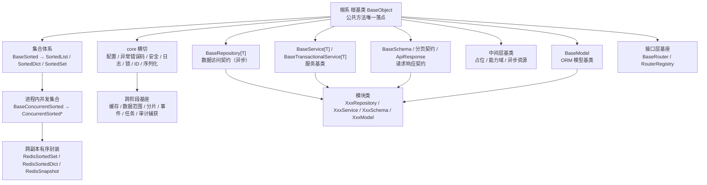
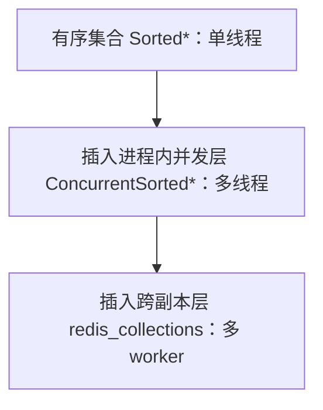

# 后端基类清单

> 后端基类权威清单：已有基类的分层、职责、代码位置、继承链与状态（bms 权威源维护，产品经工作区符号链接引用）

[文档首页](文档首页.md) › 后端基类清单　|　[配套：《后端开发规范》](规范/后端开发规范.md) · [前端基类清单 →](前端基类清单.md)

## 1. 用途与维护 

- **定位**：后端基类**权威清单**——回答「有哪些基类、在哪一层、什么职责、代码在哪、是否已交付」。**强制用法口径与扩展规则**见《[后端开发规范](规范/后端开发规范.md)》「后端基座体系（强制）」节；体系机制见平台《架构设计 · 后端基础类体系》；详细契约见对应详细设计。
- **口径**：所有可继承的后端类收敛为一套分层体系（根系 根基类 + 集合体系 / 模块基类 / core 横切 / 跨阶段基座 + 中间层基类）；**公共字段/方法只在对应层基类维护，任何模块不得重复实现**；调整某一层基类即全链生效。
- **状态取值**：`已交付` / `占位`（接口或结构就位、真实实现待回补）/ `待交付`（已设计未落地）；与平台架构节点登记一致。
- **维护**：新增/调整基类须同步本清单 + 平台《架构设计 · 后端基础类体系》登记 + 对应阶段任务基座登记 + 相关详细设计；状态列随实施回写。

## 2. 分层总览 

| 层 / 支线 | 基类 / 能力 | 形态 | 父层 | 代码位置 | 职责 | 状态 |
| --- | --- | --- | --- | --- | --- | --- |
| 根系 | 根基类 `BaseObject` | 普通类 | — | `app/core/base.py` | 一切可继承后端类之根：公共方法唯一落点 | 已交付 |
| 根系 | 值容器 `ValueHolder` | 类 | `BaseObject` | `app/core/base.py` | `get_locked` 上下文内可替换值容器 | 已交付 |
| 集合 | 有序集合 `BaseSorted` → `SortedList` / `SortedDict` / `SortedSet` | 抽象类 | 根系 | `app/core/collections.py` | 插入即有序；对外输出稳定序 | 已交付 |
| 集合 | 进程内并发集合 `BaseConcurrentSorted` → `ConcurrentSorted*` | 类 | `BaseSorted` | `app/core/concurrent.py` | 多线程共享：原子 / 快照语义 | 已交付 |
| 集合 | 跨副本有序封装 `RedisSortedSet` / `RedisSortedDict` / `RedisSnapshot` | 类 | `BaseObject` | `app/core/redis_collections.py` | 多 worker / 跨副本共享：Redis 为事实源 + 只读快照 + 版本号 | 已交付 |
| 模块基类 | 数据访问契约 `BaseRepository[T]` / 作用域过滤 `BaseScopedRepository[T]` / 内存基线 `BaseMemoryRepository[T]` / DB 实现 `BaseDbRepository[T]` | 抽象类 | 根系 | `app/repositories/` | CRUD 契约 + 派生方法 + 数据源 / 分片路由；软删除 + 数据范围 + 租户条件过滤；DB 实现真实落库（会话构造注入 / 写入白名单 / 软删硬删出口 / 乐观锁） | 已交付（DB 实现 01_03，2026-09-22；租户条件 02-02） |
| 模块基类 | 服务基类 `BaseService[T]` / 事务扩展层 `BaseTransactionalService[T]` | 类 | 根系 | `app/services/` | 通用 CRUD 委派仓储 + 统一不存在语义 + 分页；事务边界 | 已交付 |
| 模块基类 | 请求/响应基类 `BaseSchema` / 分页契约 / `ApiResponse` | 类（多重继承 Pydantic） | 根系 | `app/schemas/` | Pydantic 公共配置与统一序列化；统一响应与分页契约 | 已交付 |
| 模块基类 | ORM 模型基类 `BaseModel` | 类 | 根系 | `app/models/base.py` | ORM 公共字段与约定（雪花 ID / 软删除 / 审计 / 乐观锁 / 四库类型映射；索引命名 `idx_{表}_{列}`） | 已交付（落库验证 01_03，2026-09-22） |
| 接口层 | 路由基类 `BaseRouter` / 登记表 `RouterRegistry` | 类（多父类含 FastAPI `APIRouter`） | 根系 | `app/api/base.py` | 模块路由统一前缀 / tags / 默认错误响应 / 元信息；登记（`key` 拒重）与统一挂载；参数绑定与鉴权占位 | 已交付（02-6-1，2026-09-20） |
| 中间层 | 占位 `BasePlaceholder` / `BaseNullObject` / `BaseStub` | 类 | `BaseObject` | `app/core/capability.py` | 占位标记与统一抛错（空实现 / 未实现） | 已交付 |
| 中间层 | 能力域 `BaseCapability` | 抽象类 | `BaseObject` | `app/core/capability.py` | 能力域标识（`key`） | 已交付 |
| 事件域 | 事件工作单元 `BaseEventWorker` | 抽象类 | `BasePluggable` | `app/events/base.py` | 事件类型（`event_type`）；发布 / 消费**共享父**（02-1 起挂插件体系），其下各加一层：`BaseEventPublisher`（`event`）/ `BaseEventConsumer`（`event_consumer`，分轨） | 已交付（02-1 迁入；2026-09-16 发布 / 消费各加一层并分轨） |
| 事件域 | 发布侧基类 `BaseEventPublisher` | 抽象类 | `BaseEventWorker` | `app/events/base.py` | 发布侧域键（`key = plugin_key = "event"`）；`EventPublisher` 继承并声明 `publish` / `publish_transactional` | 已交付（2026-09-16） |
| 事件域 | 消费侧基类 `BaseEventConsumer` | 抽象类 | `BaseEventWorker` | `app/events/base.py` | 消费侧域键（`key = plugin_key = "event_consumer"`，三属性自身声明）；`EventConsumer` 继承并声明 `consume`；装配分区 `[event_consumer]`（仅预热） | 已交付（2026-09-16） |
| 中间层 | 插件化 `BasePluggable` | 抽象类 | `BaseCapability` + `BaseAsyncResource` | `app/core/plugin.py` | 实现可替换装配：插件键 / 实现名 / 注册与解析 / 契约版本 / 生命周期；继承自动登记与显式注册双入口 | 已交付（阶段三 01-1，2026-09-15；见平台《架构设计 · 扩展点与插件化》） |
| 中间层 | 提供者注册表 `BaseProviderRegistry[ItemT]` | 抽象类 | `BasePluggable` | `app/core/provider.py`（03-2 归位；`registry.py` 过渡导出） | 注册表公共实现：`register` 唯一性拒重 / `get` 未命中 `None` / `keys` / `values` 保序（聚合模板留各域；`_provider_key` 统一取 `provider.key`） | 已交付（阶段三 02-2，2026-09-15；**4 域注册表全部接入，03-3 收敛完成**） |
| 中间层 | 注册项 `BaseProvider` | 抽象类 | `BaseCapability`（组合轨，不入插件注册表） | `app/core/provider.py` | 注册项公共契约：抽象 `key` + 抽象 `describe` 元信息强约束；4 类提供者（字段类型 / 查询提供者 / 卡片提供者 / 健康检查项）改继承 | 已交付（阶段三 03-2，2026-09-15；Kiwi 651 / 652） |
| 中间层 | 异步资源 `BaseAsyncResource` | 抽象类 | `BaseObject` | `app/core/capability.py` | `aclose()` + `async with` 生命周期 | 已交付 |
| 数据访问横切 | 工作单元 `UnitOfWork`（`NullUnitOfWork` / `DbUnitOfWork`） | 类 | — | `app/db/unit_of_work.py`、`app/db/null.py` | 统一异步事务 `begin` / `commit` / `rollback` | 已交付 |
| 数据访问横切 | 异步引擎 `EngineFactory` / 会话 `get_db`·`get_read_db`·`get_write_db`·`get_uow` / 读写绑定 / 主库可用性 `PrimaryHealth` | 类 / 函数 | `BaseAsyncResource` | `app/db/engine.py`、`session.py`、`routing.py`、`health.py` | 引擎主 / 副本创建与缓存、请求级会话读写选引擎（**按请求租户库键路由**）、写与事务强制主库、主库故障只读降级 | 已交付（02-01，2026-09-22；租户路由 02-02，2026-09-22；真库实测归 02-05） |
| 多租户 | 租户上下文 `TenantContext` / 租户源 `TenantSource` / 全局中间件 `TenantMiddleware` / 解析链 / 引擎注册表 `EngineRegistry` | 类 | `BaseObject` / `BaseAsyncResource` | `app/db/tenant.py`、`tenant_source.py`、`api/middleware.py`、`registry.py` | 解析链（子域名 → `X-Tenant-ID` → 令牌租户位 + 豁免路径）；平台库 `sys_tenant` 真实取数与缓存基座短 TTL / 失效 / 停用回收；引擎注册与生命周期（平台常驻 / 懒加载 / LRU / 闲置清扫 / 活跃上限 / 跨实例创建锁 / 读写角色 / 按活跃引擎数预算） | 已交付（引擎读写 02-01；解析链与注册表实测 02-02，2026-09-22） |
| cross 横切 | `BizError` 体系 / 配置 / 安全 / 日志 | 类 / 模块 | — | `app/core/` | 统一异常与错误码、配置读取、安全原语、结构化日志 | 已交付（安全 / 日志占位） |
| 能力域横切 | 数据脱敏 `BaseMasker` / 权限校验 `BasePermissionChecker` | 抽象类 | `BasePluggable` | `app/masking/`、`app/permission/` | 字段掩码（`register` / `mask` / `reveal`）与权限码校验（`check` / `require`）契约；占位实现原样返回 / 恒定允许（权限契约 02-3-9 于 2026-09-14 复用核销，不重复建设） | 占位 |
| 能力域横切 | 分布式锁 `BaseDistributedLock` | 抽象类 | `BasePluggable` | `app/lock/` | 跨实例互斥（异步 `acquire` / `release` / `extend` + `hold` 上下文）与锁 key 统一拼接；占位恒定成功 | 占位 |
| 能力域横切 | 验证码 `BaseCaptcha`（图形 / 滑块 / 短信三形态）/ 密码策略 `BasePasswordPolicy` | 抽象类 | `BasePluggable` | `app/captcha/`、`app/password/` | 验证码出题（`generate` 带形态 / `send_sms`）· 凭证判定与强制校验（`verify_credential` / `require_credential`；图形码兼容入口 `verify`）· 场景策略（`policy`）+ 形态 / 凭证 / 策略数据契约 + 手机号脱敏入口 · 密码复杂度 / 有效期 / 历史重复（`validate` / `expired` / `reused`）；占位恒定通过 / 恒定允许 | 占位（渠道扩展 02-3-14，2026-09-20） |
| 能力域横切 | 降级 `BaseFallbackPolicy` / 熔断 `BaseCircuitBreaker` | 抽象类 | `BasePluggable` | `app/fallback/`、`app/circuit/` | 依赖故障应对：降级动作选择（`resolve`）· 熔断放行判定与三态（`allow` / `record_*` / `state`）；占位不降级 / 恒定闭合 | 占位 |
| 能力域横切 | 限流 `BaseRateLimiter` / 幂等 `IdempotencyStore` / 防重放 `BaseReplayGuard` | 抽象类 | `BasePluggable` | `app/ratelimit/`、`app/idempotency/`、`app/replay/` | 写接口防护：配额判定（`check` / `require`）· 幂等键去重与首次结果复用（`begin` / `load` / `save`）· 防重放编排（时间窗 + HMAC 签名 + nonce）；占位恒定放行 / 恒定首次 / nonce 不拦截 | 占位 |
| 能力域横切 | 指标 `BaseMetrics` / 链路 `BaseTracer` | 抽象类 | `BasePluggable` | `app/metrics/`、`app/tracing/` | 可观测性：数值采集（`counter` / `gauge` / `histogram`）· 调用链上下文（`span` 异步上下文、`SpanContext`）；占位空操作 / 生成占位 ID 不上报 | 占位 |
| 能力域横切 | 健康检查项注册表 `BaseHealthCheck` / `BaseHealthCheckRegistry` | 抽象类 / 类 | `BaseProvider` / `BaseProviderRegistry` | `app/health/`（`base.py` / `registry.py` / `checks.py` / `null.py`） | 依赖就绪：检查项契约（抽象 `key`（`name` 为兼容别名）+ 抽象 `describe` + 异步 `check`）+ 注册表（`register` 唯一性 / `get` / `keys` / `checks` + 聚合模板 `aggregate`——并发 + 单项 / 整体两级超时）+ 结果 / 报告契约（`HealthCheckResult` / `HealthCheckReport`，`{name, ok, error}` / `{ok, checks}`）；真实注册表 `local`（`HealthCheckRegistry`，装配工厂注入超时与 `redis` / `database` 检查项）与 `null` 缺省均经插件注册表解析（`/readyz` 经聚合） | 已交付（02-2 插件化；03-2 键口径统一） |
| 能力域横切 | 开放接口服务端 / scope `BaseOAuthServer` / `BaseScopeChecker` | 抽象类 / 类 | `BasePluggable` | `app/oauth/` | 开放接口：Client Credentials 签发与撤销（`issue_token(ClientCredentials)` / `revoke`）+ 授权面 scope 校验（`check(granted, required)`）+ 数据契约（`ClientCredentials` / `OAuthToken`）与常量（`GRANT_TYPES` / `TOKEN_TYPE_BEARER`）；占位固定占位令牌 / 恒定允许 | 占位 |
| 能力域横切 | 缓存 Region `CacheRegion` / `NullCacheRegion` / `MemoryCacheRegion` / `RedisCacheRegion` | 抽象类 / 类 | `BasePluggable` | `app/cache/`（`base.py` / `null.py` / `memory.py` / `redis.py`） | 缓存：key 规范（`build_key`）+ TTL + 全局版本号惰性比对（`get` / `set` / `delete` / `get_global_version` / `is_stale`）；实现：`memory`（进程内 LRU + TTL + 版本，`bump_version`）/ `redis`（redis-py 自写：同步契约 + 异步方法 `a*` / JSON / TTL 抖动 / SETNX / INCR，异常统一降级）/ `null`（占位恒未命中 / 空操作） | 已交付（05 契约；真实实现 02-4-27，2026-09-21） |
| 能力域横切 | 审计捕获 `AuditCapturer` / `NullAuditCapturer` | 抽象类 / 类 | `BasePluggable` | `app/audit/`（`base.py` / `null.py`） | 审计：关键表判定（`is_audited`）与字段级变更捕获（`capture` → 审计事件）；占位不判定 / 返回占位事件 | 已交付（05，2026-09-15；真实落库随审计阶段） |
| 能力域横切 | 任务调度 `BaseTask` / `NullTask` | 抽象类 / 类 | `BasePluggable` | `app/tasks/`（`base.py` / `null.py`） | 任务：任务名 / 队列 / 执行体（`name` / `queue` / `run`）；占位不执行 | 已交付（05，2026-09-15；调度入库随后续） |
| 能力域横切 | 事件发布 / 消费 `EventPublisher` / `EventConsumer` 与 `NullEventPublisher` / `NullEventConsumer` | 抽象类 / 类 | `EventPublisher` → `BaseEventPublisher` → `BaseEventWorker`、`EventConsumer` → `BaseEventConsumer` → `BaseEventWorker` | `app/events/`（`base.py` / `null.py`） | 事件：事件类型 + 发布 / 事务发布（`event_type` / `publish` / `publish_transactional`）+ 分区有序消费（`consume`）；**发布 / 消费两侧占位均为空操作**（不连中间件、不投递、不消费），真实实现随后续（M10 集成消息可用） | 已交付（05，2026-09-15；消费侧占位 2026-09-16 补齐，Kiwi 689） |
| 能力域横切 | 对象存储 `BaseObjectStorage` | 抽象类 / 类 | `BasePluggable` | `app/storage/`（`base.py` / `null.py` / `local.py` / `minio.py`） | 对象存储：写入 / 读取 / 删除 / 存在判定 / 预签名（`put` / `get` / `delete` / `exists` / `presign`）+ 数据契约（`StoredObject` / `PresignedUrl`）与常量（`STORAGE_BUCKET` / `DEFAULT_PRESIGN_TTL`）；实现：`local`（真实读写，缺省）/ `minio`（延迟导入）/ `null`（占位固定返回） | 已交付（04-1，2026-09-15；本地真实读写 + MinIO 延迟导入，Kiwi 661 / 662） |
| 能力域横切 | LLM 适配 `BaseLlmProvider` | 抽象类 / 类 | `BasePluggable` | `app/llm/` | 统一 Provider：对话 / 向量化 / 识别（异步 `chat` / `embedding` / `ocr`，`provider_key` / `model` 可选）+ 数据契约（`ChatMessage` / `ChatResult` / `EmbeddingResult` / `OcrResult`）与常量（`LLM_PROVIDER_TYPES` / `NULL_EMBEDDING_DIM`）；占位固定回复 / 零向量 / 占位文本、不调模型 | 占位 |
| 能力域横切 | 全文检索 `BaseSearchIndex` | 抽象类 / 类 | `BasePluggable` | `app/search/` | 统一索引：写入 / 删除 / 检索（异步 `index` / `delete` / `search`，契约对象传参）+ 数据契约（`SearchDocument` / `SearchQuery` / `SearchHit` / `SearchResult`）与常量（`SEARCH_INDEX_PREFIX` / `DEFAULT_SEARCH_SIZE`）；租户隔离 + 数据权限过滤由实现强制注入；占位写 / 删空操作、search 固定占位命中 | 占位 |
| 能力域横切 | 通知渠道 `BaseNotifier` | 抽象类 / 类 | `BasePluggable` | `app/notify/` | 统一发送：`send(NotificationMessage)`（异步）+ 渠道枚举（`NotifyChannel`：inbox / email / sms）+ 数据契约（`NotificationMessage` / `SendResult`）；占位固定返回成功、不真实发送 | 占位 |
| 能力域横切 | 实时推送 `BaseRealtimePublisher` | 抽象类 / 类 | `BasePluggable` | `app/ws/` | 统一推送：事件发送 + 房间加入 / 离开（异步 `emit` / `join` / `leave`）+ 事件常量（`REALTIME_EVENTS`）+ 数据契约（`RealtimeEvent`）；占位三方法空操作、不连 Socket.IO / Redis | 占位 |
| 能力域横切 | 出站集成 `BaseHttpClient` / `BaseWebhookSender` | 抽象类 / 类 | `BasePluggable` | `app/outbound/` | 出站集成：外部 HTTP 调用（异步 `request`）+ Webhook 投递（异步 `send`）+ 数据契约（`HttpResponse` / `WebhookResult`）与常量（`DEFAULT_TIMEOUT` / `DEFAULT_MAX_RETRIES`）；占位固定成功、不外呼 | 占位 |
| 能力域横切 | 工作流引擎 `BaseWorkflowEngine` | 抽象类 / 类 | `BasePluggable` | `app/workflow/` | 统一引擎适配：部署 / 启动 / 完成任务（异步 `deploy` / `start` / `complete_task`）+ 动作枚举（`WorkflowAction`）+ 数据契约（`ProcessDefinition` / `ProcessInstance` / `WorkflowTask`）与常量；占位部署空操作、启动 / 完成任务固定返回占位实例 | 占位 |
| 能力域横切 | 身份源 `BaseIdentityProvider` / 会话存储 `BaseSessionStore` | 抽象类 / 类 | `BasePluggable` | `app/idp/`、`app/session/` | 客户端侧身份源（异步 `authorize` / `exchange_token` / `userinfo`）+ 会话存取（异步 `save` / `load` / `delete`）+ 数据契约（`IdentityToken` / `IdentityUser`）与常量（`IDP_PROTOCOLS` / `DEFAULT_SESSION_TTL`）；占位固定返回、不连外部 IdP / Redis | 占位 |
| 能力域横切 | 数据查询提供者 `BaseQueryProvider` / `BaseQueryProviderRegistry` / `LocalQueryProviderRegistry` | 抽象类 / 类 | `BaseProvider` / `BaseProviderRegistry` | `app/query/`（`base.py` / `null.py` / `local.py`） | 查询提供者（抽象 `key` + 异步 `query`）+ 共享注册表（登记 / 解析 / 清单继承 `BaseProviderRegistry` 公共实现 + `query` 聚合模板）+ 结果契约（`QueryResult`）；真实注册表 `local`（登记内建提供者）+ 占位 `null` | 已交付（02-4-27，2026-09-21；内建示例提供者 `builtin`（字典条目只读查询）随字典高级查询落地） |
| 能力域横切 | 导入导出 `BaseImporter` / `BaseExporter` | 抽象类 / 类 | `BasePluggable` | `app/transfer/` | 导入（异步 `parse` / `validate`）+ 导出（`export` 流式 `AsyncIterator[bytes]`）+ 数据契约（`ColumnSpec` / `RowError` / `ImportResult`）；占位空结果 / 空流、不读写文件 | 占位 |
| 能力域横切 | 审计哈希链 `BaseHashChain` | 抽象类 / 类 | `BasePluggable` | `app/audit/` | 链计算与校验（同步 `compute` / `verify`）+ 数据契约（`HashChainEntry` / `ChainVerifyResult`）与常量（`GENESIS_HASH` / `HASH_ALGORITHM`）；占位固定返回 / 恒定通过、不计算 | 占位 |
| 能力域横切 | 归档 `BaseArchivePolicy` / `BaseArchiveQueryRouter` | 抽象类 / 类 | `BasePluggable` | `app/archive/` | 归档策略（异步 `matches` / `archive`）+ 查询路由（同步 `resolve`）+ 结果契约（`ArchiveResult`）与常量（`ARCHIVE_LOCATIONS`）；占位恒定不归档 / 恒定在线库 | 占位 |
| 能力域横切 | 字段类型 `BaseFieldType` / `BaseFieldTypeRegistry` / `LocalFieldTypeRegistry` | 抽象类 / 类 | `BaseProvider` / `BaseProviderRegistry` | `app/fieldtype/`（`base.py` / `null.py` / `local.py`） | 字段类型提供者（抽象 `key` + 同步 `validate` / `render_metadata` / `column_type`）+ 注册表（登记 / 解析 / 清单继承 `BaseProviderRegistry` 公共实现 + `validate` / `column_type` 聚合模板）+ 常量（`COLUMN_TYPE_DIALECTS` / `NULL_COLUMN_TYPE`）；真实注册表 `local`（内建十类型含 `dict` / `dict_multi`，`SimpleFieldType` 数据驱动）+ 占位 `null` | 已交付（02-4-27，2026-09-21；`dict` / `dict_multi` 与前端语义键 `dict-select` / `dict-multi` 对齐） |
| 能力域横切 | 国际化翻译 `BaseTranslator` | 抽象类 / 类 | `BasePluggable` | `app/i18n/` | 翻译（异步 `translate` / `load_messages` + 同步 `resolve_locale`）与常量（`DEFAULT_LOCALE` / `SUPPORTED_LOCALES`）；占位原样返回 key / 默认 locale / 空语言包 | 占位 |
| 能力域横切 | 工作台卡片 `BaseDashboardCardProvider` / `BaseDashboardCardRegistry` | 抽象类 / 类 | `BaseProvider` / `BaseProviderRegistry` | `app/dashboard/` | 卡片提供者（抽象 `key` + 同步 `metadata` / 异步 `fetch`）+ 注册表（登记 / 解析 / 清单继承 `BaseProviderRegistry` 公共实现 + `metadata` / `fetch` 聚合模板）+ 常量（`CARD_TYPES`）；占位空卡片集 | 占位 |
| 跨阶段基座 | 缓存 Region / 数据范围 / 分片路由 / 事件 / 任务 / 审计捕获 | 抽象类 | `BasePluggable` 等 | `app/cache/`、`scope/`、`sharding/`、`events/`、`tasks/`、`audit/` | 契约骨架，真实实现随回补阶段 | 占位 |
| — | 模块类 | — | 对应基类 | 各模块 | `XxxRepository` / `XxxService` / `XxxCreateRequest`·`XxxResponse` / `XxxModel` | — |

## 3. 根系 根基类 

- **形态**：普通类 `BaseObject`（非 ABC，可被 SQLAlchemy 声明式基类等混合继承）；**所有可继承的后端类默认从其派生**（模块基类、集合类、中间层基类）。
- **提供**：公共方法唯一落点——序列化、稳定序序列化、统一字符串输出、主键相等与哈希；序列化取字段**声明字段优先**（dataclass → `dataclasses.fields`；Pydantic → `model_dump()`；其余 → `__dict__` 兜底）；不含任何业务或框架语义。
- **约束**：只放「所有后端类共有」的横切能力；任一方的特有逻辑（数据访问流程、序列化配置、并发保护）不得上提 根系。
- `ValueHolder`：`get_locked` 类上下文内可替换的值容器（进程内与 Redis 复用）。

## 4. 集合体系（有序 / 进程内并发 / 跨副本） 

集合是后端公共数据形态，按共享范围自小到大**逐层演进**，层数与形态随需扩展（见「扩展与演进」节）：

| 形态 | 基类 / 封装 | 代码位置 | 职责 |
| --- | --- | --- | --- |
| 有序 | `BaseSorted` → `SortedList` / `SortedDict` / `SortedSet` | `core/collections.py` | 插入即有序；对外输出稳定序 |
| 进程内并发 | `BaseConcurrentSorted` → `ConcurrentSorted*` | `core/concurrent.py` | 多线程共享：原子复合方法 + 快照遍历；锁策略 `LockStrategy` 显式传入（`RW` 默认 / `RLCK` / `SHARDED` / `SNAPSHOT`） |
| 跨副本 | `RedisSortedSet` / `RedisSortedDict` / `RedisSnapshot` | `core/redis_collections.py` | 跨副本 / 多 worker：Redis 为事实源 + 只读快照 + 版本号（`{key}:version` 惰性比对） |

- 锁原语：`LockStrategy` / `ReadWriteLock` / `LockGuard`（`core/locking.py`，`ReadWriteLock` / `LockGuard` 继承 `BaseObject`）。
- 复合操作语义：`replace_if_equal` / `get_and_remove` 用 Lua；`update_atomic` / `get_locked` 用 WATCH + MULTI 乐观重试。

## 5. 模块基类（数据访问 / 服务 / 契约 / 模型） 

模块基类是**平行的兄弟基类**（各自继承 `BaseObject`，互不继承）；模块类分别继承对应基类。它们之间是**调用链**（服务调用仓储、仓储操作模型），不是继承层级。

| 基类 | 代码位置 | 职责与关键成员 |
| --- | --- | --- |
| `BaseRepository[T]` | `repositories/base_repository.py` | 仓储**契约**（异步）：CRUD 抽象 + `exists` / `list_page` / `list_cursor`（**keyset**） / 软删硬删出口派生 + 数据源（只读标记）/ 分片路由钩子 + `_guard_version` 乐观锁转译；排序 / 游标对外入口 `effective_sort` / `build_cursor`（游标由仓储按末行生成） |
| `BaseMemoryRepository[T]` | `repositories/base_memory_repository.py` | 内存基线（异步：字典存储 + 自增 ID，继承 `BaseScopedRepository` 按作用域过滤），子类只实现同步 `_build` / `_apply`；测试替身，硬删语义（无软删字段）；排序与游标经 `repositories/ordering.py` 与 DB 侧同口径（NULL 恒末位、keyset 镜像） |
| `BaseScopedRepository[T]` | `repositories/base_scoped_repository.py` | **作用域过滤中间层**：软删除 + 数据范围 + **租户条件**（`_scope_conditions(include_soft_delete=...)` / `_matches_scope`，覆盖读写；`tenant_scoped` 且上下文租户有主键时强制注入 `tenant_id` 条件；操作符 eq/ne/in/like/gt/gte/lt/lte/between/is_null/is_not_null）；`soft_delete` / `hard_delete` 派生默认（DB 实现覆写） |
| `BaseDbRepository[T]` | `repositories/base_db_repository.py` | **数据库实现**（异步真实落库，继承 `BaseScopedRepository`）：会话构造注入 + `model` 类属性；CRUD / `SELECT EXISTS` 存在性 / 页码分页（限深由契约层把关）/ **keyset 游标分页**（`LIMIT` 无 `OFFSET`）；ORDER BY 经 `ordering.order_criteria`（**NULL 恒末位** `列 IS NULL` 排序键 + 主键兜底）；作用域条件 → SQL WHERE；写入严格白名单；租户 `create` 注入与 `update` 禁改；`delete` 默认软删 + `soft_delete` / `hard_delete` 出口；乐观锁冲突转 409（01_04，2026-09-22） |
| `UnitOfWork` | `db/unit_of_work.py`、`db/null.py` | 异步事务 `begin` / `commit` / `rollback` + `session`；`NullUnitOfWork`（空实现）、`DbUnitOfWork`（`AsyncSession`） |
| `BaseService[T]` | `services/base_service.py` | 通用 CRUD 委派仓储 + 统一不存在语义（`NotFoundError`）+ `page` / `cursor_page` 分页 |
| `BaseTransactionalService[T]` | `services/base_transactional_service.py` | 事务扩展层：写操作经 `UnitOfWork` 进入事务、读操作不包事务 |
| `BaseSchema` | `schemas/base.py` | Pydantic 公共配置并继承 `BaseObject` 获得统一序列化（声明字段优先） |
| 分页契约 | `schemas/pagination.py` | `BasePageQuery` / `BasePageResponse[T]`（页码）、`BaseCursorQuery` / `BaseCursorResponse[T]`（游标） |
| `ApiResponse` | `schemas/common.py` | 统一响应 `{code, message, data}`；列表分页 `data` 用分页契约 |
| `BaseModel` | `models/base.py` | ORM 公共字段与约定（雪花 ID / 软删除 / 审计 / 乐观锁 / 四库类型映射）+ 软删除辅助 `soft_delete()` / `restore()`；审计由 ORM 事件自动填充、乐观锁用 `version_id_col` |
| `ErrorCode` / `ErrorSegment` | `core/error_codes.py` | 平台错误码与段位登记点；模块错误码按注册段位各自登记 |

## 6. 中间层基类 

| 基类 | 代码位置 | 职责 | 继承 / 使用 |
| --- | --- | --- | --- |
| `BasePlaceholder` | `core/capability.py` | 占位实现公共父（`placeholder` 标记 + `describe()`） | `BaseNullObject` / `BaseStub` 继承 |
| `BaseNullObject` | `core/capability.py` | 空实现（Null Object，无副作用） | `NullUnitOfWork` / `NullDataScope` / `NullShardingRouter` 继承 |
| `BaseStub` | `core/capability.py` | 未实现占位：`_not_implemented()` 统一抛错 | `BaseSecurity` 及原语继承（`BaseDbRepository` 真实实现后已退出） |
| `BaseCapability` | `core/capability.py` | 能力域契约中间层（`key`） | 跨阶段基座继承；能力域基类经 `BasePluggable` 间接继承（02-1） |
| `BasePluggable` | `core/plugin.py` | 插件化中间层（继承 `BaseCapability` + `BaseAsyncResource`）：插件键 / 实现名 / 注册与解析 / 契约版本 / 生命周期 / `describe`；`PluginRegistry` 双轨登记与只读快照、`PluginError`（40002） | 已交付（阶段三 01-1）；**40 个能力域基类已改继承（02-1，2026-09-15）** |
| `BaseProviderRegistry` | `core/provider.py`（03-2 归位） | 提供者注册表中间层（继承 `BasePluggable`）：`register` 唯一性拒重 / `get` 未命中 `None` / `keys` / `values` 保序；`_provider_key` 钩子供各域 | 健康检查注册表继承（02-2）；其余 3 域收敛（03-3，2026-09-15） |
| `BaseProvider` | `core/provider.py` | 注册项公共契约（继承 `BaseCapability`，组合轨）：抽象 `key` + 抽象 `describe` | 4 类提供者已继承（03-2，2026-09-15） |
| `BaseFactory` | `core/factory.py` | 工厂基类（继承 `BasePluggable`）：一切工厂类之根——创建入口标识（`key` / `plugin_name` / `contract_version`）+ 参数校验（`validate` 默认空实现）+ 抽象创建（`create`）+ 产出物释放登记（经 `ResourceManager`）；各域工厂基类承公共创建逻辑，工厂只创建与装配、不承载业务判定 | 已交付（02-54，2026-09-20） |
| `BaseEventWorker` | `app/events/base.py` | 事件工作单元（`event_type`；继承 `BasePluggable`，02-1 自 `core/capability.py` 迁入） | `BaseEventPublisher` / `BaseEventConsumer` 继承（发布 / 消费各一层，`EventConsumer` 侧独立域键 `event_consumer`） |
| `BaseAsyncResource` | `core/capability.py` | 异步资源生命周期（`aclose()` + `async with`） | `EngineRegistry` / 工厂链等继承 |
| `ResourceManager` | `core/resources.py` | 异步资源统一登记 + 逆序回收（`register` / `aclose`） | `create_app` lifespan 统一释放（已登记 `EngineRegistry`） |

**基类候选（阶段三基座盘点，未落地前不视为基类；落地后按第 13 节维护约定回写本清单）**：

| 候选 | 代码位置（计划） | 职责 | 优先级 / 状态 |
| --- | --- | --- | --- |
| `BaseProvider` | `core/provider.py` | 统一注册项契约（抽象 `key` + 抽象 `describe`），收敛字段类型 / 查询提供者 / 卡片提供者 / 健康检查 | **已交付**（03-2，2026-09-15；组合轨边界护栏 Kiwi 651 / 652） |
| `BaseProviderRegistry` | `core/provider.py`（03-2 归位） | 注册表公共实现（`register` 唯一性 / `get` 未命中 / `keys` / `values`），收敛 4 个域注册表与 Null 注册表 | **已交付**（02-2，2026-09-15；4 域全部收敛随 03-3） |
| 契约测试基座 | `tests/`（测试侧） | 统一「注册表 + 全部注册实现」契约套件 | P1 候选 |
| Null 实现拆分与目录对齐 | 各能力域 `null.py` | 38 个 `NullXxx` 由 `base.py` 迁出（见平台《架构设计 · 扩展点与插件化》「代码结构」节） | P0 配套（阶段三前置） |
| 配置源中间层 / 日志落点中间层 | 待定 | 多源配置 / 多落点日志的适配层 | P2 暂缓（YAGNI，触发再评估） |

> 逐项验收要点与落点见《[阶段三需求提出清单](项目/03_后端插件化/README.md)》；分层口径见《[架构设计 · 后端基础类体系](设计/架构设计/04_架构设计_后端基础类体系.md)》「基类候选」节。

## 7. core 横切基座 

| 基座 | 代码位置 | 内容 | 状态 |
| --- | --- | --- | --- |
| 配置基座 | `core/config.py` | 分区模型继承 `BaseSettings`（`BaseSettings → BaseSchema`，拒绝未知键 / 字段名填充）+ `get_settings()`（真实读取：`config.toml` 基线 + `config.{env}.toml` 分层 + `BMS_` 覆盖 + 启动校验）；顶层 `Settings` 另继承 `pydantic_settings.BaseSettings` | 已交付 |
| 异常与错误码 | `core/exceptions.py`、`core/error_codes.py` | `BizError`（携带错误码 / `http_status` / `data`）+ 段位基 `GeneralError`(1xxxx) / `AuthError`(2xxxx) / `UserOrgError`(3xxxx) / `ConfigError`(4xxxx) / `OpenTenantError`(8xxxx) + 骨架子类；全局处理器转 `ApiResponse` | 已交付 |
| 安全基座 | `core/security.py` | 中间层基 `BaseSecurity(BaseStub)` + `PasswordHasher` / `TokenCodec` / `SessionSecurity`（签名占位） | 占位 |
| 日志基座 | `core/logging.py` | 门面中间层 `BaseLogger` + structlog 实现 `StdoutLogger`；入口 `configure_logging` / `get_logger`（stdout、不落文件；dev console / test·prod JSON、上下文注入、脱敏） | 已交付（真实实现） |
| 稳定序列化 | `core/serialization.py` | 统一稳定 JSON（键排序、中文不转义、不可序列化值降级 str） | 已交付 |
| 并发锁原语 | `core/locking.py` | `LockStrategy` / `ReadWriteLock` / `LockGuard` | 已交付 |
| 雪花 ID | `core/id.py` | `SnowflakeGenerator`（标准雪花 41+10+12）；WorkerId 经配置注入（`BMS_APP__WORKER_ID`，启动期 `configure_id_generator` 生效；旧名 `BMS_WORKER_ID` 兜底已移除，导入期默认 0） | 已交付 |
| 请求上下文 | `core/context.py` | `current_user_id` / `current_tenant` / `read_only` / `current_masker` 上下文变量 + 设置 / 复位辅助（`current_masker` 供 `BaseSchema` 序列化期掩码） | 已交付 |
| 装配基座 | `core/assembly.py` | `PluginWiring`（继承 `BaseObject`；插件装配载体：能力域 ↔ 实现键绑定、装配清单与校验入口） | 已交付（阶段三；2026-09-16 审计补登记） |
| HTTP 中间件 | `api/middleware.py` | `RequestLoggingMiddleware` / `TraceIdMiddleware` / `ReadOnlyMiddleware` / `TenantMiddleware`（继承 `BaseObject`；请求日志 / 链路 ID 注入 / 只读标记——按 HTTP 方法设置 `read_only` 上下文，供读写分离选引擎 / 租户解析全局中间件——解析链 + 请求态与上下文注入、未知与停用租户就地拒绝） | 已交付（2026-09-16 审计补登记；`ReadOnlyMiddleware` 02-01，2026-09-22；`TenantMiddleware` 02-02，2026-09-22） |

## 8. 数据访问与多租户基座 

| 基类 / 能力 | 代码位置 | 职责 | 状态 |
| --- | --- | --- | --- |
| `EngineFactory` | `db/engine.py` | 按 `(db_key, 读写角色)` 创建 / 缓存引擎：写主库、只读轮询副本（无副本回落主）、四库方言（MySQL / PostgreSQL / 达梦同步 / SQLite）、**租户库键经 `url_template` 模板解析（`{service}` / `{tenant}` / `{database}`；空模板回落单库）**、连接池按服务（`[app].service`）、`connect_args` 建连超时、`create_sync`（达梦与连通性）、`drop` / `aclose` | 已交付（02-01，2026-09-22；租户模板 02-02，2026-09-22）；**已挂工厂链 `EngineFactory → BaseDbFactory → BaseFactory`（02-54，2026-09-20）** |
| `get_db` / `get_read_db` / `get_write_db` / `get_uow` / `SessionFactory` / `session_scope` | `db/session.py` | `async_sessionmaker`；`get_db` 按请求只读标记选引擎（**请求租户上下文存在时取租户库键引擎，否则回落平台库**）、`get_read_db` / `get_write_db` 显式强制、`get_uow` 绑定主库会话（写与事务强制主库）；每请求独立、退出释放；`session_scope` **统一会话入口**（按租户 / 库键 + 读写角色 + 会话工厂，模块内取会话一律经它，禁止自建 `async_sessionmaker`）；公共依赖汇总 `api/deps.py` | 已交付（02-01，2026-09-22；租户路由 02-02，2026-09-22；`session_scope` 01_03，2026-09-22） |
| 读写绑定 | `db/routing.py`、`core/context.py` | `read_only` 上下文标记 + `WRITE_BINDING`（`default`）/ `READ_BINDING`（`replica`）+ `SAFE_METHODS` / `is_read_method`；只读标记由 `ReadOnlyMiddleware` 按方法设置、路由可显式覆盖 | 已交付（02-01，2026-09-22） |
| `PrimaryHealth` | `db/health.py` | 主库可用性：降级标记（`mark_degraded` / `mark_recovered` / `is_degraded`）+ `probe` 探测恢复（继承 `BaseAsyncResource`）；供主库故障只读降级 | 已交付（02-01，2026-09-22） |
| `TenantContext` / 解析链 / `TenantSource` / `get_tenant` | `db/tenant.py`、`db/tenant_source.py` | 租户上下文（编码 / 库键 / 名称 / 主键 / 状态 / 域名）与数据源键助手（`tenant_{code}` 派生 / 反解）；解析链（子域名按 `domain` → `X-Tenant-ID` 按 `code` → 令牌租户位；豁免路径；无来源 dev/test 回落、prod 拒绝）；`TenantSource` 平台库 `sys_tenant` 真实取数 + 缓存基座短 TTL / `invalidate` + 停用租户强制回收；未知租户 404 / 80001、停用租户 403 / 80002 | 已交付（02-02，2026-09-22） |
| `EngineRegistry` | `db/registry.py` | `{db_key → engine}` 注册表：平台常驻、租户懒加载、LRU 活跃上限、**闲置清扫（每次访问）**、`get(read_only=...)` 读写角色、**跨实例创建锁（分布式锁基座叠加进程内锁）**、连接预算（`pool_budget_warnings` + **`tenant_pool_budget_warnings` 按活跃引擎数**）、强制回收（`release`） | 已交付（02-01，2026-09-22；跨实例锁 / 闲置清扫 / 预算按活跃引擎数 02-02，2026-09-22） |
| 迁移链注册 `MigrationChain` | `db/migration.py` | 数据源 → 版本目录（`alembic/versions/<链名>/`）/ 表集 / 分支标签 / 连接串取法**唯一来源**；`MIGRATION_CHAINS`（platform / tenant / archive）+ `config_section` / `resolve_chain_from_section`（配置段名即链名）+ `chain_metadata`（元数据子集）+ `chain_url` + `has_revisions` + `current_revision` + `apply_session_schema`（达梦模式切换） | 已交付（01_04，2026-09-22） |
| 库级建删 `DatabaseTarget` | `db/admin.py` | 建删库 / 模式 / 文件能力：目标解析（库名 / 文件路径 / 达梦模式名大写归一）、管理连接串推导（MySQL 去库名 / PG `postgres` 库 / SQLite·达梦回落目标串）、`create_database` / `drop_database` / `database_exists`（幂等且不擅动既有对象）；CLI 见 `ops/db_admin.py` | 已交付（01_04，2026-09-22） |
| 开发库自动建表 | `db/bootstrap.py` | SQLite 环境按**迁移链表集**建表（`[database].auto_create` 开关 + 方言判定 + `create_all(checkfirst=True)` 幂等；骨架表不建），启动期由 `main.lifespan` 调用 | 已交付（01_04，2026-09-22） |
| 排序与游标公共实现 | `repositories/ordering.py` | `order_criteria`（NULL 恒末位 + 主键兜底 ORDER BY）、`keyset_condition`（键集续查谓词）、`sort_items` / `is_after_cursor`（内存镜像）、`assert_sortable_fields_indexed`（可排序字段须有索引或主键的断言工具） | 已交付（01_04，2026-09-22） |
| 游标契约 `CursorPayload` | `schemas/cursor.py` | keyset 游标载荷（排序规格指纹 + 末行键值 + 主键）与编解码（base64url JSON；支持 `None` / 布尔 / 数字 / 字符串 / `datetime` / `date`）；规格不一致或载荷非法抛 `ParamError`（10001） | 已交付（01_04，2026-09-22） |
| 分页契约 | `schemas/pagination.py` | `BasePageQuery`（页码**限深**：`page ≤ [pagination].max_page`，默认 100）/ `BaseCursorQuery`（keyset 游标令牌）/ 对应响应契约 | 已交付（01_04，2026-09-22） |

## 9. 跨阶段基座 

六类跨阶段基座**契约骨架已交付**（`02-4`），真实实现随对应阶段回补（**缓存已于 02-4-27 落地（2026-09-21，含字典域）**；任务 / 审计 → 阶段八；数据范围 → 七 RBAC；分片 → 十一；事件 → 十 M10 集成消息可用）：

| 基座 | 代码位置 | 契约 |
| --- | --- | --- |
| 缓存 Region 分域 | `cache/base.py` | `CacheRegion(BasePluggable)`（`domain` / `default_ttl`；`get` / `set` / `delete` / `get_global_version`）+ `build_cache_key` / `is_stale` |
| 数据范围注入 | `scope/base.py`、`scope/null.py` | `DataScope(BasePluggable)`（`read_predicate` 支持单条件 / 条件列表 / `allow_write`）+ `ScopeCondition`（11 种操作符）+ `NullDataScope`；`BaseRepository._apply_data_scope` 钩子、`BaseScopedRepository` 落过滤（读写） |
| 分片路由 | `sharding/base.py`、`sharding/null.py` | `ShardingRouter(BasePluggable)`（`resolve`）+ `ShardBinding` + `NullShardingRouter`；`BaseRepository._resolve_shard` 接入 |
| 事件发布 / 消费 | `events/base.py` | `EventEnvelope`（`tenant_id` / `trace_id`）+ `EventPublisher`（→ `BaseEventPublisher`）/ `EventConsumer`（→ `BaseEventConsumer`） |
| Celery 任务 | `tasks/base.py`、`models/system.py` | `BaseTask(BasePluggable)`（`name` / `queue` / `run`）+ `SysTask` / `SysTaskLog` 模型骨架 |
| 模块注册制 | `services/module_registry.py` | `ModuleRegistry` / `ModuleRecord`（继承 `BaseObject`；平台模块注册清单：唯一性与格式校验、段位登记，`ops/check_modules.py` 复用其规则） | 已交付（阶段三；2026-09-16 审计补登记） |
| ORM 审计捕获 | `audit/base.py`、`audit/null.py` | `AuditCapturer(BasePluggable)`（`is_audited` / `capture`）+ `FieldChange` |
| 数据脱敏（横切扩展） | `masking/base.py`、`masking/null.py` | `BaseMasker(BasePluggable)`（`key = "masking"`；`register` / `mask` / `reveal` + `check_plain`，权限检查器构造注入）+ `MaskRule` / `MASK_STRATEGIES` + `NullMasker`（原样返回）；`BaseSchema.masked_fields` + `current_masker` 序列化自动掩码；提供者 `get_masker` |
| 权限校验（横切扩展） | `permission/base.py`、`permission/null.py` | `BasePermissionChecker(BasePluggable)`（`check` / `require`，失败抛 `PermissionError` 30001）+ `NullPermissionChecker`（恒定允许）+ 提供者 `get_permission_checker` / 依赖工厂 `require_permission`（02-3-9 于 2026-09-14 复用核销，不重复建设） |
| 分布式锁（横切扩展） | `lock/base.py`、`lock/null.py` | `BaseDistributedLock(BasePluggable)`（`key = "distributed_lock"`；异步 `acquire` 带 TTL 返回锁令牌 / `release` 按令牌释放 / `extend` 续租 + `hold` 上下文，未取到抛 `ConcurrentConflictError`）+ `NullDistributedLock`（恒定成功、不连 Redis）+ `build_lock_key` / 提供者 `get_distributed_lock` |
| 验证码（横切扩展） | `captcha/base.py`、`captcha/null.py` | `BaseCaptcha(BasePluggable)`（`key = "captcha"`；异步 `generate(scene) -> CaptchaChallenge`（编号 / 图片字节 / 有效期 / 场景）/ `verify` 单次有效）+ `NullCaptcha`（恒定通过、占位不出图）+ `build_captcha_key` / `CAPTCHA_TTL=300` / `CAPTCHA_SCENES` / 提供者 `get_captcha` |
| 密码策略（横切扩展） | `password/base.py`、`password/null.py` | `BasePasswordPolicy(BasePluggable)`（`key = "password_policy"`；异步 `validate(password, *, username) -> tuple[str, ...]` 违规原因码、空元组通过 / `expired(pwd_changed_at, *, now)` / `reused(password, *, history)`）+ `NullPasswordPolicy`（恒定允许）+ `PASSWORD_VIOLATIONS` / 提供者 `get_password_policy` |
| 降级（横切扩展） | `fallback/base.py`、`fallback/null.py` | `BaseFallbackPolicy(BasePluggable)`（`key = "fallback"`；异步 `resolve(dependency, *, exc=None) -> FallbackAction`（`raise` / `default` / `skip` / `degrade`））+ `NullFallbackPolicy`（恒定 `raise`＝不降级）+ `DEPENDENCIES` 依赖清单 / 提供者 `get_fallback_policy` |
| 熔断（横切扩展） | `circuit/base.py`、`circuit/null.py` | `BaseCircuitBreaker(BasePluggable)`（`key = "circuit_breaker"`；异步 `allow(dependency) -> bool` / `record_success` / `record_failure` / `state -> CircuitState`（`closed` / `open` / `half_open`））+ `NullCircuitBreaker`（恒定闭合）+ 依赖清单单向复用降级域 / 提供者 `get_circuit_breaker` |
| 限流（横切扩展） | `ratelimit/base.py`、`ratelimit/null.py` | `BaseRateLimiter(BasePluggable)`（`key = "rate_limiter"`；异步 `check(key, rule) -> RateLimitDecision`（`allowed` / `limit` / `remaining` / `reset_after`）+ `require` 抛 `RateLimitError` 10005 / 429）+ `NullRateLimiter`（恒定放行）+ `RATE_LIMIT_DIMENSIONS`（`ip` / `user` / `client`）/ `RateLimitRule` / `DEFAULT_RATE_WINDOW` / `build_rate_limit_key` / 提供者 `get_rate_limiter` |
| 幂等（横切扩展） | `idempotency/base.py`、`idempotency/null.py` | `IdempotencyStore(BasePluggable)`（`key = "idempotency"`；异步 `begin(key, *, ttl) -> bool` 前置去重 / `load(key)` 取首次结果 / `save(key, payload, *, ttl)` 写首次结果）+ `NullIdempotencyStore`（恒定首次、不缓存）+ `IDEMPOTENCY_HEADER` / `DEFAULT_IDEMPOTENCY_TTL=86400` / `build_idempotency_key` / 提供者 `get_idempotency_store` |
| 防重放（横切扩展） | `replay/base.py`、`replay/null.py` | `BaseReplayGuard(BasePluggable)`（`key = "replay_guard"`；`verify` 模板方法固定编排「时间窗 → HMAC 签名 → nonce 去重」短路 + 抽象 `claim_nonce` + `require` 抛 `AuthError`）+ `NullReplayGuard`（nonce 恒定通过；时间窗与签名真实生效）+ `TIMESTAMP_HEADER` / `NONCE_HEADER` / `SIGNATURE_HEADER` / `REPLAY_WINDOW=300` / `ReplayReason` / `ReplayDecision` / 提供者 `get_replay_guard` |
| 指标（横切扩展） | `metrics/base.py`、`metrics/null.py` | `BaseMetrics(BasePluggable)`（`key = "metrics"`；异步 `counter` / `gauge` / `histogram`，`labels: Mapping[str, str] \| None`）+ `NullMetrics`（空操作、不连 Prometheus）+ `METRIC_KINDS`（counter / gauge / histogram）/ `METRIC_NAMES`（`bms_` 前缀六类）/ `DEPENDENCIES` 单向复用降级域 / 提供者 `get_metrics` |
| 链路（横切扩展） | `tracing/base.py`、`tracing/null.py` | `BaseTracer(BasePluggable)`（`key = "tracer"`；`span` 异步上下文模板编排 + 抽象 `start_span` / `end_span`）+ `NullTracer`（生成占位 ID、维护父链与上下文、不上报）+ `SpanContext`（`trace_id` / `span_id` / `name` / `parent_span_id` / `attributes`）/ `TRACE_ID_HEADER` / `new_trace_id` / `new_span_id` / `current_span` / `current_trace_id` / 提供者 `get_tracer`（入站中间件见 `api/middleware.py` 的 `TraceIdMiddleware`） |
| 健康检查项注册表（横切扩展） | `health/base.py`、`health/null.py`、`health/registry.py`、`health/checks.py` | `BaseHealthCheck`（`name` + 异步 `check`）+ `BaseHealthCheckRegistry(BasePluggable)`（`key = "health_check_registry"`；抽象 `register` / `checks` + 聚合模板 `aggregate`——并发 + 单项 / 整体两级超时、异常类名兜底）+ 真实注册表 `HealthCheckRegistry` / 占位 `NullHealthCheckRegistry`（无检查项、固定通过、不探依赖）+ 真实检查项 `RedisHealthCheck`（`PING`，兼 `BaseAsyncResource`）/ `DatabaseHealthCheck`（平台库 `SELECT 1`）+ `HealthCheckResult`（`name` / `ok` / `error`）/ `HealthCheckReport`（`ok` / `checks`）/ `DEPENDENCIES` 单向复用降级域 / 提供者 `get_health_check_registry`（`/readyz` 经聚合，见 `api/health.py`） |
| 开放接口服务端 / scope（横切扩展） | `oauth/base.py`、`oauth/null.py` | `BaseOAuthServer(BasePluggable)`（`key = "oauth_server"`；异步 `issue_token(ClientCredentials) -> OAuthToken` / `revoke(token)`）+ `NullOAuthServer`（固定占位令牌 `NULL_ACCESS_TOKEN`、不签发、撤销空操作）+ `ClientCredentials` / `OAuthToken` / `GRANT_TYPES`（三项）/ `TOKEN_TYPE_BEARER` / 提供者 `get_oauth_server`；`BaseScopeChecker(BasePluggable)`（`key = "scope_checker"`；同步 `check(granted, required)`）+ `NullScopeChecker`（恒定允许）+ 提供者 `get_scope_checker` |
| 对象存储（横切扩展） | `storage/base.py`、`storage/null.py`、`storage/local.py`、`storage/minio.py` | `BaseObjectStorage(BasePluggable)`（`key = "object_storage"`；异步 `put(key, data, *, content_type)` / `get` / `delete` / `exists` / `presign(key, *, method, expires_in)`）+ `LocalObjectStorage`（真实读写：键安全 / 原子写 / `file://` 预签名，缺省）/ `MinioObjectStorage`（延迟导入 SDK / 密钥环境注入）/ `NullObjectStorage`（固定返回、不连 MinIO / 不落盘）+ `StoredObject`（`key` / `size` / `content_type` / `etag`）/ `PresignedUrl`（`url` / `expires_in` / `method`）/ `STORAGE_BUCKET`（`bms-files`）/ `DEFAULT_PRESIGN_TTL`（3600）/ 提供者 `get_object_storage` |
| 缓存 Region（横切扩展） | `cache/base.py`、`cache/null.py`、`cache/memory.py`、`cache/redis.py` | `CacheRegion(BasePluggable)`（`key = "cache"`；`domain` / `get` / `set(key, value, ttl)` / `delete` / `get_global_version` + `build_key` 规范 / `is_stale` 版本判定）+ `NullCacheRegion`（恒未命中 / 空操作 / 版本 0）+ **真实实现**（02-4-27）：`MemoryCacheRegion`（进程内 LRU + TTL + 版本号 `bump_version`）/ `RedisCacheRegion`（**redis-py 自写**：同步契约方法 + 异步方法 `aget` / `aset` / `adelete` / `aincrease` / `asetnx` / `arelease_lock`；JSON 序列化 / `ttl_with_jitter` 防雪崩 / SETNX 防击穿 / 异常统一降级不抛业务错）+ `CACHE_KEY_PREFIX` / `GLOBAL_TENANT` / `default_ttl` / 提供者 `get_cache_region`（工厂登记 `memory` / `redis`） | 已交付（02-4-27，2026-09-21；02-13 原「dogpile.cache」表述按拍板回写为 redis-py 自写，理由见任务详细设计 §16） |
| 审计捕获（横切扩展） | `audit/base.py`、`audit/null.py` | `AuditCapturer(BasePluggable)`（`key = "audit"`；`is_audited(table)` / `capture(table, model_id, changes, actor)` → `EventEnvelope`）+ `NullAuditCapturer`（不判定、返回占位事件）+ `FieldChange` / 提供者 `get_audit_capturer`（哈希链 `BaseHashChain` 见审计链节） |
| 任务调度（横切扩展） | `tasks/base.py`、`tasks/null.py` | `BaseTask(BasePluggable)`（`key = "task"`；`name` / `queue` / `run(*args, **kwargs)`）+ `NullTask`（不执行）+ 提供者 `get_task` |
| 事件发布（横切扩展） | `events/base.py`、`events/null.py` | `EventPublisher → BaseEventPublisher → BaseEventWorker(BasePluggable)`（`key = "event"`；`event_type` / `publish` / `publish_transactional`）+ `NullEventPublisher`（空操作）+ `EventEnvelope` / 提供者 `get_event_publisher` |
| 事件消费（横切扩展） | `events/base.py`、`events/null.py` | `EventConsumer → BaseEventConsumer → BaseEventWorker(BasePluggable)`（**分轨**：`key = plugin_key = "event_consumer"`，三属性自身声明；`event_type` / `consume`）+ `NullEventConsumer`（空操作）+ 装配分区 `[event_consumer]`（仅预热，无 `app.state` 落点） |
| LLM 适配（横切扩展） | `llm/base.py`、`llm/null.py` | `BaseLlmProvider(BasePluggable)`（`key = "llm_provider"`；异步 `chat(messages, *, provider_key, model)` / `embedding(texts, ...)` / `ocr(image, ...)`）+ `NullLlmProvider`（固定占位回复 / 零向量 / 占位文本、不调模型）+ `ChatMessage`（`content` / `role`）/ `ChatResult` / `EmbeddingResult` / `OcrResult` / `LLM_PROVIDER_TYPES`（三项）/ `NULL_EMBEDDING_DIM`（1024）/ 提供者 `get_llm_provider` |
| 全文检索（横切扩展） | `search/base.py`、`search/null.py` | `BaseSearchIndex(BasePluggable)`（`key = "search_index"`；异步 `index(SearchDocument)` / `delete(index, doc_id)` / `search(SearchQuery)`）+ `NullSearchIndex`（写 / 删空操作、search 固定占位命中、不连 ES）+ `SearchDocument` / `SearchQuery` / `SearchHit` / `SearchResult` / `SEARCH_INDEX_PREFIX`（`bms-`）/ `DEFAULT_SEARCH_SIZE`（20）/ 提供者 `get_search_index` |
| 通知渠道（横切扩展） | `notify/base.py`、`notify/null.py` | `BaseNotifier(BasePluggable)`（`key = "notifier"`；异步 `send(NotificationMessage) -> SendResult`）+ `NullNotifier`（固定返回成功、不真实发送）+ `NotifyChannel`（`inbox` / `email` / `sms`）/ `NotificationMessage`（`channel` / `recipient` / `content` / `title` / `biz_type` / `biz_id`）/ `SendResult`（`delivered` / `message_id` / `detail`）/ `NULL_MESSAGE_ID` / 提供者 `get_notifier` |
| 实时推送（横切扩展） | `ws/base.py`、`ws/null.py` | `BaseRealtimePublisher(BasePluggable)`（`key = "realtime_publisher"`；异步 `emit(RealtimeEvent)` / `join(session_id, room)` / `leave(session_id, room)`）+ `NullRealtimePublisher`（三方法空操作、不连 Socket.IO / Redis）+ `RealtimeEvent`（`event` / `data` / `user_id` / `session_id` / `room`）/ `REALTIME_EVENTS`（三项）/ 提供者 `get_realtime_publisher` |
| 出站集成（横切扩展） | `outbound/http.py`、`outbound/null.py`、`outbound/webhook.py` | `BaseHttpClient(BasePluggable)`（`key = "http_client"`；异步 `request(method, url, *, headers, content, timeout)`）+ `NullHttpClient`（固定成功响应）+ `HttpResponse`（`status_code` / `headers` / `content`）/ `DEFAULT_TIMEOUT`（10）/ `DEFAULT_MAX_RETRIES`（3）；`BaseWebhookSender(BasePluggable)`（`key = "webhook_sender"`；异步 `send(url, payload, *, secret)`）+ `NullWebhookSender`（固定投递成功）+ `WebhookResult`（`delivered` / `status_code` / `attempts`） |
| 工作流引擎（横切扩展） | `workflow/base.py`、`workflow/null.py` | `BaseWorkflowEngine(BasePluggable)`（`key = "workflow_engine"`；异步 `deploy(ProcessDefinition)` / `start(definition_key, *, business_type, business_id)` / `complete_task(task_id, *, action, variables)`）+ `NullWorkflowEngine`（部署空操作、启动 / 完成任务固定返回占位实例）+ `WorkflowAction`（approve / reject / withdraw）/ `ProcessDefinition` / `ProcessInstance` / `WorkflowTask` / `WORKFLOW_STATUS` / `NULL_INSTANCE_ID` / `NULL_TASK_ID` / 提供者 `get_workflow_engine` |
| IdP / 会话存储（横切扩展） | `idp/base.py`、`idp/null.py`、`session/base.py`、`session/null.py` | `BaseIdentityProvider(BasePluggable)`（`key = "identity_provider"`；异步 `authorize(state)` / `exchange_token(code)` / `userinfo(access_token)`）+ `NullIdentityProvider`（固定返回）+ `IdentityToken` / `IdentityUser` / `IDP_PROTOCOLS`（四项）/ 提供者 `get_identity_provider`；`BaseSessionStore(BasePluggable)`（`key = "session_store"`；异步 `save` / `load` / `delete`）+ `NullSessionStore`（写 / 删空操作、load 占位）+ `DEFAULT_SESSION_TTL`（1209600）/ 提供者 `get_session_store` |
| 数据查询提供者（横切扩展） | `query/base.py`、`query/null.py`、`query/local.py` | `BaseQueryProvider(BaseProvider)`（抽象 `key` + 异步 `query(params) -> QueryResult`）+ `BaseQueryProviderRegistry(BaseProviderRegistry)`（`key = "query_provider_registry"`；登记 / 解析 / 清单继承公共实现 + `query` 聚合模板）+ `NullQueryProvider` / `NullQueryProviderRegistry`（登记真实、聚合空结果）+ **真实注册表 `LocalQueryProviderRegistry`**（`local`，装配注册内建提供者）+ `QueryResult`（`rows` / `total`）/ 提供者 `get_query_provider_registry` | 已交付（02-4-27，2026-09-21；内建示例提供者 `BuiltinDictQueryProvider`（`builtin`，字典条目只读查询，供高级查询 business 模式）） |
| 导入导出（横切扩展） | `transfer/base.py`、`transfer/null.py`、`transfer/importer.py`、`transfer/exporter.py` | `ColumnSpec`（`key` / `title` / `required`）；`BaseImporter(BasePluggable)`（`key = "importer"`；异步 `parse(data, *, columns)` / `validate(rows, *, columns)`）+ `NullImporter`（空结果）+ `RowError` / `ImportResult` / 提供者 `get_importer`；`BaseExporter(BasePluggable)`（`key = "exporter"`；`export(rows, *, columns) -> AsyncIterator[bytes]`）+ `NullExporter`（空流）/ 提供者 `get_exporter` |
| 审计哈希链（横切扩展） | `audit/hashchain.py`、`audit/null.py` | `BaseHashChain(BasePluggable)`（`key = "hash_chain"`；同步 `compute(prev_hash, record) -> str` / `verify(entries) -> ChainVerifyResult`）+ `NullHashChain`（固定返回 / 恒定通过）+ `HashChainEntry`（`prev_hash` / `record` / `record_hash`）/ `ChainVerifyResult`（`valid` / `broken_index`）/ `GENESIS_HASH`（64 位零 hex）/ `HASH_ALGORITHM`（`sha256`）/ 提供者 `get_hash_chain` |
| 归档（横切扩展） | `archive/base.py`、`archive/null.py` | `BaseArchivePolicy(BasePluggable)`（`key = "archive_policy"`；异步 `matches(record, *, now)` / `archive(records) -> ArchiveResult`）+ `NullArchivePolicy`（恒定不归档）+ `BaseArchiveQueryRouter(BasePluggable)`（`key = "archive_query_router"`；同步 `resolve(*, table) -> str`）+ `NullArchiveQueryRouter`（恒定在线库）+ `ArchiveResult`（`matched` / `archived` / `detail`）/ `ARCHIVE_LOCATIONS`（online / archive）/ 提供者 `get_archive_policy` / `get_archive_query_router` |
| 字段类型注册表（横切扩展） | `fieldtype/base.py`、`fieldtype/null.py`、`fieldtype/local.py` | `BaseFieldType(BaseProvider)`（抽象 `key` + 同步 `validate(value, *, options)` / `render_metadata()` / `column_type(dialect)`）+ `BaseFieldTypeRegistry(BaseProviderRegistry)`（`key = "field_type_registry"`；登记 / 解析 / 清单继承公共实现 + `validate` / `column_type` 聚合模板）+ `NullFieldTypeRegistry`（登记真实、恒定通过 / 固定映射）+ **真实注册表 `LocalFieldTypeRegistry`**（`local`；内建十类型：`text` / `longtext` / `number` / `datetime` / `select` / `multi_select` / `switch` / `file` / `dict` / `dict_multi`，`SimpleFieldType` 数据驱动）+ `COLUMN_TYPE_DIALECTS`（四库）/ `NULL_COLUMN_TYPE` / 提供者 `get_field_type_registry` | 已交付（02-4-27，2026-09-21；`dict` / `dict_multi` 的 `render_metadata` 与前端语义键对齐） |
| 国际化翻译（横切扩展） | `i18n/base.py`、`i18n/null.py` | `BaseTranslator(BasePluggable)`（`key = "translator"`；异步 `translate(key, *, locale, params)` / `load_messages(locale)` + 同步 `resolve_locale(accept_language)`）+ `NullTranslator`（原样返回 key / 默认 locale / 空语言包）+ `DEFAULT_LOCALE`（`zh-CN`）/ `SUPPORTED_LOCALES`（zh-CN / en-US）/ 提供者 `get_translator` |
| 工作台卡片（横切扩展） | `dashboard/base.py`、`dashboard/null.py` | `BaseDashboardCardProvider(BaseProvider)`（抽象 `key` + 同步 `metadata()` / 异步 `fetch(params)`）+ `BaseDashboardCardRegistry(BaseProviderRegistry)`（`key = "dashboard_card_registry"`；登记 / 解析 / 清单继承公共实现 + `metadata` / `fetch` 聚合模板）+ `NullDashboardCardRegistry`（登记真实、空卡片集）+ `CARD_TYPES`（builtin / dataset）/ 提供者 `get_dashboard_card_registry` |

| 验证码渠道（横切扩展，2026-09-20 补登） | `captcha/base.py`、`captcha/null.py` | 在 `02-31` 验证码域上扩展（**同一插件键 `captcha`**）：`BaseCaptcha`（`key = plugin_key = "captcha"`；异步 `generate(scene, *, kind)` 出题 / `send_sms(phone, scene)` 短信发送 / `verify_credential(credential)` 凭证判定 + `require_credential` 强制校验（失败抛 `CaptchaVerifyError` `20101`）/ `policy(scene)` 场景策略；图形码兼容入口 `verify(captcha_id, code)` 为**默认实现**）+ `NullCaptcha`（三形态无状态恒定通过、短信不真发、策略取默认表）+ 形态枚举 `CaptchaKind`（image / slider / sms）+ 数据契约 `CaptchaChallenge`（尾部追加 `kind` / `payload` / `target` / `cooldown`）/ `CaptchaCredential`（`kind` / `captcha_id` / `code` / `trace` 三元轨迹点 `(x, y, 相对起点毫秒)` / `scene`）/ `CaptchaScenePolicy`（`required` / `fail_threshold` / `ttl` / `cooldown`）+ 常量 `SMS_CAPTCHA_TTL`（300）/ `SMS_COOLDOWN`（60）/ `CAPTCHA_FAIL_THRESHOLD`（3）/ `SLIDER_TOLERANCE`（10）/ `CAPTCHA_SCENES`（五项：login / reset_password / bind / unbind / register）/ `CAPTCHA_SCENE_POLICIES` / `NULL_CAPTCHA_PAYLOAD` + `build_captcha_key`（与图形码共用编号空间）/ `mask_phone` / `default_scene_policy` + 提供者 `get_captcha`；错误码子段 `20101`~`20103`；占位路由 `/api/v1/captcha`（challenges / sms / verify / scenes/{scene}/policy，免登录） | 已交付（02-3-14，2026-09-20；真实出题 / 轨迹判定 / 短信下发 / 冷却计数 / 策略读取随六 认证与安全阶段） |
| 组织主数据查询（横切扩展） | `org/base.py`、`org/null.py` | 两契约：`BaseOrgDataSource`（`key = plugin_key = "org_data_source"`；异步 `users` / `posts`（关键字 / 部门与含子级 / 状态 / 分页）+ `dept_tree`（一次性返回、不分页））+ `BaseOrgNameResolver`（`key = plugin_key = "org_name_resolver"`；异步 `resolve_names(target, ids)` 按 id 批量回显）+ 缺省实现 `NullOrgDataSource` / `NullOrgNameResolver`（固定 / 批量占位）+ 数据契约 `OrgUser`（`masked_fields` 手机号 / 邮箱）/ `OrgPost` / `OrgDept`（嵌套 `children`）/ `OrgNameRef`（`exists` / `status` 标记）+ 常量 `ORG_STATUSES` / `ORG_TARGETS` / `DEFAULT_ORG_PAGE_SIZE` + 提供者 `get_org_data_source` / `get_org_name_resolver`；错误码 `30101`~`30103`；占位路由 `/api/v1/org`（users / posts / dept-tree / resolve-names） | 已交付（02-4-16，2026-09-20；真实取数 / 数据范围 / 脱敏 / 子树展开随 RBAC 阶段） |
| 字典取数（横切扩展） | `dict/base.py`、`dict/null.py` | 三契约：取数 `BaseDictSource`（`key = plugin_key = "dict_source"`；异步 `by_type(DictQuery)`（版本比对 / 关键字 / 级联父值 / 按值子集 / 上限）/ `batch(DictBatchQuery)`（多类型合并））+ 翻译 `BaseDictTranslator`（`key = plugin_key = "dict_translator"`；异步 `translate(DictTranslateQuery)`，与取数共用 L1 缓存）+ 缓存域 `DictCacheRegion`（`key = plugin_key = "dict_cache_region"`，`domain="dict"`；`dict_key` / `version_key` / `is_version_current`）；缺省实现 `NullDictSource` / `NullDictTranslator` / `NullDictCacheRegion` + 参数对象 `DictQuery` / `DictBatchQuery` / `DictTranslateQuery` + 结果契约 `DictItem`（`value` / `label` / `code` / `parent_id` / `sort` / `status` / `color`）/ `DictTypeResult`（`items=None`＝版本一致）/ `DictBatchResult` + 常量 `DICT_CACHE_DOMAIN` / `DICT_STATUSES` / `DICT_PROBE_LIMIT` / `NULL_DICT_VERSION`（默认 locale 复用 i18n `DEFAULT_LOCALE`）+ 提供者 `get_dict_source` / `get_dict_translator` / `get_dict_cache_region`；错误码 `40101`~`40103`；占位路由 `/api/v1/dicts`（`GET /{type}` / `POST /batch`） | 已交付（02-4-17 契约，2026-09-20；**真实实现 02-4-27，2026-09-21**：`SqlDictSource`（`by_type` / `batch` 真实查库 + 版本三态 + 关键字 / 级联 / 按值子集 / 探针 + locale 回退 + 停用不可见）/ `SqlDictTranslator`（子集 `IN` 回填防 N+1、未命中不占位）/ `MemoryDictCacheRegion` / `RedisDictCacheRegion`（L1 双分区 + 版本键 `INCR` + SETNX 锁）+ 字典六表模型与 **Alembic 首个迁移** + 幂等种子 + 高级查询四接口（attrs / query-providers / advanced-query 条件引擎 / query-schemes）+ 写路径（服务层 CRUD + 简化 REST + 删缓存 + `INCR`）+ 字段类型 `dict` / `dict_multi`；管理页面 / 权限码 / 日志审计 / 回收站随通用能力·字典模块阶段） |
| 对象存储扩展（横切扩展） | `storage/base.py`、`storage/null.py` | `BaseMultipartUpload(BasePluggable)`（`key = plugin_key = "multipart_upload"`；异步 `initiate(MultipartInit)` 初始化会话 / `upload_part(upload_id, part_no, data)` 上传分片 / `complete(upload_id)` 合并 / `abort(upload_id)` 取消 / `check(sha256, size)` 秒传判定）+ `NullMultipartUpload`（内存会话表 + 固定返回：`initiate` 登记会话并返回占位会话标识、`complete` 回显会话 key / size、`abort` 清会话、`check` 恒未命中；未知会话 / 越界分片抛 `NotFoundError`）+ 参数与结果契约 `MultipartInit` / `MultipartSession` / `MultipartPart` / `ExistingObjectRef` + 常量 `DEFAULT_PART_SIZE`（5MB）/ `NULL_UPLOAD_ID` + 提供者 `get_multipart_upload`；占位路由 `/api/v1/files`（uploads / parts / complete / abort / dedup，初始化接 `02-25` 幂等） | 已交付（02-4-18，2026-09-20；真实分片托管 / 秒传判定 / 会话落库 / 状态机与孤儿回收随文件管理阶段） |
| 通知中心 | `notification/base.py`、`notification/null.py` | `BaseNotificationCenter(BasePluggable)`（`key = plugin_key = "notification_center"`；异步 `list(filter, page)` / `detail(notification_id, *, mark_read=True)`（查看即已读）/ `unread_count` / `mark_read` / `mark_all_read`（返回操作后未读总数）/ `delete`）+ `NullNotificationCenter`（空集 / 零未读 / None / 恒 False）+ 数据契约 `Notification` / `NotificationPayload`（`notification.new` 负载）+ 常量 `NOTIFICATION_NEW_EVENT` + 提供者 `get_notification_center`；表声明 `SysNotification`；占位路由 `/api/v1/notifications` | 已交付（02-4-19，2026-09-20；真实取数 / 落库 / 推送随通知公告阶段） |
| 列表查询与偏好 | `listing/base.py`、`schemas/filters.py`、`listing/models.py`、`listing/store.py` | `BaseQuerySchemeStore(BasePluggable)`（`key = plugin_key = "query_scheme_store"`；异步 `list` / `get` / `save` / `delete` / `resolve_default`——三级优先级个人 > 租户 > 平台）+ `NullQuerySchemeStore`（空 / None / 原样）+ **真实存储 `SqlQuerySchemeStore`**（`sql`；`sys_query_scheme` 落库 / 个人方案 owner 过滤 / 乐观锁冲突转 409）+ 数据契约 `QueryScheme` / `QuerySchemeScope` / `QuerySchemeTarget` / `ListPreference` / `ListColumnPreference` + 键构建 `build_list_pref_key`（`list.{form_key}`，读写经 02-50）+ 筛选契约 `FilterSpec` / `BaseFilterQuery`（操作符复用 `SCOPE_OPERATORS`）+ 提供者 `get_query_scheme_store`；模型 `SysQueryScheme`（`sys_query_scheme`，租户库）；路由 `/api/v1/query-schemes` | 已交付（02-4-20 契约，2026-09-20；**真实落库 02-4-27，2026-09-21**；真实筛选执行随列表接口阶段） |
| 全局检索（横切扩展） | `globalsearch/base.py`、`globalsearch/null.py` | 三契约：`BaseGlobalSearch`（`key = plugin_key = "global_search"`；异步 `domains()` 可检索域（权限并集）+ `search(q, *, types, page, size)` 多域分组）/ `BaseAuditSearch`（`key = plugin_key = "audit_search"`；异步 `audit_logs(q, *, log_type, start_time, end_time, page, size)`，时间范围必填）/ `BaseFileContentSearch`（`key = plugin_key = "file_content_search"`；异步 `file_content(q, *, file_type, page, size)`）+ 缺省实现 `NullGlobalSearch` / `NullAuditSearch` / `NullFileContentSearch`（空结果 + 降级标记）+ 数据契约 `GlobalSearchHit` / `GlobalSearchGroup` / `GlobalSearchResult` / `AuditLogHit` / `AuditSearchResult` / `FileContentHit` / `FileContentSearchResult`（均含降级三字段 `degraded` / `degrade_reason` / `alternative`）+ 常量（`GLOBAL_SEARCH_DOMAINS` / `DEGRADE_REASONS` / `DEFAULT_GLOBAL_SEARCH_SIZE` / `GLOBAL_SEARCH_MAX_PAGE`）+ 提供者 `get_global_search` / `get_audit_search` / `get_file_content_search`；错误码 `10101`~`10107`；占位路由 `/api/v1/search`（global / logs / files） | 已交付（02-4-21，2026-09-20；真实 ES / 权限并集过滤 / 跨月路由 / 降级兜底随全文检索阶段） |
| AI 对话（横切扩展） | `chat/base.py`、`chat/null.py` | 三契约：`BaseChatStream`（`key = plugin_key = "chat_stream"`；异步 `stream(messages, *, module, session_id, provider_key, model) -> ChatStreamHandle`（增量事件序列 `token` / `done` / `error` + 审计标识）+ `stop(stream_id)`）/ `BaseChatSessionStore`（`key = plugin_key = "chat_session_store"`；异步 `list_sessions` / `get_session` / `list_messages` / `delete_session`，会话为 `ai_chat_log` 审计派生视图）/ `BaseChatActionGate`（`key = plugin_key = "chat_action_gate"`；异步 `confirm_action` / `revoke_action`）+ 缺省实现 `NullChatStream`（固定单次 `done`）/ `NullChatSessionStore`（空集 / None）/ `NullChatActionGate`（恒 `unknown`）+ 数据契约 `ChatStreamEvent` / `ChatSession` / `ChatSessionMessage` / `ChatCitation` / `ChatMessageResult` / `ChatActionResult` / `ChatStreamHandle` + 常量（`CHAT_STREAM_EVENT_TYPES` / `CHAT_MESSAGE_STATUSES` / `CHAT_MODULES` / `CHAT_CITATION_TYPES` / `CHAT_RESULT_KINDS` / `CHAT_ACTION_STATUSES` / `AI_AUTO_EXECUTE_KEY` / `AI_AUTO_APPROVE_KEY`）+ 提供者 `get_chat_stream` / `get_chat_session_store` / `get_chat_action_gate`；表声明 `AiChatLog`（`ai_chat_log`，按月分片）；占位路由 `/api/v1/chat` | 已交付（02-4-22，2026-09-20；真实流式 / 会话投影 / 确认撤销执行 / 开关读取随 AI 阶段） |
| 用户偏好 | `preference/base.py`、`preference/null.py` | `BasePreferenceStore(BasePluggable)`（`key = plugin_key = "preference"`；异步 `get(key, *, default)` / `set(key, value)` / `reset(key) -> bool`）+ `NullPreferenceStore`（固定回退默认值）+ 常量（`PREF_KEY_SEPARATOR` / `PREF_KEY_MAX_LENGTH` / `PREF_VALUE_MAX_BYTES` / `PREF_MAX_KEYS`）与 `is_valid_pref_key` / `domain_of` + 提供者 `get_preference_store`；表声明 `SysUserPreference`；占位路由 `/api/v1/preferences/{key}` | 已交付（02-4-23，2026-09-20；真实落库 / 缓存随通用能力阶段） |
| 租户自助（横切扩展） | `tenant/base.py`、`tenant/null.py` | `BaseTenantSelfService(BasePluggable)`（`key = plugin_key = "tenant_self_service"`；异步 `my_tenants(*, current_code=None)` 我的租户概览 / `switch(code)` 切换 / `brand(*, code=None)` 品牌）+ `NullTenantSelfService`（固定单租户：我的租户仅演示租户、切换恒定回显、品牌固定平台默认）+ 数据契约 `TenantSummary`（标识 / 名称 / 编码 / Logo / 角色名）/ `TenantSelfOverview`（租户列表 + 当前租户编码 + 是否多租户）/ `TenantSwitchResult`（目标租户 / 数据源键 / 是否生效 / 生效方式 / 是否需重发令牌 / 令牌）/ `TenantBrand`（名称 / Logo / favicon / 主色 / 默认模式 / 登录背景 / 强调色开关 / 暗色开关）+ 常量 `THEME_MODES` / `TENANT_STATUSES` / `TENANT_SWITCH_MODES` / `DEFAULT_BRAND_PRIMARY_COLOR` 与 `build_tenant_db_key` + 提供者 `get_tenant_self_service`；占位路由 `/api/v1/tenants`（mine / switch / brand，仅品牌免登录；切换接 02-25 幂等、作用域绑当前租户位） | 已交付（02-4-24，2026-09-20；真实取数随 RBAC、令牌 / 会话换发随认证阶段、品牌来源与平台超管租户管理随租户管理阶段） |
| 打印模板与导出 PDF（横切扩展，2026-09-20 补登） | `print/base.py`、`print/null.py` | 两契约：模板来源 `BasePrintTemplateProvider`（`key = plugin_key = "print_template"`；异步 `list(*, biz_type=None)` 模板清单 / `get(template_key)` 单模板定义（模板键 / 名称 / 单据类型 / 变量清单 / 状态），未命中抛 `PrintTemplateNotFoundError`）+ 导出 `BasePrintExporter`（`key = plugin_key = "print_exporter"`；异步 `export_pdf(template_key, document, *, options=None)` 单条导出 PDF / `batch_print(keys, *, template_key, mode, options=None)` 批量打印（逐份 / 合并））+ 缺省实现 `NullPrintTemplateProvider`（清单恒定为空、取模板恒定未命中）/ `NullPrintExporter`（固定返回占位产物，不触对象存储 / 不写库 / 不渲染）+ 数据契约 `PrintVariable`（变量键 / 标签）/ `PrintTemplateInfo` / `PrintDocument`（单据键 / 主表字段 / 明细行）/ `PrintOptions`（纸张 / 方向 / 色调 / 水印 / 打印人）/ `PrintExportResult`（对象 key / 文件标识 / 文件名 / 大小 / 内容类型 / 限时取址 / 有效期 / 提示）/ `PrintBatchResult`（任务标识 / 汇总计数 / 产物明细）+ 常量 `PRINT_PAPERS` / `PRINT_ORIENTATIONS` / `PRINT_TONES` / `PRINT_BATCH_MODES` / `PRINT_TEMPLATE_STATUSES` / `PRINT_CONTENT_TYPE` / `DEFAULT_PAPER` / `PRINT_PLACEHOLDER_MESSAGE` / `NULL_PRINT_URL` / `NULL_PRINT_BIZ_KEY` / `PRINT_OBJECT_DOMAIN` + `build_print_object_key`（`bms:{租户\|global}:prints:{模板键}:{单据键}`）+ 提供者 `get_print_template_provider` / `get_print_exporter`；错误码子段 `50201` ~ `50203`（新增文件段段位基 `FileError`）；占位路由 `/api/v1/prints`（exports / batch / templates / templates/{template_key}，登录即可；导出与批量接 `02-25` 幂等、作用域绑当前租户位） | 已交付（02-4-25，2026-09-20；真实 PDF 渲染 / 模板定义来源 / 产物落存储与限时取址 / 超阈值批量转后台任务随通用能力、表单定制、文件管理与任务调度阶段） |
| 图标与代码校验（横切扩展，2026-09-20 补登） | `icon/base.py`、`icon/null.py`、`codecheck/base.py`、`codecheck/null.py` | **两域两契约**：**自定义图标** `BaseIconRegistry`（`key = plugin_key = "icon_registry"`；异步 `list(*, category=None, status=None, keyword=None)` 图标清单 / `get(code)` 单图标定义 / `create(IconDraft)` 新增 / `update(code, IconPatch)` 更新（全字段可选）/ `delete(code) -> bool` 删除（引用检查归实现侧）；未命中抛通用资源不存在 `10002`）+ 缺省实现 `NullIconRegistry`（清单恒空、取图标恒定未命中、新增与更新回显占位、删除恒 True）+ 数据契约 `IconDraft`（图标键 / 名称 / 分组 / 标签 / SVG 内容）/ `IconPatch` / `IconInfo`（标识 / 图标键 / 名称 / 分组 / 标签 / SVG 内容 / 状态 / 图标键派生值）+ 常量 `ICON_SOURCES`（el / biz / custom / van）/ `ICON_CUSTOM_SOURCE` / `ICON_KEY_SEPARATOR` / `ICON_STATUSES` / `DEFAULT_ICON_STATUS` / `ICON_CODE_MAX_LENGTH` / `ICON_NAME_MAX_LENGTH` / `ICON_SVG_MAX_BYTES` / `NULL_ICON_ID_PREFIX` + `is_valid_icon_code` / `build_icon_key`（`{来源}:{图标键}`，前端 icon key 由基座统一派生）+ 提供者 `get_icon_registry`；表声明 `SysIcon`（`sys_icon`，**租户库**：`code` / `name` / `category` / `tags` / `svg` / `status`，图标键唯一）/ `SysIconI18n`（`sys_icon_i18n`，名称多语言附表）；**代码校验** `BaseCodeValidator`（`key = plugin_key = "code_validator"`；异步 `validate_sql(sql, *, datasource=None)` 只读试算 / `validate_expression(expr, *, context=None)` 表达式校验）+ 缺省实现 `NullCodeValidator`（两方法恒定通过、诊断为空）+ 数据契约 `ValidationIssue`（级别 / 类别 / 提示 / 行 / 列）/ `ValidationColumn` / `SqlValidationResult`（结论 / 诊断 / 字段清单 / 预览行 / 耗时 / 截断标记）/ `ExpressionContext`（场景 / 可用字段 / 预置变量）/ `ExpressionValidationResult` + 常量 `VALIDATION_LEVELS` / `VALIDATION_ISSUE_KINDS` / `EXPRESSION_SCOPES` / `DEFAULT_EXPRESSION_SCOPE` / `SQL_ROW_LIMIT` / `DEFAULT_SQL_TIMEOUT_MS` / `SQL_VALIDATE_RATE_LIMIT` + 提供者 `get_code_validator`；**不新增错误码**（图标不存在复用通用 `10002`、格式非法 `10001`；校验不通过以结果契约表达、不抛异常）；占位路由 `/api/v1/icons`（清单 / 详情 / 新增 / 更新 / 删除，登录即可；三写接口接 `02-25` 幂等、作用域绑当前租户位）与 `/api/v1/code/validate-sql`、`/api/v1/code/validate-expression`（登录即可；SQL 校验先经限流基座按 IP 维度判定配额） | 已交付（02-4-26，2026-09-20；真实图标落库 CRUD / SVG 上传与清洗 / 引用检查随通用能力、文件管理与菜单管理阶段；SQL 只读从库执行与白名单随报表 BI 阶段、表达式语义校验随 RBAC / 工作流阶段；cron 合法性校验不属本域） |

> **跨阶段基座 ↔ 需求号对照（2026-09-20 补登）**：上表逐项对应需求编号——缓存分域 / 数据范围注入 / 分片路由 / 事件发布消费 / Celery 任务 / ORM 审计捕获 `02-13`、模块注册制 `02-16`、脱敏 `02-29`、权限校验 `02-24`、分布式锁 `02-30`、验证码 / 密码策略 `02-31`、降级 / 熔断 `02-32`、限流 / 幂等 / 防重放 `02-25`、指标 / 链路 `02-26`、健康检查项 `02-39`、开放接口 OAuth2 `02-41`、对象存储 `02-17`、LLM 适配 `02-18`、全文检索 `02-19`、通知渠道 `02-20`、实时推送 `02-21`、出站集成 `02-22`、工作流引擎 `02-23`、IdP / 会话存储 `02-27`、数据查询提供者 `02-28`、导入导出 `02-33`、审计哈希链 `02-34`、归档 `02-35`、字段类型注册表 `02-36`、国际化翻译 `02-37`、工作台卡片 `02-38`；前端组件支撑基座：验证码渠道 `02-42`、组织主数据查询 `02-43`、字典取数 `02-44`、对象存储扩展 `02-45`、通知中心 `02-46`、列表查询与偏好 `02-47`、全局检索 `02-48`、AI 对话流式 `02-49`、用户偏好 `02-50`、租户自助 `02-51`、打印模板 `02-52`、图标与代码校验 `02-53`。需求文本见《[需求 · 后端基座](项目/01_项目骨架/需求/02_需求_后端基座.md)》。

### 9.1 前端镜像（命名对照，2026-09-17 重登） 

前端基类体系与后端同构（**同一套命名口径、同类职责**），基类的身份 / 父基类 / 落点 / 迁移映射见《[前端基类清单](前端基类清单.md)》（**前端继承链全系统唯一一份**）；下表登记**跨端命名对照**，供双端评审与联调对齐：

| 后端基类 | 前端对应 | 说明 |
| --- | --- | --- |
| `BaseObject`（根系 根基类） | `BaseObject`（总基类） | 同名同职责：一切可继承类之根、公共方法唯一落点（前端现名 `BaseFrontend`，按前端清单改名对齐） |
| `BaseCapability`（能力域基类） | `BaseCapability` | 同名同职责：能力键声明机制（`key` / 依赖登记 / 单向校验 / 开发态告警） |
| `BasePluggable`（插件中间层） | `BasePluggable`（插件基类） | 同名同职责：可替换实现的装配语义（能力键 / 实现名 / 契约版本 / 注册与解析 / 生命周期），见平台《[扩展点与插件化](设计/架构设计/10_架构设计_子系统_扩展点与插件化.md)》 |
| `BaseProviderRegistry` / `BaseProvider` | `BaseProviderRegistry` / `BaseProvider` | 同名同职责：注册表（唯一性拒重 / 未命中不兜底 / 保序 / 只读快照）与注册项契约（抽象键 + 自描述）；前端现名 `BaseRegistry` / `RegistryItemLike`，按前端清单改名对齐 |
| `BaseFactory`（工厂基类） | `BaseFactory` | 同名同职责：一切工厂类之根（创建入口标识 / 参数校验 / 产出物释放登记）；层级 `BaseFactory → 各域工厂基类 → 具体工厂类`，**公共创建逻辑只在工厂基类维护、工厂只创建与装配**（后端已交付 02-54，2026-09-20） |
| `BaseAsyncResource` / `BasePlaceholder` / `BaseNullObject` / `BaseStub` | 同名四件 | 同名同职责：异步资源生命周期、占位标记、空实现、未实现桩（均挂总基类，同后端；订阅 `BaseSubscription → BaseAsyncResource`） |
| `BaseError` / `BizError`（错误码段位） | `BaseError` | 提示映射走 i18n `error.{code}`；**段位数值已对齐（2026-09-16）**：镜像平台 `10001` PARAM / `10003` CONFLICT / `10005` RATE_LIMIT / `30001` PERMISSION；前端内建保留子段 `19xxx`（`19001` 未实现）。前端为**唯一的有理由多重继承**（`BaseError extends BaseObject, Error`，保留 `instanceof Error` 与堆栈），与后端 `BaseSchema` 多重继承同类先例 |
| —（后端无对应） | **组件侧**：组件根 `BaseComponent` → **能力基类**（`BaseValue` / `BaseField` / `BaseSized` / `BaseDataState` / `BaseOverlay` / `BaseNotice` / `BaseLabeled` / `BaseValidatable` / `BasePersistedState` / `BaseDesignToken` / `BaseClickable` / `BaseOptionSource` / `BaseEditorKernel` … 横切功能）→ **组件基类**（`BaseInput` / `BaseDisplay` / `BaseTable` / `BaseTreeData` / `BaseContainer` / `BaseLayout` / `BaseModalShell` / `BaseFieldShell` … 组件族） | 前端特有的 UI 基类体系（开放集合，新增即登记）；**能力基类在前、组件基类在后**（组件基类继承相应能力基类）；后端对应职责由模块基类（`BaseRepository` / `BaseService`）与横切能力域基类承担，**只对齐职责不同名** |

> 双端**只对齐职责与命名口径，不共享代码**；任一侧新增通用基类时同步本表与《[前端基类清单](前端基类清单.md)》。**前端继承链以《前端基类清单》为唯一权威**，本表仅作跨端命名对照，不登记前端继承关系。

## 10. 继承链与代码位置 

- **继承链**（按层分组）：
  - 模块类 → 对应基类 → `BaseObject`。
  - `BaseSchema → (pydantic.BaseModel, BaseObject)`。
  - `ApiResponse → BaseSchema`。
  - 接口层路由 `BaseRouter → BaseObject`（多父类含 FastAPI `APIRouter`）、`RouterRegistry → BaseObject`（已交付 02-6-1，2026-09-20；见 `api/base.py`）。
  - `BaseSettings → BaseSchema`。
  - 集合 `Sorted* → BaseSorted → BaseObject`、`ConcurrentSorted* → BaseConcurrentSorted → BaseSorted → BaseObject`。
  - 仓储 `BaseScopedRepository → BaseRepository → BaseObject`、`BaseMemoryRepository` / `BaseDbRepository → BaseScopedRepository`。
  - 服务 `BaseTransactionalService → BaseService → BaseObject`。
  - 中间层 `BaseNullObject` / `BaseStub → BasePlaceholder → BaseObject`、`BaseEventWorker → BasePluggable → BaseCapability → BaseObject`、`BaseAsyncResource → BaseObject`、插件化 `BasePluggable → BaseCapability + BaseAsyncResource → BaseObject`（登记进插件注册表）、提供者注册表 `BaseProviderRegistry → BasePluggable → BaseCapability + BaseAsyncResource → BaseObject`。
  - 异常 `BizError → BaseObject`、段位基 → `BizError`、子类 → 段位基。
   - 工厂链 `ApplicationFactory` / `EngineFactory` / `SessionFactory` / `IdGeneratorFactory` / 插件实现工厂（`LocalObjectStorageFactory` / `MinioObjectStorageFactory` / `HealthCheckRegistryFactory` / `DefaultMaskerFactory`）→ 各域工厂基类（`BaseApplicationFactory` / `BaseDbFactory` / `BaseIdFactory` / `BasePluginFactory`）→ `BaseFactory` → `BasePluggable` → `BaseCapability` + `BaseAsyncResource` → `BaseObject`（已交付 02-54，2026-09-20；工厂经**工厂专用注册表** `register_factory` / `resolve_factory` 按配置 provider 解析、按次新建，见 `core/factory.py`）。
  - 脱敏 / 权限校验 / 分布式锁 / 认证机制 / 故障应对 `NullMasker` / `NullPermissionChecker` / `NullDistributedLock` / `NullCaptcha` / `NullPasswordPolicy` / `NullFallbackPolicy` / `NullCircuitBreaker` → `BaseMasker` / `BasePermissionChecker` / `BaseDistributedLock` / `BaseCaptcha` / `BasePasswordPolicy` / `BaseFallbackPolicy` / `BaseCircuitBreaker` → `BasePluggable` → `BaseCapability` → `BaseObject`。
  - 验证码渠道数据契约 `CaptchaChallenge` / `CaptchaCredential` / `CaptchaScenePolicy`（frozen dataclass）→ `BaseObject`；验证码错误码 `CaptchaVerifyError` / `CaptchaExpiredError` / `CaptchaTooFrequentError` → `CaptchaError` → `AuthError` → `BizError` → `BaseObject`（已交付 02-3-14，2026-09-20）。
  - 限流 / 幂等 / 防重放 `NullRateLimiter` / `NullIdempotencyStore` / `NullReplayGuard` → `BaseRateLimiter` / `IdempotencyStore` / `BaseReplayGuard` → `BasePluggable` → `BaseCapability` → `BaseObject`。
  - 签名原语 `SignatureCodec` → `BaseSecurity` → `BaseStub` → `BasePlaceholder` → `BaseObject`。
  - 指标 / 链路 `NullMetrics` / `NullTracer` → `BaseMetrics` / `BaseTracer` → `BasePluggable` → `BaseCapability` → `BaseObject`。
  - 健康检查项 `BaseHealthCheck` → `BaseProvider` → `BaseCapability` → `BaseObject`（组合轨。
  - 真实检查项 `RedisHealthCheck`（兼 `BaseAsyncResource`）/ `DatabaseHealthCheck`）、注册表 `HealthCheckRegistry`（`local` 真实）/ `NullHealthCheckRegistry` → `BaseHealthCheckRegistry` → `BaseProviderRegistry` → `BasePluggable` → `BaseCapability` → `BaseObject`。
  - 主库可用性 `PrimaryHealth` → `BaseAsyncResource` → `BaseObject`；只读标记中间件 `ReadOnlyMiddleware` → `BaseObject`（02-01，2026-09-22）。
  - 缓存 `NullCacheRegion` / `MemoryCacheRegion` / `RedisCacheRegion` → `CacheRegion` → `BasePluggable` → `BaseCapability` → `BaseObject`（真实实现 02-4-27，2026-09-21：内存与 Redis 双实现，Redis 为 redis-py 自写）。
  - 审计捕获 `NullAuditCapturer` → `AuditCapturer` → `BasePluggable` → `BaseCapability` → `BaseObject`（真实落库随审计阶段）。
  - 任务 `NullTask` → `BaseTask` → `BasePluggable` → `BaseCapability` → `BaseObject`（调度入库随后续）。
  - 事件发布 `NullEventPublisher` → `EventPublisher` → `BaseEventPublisher` → `BaseEventWorker` → `BasePluggable` → `BaseCapability` → `BaseObject`；
  - 事件消费 `NullEventConsumer` → `EventConsumer` → `BaseEventConsumer` → `BaseEventWorker` → `BasePluggable` → `BaseCapability` → `BaseObject`（**加一层后分轨**；真实实现随后续 M10 集成消息可用）。
  - 开放接口服务端 / scope `NullOAuthServer` / `NullScopeChecker` → `BaseOAuthServer` / `BaseScopeChecker` → `BasePluggable` → `BaseCapability` → `BaseObject`。
  - 对象存储 `LocalObjectStorage` / `MinioObjectStorage` / `NullObjectStorage` → `BaseObjectStorage` → `BasePluggable` → `BaseCapability` → `BaseObject`。
  - LLM 适配 `NullLlmProvider` → `BaseLlmProvider` → `BasePluggable` → `BaseCapability` → `BaseObject`。
  - AI 对话 `NullChatStream` / `NullChatSessionStore` / `NullChatActionGate` → `BaseChatStream` / `BaseChatSessionStore` / `BaseChatActionGate` → `BasePluggable` → `BaseCapability` → `BaseObject`。
  - 会话句柄 `ChatStreamHandle`（frozen dataclass）→ `BaseObject`。
  - 迁移与排序数据契约 `MigrationChain`（迁移链定义）/ `DatabaseTarget`（建删库目标）/ `CursorPayload`（keyset 游标载荷）（frozen dataclass）→ `BaseObject`（01_04，2026-09-22）。
  - 全文检索 `NullSearchIndex` → `BaseSearchIndex` → `BasePluggable` → `BaseCapability` → `BaseObject`。
  - 检索查询 `NullGlobalSearch` / `NullAuditSearch` / `NullFileContentSearch` → `BaseGlobalSearch` / `BaseAuditSearch` / `BaseFileContentSearch` → `BasePluggable` → `BaseCapability` → `BaseObject`。
  - 通知渠道 `NullNotifier` → `BaseNotifier` → `BasePluggable` → `BaseCapability` → `BaseObject`。
  - 实时推送 `NullRealtimePublisher` → `BaseRealtimePublisher` → `BasePluggable` → `BaseCapability` → `BaseObject`。
  - 出站集成 `NullHttpClient` / `NullWebhookSender` → `BaseHttpClient` / `BaseWebhookSender` → `BasePluggable` → `BaseCapability` → `BaseObject`。
  - 工作流引擎 `NullWorkflowEngine` → `BaseWorkflowEngine` → `BasePluggable` → `BaseCapability` → `BaseObject`。
  - 身份源 / 会话存储 `NullIdentityProvider` / `NullSessionStore` → `BaseIdentityProvider` / `BaseSessionStore` → `BasePluggable` → `BaseCapability` → `BaseObject`。
  - 数据查询 `BaseQueryProvider` → `BaseProvider` → `BaseCapability` → `BaseObject`（组合轨），`NullQueryProviderRegistry` / `LocalQueryProviderRegistry`（真实，02-4-27）→ `BaseQueryProviderRegistry` → `BaseProviderRegistry` → `BasePluggable` → `BaseCapability` → `BaseObject`。
  - 导入导出 `NullImporter` / `NullExporter` → `BaseImporter` / `BaseExporter` → `BasePluggable` → `BaseCapability` → `BaseObject`。
  - 审计哈希链 `NullHashChain` → `BaseHashChain` → `BasePluggable` → `BaseCapability` → `BaseObject`。
  - 归档 `NullArchivePolicy` / `NullArchiveQueryRouter` → `BaseArchivePolicy` / `BaseArchiveQueryRouter` → `BasePluggable` → `BaseCapability` → `BaseObject`。
  - 字段类型 `BaseFieldType` → `BaseProvider` → `BaseCapability` → `BaseObject`（组合轨），注册表 `NullFieldTypeRegistry` / `LocalFieldTypeRegistry`（真实，02-4-27）→ `BaseFieldTypeRegistry` → `BaseProviderRegistry` → `BasePluggable` → `BaseCapability` → `BaseObject`；内建类型 `SimpleFieldType`（含 `dict` / `dict_multi`）→ `BaseFieldType`。
  - 国际化翻译 `NullTranslator` → `BaseTranslator` → `BasePluggable` → `BaseCapability` → `BaseObject`。
  - 工作台卡片 `BaseDashboardCardProvider` → `BaseProvider` → `BaseCapability` → `BaseObject`（组合轨），注册表 `NullDashboardCardRegistry` → `BaseDashboardCardRegistry` → `BaseProviderRegistry` → `BasePluggable` → `BaseCapability` → `BaseObject`。
  - 用户偏好 `NullPreferenceStore` → `BasePreferenceStore` → `BasePluggable` → `BaseCapability` → `BaseObject`（已交付 02-4-23，2026-09-20）。
  - 列表查询与偏好 `NullQuerySchemeStore` / `SqlQuerySchemeStore`（真实，02-4-27）→ `BaseQuerySchemeStore` → `BasePluggable` → `BaseCapability` → `BaseObject`（已交付 02-4-20，2026-09-20）；模型 `SysQueryScheme` → `BaseModel`。
  - 通知中心 `NullNotificationCenter` → `BaseNotificationCenter` → `BasePluggable` → `BaseCapability` → `BaseObject`（已交付 02-4-19，2026-09-20）。
  - 组织主数据 `NullOrgDataSource` / `NullOrgNameResolver` → `BaseOrgDataSource` / `BaseOrgNameResolver` → `BasePluggable` → `BaseCapability` → `BaseObject`（已交付 02-4-16，2026-09-20）。
  - 字典取数 `NullDictSource` / `NullDictTranslator` → `BaseDictSource` / `BaseDictTranslator` → `BasePluggable` → `BaseCapability` → `BaseObject`；字典缓存 `NullDictCacheRegion` / `MemoryDictCacheRegion` / `RedisDictCacheRegion` → `DictCacheRegion` → `CacheRegion` → `BasePluggable` → `BaseCapability` → `BaseObject`（已交付 02-4-17，2026-09-20）；**真实实现 02-4-27，2026-09-21**：`SqlDictSource` / `SqlDictTranslator` → 对应契约；字典六表模型 `SysDictType` / `SysDictItem` / `SysDictTypeI18n` / `SysDictItemI18n` / `SysDictAttr` / `SysDictAttrI18n` → `BaseModel`；高级查询服务 `DictQueryService` / 写路径 `DictService` / 种子数据类 `SeedItem` / `SeedAttr` / `SeedType` → `BaseObject`；`BuiltinDictQueryProvider` → `BaseQueryProvider`。
  - 对象存储扩展 `NullMultipartUpload` → `BaseMultipartUpload` → `BasePluggable` → `BaseCapability` → `BaseObject`（已交付 02-4-18，2026-09-20）；参数与结果契约 `MultipartInit` / `MultipartSession` / `MultipartPart` / `ExistingObjectRef` → 请求响应基类。
  - 租户自助 `NullTenantSelfService` → `BaseTenantSelfService` → `BasePluggable` → `BaseCapability` → `BaseObject`（已交付 02-4-24，2026-09-20）；数据契约 `TenantSummary` / `TenantSelfOverview` / `TenantSwitchResult` / `TenantBrand` → 请求响应基类。
  - 打印模板与导出 PDF `NullPrintTemplateProvider` / `NullPrintExporter` → `BasePrintTemplateProvider` / `BasePrintExporter` → `BasePluggable` → `BaseCapability` → `BaseObject`（已交付 02-4-25，2026-09-20）；数据契约 `PrintVariable` / `PrintTemplateInfo` / `PrintDocument` / `PrintOptions` / `PrintExportResult` / `PrintBatchResult` → 请求响应基类。
  - 打印错误码 `PrintTemplateNotFoundError` / `PrintArtifactNotFoundError` / `PrintBatchLimitError` → `PrintError` → `FileError` → `BizError` → `BaseObject`（已交付 02-4-25，2026-09-20；`FileError` 为 5xxxx 文件段段位基）。
  - 自定义图标 `NullIconRegistry` → `BaseIconRegistry` → `BasePluggable` → `BaseCapability` → `BaseObject`（已交付 02-4-26，2026-09-20）；数据契约 `IconDraft` / `IconPatch` / `IconInfo` → 请求响应基类；模型 `SysIcon` / `SysIconI18n` → `BaseModel`。
  - 代码校验 `NullCodeValidator` → `BaseCodeValidator` → `BasePluggable` → `BaseCapability` → `BaseObject`（已交付 02-4-26，2026-09-20）；数据契约 `ValidationIssue` / `ValidationColumn` / `SqlValidationResult` / `ExpressionContext` / `ExpressionValidationResult` → 请求响应基类。
- **目录**：根系、集合与横切在 `app/core/`；模块基类在 `app/repositories/`、`app/services/`、`app/schemas/`、`app/models/`；数据访问在 `app/db/`；跨阶段基座在 `app/cache/`、`app/scope/`、`app/sharding/`、`app/events/`、`app/tasks/`、`app/audit/`；横切扩展能力域在 `app/masking/`、`app/permission/`、`app/lock/`、`app/captcha/`、`app/password/`、`app/preference/`、`app/fallback/`、`app/circuit/`、`app/ratelimit/`、`app/idempotency/`、`app/replay/`、`app/metrics/`、`app/tracing/`、`app/health/`、`app/oauth/`、`app/storage/`、`app/llm/`、`app/search/`、`app/globalsearch/`、`app/notify/`、`app/ws/`、`app/outbound/`、`app/workflow/`、`app/idp/`、`app/session/`、`app/query/`、`app/listing/`、`app/notification/`、`app/chat/`、`app/transfer/`、`app/archive/`、`app/fieldtype/`、`app/i18n/`、`app/dashboard/`、`app/org/`、`app/dict/`、`app/tenant/`、`app/print/`、`app/icon/`、`app/codecheck/`；接口层基座在 `app/api/`（`base.py`）。

## 11. 扩展与演进 

- **加类型**：出现新的类类型（新集合形态、新数据源形态、新契约形态）→ 新增对应基类；**加扩展**：出现新的横切能力（多租户强制过滤、限流、灰度路由、审计捕获等）→ 新增一层基类。
- 公共逻辑只在所属层基类维护，模块类只负责自身差异；修改公共行为改基类即可全链生效。
- **分层演进原则**：遇到职责冲突或共享范围扩大就插入中间层承前启后，同一冲突可插入**多层**，每层只解决一类横切职责（加层优先于在既有层堆逻辑）。

**示例一（共享范围扩大 → 逐层加层，本体系已发生的真实演进）**：

**示例二（实现口径切换 → 停在基类改，不动模块类）**：`BaseRepository` / `BaseService` 原为同步实现，02-5-1 数据访问底座**在基类统一切换异步**（调用面改动集中一次），模块类不改（只实现同步 `_build` / `_apply`）。

**示例三（横切能力 → 抽中间层，02-5-1 补强）**：占位（`BasePlaceholder` / `BaseNullObject` / `BaseStub`）、能力域（`BaseCapability` / `BaseEventWorker`）、异步资源（`BaseAsyncResource`）三类中间层，由既有重复模式收敛而来。

**示例四（插件化 → 抽中间层，本体系新增，已交付 2026-09-15）**：在 `BaseCapability` 与能力域基类之间插 `BasePluggable`，承载「实现可替换」的装配语义（插件键 / 实现名 / 注册与解析 / 契约版本 / 生命周期），能力域基类改继承之、业务方法不变；见平台《架构设计 · 扩展点与插件化》。**02-1（2026-09-15）已完成 40 个能力域基类改继承**。

- **可继续加层**：若后续出现新横切职责（如「多租户强制过滤」「限流」「灰度路由」「审计捕获」），按同一办法再插一层（如 `BaseTenantScoped`、`BaseRateLimited`），插在合适的两层之间，**不动其它层**。
- 原则：**改一层即全链生效**；禁止把多类横切职责塞进同一层。
- **阶段三基座候选**：`BasePluggable` + `core/plugin.py`（P0 必补，**已交付 2026-09-15**；40 个能力域基类改继承随 **02-1 已完成**）、`BaseProvider`（P1，**已交付 03-2，2026-09-15**；4 类提供者改继承、组合轨护栏）、`BaseProviderRegistry`（P1，**已提前交付 02-2，2026-09-15**；03-2 归位 `core/provider.py`，**4 域收敛完成随 03-3**）、契约测试基座（P1，**已交付 03-1，2026-09-15**）、配置源与日志落点中间层（P2 暂缓）——逐项见《[阶段三需求提出清单](项目/03_后端插件化/README.md)》，落地后回写本清单与平台《架构设计 · 后端基础类体系》。

## 12. 接口层基座（2026-09-20 新增） 

接口层（`app/api/`）路由基座——支撑接口占位任务的统一路由基础设施（需求 02-55 / 任务 02-6-1）：

| 基座 | 代码位置 | 契约 |
| --- | --- | --- |
| 统一模块路由基类 | `api/base.py` | `BaseRouter(APIRouter, BaseObject)`（`key` / `default_responses`；统一前缀 / tags / 默认错误响应 / 元信息 `describe`）；模块路由一律继承它，不得裸建 `APIRouter` |
| 路由登记与统一挂载 | `api/base.py` | `RouterRegistry`（`register` 唯一性拒重 / `get` / `keys` / `routers` / `mount`）+ `register_router` / `router_registry` / `build_api_router`（统一挂 `/api/v1`，替换手工 `include_router`） |
| 参数绑定 | `api/base.py` | `page_query` / `sort_query` / `cursor_query`（`Depends` 工厂，复用 `BasePageQuery` / `BaseSortQuery` / `BaseCursorQuery`）；筛选参数按《API接口规范》字段直传口径（契约类归 02-4-20） |
| 鉴权依赖占位 | `api/base.py` | `require_auth`（登录态依赖占位，恒定放行；真实随认证阶段）；权限码校验沿用 `require_permission`（02-3-9） |

口径：统一响应 / 异常沿用 02-3-1 已落地的 `ApiResponse` + 全局处理器（`api/errors.py`），路由基座只补默认错误响应文档 `DEFAULT_RESPONSES`；探针路由（`health`）豁免统一前缀与统一响应；真实登录态 / 权限校验随认证 / RBAC 阶段回补。

## 13. 维护约定 

- **同步范围**：新增 / 调整基类须同步本清单（分层总览表与章节）+ 平台《架构设计 · 后端基础类体系》登记 + 对应阶段任务基座登记 + 相关详细设计。
- **状态回写**：实施完成后回写本清单「状态」列与平台架构节点；占位 / 待交付项随回补阶段更新。
- **口径唯一**：强制用法与扩展流程以《[后端开发规范](规范/后端开发规范.md)》「后端基座体系（强制）」节为准；基类是否存在、在哪一层、代码位置以本清单为准。

> 后端基类权威清单 · 与《后端开发规范》配套 · 与《前端基类清单》对称
