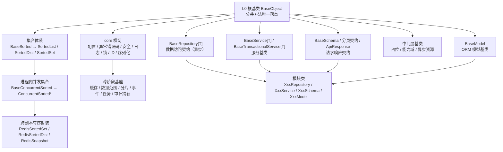
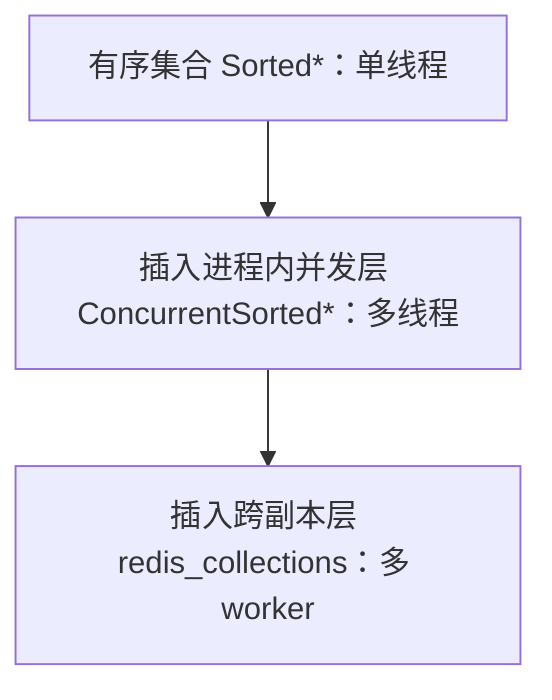

# 后端基类清单

> 后端基类权威清单：已有基类的分层、职责、代码位置、继承链与状态（bms 权威源维护，产品经工作区符号链接引用）

[文档首页](文档首页.md) › 后端基类清单　|　[配套：《后端开发规范》](规范/后端开发规范.md) · [前端基类清单 →](前端基类清单.md)

## 1. 用途与维护 

- **定位**：后端基类**权威清单**——回答「有哪些基类、在哪一层、什么职责、代码在哪、是否已交付」。**强制用法口径与扩展规则**见《[后端开发规范](规范/后端开发规范.md)》「后端基座体系（强制）」节；分层机制见平台《架构设计 · 后端基础类体系》；详细契约见对应详细设计。
- **口径**：所有可继承的后端类收敛为一套分层体系（L0 根基类 + 集合体系 / 模块基类 / core 横切 / 跨阶段基座 + 中间层基类）；**公共字段/方法只在对应层基类维护，任何模块不得重复实现**；调整某一层基类即全链生效。
- **状态取值**：`已交付` / `占位`（接口或结构就位、真实实现待回补）/ `待交付`（已设计未落地）；与平台架构节点登记一致。
- **维护**：新增/调整基类须同步本清单 + 平台《架构设计 · 后端基础类体系》登记 + 对应阶段任务基座登记 + 相关详细设计；状态列随实施回写。

## 2. 分层总览 

| 层 / 支线 | 基类 / 能力 | 形态 | 父层 | 代码位置 | 职责 | 状态 |
| --- | --- | --- | --- | --- | --- | --- |
| L0 | 根基类 `BaseObject` | 普通类 | — | `app/core/base.py` | 一切可继承后端类之根：公共方法唯一落点 | 已交付 |
| L0 | 值容器 `ValueHolder` | 类 | `BaseObject` | `app/core/base.py` | `get_locked` 上下文内可替换值容器 | 已交付 |
| 集合 | 有序集合 `BaseSorted` → `SortedList` / `SortedDict` / `SortedSet` | 抽象类 | L0 | `app/core/collections.py` | 插入即有序；对外输出稳定序 | 已交付 |
| 集合 | 进程内并发集合 `BaseConcurrentSorted` → `ConcurrentSorted*` | 类 | `BaseSorted` | `app/core/concurrent.py` | 多线程共享：原子 / 快照语义 | 已交付 |
| 集合 | 跨副本有序封装 `RedisSortedSet` / `RedisSortedDict` / `RedisSnapshot` | 类 | `BaseObject` | `app/core/redis_collections.py` | 多 worker / 跨副本共享：Redis 为事实源 + 只读快照 + 版本号 | 已交付 |
| 模块基类 | 数据访问契约 `BaseRepository[T]` / 作用域过滤 `BaseScopedRepository[T]` / 内存基线 `BaseMemoryRepository[T]` / DB 骨架 `BaseDbRepository[T]` | 抽象类 | L0 | `app/repositories/` | CRUD 契约 + 派生方法 + 数据源 / 分片路由；软删除 + 数据范围过滤 | 已交付（DB 占位） |
| 模块基类 | 服务基类 `BaseService[T]` / 事务扩展层 `BaseTransactionalService[T]` | 类 | L0 | `app/services/` | 通用 CRUD 委派仓储 + 统一不存在语义 + 分页；事务边界 | 已交付 |
| 模块基类 | 请求/响应基类 `BaseSchema` / 分页契约 / `ApiResponse` | 类（多重继承 Pydantic） | L0 | `app/schemas/` | Pydantic 公共配置与统一序列化；统一响应与分页契约 | 已交付 |
| 模块基类 | ORM 模型基类 `BaseModel` | 类 | L0 | `app/models/base.py` | ORM 公共字段与约定（雪花 ID / 软删除 / 审计 / 乐观锁 / 四库类型映射） | 已交付 |
| 中间层 | 占位 `BasePlaceholder` / `BaseNullObject` / `BaseStub` | 类 | `BaseObject` | `app/core/capability.py` | 占位标记与统一抛错（空实现 / 未实现） | 已交付 |
| 中间层 | 能力域 `BaseCapability` / `BaseEventWorker` | 抽象类 | `BaseObject` | `app/core/capability.py` | 能力域标识（`key`）/ 事件类型（`event_type`） | 已交付 |
| 中间层 | 异步资源 `BaseAsyncResource` | 抽象类 | `BaseObject` | `app/core/capability.py` | `aclose()` + `async with` 生命周期 | 已交付 |
| 数据访问横切 | 工作单元 `UnitOfWork`（`NullUnitOfWork` / `DbUnitOfWork`） | 类 | — | `app/db/unit_of_work.py` | 统一异步事务 `begin` / `commit` / `rollback` | 已交付 |
| 数据访问横切 | 异步引擎 `EngineFactory` / 会话 `build_session_factory` + `get_db` / 读写绑定 | 类 / 函数 | `BaseAsyncResource` | `app/db/engine.py`、`session.py`、`routing.py` | 异步引擎创建 / 缓存 / 释放、请求级会话、读写绑定 | 已交付（SQLite 可跑） |
| 多租户 | 租户上下文 `TenantContext` / 引擎注册表 `EngineRegistry` | 类 | `BaseObject` / `BaseAsyncResource` | `app/db/tenant.py`、`registry.py` | 租户解析链、引擎注册与生命周期（平台常驻 / 懒加载 / LRU） | 已交付（占位） |
| cross 横切 | `BizError` 体系 / 配置 / 安全 / 日志 | 类 / 模块 | — | `app/core/` | 统一异常与错误码、配置读取、安全原语、结构化日志 | 已交付（安全 / 日志占位） |
| 能力域横切 | 数据脱敏 `BaseMasker` / 权限校验 `BasePermissionChecker` | 抽象类 | `BaseCapability` | `app/masking/`、`app/permission/` | 字段掩码（`register` / `mask` / `reveal`）与权限码校验（`check` / `require`）契约；占位实现原样返回 / 恒定允许（权限契约 02-3-9 于 2026-09-14 复用核销，不重复建设） | 占位 |
| 能力域横切 | 分布式锁 `BaseDistributedLock` | 抽象类 | `BaseCapability` | `app/lock/` | 跨实例互斥（异步 `acquire` / `release` / `extend` + `hold` 上下文）与锁 key 统一拼接；占位恒定成功 | 占位 |
| 能力域横切 | 验证码 `BaseCaptcha` / 密码策略 `BasePasswordPolicy` | 抽象类 | `BaseCapability` | `app/captcha/`、`app/password/` | 验证码生成与校验（`generate` / `verify`）· 密码复杂度 / 有效期 / 历史重复（`validate` / `expired` / `reused`）；占位恒定通过 / 恒定允许 | 占位 |
| 能力域横切 | 降级 `BaseFallbackPolicy` / 熔断 `BaseCircuitBreaker` | 抽象类 | `BaseCapability` | `app/fallback/`、`app/circuit/` | 依赖故障应对：降级动作选择（`resolve`）· 熔断放行判定与三态（`allow` / `record_*` / `state`）；占位不降级 / 恒定闭合 | 占位 |
| 能力域横切 | 限流 `BaseRateLimiter` / 幂等 `IdempotencyStore` / 防重放 `BaseReplayGuard` | 抽象类 | `BaseCapability` | `app/ratelimit/`、`app/idempotency/`、`app/replay/` | 写接口防护：配额判定（`check` / `require`）· 幂等键去重与首次结果复用（`begin` / `load` / `save`）· 防重放编排（时间窗 + HMAC 签名 + nonce）；占位恒定放行 / 恒定首次 / nonce 不拦截 | 占位 |
| 能力域横切 | 指标 `BaseMetrics` / 链路 `BaseTracer` | 抽象类 | `BaseCapability` | `app/metrics/`、`app/tracing/` | 可观测性：数值采集（`counter` / `gauge` / `histogram`）· 调用链上下文（`span` 异步上下文、`SpanContext`）；占位空操作 / 生成占位 ID 不上报 | 占位 |
| 能力域横切 | 健康检查项注册表 `BaseHealthCheck` / `BaseHealthCheckRegistry` | 抽象类 / 类 | `BaseObject` / `BaseCapability` | `app/health/` | 依赖就绪：检查项契约（`name` + 异步 `check`）+ 注册表（`register` / `checks` + 聚合模板 `aggregate`）+ 结果 / 报告契约（`HealthCheckResult` / `HealthCheckReport`）；占位无检查项、固定通过（`/readyz` 经聚合） | 占位 |
| 能力域横切 | 开放接口服务端 / scope `BaseOAuthServer` / `BaseScopeChecker` | 抽象类 / 类 | `BaseCapability` | `app/oauth/` | 开放接口：Client Credentials 签发与撤销（`issue_token(ClientCredentials)` / `revoke`）+ 授权面 scope 校验（`check(granted, required)`）+ 数据契约（`ClientCredentials` / `OAuthToken`）与常量（`GRANT_TYPES` / `TOKEN_TYPE_BEARER`）；占位固定占位令牌 / 恒定允许 | 占位 |
| 能力域横切 | 对象存储 `BaseObjectStorage` | 抽象类 / 类 | `BaseCapability` | `app/storage/` | 对象存储：写入 / 读取 / 删除 / 存在判定 / 预签名（`put` / `get` / `delete` / `exists` / `presign`）+ 数据契约（`StoredObject` / `PresignedUrl`）与常量（`STORAGE_BUCKET` / `DEFAULT_PRESIGN_TTL`）；占位固定返回、不连 MinIO / 不落盘 | 占位 |
| 能力域横切 | LLM 适配 `BaseLlmProvider` | 抽象类 / 类 | `BaseCapability` | `app/llm/` | 统一 Provider：对话 / 向量化 / 识别（异步 `chat` / `embedding` / `ocr`，`provider_key` / `model` 可选）+ 数据契约（`ChatMessage` / `ChatResult` / `EmbeddingResult` / `OcrResult`）与常量（`LLM_PROVIDER_TYPES` / `NULL_EMBEDDING_DIM`）；占位固定回复 / 零向量 / 占位文本、不调模型 | 占位 |
| 能力域横切 | 全文检索 `BaseSearchIndex` | 抽象类 / 类 | `BaseCapability` | `app/search/` | 统一索引：写入 / 删除 / 检索（异步 `index` / `delete` / `search`，契约对象传参）+ 数据契约（`SearchDocument` / `SearchQuery` / `SearchHit` / `SearchResult`）与常量（`SEARCH_INDEX_PREFIX` / `DEFAULT_SEARCH_SIZE`）；租户隔离 + 数据权限过滤由实现强制注入；占位写 / 删空操作、search 固定占位命中 | 占位 |
| 能力域横切 | 通知渠道 `BaseNotifier` | 抽象类 / 类 | `BaseCapability` | `app/notify/` | 统一发送：`send(NotificationMessage)`（异步）+ 渠道枚举（`NotifyChannel`：inbox / email / sms）+ 数据契约（`NotificationMessage` / `SendResult`）；占位固定返回成功、不真实发送 | 占位 |
| 能力域横切 | 实时推送 `BaseRealtimePublisher` | 抽象类 / 类 | `BaseCapability` | `app/ws/` | 统一推送：事件发送 + 房间加入 / 离开（异步 `emit` / `join` / `leave`）+ 事件常量（`REALTIME_EVENTS`）+ 数据契约（`RealtimeEvent`）；占位三方法空操作、不连 Socket.IO / Redis | 占位 |
| 跨阶段基座 | 缓存 Region / 数据范围 / 分片路由 / 事件 / 任务 / 审计捕获 | 抽象类 | `BaseCapability` 等 | `app/cache/`、`scope/`、`sharding/`、`events/`、`tasks/`、`audit/` | 契约骨架，真实实现随回补阶段 | 占位 |
| — | 模块类 | — | 对应基类 | 各模块 | `XxxRepository` / `XxxService` / `XxxCreateRequest`·`XxxResponse` / `XxxModel` | — |

## 3. L0 根基类 

- **形态**：普通类 `BaseObject`（非 ABC，可被 SQLAlchemy 声明式基类等混合继承）；**所有可继承的后端类默认从其派生**（模块基类、集合类、中间层基类）。
- **提供**：公共方法唯一落点——序列化、稳定序序列化、统一字符串输出、主键相等与哈希；序列化取字段**声明字段优先**（dataclass → `dataclasses.fields`；Pydantic → `model_dump()`；其余 → `__dict__` 兜底）；不含任何业务或框架语义。
- **约束**：只放「所有后端类共有」的横切能力；任一方的特有逻辑（数据访问流程、序列化配置、并发保护）不得上提 L0。
- `ValueHolder`：`get_locked` 类上下文内可替换的值容器（进程内与 Redis 复用）。

## 4. 集合体系（有序 / 进程内并发 / 跨副本） 

集合是后端公共数据形态，按共享范围自小到大**逐层演进**，层数与形态随需扩展（见「扩展与演进」节）：

| 形态 | 基类 / 封装 | 代码位置 | 职责 |
| --- | --- | --- | --- |
| 有序 | `BaseSorted` → `SortedList` / `SortedDict` / `SortedSet` | `core/collections.py` | 插入即有序；对外输出稳定序 |
| 进程内并发 | `BaseConcurrentSorted` → `ConcurrentSorted*` | `core/concurrent.py` | 多线程共享：原子复合方法 + 快照遍历；锁策略 `LockStrategy` 显式传入（`RW` 默认 / `RLCK` / `SHARDED` / `SNAPSHOT`） |
| 跨副本 | `RedisSortedSet` / `RedisSortedDict` / `RedisSnapshot` | `core/redis_collections.py` | 跨副本 / 多 worker：Redis 为事实源 + 只读快照 + 版本号（`{key}:version` 惰性比对） |

- 锁原语：`LockStrategy` / `ReadWriteLock` / `LockGuard`（`core/locking.py`，`ReadWriteLock` / `LockGuard` 继承 `BaseObject`）。
- 复合操作语义：`replace_if_equal` / `get_and_remove` 用 Lua；`update_atomic` / `get_locked` 用 WATCH + MULTI 乐观重试。

## 5. 模块基类（数据访问 / 服务 / 契约 / 模型） 

模块基类是**平行的兄弟基类**（各自继承 `BaseObject`，互不继承）；模块类分别继承对应基类。它们之间是**调用链**（服务调用仓储、仓储操作模型），不是继承层级。

| 基类 | 代码位置 | 职责与关键成员 |
| --- | --- | --- |
| `BaseRepository[T]` | `repositories/base_repository.py` | 仓储**契约**（异步）：CRUD 抽象 + `exists` / `list_page` / `list_cursor` 派生 + 数据源（只读标记）/ 分片路由钩子 + `_guard_version` 乐观锁转译 |
| `BaseMemoryRepository[T]` | `repositories/base_memory_repository.py` | 内存基线（异步：字典存储 + 自增 ID，继承 `BaseScopedRepository` 按作用域过滤），子类只实现同步 `_build` / `_apply` |
| `BaseScopedRepository[T]` | `repositories/base_scoped_repository.py` | **作用域过滤中间层**：软删除 + 数据范围条件（`_scope_conditions` / `_matches_scope`，覆盖读写；操作符 eq/ne/in/like/gt/gte/lt/lte/between/is_null/is_not_null） |
| `BaseDbRepository[T]` | `repositories/base_db_repository.py` | 数据库实现骨架（异步占位、不连库，继承 `BaseScopedRepository` + `BaseStub`）；真实 CRUD / 软删除 SQL / 多源读写路由随落库阶段回补 |
| `UnitOfWork` | `db/unit_of_work.py` | 异步事务 `begin` / `commit` / `rollback` + `session`；`NullUnitOfWork`（空实现）、`DbUnitOfWork`（`AsyncSession`） |
| `BaseService[T]` | `services/base_service.py` | 通用 CRUD 委派仓储 + 统一不存在语义（`NotFoundError`）+ `page` / `cursor_page` 分页 |
| `BaseTransactionalService[T]` | `services/base_transactional_service.py` | 事务扩展层：写操作经 `UnitOfWork` 进入事务、读操作不包事务 |
| `BaseSchema` | `schemas/base.py` | Pydantic 公共配置并继承 `BaseObject` 获得统一序列化（声明字段优先） |
| 分页契约 | `schemas/pagination.py` | `BasePageQuery` / `BasePageResponse[T]`（页码）、`BaseCursorQuery` / `BaseCursorResponse[T]`（游标） |
| `ApiResponse` | `schemas/common.py` | 统一响应 `{code, message, data}`；列表分页 `data` 用分页契约 |
| `BaseModel` | `models/base.py` | ORM 公共字段与约定（雪花 ID / 软删除 / 审计 / 乐观锁 / 四库类型映射）+ 软删除辅助 `soft_delete()` / `restore()`；审计由 ORM 事件自动填充、乐观锁用 `version_id_col` |
| `ErrorCode` / `ErrorSegment` | `core/error_codes.py` | 平台错误码与段位登记点；模块错误码按注册段位各自登记 |

## 6. 中间层基类 

| 基类 | 代码位置 | 职责 | 继承 / 使用 |
| --- | --- | --- | --- |
| `BasePlaceholder` | `core/capability.py` | 占位实现公共父（`placeholder` 标记 + `describe()`） | `BaseNullObject` / `BaseStub` 继承 |
| `BaseNullObject` | `core/capability.py` | 空实现（Null Object，无副作用） | `NullUnitOfWork` / `NullDataScope` / `NullShardingRouter` 继承 |
| `BaseStub` | `core/capability.py` | 未实现占位：`_not_implemented()` 统一抛错 | `BaseDbRepository`、`BaseSecurity` 及原语继承 |
| `BaseCapability` | `core/capability.py` | 能力域契约中间层（`key`） | 跨阶段基座继承 |
| `BaseEventWorker` | `core/capability.py` | 事件工作单元（`event_type`） | `EventPublisher` / `EventConsumer` 继承 |
| `BaseAsyncResource` | `core/capability.py` | 异步资源生命周期（`aclose()` + `async with`） | `EngineFactory` 继承 |
| `ResourceManager` | `core/resources.py` | 异步资源统一登记 + 逆序回收（`register` / `aclose`） | `create_app` lifespan 统一释放（已登记 `EngineRegistry`） |

## 7. core 横切基座 

| 基座 | 代码位置 | 内容 | 状态 |
| --- | --- | --- | --- |
| 配置基座 | `core/config.py` | 分区模型继承 `BaseSettings`（`BaseSettings → BaseSchema`，拒绝未知键 / 字段名填充）+ `get_settings()` | 已交付（结构占位） |
| 异常与错误码 | `core/exceptions.py`、`core/error_codes.py` | `BizError`（携带错误码 / `http_status` / `data`）+ 段位基 `GeneralError`(1xxxx) / `AuthError`(2xxxx) / `UserOrgError`(3xxxx) / `OpenTenantError`(8xxxx) + 骨架子类；全局处理器转 `ApiResponse` | 已交付 |
| 安全基座 | `core/security.py` | 中间层基 `BaseSecurity(BaseStub)` + `PasswordHasher` / `TokenCodec` / `SessionSecurity`（签名占位） | 占位 |
| 日志基座 | `core/logging.py` | 门面中间层 `BaseLogger` + 占位实现 `StdoutLogger`；入口 `configure_logging` / `get_logger`（stdout、不落文件） | 占位 |
| 稳定序列化 | `core/serialization.py` | 统一稳定 JSON（键排序、中文不转义、不可序列化值降级 str） | 已交付 |
| 并发锁原语 | `core/locking.py` | `LockStrategy` / `ReadWriteLock` / `LockGuard` | 已交付 |
| 雪花 ID | `core/id.py` | `SnowflakeGenerator`（标准雪花 41+10+12），WorkerId 经 `BMS_WORKER_ID` / 配置注入 | 已交付 |
| 请求上下文 | `core/context.py` | `current_user_id` / `current_tenant` / `read_only` / `current_masker` 上下文变量 + 设置 / 复位辅助（`current_masker` 供 `BaseSchema` 序列化期掩码） | 已交付 |

## 8. 数据访问与多租户基座 

| 基类 / 能力 | 代码位置 | 职责 | 状态 |
| --- | --- | --- | --- |
| `EngineFactory` | `db/engine.py` | 按 `db_key` 创建 / 缓存 `AsyncEngine`（连接池、`pool_pre_ping`、`aclose`） | 已交付（SQLite 可跑） |
| `build_session_factory` / `get_db` / `get_uow` | `db/session.py` | `async_sessionmaker`、请求级会话依赖与工作单元依赖（每请求独立、退出释放）；公共依赖汇总 `api/deps.py` | 已交付 |
| 读写绑定 | `db/routing.py`、`core/context.py` | `read_only` 上下文标记 + `WRITE_BINDING` / `READ_BINDING`（本阶段主从同源） | 已交付（占位） |
| `TenantContext` / 解析链 | `db/tenant.py` | 租户解析链 + `get_tenant` 依赖 + 豁免路径；未知租户 404 / 80001 | 已交付（占位） |
| `EngineRegistry` | `db/registry.py` | `{db_key → engine}` 注册表：平台常驻、租户懒加载、LRU、连接预算、并发保护 | 已交付（占位） |

## 9. 跨阶段基座 

六类跨阶段基座**契约骨架已交付**（`02-4`），真实实现随对应阶段回补（缓存 / 任务 / 审计 → 阶段六；数据范围 → 五 RBAC；分片 → 十一；事件 → 八）：

| 基座 | 代码位置 | 契约 |
| --- | --- | --- |
| 缓存 Region 分域 | `cache/base.py` | `CacheRegion(BaseCapability)`（`domain` / `default_ttl`；`get` / `set` / `delete` / `get_global_version`）+ `build_cache_key` / `is_stale` |
| 数据范围注入 | `scope/base.py` | `DataScope(BaseCapability)`（`read_predicate` 支持单条件 / 条件列表 / `allow_write`）+ `ScopeCondition`（11 种操作符）+ `NullDataScope`；`BaseRepository._apply_data_scope` 钩子、`BaseScopedRepository` 落过滤（读写） |
| 分片路由 | `sharding/base.py` | `ShardingRouter(BaseCapability)`（`resolve`）+ `ShardBinding` + `NullShardingRouter`；`BaseRepository._resolve_shard` 接入 |
| 事件发布 / 消费 | `events/base.py` | `EventEnvelope`（`tenant_id` / `trace_id`）+ `EventPublisher` / `EventConsumer`（→ `BaseEventWorker`：`event_type`；异步 `publish` / `publish_transactional` / `consume`） |
| Celery 任务 | `tasks/base.py`、`models/system.py` | `BaseTask(BaseCapability)`（`name` / `queue` / `run`）+ `SysTask` / `SysTaskLog` 模型骨架 |
| ORM 审计捕获 | `audit/base.py` | `AuditCapturer(BaseCapability)`（`is_audited` / `capture`）+ `FieldChange` |
| 数据脱敏（横切扩展） | `masking/base.py` | `BaseMasker(BaseCapability)`（`key = "masking"`；`register` / `mask` / `reveal` + `check_plain`，权限检查器构造注入）+ `MaskRule` / `MASK_STRATEGIES` + `NullMasker`（原样返回）；`BaseSchema.masked_fields` + `current_masker` 序列化自动掩码；提供者 `get_masker` |
| 权限校验（横切扩展） | `permission/base.py` | `BasePermissionChecker(BaseCapability)`（`check` / `require`，失败抛 `PermissionError` 30001）+ `NullPermissionChecker`（恒定允许）+ 提供者 `get_permission_checker` / 依赖工厂 `require_permission`（02-3-9 于 2026-09-14 复用核销，不重复建设） |
| 分布式锁（横切扩展） | `lock/base.py` | `BaseDistributedLock(BaseCapability)`（`key = "distributed_lock"`；异步 `acquire` 带 TTL 返回锁令牌 / `release` 按令牌释放 / `extend` 续租 + `hold` 上下文，未取到抛 `ConcurrentConflictError`）+ `NullDistributedLock`（恒定成功、不连 Redis）+ `build_lock_key` / 提供者 `get_distributed_lock` |
| 验证码（横切扩展） | `captcha/base.py` | `BaseCaptcha(BaseCapability)`（`key = "captcha"`；异步 `generate(scene) -> CaptchaChallenge`（编号 / 图片字节 / 有效期 / 场景）/ `verify` 单次有效）+ `NullCaptcha`（恒定通过、占位不出图）+ `build_captcha_key` / `CAPTCHA_TTL=300` / `CAPTCHA_SCENES` / 提供者 `get_captcha` |
| 密码策略（横切扩展） | `password/base.py` | `BasePasswordPolicy(BaseCapability)`（`key = "password_policy"`；异步 `validate(password, *, username) -> tuple[str, ...]` 违规原因码、空元组通过 / `expired(pwd_changed_at, *, now)` / `reused(password, *, history)`）+ `NullPasswordPolicy`（恒定允许）+ `PASSWORD_VIOLATIONS` / 提供者 `get_password_policy` |
| 降级（横切扩展） | `fallback/base.py` | `BaseFallbackPolicy(BaseCapability)`（`key = "fallback"`；异步 `resolve(dependency, *, exc=None) -> FallbackAction`（`raise` / `default` / `skip` / `degrade`））+ `NullFallbackPolicy`（恒定 `raise`＝不降级）+ `DEPENDENCIES` 依赖清单 / 提供者 `get_fallback_policy` |
| 熔断（横切扩展） | `circuit/base.py` | `BaseCircuitBreaker(BaseCapability)`（`key = "circuit_breaker"`；异步 `allow(dependency) -> bool` / `record_success` / `record_failure` / `state -> CircuitState`（`closed` / `open` / `half_open`））+ `NullCircuitBreaker`（恒定闭合）+ 依赖清单单向复用降级域 / 提供者 `get_circuit_breaker` |
| 限流（横切扩展） | `ratelimit/base.py` | `BaseRateLimiter(BaseCapability)`（`key = "rate_limiter"`；异步 `check(key, rule) -> RateLimitDecision`（`allowed` / `limit` / `remaining` / `reset_after`）+ `require` 抛 `RateLimitError` 10005 / 429）+ `NullRateLimiter`（恒定放行）+ `RATE_LIMIT_DIMENSIONS`（`ip` / `user` / `client`）/ `RateLimitRule` / `DEFAULT_RATE_WINDOW` / `build_rate_limit_key` / 提供者 `get_rate_limiter` |
| 幂等（横切扩展） | `idempotency/base.py` | `IdempotencyStore(BaseCapability)`（`key = "idempotency"`；异步 `begin(key, *, ttl) -> bool` 前置去重 / `load(key)` 取首次结果 / `save(key, payload, *, ttl)` 写首次结果）+ `NullIdempotencyStore`（恒定首次、不缓存）+ `IDEMPOTENCY_HEADER` / `DEFAULT_IDEMPOTENCY_TTL=86400` / `build_idempotency_key` / 提供者 `get_idempotency_store` |
| 防重放（横切扩展） | `replay/base.py` | `BaseReplayGuard(BaseCapability)`（`key = "replay_guard"`；`verify` 模板方法固定编排「时间窗 → HMAC 签名 → nonce 去重」短路 + 抽象 `claim_nonce` + `require` 抛 `AuthError`）+ `NullReplayGuard`（nonce 恒定通过；时间窗与签名真实生效）+ `TIMESTAMP_HEADER` / `NONCE_HEADER` / `SIGNATURE_HEADER` / `REPLAY_WINDOW=300` / `ReplayReason` / `ReplayDecision` / 提供者 `get_replay_guard` |
| 指标（横切扩展） | `metrics/base.py` | `BaseMetrics(BaseCapability)`（`key = "metrics"`；异步 `counter` / `gauge` / `histogram`，`labels: Mapping[str, str] \| None`）+ `NullMetrics`（空操作、不连 Prometheus）+ `METRIC_KINDS`（counter / gauge / histogram）/ `METRIC_NAMES`（`bms_` 前缀六类）/ `DEPENDENCIES` 单向复用降级域 / 提供者 `get_metrics` |
| 链路（横切扩展） | `tracing/base.py` | `BaseTracer(BaseCapability)`（`key = "tracer"`；`span` 异步上下文模板编排 + 抽象 `start_span` / `end_span`）+ `NullTracer`（生成占位 ID、维护父链与上下文、不上报）+ `SpanContext`（`trace_id` / `span_id` / `name` / `parent_span_id` / `attributes`）/ `TRACE_ID_HEADER` / `new_trace_id` / `new_span_id` / `current_span` / `current_trace_id` / 提供者 `get_tracer`（入站中间件见 `api/middleware.py` 的 `TraceIdMiddleware`） |
| 健康检查项注册表（横切扩展） | `health/base.py` | `BaseHealthCheck`（`name` + 异步 `check`）+ `BaseHealthCheckRegistry(BaseCapability)`（`key = "health_check_registry"`；抽象 `register` / `checks` + 聚合模板 `aggregate`）+ `NullHealthCheckRegistry`（无检查项、固定通过、不探依赖）+ `HealthCheckResult`（`name` / `healthy` / `detail`）/ `HealthCheckReport`（`healthy` / `items`）/ `DEPENDENCIES` 单向复用降级域 / 提供者 `get_health_check_registry`（`/readyz` 经聚合，见 `api/health.py`） |
| 开放接口服务端 / scope（横切扩展） | `oauth/base.py` | `BaseOAuthServer(BaseCapability)`（`key = "oauth_server"`；异步 `issue_token(ClientCredentials) -> OAuthToken` / `revoke(token)`）+ `NullOAuthServer`（固定占位令牌 `NULL_ACCESS_TOKEN`、不签发、撤销空操作）+ `ClientCredentials` / `OAuthToken` / `GRANT_TYPES`（三项）/ `TOKEN_TYPE_BEARER` / 提供者 `get_oauth_server`；`BaseScopeChecker(BaseCapability)`（`key = "scope_checker"`；同步 `check(granted, required)`）+ `NullScopeChecker`（恒定允许）+ 提供者 `get_scope_checker` |
| 对象存储（横切扩展） | `storage/base.py` | `BaseObjectStorage(BaseCapability)`（`key = "object_storage"`；异步 `put(key, data, *, content_type)` / `get` / `delete` / `exists` / `presign(key, *, method, expires_in)`）+ `NullObjectStorage`（固定返回、不连 MinIO / 不落盘）+ `StoredObject`（`key` / `size` / `content_type` / `etag`）/ `PresignedUrl`（`url` / `expires_in` / `method`）/ `STORAGE_BUCKET`（`bms-files`）/ `DEFAULT_PRESIGN_TTL`（3600）/ 提供者 `get_object_storage` |
| LLM 适配（横切扩展） | `llm/base.py` | `BaseLlmProvider(BaseCapability)`（`key = "llm_provider"`；异步 `chat(messages, *, provider_key, model)` / `embedding(texts, ...)` / `ocr(image, ...)`）+ `NullLlmProvider`（固定占位回复 / 零向量 / 占位文本、不调模型）+ `ChatMessage`（`content` / `role`）/ `ChatResult` / `EmbeddingResult` / `OcrResult` / `LLM_PROVIDER_TYPES`（三项）/ `NULL_EMBEDDING_DIM`（1024）/ 提供者 `get_llm_provider` |
| 全文检索（横切扩展） | `search/base.py` | `BaseSearchIndex(BaseCapability)`（`key = "search_index"`；异步 `index(SearchDocument)` / `delete(index, doc_id)` / `search(SearchQuery)`）+ `NullSearchIndex`（写 / 删空操作、search 固定占位命中、不连 ES）+ `SearchDocument` / `SearchQuery` / `SearchHit` / `SearchResult` / `SEARCH_INDEX_PREFIX`（`bms-`）/ `DEFAULT_SEARCH_SIZE`（20）/ 提供者 `get_search_index` |
| 通知渠道（横切扩展） | `notify/base.py` | `BaseNotifier(BaseCapability)`（`key = "notifier"`；异步 `send(NotificationMessage) -> SendResult`）+ `NullNotifier`（固定返回成功、不真实发送）+ `NotifyChannel`（`inbox` / `email` / `sms`）/ `NotificationMessage`（`channel` / `recipient` / `content` / `title` / `biz_type` / `biz_id`）/ `SendResult`（`delivered` / `message_id` / `detail`）/ `NULL_MESSAGE_ID` / 提供者 `get_notifier` |
| 实时推送（横切扩展） | `ws/base.py` | `BaseRealtimePublisher(BaseCapability)`（`key = "realtime_publisher"`；异步 `emit(RealtimeEvent)` / `join(session_id, room)` / `leave(session_id, room)`）+ `NullRealtimePublisher`（三方法空操作、不连 Socket.IO / Redis）+ `RealtimeEvent`（`event` / `data` / `user_id` / `session_id` / `room`）/ `REALTIME_EVENTS`（三项）/ 提供者 `get_realtime_publisher` |

## 10. 继承链与代码位置 

- **继承链**：模块类 → 对应基类 → `BaseObject`；`BaseSchema → (pydantic.BaseModel, BaseObject)`；`ApiResponse → BaseSchema`；`BaseSettings → BaseSchema`；集合 `Sorted* → BaseSorted → BaseObject`、`ConcurrentSorted* → BaseConcurrentSorted → BaseSorted → BaseObject`；仓储 `BaseScopedRepository → BaseRepository → BaseObject`、`BaseMemoryRepository` / `BaseDbRepository → BaseScopedRepository`；服务 `BaseTransactionalService → BaseService → BaseObject`；中间层 `BaseNullObject` / `BaseStub → BasePlaceholder → BaseObject`、`BaseEventWorker → BaseCapability → BaseObject`、`BaseAsyncResource → BaseObject`；异常 `BizError → BaseObject`、段位基 → `BizError`、子类 → 段位基；`EngineFactory → BaseAsyncResource`；脱敏 / 权限校验 / 分布式锁 / 认证机制 / 故障应对 `NullMasker` / `NullPermissionChecker` / `NullDistributedLock` / `NullCaptcha` / `NullPasswordPolicy` / `NullFallbackPolicy` / `NullCircuitBreaker` → `BaseMasker` / `BasePermissionChecker` / `BaseDistributedLock` / `BaseCaptcha` / `BasePasswordPolicy` / `BaseFallbackPolicy` / `BaseCircuitBreaker` → `BaseCapability` → `BaseObject`；限流 / 幂等 / 防重放 `NullRateLimiter` / `NullIdempotencyStore` / `NullReplayGuard` → `BaseRateLimiter` / `IdempotencyStore` / `BaseReplayGuard` → `BaseCapability` → `BaseObject`；签名原语 `SignatureCodec` → `BaseSecurity` → `BaseStub` → `BasePlaceholder` → `BaseObject`；指标 / 链路 `NullMetrics` / `NullTracer` → `BaseMetrics` / `BaseTracer` → `BaseCapability` → `BaseObject`；健康检查项 `BaseHealthCheck` → `BaseObject`、注册表 `NullHealthCheckRegistry` → `BaseHealthCheckRegistry` → `BaseCapability` → `BaseObject`；开放接口服务端 / scope `NullOAuthServer` / `NullScopeChecker` → `BaseOAuthServer` / `BaseScopeChecker` → `BaseCapability` → `BaseObject`；对象存储 `NullObjectStorage` → `BaseObjectStorage` → `BaseCapability` → `BaseObject`；LLM 适配 `NullLlmProvider` → `BaseLlmProvider` → `BaseCapability` → `BaseObject`；全文检索 `NullSearchIndex` → `BaseSearchIndex` → `BaseCapability` → `BaseObject`；通知渠道 `NullNotifier` → `BaseNotifier` → `BaseCapability` → `BaseObject`；实时推送 `NullRealtimePublisher` → `BaseRealtimePublisher` → `BaseCapability` → `BaseObject`。
- **目录**：L0、集合与横切在 `app/core/`；模块基类在 `app/repositories/`、`app/services/`、`app/schemas/`、`app/models/`；数据访问在 `app/db/`；跨阶段基座在 `app/cache/`、`app/scope/`、`app/sharding/`、`app/events/`、`app/tasks/`、`app/audit/`；横切扩展能力域在 `app/masking/`、`app/permission/`、`app/lock/`、`app/captcha/`、`app/password/`、`app/fallback/`、`app/circuit/`、`app/ratelimit/`、`app/idempotency/`、`app/replay/`、`app/metrics/`、`app/tracing/`、`app/health/`、`app/oauth/`、`app/storage/`、`app/llm/`、`app/search/`、`app/notify/`、`app/ws/`。

## 11. 扩展与演进 

- **加类型**：出现新的类类型（新集合形态、新数据源形态、新契约形态）→ 新增对应基类；**加扩展**：出现新的横切能力（多租户强制过滤、限流、灰度路由、审计捕获等）→ 新增一层基类。
- 公共逻辑只在所属层基类维护，模块类只负责自身差异；修改公共行为改基类即可全链生效。
- **分层演进原则**：遇到职责冲突或共享范围扩大就插入中间层承前启后，同一冲突可插入**多层**，每层只解决一类横切职责（加层优先于在既有层堆逻辑）。

**示例一（共享范围扩大 → 逐层加层，本体系已发生的真实演进）**：

**示例二（实现口径切换 → 停在基类改，不动模块类）**：`BaseRepository` / `BaseService` 原为同步实现，02-5-1 数据访问底座**在基类统一切换异步**（调用面改动集中一次），模块类不改（只实现同步 `_build` / `_apply`）。

**示例三（横切能力 → 抽中间层，02-5-1 补强）**：占位（`BasePlaceholder` / `BaseNullObject` / `BaseStub`）、能力域（`BaseCapability` / `BaseEventWorker`）、异步资源（`BaseAsyncResource`）三类中间层，由既有重复模式收敛而来。

- **可继续加层**：若后续出现新横切职责（如「多租户强制过滤」「限流」「灰度路由」「审计捕获」），按同一办法再插一层（如 `BaseTenantScoped`、`BaseRateLimited`），插在合适的两层之间，**不动其它层**。
- 原则：**改一层即全链生效**；禁止把多类横切职责塞进同一层。

## 12. 维护约定 

- **同步范围**：新增 / 调整基类须同步本清单（分层总览表与章节）+ 平台《架构设计 · 后端基础类体系》登记 + 对应阶段任务基座登记 + 相关详细设计。
- **状态回写**：实施完成后回写本清单「状态」列与平台架构节点；占位 / 待交付项随回补阶段更新。
- **口径唯一**：强制用法与扩展流程以《[后端开发规范](规范/后端开发规范.md)》「后端基座体系（强制）」节为准；基类是否存在、在哪一层、代码位置以本清单为准。

> 后端基类权威清单 · 与《后端开发规范》配套 · 与《前端基类清单》对称
