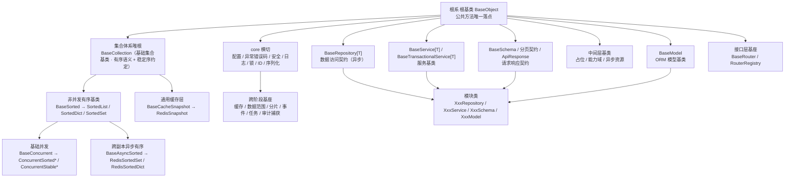
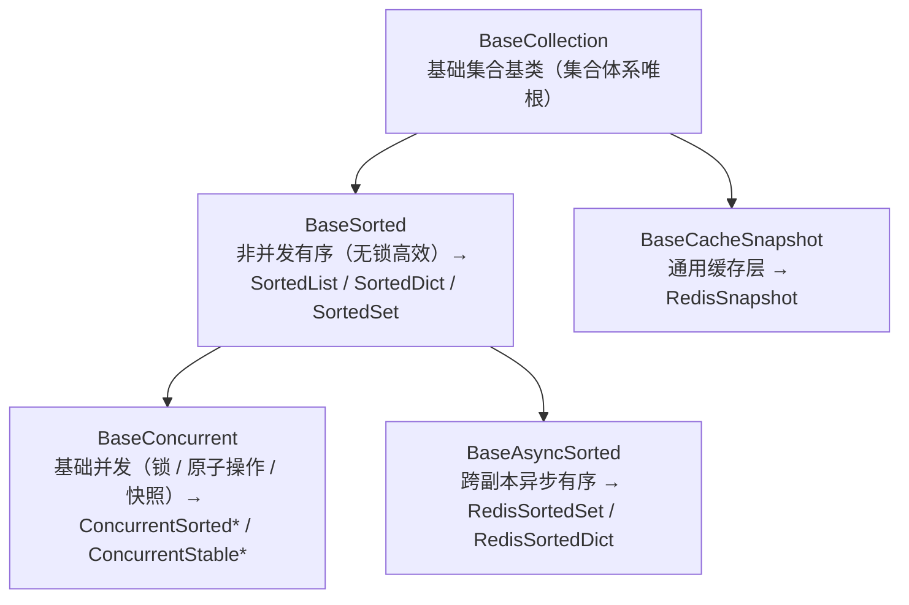
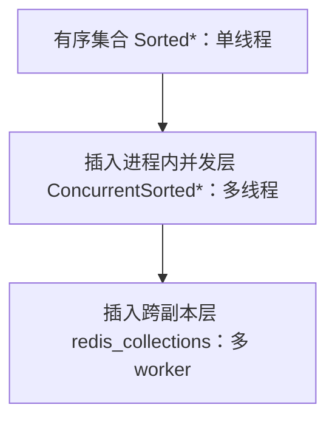

# 后端基类清单

> 后端基类权威清单：已有基类的分层、职责、代码位置、继承链与状态（bms 权威源维护，产品经工作区符号链接引用）

[文档首页](文档首页.md) › 后端基类清单　|　[配套：《后端开发规范》](规范/后端开发规范.md) · [前端基类清单 →](前端基类清单.md)

## 1. 用途与维护 

- **定位**：后端基类**权威清单**——回答「有哪些基类、在哪一层、什么职责、代码在哪、是否已交付」。**强制用法口径与扩展规则**见《[后端开发规范](规范/后端开发规范.md)》「后端基座体系（强制）」节；体系机制见平台《架构设计 · 后端基础类体系》；详细契约见对应详细设计。
- **口径**：所有可继承的后端类收敛为一套分层体系（根系 根基类 + 集合体系 / 模块基类 / core 横切 / 跨阶段基座 + 中间层基类）；**公共字段/方法只在对应层基类维护，任何模块不得重复实现**；调整某一层基类即全链生效。
- **状态取值**：`已交付` / `占位`（接口或结构就位、真实实现待回补）/ `待交付`（已设计未落地）；与平台架构节点登记一致。
- **维护**：新增/调整基类须同步本清单 + 平台《架构设计 · 后端基础类体系》登记 + 对应阶段任务基座登记 + 相关详细设计；状态列随实施回写。
- **代码路径口径（2026-09-22 工作区化）**：本清单「代码位置」为**包根相对路径**——共享基座库路径根为 `backend/libs/bms_core/src/`（`bms_core/...`），各服务路径根为 `backend/services/<服务>/src/`（`bms_<服务>/...`，2026-09-22 02_03 拆分后共 9 个服务：platform / identity / tenant / org / file / notification / search / ai / report）；工程结构与依赖方向见《[后端开发规范](规范/后端开发规范.md)》「目录与分层职责」节。

## 2. 分层总览 

```mermaid
flowchart TD
    根系["根系 根基类 BaseObject<br/>公共方法唯一落点"]
    CROOT["集合体系唯根<br/>BaseCollection（基础集合基类 · 有序语义 + 稳定序约定）"]
    COL["非并发有序基类<br/>BaseSorted → SortedList / SortedDict / SortedSet"]
    CONC["基础并发<br/>BaseConcurrent → ConcurrentSorted* / ConcurrentStable*"]
    REDIS["跨副本异步有序<br/>BaseAsyncSorted → RedisSortedSet / RedisSortedDict"]
    SNAP["通用缓存层<br/>BaseCacheSnapshot → RedisSnapshot"]
    REPO["BaseRepository[T]<br/>数据访问契约（异步）"]
    SVC["BaseService[T] / BaseTransactionalService[T]<br/>服务基类"]
    SCH["BaseSchema / 分页契约 / ApiResponse<br/>请求响应契约"]
    ORM["BaseModel<br/>ORM 模型基类"]
    MID["中间层基类<br/>占位 / 能力域 / 异步资源"]
    CORE["core 横切<br/>配置 / 异常错误码 / 安全 / 日志 / 锁 / ID / 序列化"]
    CROSS["跨阶段基座<br/>缓存 / 数据范围 / 分片 / 事件 / 任务 / 审计捕获"]
    API["接口层基座<br/>BaseRouter / RouterRegistry"]
    MOD["模块类<br/>XxxRepository / XxxService / XxxSchema / XxxModel"]
    根系 --> CROOT
    CROOT --> COL
    COL --> CONC
    COL --> REDIS
    CROOT --> SNAP
    根系 --> MID
    根系 --> REPO --> MOD
    根系 --> SVC --> MOD
    根系 --> SCH --> MOD
    根系 --> ORM --> MOD
    根系 --> CORE
    CORE --> CROSS
    根系 --> API
```

| 层 / 支线 | 基类 / 能力 | 形态 | 父层 | 代码位置 | 职责 | 状态 |
| --- | --- | --- | --- | --- | --- | --- |
| 根系 | 根基类 `BaseObject` | 普通类 | — | `bms_core/core/base.py` | 一切可继承后端类之根：公共方法唯一落点 | 已交付 |
| 根系 | 值容器 `ValueHolder` | 类 | `BaseObject` | `bms_core/core/base.py` | `get_locked` 上下文内可替换值容器 | 已交付 |
| 体系基类 | 值对象 `BaseValueObject` | 数据类 | 根系 | `bms_core/core/objects/roots.py` | **不可变数据类体系根**（`@dataclass(frozen=True)`：frozen / 相等 / 哈希）——值对象与只读结果 / 快照 / 规格 / 投影的共同落点，其下按公共段分角色链层 | 已交付（09_01）；批次 1 归位 110 处 + 角色链分层随 09_03 落地（2026-09-28） |
| 体系基类 | 数据契约 `BaseDataContract` | 数据类 | 根系 | `bms_core/core/objects/roots.py` | 可变数据契约**体系根**（Pydantic / ORM / 普通数据类归口） | 已交付（09_01，2026-09-28） |
| 体系基类 | 框架对象 `BaseFrameworkObject` | 类 | 根系 | `bms_core/core/objects/roots.py` | 框架对象**体系根**（非数据对象约定 + `object_kind` + 可选 `aclose` 钩子位） | 已交付（09_01，2026-09-28） |
| 集合 | 基础集合基类 `BaseCollection`（集合体系**唯根**） | 抽象类 | 根系 | `bms_core/core/collections.py` | 集合通用**语义约定**（有序语义 + 对外输出稳定序）+ `collection_kind` 标记；**所有集合类一律继承本根、无任何例外**（按形态分支：有序 / 基础并发 / 跨副本 / 通用缓存） | 已交付（集合体系唯一链 08_02，2026-09-29） |
| 集合 | 非并发有序基类 `BaseSorted` → `SortedList` / `SortedDict` / `SortedSet` | 抽象类 | `BaseCollection` | `bms_core/core/collections.py`（`BaseSorted`）+ `bms_core/core/sorted_collections.py`（`Sorted*`） | 进程内**无锁**有序：稳定序列化 / 排序视图 / 分批 / 集合运算；`Sorted*` 为无锁高效形态（并发形态的数据底座） | 已交付（08_02，2026-09-29；升序形态单列模块 2026-09-30） |
| 集合 | 基础并发 `BaseConcurrent` → `ConcurrentStable*`（插入序，**业务与契约唯一落点**）/ `ConcurrentSorted*`（升序，体系内部） | 类 | `BaseSorted` | `bms_core/core/concurrent.py`（`BaseConcurrent` / `ConcurrentStable*`）+ `bms_core/core/sorted_collections.py`（`ConcurrentSorted*`） | 锁策略守卫 + 原子复合操作 + 快照遍历模板；插入序：分段写（高并发）+ 只读 API；升序：保留为内部实现（业务不得声明 / 继承） | 已交付；`ConcurrentStable*`（含分段写）与只读 API 随 08_02 基座原型先行（2026-09-29；契约元数据 / 序列化链与全链存量整改已交付、基线归零，2026-10-02） |
| 集合 | 跨副本异步有序 `BaseAsyncSorted` → `RedisSortedSet` / `RedisSortedDict` | 抽象类 | `BaseSorted` | `bms_core/core/redis_collections.py` | 跨副本形态：外部存储为事实源 + 版本号；并发由 Lua 原子脚本承载、**无同步锁层**；公共段＝`async size()` / `async version()` / `version_key()`，**无同步读入口** | 已交付（集合体系唯一链 08_02，2026-09-29） |
| 集合 | 通用缓存层 `BaseCacheSnapshot` → `RedisSnapshot` | 抽象类 | `BaseCollection` | `bms_core/core/redis_collections.py` | 跨副本只读快照的公共段（`async get()` / `async invalidate()`）；通用缓存分支（非有序集合，不经有序公共段） | 已交付（集合体系唯一链 08_02，2026-09-29） |
| 模块基类 | 数据访问契约 `BaseRepository[T]` / 作用域过滤 `BaseScopedRepository[T]` / 内存基线 `BaseMemoryRepository[T]` / DB 实现 `BaseDbRepository[T]` | 抽象类 | 根系 | `bms_core/repositories/` | CRUD 契约 + 派生方法 + 数据源 / 分片路由；软删除 + 数据范围 + 租户条件过滤；DB 实现真实落库（会话构造注入 / 写入白名单 / 软删硬删出口 / 乐观锁） | 已交付（DB 实现 01_03，2026-09-22；租户条件 02-02） |
| 模块基类 | 服务基类 `BaseService[T]` / 事务扩展层 `BaseTransactionalService[T]` | 类 | 根系 | `bms_core/services/` | 通用 CRUD 委派仓储 + 统一不存在语义 + 分页；事务边界 | 已交付 |
| 模块基类 | 请求/响应基类 `BaseSchema` / 分页契约 / `ApiResponse` | 类（多重继承 Pydantic） | 根系 | `bms_core/schemas/` | Pydantic 公共配置与统一序列化；统一响应与分页契约；敏感字段声明 `masked_fields`（字段至策略映射，或字段名集合兼容写法）与序列化**递归**掩码（含嵌套模型与列表；未注入掩码器时直通） | 已交付（敏感字段掩码接入 04_02，2026-10-02） |
| 模块基类 | ORM 模型基类 `BaseModel` | 类 | 根系 | `bms_core/models/base.py` | ORM 公共字段与约定（雪花 ID / 软删除 / 审计 / 乐观锁 / 四库类型映射；索引命名 `idx_{表}_{列}`） | 已交付（落库验证 01_03，2026-09-22） |
| 接口层 | 路由基类 `BaseRouter` / 登记表 `RouterRegistry` | 类（多父类含 FastAPI `APIRouter`） | 根系 | `bms_core/api/base.py` | 模块路由统一前缀 / tags / 默认错误响应 / 元信息；登记（`key` 拒重）与统一挂载；参数绑定与鉴权占位 | 已交付（02-6-1，2026-09-20） |
| 中间层 | 占位 `BasePlaceholder` / `BaseNullObject` / `BaseStub` | 类 | `BaseFrameworkObject` | `bms_core/core/capability.py` | 占位标记与统一抛错（空实现 / 未实现） | 已交付 |
| 中间层 | 能力域 `BaseCapability` | 抽象类 | `BaseFrameworkObject` | `bms_core/core/capability.py` | 能力域标识（`key`） | 已交付 |
| 事件域 | 事件工作单元 `BaseEventWorker` | 抽象类 | `BasePluggable` | `bms_core/events/base.py` | 事件类型（`event_type`）；发布 / 消费**共享父**（02-1 起挂插件体系），其下各加一层：`BaseEventPublisher`（`event`）/ `BaseEventConsumer`（`event_consumer`，分轨） | 已交付（02-1 迁入；2026-09-16 发布 / 消费各加一层并分轨） |
| 事件域 | 发布侧基类 `BaseEventPublisher` | 抽象类 | `BaseEventWorker` | `bms_core/events/base.py` | 发布侧域键（`key = plugin_key = "event"`）；`EventPublisher` 继承并声明 `publish` / `publish_transactional` | 已交付（2026-09-16） |
| 事件域 | 消费侧基类 `BaseEventConsumer` | 抽象类 | `BaseEventWorker` | `bms_core/events/base.py` | 消费侧域键（`key = plugin_key = "event_consumer"`，三属性自身声明）；`EventConsumer` 继承并声明 `consume`；装配分区 `[event_consumer]`（仅预热） | 已交付（2026-09-16） |
| 中间层 | 插件化 `BasePluggable` | 抽象类 | `BaseCapability` + `BaseAsyncResource` | `bms_core/core/plugin.py` | 实现可替换装配：插件键 / 实现名 / 注册与解析 / 契约版本 / 生命周期；继承自动登记与显式注册双入口 | 已交付（阶段三 01-1，2026-09-15；见平台《架构设计 · 扩展点与插件化》） |
| 中间层 | 提供者注册表 `BaseProviderRegistry[ItemT]` | 抽象类 | `BasePluggable` | `bms_core/core/provider.py`（03-2 归位；`registry.py` 过渡导出） | 注册表公共实现：`register` 唯一性拒重 / `get` 未命中 `None` / `keys` / `values` 保序（聚合模板留各域；`_provider_key` 统一取 `provider.key`） | 已交付（阶段三 02-2，2026-09-15；**4 域注册表全部接入，03-3 收敛完成**） |
| 中间层 | 注册项 `BaseProvider` | 抽象类 | `BaseCapability`（组合轨，不入插件注册表） | `bms_core/core/provider.py` | 注册项公共契约：抽象 `key` + 抽象 `describe` 元信息强约束；4 类提供者（字段类型 / 查询提供者 / 卡片提供者 / 健康检查项）改继承 | 已交付（阶段三 03-2，2026-09-15；Kiwi 651 / 652） |
| 中间层 | 异步资源 `BaseAsyncResource` | 抽象类 | `BaseObject` | `bms_core/core/capability.py` | `aclose()` + `async with` 生命周期 | 已交付 |
| 数据访问横切 | 工作单元 `UnitOfWork`（`NullUnitOfWork` / `DbUnitOfWork`） | 类 | — | `bms_core/db/unit_of_work.py`、`bms_core/db/null.py` | 统一异步事务 `begin` / `commit` / `rollback` | 已交付 |
| 数据访问横切 | 异步引擎 `EngineFactory` / 会话 `get_db`·`get_read_db`·`get_write_db`·`get_platform_read_db`·`get_platform_write_db`·`get_uow`·`get_platform_uow` / 读写绑定 / 主库可用性 `PrimaryHealth` | 类 / 函数 | `BaseAsyncResource` | `bms_core/db/engine.py`、`session.py`、`routing.py`、`health.py` | 引擎主 / 副本创建与缓存、请求级会话读写选引擎（**按请求租户库键路由**；`get_platform_read_db` 强制平台库 + 只读、`get_platform_write_db` / `get_platform_uow` 强制平台库主库，供平台服务库表（平台链）的只读与写接口——带租户上下文时 `get_db` / `get_uow` 会误连租户库）、写与事务强制主库、主库故障只读降级 | 已交付（02-01，2026-09-22；租户路由 02-02，2026-09-22；平台库读会话 03_03，2026-09-23；**平台库写会话 `get_platform_uow` 03_01，2026-10-04**；真库实测归 02-05） |
| 多租户 | 租户上下文 `TenantContext` / 租户源 `TenantSource` / 全局中间件 `TenantMiddleware` / 解析链 / 引擎注册表 `EngineRegistry` | 类 | `BaseObject` / `BaseAsyncResource` | `bms_core/db/tenant.py`、`tenant_source.py`、`api/middleware.py`、`registry.py` | 解析链（子域名 → `X-Tenant-ID` → 令牌租户位 + 豁免路径）；平台库 `sys_tenant` 真实取数与缓存基座短 TTL / 失效 / 停用回收；引擎注册与生命周期（平台常驻 / 懒加载 / LRU / 闲置清扫 / 活跃上限 / 跨实例创建锁 / 读写角色 / 按活跃引擎数预算） | 已交付（引擎读写 02-01；解析链与注册表实测 02-02，2026-09-22） |
| cross 横切 | `BizError` 体系 / 配置 / 安全 / 日志 | 类 / 模块 | — | `bms_core/core/` | 统一异常与错误码、配置读取、安全原语、结构化日志（脱敏处理器：内置敏感键名 / 后缀名单 ∪ `[log].redact_keys` / `redact_suffixes` 追加，连接串密码统一掩码，限深递归） | 已交付（安全 / 日志占位）；日志脱敏内置敏感键名**含 PII**（`phone` / `mobile` / `email` / `id_card` / `idcard` / `bank_card`，04_04 补齐，2026-10-03） |
| 能力域横切 | 数据脱敏 `BaseMasker` / 权限校验 `BasePermissionChecker` | 抽象类 | `BasePluggable` | `bms_core/masking/`、`bms_core/permission/` | 字段掩码（`register` / `register_strategy` / `mask` / `reveal` / `check_plain`；`mask` / `reveal` 增可选 `strategy` 入参承载 Schema 声明策略，解析序 `[masking].options.rules` 覆盖 > 声明 > 字段名同名内置 > 未命中原样，04_02）与权限码校验（`check` / `require`）契约；真实实现 `DefaultMasker`（`default`：内置 7 策略规则分派 + 自定义策略 + 明文判定 fail-closed，04_01）/ 占位实现原样返回 / 恒定允许（权限契约 02-3-9 于 2026-09-14 复用核销，不重复建设） | 数据脱敏**已交付真实实现**（04_01，2026-09-28；占位 `NullMasker` 保留）；**接入完成**（04_02，2026-10-02：序列化递归掩码 / 全局掩码器依赖 / 日志配置化 / 导出工具 / `mask_phone` 回接）；权限校验占位（真实 RBAC 随阶段七） |
| 能力域横切 | 分布式锁 `BaseDistributedLock` | 抽象类 | `BasePluggable` | `bms_core/lock/` | 跨实例互斥（异步 `acquire` / `release` / `extend` + `hold` 上下文）与锁 key 统一拼接；占位恒定成功；真实实现 `MemoryDistributedLock`（进程内单副本）/ `RedisDistributedLock`（`SET NX EX` + Lua 校验释放 / 续租，异常降级 memory） | 已交付（memory / redis 真实实现 02_02，2026-09-27；占位 `NullDistributedLock` 保留） |
| 能力域横切 | 验证码 `BaseCaptcha`（图形 / 滑块 / 短信三形态）/ 密码策略 `BasePasswordPolicy` | 抽象类 | `BasePluggable` | `bms_core/captcha/`、`bms_core/password/` | 验证码出题（`generate` 带形态 / `send_sms`）· 凭证判定与强制校验（`verify_credential` / `require_credential`；图形码兼容入口 `verify`）· 场景策略（`policy`）+ 形态 / 凭证 / 策略数据契约 + 手机号脱敏入口 · 密码复杂度 / 有效期 / 历史重复（`validate` / `expired` / `reused` / `history_count`）；占位恒定通过 / 恒定允许 | 已交付（渠道扩展 02-3-14，2026-09-20；图形码真实实现 03_01，2026-09-27；滑块真实实现 03_02，2026-09-27；短信真实实现 03_03，2026-09-27；策略读取 03_04，2026-09-27；密码策略真实实现 03_05，2026-09-27） |
| 能力域横切 | 降级 `BaseFallbackPolicy` / 熔断 `BaseCircuitBreaker` | 抽象类 | `BasePluggable` | `bms_core/fallback/`、`bms_core/circuit/` | 依赖故障应对：降级动作选择（`resolve`）· 熔断放行判定与三态（`allow` / `record_*` / `state`）；占位不降级 / 恒定闭合 | 占位 |
| 能力域横切 | 限流 `BaseRateLimiter` / 幂等 `IdempotencyStore` / 防重放 `BaseReplayGuard` | 抽象类 | `BasePluggable` | `bms_core/ratelimit/`、`bms_core/idempotency/`、`bms_core/replay/` | 写接口防护：配额判定（`check` / `require`）· 幂等键去重与首次结果复用（`begin` / `load` / `save`）· 防重放编排（时间窗 + HMAC 签名 + nonce）；占位恒定放行 / 恒定首次 / nonce 不拦截 | 占位 |
| 能力域横切 | 一致性屏障 `BaseConsistencyBarrier`（`null` / `redis`） | 抽象类 | `BasePluggable` | `bms_core/consistency/`（`base.py` / `null.py` / `redis.py`） | **执行前「等待目标变更已应用」**：等待收敛（`await_applied`，等待至已应用版本 ≥ 目标版本，超时抛 `ConsistencyBarrierTimeout` `10011` / 409）· 读已应用版本（`applied_version`）· 推进已应用版本（`mark_applied`，单调前推防乱序回退）；键规范（`build_consistency_key`，`bms:{租户\|global}:consistency:{scope}`）；缺省 `null`（即返回不启用）/ 真实 `redis`（Lua 单调前推 + 有界轮询，存储不可用放行 degrade-open）；依赖注入提供者 `get_consistency_barrier` | 已交付（05_06，2026-10-06；Kiwi 2246） |
| 能力域横切 | 指标 `BaseMetrics` / 链路 `BaseTracer` | 抽象类 | `BasePluggable` | `bms_core/metrics/`、`bms_core/tracing/` | 可观测性：数值采集（`counter` / `gauge` / `histogram`）· 调用链上下文（`span` 异步上下文、`SpanContext`）；占位空操作 / 生成占位 ID 不上报 | 占位 |
| 能力域横切 | 健康检查项注册表 `BaseHealthCheck` / `BaseHealthCheckRegistry` | 抽象类 / 类 | `BaseProvider` / `BaseProviderRegistry` | `bms_core/health/`（`base.py` / `registry.py` / `checks.py` / `null.py`） | 依赖就绪：检查项契约（抽象 `key`（`name` 为兼容别名）+ 抽象 `describe` + 异步 `check`）+ 注册表（`register` 唯一性 / `get` / `keys` / `checks` + 聚合模板 `aggregate`——并发 + 单项 / 整体两级超时）+ 结果 / 报告契约（`HealthCheckResult` / `HealthCheckReport`，`{name, ok, error}` / `{ok, checks}`）；真实注册表 `local`（`HealthCheckRegistry`，装配工厂注入超时与 `redis` / `database` / `catalog` 检查项）与 `null` 缺省均经插件注册表解析（`/readyz` 经聚合）；**检查项 `required` 标记（06_01）**：非必需项（`CatalogHealthCheck`，服务目录快照可达性，`required=False`）结果照常出现在 `checks` 中但不参与整体就绪判定（失败不产生 503，降级可见） | 已交付（02-2 插件化；03-2 键口径统一；`required` 与非必需项 `CatalogHealthCheck` 06_01，2026-09-23） |
| 能力域横切 | 开放接口服务端 / scope / 服务 JWT 签发校验 `BaseOAuthServer` / `BaseScopeChecker` / `BaseServiceTokenIssuer` / `BaseUserTokenIssuer` / `BaseTokenVerifier` | 抽象类 / 类 | `BasePluggable` | `bms_core/oauth/` | 开放接口：Client Credentials 签发与撤销（`issue_token(ClientCredentials)` / `revoke`）+ 授权面 scope 校验（`check(granted, required)`）+ 数据契约（`ClientCredentials` / `OAuthToken`）与常量（`GRANT_TYPES` / `TOKEN_TYPE_BEARER`）；**双类 JWT 自签**：服务 JWT（`service_token`：异步 `issue(ServiceTokenSpec)` / `jwks()` / `verify(token)`）与用户双 token（`user_token`：异步 `issue_pair(UserTokenSpec)` / `jwks()` / `verify(token, *, expected_type)`）+ **统一校验**（`token_verifier`：`verify(token, *, audience) -> VerifiedToken` 按 `aud` 分流本地 JWKS）+ 数据契约（`ServiceTokenSpec` / `UserTokenSpec` / `UserTokenPair` / `TokenKey` / `VerifiedToken`）与常量（`TOKEN_AUDIENCE_API` / `TOKEN_AUDIENCE_SERVICE` / `SERVICE_TOKEN_TYPE` / `USER_TOKEN_TYPE_ACCESS` / `USER_TOKEN_TYPE_REFRESH` / `USER_TOKEN_KID_PREFIX`）；占位固定占位令牌 / 恒定允许 / 空 JWKS；**开放接口 scope 登记（R4.2）**：`OpenScope` / `PLATFORM_OPEN_SCOPES` / `OIDC_SCOPES` / `OPEN_SCOPES` / `product_scopes()` / `known_scopes()` / `validate_scopes()`（`bms_core/oauth/scopes.py`——最小 scope 集合单一来源，平台基础 + OIDC 标准 + 产品域派生，`sys_client` 注册 / 更新校验） | 部分交付（服务 JWT 自签与统一校验 07_02，2026-09-23；用户令牌自签与校验源切换 01_02，2026-09-26；开放接口 scope 登记 12_02，2026-10-07；oauth_server 真实实现随阶段十开放接口） |
| 能力域横切 | OIDC Provider 服务端 `BaseOidcProvider` / `NullOidcProvider` / `JwtOidcProvider` | 抽象类 / 类 | `BasePluggable` | `bms_core/oauth/`（`oidc_provider.py` / `oidc_jwt.py` / `null.py`） | BMS 兼作 IdP（对外 OIDC 服务端）：ID Token / access token 签发与校验、公开 JWKS 与 Discovery 文档构造——异步 `issue_id_token(IdTokenSpec)`（`aud=client_id`）/ `issue_access_token(AccessTokenSpec)`（`aud=userinfo`）/ `verify_access_token(token, *, issuer)` / `jwks()`（复用 `[security]` 用户令牌 `usr-` 密钥，`iss` 按租户派生）+ 数据契约（`IdTokenSpec` / `AccessTokenSpec` / `OidcAccessClaims`）与常量（`OIDC_DEFAULT_SCOPES` / `OIDC_TOKEN_TYPE_ID` / `OIDC_TOKEN_TYPE_ACCESS` / `OIDC_ACCESS_AUDIENCE` / `OIDC_CODE_NAMESPACE` / `build_discovery_document`）；空实现 fail-closed | 已交付（02_05，2026-09-27） |
| 能力域横切 | 缓存 Region `CacheRegion` / `NullCacheRegion` / `MemoryCacheRegion` / `RedisCacheRegion` | 抽象类 / 类 | `BasePluggable` | `bms_core/cache/`（`base.py` / `null.py` / `memory.py` / `redis.py`） | 缓存：key 规范（`build_key`）+ TTL + 全局版本号惰性比对（`get` / `set` / `delete` / `get_global_version` / `is_stale`）；实现：`memory`（进程内 LRU + TTL + 版本，`bump_version`）/ `redis`（redis-py 自写：同步契约 + 异步方法 `a*` / JSON / TTL 抖动 / SETNX / INCR，异常统一降级）/ `null`（占位恒未命中 / 空操作） | 已交付（05 契约；真实实现 02-4-27，2026-09-21；**`CacheRegion` 补异步默认实现 `aget` / `aset` / `adelete` / `aincrease`（memory / null 继承默认、redis 覆写为真异步）03_01，2026-10-04**） |
| 能力域横切 | 审计捕获 `AuditCapturer` / `NullAuditCapturer` | 抽象类 / 类 | `BasePluggable` | `bms_core/audit/`（`base.py` / `null.py`） | 审计：关键表判定（`is_audited`）与字段级变更捕获（`capture` → 审计事件）；占位不判定 / 返回占位事件 | 已交付（05，2026-09-15；真实落库随审计阶段） |
| 能力域横切 | 任务调度 `BaseTask` / `NullTask` | 抽象类 / 类 | `BasePluggable` | `bms_core/tasks/`（`base.py` / `null.py`） | 任务：任务名 / 队列 / 执行体（`name` / `queue` / `run`）；占位不执行 | 已交付（05，2026-09-15；调度入库随后续） |
| 能力域横切 | 事件发布 / 消费 `EventPublisher` / `EventConsumer` 与 `NullEventPublisher` / `NullEventConsumer` | 抽象类 / 类 | `EventPublisher` → `BaseEventPublisher` → `BaseEventWorker`、`EventConsumer` → `BaseEventConsumer` → `BaseEventWorker` | `bms_core/events/`（`base.py` / `null.py`） | 事件：事件类型 + 发布 / 事务发布（`event_type` / `publish` / `publish_transactional`）+ 分区有序消费（`consume`）；**发布 / 消费两侧占位均为空操作**（不连中间件、不投递、不消费），真实实现随后续 | 已交付（05，2026-09-15；消费侧占位 2026-09-16 补齐，Kiwi 689） |
| 能力域横切 | 对象存储 `BaseObjectStorage` | 抽象类 / 类 | `BasePluggable` | `bms_core/storage/`（`base.py` / `null.py` / `local.py` / `minio.py`） | 对象存储：写入 / 读取 / 删除 / 存在判定 / 预签名（`put` / `get` / `delete` / `exists` / `presign`）+ 数据契约（`StoredObject` / `PresignedUrl`）与常量（`STORAGE_BUCKET` / `DEFAULT_PRESIGN_TTL`）；实现：`local`（真实读写，缺省）/ `minio`（延迟导入）/ `null`（占位固定返回） | 已交付（04-1，2026-09-15；本地真实读写 + MinIO 延迟导入，Kiwi 661 / 662） |
| 能力域横切 | LLM 适配 `BaseLlmProvider` | 抽象类 / 类 | `BasePluggable` | `bms_core/llm/` | 统一 Provider：对话 / 向量化 / 识别（异步 `chat` / `embedding` / `ocr`，`provider_key` / `model` 可选）+ 数据契约（`ChatMessage` / `ChatResult` / `EmbeddingResult` / `OcrResult`）与常量（`LLM_PROVIDER_TYPES` / `NULL_EMBEDDING_DIM`）；占位固定回复 / 零向量 / 占位文本、不调模型 | 占位 |
| 能力域横切 | 全文检索 `BaseSearchIndex` | 抽象类 / 类 | `BasePluggable` | `bms_core/search/` | 统一索引：写入 / 删除 / 检索（异步 `index` / `delete` / `search`，契约对象传参）+ 数据契约（`SearchDocument` / `SearchQuery` / `SearchHit` / `SearchResult`）与常量（`SEARCH_INDEX_PREFIX` / `DEFAULT_SEARCH_SIZE`）；租户隔离 + 数据权限过滤由实现强制注入；占位写 / 删空操作、search 固定占位命中 | 占位 |
| 能力域横切 | 通知渠道 `BaseNotifier` | 抽象类 / 类 | `BasePluggable` | `bms_core/notify/` | 统一发送：`send(NotificationMessage)`（异步）+ 渠道枚举（`NotifyChannel`：inbox / email / sms）+ 数据契约（`NotificationMessage` / `SendResult`）；占位固定返回成功、不真实发送 | 占位 |
| 能力域横切 | 实时推送 `BaseRealtimePublisher` | 抽象类 / 类 | `BasePluggable` | `bms_core/ws/` | 统一推送：事件发送 + 房间加入 / 离开（异步 `emit` / `join` / `leave`）+ 事件常量（`REALTIME_EVENTS`）+ 数据契约（`RealtimeEvent`）；占位三方法空操作、不连 Socket.IO / Redis | 占位 |
| 能力域横切 | 出站集成 `BaseHttpClient` / `BaseWebhookSender` | 抽象类 / 类 | `BasePluggable` | `bms_core/outbound/` | 出站集成：外部 HTTP 调用（异步 `request`）+ Webhook 投递（异步 `send`）+ 数据契约（`HttpResponse` / `WebhookResult`）与常量（`DEFAULT_TIMEOUT` / `DEFAULT_MAX_RETRIES`）；占位固定成功、不外呼 | 占位 |
| 能力域横切 | 工作流引擎 `BaseWorkflowEngine` | 抽象类 / 类 | `BasePluggable` | `bms_core/workflow/` | 统一引擎适配：部署 / 启动 / 完成任务（异步 `deploy` / `start` / `complete_task`）+ 动作枚举（`WorkflowAction`）+ 数据契约（`ProcessDefinition` / `ProcessInstance` / `WorkflowTask`）与常量；占位部署空操作、启动 / 完成任务固定返回占位实例 | 占位 |
| 能力域横切 | 身份源 `BaseIdentityProvider` / 会话存储 `BaseSessionStore` | 抽象类 / 类 | `BasePluggable` | `bms_core/idp/`、`bms_core/session/` | 客户端侧身份源（异步 `authorize(state, *, nonce, code_challenge, code_challenge_method, service)` / `exchange_token(code, *, code_verifier, service)` / `userinfo` + 可选 `verify_token(token, *, audience, nonce)` + 可选 `probe()` 连通性探测（02_06，默认不支持、四协议覆盖）——`nonce` / PKCE 为 02_01 可选扩展参数、`service` 为 02_03 可选扩展参数，默认实现忽略、向后兼容）+ 会话存取（异步 `save` / `load` / `delete`）+ 数据契约（`IdentityToken` / `IdentityUser` / `IdentityClaims`）与常量（`IDP_PROTOCOLS` / `DEFAULT_SESSION_TTL`）；OIDC 真实实现（`idp/oidc.py` + JWKS 验签 `idp/jwks.py`，PKCE S256 / `nonce` 入授权 URL 与校验、`id_token` 透出 02_01），CAS 真实实现 02_03，企业微信 / 钉钉真实实现 02_04，Redis 会话真实实现 01_03 | 部分交付（OIDC 客户端 07_01，2026-09-23；nonce / PKCE 契约扩展 02_01，2026-09-27；CAS 02_03、企业微信 / 钉钉 02_04，2026-09-27） |
| 能力域横切 | 流程状态存储 `BaseIdpStateStore` / `NullIdpStateStore` / `MemoryIdpStateStore` / `RedisIdpStateStore` | 抽象类 / 类 | `BasePluggable` | `bms_core/idp/state/`（`base.py` / `null.py` / `memory.py` / `redis.py`） | SSO 流程状态（`state`）一次性存取：异步 `save(state, payload, *, tenant, ttl, namespace)` / `consume(state, *, tenant, namespace)`（**一次性原子消费**：Redis `GETDEL`；memory `pop` + 惰性过期；未命中 = 缺失 / 已消费 / 过期三态合一）/ `delete`；**命名空间**（`namespace`，默认 `idpstate`）供不同用途隔离（OIDC Provider 授权码用 `oidccode`）；数据契约 `IdpFlowState`（租户 / IdP / `nonce` / PKCE verifier / 回调地址 / 创建时间）+ 常量 `DEFAULT_IDP_STATE_TTL`（300）/ `IDP_STATE_KEY_PREFIX` / `IDP_STATE_DEFAULT_NAMESPACE`；键构造 `build_idp_state_key`（`bms:{租户}:{命名空间}:{state}`）+ 提供者 `get_idp_state_store`；`[idp_state_store]` 配置节 | 已交付（02_01，2026-09-27；namespace 扩展 02_05，2026-09-27；找回密码重置 token 命名空间 `pwdreset` 随 03_06，2026-09-28） |
| 能力域横切 | 数据查询提供者 `BaseQueryProvider` / `BaseQueryProviderRegistry` / `LocalQueryProviderRegistry` | 抽象类 / 类 | `BaseProvider` / `BaseProviderRegistry` | `bms_core/query/`（`base.py` / `null.py` / `local.py`） | 查询提供者（抽象 `key` + 异步 `query`）+ 共享注册表（登记 / 解析 / 清单继承 `BaseProviderRegistry` 公共实现 + `query` 聚合模板）+ 结果契约（`QueryResult`）；真实注册表 `local`（登记内建提供者）+ 占位 `null` | 已交付（02-4-27，2026-09-21；内建示例提供者 `builtin`（字典条目只读查询）随字典高级查询落地） |
| 能力域横切 | 导入导出 `BaseImporter` / `BaseExporter` | 抽象类 / 类 | `BasePluggable` | `bms_core/transfer/` | 导入（异步 `parse` / `validate`）+ 导出（`export` 流式 `AsyncIterator[bytes]`）+ 数据契约（`ColumnSpec` / `RowError` / `ImportResult`）；占位空结果 / 空流、不读写文件；**导出脱敏公共工具 `mask_rows`**（`transfer/masking.py`，04_02）：按「列名至策略」逐行逐列掩码、未声明列原样，调用方在传入 `export` 前消费 | 占位（导出脱敏工具 04_02，2026-10-02） |
| 能力域横切 | 审计哈希链 `BaseHashChain` | 抽象类 / 类 | `BasePluggable` | `bms_core/audit/` | 链计算与校验（同步 `compute` / `verify`）+ 数据契约（`HashChainEntry` / `ChainVerifyResult`）与常量（`GENESIS_HASH` / `HASH_ALGORITHM`）；占位固定返回 / 恒定通过、不计算 | 占位 |
| 能力域横切 | 归档 `BaseArchivePolicy` / `BaseArchiveQueryRouter` | 抽象类 / 类 | `BasePluggable` | `bms_core/archive/` | 归档策略（异步 `matches` / `archive`）+ 查询路由（同步 `resolve`）+ 结果契约（`ArchiveResult`）与常量（`ARCHIVE_LOCATIONS`）；占位恒定不归档 / 恒定在线库 | 占位 |
| 能力域横切 | 字段类型 `BaseFieldType` / `BaseFieldTypeRegistry` / `LocalFieldTypeRegistry` | 抽象类 / 类 | `BaseProvider` / `BaseProviderRegistry` | `bms_core/fieldtype/`（`base.py` / `null.py` / `local.py`） | 字段类型提供者（抽象 `key` + 同步 `validate` / `render_metadata` / `column_type`）+ 注册表（登记 / 解析 / 清单继承 `BaseProviderRegistry` 公共实现 + `validate` / `column_type` 聚合模板）+ 常量（`COLUMN_TYPE_DIALECTS` / `NULL_COLUMN_TYPE`）；真实注册表 `local`（内建十类型含 `dict` / `dict_multi`，`SimpleFieldType` 数据驱动）+ 占位 `null` | 已交付（02-4-27，2026-09-21；`dict` / `dict_multi` 与前端语义键 `dict-select` / `dict-multi` 对齐） |
| 能力域横切 | 国际化翻译 `BaseTranslator` | 抽象类 / 类 | `BasePluggable` | `bms_core/i18n/` | 翻译（异步 `translate` / `load_messages` + 同步 `resolve_locale`）与常量（`DEFAULT_LOCALE` / `SUPPORTED_LOCALES`）；占位原样返回 key / 默认 locale / 空语言包 | 占位 |
| 能力域横切 | 工作台卡片 `BaseDashboardCardProvider` / `BaseDashboardCardRegistry` | 抽象类 / 类 | `BaseProvider` / `BaseProviderRegistry` | `bms_core/dashboard/` | 卡片提供者（抽象 `key` + 同步 `metadata` / 异步 `fetch`）+ 注册表（登记 / 解析 / 清单继承 `BaseProviderRegistry` 公共实现 + `metadata` / `fetch` 聚合模板）+ 常量（`CARD_TYPES`）；占位空卡片集 | 占位 |
| 跨阶段基座 | 缓存 Region / 数据范围 / 分片路由 / 事件 / 任务 / 审计捕获 | 抽象类 | `BasePluggable` 等 | `bms_core/cache/`、`scope/`、`sharding/`、`events/`、`tasks/`、`audit/` | 契约骨架，真实实现随回补阶段 | 占位 |
| — | 模块类 | — | 对应基类 | 各模块 | `XxxRepository` / `XxxService` / `XxxCreateRequest`·`XxxResponse` / `XxxModel` | — |

## 3. 根系 根基类 

- **形态**：普通类 `BaseObject`（非 ABC，可被 SQLAlchemy 声明式基类等混合继承）；**所有可继承的后端类默认从其派生**（模块基类、集合类、中间层基类）。
- **提供**：公共方法唯一落点——序列化、稳定序序列化、统一字符串输出、主键相等与哈希；序列化取字段**声明字段优先**（dataclass → `dataclasses.fields`；Pydantic → `model_dump()`；其余 → `__dict__` 兜底）；不含任何业务或框架语义。
- **约束**：只放「所有后端类共有」的横切能力；任一方的特有逻辑（数据访问流程、序列化配置、并发保护）不得上提 根系。
- `ValueHolder`：`get_locked` 类上下文内可替换的值容器（进程内与 Redis 复用）。

## 4. 集合体系（非并发有序 / 基础并发 / 跨副本 / 通用缓存） 

集合是后端公共数据形态，**唯一继承链**——**所有集合类一律（间接）继承基础集合基类 `BaseCollection`、无任何例外**；层数与形态随需扩展（见「扩展与演进」节）：

```mermaid
flowchart TD
    CROOT["BaseCollection<br/>基础集合基类（集合体系唯根）"]
    COL["BaseSorted<br/>非并发有序（无锁高效）→ SortedList / SortedDict / SortedSet"]
    CONC["BaseConcurrent<br/>基础并发（锁 / 原子操作 / 快照）→ ConcurrentSorted* / ConcurrentStable*"]
    REDIS["BaseAsyncSorted<br/>跨副本异步有序 → RedisSortedSet / RedisSortedDict"]
    SNAP["BaseCacheSnapshot<br/>通用缓存层 → RedisSnapshot"]
    CROOT --> COL
    COL --> CONC
    COL --> REDIS
    CROOT --> SNAP
```

**模块拆分与「无依赖面」（08_02，2026-09-30）**：升序形态基于第三方 `sortedcontainers`，**单列** `core/sorted_collections.py`（`Sorted*` 与 `ConcurrentSorted*`）；体系根与有序公共段（`core/collections.py`）与基础并发层 / 插入序形态（`core/concurrent.py`）**只依赖标准库**。CI `base-integrity` 的精简镜像（`python:3.14-slim`，不装依赖）会导入基座模块做边界校验（`check-service-boundaries.py` → `boundary/` → `services/` 注册表），故 `core/collections.py` 与 `core/concurrent.py` 构成集合体系**「无依赖面」**——**不得**引入第三方依赖（依赖止步于 `core/sorted_collections.py`，业务侧导入链保持 stdlib-only）。

| 形态 | 基类 / 封装 | 代码位置 | 职责 |
| --- | --- | --- | --- |
| 基础集合基类（**集合体系唯根**） | `BaseCollection` | `core/collections.py` | 集合通用**语义约定**：有序语义 + 对外输出稳定序（禁止裸无序集合）+ `collection_kind` 标记；**所有集合类一律继承本根、无任何例外** |
| 非并发有序（无锁高效） | `BaseSorted` → `SortedList` / `SortedDict` / `SortedSet` | `core/collections.py`（`BaseSorted`）+ `core/sorted_collections.py`（`Sorted*`） | 进程内**无锁**有序：稳定序列化 / 排序视图 / 分批 / 集合运算（同步读）；`Sorted*` 为无锁高效形态，也是并发形态的数据底座——**业务与契约不得直接声明 / 继承**（业务排序走排序契约） |
| 基础并发 | `BaseConcurrent` | `core/concurrent.py` | 锁策略守卫 + 原子复合操作 + 快照遍历模板（`BaseSorted` 之**并发子层**，承载 `LockStrategy` 显式传入与 SNAPSHOT 写时复制） |
| 进程内并发（插入序，**业务与契约唯一落点**） | `BaseConcurrent` → `ConcurrentStable*` | `core/concurrent.py` | **插入序稳定输出、不比较元素**（`collection_kind="stable"`）；**分段写 + 插入序号归并**（`SHARDED`，写并发 ≈ 段数；序号分配用独立轻量锁，读按整数序号归并还原插入序）；只读面补齐为 `Sequence` / `Mapping` / `Set`；承载 Pydantic 模型 / `dict` / ORM 模型等不可比较元素与须保序的清单（08_02，2026-09-29） |
| 进程内并发（升序，**体系内部**） | `BaseConcurrent` → `ConcurrentSorted*` | `core/sorted_collections.py` | 多线程共享：原子复合方法 + 快照遍历；**只读面补齐为 `Sequence` / `Mapping` / `Set`**（索引 / 切片 / `keys` / `items` / `values` / 集合运算 / 与内置容器内容相等），**写入仍走显式原子方法**；锁策略 `LockStrategy` 显式传入（`RW` 默认 / `RLCK` / `SHARDED` / `SNAPSHOT`）；**业务与契约不得直接声明 / 继承**（升序需比较 + 维护有序结构，写并发天生受限；业务排序走排序契约）（只读 API 与内部化口径随 08_02，2026-09-29） |
| 跨副本异步有序 | `BaseAsyncSorted` → `RedisSortedSet` / `RedisSortedDict` | `core/redis_collections.py` | 跨副本 / 多 worker：外部存储为事实源 + 版本号（`{key}:version` 惰性比对）；**并发由 Lua 原子脚本 + `WATCH` / `MULTI` 乐观重试承载，无同步锁层**；公共段＝`async size()` / `async version()` / `version_key()`，读写方法留各自类，**无同步读入口、禁 sync 到 async 桥接** |
| 通用缓存层 | `BaseCacheSnapshot` → `RedisSnapshot` | `core/redis_collections.py` | 跨副本只读快照的公共段（`async get()` 取快照 / `async invalidate()` 本地失效）；**通用缓存分支**（非有序集合，不经有序公共段） |

**唯一链与同步读边界（08_02，2026-09-29）**：集合体系收敛为**一条继承链**——根 `BaseCollection` 只留语义约定；有序分支 `BaseSorted` 承载同步读公共段（`to_list` / `__iter__` / `_json_data` 与 `to_json` / `chunk` / `merge` / `__str__` 等），非并发有序（`Sorted*`）与进程内并发（`BaseConcurrent` → `Concurrent*`）共用；跨副本分支 `BaseAsyncSorted` 挂在有序分支下，但**跨副本形态没有可同步实现的读公共段**（方法全为 `async`，Python 不能 `async` 重载）——故其同步读公共段**显式置为不支持**（`to_list` / `__iter__` / `_json_data` 恒抛 `NotImplementedError`），调用方一律 `await`，且不做任何 sync → async 桥接。`RedisSnapshot` 经通用缓存层 `BaseCacheSnapshot` 入链（非有序集合，不经有序公共段）。

- 锁原语：`LockStrategy` / `ReadWriteLock` / `LockGuard`（`core/locking.py`，`ReadWriteLock` / `LockGuard` 继承 `BaseObject`）。
- 复合操作语义：`replace_if_equal` / `get_and_remove` 用 Lua；`update_atomic` / `get_locked` 用 WATCH + MULTI 乐观重试。

**裸无序集合护栏与基线（08-1 交付 2026-09-28；白名单收紧 + 豁免取消随 08_02，2026-09-29）**：**类字段注解**、**函数签名注解**（参数 / 返回）与**函数体带注解局部变量**中的**集合声明必须命中集合类白名单**——白名单**只含插入序形态**（`ConcurrentStableList` / `ConcurrentStableSet` / `ConcurrentStableDict` 及后续登记形态）；以下一律判违规——裸 `dict` / `list` / `set` / `frozenset` 及 typing 别名（`Dict` / `List` / `Set` / `FrozenSet` / `DefaultDict`）、只读 / 可变抽象（`Sequence` / `Mapping` / `AbstractSet` / `Collection` / `MutableSequence` / `MutableMapping` / `MutableSet`）、**升序形态**（`ConcurrentSorted*` / `Sorted*`）；**不查**迭代与调用协议（`Iterable` / `Iterator` / `Generator` / `AsyncIterator` / `Callable`，非集合声明）；**不属约束对象**：集合体系**实现文件**（`core/collections.py` / `core/concurrent.py` / `core/sorted_collections.py` / `core/redis_collections.py`）——护栏只约束**业务侧集合声明**（对外数据契约 / 值对象 / 模块类），实现文件是体系自身、其内置容器为内部底座与序列化出口（不再称「豁免」）。`ClassVar` 类级常量、`BaseSettings` 配置字段、测试目录与函数体局部变量**不再豁免**（一律纳入扫描）。**框架边界豁免（2026-09-30）**：**框架自有容器**（Starlette / FastAPI 的 ASGI `scope` / `scope["state"]`、查询入参绑定、路由构造参数与端点返回注解等，以及 pydantic-settings 配置源 `__call__` 契约等，框架强制为内置类型）在**声明行行尾或紧邻上一行**标注 `# bare-collections:allow`（附理由）后跳过；`--self-test` 矩阵含该断言（**25 项**）。白名单收紧后既有命中按「新增」处理——先 `--update-baseline` 如实纳入（`bare_collections_baseline.json` 由 918 条升至 **1711** 条，2026-09-29 实测），再按批次递减。**`scripts/tools` 口径（2026-10-01 拍板）**：`scripts/tools` **统一纳入长期强制扫描、不设内部工具豁免**——不依赖 `bms_core` 的独立工具脚本以 `sys.path` 引导（`backend/libs/bms_core/src`）引入基座集合类，`bms_core.core.concurrent` 依赖链为无依赖面（仅标准库），存量随批次递减至归零。

**集合落地形态（2026-09-29 定档；同日二次拍板收敛到插入序）**：`SortedList` / `SortedDict` / `SortedSet` 与 `ConcurrentSorted*` 定位为**体系内部基础实现**（仅由体系内部组合使用）——**业务代码与对外数据契约不得直接声明、不得继承**；**业务与契约的集合一律落插入序形态**（`ConcurrentStable*`；**无合适形态时先新增继承 `BaseCollection` 的形态并回写本清单与规范，不得链外自造**）；**列表排序一律走排序契约**（请求侧统一排序参数 + 仓储可排序字段白名单），**不用集合结构排序**；**只读 / 可变抽象（`Sequence` / `Mapping` / `AbstractSet` / `Collection` / `Mutable*`）不再作落点**；既有以 `Sorted*` 为基的子类一律改继承对应 `ConcurrentSorted*`（全仓当前无此类子类，本条为面向新增的强制规则）；跨副本异步链 `RedisSortedSet` / `RedisSortedDict` 挂 `BaseAsyncSorted`——其并发语义由 Lua 原子脚本 + `WATCH` / `MULTI` 乐观重试 + 版本号承载（即异步形态的「并发有序集合」实现），且异步接口无法继承同步并发类。

| 项 | 落点 |
| --- | --- |
| 护栏脚本 | `scripts/tools/base-check/check-bare-collections.py`（AST 检查；`--report` 报告模式 / `--json` / `--update-baseline` / `--self-test`；扫描 `backend/libs/bms_core/src` + `tests`、`backend/services/*/src` + `tests`、`backend/ops`、`scripts/tools`，含函数体局部变量；框架自有容器经行级标记 `# bare-collections:allow` 跳过） |
| 基线快照 | `deploy/boundaries/bare_collections_baseline.json`（文件 + 规范化行内容指纹 + 容器 + 计数；**新增即失败**、修复后 `--update-baseline` 递减） |
| 挂接 | `scripts/tools/preflight/check-preflight.py --fast`（基座与边界段）+ CI `base-integrity`（`lint` stage，无条件门禁） |
| 契约元数据 | `bms_core/schemas/base.py` 的 `CONTRACT_COLLECTION` + 插入序空集合工厂常量（`CONTRACT_STABLE_LIST` / `CONTRACT_STABLE_DICT` / `CONTRACT_STABLE_SET`）；契约字段写法 `Annotated[集合类[X], CONTRACT_COLLECTION]`（内联，禁命名泛型别名）——JSON Schema 与 `list[X]` / `dict[K, V]` / `frozenset[X]` 逐字节一致；`core` 不引入 Pydantic（08_02，2026-09-29）。**已交付**：集合类以 `list` 校验保插入序（去重交集合类）、`uniqueItems` 由 `__get_pydantic_json_schema__` 补齐；序列化链 `stringify_ids` / `BaseObject._convert`（同型重组）与 `stable_json_dumps`（前置规整）同期落地 |
| 存量整改 | 按区域分四批（口径含测试目录与函数体局部变量，均在 [08_02](项目/06_认证与安全/任务/08_裸无序集合治理/08_裸无序集合治理_02_bms_core存量整改/08_裸无序集合治理_02_bms_core存量整改.md) 内实施）：批次 1 `bms_core`（含 `tests`）**1036 处** / 批次 2 `services`（含 `tests`）**348 处** / 批次 3 `scripts/tools` **224 处** + `ops` **103 处**，逐批 `--update-baseline` 递减至归零（2026-09-29 立项 / 二次拍板扩面；豁免取消后基线 918 → **1711**） |

## 5. 模块基类（数据访问 / 服务 / 契约 / 模型） 

模块基类是**平行的兄弟基类**（各自继承 `BaseObject`，互不继承）；模块类分别继承对应基类。它们之间是**调用链**（服务调用仓储、仓储操作模型），不是继承层级。

| 基类 | 代码位置 | 职责与关键成员 |
| --- | --- | --- |
| `BaseRepository[T]` | `repositories/base_repository.py` | 仓储**契约**（异步）：CRUD 抽象 + `exists` / `list_page` / `list_cursor`（**keyset**） / 软删硬删出口派生 + 数据源（只读标记）/ 分片路由钩子 + `_guard_version` 乐观锁转译；排序 / 游标对外入口 `effective_sort` / `build_cursor`（游标由仓储按末行生成） |
| `BaseMemoryRepository[T]` | `repositories/base_memory_repository.py` | 内存基线（异步：字典存储 + 自增 ID，继承 `BaseScopedRepository` 按作用域过滤），子类只实现同步 `_build` / `_apply`；测试替身，硬删语义（无软删字段）；排序与游标经 `repositories/ordering.py` 与 DB 侧同口径（NULL 恒末位、keyset 镜像） |
| `BaseScopedRepository[T]` | `repositories/base_scoped_repository.py` | **作用域过滤中间层**：软删除 + 数据范围 + **租户条件**（`_scope_conditions(include_soft_delete=...)` / `_matches_scope`，覆盖读写；`tenant_scoped` 且上下文租户有主键时强制注入 `tenant_id` 条件；操作符 eq/ne/in/like/gt/gte/lt/lte/between/is_null/is_not_null）；`soft_delete` / `hard_delete` 派生默认（DB 实现覆写） |
| `BaseDbRepository[T]` | `repositories/base_db_repository.py` | **数据库实现**（异步真实落库，继承 `BaseScopedRepository`）：会话构造注入 + `model` 类属性；CRUD / `SELECT EXISTS` 存在性 / 页码分页（限深由契约层把关）/ **keyset 游标分页**（`LIMIT` 无 `OFFSET`）；ORDER BY 经 `ordering.order_criteria`（**NULL 恒末位** `列 IS NULL` 排序键 + 主键兜底）；作用域条件 → SQL WHERE；写入严格白名单；租户 `create` 注入与 `update` 禁改；`delete` 默认软删 + `soft_delete` / `hard_delete` 出口；乐观锁冲突转 409（01_04，2026-09-22） |
| `UnitOfWork` | `db/unit_of_work.py`、`db/null.py` | 异步事务 `begin` / `commit` / `rollback` + `session`；`NullUnitOfWork`（空实现）、`DbUnitOfWork`（`AsyncSession`） |
| `BaseService[T]` | `services/base_service.py` | 通用 CRUD 委派仓储 + 统一不存在语义（`NotFoundError`）+ `page` / `cursor_page` 分页 |
| `BaseTransactionalService[T]` | `services/base_transactional_service.py` | 事务扩展层：写操作经 `UnitOfWork` 进入事务、读操作不包事务 |
| `BaseSchema` | `schemas/base.py` | Pydantic 公共配置并继承 `BaseObject` 获得统一序列化（声明字段优先）；ID 字符串化与敏感字段掩码经 `_serialize_ids`（`@model_serializer(mode="wrap")`）；**序列化模式 JSON Schema 以字段口径输出**（`__get_pydantic_json_schema__` 在序列化模式剥离模型序列化器，并把 `id` / `*_id` 属性按 `is_id_key` 同源判定标为字符串；校验模式与运行时序列化行为不变）——06_03，2026-10-02 |
| 分页契约 | `schemas/pagination.py` | `BasePageQuery` / `BasePageResponse[T]`（页码）、`BaseCursorQuery` / `BaseCursorResponse[T]`（游标） |
| `ApiResponse` | `schemas/common.py` | 统一响应 `{code, message, data}`；列表分页 `data` 用分页契约 |
| `BaseModel` | `models/base.py` | ORM 公共字段与约定（雪花 ID / 软删除 / 审计 / 乐观锁 / 四库类型映射）+ 软删除辅助 `soft_delete()` / `restore()`；审计由 ORM 事件自动填充、乐观锁用 `version_id_col` |
| `ErrorCode` / `ErrorSegment` | `core/error_codes.py` | 平台错误码与段位登记点；模块错误码按注册段位各自登记 |

## 6. 中间层基类 

| 基类 | 代码位置 | 职责 | 继承 / 使用 |
| --- | --- | --- | --- |
| `BasePlaceholder` | `core/capability.py` | 占位实现公共父（`placeholder` 标记 + `describe()`） | `BaseNullObject` / `BaseStub` 继承 |
| `BaseNullObject` | `core/capability.py` | 空实现（Null Object，无副作用） | `NullUnitOfWork` / `NullDataScope` / `NullShardingRouter` 继承 |
| `BaseStub` | `core/capability.py` | 未实现占位：`_not_implemented()` 统一抛错 | `BaseSecurity` 及原语继承（`BaseDbRepository` 真实实现后已退出） |
| `BaseCapability` | `core/capability.py` | 能力域契约中间层（`key`） | 跨阶段基座继承；能力域基类经 `BasePluggable` 间接继承（02-1） |
| `BasePluggable` | `core/plugin.py` | 插件化中间层（继承 `BaseCapability` + `BaseAsyncResource`）：插件键 / 实现名 / 注册与解析 / 契约版本 / 生命周期 / `describe`；`PluginRegistry` 双轨登记与只读快照、`PluginError`（40002） | 已交付（阶段三 01-1）；**40 个能力域基类已改继承（02-1，2026-09-15）** |
| `BaseProviderRegistry` | `core/provider.py`（03-2 归位） | 提供者注册表中间层（继承 `BasePluggable`）：`register` 唯一性拒重 / `get` 未命中 `None` / `keys` / `values` 保序；`_provider_key` 钩子供各域 | 健康检查注册表继承（02-2）；其余 3 域收敛（03-3，2026-09-15） |
| `BaseProvider` | `core/provider.py` | 注册项公共契约（继承 `BaseCapability`，组合轨）：抽象 `key` + 抽象 `describe` | 4 类提供者已继承（03-2，2026-09-15） |
| `BaseFactory` | `core/factory.py` | 工厂基类（继承 `BasePluggable`）：一切工厂类之根——创建入口标识（`key` / `plugin_name` / `contract_version`）+ 参数校验（`validate` 默认空实现）+ 抽象创建（`create`）+ 产出物释放登记（经 `ResourceManager`）；各域工厂基类承公共创建逻辑，工厂只创建与装配、不承载业务判定 | 已交付（02-54，2026-09-20） |
| `BaseEventWorker` | `bms_core/events/base.py` | 事件工作单元（`event_type`；继承 `BasePluggable`，02-1 自 `core/capability.py` 迁入） | `BaseEventPublisher` / `BaseEventConsumer` 继承（发布 / 消费各一层，`EventConsumer` 侧独立域键 `event_consumer`） |
| `BaseAsyncResource` | `core/capability.py` | 异步资源生命周期（`aclose()` + `async with`） | `EngineRegistry` / 工厂链等继承 |
| `ResourceManager` | `core/resources.py` | 异步资源统一登记 + 逆序回收（`register` / `aclose`） | `create_app` lifespan 统一释放（已登记 `EngineRegistry`） |

**基类候选（阶段三基座盘点，未落地前不视为基类；落地后按第 13 节维护约定回写本清单）**：

| 候选 | 代码位置（计划） | 职责 | 优先级 / 状态 |
| --- | --- | --- | --- |
| `BaseProvider` | `core/provider.py` | 统一注册项契约（抽象 `key` + 抽象 `describe`），收敛字段类型 / 查询提供者 / 卡片提供者 / 健康检查 | **已交付**（03-2，2026-09-15；组合轨边界护栏 Kiwi 651 / 652） |
| `BaseProviderRegistry` | `core/provider.py`（03-2 归位） | 注册表公共实现（`register` 唯一性 / `get` 未命中 / `keys` / `values`），收敛 4 个域注册表与 Null 注册表 | **已交付**（02-2，2026-09-15；4 域全部收敛随 03-3） |
| 契约测试基座 | `tests/`（测试侧） | 统一「注册表 + 全部注册实现」契约套件 | P1 候选 |
| Null 实现拆分与目录对齐 | 各能力域 `null.py` | 38 个 `NullXxx` 由 `base.py` 迁出（见平台《架构设计 · 扩展点与插件化》「代码结构」节） | P0 配套（阶段三前置） |
| 配置源中间层 / 日志落点中间层 | 待定 | 多源配置 / 多落点日志的适配层 | P2 暂缓（YAGNI，触发再评估） |

> 逐项验收要点与落点见《[阶段三需求提出清单](项目/03_后端插件化/README.md)》；分层口径见《[架构设计 · 后端基础类体系](设计/架构设计/04_架构设计_后端基础类体系.md)》「基类候选」节。

## 7. core 横切基座 

| 基座 | 代码位置 | 内容 | 状态 |
| --- | --- | --- | --- |
| 配置基座 | `core/config.py` | 分区模型继承 `BaseSettings`（`BaseSettings → BaseSchema`，拒绝未知键 / 字段名填充）+ `get_settings()`（真实读取：`config.toml` 基线 + `config.{env}.toml` 分层 + `BMS_` 覆盖 + 启动校验）；顶层 `Settings` 另继承 `pydantic_settings.BaseSettings` | 已交付 |
| 异常与错误码 | `core/exceptions.py`、`core/error_codes.py` | `BizError`（携带错误码 / `http_status` / `data`）+ 段位基 `GeneralError`(1xxxx) / `AuthError`(2xxxx) / `UserOrgError`(3xxxx) / `ConfigError`(4xxxx) / `OpenTenantError`(8xxxx) + 骨架子类；全局处理器转 `ApiResponse` | 已交付 |
| 安全基座 | `core/security.py`（签名原语）、`security/`（三能力域） | 签名原语 `SignatureCodec`（HMAC-SHA256，真实实现，供防重放 / Webhook 复用）；**安全原语迁入 `security/` 插件化能力域**：`BaseSecurity`（域中间层）→ `BasePasswordHasher`（`plugin_key = "password_hasher"`）/ `BaseTokenCodec`（`"token_codec"`）/ `BaseSessionSecurity`（`"session_security"`）+ 真实实现 `Pbkdf2PasswordHasher`（`pbkdf2`；自描述哈希串 / 常量时间比对 / `needs_rehash`）/ `JwtTokenCodec`（`jwt`；joserfc + `oauth/keys.py` 密钥工具、RS256/ES256 白名单、多密钥轮换）/ `DefaultSessionSecurity`（`default`；雪花会话 id / HMAC 指纹 / `bms:global:token:blacklist:{jti}`）+ Null 实现 **fail-closed**（校验恒拒 / 生成抛 `ConfigError`）+ 提供者 `get_password_hasher` / `get_token_codec` / `get_session_security`；配置 `[security]`（secret_key / access 30 分钟 / refresh 14 天 / keys / active_kid）与三插件选择段 | 已交付（真实实现 01_01，2026-09-26；PBKDF2 参数随 01_03 消费；用户令牌业务语义经 01_02 `user_token` 域承载；会话 id / 指纹 / 黑名单键随 01_03 / 01_04 消费） |
| 日志基座 | `core/logging.py` | 门面中间层 `BaseLogger` + structlog 实现 `StdoutLogger`；入口 `configure_logging` / `get_logger`（stdout、不落文件；dev console / test·prod JSON、上下文注入、脱敏——生效名单＝内置名单 ∪ `[log].redact_keys` / `[log].redact_suffixes` 追加，**只可追加不可移除**，敏感键值整体替换 `***`） | 已交付（真实实现；脱敏配置化 04_02，2026-10-02） |
| 稳定序列化 | `core/serialization.py` | 统一稳定 JSON（键排序、中文不转义、不可序列化值降级 str） | 已交付 |
| 并发锁原语 | `core/locking.py` | `LockStrategy` / `ReadWriteLock` / `LockGuard` | 已交付 |
| 雪花 ID | `core/id.py` | `SnowflakeGenerator`（标准雪花 41+10+12）；WorkerId 经配置注入（`BMS_APP__WORKER_ID`，启动期 `configure_id_generator` 生效；旧名 `BMS_WORKER_ID` 兜底已移除，导入期默认 0） | 已交付 |
| 请求上下文 | `core/context.py` | `current_user_id` / `current_tenant` / `read_only` / `current_masker` 上下文变量 + 设置 / 复位辅助（`current_masker` 供 `BaseSchema` 序列化期掩码） | 已交付 |
| 装配基座 | `core/assembly.py` | `PluginWiring`（继承 `BaseObject`；插件装配载体：能力域 ↔ 实现键绑定、装配清单与校验入口） | 已交付（阶段三；2026-09-16 审计补登记） |
| 服务运行时基座 | `core/service.py`、`core/run.py` | 服务身份 `ServiceIdentity`（名称 / 版本 / 中文名 / 契约版本，继承 `BaseObject`）+ 运行时 `ServiceRuntime`（继承 `BaseObject`；登记身份、暴露 `draining`、`start_drain()` 幂等摘流）+ `attach_service` 助手（包声明 + `[app].service` 覆盖解析、服务自报契约版本带入、日志上下文绑定、回落就绪）；`bind_service_identity` 经 structlog 全局上下文注入 `service` / `service_version`；`core/run.py` 提供 `ServiceServer`（uvicorn 子类，信号到达先摘流再优雅收尾）/ `build_server`（读 `[server]` 配置）/ `run_service`（`python -m bms_<服务名>` 启动入口） | 已交付（02_02，2026-09-22；契约版本 03_02，2026-09-23） |
| 服务应用装配基座 | `application.py` | `service_lifespan`（共享应用生命周期：离线清单校验 → 开发库自动建表 → 接库服务目录校验（`validate_catalog`：库内查重 + 与清单双向对账 + 运行服务契约版本主版本兼容）→ 插件装配 → 就绪标记；空目录仅告警放行、失败经 `CatalogError` 拒启并释放已装配资源，关闭取消就绪并释放资源）+ `BaseServiceApplicationFactory(BaseApplicationFactory)`（服务应用工厂基座：服务身份 / 契约版本 / 中间件 / 异常处理 / 状态与前缀工厂 / 引擎注册表 / 租户源 / 插件装配 / 探针统一挂载 / 根路由 / **全局标注依赖 `get_masker`**（请求期掩码器上下文，04_02）；`service_routers()` / `prepare_settings()` / `configure_service()` 钩子）。**置包根（组合根）**：装配触达 `api` / `services`，置包根以满足 `core → api/services` 反向依赖约束；各服务只声明身份与业务路由 | 已交付（02_03，2026-09-22；接库校验 03_02，2026-09-23；全局掩码器依赖 04_02，2026-10-02） |
| HTTP 中间件 | `api/middleware.py` | `RequestLoggingMiddleware` / `TraceIdMiddleware` / `ReadOnlyMiddleware` / `TenantMiddleware` / `EdgeGuardMiddleware`（继承 `BaseObject`；请求日志 / 链路 ID 注入 / 只读标记——按 HTTP 方法设置 `read_only` 上下文，供读写分离选引擎 / 租户解析全局中间件——解析链 + 请求态与上下文注入、未知与停用租户就地拒绝 / 边缘请求净化与信任边界——无条件剥除客户端伪造身份头、按信任注入可信身份并置请求态与 `current_user_id` 上下文、旁路流量就地拒绝，装配先于租户解析） | 已交付（2026-09-16 审计补登记；`ReadOnlyMiddleware` 02-01，2026-09-22；`TenantMiddleware` 02-02，2026-09-22；`EdgeGuardMiddleware` 04_02，2026-09-23） |

## 8. 数据访问与多租户基座 

| 基类 / 能力 | 代码位置 | 职责 | 状态 |
| --- | --- | --- | --- |
| 库键与库名单一来源 `DbKey` | `db/keys.py` | 数据源键形态与库名派生**单一来源**（06_01）：库类别 `platform` / `tenant` / `archive`；**相对键** `platform` / `tenant_{code}`（缺省补当前服务）与**全限定键** `platform_{service}` / `tenant_{service}_{code}`（显式跨服务）；`build_platform_db_key` / `build_tenant_db_key` / `parse_db_key`（`tenant_` 后首段命中已知服务标识即按全限定键解，否则整体为租户编码）/ `platform_database_name` / `tenant_database_name`（`bms_{service}` / `bms_{service}_{code}`）/ `database_name`（相对键按当前服务补全）/ `resolve_db_key`（归属校验：全限定键越界抛 `DataOwnershipError` 10008；`allow_cross_service` 为**运维专用豁免**） | 已交付（06_01，2026-09-23；Kiwi 2177） |
| `EngineFactory` | `db/engine.py` | 按 `(db_key, 读写角色)` 创建 / 缓存引擎：写主库、只读轮询副本（无副本回落主）、四库方言（MySQL / PostgreSQL / 达梦 `dmxa` XA 同步 / SQLite；达梦串方言**归一为 `dmxa`**）、**平台与租户库键均经各自 `url_template` 模板解析**（平台 `{service}` / `{database}` = `bms_{service}`；租户 `{service}` / `{tenant}` / `{database}` = `bms_{service}_{tenant}`；空模板回落单库）、**取键入口 `validate_key` 归属校验**（越界 10008）、`allow_cross_service` 运维通道、连接池按服务（`[app].service`）、`connect_args` 建连超时、`create_sync`（达梦与连通性）、`drop` / `aclose` | 已交付（02-01，2026-09-22；租户模板 02-02，2026-09-22；**平台服务库拆分与越界拒绝 06_01，2026-09-23**）；**已挂工厂链 `EngineFactory → BaseDbFactory → BaseFactory`（02-54，2026-09-20）** |
| `get_db` / `get_read_db` / `get_write_db` / `get_platform_read_db` / `get_uow` / `SessionFactory` / `session_scope` | `db/session.py` | `async_sessionmaker`；`get_db` 按请求只读标记选引擎（**请求租户上下文存在时取租户库键引擎，否则回落平台库**）、`get_read_db` / `get_write_db` 显式强制、`get_platform_read_db` 强制**平台库**只读（平台库表只读接口用，带租户上下文时仍读平台库）、`get_uow` 绑定主库会话（写与事务强制主库）；每请求独立、退出释放；`session_scope` **统一会话入口**（按租户 / 库键 + 读写角色 + 会话工厂，模块内取会话一律经它，禁止自建 `async_sessionmaker`）；**按方言分流**——目标库为同步方言（达梦）时经 `registry.get_sync` + `SyncSession` 门面承载（`factory` 不参与），其余方言走异步会话；降级守卫 `_guard_degraded` 两条路径共用；会话类型为公共契约 `DbSession`；公共依赖汇总 `api/deps.py` | 已交付（02-01，2026-09-22；租户路由 02-02，2026-09-22；`session_scope` 01_03；**同步方言分流 01_05，2026-09-22**；平台库读会话 03_03，2026-09-23） |
| 读写绑定 | `db/routing.py`、`core/context.py` | `read_only` 上下文标记 + `WRITE_BINDING`（`default`）/ `READ_BINDING`（`replica`）+ `SAFE_METHODS` / `is_read_method`；只读标记由 `ReadOnlyMiddleware` 按方法设置、路由可显式覆盖 | 已交付（02-01，2026-09-22） |
| `PrimaryHealth` | `db/health.py` | 主库可用性：降级标记（`mark_degraded` / `mark_recovered` / `is_degraded`）+ `probe` 探测恢复（继承 `BaseAsyncResource`）；供主库故障只读降级 | 已交付（02-01，2026-09-22） |
| `TenantContext` / 解析链 / `TenantSource` / `TenantSnapshot` / `LocalTenantSource` / `RemoteTenantSource` / `TenantRegistryRepository` / `get_tenant` | `db/tenant.py`、`db/tenant_source.py`、`db/tenant_registry.py`、`db/tenant_remote.py`、`bms_tenant/sources/tenant_source.py`、`bms_tenant/repositories/tenant_registry.py` | 租户上下文（编码 / 库键 / 名称 / 主键 / 状态 / 域名）与数据源键助手（复用 `db/keys.py`；上下文携带**相对键** `tenant_{db_basis}`（库名基，创建时冻结；经对照表 `sys_tenant_database` 取数），随运行服务解析为 `bms_{service}_{db_basis}`）；解析链（子域名按 `domain` → `X-Tenant-ID` 按 `code` → 令牌租户位；豁免路径；无来源 dev/test 回落、prod 拒绝）；租户源**装配点**（`local` / `remote` 双实现，空配置自动：租户服务 `local`、其余服务 `remote`）；`TenantSnapshot`（共享注册快照与缓存 key / 版本键；含 `db_basis` 与雪花 `tenant_id`）；`LocalTenantSource`（租户服务直读自身平台服务库；左联对照表取 `db_basis`，缺行回落 code 记 WARNING）/ `RemoteTenantSource`（契约取数 + 缓存 + 全局版本键惰性比对 + 停用强制回收 + 契约不可达降级）；`TenantRegistryRepository`（租户注册读写仓储与状态变更；`create` 同事务写 `sys_tenant` + `sys_tenant_database`） | 已交付（02-02，2026-09-22；**归属迁出与装配点 / 远程源 / 注册仓储 06_03，2026-09-23**；服务化库键 06_01，2026-09-23；雪花 `tenant_id` / `db_basis` / 对照表 10_02~10_04，2026-09-29） |
| `EngineRegistry` | `db/registry.py` | `{db_key → engine}` 注册表：平台类键常驻（**按库类别判定**，`platform_{service}` 等平台键不参与租户 LRU / 闲置回收）、服务租户库懒加载、LRU 活跃上限、**闲置清扫（每次访问）**、`get(read_only=...)` 读写角色与**取键入口归属校验**（经 `EngineFactory.validate_key`，与工厂同源；越界 10008）、**跨实例创建锁（分布式锁基座叠加进程内锁）**、连接预算（**按服务 × 库类别核算内核 `pool_budget_rows`，06_02**；`pool_budget_warnings` 启动告警 + `tenant_pool_budget_warnings` 按活跃引擎数）、**库数量记账（`bms_db_count`，标签 `kind` / `service`；引擎新建 / 回收时记 gauge，06_02）**、强制回收（`release`，平台类键不回收）；**同步方言取用 `get_sync(db_key, read_only=...)` 与判定 `is_sync_only(db_key)`**（同步引擎按 `(db_key, role)` 缓存；异步 `get` 对同步方言仍抛 `ConfigError`） | 已交付（02-01，2026-09-22；跨实例锁 / 闲置清扫 / 预算按活跃引擎数 02-02；**同步方言取用 01_05，2026-09-22**；入口校验与常驻判定 06_01，2026-09-23） |
| 同步方言门面 `SyncSession` | `db/sync.py` | 达梦等**仅同步方言**的异步门面：包装阻塞 `Session`，`execute` / `add` / `delete` / `refresh` / `get` / `flush` / `commit` / `rollback` / `close` / `get_bind` 经 `asyncio.to_thread` 执行，`raw` 暴露底层会话作逃生口，支持 `async with`；配 `sync_session_scope(engine)`；`is_sync_only_url(url)` 方言判定（`SYNC_ONLY_DIALECTS` = `dm` / `dmxa`）；**会话公共契约 `DbSession = AsyncSession \| SyncSession`**（新增会话方法须在契约与两处实现同步） | 已交付（01_05，2026-09-22；`dmxa` 05_05，2026-10-06） |
| 达梦 XA 方言 `DMXADialect`（`dmxa`） | `db/dialects/dm_xa.py`、`db/dialects/__init__.py` | 达梦**两阶段事务（XA）**方言：纯 Python 继承 `dmSQLAlchemy` 同步方言，`do_begin / prepare / commit / rollback / recover_twophase` 接服务器端 **`DBMS_XA`** 包（`XA_START / XA_END / XA_PREPARE / XA_COMMIT / XA_ROLLBACK`），**不改编译驱动**；经方言注册表登记 `dmxa` / `dmxa.dmPython`（导入 `bms_core.db` 即注册）；`EngineFactory` 将达梦连接串方言**归一为 `dmxa`**（全部达梦连接改走）；xid 经 `blake2b` 派生 `gtrid` / `bqual`，`DBMS_XA_XID(1, HEXTORAW(gtrid), HEXTORAW(bqual))`（RAW 形态，避 32 位溢出）。前置：达梦 `XA_COMPATIBLE_MODE ≠ 2` | 已交付（05_05，2026-10-06；Kiwi 2245） |
| 迁移链注册 `MigrationChain` | `db/migration.py` | 数据源 → 版本目录（`alembic/versions/<链名>/`）/ 表集 / 分支标签 / 连接串取法**唯一来源**；`MIGRATION_CHAINS`（platform / tenant / archive）+ `config_section` / `resolve_chain_from_section`（配置段名即链名）+ `chain_metadata`（元数据子集）+ `chain_url` + `has_revisions` + `current_revision` + `apply_session_schema`（达梦模式切换）；**迁移执行入口 `alembic_config` / `head_revision` / `upgrade_chain`（`ops` 三处统一复用，禁各自拼装 Alembic 配置）** | 已交付（01_04，2026-09-22；迁移入口收敛 01_05，2026-09-22） |
| 库级建删 `DatabaseTarget` | `db/admin.py` | 建删库 / 模式 / 文件能力：目标解析（库名 / 文件路径 / 达梦模式名大写归一）、管理连接串推导（MySQL 去库名 / PG `postgres` 库 / SQLite·达梦回落目标串）、`create_database` / `drop_database` / `database_exists`（幂等且不擅动既有对象）；**管理语句公开入口 `run_statements` / `fetch_rows`（建号与授权等管理操作复用）**；CLI 见 `ops/db_admin.py` | 已交付（01_04，2026-09-22；公开入口 01_05，2026-09-22） |
| 测试库流程 `TEST_DATABASES` | `ops/test_db.py` | 三库测试对象**唯一事实源**（每方言平台 / 租户两对象；库名与模式名须与 CI 变量逐字一致）+ `plan` / `create` / `migrate` / `drop` 真实执行（幂等建号与授权、分链迁移、幂等清理、未配置连接串显式失败）；供 CI `verify/db` 档三库 job 复用 | 已交付（01_05，2026-09-22） |
| 开发库自动建表 | `db/bootstrap.py` | SQLite 环境按**迁移链表集**建表（`[database].auto_create` 开关 + 方言判定 + `create_all(checkfirst=True)` 幂等；骨架表不建）；**取键服务化（06_01）**：`db_keys_for(chain, settings)`——平台链本服务平台库相对键、归档链 `archive`、租户链按 `[tenant].dev_tenants` 逐租户相对键（空模板时诸键解析到同一单库，经 URL 去重后与既有行为一致）；启动期由 `lifespan` 调用 | 已交付（01_04，2026-09-22；服务化取键 06_01，2026-09-23） |
| 服务目录快照出口 | `catalog/base.py`、`catalog/loader.py` | 跨服务只读出口：`fetch_catalog_snapshot(client)`（契约客户端，`GET /api/v1/modules/snapshot` → `list[ModuleRecord]`，非 2xx / 响应非法抛 `ServiceUnavailableError`）+ `load_catalog_snapshot(app)`（取数编排：`is_catalog_authority` 为真即经 `ModuleRepository` 读本服务平台库，读失败抛 `CatalogError`；其余服务经 `service_client` 契约）；消费方为启动接库校验与 `CatalogHealthCheck` | 已交付（客户端 06_03，2026-09-23；取数编排 06_01，2026-09-23） |
| 表归属登记 `TableOwnershipRegistry` / `TableRecord` | `services/table_registry.py` | 平台层表归属**单一来源**：`TABLE_OWNERSHIP`（表名 → 归属服务 + 库类别 `platform` / `tenant` / `archive` / `both` + 状态 `enabled` / `planned`）与派生助手（`table_owner` / `owned_tables_for` / `chain_tables`（归属表 ∪ 基础设施表）/ `infrastructure_tables` / `known_service_keys`）；`TableOwnershipRegistry.validate` 与 `validate_table_ownership` 双向对账；静态护栏规则 5 / 6 与运行时 `TableOwnershipGuard` 同源 | 已交付（06_03 第一轮，2026-09-23；登记表 `sys_table_ownership` 落库与种子归 06_03 收口） |
| 按服务建库入口 | `ops/provision_tenant.py` | 按「服务 × 租户」幂等建库（不含迁移）：服务集取服务目录 `enabled` 服务（`enabled_service_keys`，`--service` 可显式指定且须已登记）、平台服务库 `bms_{service}`（键 `platform_{service}`）+ 服务租户库 `bms_{service}_{code}`（键 `tenant_{service}_{code}`）；租户维度 `--code` / `--all-tenants`（读租户注册库 `platform_tenant`）；`--skip-platform` / `--skip-tenants` / `--dry-run`；运维通道 `allow_cross_service` | 已交付（06_01，2026-09-23） |
| 排序与游标公共实现 | `repositories/ordering.py` | `order_criteria`（NULL 恒末位 + 主键兜底 ORDER BY）、`keyset_condition`（键集续查谓词）、`sort_items` / `is_after_cursor`（内存镜像）、`assert_sortable_fields_indexed`（可排序字段须有索引或主键的断言工具） | 已交付（01_04，2026-09-22） |
| 游标契约 `CursorPayload` | `schemas/cursor.py` | keyset 游标载荷（排序规格指纹 + 末行键值 + 主键）与编解码（base64url JSON；支持 `None` / 布尔 / 数字 / 字符串 / `datetime` / `date`）；规格不一致或载荷非法抛 `ParamError`（10001） | 已交付（01_04，2026-09-22） |
| 分页契约 | `schemas/pagination.py` | `BasePageQuery`（页码**限深**：`page ≤ [pagination].max_page`，默认 100）/ `BaseCursorQuery`（keyset 游标令牌）/ 对应响应契约 | 已交付（01_04，2026-09-22） |

## 9. 跨阶段基座 

六类跨阶段基座**契约骨架已交付**（`02-4`），真实实现随对应阶段回补（**缓存已于 02-4-27 落地（2026-09-21，含字典域）**；任务 / 审计 → 阶段八；数据范围 → 七 RBAC；分片 → 十一；事件 → 十集成消息可用）：

| 基座 | 代码位置 | 契约 |
| --- | --- | --- |
| 缓存 Region 分域 | `cache/base.py` | `CacheRegion(BasePluggable)`（`domain` / `default_ttl`；`get` / `set` / `delete` / `get_global_version`）+ `build_cache_key` / `is_stale` |
| 数据范围注入 | `scope/base.py`、`scope/null.py` | `DataScope(BasePluggable)`（`read_predicate` 支持单条件 / 条件列表 / `allow_write`）+ `ScopeCondition`（11 种操作符）+ `NullDataScope`；`BaseRepository._apply_data_scope` 钩子、`BaseScopedRepository` 落过滤（读写） |
| 分片路由 | `sharding/base.py`、`sharding/null.py` | `ShardingRouter(BasePluggable)`（`resolve`）+ `ShardBinding` + `NullShardingRouter`；`BaseRepository._resolve_shard` 接入 |
| 事件发布 / 消费 | `events/base.py` | `EventEnvelope`（`tenant_id` / `trace_id` / `event_id` / `occurred_at` / `aggregate_key`；后三者 05_03 扩展）+ `EventPublisher`（→ `BaseEventPublisher`）/ `EventConsumer`（→ `BaseEventConsumer`） |
| Celery 任务 | `tasks/base.py`、`models/system.py` | `BaseTask(BasePluggable)`（`name` / `queue` / `run`）+ `SysTask` / `SysTaskLog` 模型骨架 |
| 模块注册制 | `services/module_registry.py`、`repositories/module_repository.py`、`core/version.py` | `ModuleRegistry` / `ModuleRecord`（继承 `BaseObject`；服务目录与契约登记单一来源 `SERVICE_CATALOG`：注册要素唯一性与格式校验、归属分组 / 建设批次 / 服务与契约版本登记，`ops/check_modules.py` 复用其规则；接库校验入口 `validate_catalog`——库内查重 + 与清单双向对账 + 运行服务契约版本主版本兼容，`ModuleRecord.from_row` 承接库行转换）；`ModuleRepository`（`BaseDbRepository[SysModule]` 只读查询：按分组 / 状态 / 服务维度、分页 `page_catalog`（筛选后总数）/ 按服务键 `get_by_service_key`；可排序字段白名单限有索引列）；服务目录只读接口（`bms_platform/api/modules.py`：清单分页 + 筛选、明细 `service_key` 优先回退 `module_key`、未登记 404 / 10002）；`core/version.py::contract_major`（契约版本解析与主版本兼容单一来源，插件机制同源复用）；**产品档案（R4.1）**：`ProductRecord` / `PRODUCT_CATALOG` / `ProductStatus`（`sys_product` 单一来源：产品标识 / 名称 / 前端包来源 / 状态；`product_keys()` 取已登记产品标识）+ `ProductRegistry.validate`（标识 / 名称 / 来源 / 状态合法 + 标识唯一）+ `validate_products`（清单 ↔ 库双向对账）；`ModuleRegistry` 增**产品归属校验**（产品分组模块的 `product_key` 须已登记，构造可注入自定义产品清单供产品服务装配）；只读仓储 `ProductRepository`（`BaseDbRepository[SysProduct]`：按状态查询 / 分页 `page_products` / 按产品标识单条，无写方法）；**产品服务接入（R4.2）**：产品级路由映射 `ProductRouteRecord` / `PRODUCT_ROUTES` / `validate_product_routes`（产品命名空间「域段 → 服务」显式登记，随 `ModuleRegistry.validate()` 校验——离线对清单、接库对库中行，防映射与服务目录漂移）+ 网关产品级路由生成（`gateway_catalog.py::product_route_prefix` / `product_gateway_routes` / `render_product_routes`，仅目标服务已启用时生成）+ 产品档案只读出口（`bms_platform/api/products.py`：清单分页 + `status` 筛选、明细未登记 404 / 10002、字段集 `ProductResponse`）+ 产品事件契约登记扩展点（`events/product_events.py::register_product_event_contracts`，快照 CLI `--product-contracts` 注入） | 已交付（阶段三；服务目录升格 03_01、启动与 CI 校验 03_02、只读接口 03_03，2026-09-23；产品档案 12_01、产品服务接入 12_02，2026-10-07） |
| ORM 审计捕获 | `audit/base.py`、`audit/null.py` | `AuditCapturer(BasePluggable)`（`is_audited` / `capture`）+ `FieldChange` |
| 数据脱敏（横切扩展） | `masking/base.py`、`masking/default.py`、`masking/text.py`、`masking/null.py` | `BaseMasker(BasePluggable)`（`key = "masking"`；`register` / `register_strategy` / `mask` / `reveal` / `check_plain`，权限检查器构造注入；`mask` / `reveal` 可选 `strategy` 入参，04_02）+ `MaskRule` / `MASK_STRATEGIES`（7 项：phone / id_card / email / bank_card / name / address / custom）+ `NullMasker`（原样返回）+ **真实实现 `DefaultMasker`（`plugin_name = "default"`，04_01，2026-09-28，默认启用）**：内置策略规格 `MaskSpec` / `BUILTIN_MASK_SPECS` + 掩码纯函数 `mask_edges` / `mask_email` / 内置策略分派 `apply_builtin_strategy` / 文本掩码辅助 `mask_text`（**纯函数迁 `masking/text.py`，`default.py` 再导出**，04_02）+ 选项载体 `MaskerOptions`（`[masking].options` 的 `mask_char` / `rules`）+ 明文判定 **fail-closed**（占位权限检查器一律按「无权限码」处理，阶段七注入真实检查器后自动按 `data:plain` 放行；规则清单见下）；`BaseSchema.masked_fields`（映射 / 集合兼容）+ `current_masker` 序列化**递归**自动掩码（含嵌套模型与列表，04_02）；导出脱敏公共工具 `mask_rows`（`transfer/masking.py`，04_02）；提供者 `get_masker`（应用工厂全局标注依赖，04_02）；日志侧脱敏名单同步含 PII 键名（见「cross 横切」行，04_04） |
| 权限校验（横切扩展） | `permission/base.py`、`permission/null.py` | `BasePermissionChecker(BasePluggable)`（`check` / `require`，失败抛 `PermissionError` 30001）+ `NullPermissionChecker`（恒定允许）+ 提供者 `get_permission_checker` / 依赖工厂 `require_permission`（02-3-9 于 2026-09-14 复用核销，不重复建设） |
| 分布式锁（横切扩展） | `lock/base.py`、`lock/null.py`、`lock/memory.py`、`lock/redis.py` | `BaseDistributedLock(BasePluggable)`（`key = "distributed_lock"`；异步 `acquire` 带 TTL 返回锁令牌 / `release` 按令牌释放 / `extend` 续租 + `hold` 上下文，未取到抛 `ConcurrentConflictError`）+ `NullDistributedLock`（恒定成功、不连 Redis）/ **真实 `MemoryDistributedLock`**（进程内字典 + 惰性过期 + `wait` 轮询）/ **真实 `RedisDistributedLock`**（`SET key token NX EX ttl` + Lua 校验令牌 `DEL` / `EXPIRE`；Redis 异常降级 memory）+ `build_lock_key`（`bms:{租户\|global}:lock:{资源}`）/ `DEFAULT_LOCK_TTL`（30）/ `DEFAULT_WAIT` / 提供者 `get_distributed_lock`；`[distributed_lock]` 配置节 | 已交付（memory / redis 真实实现 02_02，2026-09-27） |
| 验证码（横切扩展） | `captcha/base.py`、`captcha/null.py` | `BaseCaptcha(BasePluggable)`（`key = "captcha"`；异步 `generate(scene) -> CaptchaChallenge`（编号 / 图片字节 / 有效期 / 场景）/ `verify` 单次有效）+ `NullCaptcha`（恒定通过、占位不出图）+ `build_captcha_key` / `CAPTCHA_TTL=300` / `CAPTCHA_SCENES` / 提供者 `get_captcha` |
| 密码策略（横切扩展） | `password/base.py`、`password/null.py`、`password/default.py` | `BasePasswordPolicy(BasePluggable)`（`key = "password_policy"`；异步 `validate(password, *, username) -> tuple[str, ...]` 违规原因码、空元组通过 / `expired(pwd_changed_at, *, now)` / `reused(password, *, history)` / 非抽象 `history_count()` 历史条数、缺省 5）+ `NullPasswordPolicy`（恒定允许）+ **真实实现 `DefaultPasswordPolicy`（`plugin_name = "default"`，03_05 默认启用）**——按租户读 `sys_config`（`password.min_length` / `max_length` / `require_upper\|lower\|digit\|symbol` / `forbid_username` / `max_age_days` / `history_count`）判定复杂度 / 有效期 / 历史重复（历史经 `BasePasswordHasher.verify` 比对），缺省回落代码默认；`resolve_inactive_lock_days(config)`（`account.inactive_lock_days`，供 org 扫描消费）+ `PASSWORD_VIOLATIONS` / `PASSWORD_HISTORY_COUNT` / 提供者 `get_password_policy`；`[password_policy]` 配置节 | 已交付（契约 02-3-07；真实实现 03_05，2026-09-27；`sys_config` 键位见概要 10 §6.3） |
| 降级（横切扩展） | `fallback/base.py`、`fallback/null.py` | `BaseFallbackPolicy(BasePluggable)`（`key = "fallback"`；异步 `resolve(dependency, *, exc=None) -> FallbackAction`（`raise` / `default` / `skip` / `degrade`））+ `NullFallbackPolicy`（恒定 `raise`＝不降级）+ `DEPENDENCIES` 依赖清单 / 提供者 `get_fallback_policy` |
| 熔断（横切扩展） | `circuit/base.py`、`circuit/null.py` | `BaseCircuitBreaker(BasePluggable)`（`key = "circuit_breaker"`；异步 `allow(dependency) -> bool` / `record_success` / `record_failure` / `state -> CircuitState`（`closed` / `open` / `half_open`））+ `NullCircuitBreaker`（恒定闭合）+ 依赖清单单向复用降级域 / 提供者 `get_circuit_breaker` |
| 限流（横切扩展） | `ratelimit/base.py`、`ratelimit/null.py` | `BaseRateLimiter(BasePluggable)`（`key = "rate_limiter"`；异步 `check(key, rule) -> RateLimitDecision`（`allowed` / `limit` / `remaining` / `reset_after`）+ `require` 抛 `RateLimitError` 10005 / 429）+ `NullRateLimiter`（恒定放行）+ `RATE_LIMIT_DIMENSIONS`（`ip` / `user` / `client`）/ `RateLimitRule` / `DEFAULT_RATE_WINDOW` / `build_rate_limit_key` + `reset`（成功路径清零）+ 真实实现 `RedisRateLimiter`（`plugin_name = "redis"`：固定窗口 `INCR`+`EXPIRE`，Redis 异常降级 `MemoryRateLimiter`）+ `MemoryRateLimiter`（`plugin_name = "memory"`：进程内固定窗口）+ 提供者 `get_rate_limiter`；`[rate_limiter]` 配置节 |
| 幂等（横切扩展） | `idempotency/base.py`、`idempotency/null.py` | `IdempotencyStore(BasePluggable)`（`key = "idempotency"`；异步 `begin(key, *, ttl) -> bool` 前置去重 / `load(key)` 取首次结果 / `save(key, payload, *, ttl)` 写首次结果）+ `NullIdempotencyStore`（恒定首次、不缓存）+ `IDEMPOTENCY_HEADER` / `DEFAULT_IDEMPOTENCY_TTL=86400` / `build_idempotency_key` / 提供者 `get_idempotency_store` |
| 防重放（横切扩展） | `replay/base.py`、`replay/null.py` | `BaseReplayGuard(BasePluggable)`（`key = "replay_guard"`；`verify` 模板方法固定编排「时间窗 → HMAC 签名 → nonce 去重」短路 + 抽象 `claim_nonce` + `require` 抛 `AuthError`）+ `NullReplayGuard`（nonce 恒定通过；时间窗与签名真实生效）+ `TIMESTAMP_HEADER` / `NONCE_HEADER` / `SIGNATURE_HEADER` / `REPLAY_WINDOW=300` / `ReplayReason` / `ReplayDecision` / 提供者 `get_replay_guard` |
| 边缘信任（横切扩展，2026-09-23 补登） | `edge/headers.py`、`edge/base.py`、`edge/null.py`、`edge/marker.py`、`edge/service_jwt.py` | 请求净化与信任边界：`BaseEdgeTrust(BasePluggable)`（`key = plugin_key = "edge"`；`evaluate(headers) -> EdgeTrustDecision`）+ 缺省 `NullEdgeTrust`（恒定不信任、不引入假身份）/ 网关标记实现 `MarkerEdgeTrust`（`plugin_name = "marker"`，标记命中即信任并按头解析身份）/ **服务 JWT 真实实现 `ServiceJwtEdgeTrust`（`plugin_name = "service_jwt"`，默认启用）**——读入站 `Authorization: Bearer` 经 `BaseServiceTokenIssuer.verify` 本地 JWKS 验签服务 JWT（`aud=service`），**只信有效服务 JWT**（直连伪造标记 / 身份头被拒；`[service_token].provider` 空时工厂拒绝装配 fail-closed）+ 数据契约 `EdgeIdentity`（用户 id / **主体 `subject`** / 租户 / scope / 服务身份）/ `EdgeTrustDecision` + 头契约常量 `IDENTITY_HEADERS` / `STRIPPED_HEADERS`（含 **`USER_SUBJECT_HEADER = "X-User-Subject"`**）/ `GATEWAY_IDENTITY_HEADER` / `GATEWAY_IDENTITY_VALUE`（`edge/headers.py` 仅标准库，网关生成器同源复用）+ `DEFAULT_EDGE_EXEMPT_PATHS` + 提供者 `get_edge_trust` + 授权下沉依赖 `require_edge_identity`（无可信身份抛 `AuthError` 20001 / 401）；中间件 `EdgeGuardMiddleware` 见 `api/middleware.py`；`[edge]` 配置节（`require_gateway_identity` / `exempt_paths` / `options.gateway_identity`） | 已交付（04_02 机制 / 07_03 服务 JWT 真实实现，2026-09-23） |
| 指标（横切扩展） | `metrics/base.py`、`metrics/null.py`、`metrics/prometheus.py` | `BaseMetrics(BasePluggable)`（`key = "metrics"`；异步 `counter` / `gauge` / `histogram`，`labels: Mapping[str, str] \| None`；`render() -> (bytes, str) \| None` 暴露渲染）+ `NullMetrics`（空操作、不连 Prometheus、`render()` 返回 None）+ **真实实现 `PrometheusMetrics`（`plugin_name = "prometheus"`，08_01 默认启用）**——`prometheus-client` 独立 `CollectorRegistry`，三入口落到进程内指标并统一注入 `service` 标签按服务归因；`/metrics` 采集端点见 `api/metrics.py` + `METRIC_KINDS`（counter / gauge / histogram）/ `METRIC_NAMES`（`bms_` 前缀候选清单；08_02 增 `bms_catalog_degraded` 与阶段度量名 `bms_release_total` / `bms_contract_breaking_total`——后者由 CI 推送 Pushgateway、应用侧不记录）/ `DEPENDENCIES` 单向复用降级域 / 提供者 `get_metrics` | 已交付（02-3-11 契约 / 08_01 真实实现 / 08_02 指标扩展，2026-09-24） |
| 链路（横切扩展） | `tracing/base.py`、`tracing/null.py`、`tracing/otel.py`、`tracing/setup.py` | `BaseTracer(BasePluggable)`（`key = "tracer"`；`span` 异步上下文模板编排 + 抽象 `start_span` / `end_span`）+ `NullTracer`（生成占位 ID、维护父链与上下文、不上报）+ **真实实现 `OtelTracer`（`plugin_name = "otel"`，08_01 默认启用）**——span 落全局 OTel `TracerProvider`（`setup.py` 配置资源标签 `service.name` / `service.version`、采样、OTLP/HTTP 导出、W3C 传播与程序化自动埋点 FastAPI / SQLAlchemy / Redis / httpx / Celery；无有效 provider 时退回本地占位 id）+ `SpanContext`（`trace_id` / `span_id` / `name` / `parent_span_id` / `attributes`）/ `TRACE_ID_HEADER` / `new_trace_id` / `new_span_id` / `current_span` / `current_trace_id` / `resolve_trace_id`（**OTel 为事实源**）/ `otel_trace_id` / 提供者 `get_tracer`（入站中间件见 `api/middleware.py` 的 `TraceIdMiddleware`） | 已交付（02-3-11 契约 / 08_01 真实实现，2026-09-23） |
| 健康检查项注册表（横切扩展） | `health/base.py`、`health/null.py`、`health/registry.py`、`health/checks.py` | `BaseHealthCheck`（`name` + 异步 `check`）+ `BaseHealthCheckRegistry(BasePluggable)`（`key = "health_check_registry"`；抽象 `register` / `checks` + 聚合模板 `aggregate`——并发 + 单项 / 整体两级超时、异常类名兜底）+ 真实注册表 `HealthCheckRegistry` / 占位 `NullHealthCheckRegistry`（无检查项、固定通过、不探依赖）+ 真实检查项 `RedisHealthCheck`（`PING`，兼 `BaseAsyncResource`）/ `DatabaseHealthCheck`（平台库 `SELECT 1`）+ `HealthCheckResult`（`name` / `ok` / `error`）/ `HealthCheckReport`（`ok` / `checks`）/ `DEPENDENCIES` 单向复用降级域 / 提供者 `get_health_check_registry`（`/readyz` 经聚合，见 `api/health.py`） |
| 开放接口服务端 / scope / 双类 JWT（横切扩展） | `oauth/base.py`、`oauth/null.py`、`oauth/token.py`、`oauth/keys.py`、`oauth/jwt.py`、`oauth/user_token.py`、`oauth/user_jwt.py`、`oauth/verify.py` | `BaseOAuthServer(BasePluggable)`（`key = "oauth_server"`；异步 `issue_token(ClientCredentials) -> OAuthToken` / `revoke(token)`）+ `NullOAuthServer`（固定占位令牌 `NULL_ACCESS_TOKEN`、不签发、撤销空操作）+ `ClientCredentials` / `OAuthToken` / `GRANT_TYPES`（三项）/ `TOKEN_TYPE_BEARER` / 提供者 `get_oauth_server`；`BaseScopeChecker(BasePluggable)`（`key = "scope_checker"`；同步 `check(granted, required)`）+ `NullScopeChecker`（恒定允许）+ 提供者 `get_scope_checker`。**服务 JWT 自签与统一校验（07_02，2026-09-23）**：`BaseServiceTokenIssuer`（`key = plugin_key = "service_token"`；异步 `issue(ServiceTokenSpec) -> OAuthToken` / `jwks()` / `verify(token) -> IdentityClaims`）+ 真实 `JwtServiceTokenIssuer`（`plugin_name = "jwt"`，joserfc 签名，算法白名单 RS256/ES256，`active_kid` 选键 + 多密钥并行轮换）+ `NullServiceTokenIssuer`（占位令牌 / 空 JWKS）+ `ServiceTokenSpec`（`service` / `scopes` / `tenant` / `ttl`）+ `TokenKey`（`kid` / `algorithm` / `public_key` / `private_key`；`build_jwks` / `to_key_set` / **`merge_jwks`**）+ 常量 `TOKEN_AUDIENCE_API`（`api`）/ `TOKEN_AUDIENCE_SERVICE`（`service`）/ `SERVICE_TOKEN_TYPE` / `DEFAULT_SERVICE_TOKEN_ISSUER` / `DEFAULT_SERVICE_TOKEN_TTL`（300）/ 提供者 `get_service_token_issuer`；**用户令牌自签与校验源切换（01_02，2026-09-26）**：`BaseUserTokenIssuer`（`key = plugin_key = "user_token"`；异步 `issue_pair(UserTokenSpec) -> UserTokenPair` / `jwks()` / `verify(token, *, expected_type) -> IdentityClaims`）+ 真实 `JwtUserTokenIssuer`（`plugin_name = "jwt"`，access 30 分钟 / refresh 14 天、`jti` 同值 = 会话 id、`aud=api` / `iss` 为 BMS、`type=access|refresh`、`tenant_id` / `scope` 可选、kid 强制 `usr-` 前缀）+ `NullUserTokenIssuer`（**fail-closed**：签发 `ConfigError` / 验签 `AuthError` / 空 JWKS）+ `UserTokenSpec`（`subject` / `session_id` / `tenant_id` / `scopes`）/ `UserTokenPair`（双 token + TTL / 会话 id / scopes）+ 常量 `USER_TOKEN_TYPE_ACCESS` / `USER_TOKEN_TYPE_REFRESH` / `USER_TOKEN_KID_PREFIX` / `DEFAULT_USER_TOKEN_ISSUER` / 提供者 `get_user_token_issuer`；`BaseTokenVerifier`（`key = plugin_key = "token_verifier"`；异步 `verify(token, *, audience) -> VerifiedToken`）+ 真实 `UnifiedTokenVerifier`（`plugin_name = "unified"`：`service` → 本地服务 JWKS、`api` → 本地用户 JWKS（强校验 `type=access`），`aud`/`iss`/`exp` 全校验）+ `NullTokenVerifier`（占位声明）+ 数据契约 `VerifiedToken`（`subject` / `token_type` / `audience` / `issuer` / `scopes` / `service` / `tenant` / `expires_at` / `issued_at` / `token_id` / `payload`）+ 提供者 `get_token_verifier`；`[service_token]` / `[user_token]` / `[token_verifier]` 配置节（私钥经 `BMS_SERVICE_TOKEN__KEYS` / `BMS_SECURITY__KEYS` 环境变量注入） |
| 对象存储（横切扩展） | `storage/base.py`、`storage/null.py`、`storage/local.py`、`storage/minio.py` | `BaseObjectStorage(BasePluggable)`（`key = "object_storage"`；异步 `put(key, data, *, content_type)` / `get` / `delete` / `exists` / `presign(key, *, method, expires_in)`）+ `LocalObjectStorage`（真实读写：键安全 / 原子写 / `file://` 预签名，缺省）/ `MinioObjectStorage`（延迟导入 SDK / 密钥环境注入）/ `NullObjectStorage`（固定返回、不连 MinIO / 不落盘）+ `StoredObject`（`key` / `size` / `content_type` / `etag`）/ `PresignedUrl`（`url` / `expires_in` / `method`）/ `STORAGE_BUCKET`（`bms-files`）/ `DEFAULT_PRESIGN_TTL`（3600）/ 提供者 `get_object_storage` |
| 缓存 Region（横切扩展） | `cache/base.py`、`cache/null.py`、`cache/memory.py`、`cache/redis.py` | `CacheRegion(BasePluggable)`（`key = "cache"`；`domain` / `get` / `set(key, value, ttl)` / `delete` / `get_global_version` + `build_key` 规范 / `is_stale` 版本判定）+ `NullCacheRegion`（恒未命中 / 空操作 / 版本 0）+ **真实实现**（02-4-27）：`MemoryCacheRegion`（进程内 LRU + TTL + 版本号 `bump_version`）/ `RedisCacheRegion`（**redis-py 自写**：同步契约方法 + 异步方法 `aget` / `aset` / `adelete` / `aincrease` / `asetnx` / `arelease_lock`；JSON 序列化 / `ttl_with_jitter` 防雪崩 / SETNX 防击穿 / 异常统一降级不抛业务错）+ `CACHE_KEY_PREFIX` / `GLOBAL_TENANT` / `default_ttl` / 提供者 `get_cache_region`（工厂登记 `memory` / `redis`） | 已交付（02-4-27，2026-09-21；02-13 原「dogpile.cache」表述按拍板回写为 redis-py 自写，理由见任务详细设计 §16） |
| 审计捕获（横切扩展） | `audit/base.py`、`audit/null.py` | `AuditCapturer(BasePluggable)`（`key = "audit"`；`is_audited(table)` / `capture(table, model_id, changes, actor)` → `EventEnvelope`）+ `NullAuditCapturer`（不判定、返回占位事件）+ `FieldChange` / 提供者 `get_audit_capturer`（哈希链 `BaseHashChain` 见审计链节） |
| 任务调度（横切扩展） | `tasks/base.py`、`tasks/null.py` | `BaseTask(BasePluggable)`（`key = "task"`；`name` / `queue` / `run(*args, **kwargs)`）+ `NullTask`（不执行）+ 提供者 `get_task` |
| 事件发布（横切扩展） | `events/base.py`、`events/null.py` | `EventPublisher → BaseEventPublisher → BaseEventWorker(BasePluggable)`（`key = "event"`；`event_type` / `publish` / `publish_transactional`）+ `NullEventPublisher`（空操作）+ `EventEnvelope` / 提供者 `get_event_publisher` |
| 事件消费（横切扩展） | `events/base.py`、`events/null.py` | `EventConsumer → BaseEventConsumer → BaseEventWorker(BasePluggable)`（**分轨**：`key = plugin_key = "event_consumer"`，三属性自身声明；`event_type` / `consume`）+ `NullEventConsumer`（空操作）+ 装配分区 `[event_consumer]`（仅预热，无 `app.state` 落点） |
| LLM 适配（横切扩展） | `llm/base.py`、`llm/null.py` | `BaseLlmProvider(BasePluggable)`（`key = "llm_provider"`；异步 `chat(messages, *, provider_key, model)` / `embedding(texts, ...)` / `ocr(image, ...)`）+ `NullLlmProvider`（固定占位回复 / 零向量 / 占位文本、不调模型）+ `ChatMessage`（`content` / `role`）/ `ChatResult` / `EmbeddingResult` / `OcrResult` / `LLM_PROVIDER_TYPES`（三项）/ `NULL_EMBEDDING_DIM`（1024）/ 提供者 `get_llm_provider` |
| 全文检索（横切扩展） | `search/base.py`、`search/null.py` | `BaseSearchIndex(BasePluggable)`（`key = "search_index"`；异步 `index(SearchDocument)` / `delete(index, doc_id)` / `search(SearchQuery)`）+ `NullSearchIndex`（写 / 删空操作、search 固定占位命中、不连 ES）+ `SearchDocument` / `SearchQuery` / `SearchHit` / `SearchResult` / `SEARCH_INDEX_PREFIX`（`bms-`）/ `DEFAULT_SEARCH_SIZE`（20）/ 提供者 `get_search_index` |
| 通知渠道（横切扩展） | `notify/base.py`、`notify/null.py` | `BaseNotifier(BasePluggable)`（`key = "notifier"`；异步 `send(NotificationMessage) -> SendResult`）+ `NullNotifier`（固定返回成功、不真实发送）+ `NotifyChannel`（`inbox` / `email` / `sms`）/ `NotificationMessage`（`channel` / `recipient` / `content` / `title` / `biz_type` / `biz_id`）/ `SendResult`（`delivered` / `message_id` / `detail`）/ `NULL_MESSAGE_ID` / 提供者 `get_notifier` |
| 实时推送（横切扩展） | `ws/base.py`、`ws/null.py` | `BaseRealtimePublisher(BasePluggable)`（`key = "realtime_publisher"`；异步 `emit(RealtimeEvent)` / `join(session_id, room)` / `leave(session_id, room)`）+ `NullRealtimePublisher`（三方法空操作、不连 Socket.IO / Redis）+ `RealtimeEvent`（`event` / `data` / `user_id` / `session_id` / `room`）/ `REALTIME_EVENTS`（三项）/ 提供者 `get_realtime_publisher` |
| 出站集成（横切扩展） | `outbound/http.py`、`outbound/null.py`、`outbound/webhook.py` | `BaseHttpClient(BasePluggable)`（`key = "http_client"`；异步 `request(method, url, *, headers, content, timeout)`）+ `NullHttpClient`（固定成功响应）+ `HttpResponse`（`status_code` / `headers` / `content`）/ `DEFAULT_TIMEOUT`（10）/ `DEFAULT_MAX_RETRIES`（3）；`BaseWebhookSender(BasePluggable)`（`key = "webhook_sender"`；异步 `send(url, payload, *, secret)`）+ `NullWebhookSender`（固定投递成功）+ `WebhookResult`（`delivered` / `status_code` / `attempts`） |
| 服务间调用（横切扩展，2026-09-23 补登） | `servicecall/base.py`、`servicecall/http.py`、`servicecall/null.py` | 服务间**同步**调用（东西向直连、不经网关）：`BaseServiceClient(BasePluggable)`（`key = plugin_key = "service_client"`；异步 `call(ServiceRequest) -> ServiceResponse`）+ 真实实现 `HttpServiceClient`（`plugin_name = "http"`，httpx 驱动，可注入 transport；显式超时 / 指数退避重试 / 熔断 / 限流）+ 缺省 `NullServiceClient`（恒定成功、不外呼）+ 数据契约 `ServiceRequest`（`service` / `method` / `path` / `query` / `headers` / `json_body` / `content` / `policy`）/ `ServiceResponse`（`status_code` / `headers` / `content` + `payload()`）/ `ServiceCallPolicy`（`timeout` / `max_retries` / `retry_statuses` / `retry_backoff` / `circuit_breaker` / `rate_limit` / `rate_limit_key`）+ 常量 `DEFAULT_CALL_TIMEOUT`（5）/ `DEFAULT_MAX_RETRIES`（2）/ `DEFAULT_RETRY_BACKOFF`（0.1）/ `DEFAULT_RETRY_STATUSES` / `DEFAULT_BASE_URL_TEMPLATE`（`http://{service}:8000`）/ `SERVICE_CALL_DEPENDENCY_PREFIX`（`service:`）+ `validate_service_request`（公开契约边界：服务登记启用 + 路径 `/api/v1` 前缀 + 策略合法，越界抛 `ParamError` 10001）/ `build_service_url` / `service_dependency` / 提供者 `get_service_client`；韧性三件套**复用** `BaseCircuitBreaker` / `BaseFallbackPolicy` / `BaseRateLimiter`；`[service_client]` 配置节 | 已交付（05_01，2026-09-23；05_02 跨服务 import / 跨库 CI 硬校验、07_03 服务身份 JWT、09_03 oasdiff 门禁随其后） |
| 服务公开契约快照（横切扩展，2026-09-23 补登） | `services/service_contract.py`、`schemas/service.py`、`ops/contract_snapshot.py`（服务侧 CLI） | 公开契约（OpenAPI）快照与校验：`enabled_service_records()`（启用服务枚举）/ `service_enabled()`（寻址前置校验）/ `render_contract_json()`（确定性 JSON）/ `validate_contract()`（结构 + `info.version` 与登记契约版本一致）/ `CONTRACTS_DIR` / `contract_file_name`；跨服务契约 DTO 基类 `ServiceDto`（`ServiceDto` → 请求响应基类，跨服务同步读返回体）；CLI `ops/contract_snapshot.py` `export` / `check`（内存构建各服务 `ApplicationFactory().create(None).openapi()`，不启 lifespan / 不连库；契约快照落 `deploy/contracts/<service>.json`） | 已交付（05_01，2026-09-23；服务 OpenAPI `info.version` 自此为公开契约版本；06_01 抽 `build_app` 供护栏复用，2026-10-02） |
| 权限版本键（基座，2026-10-07 补登） | `permission/version.py` | 权限缓存版本键构造单一来源：`permission_version_key(tenant_id)` → `bms:{租户\|global}:permission:version`（**按租户**，与 `db/tenant_registry.py` 的 `TENANT_VERSION_KEY`、`menu/base.py` 的 `menu_version_key()` 同前缀不同域）+ `permission_user_cache_key(tenant_id, user_id, version)` → `bms:{租户\|global}:perm:{用户}:{版本}`（授权变更后按受影响用户清理缓存键；`02_04` 权限计算与缓存读写复用） | 已交付（07 阶段 `02_03`，2026-10-07；与既有版本计数范式同构，键空间见《架构设计 · 数据架构》「key 空间规划」节） |
| 数据权限扩展注册表（基座，2026-10-07 补登） | `scope/extensions.py` | `DataScopeExtensionInfo(BaseDataContract)`（`key` / `label` / `has_params`）+ 模块级注册表 `register_data_scope_extension(ext)` / `registered_data_scope_extensions()`（保序、导入即登记；范式同 `db/tenant_source.py` 租户源注册表）——**多实现注册**（非单一 provider，故不入 `PLUGIN_WIRINGS`）：平台缺省无注册项 ⇒ 授权界面不显示「扩展权限」Tab，真实扩展（如 `dept_subtree`）由业务模块导入期登记；`02_03` 授权服务按注册表校验 `extension.key`（未注册拒 `30047`） | 已交付（07 阶段 `02_03`，2026-10-07；详设 §3.2 原拟 `PLUGIN_WIRINGS` 条目，实施改模块级注册表并回写） |
| 契约响应 schema 完整性护栏（横切扩展，2026-10-02 补登） | `services/service_contract.py`、`ops/check_contracts.py` | 断言「公开契约 `components.schemas` 无空对象条目」（`EMPTY_SCHEMA_ALLOWLIST` 缺省空集）与「成功响应（2xx / `2XX`）的**引用型**（`$ref`）`application/json` schema 可解析且引用目标非空」：`empty_schema_entries(openapi)` / `response_schema_gaps(openapi)`（纯判定、可单测；内联 schema 不判定——原始 `Response` 端点归后续任务）；**同一 CLI** `ops/check_contracts.py` 内执行，门禁自四道 | 已交付（06_03，2026-10-02；需求 06-4；复用 CI `swagger-snapshot` 与 `check-preflight` 既有接入点） |
| 数据所有权边界守卫（横切扩展，2026-09-23 补登） | `boundary/directory.py`、`boundary/sql.py`、`boundary/exceptions.py`、`boundary/assess.py`、`boundary/base.py`、`boundary/table.py`、`boundary/null.py` | 数据所有权（写方唯一 / 读经出口）的构建期硬校验与运行时守卫：表前缀归属 `directory.py`（读 `SERVICE_CATALOG`；`SHARED_TABLE_PREFIXES`（`sys_` 共享）/ `table_prefix_of` / `prefix_owner` / `prefix_owner_map` / `owned_prefixes_for` / `is_shared_prefix` / `known_prefixes` / `known_services`）；SQL 表名与操作提取 `sql.py`（`operation_of` / `extract_tables` / `analyze` + `TableRef`）；读侧出口例外白名单 `exceptions.py`（`OwnershipException` / `EXCEPTION_EXITS` / `DEFAULT_EXCEPTIONS_RELATIVE` / `load_exceptions` / `validate_exceptions` / `exception_allows`）；越界判定纯函数 `assess.py`（`OwnershipViolation` / `assess_table` / `assess_statement`）；守卫契约 `BaseDataOwnershipGuard`（`key = plugin_key = "data_ownership_guard"`；同步 `assess` + `snapshot`）+ 真实 `TableOwnershipGuard`（`plugin_name = "table"`，SQLAlchemy `before_cursor_execute` 按表前缀归属检测；模式 `off` / `warn` / `enforce`，越界抛 `DataOwnershipError` 10008 / 500，计数上报 `bms_boundary_cross_access_total`）+ 缺省 `NullDataOwnershipGuard`（恒定无越界）+ 计数快照 `OwnershipStats`（触及 / 越界 / 阻断）+ 提供者 `get_data_ownership_guard`；`[data_ownership]` 配置节（`mode` / `exceptions_file`）；构建期硬校验见 `scripts/tools/base-check/check-service-boundaries.py` 规则 6/7、度量见 `scripts/tools/governance/boundary_metrics.py`、白名单见 `deploy/boundaries/data_ownership_exceptions.json` | 已交付（05_02，2026-09-23；平台 / 能力域模型与实现迁出 `bms_core` 另立独立迁移任务） |
| 事务性发件箱与幂等消费（横切扩展，2026-09-23 补登） | `outbox/base.py`、`outbox/store.py`、`outbox/dispatcher.py`、`outbox/consumed.py`、`outbox/null.py`、`models/outbox.py`、`idempotency/redis.py` | 事务性 Outbox 与幂等消费基座：发件箱存储 `BaseOutboxStore`（`key = plugin_key = "outbox_store"`；`enqueue` 同库同事务写事件 / `claim_pending` 按 `(aggregate_key, id)` 同聚合仅取队首 / `mark_delivered` / `mark_failed` 指数退避、超限转死信 / `replay` 账本重放 / 死信看板 `list_dead_letters` / `get_dead_letter` / `set_dead_letter_status` / `backlog`）+ 真实 `SqlOutboxStore`（`sql`，会话绑定、flush 不提交）+ 缺省 `NullOutboxStore`；投递器 `BaseOutboxDispatcher`（`key = plugin_key = "outbox_dispatcher"`，兼 `BaseAsyncResource`；`dispatch_once(db_key)` / `dispatch_due()` / `enabled`）+ 真实 `PollOutboxDispatcher`（`poll`：轮询经 `EventPublisher` 端口转发并标记、失败退避 / 超限转死信、单库异常隔离、`enabled` 时 `lifespan` 内后台轮询）+ 缺省 `NullOutboxDispatcher`；消费幂等 `ProcessedEventStore`（`mark(*, consumer, event_id)`；事务内查 + `(consumer, event_id)` 唯一约束兜底，与业务副作用同事务）；数据契约 `OutboxRecord`（`to_envelope()`）/ `DeadLetterRecord` / `DispatchResult`；常量 `OUTBOX_STATUSES` / `DEAD_LETTER_STATUSES` / `DEAD_LETTER_SOURCES` / `DEFAULT_BATCH_SIZE` / `DEFAULT_MAX_RETRIES` / `DEFAULT_RETRY_BACKOFF_SECONDS` / `ORDER_SCAN_FACTOR`；模型 `SysOutbox` / `SysEventConsumed` / `SysEventDeadLetter`（平台库 + 租户库双链）；幂等真实实现 `RedisIdempotencyStore`（`redis`）；提供者 `get_outbox_store` / `get_outbox_dispatcher`；`[outbox_store]` / `[outbox]` 配置节；错误码 `10009` `OUTBOX_DELIVERY`；CLI `ops/outbox.py`（dispatch / replay）；死信看板接口 `/api/v1/outbox/dead-letters` | 已交付（05_03，2026-09-23；RocketMQ 真实发布归阶段十、每服务独立库与按库投递编排归 06_01） |
| 事件契约与 Saga 补偿（横切扩展，2026-09-23 补登） | `events/contracts.py`、`events/platform_events.py`、`saga/base.py`、`saga/choreography.py`、`saga/null.py` | **事件契约**：`EventFieldSpec` / `EventContract`（事件类型 + 版本 + 载荷字段规格 + 弃用）/ `EventSubscription`（消费标识 + 支持主版本集合）与注册表 `EventContractRegistry`（进程级默认实例、登记幂等）+ 平台默认契约 `PLATFORM_EVENT_CONTRACTS`（23 条；三条租户事件 `tenant.created` / `tenant.suspended` / `tenant.activated` 为 `2.0.0`，负载租户位键 `tenant_id`＝雪花 id）与入口 `register_platform_event_contracts`；校验 `validate_event_contract` / `validate_event_registry`（事件名首段为已登记事件域 / 版本 / 字段 / 订阅覆盖）、兼容 `check_event_compatibility` / `check_subscription_coverage` / `check_snapshot_compatibility`（主版本内字段只增不删 / 新增必须可选；破坏性变更升主版本——升主版本豁免破坏性字段变更）、运行时判定 `event_version_compatible` / `require_event_version_compatible`；快照 `render_event_snapshot` / `parse_event_snapshot` / `EVENT_SNAPSHOT_PATH`（`deploy/events/contracts.json`）与 CLI `ops/event_contracts.py`（export / check）；`EventEnvelope.event_version` 与 `sys_outbox.event_version` 列（版本保真）+ 签发校验模式 `[event].contract_mode`（`off` / `warn` / `enforce`）。**Saga / 补偿**：执行器 `BaseSagaExecutor`（`key = plugin_key = "saga_executor"`；TCC 三态 `try_step` / `confirm_step` / `cancel_step`——会话绑定 + `ProcessedEventStore` 幂等 + 可选发件箱事件）+ 真实 `ChoreographySagaExecutor`（`choreography`，协同式）+ 缺省 `NullSagaExecutor`（调用即抛 `ConfigError` 40001，不静默降级）；数据契约 `SagaStep`（三态事件配对）/ `SagaDefinition`（`step` / `validate`）/ `SagaStepOutcome` 与助手 `build_saga_consumer` / `build_saga_event`（`aggregate_key = saga_id` 同 Saga 有序）/ `validate_saga_definition` / 动作别名 `SagaAction`；提供者 `get_saga_executor`；`[saga]` 配置节；错误码 `10010` `EVENT_CONTRACT`（`EventContractError`） | 已交付（05_04，2026-09-23；编排式运行时 / RocketMQ 真实实现归后续） |
| 工作流引擎（横切扩展） | `workflow/base.py`、`workflow/null.py` | `BaseWorkflowEngine(BasePluggable)`（`key = "workflow_engine"`；异步 `deploy(ProcessDefinition)` / `start(definition_key, *, business_type, business_id)` / `complete_task(task_id, *, action, variables)`）+ `NullWorkflowEngine`（部署空操作、启动 / 完成任务固定返回占位实例）+ `WorkflowAction`（approve / reject / withdraw）/ `ProcessDefinition` / `ProcessInstance` / `WorkflowTask` / `WORKFLOW_STATUS` / `NULL_INSTANCE_ID` / `NULL_TASK_ID` / 提供者 `get_workflow_engine` |
| IdP / 会话存储 / 流程状态（横切扩展，2026-09-23 补登 OIDC 真实实现；2026-09-27 补登 nonce / PKCE 契约扩展与流程状态能力域、CAS 真实实现与 `service` / `identity` / `name` 契约扩展） | `idp/base.py`、`idp/oidc.py`、`idp/cas.py`、`idp/jwks.py`、`idp/null.py`、`idp/state/base.py`、`idp/state/null.py`、`idp/state/memory.py`、`idp/state/redis.py`、`session/base.py`、`session/null.py` | `BaseIdentityProvider(BasePluggable)`（`key = plugin_key = "identity_provider"`；异步 `authorize(state, *, nonce=None, code_challenge=None, code_challenge_method=None, service=None)` / `exchange_token(code, *, code_verifier=None, service=None)` / `userinfo(access_token)` + 可选 `verify_token(token, *, audience=None, nonce=None)` 默认不支持该协议抛 `ConfigError` 40001 + 可选 `probe()` 连通性探测（默认不支持，四协议实现覆盖，02_06）；`nonce` / PKCE / `service` / `probe` 均为可选扩展，默认实现忽略 / 兜底、向后兼容）+ 连通性探测数据契约 `IdpProbeResult`（frozen dataclass，02_06）+ **真实 `OidcIdentityProvider`**（`plugin_name = "oidc"`：Discovery 元数据缓存 + 授权 URL / 换码 / userinfo + `verify_token` 经 JWKS 验签校验 `exp`/`iss`/`aud`；`idp_key = issuer`；02_01 增 PKCE S256（`code_challenge` 入授权 URL / 换码带 `code_verifier`）与 ID Token `nonce` 校验、`id_token` 透出）+ `OidcIdentityProviderFactory`（读 `[identity_provider]`，配置不全 `PluginError` 40002）+ **真实 `CasIdentityProvider`（`plugin_name = "cas"`，02_03）**（CAS 3.0 `p3/serviceValidate` 票据校验 + 属性映射账号 / 姓名 / 邮箱（默认映射 + `attribute_map` 覆盖），身份经 `IdentityToken.identity` 回填；XML 解析拒 DOCTYPE / 限体积）+ `CasIdentityProviderFactory`（读 `[identity_provider]` CAS 字段，缺 `cas_server_url` `PluginError` 40002）+ **真实 `WecomIdentityProvider`（`plugin_name = "wecom"`，02_04）**（`mode=qr` 新版扫码登录链接 / `mode=oauth` 内嵌 H5 网页授权；`gettoken` 应用令牌进程内缓存 + `cgi-bin/auth/getuserinfo` 取成员身份，`userid`→`openid` 回落，经 `IdentityToken.identity` 回填）+ `WecomIdentityProviderFactory`（读 `[identity_provider]` 企微字段，缺 `corp_id` / `agent_id` / `secret` `PluginError` 40002）+ **真实 `DingtalkIdentityProvider`（`plugin_name = "dingtalk"`，02_04）**（新版 OAuth2 授权 `login.dingtalk.com/oauth2/auth` + `v1.0/oauth2/userAccessToken` 换用户令牌 + `v1.0/contact/users/me` 取身份，`unionId`→`openId` 回落，经 `userinfo` 回填）+ `DingtalkIdentityProviderFactory`（读 `[identity_provider]` 钉钉字段，缺 `client_id` / `client_secret` `PluginError` 40002）+ JWKS 内核 `idp/jwks.py`（`JwksCache` 按 `jwks_uri` 缓存 / `force` 刷新；`verify_jwt` 仅 RS256/ES256 白名单验签 + `JWTClaimsRegistry` 声明校验）+ `NullIdentityProvider`（固定返回）+ 数据契约 `IdentityToken`（`access_token` / `token_type` / `expires_in` + `id_token` / `refresh_token` + `identity` 直接回填身份，02_03）/ `IdentityUser`（`subject` / `username` / `name` 显示名，02_03 / `email` / `tenant` + `idp_key`）/ `IdentityClaims`（`subject` / `idp_key` / `issuer` / `audience` / `expires_at` / `issued_at` / `payload`）+ `IDP_PROTOCOLS`（四项）/ 提供者 `get_identity_provider`；`[identity_provider]` 配置节（`issuer` / `client_id` / `client_secret` / `redirect_uri` / `scopes` / 缓存 TTL；JOSE 引擎 authlib 的 `joserfc`）；`BaseSessionStore`（`key = "session_store"`；异步 `save` / `load` / `delete` + 黑名单标记 `blacklist` / `is_blacklisted`，键由会话安全域派生）+ `NullSessionStore`（写 / 删空操作、load 占位、黑名单恒未命中）+ 真实实现 `RedisSessionStore`（`plugin_name = "redis"`：`bms:{租户}:sess:{会话 id}` JSON + TTL，读取异常降级未命中）+ `MemorySessionStore`（`plugin_name = "memory"`：进程内）+ `build_session_key`（`bms:{租户}:sess:{会话 id}`）/ `DEFAULT_SESSION_TTL`（1209600）/ 提供者 `get_session_store`；`[session_store]` 配置节；**流程状态存储 02_01**：`BaseIdpStateStore`（`key = plugin_key = "idp_state_store"`；异步 `save(state, payload, *, tenant, ttl)` / `consume(state, *, tenant)` 一次性原子消费 / `delete`）+ `NullIdpStateStore` / `MemoryIdpStateStore` / `RedisIdpStateStore`（`GETDEL`）+ 数据契约 `IdpFlowState` + 常量 `DEFAULT_IDP_STATE_TTL`（300）/ `IDP_STATE_KEY_PREFIX` + `build_idp_state_key`（`bms:{租户}:idpstate:{state}`）+ 提供者 `get_idp_state_store`；`[idp_state_store]` 配置节；**行配置实例化 02_01**：`IdentityProviderRegistry`（按 `type` 分派 + `(id, updated_at, type)` 进程内缓存）/ `IdentityProviderSpec` / `resolve_secret_ref`（`env:` 本期 / `secret:` 预留） | 部分交付（OIDC 客户端与 JWKS 校验 07_01，2026-09-23；nonce / PKCE 契约扩展与流程状态存储 02_01，2026-09-27；真实会话存储 01_03，2026-09-26；CAS 真实实现 02_03、企业微信与钉钉真实实现 02_04，2026-09-27；连通性探测 `probe` 与行配置校验 / 脱敏 / SSRF 02_06，2026-09-27） |
| 本地登录 / 刷新 / 登出（认证链路，01_03，2026-09-26） | `bms_identity/services/auth.py`、`bms_identity/services/org_client.py`、`bms_identity/repositories/session.py`、`bms_identity/models/session.py`、`bms_identity/api/auth.py`、`bms_org/services/credentials.py`、`bms_org/repositories/user.py`、`bms_org/models/user.py`、`bms_org/api/internal.py` | 登录 / 刷新 / 登出编排 `LoginService`（限流 + 验证码 + org 凭据校验 + 双 token 签发 + 会话载体 `sys_session` + Redis 标记 + 登录态写回）+ 编排结果 `LoginOutcome` / `RefreshOutcome` + org 凭据客户端 `OrgCredentialClient`（verify / update-password / login-state，服务 JWT 带 `tenant`）+ 会话仓储 `SessionRepository` / 模型 `SysSession` + 用户仓储 `UserRepository` / 模型 `SysUser` + 凭据服务 `CredentialService`（校验 / 重哈希 / 改密 / 登录态）+ 入站服务身份依赖 `require_service`（`aud=service` + `sub` 白名单）；认证错误码 `20002`（账号或密码错误）/ `20003`（账号已锁定）/ `20004`（账号已停用）；`[login]` 配置节 | 已交付（01_03，2026-09-26） |
| 会话管理与强制踢出（认证链路，01_04，2026-09-26） | `bms_identity/services/session.py`、`bms_identity/schemas/session.py`、`bms_identity/api/session.py`、`bms_identity/repositories/session.py` | 统一撤销原语 `SessionService`（`revoke`：黑名单 + `revoked_at` 落库 + 删 Redis 标记 + 广播占位；`enforce_max_active` 多端上限作废最旧；`list_sessions` / `detail` / `kick` 管理编排）+ 撤销结果 `SessionRevokeResult` + 会话管理端点 `GET /api/v1/sessions`、`GET /api/v1/sessions/{session_id}`、`POST /api/v1/sessions/{session_id}/kick`（`require_auth` + `require_permission("session:query"/"session:kick")`）+ 会话行 / 踢出结果契约 `SessionItem` / `KickResult` + `SESSION_REVOKED_EVENT`（`session.revoked` 广播占位）+ 会话错误码 `20011`（会话不存在）/ `20012`（会话已失效）/ `20013`（会话已撤销）+ `SessionError`（异常子段基）+ `[session].max_active` 配置节 | 已交付（01_04，2026-09-26） |
| 登录态依赖与租户解析接线（认证链路，01_05，2026-09-26） | `bms_core/api/base.py`、`bms_core/edge/headers.py`、`bms_core/edge/base.py`、`bms_core/api/middleware.py`、`bms_core/core/config.py`、`bms_core/core/exceptions.py`、`bms_core/services/gateway_catalog.py`、`bms_identity/api/auth.py` | `require_auth` 真实化为**恒定强制登录态依赖**（异步）：网关路径消费可信边缘身份、本地路径校验 `aud=api` 用户令牌，校验每请求会话标记存在性，写请求上下文并返回 `AuthContext`；身份契约 `AuthContext`（frozen dataclass → `BaseObject`：`subject` / `user_id` / `tenant` / `session_id` / `scopes` / `service_identity` / `source`）；身份头契约新增 `X-Session-Id`（`EdgeIdentity.session_id`，`EdgeGuardMiddleware` 剥除 / 回写，网关 `upstream_headers` 注入，introspect 回填）；租户解析接线（网关头优先 / token `tenant_id` 兜底 + 显式来源跨租户拒绝）；`SessionAuthError`（`20012` / 401，登录态会话失效）+ `[session].device_check` 配置节 | 已交付（01_05，2026-09-26） |
| SSO 登录完整链路（认证链路，02_01，2026-09-27） | `bms_identity/services/sso.py`、`bms_identity/services/provider_registry.py`、`bms_identity/services/session_issuer.py`、`bms_identity/api/sso.py`、`bms_identity/api/cookies.py`、`bms_identity/repositories/identity_provider.py`、`bms_identity/repositories/user_identity.py`、`bms_identity/models/identity_provider.py`、`bms_identity/models/user_identity.py`、`bms_identity/schemas/sso.py`、`bms_org/api/internal_users.py`、`bms_org/services/users.py`、`bms_org/schemas/users.py` | SSO 三端点编排 `SsoService`（入口清单 `list_providers` / 授权跳转 `authorize`（`state` / `nonce` / PKCE S256 落流程状态 + 限流 + 302）/ 回调 `consume_flow` + `callback`（一次性消费 → 换码 → ID Token 验签 / nonce → `sys_user_identity` 映射 → org 用户概要 → 会话签发 → 登录态写回））+ 结果契约 `SsoLoginResult` + 行配置实例化桥接 `ProviderRegistry`（`SysIdentityProvider` 行 → `IdentityProviderSpec` → 基座实例；`redirect_uri` 行配置优先 / 按回调基址派生）+ 会话签发作构件 `SessionIssuer`（`issue`：双 token 同会话 id + 会话落库 + Redis 标记 + 多端上限；本地登录与 SSO 共用）与结果 `IssuedSession` + refresh cookie 辅助 `set_refresh_cookie` / `clear_refresh_cookie` + 身份映射只读仓储 `UserIdentityRepository` / 模型 `SysUserIdentity`（平台库）+ IdP 配置仓储 `IdentityProviderRepository` / 模型 `SysIdentityProvider`（租户库）+ DTO `SsoProviderItem` / `SsoProviderList` / `SsoCallbackResult` / `OrgProfileUser` / `OrgProfileResult` + org 内部概要端点 `POST /api/v1/org/internal/users/profile`（`require_service("identity")`）与 `UserProfileService`；SSO 错误码段 `20051`~`20056`（`SsoError` 异常子段）；`[sso]` 配置节；dev / E2E 种子 `ops/seed_sso.py` | 已交付（02_01，2026-09-27） |
| JIT 建号与身份映射（认证链路，02_02，2026-09-27） | `bms_identity/services/jit.py`、`bms_identity/api/users.py`、`bms_identity/services/org_client.py`、`bms_identity/repositories/user_identity.py`、`bms_identity/schemas/sso.py`、`bms_org/api/internal_users.py`、`bms_org/services/users.py`、`bms_org/schemas/users.py` | JIT 建号编排 `JitService`（开关行 `config.jit_enabled` 优先回落全局 `[sso].jit_enabled` / 域名 + 租户白名单 / 分布式锁按映射键串行化 / 用户名派生清洗与 `_2.._5` 后缀 / org 建号 / 映射 + Outbox 事件同事务）+ 数据契约 `ExternalIdentity` / `JitResult` + helper `derive_username` / `clean_username` / `allowed_email_domains` / `jit_enabled_for`；org 建号 `UserCreateService`（占位口令不可本地登录 + 撞名 `created=false`）与契约 `UserCreateRequest` / `UserCreateResult`（`SSO_PASSWORD_PLACEHOLDER`）+ org 客户端 `create_user`；绑定查看端点 `GET /api/v1/users/{user_id}/identities`（`require_auth` + `require_permission("sso:bind")`）+ 契约 `SsoIdentityItem` / `SsoIdentityList` / `OrgUserCreateResult`；`identity.user.jit_created` 事件（Outbox 首登签发）；`[sso]` JIT 配置键 | 已交付（02_02，2026-09-27） |
| CAS 兼容适配（认证链路，02_03，2026-09-27） | `bms_core/idp/cas.py`、`bms_core/idp/base.py`、`bms_core/idp/registry.py`、`bms_core/core/config.py`、`bms_core/core/assembly.py`、`bms_identity/services/sso.py`、`bms_identity/api/sso.py` | CAS 客户端 `CasIdentityProvider`（授权跳转 `service` 拼装 / `serviceValidate` 票据校验 / 属性映射 principal→subject + username/name/email；XML 解析拒 `DOCTYPE` / 限体积）+ `CasIdentityProviderFactory`（读 `[identity_provider]` CAS 字段）+ `normalize_attribute_map`；`IdentityProviderRegistry.build` 增 `type="cas"` 分派；契约扩展 `BaseIdentityProvider.authorize` / `exchange_token` 增可选 `service`、`IdentityToken` 增 `identity`、`IdentityUser` 增 `name`，SSO 统一生成 `service`（`redirect_uri + state`）并优先消费 `identity`；callback 端点增 `ticket` 查询参数（`code or ticket` 归一）；`[identity_provider]` 增 CAS 字段 | 已交付（02_03，2026-09-27） |
| 企业微信 / 钉钉免登适配（认证链路，02_04，2026-09-27） | `bms_core/idp/wecom.py`、`bms_core/idp/dingtalk.py`、`bms_core/idp/registry.py`、`bms_core/core/config.py`、`bms_core/core/error_codes.py`、`bms_core/core/exceptions.py`、`bms_core/core/assembly.py`、`bms_identity/services/sso.py`、`bms_identity/api/sso.py`、`bms_identity/schemas/sso.py` | 企业微信客户端 `WecomIdentityProvider`（`plugin_name = "wecom"`：`mode=qr` 新版扫码登录链接 `login.work.weixin.qq.com/wwlogin/sso/login` / `mode=oauth` 内嵌 H5 网页授权；`gettoken` 应用令牌进程内缓存 + `cgi-bin/auth/getuserinfo` 取成员身份，`userid`→`openid` 回落，经 `IdentityToken.identity` 回填）+ `WecomIdentityProviderFactory`；钉钉客户端 `DingtalkIdentityProvider`（`plugin_name = "dingtalk"`：新版 OAuth2 授权 `login.dingtalk.com/oauth2/auth` + `v1.0/oauth2/userAccessToken` 换用户令牌 + `v1.0/contact/users/me` 取身份，`unionId`→`openId` 回落，经 `userinfo` 回填）+ `DingtalkIdentityProviderFactory`；`IdentityProviderRegistry.build` 增 `type="wecom"` / `"dingtalk"` 分派；SSO 抽 `authorize_info` 并增授权 URL 端点 `GET /api/v1/auth/sso/{idp_key}/authorize-url`（`SsoAuthorizeInfo` = 授权 URL / 流程状态 / 有效期；供前端渲染二维码 / 初始化平台组件）；错误码 `20057`~`20062`（企微 / 钉钉配置 / 授权 / 不可达，`EnterpriseIdpError` 子段）；`[identity_provider]` 增企微 / 钉钉字段 | 已交付（02_04，2026-09-27） |
| BMS 兼作 IdP 与客户端注册（认证链路，02_05，2026-09-27） | `bms_core/oauth/oidc_provider.py`、`bms_core/oauth/oidc_jwt.py`、`bms_core/oauth/null.py`、`bms_core/idp/state/*`、`bms_identity/services/oidc_provider.py`、`bms_identity/services/clients.py`、`bms_identity/repositories/client.py`、`bms_identity/models/client.py`、`bms_identity/schemas/oidc.py`、`bms_identity/api/oidc.py`、`bms_identity/api/clients.py` | OIDC Provider 服务端能力域 `BaseOidcProvider`（`oidc_provider`；`issue_id_token` / `issue_access_token` / `verify_access_token` / `jwks` + `build_discovery_document`）+ 真实 `JwtOidcProvider`（复用 `[security]` 用户令牌 `usr-` 密钥，`aud=client_id` / `aud=userinfo`）+ `NullOidcProvider`（fail-closed）；编排 `OidcProviderService`（Discovery / jwks / authorize（授权码落 `idp_state_store` `oidccode` 命名空间 + 回跳）/ token（客户端认证 + 换码签发 ID Token / access token）/ userinfo）+ 结果契约 `AuthorizeResult` / `OidcCode` / `TokenResult` / `UserInfoResult` + helper `clean_scope` / `code_from_payload` / `verify_pkce` / `load_list` / `redirect_error` / `with_query`；客户端注册 `ClientService`（创建 / 列表 / 详情 / 启停 / 重置密钥）与结果 `ClientSecret` + 仓储 `SysClientRepository` / 模型 `SysClient`（租户库）+ 契约 `ClientCreateRequest` / `ClientItem` / `ClientCreated` / `ClientStatusRequest` / `ClientSecretReset` / `TokenResponse` / `UserInfoResponse`；端点 `GET /api/v1/oidc/.well-known/openid-configuration`、`GET /api/v1/oidc/jwks`、`GET /api/v1/oidc/authorize`、`POST /api/v1/oidc/token`、`GET/POST /api/v1/oidc/userinfo`、`/api/v1/open/clients`（`require_auth` + `require_permission("open:manage")`）；OIDC 错误码段 `80101`~`80106` / 客户端 `80111`~`80113`（`OidcError` / `ClientError` 子段）；`[oidc_provider]` 配置节；dev / E2E 种子 `ops/seed_oidc_client.py` | 已交付（02_05，2026-09-27） |
| 外部 IdP 配置管理（认证链路，02_06，2026-09-27） | `bms_core/idp/schema.py`、`bms_core/idp/ssrf.py`、`bms_core/idp/base.py`、`bms_core/idp/oidc.py`、`bms_core/idp/cas.py`、`bms_core/idp/wecom.py`、`bms_core/idp/dingtalk.py`、`bms_core/idp/null.py`、`bms_identity/services/identity_providers.py`、`bms_identity/schemas/identity_provider.py`、`bms_identity/api/identity_providers.py`、`bms_identity/repositories/identity_provider.py`、`bms_identity/services/provider_registry.py` | 行配置声明式校验与凭据脱敏（`validate_provider_config`：四协议必填 / 类型 / 枚举 / **未知键拒绝** / 密钥引用 / SSRF；`mask_provider_config`：敏感键掩码 `env:***`；`has_secret`）+ 出站 URL SSRF 校验（`validate_outbound_url` 协议 + 主机静态校验，`allow_private_hosts` 内网放行；`validate_browser_url` 跳转地址仅协议）；连通性探测 `BaseIdentityProvider.probe()`（默认不支持）+ `IdpProbeResult` 数据契约 + 四协议实现（OIDC Discovery / CAS `serviceValidate` / 企微 `gettoken` / 钉钉 `userAccessToken` 探活；`NullIdentityProvider` fail-closed）；管理面编排 `IdentityProviderService`（列表 / 详情 / 新建 / 修改 / 独立启停 / 软删除 / 草稿与已存行测试 / 测试限流 / 写操作审计占位）+ 契约 `IdpProviderItem` / `IdpProviderCreateRequest` / `IdpProviderUpdateRequest` / `IdpProviderStatusRequest` / `IdpProviderTestRequest` / `IdpProviderTestResult`；端点 `/api/v1/idp/providers`（`GET` 列表 / `POST` 新建 / `GET` 详情 / `PUT` 修改 / `POST /{id}/status` 启停 / `DELETE` 软删 / `POST /test` 草稿测试 / `GET /{id}/test` 已存测试；`require_auth` + `require_permission("idp:manage")`）；`ProviderRegistry.spec_for_config` / `instance_for_spec`（草稿 / 已存实例化）；错误码 `20063`~`20066`（`IdpManageError` 子段：不存在 / 配置非法 / 标识冲突 / 连通失败）；`[idp_manage]` 配置节 | 已交付（02_06，2026-09-27） |
| 密码策略真实实现与账号治理（认证链路，03_05，2026-09-27） | `bms_core/password/base.py`、`bms_core/password/default.py`、`bms_core/core/assembly.py`、`bms_core/config/seed.py`、`bms_core/core/error_codes.py`、`bms_core/core/exceptions.py`、`bms_org/models/user.py`、`bms_org/models/account_lock.py`、`bms_org/repositories/user.py`、`bms_org/repositories/account_lock.py`、`bms_org/services/credentials.py`、`bms_org/services/account_lock.py`、`bms_org/schemas/credentials.py`、`bms_org/schemas/account_lock.py`、`bms_org/api/internal.py`、`bms_org/api/internal_account_locks.py`、`bms_identity/schemas/auth.py`、`bms_identity/services/auth.py`、`bms_identity/services/org_client.py`、`alembic/versions/org/tenant/0002_password_policy_and_account_lock.py` | 密码策略真实实现 `DefaultPasswordPolicy`（`plugin_name = "default"`：按租户读 `sys_config` 判定复杂度 / 有效期 / 历史重复，见能力域横切「密码策略」条目）+ `DefaultPasswordPolicyFactory`（注入 `config_source` / `password_hasher`）+ 平台默认种子密码 / 账号键（`password.*` / `account.inactive_lock_days`）+ 错误码 `30005`（密码不符合复杂度策略，`PasswordPolicyViolationError`，data 带 `violations`）/ `30006`（新密码与近 N 次历史重复，`PasswordReusedError`）；org 用户模型 `SysUser` 增 `pwd_reset_required`、账号锁定模型 `SysAccountLock`（`sys_account_lock`，org 租户库）+ 仓储 `AccountLockRepository` / `UserRepository.list_inactive` + 账号锁定服务 `AccountLockService`（顺序：`scan_inactive` 按 180 天扫描含从未登录账号、写 `inactive` 锁 + 远期 `locked_until` 哨兵、幂等；`fail_limit` / `manual` 与解锁归 03_07）+ 凭据服务 `CredentialService`（改密前过策略：复杂度 / 历史；登录超期置 `pwd_reset_required`）+ 契约 `UpdatePasswordResult`（`reason` / `violations`）/ `CredentialVerifyResult.pwd_reset_required` / `InactiveScanResult` + 内部端点 `POST /api/v1/org/internal/account-locks/scan-inactive`（`require_service("identity","platform")`）；identity `OrgVerifyResult.pwd_reset_required` / `OrgUpdatePasswordResult` + 登录响应填 `must_change_password` + `OrgCredentialClient.update_password` 违规 / 历史映射 30005 / 30006 | 已交付（03_05，2026-09-27；`sys_account_lock` 两型与解锁 / 页面归 03_07、Celery 定时归阶段八、改密前端页面归阶段十五） |
| 找回密码流程（认证链路，03_06，2026-09-28） | `bms_core/core/error_codes.py`、`bms_core/core/exceptions.py`、`bms_core/core/config.py`、`bms_core/services/gateway_catalog.py`、`bms_org/models/user.py`、`bms_org/repositories/user.py`、`bms_org/services/users.py`、`bms_org/schemas/users.py`、`bms_org/api/internal_users.py`、`alembic/versions/org/tenant/0003_sys_user_reset_contact.py`、`bms_identity/services/password_reset.py`、`bms_identity/api/password_reset.py`、`bms_identity/api/tenancy.py`、`bms_identity/schemas/password_reset.py`、`bms_identity/services/org_client.py`、`bms_identity/services/session.py` | 找回密码服务 `PasswordResetService`（发起：IP / 标识 / 用户三维限流 → 场景验证码（`reset_password`）→ org 重置目标解析 → 重置 token 落流程状态存储命名空间 `pwdreset`（TTL 900s、`GETDEL` 一次性消费）→ `BaseNotifier` 占位发送且响应恒 `{sent:true}`（防枚举）；重置：**先消费 token** → org 改密（强制过密码策略 `30005` / `30006`）→ `SessionService.revoke_user_sessions` 全部会话失效（refresh 黑名单 + Redis 标记 + `session.revoked` 广播））+ org 重置目标解析 `UserResetTargetService`（账号 / 手机 / 邮箱标识分类 → 邮箱优先 / 手机兜底通道 + 可送达判定；`UserRepository.get_by_email`（小写不敏感）/ `get_by_phone`）+ `sys_user` 增 `email` / `phone` 可空列（迁移 `org:tenant 0003_sys_user_reset_contact`）+ 错误码 `20005`（令牌无效 / 过期 / 已用，`PasswordResetTokenError`）/ `20006`（找回请求过于频繁，`PasswordResetTooFrequentError`）+ `[password_reset]` 配置节（token TTL / 限流阈值 / 重置链接基址）+ 公开端点 `POST /api/v1/auth/forgot-password` / `reset-password`（网关公开路径 + 登录档限流路由）+ 会话按用户批量撤销 `SessionService.revoke_user_sessions`（`REASON_PASSWORD_RESET`） | 已交付（03_06，2026-09-28；真实邮件 / 企微 / 钉钉 / 短信渠道与模板归阶段八、找回 / 重置前端页面归阶段十五、`email` / `phone` 维护入口与唯一性校验归阶段七） |
| 账号锁定与解锁管理（认证链路，03_07，2026-09-28） | `bms_core/core/error_codes.py`、`bms_core/core/exceptions.py`、`bms_org/models/account_lock.py`、`bms_org/repositories/account_lock.py`、`bms_org/services/account_lock.py`、`bms_org/services/credentials.py`、`bms_org/schemas/account_lock.py`、`bms_org/api/account_locks.py`、`bms_org/api/router.py`、`bms_org/api/internal.py`、`alembic/versions/org/tenant/0004_sys_account_lock_expire.py` | `sys_account_lock` 补 `expire_at`（锁定期限）/ `unlock_mode`（manual / auto）两列与常量（`LOCK_TYPE_*` / `UNLOCK_MODE_*` / 哨兵）；仓储 `AccountLockRepository` 增 `list_filtered` / `count_filtered` 与 `get_open_by_user`（生效 / 未解锁判定）；账号锁定服务 `AccountLockService` 扩展 `lock_manual`（手动锁定 manual 型、已生效幂等）/ `unlock`（清 `locked_until` + `failed_count`、回填解锁） / `list_locks` / `detail`；凭据服务 `CredentialService` 增可选 `AccountLockRepository`，登录失败达阈值同事务写 `fail_limit` 锁（幂等）、登录成功写回自动闭锁到期 `fail_limit`（`unlock_mode=auto`）；管理端点 `GET /api/v1/org/locks`、`GET /api/v1/org/locks/{lock_id}`、`POST /api/v1/org/locks`、`PUT /api/v1/org/locks/{lock_id}/unlock`（`require_auth` + `require_permission("user:query" / "user:lock" / "user:unlock")`；`AuditCapturer` 占位 + 结构化日志）+ 契约 `LockItem` / `ManualLockRequest`；错误码 `30007`（锁定记录不存在或已解锁，`AccountLockNotFoundError`）；`user:lock` 动作码登记 | 已交付（03_07，2026-09-28；锁定管理页面归阶段七、Celery 定时与操作日志真实落库归阶段八、解锁不回清 identity Redis 失败计数归后续） |
| 用户（账号）与账号锁定归口 platform（认证链路，02_05，2026-10-07） | ~~`bms_org/models/user.py`、`bms_org/models/account_lock.py`、`bms_org/repositories/user.py`、`bms_org/repositories/account_lock.py`、`bms_org/services/users.py`、`bms_org/services/credentials.py`、`bms_org/services/account_lock.py`、`bms_org/schemas/users.py`、`bms_org/schemas/credentials.py`、`bms_org/schemas/account_lock.py`、`bms_org/api/internal.py`、`bms_org/api/internal_users.py`、`bms_org/api/internal_account_locks.py`、`bms_org/api/account_locks.py`~~ → `bms_platform/models/user.py`、`bms_platform/repositories/user.py`、`bms_platform/repositories/account_lock.py`、`bms_platform/services/users.py`、`bms_platform/services/credentials.py`、`bms_platform/services/account_lock.py`、`bms_platform/schemas/users.py`、`bms_platform/schemas/credentials.py`、`bms_platform/schemas/account_lock.py`、`bms_platform/api/internal_credentials.py`、`bms_platform/api/internal_users.py`、`bms_platform/api/internal_account_locks.py`、`bms_platform/api/account_locks.py` | 需求 `07-10` 用户（账号）归口 platform：`sys_user` / `sys_account_lock` 由 **org 服务租户库**迁 **platform 服务租户库**（`platform:tenant` 链 `0008_user_tables` 建表；`org:tenant` 链 `0001~0005` 保留 + `0006_drop_user_tables` 删表，净零）；模型 `SysUser` / `SysAccountLock` 与仓储 / 服务 / 契约随表迁；内部端点改指 `/api/v1/platform/internal/credentials/*`、`/internal/users/*`、`/internal/account-locks/*`（`require_service("identity")` / `("identity","platform")`），账号锁定管理面路径 `/api/v1/account-locks`（权限码 `user:query` / `user:lock` / `user:unlock` 不变）；identity 客户端 `PlatformCredentialClient` 与 schema `Platform*` 改指 `service=platform`；跨库幂等搬迁脚本 `ops/migrate_user_tables.py`；`sys_user_role.user_id` 由跨服务转**同库**引用 | 已交付（02_05，2026-10-07） |
| 数据查询提供者（横切扩展） | `query/base.py`、`query/null.py`、`query/local.py` | `BaseQueryProvider(BaseProvider)`（抽象 `key` + 异步 `query(params) -> QueryResult`）+ `BaseQueryProviderRegistry(BaseProviderRegistry)`（`key = "query_provider_registry"`；登记 / 解析 / 清单继承公共实现 + `query` 聚合模板）+ `NullQueryProvider` / `NullQueryProviderRegistry`（登记真实、聚合空结果）+ **真实注册表 `LocalQueryProviderRegistry`**（`local`，装配注册内建提供者）+ `QueryResult`（`rows` / `total`）/ 提供者 `get_query_provider_registry` | 已交付（02-4-27，2026-09-21；内建示例提供者 `BuiltinDictQueryProvider`（`builtin`，字典条目只读查询，供高级查询 business 模式）） |
| 导入导出（横切扩展） | `transfer/base.py`、`transfer/null.py`、`transfer/importer.py`、`transfer/exporter.py` | `ColumnSpec`（`key` / `title` / `required`）；`BaseImporter(BasePluggable)`（`key = "importer"`；异步 `parse(data, *, columns)` / `validate(rows, *, columns)`）+ `NullImporter`（空结果）+ `RowError` / `ImportResult` / 提供者 `get_importer`；`BaseExporter(BasePluggable)`（`key = "exporter"`；`export(rows, *, columns) -> AsyncIterator[bytes]`）+ `NullExporter`（空流）/ 提供者 `get_exporter` |
| 审计哈希链（横切扩展） | `audit/hashchain.py`、`audit/null.py` | `BaseHashChain(BasePluggable)`（`key = "hash_chain"`；同步 `compute(prev_hash, record) -> str` / `verify(entries) -> ChainVerifyResult`）+ `NullHashChain`（固定返回 / 恒定通过）+ `HashChainEntry`（`prev_hash` / `record` / `record_hash`）/ `ChainVerifyResult`（`valid` / `broken_index`）/ `GENESIS_HASH`（64 位零 hex）/ `HASH_ALGORITHM`（`sha256`）/ 链分条键 `build_chain_key`（按 `(service, tenant)` 分条、无租户回落 `GLOBAL_CHAIN_TENANT`）/ 提供者 `get_hash_chain` |
| 归档（横切扩展） | `archive/base.py`、`archive/null.py` | `BaseArchivePolicy(BasePluggable)`（`key = "archive_policy"`；异步 `matches(record, *, now)` / `archive(records) -> ArchiveResult`）+ `NullArchivePolicy`（恒定不归档）+ `BaseArchiveQueryRouter(BasePluggable)`（`key = "archive_query_router"`；同步 `resolve(*, table) -> str`）+ `NullArchiveQueryRouter`（恒定在线库）+ `ArchiveResult`（`matched` / `archived` / `detail`）/ `ARCHIVE_LOCATIONS`（online / archive）/ 提供者 `get_archive_policy` / `get_archive_query_router` |
| 字段类型注册表（横切扩展） | `fieldtype/base.py`、`fieldtype/null.py`、`fieldtype/local.py` | `BaseFieldType(BaseProvider)`（抽象 `key` + 同步 `validate(value, *, options)` / `render_metadata()` / `column_type(dialect)`）+ `BaseFieldTypeRegistry(BaseProviderRegistry)`（`key = "field_type_registry"`；登记 / 解析 / 清单继承公共实现 + `validate` / `column_type` 聚合模板）+ `NullFieldTypeRegistry`（登记真实、恒定通过 / 固定映射）+ **真实注册表 `LocalFieldTypeRegistry`**（`local`；内建十类型：`text` / `longtext` / `number` / `datetime` / `select` / `multi_select` / `switch` / `file` / `dict` / `dict_multi`，`SimpleFieldType` 数据驱动）+ `COLUMN_TYPE_DIALECTS`（四库）/ `NULL_COLUMN_TYPE` / 提供者 `get_field_type_registry` | 已交付（02-4-27，2026-09-21；`dict` / `dict_multi` 的 `render_metadata` 与前端语义键对齐） |
| 国际化翻译（横切扩展） | `i18n/base.py`、`i18n/null.py` | `BaseTranslator(BasePluggable)`（`key = "translator"`；异步 `translate(key, *, locale, params)` / `load_messages(locale)` + 同步 `resolve_locale(accept_language)`）+ `NullTranslator`（原样返回 key / 默认 locale / 空语言包）+ `DEFAULT_LOCALE`（`zh-CN`）/ `SUPPORTED_LOCALES`（zh-CN / en-US）/ 提供者 `get_translator` |
| 工作台卡片（横切扩展） | `dashboard/base.py`、`dashboard/null.py` | `BaseDashboardCardProvider(BaseProvider)`（抽象 `key` + 同步 `metadata()` / 异步 `fetch(params)`）+ `BaseDashboardCardRegistry(BaseProviderRegistry)`（`key = "dashboard_card_registry"`；登记 / 解析 / 清单继承公共实现 + `metadata` / `fetch` 聚合模板）+ `NullDashboardCardRegistry`（登记真实、空卡片集）+ `CARD_TYPES`（builtin / dataset）/ 提供者 `get_dashboard_card_registry` |

| 验证码渠道（横切扩展，2026-09-20 补登） | `captcha/base.py`、`captcha/null.py` | 在 `02-31` 验证码域上扩展（**同一插件键 `captcha`**）：`BaseCaptcha`（`key = plugin_key = "captcha"`；异步 `generate(scene, *, kind)` 出题 / `send_sms(phone, scene)` 短信发送 / `verify_credential(credential)` 凭证判定 + `require_credential` 强制校验（失败抛 `CaptchaVerifyError` `20101`）/ `policy(scene)` 场景策略；图形码兼容入口 `verify(captcha_id, code)` 为**默认实现**）+ `NullCaptcha`（三形态无状态恒定通过、短信不真发、策略取默认表）+ 形态枚举 `CaptchaKind`（image / slider / sms）+ 数据契约 `CaptchaChallenge`（尾部追加 `kind` / `payload` / `target` / `cooldown`）/ `CaptchaCredential`（`kind` / `captcha_id` / `code` / `trace` 三元轨迹点 `(x, y, 相对起点毫秒)` / `scene`）/ `CaptchaScenePolicy`（`required` / `fail_threshold` / `ttl` / `cooldown`）+ 常量 `SMS_CAPTCHA_TTL`（300）/ `SMS_COOLDOWN`（60）/ `CAPTCHA_FAIL_THRESHOLD`（3）/ `SLIDER_TOLERANCE`（10）/ `CAPTCHA_SCENES`（五项：login / reset_password / bind / unbind / register）/ `CAPTCHA_SCENE_POLICIES` / `NULL_CAPTCHA_PAYLOAD` + `build_captcha_key`（与图形码共用编号空间）/ `mask_phone` / `default_scene_policy` + 提供者 `get_captcha`；错误码子段 `20101`~`20103`；占位路由 `/api/v1/captcha`（challenges / sms / verify / scenes/{scene}/policy，免登录）+ **图形码真实实现 `DefaultCaptcha`（`default`，03_01，2026-09-27）**：Pillow 出图（`CaptchaImageOptions` 经 `[captcha].options` 配置 ± 范围校验，含干扰线 / 噪点 / 字符变形，经线程池避免阻塞）+ Redis 一次性校验（`bms:global:captcha:{uuid}` 存 JSON + `GETDEL` 原子取出，成功即失效、失败回写并累计 `fails`）+ fail-closed（出题 Redis 不可用抛 `ServiceUnavailableError` `10007`、校验判定返回 False、强制入口 20101 / 不存在或过期 20102）+ **滑块真实实现（03_02，2026-09-27，同一 `DefaultCaptcha` 按 `kind` 分派）**：服务端 Pillow **合成出图**（带缺口背景 + 滑块块图经 `payload` 的 `background` / `slider` / `width` / `height` 返回、**缺口坐标不下发**只存 Redis；出图与判定选项 `CaptchaSliderOptions` 经 `[captcha].options` 的 `slider_` 前缀键配置 ± 范围校验）+ **轨迹判定**（落点容差 `SLIDER_TOLERANCE` + 轨迹合理性双因子，阈值可配）+ **短信真实实现（03_03，2026-09-27，同一 `DefaultCaptcha` 经 `send_sms` 分派）**：生成 6 位纯数字码写 Redis（TTL 300s）经 `BaseNotifier` 通知基座下发（占位不真发、内置中文模板含验证码与有效期）、目标手机号经 `mask_phone` 脱敏回显、重发冷却（取场景策略 `policy.cooldown`，缺省 60s）与账号 / IP 双维限次（经 `BaseRateLimiter`，选项 `CaptchaSmsOptions` 经 `[captcha].options` 的 `sms_` 前缀键配置），冷却 / 超频抛 `CaptchaTooFrequentError`（20103 / 429，不重置倒计时）、通知渠道不可用抛 `ServiceUnavailableError`（10007 / 503）并删除已写入挑战；`generate(kind=sms)` 判 `ParamError`（10001，短信走 `/captcha/sms` 端点），`send_sms(phone, scene)` 签名不变（IP 经 `current_client_ip` 上下文取） | 已交付（02-3-14，2026-09-20；**图形码真实实现 03_01，2026-09-27；滑块真实实现 03_02，2026-09-27；短信真实实现 03_03，2026-09-27**；策略按租户读取与失败计数强制随 03_04；脱敏改经 `BaseMasker` 归 04_02；真实短信模板 / 渠道归阶段八） |
| 组织主数据查询（横切扩展 · **已迁 mdm**） | ~~`org/base.py`、`org/null.py`~~ → mdm 组织域 | 两契约：`BaseOrgDataSource`（`key = plugin_key = "org_data_source"`；异步 `users` / `posts`（关键字 / 部门与含子级 / 状态 / 分页）+ `dept_tree`（一次性返回、不分页））+ `BaseOrgNameResolver`（`key = plugin_key = "org_name_resolver"`；异步 `resolve_names(target, ids)` 按 id 批量回显）+ 数据契约 `OrgUser`（`masked_fields` 手机号 / 邮箱）/ `OrgPost` / `OrgDept`（嵌套 `children`）/ `OrgNameRef`（`exists` / `status` 标记）+ 常量 `ORG_STATUSES` / `ORG_TARGETS` / `DEFAULT_ORG_PAGE_SIZE`。**2026-10-03：组织主数据（部门 / 岗位 / 用户-岗位关联 `org_user_post`）数据所有权迁 mdm 产品仓库（`org_` 域），本基座两契约随迁 mdm 组织域实现；mdm 另供「用户-岗位契约」（查 / 分配 / 解绑）并在 bms 用户管理页经具名插槽插件提供分配界面；bms 与业务产品经 mdm 组织契约消费，详见 mdm《概要设计 · 部门管理》《岗位管理》与《后端开发规范》组织主数据条目** | 已迁 mdm（02-4-16 交付空实现，2026-09-20；2026-10-03 迁 mdm） |
| 字典取数（横切扩展） | `dict/base.py`、`dict/null.py` | 三契约：取数 `BaseDictSource`（`key = plugin_key = "dict_source"`；异步 `by_type(DictQuery)`（版本比对 / 关键字 / 级联父值 / 按值子集 / 上限）/ `batch(DictBatchQuery)`（多类型合并））+ 翻译 `BaseDictTranslator`（`key = plugin_key = "dict_translator"`；异步 `translate(DictTranslateQuery)`，与取数共用 L1 缓存）+ 缓存域 `DictCacheRegion`（`key = plugin_key = "dict_cache_region"`，`domain="dict"`；`dict_key` / `version_key` / `is_version_current`）；缺省实现 `NullDictSource` / `NullDictTranslator` / `NullDictCacheRegion` + 参数对象 `DictQuery` / `DictBatchQuery` / `DictTranslateQuery` + 结果契约 `DictItem`（`value` / `label` / `code` / `parent_id` / `sort` / `status` / `color`）/ `DictTypeResult`（`items=None`＝版本一致）/ `DictBatchResult` + 常量 `DICT_CACHE_DOMAIN` / `DICT_STATUSES` / `DICT_PROBE_LIMIT` / `NULL_DICT_VERSION`（默认 locale 复用 i18n `DEFAULT_LOCALE`）+ 提供者 `get_dict_source` / `get_dict_translator` / `get_dict_cache_region`；错误码 `40101`~`40103`；占位路由 `/api/v1/dicts`（`GET /{type}` / `POST /batch`）；**跨服务读出口 `dict/http.py`（`provider = "http"`，06_02，2026-09-23）**：非 `platform` 服务经 `service_client` 读平台服务字典接口（权威侧仍为 `platform`），不可达降级为空结果 / 原值 | 已交付（02-4-17 契约，2026-09-20；**真实实现 02-4-27，2026-09-21**：`SqlDictSource`（`by_type` / `batch` 真实查库 + 版本三态 + 关键字 / 级联 / 按值子集 / 探针 + locale 回退 + 停用不可见）/ `SqlDictTranslator`（子集 `IN` 回填防 N+1、未命中不占位）/ `MemoryDictCacheRegion` / `RedisDictCacheRegion`（L1 双分区 + 版本键 `INCR` + SETNX 锁）+ 字典六表模型与 **Alembic 首个迁移** + 幂等种子 + 高级查询四接口（attrs / query-providers / advanced-query 条件引擎 / query-schemes）+ 写路径（服务层 CRUD + 简化 REST + 删缓存 + `INCR`）+ 字段类型 `dict` / `dict_multi`；管理页面 / 权限码 / 日志审计 / 回收站随通用能力·字典模块阶段） |
| 对象存储扩展（横切扩展） | `storage/base.py`、`storage/null.py` | `BaseMultipartUpload(BasePluggable)`（`key = plugin_key = "multipart_upload"`；异步 `initiate(MultipartInit)` 初始化会话 / `upload_part(upload_id, part_no, data)` 上传分片 / `complete(upload_id)` 合并 / `abort(upload_id)` 取消 / `check(sha256, size)` 秒传判定）+ `NullMultipartUpload`（内存会话表 + 固定返回：`initiate` 登记会话并返回占位会话标识、`complete` 回显会话 key / size、`abort` 清会话、`check` 恒未命中；未知会话 / 越界分片抛 `NotFoundError`）+ 参数与结果契约 `MultipartInit` / `MultipartSession` / `MultipartPart` / `ExistingObjectRef` + 常量 `DEFAULT_PART_SIZE`（5MB）/ `NULL_UPLOAD_ID` + 提供者 `get_multipart_upload`；占位路由 `/api/v1/files`（uploads / parts / complete / abort / dedup，初始化接 `02-25` 幂等） | 已交付（02-4-18，2026-09-20；真实分片托管 / 秒传判定 / 会话落库 / 状态机与孤儿回收随文件管理阶段） |
| 通知中心 | `notification/base.py`、`notification/null.py` | `BaseNotificationCenter(BasePluggable)`（`key = plugin_key = "notification_center"`；异步 `list(filter, page)` / `detail(notification_id, *, mark_read=True)`（查看即已读）/ `unread_count` / `mark_read` / `mark_all_read`（返回操作后未读总数）/ `delete`）+ `NullNotificationCenter`（空集 / 零未读 / None / 恒 False）+ 数据契约 `Notification` / `NotificationPayload`（`notification.new` 负载）+ 常量 `NOTIFICATION_NEW_EVENT` + 提供者 `get_notification_center`；表声明 `SysNotification`；占位路由 `/api/v1/notifications` | 已交付（02-4-19，2026-09-20；真实取数 / 落库 / 推送随通知公告阶段） |
| 列表查询与偏好 | `listing/base.py`、`schemas/filters.py`、`listing/models.py`、`listing/store.py` | `BaseQuerySchemeStore(BasePluggable)`（`key = plugin_key = "query_scheme_store"`；异步 `list` / `get` / `save` / `delete` / `resolve_default`——三级优先级个人 > 租户 > 平台）+ `NullQuerySchemeStore`（空 / None / 原样）+ **真实存储 `SqlQuerySchemeStore`**（`sql`；`sys_query_scheme` 落库 / 个人方案 owner 过滤 / 乐观锁冲突转 409）+ 数据契约 `QueryScheme` / `QuerySchemeScope` / `QuerySchemeTarget` / `ListPreference` / `ListColumnPreference` + 键构建 `build_list_pref_key`（`list.{form_key}`，读写经 02-50）+ 筛选契约 `FilterSpec` / `BaseFilterQuery`（操作符复用 `SCOPE_OPERATORS`）+ 提供者 `get_query_scheme_store`；模型 `SysQueryScheme`（`sys_query_scheme`，租户库）；路由 `/api/v1/query-schemes` | 已交付（02-4-20 契约，2026-09-20；**真实落库 02-4-27，2026-09-21**；真实筛选执行随列表接口阶段） |
| 全局检索（横切扩展） | `globalsearch/base.py`、`globalsearch/null.py` | 三契约：`BaseGlobalSearch`（`key = plugin_key = "global_search"`；异步 `domains()` 可检索域（权限并集）+ `search(q, *, types, page, size)` 多域分组）/ `BaseAuditSearch`（`key = plugin_key = "audit_search"`；异步 `audit_logs(q, *, log_type, start_time, end_time, page, size)`，时间范围必填）/ `BaseFileContentSearch`（`key = plugin_key = "file_content_search"`；异步 `file_content(q, *, file_type, page, size)`）+ 缺省实现 `NullGlobalSearch` / `NullAuditSearch` / `NullFileContentSearch`（空结果 + 降级标记）+ 数据契约 `GlobalSearchHit` / `GlobalSearchGroup` / `GlobalSearchResult` / `AuditLogHit` / `AuditSearchResult` / `FileContentHit` / `FileContentSearchResult`（均含降级三字段 `degraded` / `degrade_reason` / `alternative`）+ 常量（`GLOBAL_SEARCH_DOMAINS` / `DEGRADE_REASONS` / `DEFAULT_GLOBAL_SEARCH_SIZE` / `GLOBAL_SEARCH_MAX_PAGE`）+ 提供者 `get_global_search` / `get_audit_search` / `get_file_content_search`；错误码 `10101`~`10107`；占位路由 `/api/v1/search`（global / logs / files） | 已交付（02-4-21，2026-09-20；真实 ES / 权限并集过滤 / 跨月路由 / 降级兜底随全文检索阶段） |
| AI 对话（横切扩展） | `chat/base.py`、`chat/null.py` | 三契约：`BaseChatStream`（`key = plugin_key = "chat_stream"`；异步 `stream(messages, *, module, session_id, provider_key, model) -> ChatStreamHandle`（增量事件序列 `token` / `done` / `error` + 审计标识）+ `stop(stream_id)`）/ `BaseChatSessionStore`（`key = plugin_key = "chat_session_store"`；异步 `list_sessions` / `get_session` / `list_messages` / `delete_session`，会话为 `ai_chat_log` 审计派生视图）/ `BaseChatActionGate`（`key = plugin_key = "chat_action_gate"`；异步 `confirm_action` / `revoke_action`）+ 缺省实现 `NullChatStream`（固定单次 `done`）/ `NullChatSessionStore`（空集 / None）/ `NullChatActionGate`（恒 `unknown`）+ 数据契约 `ChatStreamEvent` / `ChatSession` / `ChatSessionMessage` / `ChatCitation` / `ChatMessageResult` / `ChatActionResult` + 运行时句柄 `ChatStreamHandle`（框架对象） + 常量（`CHAT_STREAM_EVENT_TYPES` / `CHAT_MESSAGE_STATUSES` / `CHAT_MODULES` / `CHAT_CITATION_TYPES` / `CHAT_RESULT_KINDS` / `CHAT_ACTION_STATUSES` / `AI_AUTO_EXECUTE_KEY` / `AI_AUTO_APPROVE_KEY`）+ 提供者 `get_chat_stream` / `get_chat_session_store` / `get_chat_action_gate`；表声明 `AiChatLog`（`ai_chat_log`，按月分片）；占位路由 `/api/v1/chat` | 已交付（02-4-22，2026-09-20；真实流式 / 会话投影 / 确认撤销执行 / 开关读取随 AI 阶段） |
| 用户偏好 | `preference/base.py`、`preference/null.py` | `BasePreferenceStore(BasePluggable)`（`key = plugin_key = "preference"`；异步 `get(key, *, default)` / `set(key, value)` / `reset(key) -> bool`）+ `NullPreferenceStore`（固定回退默认值）+ 常量（`PREF_KEY_SEPARATOR` / `PREF_KEY_MAX_LENGTH` / `PREF_VALUE_MAX_BYTES` / `PREF_MAX_KEYS`）与 `is_valid_pref_key` / `domain_of` + 提供者 `get_preference_store`；表声明 `SysUserPreference`；占位路由 `/api/v1/preferences/{key}` | 已交付（02-4-23，2026-09-20；真实落库 / 缓存随通用能力阶段） |
| 租户自助（横切扩展） | `tenant/base.py`、`tenant/null.py` | `BaseTenantSelfService(BasePluggable)`（`key = plugin_key = "tenant_self_service"`；异步 `my_tenants(*, current_code=None)` 我的租户概览 / `switch(code)` 切换 / `brand(*, code=None)` 品牌）+ `NullTenantSelfService`（固定单租户：我的租户仅演示租户、切换恒定回显、品牌固定平台默认）+ 数据契约 `TenantSummary`（标识 / 名称 / 编码 / Logo / 角色名）/ `TenantSelfOverview`（租户列表 + 当前租户编码 + 是否多租户）/ `TenantSwitchResult`（目标租户 / 数据源键 / 是否生效 / 生效方式 / 是否需重发令牌 / 令牌）/ `TenantBrand`（名称 / Logo / favicon / 主色 / 默认模式 / 登录背景 / 强调色开关 / 暗色开关）+ 常量 `THEME_MODES` / `TENANT_STATUSES` / `TENANT_SWITCH_MODES` / `DEFAULT_BRAND_PRIMARY_COLOR` 与 `build_tenant_db_key` + 提供者 `get_tenant_self_service`；占位路由 `/api/v1/tenants`（mine / switch / brand，仅品牌免登录；切换接 02-25 幂等、作用域绑当前租户位） | 已交付（02-4-24，2026-09-20；真实取数随 RBAC、令牌 / 会话换发随认证阶段、品牌来源与平台超管租户管理随租户管理阶段） |
| 打印模板与导出 PDF（横切扩展，2026-09-20 补登） | `print/base.py`、`print/null.py` | 两契约：模板来源 `BasePrintTemplateProvider`（`key = plugin_key = "print_template"`；异步 `list(*, biz_type=None)` 模板清单 / `get(template_key)` 单模板定义（模板键 / 名称 / 单据类型 / 变量清单 / 状态），未命中抛 `PrintTemplateNotFoundError`）+ 导出 `BasePrintExporter`（`key = plugin_key = "print_exporter"`；异步 `export_pdf(template_key, document, *, options=None)` 单条导出 PDF / `batch_print(keys, *, template_key, mode, options=None)` 批量打印（逐份 / 合并））+ 缺省实现 `NullPrintTemplateProvider`（清单恒定为空、取模板恒定未命中）/ `NullPrintExporter`（固定返回占位产物，不触对象存储 / 不写库 / 不渲染）+ 数据契约 `PrintVariable`（变量键 / 标签）/ `PrintTemplateInfo` / `PrintDocument`（单据键 / 主表字段 / 明细行）/ `PrintOptions`（纸张 / 方向 / 色调 / 水印 / 打印人）/ `PrintExportResult`（对象 key / 文件标识 / 文件名 / 大小 / 内容类型 / 限时取址 / 有效期 / 提示）/ `PrintBatchResult`（任务标识 / 汇总计数 / 产物明细）+ 常量 `PRINT_PAPERS` / `PRINT_ORIENTATIONS` / `PRINT_TONES` / `PRINT_BATCH_MODES` / `PRINT_TEMPLATE_STATUSES` / `PRINT_CONTENT_TYPE` / `DEFAULT_PAPER` / `PRINT_PLACEHOLDER_MESSAGE` / `NULL_PRINT_URL` / `NULL_PRINT_BIZ_KEY` / `PRINT_OBJECT_DOMAIN` + `build_print_object_key`（`bms:{租户\|global}:prints:{模板键}:{单据键}`）+ 提供者 `get_print_template_provider` / `get_print_exporter`；错误码子段 `50201` ~ `50203`（新增文件段段位基 `FileError`）；占位路由 `/api/v1/prints`（exports / batch / templates / templates/{template_key}，登录即可；导出与批量接 `02-25` 幂等、作用域绑当前租户位） | 已交付（02-4-25，2026-09-20；真实 PDF 渲染 / 模板定义来源 / 产物落存储与限时取址 / 超阈值批量转后台任务随通用能力、表单定制、文件管理与任务调度阶段） |
| 图标与代码校验（横切扩展，2026-09-20 补登） | `icon/base.py`、`icon/null.py`、`codecheck/base.py`、`codecheck/null.py` | **两域两契约**：**自定义图标** `BaseIconRegistry`（`key = plugin_key = "icon_registry"`；异步 `list(*, category=None, status=None, keyword=None)` 图标清单 / `get(code)` 单图标定义 / `create(IconDraft)` 新增 / `update(code, IconPatch)` 更新（全字段可选）/ `delete(code) -> bool` 删除（引用检查归实现侧）；未命中抛通用资源不存在 `10002`）+ 缺省实现 `NullIconRegistry`（清单恒空、取图标恒定未命中、新增与更新回显占位、删除恒 True）+ 数据契约 `IconDraft`（图标键 / 名称 / 分组 / 标签 / SVG 内容）/ `IconPatch` / `IconInfo`（标识 / 图标键 / 名称 / 分组 / 标签 / SVG 内容 / 状态 / 图标键派生值）+ 常量 `ICON_SOURCES`（el / biz / custom / van）/ `ICON_CUSTOM_SOURCE` / `ICON_KEY_SEPARATOR` / `ICON_STATUSES` / `DEFAULT_ICON_STATUS` / `ICON_CODE_MAX_LENGTH` / `ICON_NAME_MAX_LENGTH` / `ICON_SVG_MAX_BYTES` / `NULL_ICON_ID_PREFIX` + `is_valid_icon_code` / `build_icon_key`（`{来源}:{图标键}`，前端 icon key 由基座统一派生）+ 提供者 `get_icon_registry`；表声明 `SysIcon`（`sys_icon`，**租户库**：`code` / `name` / `category` / `tags` / `svg` / `status`，图标键唯一）/ `SysIconI18n`（`sys_icon_i18n`，名称多语言附表）；**代码校验** `BaseCodeValidator`（`key = plugin_key = "code_validator"`；异步 `validate_sql(sql, *, datasource=None)` 只读试算 / `validate_expression(expr, *, context=None)` 表达式校验）+ 缺省实现 `NullCodeValidator`（两方法恒定通过、诊断为空）+ 数据契约 `ValidationIssue`（级别 / 类别 / 提示 / 行 / 列）/ `ValidationColumn` / `SqlValidationResult`（结论 / 诊断 / 字段清单 / 预览行 / 耗时 / 截断标记）/ `ExpressionContext`（场景 / 可用字段 / 预置变量）/ `ExpressionValidationResult` + 常量 `VALIDATION_LEVELS` / `VALIDATION_ISSUE_KINDS` / `EXPRESSION_SCOPES` / `DEFAULT_EXPRESSION_SCOPE` / `SQL_ROW_LIMIT` / `DEFAULT_SQL_TIMEOUT_MS` / `SQL_VALIDATE_RATE_LIMIT` + 提供者 `get_code_validator`；**不新增错误码**（图标不存在复用通用 `10002`、格式非法 `10001`；校验不通过以结果契约表达、不抛异常）；占位路由 `/api/v1/icons`（清单 / 详情 / 新增 / 更新 / 删除，登录即可；三写接口接 `02-25` 幂等、作用域绑当前租户位）与 `/api/v1/code/validate-sql`、`/api/v1/code/validate-expression`（登录即可；SQL 校验先经限流基座按 IP 维度判定配额） | 已交付（02-4-26，2026-09-20；真实图标落库 CRUD / SVG 上传与清洗 / 引用检查随通用能力、文件管理与菜单管理阶段；SQL 只读从库执行与白名单随报表 BI 阶段、表达式语义校验随 RBAC / 工作流阶段；cron 合法性校验不属本域） |

> **跨阶段基座 ↔ 需求号对照（2026-09-20 补登）**：上表逐项对应需求编号——缓存分域 / 数据范围注入 / 分片路由 / 事件发布消费 / Celery 任务 / ORM 审计捕获 `02-13`、模块注册制 `02-16`、脱敏 `02-29`、权限校验 `02-24`、分布式锁 `02-30`、验证码 / 密码策略 `02-31`、降级 / 熔断 `02-32`、限流 / 幂等 / 防重放 `02-25`、指标 / 链路 `02-26`、健康检查项 `02-39`、开放接口 OAuth2 `02-41`、对象存储 `02-17`、LLM 适配 `02-18`、全文检索 `02-19`、通知渠道 `02-20`、实时推送 `02-21`、出站集成 `02-22`、工作流引擎 `02-23`、IdP / 会话存储 `02-27`、数据查询提供者 `02-28`、导入导出 `02-33`、审计哈希链 `02-34`、归档 `02-35`、字段类型注册表 `02-36`、国际化翻译 `02-37`、工作台卡片 `02-38`；前端组件支撑基座：验证码渠道 `02-42`、组织主数据查询 `02-43`、字典取数 `02-44`、对象存储扩展 `02-45`、通知中心 `02-46`、列表查询与偏好 `02-47`、全局检索 `02-48`、AI 对话流式 `02-49`、用户偏好 `02-50`、租户自助 `02-51`、打印模板 `02-52`、图标与代码校验 `02-53`。需求文本见《[需求 · 后端基座](项目/01_项目骨架/需求/02_需求_后端基座.md)》。

> **脱敏规则清单（04_01，2026-09-28）**：`DefaultMasker` 内置策略的掩码口径（字段 → 策略经 `register` 或 `[masking].options.rules` 注册；未注册字段不掩码）。

| 策略 | 保留规则 | 固定星数 | 示例 |
| --- | --- | --- | --- |
| `phone` | 前 3 + 后 4 | 4 | `13812345678` → `138****5678` |
| `id_card` | 前 6 + 后 4 | 8 | `110101199001011234` → `110101********1234` |
| `bank_card` | 前 4 + 后 4 | 8 | `6222021234567890` → `6222********7890` |
| `name` | 前 1 | 1 | `张三` → `张*` |
| `address` | 前 6 | 3 | `北京市朝阳区某某路1号` → `北京市朝阳区***` |
| `email` | 首字符 + 域名 | 3 | `zhangsan@example.com` → `z***@example.com` |
| `custom` | 不保留（全掩码） | 3 | `EMP-0001` → `***` |

星数按策略固定（不随被掩码字符数变化，不泄露真实长度）；长度不足时退化为「保留可用前段 + 掩码」（不原样回显、不抛错）；策略解析顺序＝已注册自定义策略 → 内置策略 → 兜底 `custom` 全掩码；字段级注册（`register`）决定字段用哪个策略。

### 9.1 前端镜像（命名对照，2026-09-17 重登） 

前端基类体系与后端同构（**同一套命名口径、同类职责**），基类的身份 / 父基类 / 落点 / 迁移映射见《[前端基类清单](前端基类清单.md)》（**前端继承链全系统唯一一份**）；下表登记**跨端命名对照**，供双端评审与联调对齐：

| 后端基类 | 前端对应 | 说明 |
| --- | --- | --- |
| `BaseObject`（根系 根基类） | `BaseObject`（总基类） | 同名同职责：一切可继承类之根、公共方法唯一落点（前端现名 `BaseFrontend`，按前端清单改名对齐） |
| `BaseCapability`（能力域基类） | `BaseCapability` | 同名同职责：能力键声明机制（`key` / 依赖登记 / 单向校验 / 开发态告警） |
| `BasePluggable`（插件中间层） | `BasePluggable`（插件基类） | 同名同职责：可替换实现的装配语义（能力键 / 实现名 / 契约版本 / 注册与解析 / 生命周期），见平台《[扩展点与插件化](设计/架构设计/10_架构设计_子系统_扩展点与插件化.md)》 |
| `BaseProviderRegistry` / `BaseProvider` | `BaseProviderRegistry` / `BaseProvider` | 同名同职责：注册表（唯一性拒重 / 未命中不兜底 / 保序 / 只读快照）与注册项契约（抽象键 + 自描述）；前端现名 `BaseRegistry` / `RegistryItemLike`，按前端清单改名对齐 |
| `BaseFactory`（工厂基类） | `BaseFactory` | 同名同职责：一切工厂类之根（创建入口标识 / 参数校验 / 产出物释放登记）；层级 `BaseFactory → 各域工厂基类 → 具体工厂类`，**公共创建逻辑只在工厂基类维护、工厂只创建与装配**（后端已交付 02-54，2026-09-20） |
| `BaseAsyncResource` / `BasePlaceholder` / `BaseNullObject` / `BaseStub` | 同名四件 | 同名同职责：异步资源生命周期、占位标记、空实现、未实现桩（均挂总基类，同后端；订阅 `BaseSubscription → BaseAsyncResource`） |
| `BaseError` / `BizError`（错误码段位） | `BaseError` | 提示映射走 i18n `error.{code}`；**段位数值已对齐（2026-09-16）**：镜像平台 `10001` PARAM / `10003` CONFLICT / `10005` RATE_LIMIT / `30001` PERMISSION；前端内建保留子段 `19xxx`（`19001` 未实现）。前端为**唯一的有理由多重继承**（`BaseError extends BaseObject, Error`，保留 `instanceof Error` 与堆栈），与后端 `BaseSchema` 多重继承同类先例 |
| —（后端无对应） | **组件侧**：组件根 `BaseComponent` → **能力基类**（`BaseValue` / `BaseField` / `BaseSized` / `BaseDataState` / `BaseOverlay` / `BaseNotice` / `BaseLabeled` / `BaseValidatable` / `BasePersistedState` / `BaseDesignToken` / `BaseClickable` / `BaseOptionSource` / `BaseEditorKernel` … 横切功能）→ **组件基类**（`BaseInput` / `BaseDisplay` / `BaseTable` / `BaseTreeData` / `BaseContainer` / `BaseLayout` / `BaseModalShell` / `BaseFieldShell` … 组件族） | 前端特有的 UI 基类体系（开放集合，新增即登记）；**能力基类在前、组件基类在后**（组件基类继承相应能力基类）；后端对应职责由模块基类（`BaseRepository` / `BaseService`）与横切能力域基类承担，**只对齐职责不同名** |

> 双端**只对齐职责与命名口径，不共享代码**；任一侧新增通用基类时同步本表与《[前端基类清单](前端基类清单.md)》。**前端继承链以《前端基类清单》为唯一权威**，本表仅作跨端命名对照，不登记前端继承关系。

## 10. 继承链与代码位置 

> **严禁上帝基类（09_01，2026-09-28 起强制）**：`BaseObject` 仅为**唯一根系**，只承载所有类共有的最小语义；**除下列体系根外，禁止直接继承 `BaseObject`**——违反由 `scripts/tools/base-check/check-backend-base.py`「直继承合法性」检查拦截；存量未归位者以 `deploy/boundaries/direct_base_object_baseline.json` 基线快照豁免并**递减**（体系中「公共字段与方法只在链上对应基类维护」由此恢复）。

**体系根清单（允许直接继承 `BaseObject`）**：

- `BaseValueObject`：值对象体系（不可变值对象，`@dataclass(frozen=True)`）
- `BaseDataContract`：数据契约体系（可变数据契约 / Pydantic 契约 / ORM 模型）
- `BaseFrameworkObject`：框架对象体系（非数据对象：能力域 / 插件 / 占位 / 中间件 / 注册表 / 服务类 / 接口基类）
- `BaseCollection`：集合体系（基础集合基类 / 集合体系唯根）
- `BaseRepository`：仓储体系（含作用域过滤中间层）
- `BaseService`：服务体系（含事务扩展层）
- `UnitOfWork`：事务体系

**四段继承链（09_01 起）**：`BasePluggable` → `BaseCapability` → `BaseFrameworkObject` → 根系（`BaseObject`）。

**体系基类落点与承接（09_01，2026-09-28）**：

| 体系基类 | 落点 | 公共语义 | 已承接 |
| --- | --- | --- | --- |
| `BaseValueObject` | `core/objects/roots.py` | `@dataclass(frozen=True)` **不可变数据类体系根**（frozen / 相等 / 哈希由 dataclass 生成）——值对象与只读结果 / 快照 / 规格 / 投影的共同落点；其下按**公共段**分**角色链层**（链各自独立、长短不一、不设固定层数，09_03） | 存量归位批次 1 已归位 110 处（09_03，2026-09-28）；角色链分层 29 层随 09_03 各批次落地 |
| `BaseDataContract` | `core/objects/roots.py` | `@dataclass` 可变数据契约 | `BaseSchema`（Pydantic）、`BaseModel`（ORM） |
| `BaseFrameworkObject` | `core/objects/roots.py` | 非数据对象约定（不参与值语义与序列化输出）+ `object_kind` 统一标识 + 可选 `aclose` 生命周期钩子位 | `BasePlaceholder` / `BaseCapability` / `BaseAsyncResource` / `BaseLogger` / `BaseRouter` |

- 框架对象层承接（09_01）：`BaseCapability → BaseFrameworkObject`、`BaseAsyncResource → BaseFrameworkObject`、`BasePlaceholder → BaseFrameworkObject`、`BaseLogger → BaseFrameworkObject`、`BaseRouter → BaseFrameworkObject`。
- 数据契约层承接（09_01）：`BaseSchema → BaseDataContract`、`BaseModel → BaseDataContract`。

**值对象体系角色链（09_03，2026-09-28 起）**：值对象体系按**公共段**（成员共同拥有的字段 / 成对方法 / 不变式）分出**各自独立的角色链**，**链长不限、不设固定层数**（口径见《[架构设计 · 后端基础类体系](设计/架构设计/04_架构设计_后端基础类体系.md)》「数据类体系语义与角色链」段与《[后端开发规范](规范/后端开发规范.md)》§3.1）。**层落点**：`core/objects/` 包，一链一模块（体系根在 `core/objects/roots.py`，对外统一从 `bms_core.core.objects` 导入）。链登记（按批次增补，成员去重与「单类链」清单见 09_03 详细设计 §2）：

| 链 | 层（公共段） | 成员 | 落点 |
| --- | --- | --- | --- |
| 选项 | `BaseOptionsContract`（`from_options()` + 取值助手：取键 / 缺省 / 类型与范围校验 / 非法拒启） | `CaptchaImageOptions` / `CaptchaSliderOptions` / `CaptchaSmsOptions` / `MaskerOptions` | `core/objects/options.py` |
| 令牌 | `BaseTokenContract`（`token_type`） | `OAuthToken` / `UserTokenPair` / `IdentityToken` / `IssuedSession` / `TokenResult` | `core/objects/tokens.py` |
| 令牌 | `BaseRefreshableTokenContract`（细分层，承 `BaseTokenContract`；`access_token` + `refresh_token`） | `UserTokenPair` / `IdentityToken` / `IssuedSession` | `core/objects/tokens.py` |
| 令牌 | `BaseTokenSpecContract`（`ttl`） | `ServiceTokenSpec` / `AccessTokenSpec` / `IdTokenSpec` | `core/objects/tokens.py` |
| 令牌 | `BaseOidcTokenSpecContract`（细分层，承 `BaseTokenSpecContract`；`client_id` + `issuer`） | `AccessTokenSpec` / `IdTokenSpec` | `core/objects/tokens.py` |
| 令牌 | `BaseTokenClaimsContract`（`subject` + `expires_at` + `issued_at` + `payload`） | `VerifiedToken` / `OidcAccessClaims` / `IdentityClaims` | `core/objects/tokens.py` |
| 令牌 | `BaseSecretMaterialContract`（**不变式**：`SECRET_FIELDS` 声明的字段统一遮蔽 `repr`） | `ClientCredentials` / `TokenKey` | `core/objects/tokens.py` |
| 身份 | `BaseRequestIdentityContract`（`subject` + `user_id` + `scopes` + `service_identity` + `session_id`） | `AuthContext` / `EdgeIdentity` | `core/objects/identity.py` |
| 身份 | `BaseIdentityProfileContract`（`subject` + `username` + `name` + `email`；可空性由成员声明） | `IdentityUser` / `ExternalIdentity` | `core/objects/identity.py` |
| 认证结果 | `BaseLoginResultContract`（`result` + `refresh_token` + `refresh_expires_in`；`result` 类型由成员声明） | `LoginOutcome` / `RefreshOutcome` | `core/objects/auth_results.py` |
| 认证结果 | `BaseAuthorizeUrlResultContract`（**不变式**：跳转地址 + 一次性凭据；`URL_FIELD` 声明 + `url` 统一读取） | `AuthorizeResult` / `SsoAuthorizeResult` | `core/objects/auth_results.py` |
| 租户 | `BaseTenantViewContract`（`code` + `name` + `domain` + `status` + `tenant_id`） | `TenantContext` / `TenantSnapshot` | `core/objects/tenant.py` |
| 判定 | `BaseDecisionContract`（`allowed`；`reason` 为可选说明位不入公共段） | `RateLimitDecision` / `ReplayDecision` / `EdgeTrustDecision` | `core/objects/decisions.py` |
| 字段规格 | `BaseFieldSpecContract`（`required`） | `ColumnSpec` / `EventFieldSpec` | `core/objects/specs.py` |
| 流程 | `BaseProcessContract`（`definition_key`） | `ProcessDefinition` / `ProcessInstance` | `core/objects/processes.py` |
| 登记记录 | `BaseRegistryRecordContract`（**公共段为成对构造钩子** `from_row()`，无公共字段） | `ModuleRecord` / `TableRecord` | `core/objects/registry_records.py` |
| 种子数据 | `BaseI18nSeedContract`（`i18n`） | `SeedItem` / `SeedType` | `core/objects/seeds.py` |
| 运维报告 | `BaseOpsReportContract`（**成对输出方法** `describe()`） | `DatabaseTarget` / `DbCount` / `PoolBudgetRow` | `core/objects/reports.py` |
| 健康 | `BaseHealthResultContract`（`ok`） | `HealthCheckResult` / `HealthCheckReport` | `core/objects/health.py` |
| 计数汇总 | `BaseTallyContract`（**不变式**：`COUNT_FIELDS` 声明整数计数位 + `counts` 只读映射） | `DispatchResult` / `OwnershipStats` | `core/objects/tally.py` |
| 字段规则 | `BaseFieldRuleContract`（`field`） | `MaskRule` / `ScopeCondition` | `core/objects/field_rules.py` |
| 验证码 | `BaseCaptchaContract`（`captcha_id` + `kind` + `scene`） | `CaptchaChallenge` / `CaptchaCredential` | `core/objects/captchas.py` |
| 检索 | `BaseSearchContract`（`index`） | `SearchQuery` / `SearchDocument` | `core/objects/search.py` |
| 事件契约 | `BaseSnapshotRoundTripContract`（**成对方法** `to_snapshot()` / `from_snapshot()`） | `EventContract` / `EventSubscription` | `core/objects/event_contracts.py` |
| 事件记录 | `BaseEventRecordContract`（`event_id` + `event_type` + `tenant_id` + `payload` + `status`） | `OutboxRecord` / `DeadLetterRecord` | `core/objects/event_records.py` |
| LLM | `BaseLlmResultContract`（`model` + `provider_key`） | `ChatResult` / `EmbeddingResult` / `OcrResult` | `core/objects/llm.py` |
| 出站 HTTP | `BaseHttpResponseContract`（`status_code` + `headers` + `content`） | `HttpResponse` / `ServiceResponse` | `core/objects/outbound.py` |
| 出站投递 | `BaseDeliveryResultContract`（`delivered`） | `SendResult` / `WebhookResult` | `core/objects/delivery.py` |
| 所有权 | `BaseOwnershipContract`（`service` + `PREFIX_FIELD` 映射：`prefix` / `target_prefix` 历史不同名） | `OwnershipViolation` / `OwnershipException` | `core/objects/ownership.py` |

- 令牌链单类链（不成链，直挂体系根）：`UserTokenSpec`（本链唯一无 `ttl` 的令牌声明，与其余声明的公共段不成立）。
- 数据契约与框架对象归位（[09_05](项目/06_认证与安全/任务/09_类体系根治理/09_类体系根治理_05_框架对象与数据契约存量归位/09_类体系根治理_05_框架对象与数据契约存量归位.md) 起，2026-09-28）：可变的字段变更记录 `FieldChange` → `BaseDataContract`、事件信封 `EventEnvelope` → `BaseDataContract`、分片绑定 `ShardBinding` → `BaseDataContract`（批次 ①；批次 ②③ 的框架对象 47 处随实施逐条登记）。
- 框架对象体系归位（09_05 批次 ②a，2026-09-28）：入站中间件 `TraceIdMiddleware` / `TenantMiddleware` / `ReadOnlyMiddleware` / `EdgeGuardMiddleware` / `RequestLoggingMiddleware` → `BaseMiddleware`（**新增 API 域能力域基类**，公共段＝纯 ASGI `__call__(scope, receive, send)`）；其余 23 类（`RouterRegistry` / `PluginRegistry` / `IdentityProviderRegistry` / `EventContractRegistry` / `ModuleRegistry` / `TableOwnershipRegistry` / `ConfigService` / `DictService` / `DictQueryService` / `ServiceRuntime` / `ResourceManager` / `SnowflakeGenerator` / `LockGuard` / `ReadWriteLock` / `RedisSnapshot` / `SyncSession` / `_SyncTransaction` / `JwksCache` / `ProcessedEventStore` / `RemoteTenantSource` / `_EmptyExporterStream`）→ `BaseFrameworkObject`。
- 框架对象体系链上层次：`BaseMiddleware → BaseFrameworkObject`（API 域能力域基类；落点 `api/middleware.py`）。
- 集合体系唯一链（[08_02](项目/06_认证与安全/任务/08_裸无序集合治理/08_裸无序集合治理_02_bms_core存量整改/08_裸无序集合治理_02_bms_core存量整改.md)，2026-09-29）：**所有集合类一律（间接）继承基础集合基类 `BaseCollection`、无任何例外**——根只留语义约定（有序语义 + 稳定序约定 + `collection_kind`）；`BaseSorted` 为非并发有序基类（同步读公共段，`Sorted*` 无锁高效形态，亦为并发形态数据底座）；`BaseConcurrent` 为基础并发层（锁守卫 + 原子复合操作 + 快照遍历；插入序 `ConcurrentStable*` 为业务与契约唯一落点，升序 `ConcurrentSorted*` 为体系内部）；`BaseAsyncSorted` 为跨副本异步有序（并发由 Lua 原子脚本 + `WATCH` / `MULTI` 乐观重试 + 版本号承载、**无同步锁层**，同步读公共段显式置为不支持）；`BaseCacheSnapshot` 为通用缓存层（跨副本只读快照，`RedisSnapshot` 由框架对象体系**改挂集合体系**、不再有链外例外）。同步侧行为零变更，且不引入任何 sync 与 async 桥接。
- 集合体系收链（[08_03](项目/06_认证与安全/任务/08_裸无序集合治理/08_裸无序集合治理_03_集合体系收链/08_裸无序集合治理_03_集合体系收链.md)，2026-09-29）：`RedisSortedSet` / `RedisSortedDict` 由 `BaseFrameworkObject` **改挂集合体系**（回归集合链、不再属框架对象体系）；`RedisSnapshot` 时保持框架对象体系（后续随 08_02 集合体系唯一链收口改挂 `BaseCacheSnapshot`）。
- 集合体系形态扩面（[08_02](项目/06_认证与安全/任务/08_裸无序集合治理/08_裸无序集合治理_02_bms_core存量整改/08_裸无序集合治理_02_bms_core存量整改.md)，2026-09-29）：新增插入序形态 `ConcurrentStableList` / `ConcurrentStableSet` / `ConcurrentStableDict`（不比较元素、保插入序，**分段写 + 插入序号归并**的高并发写）；**业务与契约唯一落点收敛为插入序形态**，升序形态 `ConcurrentSorted*` 与 `Sorted*` 同归**体系内部**（业务不得直接声明 / 继承，排序走排序契约）；各形态补齐**只读 API**（`Sequence` / `Mapping` / `Set` 只读面，含与内置容器内容相等；写入仍走显式原子方法）；新增 Pydantic **契约元数据** `CONTRACT_COLLECTION` 与空集合工厂常量（`schemas/base.py`，`core` 不引入 Pydantic）；护栏收紧为**插入序白名单**并**取消全部豁免**（裸容器、只读 / 可变抽象、升序形态、`ClassVar` 常量、`BaseSettings` 配置字段、测试目录与函数体局部变量一律纳入；集合体系实现文件为**不属约束对象**；迭代 / 调用协议不查）。**基座原型先行交付**（[`core/concurrent.py`]：三个升序类补只读 API、新增 `ConcurrentStable*` 分段写 + 插入序号归并、删除 `ConcurrentSortedList.key=` 坏参数；[`schemas/base.py`]：`CONTRACT_COLLECTION` 契约元数据 + 空集合工厂常量；[`core/serialization.py` / `core/base.py`]：序列化链识别集合类（同型重组 / 前置规整）；2026-09-29）。
- 判定链字段名统一（09_03 批次 ⑤，2026-09-28）：`EdgeTrustDecision` 的 `trusted` 字段统一命名为 `allowed`（改名面：源码 8 处 / 含测试 19 处；`api/middleware.py` 局部变量与请求态键 `edge_trusted` 不受影响）；身份侧 `UserInfoResult` 的 `sub` 字段统一命名为 `subject`（读点 1 处 / 构造 1 处，协议输出键 `sub` 在 `UserInfoResponse` schema 层不受影响）。
- 租户链编码命名统一（09_04，2026-09-28，见需求 09-2）：租户视图对象承载**自身**编码，统一命名为 `code`（`TenantContext.code` / `TenantSnapshot.code`），进 `BaseTenantViewContract` 公共段、`CODE_FIELD` 映射**退场**。命名规则（按值命名：`code`=实体自身编码、`tenant_id`=雪花主键、`tenant_code`=租户业务编码）见《[后端开发规范](规范/后端开发规范.md)》命名节；「内部标识改以雪花 `tenant_id` 为准」的架构改造见需求域 10。
- 身份侧字段名统一（09_03 批次 ⑤，2026-09-28）：判定链 `EdgeTrustDecision` 的 `trusted` 统一命名为 `allowed`；身份侧 `UserInfoResult` 的 `sub` 统一命名为 `subject`（协议输出键 `sub` 属 `UserInfoResponse` schema，不受影响）。
- 链上层次关系：`BaseOptionsContract → BaseValueObject`（体系根）、`BaseTokenContract → BaseValueObject`、`BaseRefreshableTokenContract → BaseTokenContract`、`BaseTokenSpecContract → BaseValueObject`、`BaseOidcTokenSpecContract → BaseTokenSpecContract`、`BaseTokenClaimsContract → BaseValueObject`、`BaseSecretMaterialContract → BaseValueObject`、`BaseRequestIdentityContract → BaseValueObject`、`BaseIdentityProfileContract → BaseValueObject`、`BaseLoginResultContract → BaseValueObject`、`BaseAuthorizeUrlResultContract → BaseValueObject`、`BaseTenantViewContract → BaseValueObject`、`BaseDecisionContract → BaseValueObject`、`BaseFieldSpecContract → BaseValueObject`、`BaseProcessContract → BaseValueObject`、`BaseRegistryRecordContract → BaseValueObject`、`BaseI18nSeedContract → BaseValueObject`、`BaseOpsReportContract → BaseValueObject`、`BaseHealthResultContract → BaseValueObject`、`BaseTallyContract → BaseValueObject`、`BaseFieldRuleContract → BaseValueObject`、`BaseCaptchaContract → BaseValueObject`、`BaseSearchContract → BaseValueObject`、`BaseSnapshotRoundTripContract → BaseValueObject`、`BaseEventRecordContract → BaseValueObject`、`BaseLlmResultContract → BaseValueObject`、`BaseHttpResponseContract → BaseValueObject`、`BaseDeliveryResultContract → BaseValueObject`、`BaseOwnershipContract → BaseValueObject`。
- 直继承登记补齐（09_01）：`RateLimitDecision`（`ratelimit/base.py`）、`InitResult`（`ops/init_tenant.py`）、`MigrationTask`（`ops/migrate_tenants.py`）、`MigrationSummary`（`ops/migrate_tenants.py`）、`ProvisionTask`（`ops/provision_tenant.py`）——均非体系根直继承；批次 1 已全部归入值对象体系：`RateLimitDecision → BaseDecisionContract`（09_03 归入判定链层）、`InitResult → BaseValueObject`、`MigrationTask → BaseValueObject`、`MigrationSummary → BaseValueObject`、`ProvisionTask → BaseValueObject`。

**护栏与基线（09_01，2026-09-28）**：

| 项 | 落点 |
| --- | --- |
| 直继承合法性护栏 | `scripts/tools/base-check/check-backend-base.py`（第 3 项检查；白名单＝本表「体系根清单」小节；缺失即报错不放行） |
| 数据类体系语义护栏 | 同脚本第 4 项（09_03）：**值对象体系**（`BaseValueObject` 及其下各角色链层）的类须声明 `@dataclass(frozen=True)`；**框架对象体系**（`BaseFrameworkObject` 及其下各层）的类不得为 dataclass |
| 存量基线快照 | `deploy/boundaries/direct_base_object_baseline.json`（`file` + `class` + `target_system` + `count`；新增直继承即失败；归位后 `--update-baseline` 递减） |
| 归位台账与分批 | 09_01 存量归位盘点报告（任务目录 `实施/`，批次状态随各批回写；批次 1 值对象 110 处已归位，2026-09-28）；分批任务登记[阶段六计划](项目/06_认证与安全/计划/01_计划_认证与安全.md#followup) |
| 存量链路口径 | 下表历史条目中原以 `→ BaseObject` 登记的直继承类（160 处）已在**存量归位分批任务**（09_03 值对象 110 处 + 09_05 数据契约与框架对象 50 处）**全部改写为对应体系基类 / 能力域基类**——基线快照条目数 **0**，需求 09-1「除体系根外零直继承」达成（2026-09-28）；**新增直继承一律拦截** |

- **继承链**（按层分组）：
  - 模块类 → 对应基类 → `BaseObject`。
  - `BaseSchema → (pydantic.BaseModel, BaseDataContract)`。
  - `ApiResponse → BaseSchema`。
  - 接口层路由 `BaseRouter → BaseFrameworkObject`（多父类含 FastAPI `APIRouter`）、`RouterRegistry → BaseFrameworkObject`（09_05 归入框架对象体系；已交付 02-6-1，2026-09-20；见 `api/base.py`）。
  - `BaseSettings → BaseSchema`。
  - 集合（**唯一链**）：`BaseCollection → BaseObject`、`BaseSorted → BaseCollection → BaseObject`、`SortedList / SortedDict / SortedSet → BaseSorted → BaseCollection → BaseObject`、`BaseConcurrent → BaseSorted → BaseCollection → BaseObject`、`ConcurrentSortedList / ConcurrentSortedSet / ConcurrentSortedDict → BaseConcurrent → BaseSorted → BaseCollection → BaseObject`、`ConcurrentStableList / ConcurrentStableSet / ConcurrentStableDict → BaseConcurrent → BaseSorted → BaseCollection → BaseObject`、`BaseAsyncSorted → BaseSorted → BaseCollection → BaseObject`、`RedisSortedSet / RedisSortedDict → BaseAsyncSorted → BaseSorted → BaseCollection → BaseObject`、`BaseCacheSnapshot → BaseCollection → BaseObject`、`RedisSnapshot → BaseCacheSnapshot → BaseCollection → BaseObject`。
  - 集合（插入序形态，业务与契约唯一落点）：`ConcurrentStableList` / `ConcurrentStableSet` / `ConcurrentStableDict`（含分段写 + 只读 API + 契约元数据 + 序列化链适配）随 [08_02](项目/06_认证与安全/任务/08_裸无序集合治理/08_裸无序集合治理_02_bms_core存量整改/08_裸无序集合治理_02_bms_core存量整改.md) **基座能力先行交付**（2026-09-29，完整继承链见上行；护栏收紧白名单与全链存量整改已交付、基线归零，2026-10-02）。
  - 仓储 `BaseScopedRepository → BaseRepository → BaseObject`、`BaseMemoryRepository` / `BaseDbRepository → BaseScopedRepository`。
  - 服务 `BaseTransactionalService → BaseService → BaseObject`。
  - 中间层 `BaseNullObject` / `BaseStub → BasePlaceholder → BaseFrameworkObject`、`BaseEventWorker → BasePluggable → BaseCapability → BaseFrameworkObject`、`BaseAsyncResource → BaseFrameworkObject`、插件化 `BasePluggable → BaseCapability + BaseAsyncResource → BaseFrameworkObject`（登记进插件注册表）、提供者注册表 `BaseProviderRegistry → BasePluggable → BaseCapability + BaseAsyncResource → BaseFrameworkObject`。
  - 异常 `BizError → BaseFrameworkObject`、段位基 → `BizError`、子类 → 段位基。
   - 工厂链 `ApplicationFactory` / `EngineFactory` / `SessionFactory` / `IdGeneratorFactory` / 插件实现工厂（`LocalObjectStorageFactory` / `MinioObjectStorageFactory` / `HealthCheckRegistryFactory` / `DefaultMaskerFactory`）→ 各域工厂基类（`BaseApplicationFactory` / `BaseDbFactory` / `BaseIdFactory` / `BasePluginFactory`）→ `BaseFactory` → `BasePluggable` → `BaseCapability` + `BaseAsyncResource` → `BaseFrameworkObject`（已交付 02-54，2026-09-20；工厂经**工厂专用注册表** `register_factory` / `resolve_factory` 按配置 provider 解析、按次新建，见 `core/factory.py`）；服务应用工厂链 `BaseServiceApplicationFactory → BaseApplicationFactory`（`ApplicationFactory` 服务子类继承之；已交付 02_03，2026-09-22；各服务只声明身份 / 路由 / 钩子）。
  - 脱敏 / 权限校验 / 分布式锁 / 认证机制 / 故障应对 `NullMasker` / `NullPermissionChecker` / `NullDistributedLock` / `NullCaptcha` / `NullPasswordPolicy` / `NullFallbackPolicy` / `NullCircuitBreaker` → `BaseMasker` / `BasePermissionChecker` / `BaseDistributedLock` / `BaseCaptcha` / `BasePasswordPolicy` / `BaseFallbackPolicy` / `BaseCircuitBreaker` → `BasePluggable` → `BaseCapability` → `BaseFrameworkObject`。
  - 验证码渠道数据契约：挑战与凭据 `CaptchaChallenge` / `CaptchaCredential`（frozen dataclass）→ `BaseCaptchaContract`（09_03 归入验证码链层）、场景策略 `CaptchaScenePolicy`（frozen dataclass）→ `BaseValueObject`；验证码错误码 `CaptchaVerifyError` / `CaptchaExpiredError` / `CaptchaTooFrequentError` → `CaptchaError` → `AuthError` → `BizError` → `BaseFrameworkObject`（09_05 归入框架对象体系）（已交付 02-3-14，2026-09-20）；图形码真实实现 `DefaultCaptcha` → `BaseCaptcha`、出图选项 `CaptchaImageOptions`（frozen dataclass）→ `BaseOptionsContract`（03_01，2026-09-27；09_03 归入选项链层）；滑块出图 / 判定选项 `CaptchaSliderOptions`（frozen dataclass）→ `BaseOptionsContract`（03_02，2026-09-27；09_03 归入选项链层）；短信选项 `CaptchaSmsOptions`（frozen dataclass）→ `BaseOptionsContract`（03_03，2026-09-27；09_03 归入选项链层）。
   - 密码策略真实实现 `DefaultPasswordPolicy` → `BasePasswordPolicy`；字段 / 策略常量（`PASSWORD_HISTORY_COUNT`）与异常 `PasswordPolicyViolationError` / `PasswordReusedError` → `UserOrgError` → `BizError` → `BaseFrameworkObject`（09_05 归入框架对象体系）；账号锁定服务 `AccountLockService` → `BaseFrameworkObject`（09_05 归入框架对象体系）、模型 `SysAccountLock` → `BaseModel` → `Base` + `BaseDataContract`、仓储 `AccountLockRepository` → `BaseDbRepository` → `BaseScopedRepository`（03_05，2026-09-27）。
   - 找回密码服务 `PasswordResetService` → `BaseFrameworkObject`（09_05 归入框架对象体系）；重置目标解析 `UserResetTargetService` → `BaseFrameworkObject`（09_05 归入框架对象体系）；异常 `PasswordResetTokenError` / `PasswordResetTooFrequentError` → `PasswordResetError` → `AuthError` → `BizError` → `BaseFrameworkObject`（09_05 归入框架对象体系）（03_06，2026-09-28）。
   - 账号锁定管理异常 `AccountLockNotFoundError` → `AccountLockError` → `UserOrgError` → `BizError` → `BaseFrameworkObject`（09_05 归入框架对象体系）；账号锁定服务 `AccountLockService`（扩展手动锁定 / 解锁 / 列表 / 详情）与锁定管理端点 `bms_org/api/account_locks.py` 落 org 服务（03_07，2026-09-28）。
   - 限流 / 幂等 / 防重放 `NullRateLimiter` / `NullIdempotencyStore` / `NullReplayGuard` → `BaseRateLimiter` / `IdempotencyStore` / `BaseReplayGuard` → `BasePluggable` → `BaseCapability` → `BaseFrameworkObject`；幂等真实实现 `RedisIdempotencyStore` → `IdempotencyStore`（05_03）。
   - 发件箱存储 / 投递器 `NullOutboxStore` / `NullOutboxDispatcher` → `BaseOutboxStore` / `BaseOutboxDispatcher`（后者兼 `BaseAsyncResource`）→ `BasePluggable` → `BaseCapability` → `BaseFrameworkObject`；真实实现 `SqlOutboxStore`（`sql`）/ `PollOutboxDispatcher`（`poll`）分别继承对应端口。
   - 消费幂等与发件箱数据契约 `ProcessedEventStore` → `BaseFrameworkObject`（09_05 归入框架对象体系）、发件箱值对象：事件记录 `OutboxRecord` / `DeadLetterRecord` → `BaseEventRecordContract`（09_03 归入事件记录链层）、投递汇总 `DispatchResult` → `BaseTallyContract`（09_03 归入计数汇总链层）；模型 `SysOutbox` / `SysEventConsumed` / `SysEventDeadLetter` → `BaseModel` → `Base` + `BaseDataContract`；错误码 `OutboxDeliveryError` → `GeneralError` → `BizError` → `BaseFrameworkObject`（09_05 归入框架对象体系）（均 05_03）。
   - 事件契约与 Saga `ChoreographySagaExecutor` / `NullSagaExecutor` → `BaseSagaExecutor` → `BasePluggable` → `BaseCapability` + `BaseAsyncResource` → `BaseFrameworkObject`；数据契约：字段规格 `EventFieldSpec`（frozen dataclass）→ `BaseFieldSpecContract`（09_03 归入字段规格链层）、事件契约与订阅 `EventContract` / `EventSubscription`（frozen dataclass，快照往返）→ `BaseSnapshotRoundTripContract`（09_03 归入事件契约链层）、注册表 `EventContractRegistry` → `BaseFrameworkObject`（09_05 归入框架对象体系）、编排值对象 `SagaStep` / `SagaDefinition` / `SagaStepOutcome`（frozen dataclass）→ `BaseValueObject`；错误码 `EventContractError` → `GeneralError` → `BizError` → `BaseFrameworkObject`（09_05 归入框架对象体系）（均 05_04）。
  - 签名原语 `SignatureCodec` → `BaseSecurity` → `BasePluggable` → `BaseCapability` → `BaseFrameworkObject`（01_01 起 `BaseSecurity` 为 `security/` 域中间层）。
  - 安全原语 `NullPasswordHasher` / `NullTokenCodec` / `NullSessionSecurity`（fail-closed）与真实实现 `Pbkdf2PasswordHasher` / `JwtTokenCodec` / `DefaultSessionSecurity` → `BasePasswordHasher` / `BaseTokenCodec` / `BaseSessionSecurity` → `BaseSecurity` → `BasePluggable` → `BaseCapability` → `BaseFrameworkObject`（01_01，2026-09-26）。
  - 指标 / 链路 `NullMetrics` / `NullTracer` → `BaseMetrics` / `BaseTracer` → `BasePluggable` → `BaseCapability` → `BaseFrameworkObject`。
  - 健康检查项 `BaseHealthCheck` → `BaseProvider` → `BaseCapability` → `BaseFrameworkObject`（组合轨。
  - 真实检查项 `RedisHealthCheck`（兼 `BaseAsyncResource`）/ `DatabaseHealthCheck`）、注册表 `HealthCheckRegistry`（`local` 真实）/ `NullHealthCheckRegistry` → `BaseHealthCheckRegistry` → `BaseProviderRegistry` → `BasePluggable` → `BaseCapability` → `BaseFrameworkObject`。
  - 主库可用性 `PrimaryHealth` → `BaseAsyncResource` → `BaseFrameworkObject`；只读标记中间件 `ReadOnlyMiddleware` → `BaseMiddleware`（09_05 归入中间件基类；02-01，2026-09-22）。
  - 缓存 `NullCacheRegion` / `MemoryCacheRegion` / `RedisCacheRegion` → `CacheRegion` → `BasePluggable` → `BaseCapability` → `BaseFrameworkObject`（真实实现 02-4-27，2026-09-21：内存与 Redis 双实现，Redis 为 redis-py 自写）。
  - 审计捕获 `NullAuditCapturer` → `AuditCapturer` → `BasePluggable` → `BaseCapability` → `BaseFrameworkObject`（真实落库随审计阶段）。
  - 任务 `NullTask` → `BaseTask` → `BasePluggable` → `BaseCapability` → `BaseFrameworkObject`（调度入库随后续）。
  - 事件发布 `NullEventPublisher` → `EventPublisher` → `BaseEventPublisher` → `BaseEventWorker` → `BasePluggable` → `BaseCapability` → `BaseFrameworkObject`；
  - 事件消费 `NullEventConsumer` → `EventConsumer` → `BaseEventConsumer` → `BaseEventWorker` → `BasePluggable` → `BaseCapability` → `BaseFrameworkObject`（**加一层后分轨**；真实实现随后续）。
  - 开放接口服务端 / scope `NullOAuthServer` / `NullScopeChecker` → `BaseOAuthServer` / `BaseScopeChecker` → `BasePluggable` → `BaseCapability` → `BaseFrameworkObject`。
  - 对象存储 `LocalObjectStorage` / `MinioObjectStorage` / `NullObjectStorage` → `BaseObjectStorage` → `BasePluggable` → `BaseCapability` → `BaseFrameworkObject`。
  - LLM 适配 `NullLlmProvider` → `BaseLlmProvider` → `BasePluggable` → `BaseCapability` → `BaseFrameworkObject`。
  - AI 对话 `NullChatStream` / `NullChatSessionStore` / `NullChatActionGate` → `BaseChatStream` / `BaseChatSessionStore` / `BaseChatActionGate` → `BasePluggable` → `BaseCapability` → `BaseFrameworkObject`。
  - 会话句柄 `ChatStreamHandle`（**框架对象**：运行时句柄——普通类 + `object_kind = "chat_stream_handle"` + 可选 `aclose`）→ `BaseFrameworkObject`（09_03，2026-09-28 自值对象体系迁出）。
  - 迁移与排序数据契约：建删库目标 `DatabaseTarget`（frozen dataclass，`describe()` 报告行）→ `BaseOpsReportContract`（01_04，2026-09-22；09_03 归入运维报告链层）、迁移链定义 `MigrationChain` / 游标载荷 `CursorPayload`（frozen dataclass）→ `BaseValueObject`。
  - 同步方言门面 `SyncSession`（阻塞会话的异步门面）→ `BaseFrameworkObject`（09_05 归入框架对象体系；01_05，2026-09-22；与 `AsyncSession` 并列为会话公共契约 `DbSession`）。
  - 全文检索 `NullSearchIndex` → `BaseSearchIndex` → `BasePluggable` → `BaseCapability` → `BaseFrameworkObject`。
  - 检索查询 `NullGlobalSearch` / `NullAuditSearch` / `NullFileContentSearch` → `BaseGlobalSearch` / `BaseAuditSearch` / `BaseFileContentSearch` → `BasePluggable` → `BaseCapability` → `BaseFrameworkObject`。
  - 通知渠道 `NullNotifier` → `BaseNotifier` → `BasePluggable` → `BaseCapability` → `BaseFrameworkObject`。
  - 实时推送 `NullRealtimePublisher` → `BaseRealtimePublisher` → `BasePluggable` → `BaseCapability` → `BaseFrameworkObject`。
  - 出站集成 `NullHttpClient` / `NullWebhookSender` → `BaseHttpClient` / `BaseWebhookSender` → `BasePluggable` → `BaseCapability` → `BaseFrameworkObject`。
  - 服务间调用 `NullServiceClient` / `HttpServiceClient` → `BaseServiceClient` → `BasePluggable` → `BaseCapability` → `BaseFrameworkObject`（已交付 05_01，2026-09-23）。
  - 服务间调用数据契约：出站响应 `ServiceResponse`（frozen dataclass）→ `BaseHttpResponseContract`（09_03 归入出站 HTTP 链层）、请求与策略 `ServiceRequest` / `ServiceCallPolicy`（frozen dataclass）→ `BaseValueObject`；跨服务契约 DTO 基类 `ServiceDto` → `BaseSchema`；服务不可用错误码 `ServiceUnavailableError` → `GeneralError` → `BizError` → `BaseFrameworkObject`（09_05 归入框架对象体系）（已交付 05_01，2026-09-23）。
  - 数据所有权边界 `NullDataOwnershipGuard` / `TableOwnershipGuard` → `BaseDataOwnershipGuard` → `BasePluggable` → `BaseCapability` + `BaseAsyncResource` → `BaseFrameworkObject`（已交付 05_02，2026-09-23）；数据契约：越界登记 `OwnershipViolation` / 例外登记 `OwnershipException`（frozen dataclass，`PREFIX_FIELD` 映射前缀位）→ `BaseOwnershipContract`（09_03 归入所有权链层）、SQL 表引用 `TableRef`（frozen dataclass）→ `BaseValueObject`、守卫计数快照 `OwnershipStats`（frozen dataclass）→ `BaseTallyContract`（09_03 归入计数汇总链层）；数据所有权违规错误码 `DataOwnershipError` → `GeneralError` → `BizError` → `BaseFrameworkObject`（09_05 归入框架对象体系）。
  - 工作流引擎 `NullWorkflowEngine` → `BaseWorkflowEngine` → `BasePluggable` → `BaseCapability` → `BaseFrameworkObject`。
  - 身份源 `NullIdentityProvider` / `OidcIdentityProvider` / `CasIdentityProvider` / `WecomIdentityProvider` / `DingtalkIdentityProvider` → `BaseIdentityProvider` → `BasePluggable` → `BaseCapability` → `BaseFrameworkObject`（CAS 真实实现 02_03，2026-09-27；企业微信 / 钉钉真实实现 02_04，2026-09-27）；会话存储 `NullSessionStore` → `BaseSessionStore` → `BasePluggable` → `BaseCapability` → `BaseFrameworkObject`。
  - 流程状态存储（02_01，2026-09-27）`NullIdpStateStore`（兼 `BaseNullObject`）/ `MemoryIdpStateStore` / `RedisIdpStateStore`（兼 `BaseAsyncResource`）→ `BaseIdpStateStore` → `BasePluggable` → `BaseCapability` → `BaseFrameworkObject`；流程状态数据契约 `IdpFlowState`（frozen dataclass）→ `BaseValueObject`。
  - 身份源行配置实例化（02_01，2026-09-27）`IdentityProviderRegistry` → `BaseFrameworkObject`（09_05 归入框架对象体系）；行配置数据契约 `IdentityProviderSpec`（frozen dataclass）→ `BaseValueObject`。
  - 外部身份提供方配置管理（02_06，2026-09-27）`IdentityProviderService` → `BaseFrameworkObject`（09_05 归入框架对象体系）；连通性探测数据契约 `IdpProbeResult`（frozen dataclass）→ `BaseValueObject`；行配置声明式校验与脱敏 `validate_provider_config` / `mask_provider_config` / `has_secret`（`bms_core/idp/schema.py`）、出站 URL SSRF 校验 `validate_outbound_url` / `validate_browser_url`（`bms_core/idp/ssrf.py`）为模块函数（非基类）。
  - SSO 链路服务与契约（02_01，2026-09-27）`SsoService` / `ProviderRegistry` / `SessionIssuer` / `UserProfileService` → `BaseFrameworkObject`（09_05 归入框架对象体系）；结果契约 `SsoLoginResult`（frozen dataclass）→ `BaseValueObject`、授权跳转结果 `SsoAuthorizeResult`（02_04 授权 URL 结果）（frozen dataclass，`URL_FIELD` 声明地址字段）→ `BaseAuthorizeUrlResultContract`（09_03 归入认证结果链层）、可刷新令牌对 `IssuedSession`（frozen dataclass）→ `BaseRefreshableTokenContract`（09_03 归入令牌链层）；SSO 段位错误码 `SsoProviderNotFoundError` / `SsoCallbackError` / `SsoProviderUnavailableError` / `SsoIdentityUnmatchedError` / `SsoIdentityConflictError` / `LocalLoginGuardError` → `SsoError` → `AuthError` → `BizError` → `BaseFrameworkObject`（09_05 归入框架对象体系）；企微 / 钉钉适配错误（02_04，2026-09-27）`WecomConfigError` / `WecomAuthError` / `WecomUnavailableError` / `DingtalkConfigError` / `DingtalkAuthError` / `DingtalkUnavailableError` → `EnterpriseIdpError` → `SsoError` → `AuthError` → `BizError` → `BaseFrameworkObject`（09_05 归入框架对象体系）。
  - 分布式锁真实实现（02_02，2026-09-27）`MemoryDistributedLock` → `BaseDistributedLock`；`RedisDistributedLock`（兼 `BaseAsyncResource`）→ `BaseDistributedLock` → `BasePluggable` → `BaseCapability` → `BaseFrameworkObject`。
  - JIT 建号服务与契约（02_02，2026-09-27）`JitService` → `BaseFrameworkObject`（09_05 归入框架对象体系）；数据契约：外部身份画像 `ExternalIdentity`（frozen dataclass）→ `BaseIdentityProfileContract`（09_03 归入身份链层）、`JitResult`（frozen dataclass）→ `BaseValueObject`。
  - 身份声明 `IdentityClaims`（frozen dataclass）→ `BaseTokenClaimsContract`（09_03 归入令牌链层）。
  - 服务 JWT 自签 / 统一校验 `NullServiceTokenIssuer` / `JwtServiceTokenIssuer` → `BaseServiceTokenIssuer`；用户令牌自签 `NullUserTokenIssuer` / `JwtUserTokenIssuer` → `BaseUserTokenIssuer`；`NullTokenVerifier` / `UnifiedTokenVerifier` → `BaseTokenVerifier` → `BasePluggable` → `BaseCapability` → `BaseFrameworkObject`（服务侧 07_02，2026-09-23；用户侧 01_02，2026-09-26）；数据契约：服务令牌声明 `ServiceTokenSpec`（frozen dataclass）→ `BaseTokenSpecContract`、用户令牌声明 `UserTokenSpec`（frozen dataclass）→ `BaseValueObject`（单类链：无 `ttl` 公共段）、可刷新令牌对 `UserTokenPair`（frozen dataclass）→ `BaseRefreshableTokenContract`、令牌声明读取结果 `VerifiedToken`（frozen dataclass）→ `BaseTokenClaimsContract`（09_03 归入令牌链层）。
  - 服务 JWT 数据契约：令牌声明 `ServiceTokenSpec`（frozen dataclass）→ `BaseTokenSpecContract`、签名密钥 `TokenKey`（frozen dataclass；`SECRET_FIELDS` 遮蔽输出）→ `BaseSecretMaterialContract`、声明读取结果 `VerifiedToken`（frozen dataclass）→ `BaseTokenClaimsContract`（07_02，2026-09-23；09_03 归入令牌链层）。
  - 数据查询 `BaseQueryProvider` → `BaseProvider` → `BaseCapability` → `BaseFrameworkObject`（组合轨），`NullQueryProviderRegistry` / `LocalQueryProviderRegistry`（真实，02-4-27）→ `BaseQueryProviderRegistry` → `BaseProviderRegistry` → `BasePluggable` → `BaseCapability` → `BaseFrameworkObject`。
  - 导入导出 `NullImporter` / `NullExporter` → `BaseImporter` / `BaseExporter` → `BasePluggable` → `BaseCapability` → `BaseFrameworkObject`。
  - 审计哈希链 `NullHashChain` → `BaseHashChain` → `BasePluggable` → `BaseCapability` → `BaseFrameworkObject`。
  - 归档 `NullArchivePolicy` / `NullArchiveQueryRouter` → `BaseArchivePolicy` / `BaseArchiveQueryRouter` → `BasePluggable` → `BaseCapability` → `BaseFrameworkObject`。
  - 字段类型 `BaseFieldType` → `BaseProvider` → `BaseCapability` → `BaseFrameworkObject`（组合轨），注册表 `NullFieldTypeRegistry` / `LocalFieldTypeRegistry`（真实，02-4-27）→ `BaseFieldTypeRegistry` → `BaseProviderRegistry` → `BasePluggable` → `BaseCapability` → `BaseFrameworkObject`；内建类型 `SimpleFieldType`（含 `dict` / `dict_multi`）→ `BaseFieldType`。
  - 国际化翻译 `NullTranslator` → `BaseTranslator` → `BasePluggable` → `BaseCapability` → `BaseFrameworkObject`。
  - 工作台卡片 `BaseDashboardCardProvider` → `BaseProvider` → `BaseCapability` → `BaseFrameworkObject`（组合轨），注册表 `NullDashboardCardRegistry` → `BaseDashboardCardRegistry` → `BaseProviderRegistry` → `BasePluggable` → `BaseCapability` → `BaseFrameworkObject`。
  - 用户偏好 `NullPreferenceStore` → `BasePreferenceStore` → `BasePluggable` → `BaseCapability` → `BaseFrameworkObject`（已交付 02-4-23，2026-09-20）。
  - 列表查询与偏好 `NullQuerySchemeStore` / `SqlQuerySchemeStore`（真实，02-4-27）→ `BaseQuerySchemeStore` → `BasePluggable` → `BaseCapability` → `BaseFrameworkObject`（已交付 02-4-20，2026-09-20）；模型 `SysQueryScheme` → `BaseModel`。
  - 通知中心 `NullNotificationCenter` → `BaseNotificationCenter` → `BasePluggable` → `BaseCapability` → `BaseFrameworkObject`（已交付 02-4-19，2026-09-20）。
  - 组织主数据 `NullOrgDataSource` / `NullOrgNameResolver` → `BaseOrgDataSource` / `BaseOrgNameResolver` → `BasePluggable` → `BaseCapability` → `BaseFrameworkObject`（02-4-16 交付空实现，2026-09-20；**2026-10-03 随组织主数据迁 mdm，链与实现归 mdm 组织域**）。
  - 字典取数 `NullDictSource` / `NullDictTranslator` → `BaseDictSource` / `BaseDictTranslator` → `BasePluggable` → `BaseCapability` → `BaseFrameworkObject`；字典缓存 `NullDictCacheRegion` / `MemoryDictCacheRegion` / `RedisDictCacheRegion` → `DictCacheRegion` → `CacheRegion` → `BasePluggable` → `BaseCapability` → `BaseFrameworkObject`（已交付 02-4-17，2026-09-20）；**真实实现 02-4-27，2026-09-21**：`SqlDictSource` / `SqlDictTranslator` → 对应契约；**跨服务读出口 06_02，2026-09-23**：`HttpDictSource` / `HttpDictTranslator`（`dict/http.py`，`provider = "http"`；经 `service_client` 读 platform 服务**既有**字典接口 `GET /api/v1/dicts/{type}` / `POST /api/v1/dicts/batch`，语言经 `Accept-Language`、租户经 `X-Tenant-Id` 透传；不可达降级为空结果 / 原值）→ 对应契约；字典六表模型 `SysDictType` / `SysDictItem` / `SysDictTypeI18n` / `SysDictItemI18n` / `SysDictAttr` / `SysDictAttrI18n` → `BaseModel`；高级查询服务 `DictQueryService` / 写路径 `DictService` → `BaseFrameworkObject`（09_05 归入框架对象体系）、种子数据：多语言种子项与类型 `SeedItem` / `SeedType` → `BaseI18nSeedContract`（09_03 归入种子数据链层）、种子属性 `SeedAttr` → `BaseValueObject`；`BuiltinDictQueryProvider` → `BaseQueryProvider`。
  - 系统参数 03_08，2026-09-27：取数 `NullConfigSource` / `SqlConfigSource`（platform 侧真实，`provider = "sql"`）/ `HttpConfigSource`（跨服务读出口，`provider = "http"`）→ `BaseConfigSource` → `BasePluggable` → `BaseCapability` → `BaseFrameworkObject`；缓存域 `NullConfigCacheRegion` / `MemoryConfigCacheRegion` / `RedisConfigCacheRegion` → `ConfigCacheRegion` → `CacheRegion` → `BasePluggable` → `BaseCapability` → `BaseFrameworkObject`；模型 `SysConfig` → `BaseModel`；写 / 失效服务 `ConfigService` → `BaseFrameworkObject`（09_05 归入框架对象体系）、平台默认种子数据类 `SeedConfig` → `BaseValueObject`。
  - 对象存储扩展 `NullMultipartUpload` → `BaseMultipartUpload` → `BasePluggable` → `BaseCapability` → `BaseFrameworkObject`（已交付 02-4-18，2026-09-20）；参数与结果契约 `MultipartInit` / `MultipartSession` / `MultipartPart` / `ExistingObjectRef` → 请求响应基类。
  - 租户自助 `NullTenantSelfService` → `BaseTenantSelfService` → `BasePluggable` → `BaseCapability` → `BaseFrameworkObject`（已交付 02-4-24，2026-09-20）；数据契约 `TenantSummary` / `TenantSelfOverview` / `TenantSwitchResult` / `TenantBrand` → 请求响应基类。
  - 打印模板与导出 PDF `NullPrintTemplateProvider` / `NullPrintExporter` → `BasePrintTemplateProvider` / `BasePrintExporter` → `BasePluggable` → `BaseCapability` → `BaseFrameworkObject`（已交付 02-4-25，2026-09-20）；数据契约 `PrintVariable` / `PrintTemplateInfo` / `PrintDocument` / `PrintOptions` / `PrintExportResult` / `PrintBatchResult` → 请求响应基类。
  - 打印错误码 `PrintTemplateNotFoundError` / `PrintArtifactNotFoundError` / `PrintBatchLimitError` → `PrintError` → `FileError` → `BizError` → `BaseFrameworkObject`（09_05 归入框架对象体系）（已交付 02-4-25，2026-09-20；`FileError` 为 5xxxx 文件段段位基）。
  - 自定义图标 `NullIconRegistry` → `BaseIconRegistry` → `BasePluggable` → `BaseCapability` → `BaseFrameworkObject`（已交付 02-4-26，2026-09-20）；数据契约 `IconDraft` / `IconPatch` / `IconInfo` → 请求响应基类；模型 `SysIcon` / `SysIconI18n` → `BaseModel`。
   - 代码校验 `NullCodeValidator` → `BaseCodeValidator` → `BasePluggable` → `BaseCapability` → `BaseFrameworkObject`（已交付 02-4-26，2026-09-20）；数据契约 `ValidationIssue` / `ValidationColumn` / `SqlValidationResult` / `ExpressionContext` / `ExpressionValidationResult` → 请求响应基类。
   - 边缘信任 `NullEdgeTrust` / `MarkerEdgeTrust` / `ServiceJwtEdgeTrust` → `BaseEdgeTrust` → `BasePluggable` → `BaseCapability` → `BaseFrameworkObject`（04_02 交付 `NullEdgeTrust` / `MarkerEdgeTrust`；07_03 交付 `ServiceJwtEdgeTrust`，2026-09-23）；数据契约：请求身份 `EdgeIdentity`（含 `subject` / `session_id`，01_05 增）（frozen dataclass）→ `BaseRequestIdentityContract`（09_03 归入身份链层）、判定 `EdgeTrustDecision`（frozen dataclass）→ `BaseDecisionContract`（09_03 归入判定链层）；边缘守卫中间件 `EdgeGuardMiddleware` → `BaseMiddleware`（09_05 归入中间件基类；`api/middleware.py`，`X-Session-Id` 剥除 / 回写）。
  - 数据拓扑与连接预算（06_02，2026-09-23）：连接预算核算行 `PoolBudgetRow`（db/registry.py；按服务 × 库类别核算，含按服务 worker 数与最大连接数的 70% 上限判定）→ `BaseOpsReportContract`（09_03 归入运维报告链层）；库数量统计 `DbCount`（db/inventory.py；预期口径与按库类别统计活跃引擎数，供库数量指标）→ `BaseOpsReportContract`（09_03 归入运维报告链层）；迁移链定义 `MigrationChain`（服务 × 数据源，表集由表归属登记派生）→ `BaseValueObject`。
- **目录**：根系、集合与横切在 `bms_core/core/`；模块基类在 `bms_core/repositories/`、`bms_core/services/`、`bms_core/schemas/`、`bms_core/models/`；数据访问在 `bms_core/db/`；跨阶段基座在 `bms_core/cache/`、`bms_core/scope/`、`bms_core/sharding/`、`bms_core/events/`、`bms_core/tasks/`、`bms_core/audit/`；横切扩展能力域在 `bms_core/masking/`、`bms_core/permission/`、`bms_core/lock/`、`bms_core/captcha/`、`bms_core/password/`、`bms_core/preference/`、`bms_core/fallback/`、`bms_core/circuit/`、`bms_core/ratelimit/`、`bms_core/idempotency/`、`bms_core/replay/`、`bms_core/edge/`、`bms_core/metrics/`、`bms_core/tracing/`、`bms_core/health/`、`bms_core/oauth/`、`bms_core/storage/`、`bms_core/llm/`、`bms_core/search/`、`bms_core/globalsearch/`、`bms_core/notify/`、`bms_core/ws/`、`bms_core/outbound/`、`bms_core/workflow/`、`bms_core/idp/`、`bms_core/session/`、`bms_core/query/`、`bms_core/listing/`、`bms_core/notification/`、`bms_core/chat/`、`bms_core/transfer/`、`bms_core/archive/`、`bms_core/fieldtype/`、`bms_core/i18n/`、`bms_core/dashboard/`、`bms_core/org/`、`bms_core/dict/`、`bms_core/tenant/`、`bms_core/print/`、`bms_core/icon/`、`bms_core/codecheck/`、`bms_core/servicecall/`、`bms_core/boundary/`、`bms_core/outbox/`、`bms_core/saga/`；发件箱 / 幂等模型在 `bms_core/models/outbox.py`，Redis 幂等实现在 `bms_core/idempotency/redis.py`；事件契约与平台默认事件在 `bms_core/events/contracts.py` / `bms_core/events/platform_events.py`（快照 `deploy/events/contracts.json`、CLI `ops/event_contracts.py`），Saga 三态执行器在 `bms_core/saga/`；接口层基座在 `bms_core/api/`（`base.py`）；服务公开契约快照在 `bms_core/services/service_contract.py` 与服务侧 CLI `ops/contract_snapshot.py`，跨服务契约 DTO 基类在 `bms_core/schemas/service.py`。

## 11. 扩展与演进 

- **加类型**：出现新的类类型（新集合形态、新数据源形态、新契约形态）→ 新增对应基类；**加扩展**：出现新的横切能力（多租户强制过滤、限流、灰度路由、审计捕获等）→ 新增一层基类。
- 公共逻辑只在所属层基类维护，模块类只负责自身差异；修改公共行为改基类即可全链生效。
- **分层演进原则**：遇到职责冲突或共享范围扩大就插入中间层承前启后，同一冲突可插入**多层**，每层只解决一类横切职责（加层优先于在既有层堆逻辑）。

**示例一（共享范围扩大 → 逐层加层，本体系已发生的真实演进）**：

```mermaid
flowchart TD
    C1["有序集合 Sorted*：单线程"] --> C2["插入进程内并发层 ConcurrentSorted*：多线程"] --> C3["插入跨副本层 redis_collections：多 worker"]
```

**示例二（实现口径切换 → 停在基类改，不动模块类）**：`BaseRepository` / `BaseService` 原为同步实现，02-5-1 数据访问底座**在基类统一切换异步**（调用面改动集中一次），模块类不改（只实现同步 `_build` / `_apply`）。

**示例三（横切能力 → 抽中间层，02-5-1 补强）**：占位（`BasePlaceholder` / `BaseNullObject` / `BaseStub`）、能力域（`BaseCapability` / `BaseEventWorker`）、异步资源（`BaseAsyncResource`）三类中间层，由既有重复模式收敛而来。

**示例四（插件化 → 抽中间层，本体系新增，已交付 2026-09-15）**：在 `BaseCapability` 与能力域基类之间插 `BasePluggable`，承载「实现可替换」的装配语义（插件键 / 实现名 / 注册与解析 / 契约版本 / 生命周期），能力域基类改继承之、业务方法不变；见平台《架构设计 · 扩展点与插件化》。**02-1（2026-09-15）已完成 40 个能力域基类改继承**。

- **可继续加层**：若后续出现新横切职责（如「多租户强制过滤」「限流」「灰度路由」「审计捕获」），按同一办法再插一层（如 `BaseTenantScoped`、`BaseRateLimited`），插在合适的两层之间，**不动其它层**。
- 原则：**改一层即全链生效**；禁止把多类横切职责塞进同一层。
- **阶段三基座候选**：`BasePluggable` + `core/plugin.py`（P0 必补，**已交付 2026-09-15**；40 个能力域基类改继承随 **02-1 已完成**）、`BaseProvider`（P1，**已交付 03-2，2026-09-15**；4 类提供者改继承、组合轨护栏）、`BaseProviderRegistry`（P1，**已提前交付 02-2，2026-09-15**；03-2 归位 `core/provider.py`，**4 域收敛完成随 03-3**）、契约测试基座（P1，**已交付 03-1，2026-09-15**）、配置源与日志落点中间层（P2 暂缓）——逐项见《[阶段三需求提出清单](项目/03_后端插件化/README.md)》，落地后回写本清单与平台《架构设计 · 后端基础类体系》。

## 12. 接口层基座（2026-09-20 新增） 

接口层（`bms_core/api/`）路由基座——支撑接口占位任务的统一路由基础设施（需求 02-55 / 任务 02-6-1）：

| 基座 | 代码位置 | 契约 |
| --- | --- | --- |
| 统一模块路由基类 | `api/base.py` | `BaseRouter(APIRouter, BaseObject)`（`key` / `default_responses`；统一前缀 / tags / 默认错误响应 / 元信息 `describe`）；模块路由一律继承它，不得裸建 `APIRouter` |
| 路由登记与统一挂载 | `api/base.py` | `RouterRegistry`（`register` 唯一性拒重 / `get` / `keys` / `routers` / `mount`）+ `register_router` / `router_registry` / `build_api_router`（统一挂 `/api/v1`，替换手工 `include_router`） |
| 参数绑定 | `api/base.py` | `page_query` / `sort_query` / `cursor_query`（`Depends` 工厂，复用 `BasePageQuery` / `BaseSortQuery` / `BaseCursorQuery`）；**工厂内契约校验失败（页码限深 / 游标 limit 等）统一转参数错误（10001）**（03_03，2026-09-23）；筛选参数按《API接口规范》字段直传口径（契约类归 02-4-20） |
| 鉴权依赖（01_05 真实化，2026-09-26） | `api/base.py` | `require_auth`（登录态依赖，**恒定强制**：网关可信身份 / 本地 `aud=api` 用户令牌二选一 + 每请求会话标记校验 + 租户接线，失败 `AuthError` 20001 / `SessionAuthError` 20012）+ 身份契约 `AuthContext`；权限码校验沿用 `require_permission`（02-3-9；细粒度判定归阶段七） |

口径：统一响应 / 异常沿用 02-3-1 已落地的 `ApiResponse` + 全局处理器（`api/errors.py`），路由基座只补默认错误响应文档 `DEFAULT_RESPONSES`；探针路由（`health`）豁免统一前缀与统一响应；真实登录态 / 权限校验随认证 / RBAC 阶段回补。

## 13. 维护约定 

- **同步范围**：新增 / 调整基类须同步本清单（分层总览表与章节）+ 平台《架构设计 · 后端基础类体系》登记 + 对应阶段任务基座登记 + 相关详细设计。
- **状态回写**：实施完成后回写本清单「状态」列与平台架构节点；占位 / 待交付项随回补阶段更新。
- **口径唯一**：强制用法与扩展流程以《[后端开发规范](规范/后端开发规范.md)》「后端基座体系（强制）」节为准；基类是否存在、在哪一层、代码位置以本清单为准。

> 后端基类权威清单 · 与《后端开发规范》配套 · 与《前端基类清单》对称
