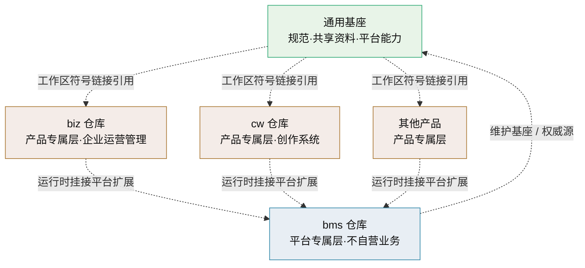

# 平台可扩展性规划

> BMS 平台支撑独立产品（如 biz 企业运营管理、CW 创作系统）复用与扩展的三层模型与落地路线

[文档首页](../文档首页.md) › 规划 › 平台可扩展性规划　|　[同级：项目规划说明 →](项目规划说明.md)

> **文档说明**：本文档回答「BMS 如何作为平台支撑多个独立产品」——三层分层模型、文档与代码的复用边界、产品接入形态与平台契约、落地路线。
>
> | 项 | 说明 |
> | --- | --- |
> | 读者 | 平台维护者、产品负责人（biz / cw 等）、AI 助手（按本文建立上下文） |
> | 分工 | 本文定**模型与边界**（分几层、能力归谁、产品怎么挂、平台怎么承诺）；**接入操作步骤**见《[项目规划说明](项目规划说明.md)》「平台扩展接入流程」节；基座文件清单见《[基座文档清单](../基座文档清单.md)》；跨层引用写法见《[文档生成规范](../规范/文档生成规范.md)》「关联文档链接」节 |
> | 维护 | 三层归属、能力清单、契约口径变更须先改本文，再同步《项目规划说明》「平台扩展接入流程」节与各产品规划 |

## 1. 背景与问题 <a id="background"></a>

BMS 规划之初定位为「基础管理系统」，文档与代码中将**平台能力**（认证/权限/文件/工作流/审计等）与**自营业务**（采购、收付款、销售、仓储等）混在同一仓库、同一文档、同一设计体系中。当需要在 BMS 之上孵化独立产品（如 CW 创作系统）、并把 BMS 自带业务独立为 biz 企业运营管理时，暴露出文档与代码两个层面的障碍。

### 1.1 文档体系单体专属，无法复制扩展 <a id="bg-doc"></a>

- **规范文档虽通用但带 BMS 专属措辞**：[《文档生成规范》](../规范/文档生成规范.md)、《[命名规范](../规范/命名规范.md)》等 19 篇规范均为 BMS 视角编写（如命名规范写死「仓库与根目录：`bms`」），产品复制后仍需逐篇人工改编，两仓库随后各自漂移。
- **设计体系整体专属**：架构设计（01-31）、概要设计（01-36）、布局/原型/数据库体系编号全局连续、内容围绕 BMS 系统（租户、RBAC、收付款、采购）展开，无法作为「骨架模板」抽取复用；且其中混有大量业务设计（采购/收付款/供应商），平台与业务不分。
- **规划文档无立项模板**：[《项目规划说明》](项目规划说明.md)等规划围绕 BMS 技术栈与模块定义，CW、biz 想建立自己的规划无从下手。
- **共享基础设施资料无同步机制**：开发服务器/开发机/AI/工具等部署资料是跨项目共享资产，产品已复制，但 BMS 后续更新两边互不感知。

### 1.2 代码扩展只覆盖两条路 <a id="bg-code"></a>

[《项目规划说明》](项目规划说明.md)第 23 节（附加业务模块规划）原给出两条追加路径：

| 路径 | 形态 | 适用场景 |
| --- | --- | --- |
| 内置模块 | monorepo 内新增，随 BMS 主版本发版 | 采购、销售、仓储等与平台深度绑定的业务 |
| 独立服务 | 独立部署，经 /api/open 与 OIDC IdP 集成 | 大型独立系统、强隔离、异构技术栈 |

两条路都**缺失**中间形态：一个项目要**独立仓库、独立演进，但运行时高度复用平台能力**（认证、权限、文件、工作流、审计等）。同时「内置模块」路径本身把业务揉进平台仓库，正是业务/平台不分的问题源。

### 1.3 需求定义 <a id="bg-need"></a>

- 文档：把跨项目共享的文档资产抽成**通用基座**，BMS、biz、CW 等产品引用基座、只维护自己的专属部分；新产品可低成本初始化。
- 代码：明确 BMS 作为**平台**向产品暴露的可复用能力边界（**平台不自营业务**），以及产品以何种形态「挂进平台」运行，补上第三条路。
- 业务剥离：BMS 现有/规划的自营业务（采购、收付款、供应商、销售、仓储）迁出平台仓库，独立为 **biz 企业运营管理**产品，与平台能力彻底分离。
- 目标项目：**biz 企业运营管理**（采购/收付款/销售/仓储等企业运营业务）与 **CW 创作系统**（图像/视频生成、写作）——均独立仓库、独立演进，运行时作为 BMS 平台扩展复用平台基础能力，自身只做业务域（创作域/运营域）。

## 2. 目标与原则 <a id="goals"></a>

### 2.1 目标 <a id="goals-list"></a>

1. **文档可复制可扩展**：新产品在基座上初始化时「链接即用、增量扩展」，不必逐篇改编，也不担心基座漂移。
2. **代码可复用边界清晰**：BMS 平台的认证/权限/文件/通知/工作流/审计等能力以声明的方式供产品复用，产品不复制平台代码。
3. **业务与平台分离**：BMS 平台不自营业务，重业务全部以产品仓库形态独立（biz、CW），平台升级不阻塞产品迭代，反之亦然。
4. **产品独立演进**：biz、CW 独立仓库、独立发版节奏，互不阻塞、不与平台主版本绑定。
5. **规模可控**：沿用「单体 + 模块 + 独立 worker」路线，不因扩展需求引入微服务（延续《项目规划说明》「明确不采用 · 明确不采用」节口径）。

### 2.2 设计原则 <a id="principles"></a>

- **基座唯一权威源**：通用基座文档只在 BMS 仓库演进，产品侧经产品仓库根 `bms文档` 软链并排引用，不复制、不 fork 二次维护。
- **中性措辞**：基座文档只描述通用方法与共享基础设施，不写某项目专属事实；项目专属细节落到「平台专属层」或「产品专属层」。
- **业务不入平台**：平台仓库只承载基座与平台能力，任何业务模块（含原「内置模块」路径）一律建产品仓库、走平台扩展接入。
- **扩展点显式化**：产品挂接平台必须走登记机制（模块/表前缀/错误码段/事件域等注册），冲突在启动与 CI 阶段被拒绝。
- **先文档后代码**：文档体系机制先行落地（biz、CW 的文档扩展立刻受益）；代码扩展点随 BMS 进入架构/开发阶段再实现。

### 2.3 成功标准 <a id="goals-success"></a>

目标是否达成按下列可衡量判据评估（随路线图评审复核）：

| 编号 | 成功标准 | 判据 |
| --- | --- | --- |
| S1 文档可复制 | 新产品在基座上初始化「链接即用、增量扩展」 | 新产品文档骨架初始化 ≤ 1 小时（走 4.4 流程）；`check-base.py` 五项校验通过；产品侧零基座副本 |
| S2 能力可复用 | 产品不复制平台代码 | 产品仓库无认证/权限/文件/租户路由等平台能力实现；能力获取全部走注册与接口 |
| S3 业务与平台分离 | 平台零业务模块 | 平台仓库与平台设计文档中无采购/收付款/销售/仓储/创作等业务内容 |
| S4 产品独立演进 | 产品与平台互不阻塞 | 产品可独立提交与发版；平台发版不要求产品同步改动（破坏性变更走契约承诺过渡期） |
| S5 扩展点收敛 | 扩展不引入微服务 | 产品以「构建期合并 + 进程内扩展包」接入；无新增独立服务进程（独立服务形态按 5.7 另计） |
| S6 契约可信 | 平台演进不破坏已接入产品 | 破坏性变更提前至少一个次版本公告并提供过渡期；变更导致产品接入失败数为 0 |

## 3. 总体模型：基座 + 平台 + 多产品三层分层 <a id="model"></a>

统一的**三层分层**同时作用于文档与代码：

| 层 | 定义 | 文档内容 | 代码内容 | 托管与演进 |
| --- | --- | --- | --- | --- |
| **通用基座** | 跨项目共享的规范与基础设施 | 规范 19 篇、共享基础设施资料（开发服务器/开发机/工具/AI/知识档案）、用户文档（凭据模板）、资源 | BMS 平台的通用能力组件（认证/权限/文件/通知/工作流/审计/报表/事件/任务/i18n/开放接口/租户路由等），以「平台能力」形式提供 | 由 BMS 维护（权威源），产品经仓库根 `bms文档` 软链引用 |
| **平台专属** | BMS 平台自身（**不自营业务**） | 规划（项目规划说明/开发部署规划/本规划）、项目基线、设计体系（平台能力部分） | BMS 平台管理端与平台能力实现 | 随 BMS 仓库演进 |
| **产品专属** | 各独立产品/业务 | 各产品的规划/项目基线/设计/专属资料（如 biz 的采购/收付款/销售/仓储，CW 的 ComfyUI 工作流、词库、创作管线设计） | 各产品业务域代码，部署为平台扩展 | 各产品独立仓库 |



### 3.1 判定规则 <a id="model-rule"></a>

判断一段内容（文档或代码）属于哪一层：

1. 内容只在本产品内有效（产品业务、产品专属工具）→ **产品专属**。
2. 内容描述 BMS 平台本身（平台架构、平台能力、平台管理功能）→ **平台专属**；重业务（采购/收付款/销售/仓储、创作）一律归产品专属，**不入平台仓库**。
3. 内容对任意基于平台的产品都适用（规范方法论、共享基础设施、平台通用能力）→ **通用基座**。

原「内置模块」路径不再作为平台业务形态：凡业务必须以产品仓库承载（平台扩展或独立服务），平台仓库零业务模块。

### 3.2 业务与平台能力的判定尺 <a id="model-rule2"></a>

3.1 解决「内容归哪一层」，本小节解决「一个新需求该建产品仓库，还是做成平台能力」。按下表逐条判定（命中任一业务特征即归产品专属）：

| 判据 | 归产品专属（业务） | 归平台专属（能力） |
| --- | --- | --- |
| 领域模型 | 有独立业务实体与单据（订单、凭证、分镜、作品） | 无业务实体，只提供机制（认证、权限、文件、任务、事件） |
| 复用范围 | 仅本产品使用 | 任意产品都需要 |
| 交付方式 | 可独立交付 | 随平台提供，不单独交付 |
| 数据结构 | 产品注册表前缀建表（`biz_` / `cw_`），落租户库 | 平台域固定前缀（`sys_` / `wf_` / `rpt_` / `ai_`）或平台库 |
| 变更节奏 | 产品自行发版 | 随平台版本，受 5.5 契约承诺约束 |

**边界争议的处置**：

1. 先按「是否被第二个产品需要」判定——只有一个产品要的能力先在产品内实现，出现第二个产品时再上收为平台能力。
2. 上收为平台能力须走《项目规划说明》「变更管理与项目度量」节的变更流程，同步更新 5.1 能力清单与本文。
3. 能力上收后原产品实现保留一个过渡期（口径同 5.5），不做一次性切换。

## 4. 文档体系设计 <a id="doc-design"></a>

### 4.1 目录归属映射 <a id="doc-map"></a>

BMS 仓库文档目录（现状）与层级的对应：

```text
bms/bms文档/
├── 基座文档清单.md      # 基座（权威清单本体，产品不复制）
├── 规范/              # 通用基座（19 篇，随 bms 演进）
├── 资料/              # 部分属基座、部分属平台专属
│   ├── 开发服务器/     # 基座（mjbk/mjw 共享基础设施）
│   ├── 开发机/         # 基座通用部分（git/opencode/防火墙等）；平台专属部分（BMS 接入记录）标注
│   ├── 工具/          # 基座（通用工具链，如 bg/reorder-design/base-check）
│   ├── AI/            # 基座（graphify/llamacpp/dsh/LM Studio 等）
│   └── 知识档案/       # 基座（技术栈知识顾问）
├── 规划/              # 平台专属（平台规划/开发部署规划/本规划；业务规划在 biz 等产品仓库）
├── 项目/              # 平台专属（平台开发的需求/任务/计划基线）
├── 设计/              # 平台专属（架构/概要/布局/原型/数据库·平台能力部分）
├── 用户文档/           # 基座模板（本地资源凭据，各仓库自带副本，gitignore，不参与校验）
└── 资源/              # 基座（公共样式、mermaid 资产）
```

产品仓库（如 biz、CW）目标文档结构（产品文档根按项目命名：`biz文档/`、`cw文档/`；bms 为 `bms文档/`）：

```text
biz/
├── bms文档/            # 符号链接 → ../bms/bms文档（基座权威源，与产品文档根并排）
└── biz文档/            # 产品文档根（产品专属）
    ├── 文档首页.md      # 产品导航（产品专属）
    ├── 规划/           # 产品专属（biz 企业运营管理规划 / cw 项目规划）
    ├── 项目/           # 产品专属（需求/任务/计划基线）
    ├── 设计/           # 产品专属（biz 运营体系设计 / cw 创作体系设计）
    └── 用户文档/        # 凭据副本（gitignore）
```

> 工作区模型：产品仓库不复制基座；各产品仓库根设软链 `bms文档 → ../bms/bms文档` 与产品文档根并排，产品文档引用基座统一用 `../bms文档/…` 相对路径，不占产品文档根目录名（见 4.3）。产品专属资料（如运营/创作行业资料）保存在产品仓库实目录中。

### 4.2 通用基座中性化改造 <a id="doc-neutral"></a>

基座文档（以 bms 仓库内为权威源）需消除平台专属措辞，让产品原样复用：

| 改造项 | 现状示例 | 目标写法 |
| --- | --- | --- |
| 项目称谓 | 「BMS 项目」「BMS 后端」「在 BMS 项目中的用途」 | 「本项目」「本平台」，章节标题用「在本项目中的用途」 |
| 仓库/根目录 | 「仓库与根目录：`bms`」 | 「仓库与根目录：`{项目名}`（平台仓库为 `bms`）」 |
| 平台专属事实 | monorepo 目录布局、`sys_` 前缀、租户概念 | 从基座抽离到平台专属文档，或标注为「平台示例」 |
| 共享对象的可选性 | 某些规范条目仅 BMS 适用 | 标注「仅平台适用」或用「如适用」限定 |
| **跨层引用**（易漏） | `《[项目规划说明](../规划/项目规划说明.md)》`、`《[国际化管理](../设计/概要设计/29_概要设计_国际化管理.md)》` | **只写文档名引用**：「平台《项目规划说明》」；基座内只保留指向基座文件的相对链接（含各仓库自带的 `文档首页.md`、`用户文档/本地资源.md`） |
| 标识符例外 | `bms`、`bms_`、`BMS_`、`bms:` | 保留为**平台默认标识**（见《基座文档清单》「平台默认标识说明」节），产品沿用或整体替换自身前缀 |

> 跨层引用是中性化的关键维度：基座文档（规范/资料/资源）会被产品文档以符号链接路径引用，但其指向 `规划`、`项目`、`设计`（平台专属目录）的相对路径在产品仓库中并不存在（平台专属文档不随工作区进入产品仓库），必然断链（且可能在产品侧「碰巧解析」到产品自己的同名文档，造成静默错指）。首次中性化即因此留下约 70 处跨层链接，产品侧累计断链 biz 113 处、cw 87 处（2026-09-10 修复）。
>
> 具体落点逐篇标注在落地阶段的改造清单中（见下文 6 节 R1），不在此逐一展开。

### 4.3 工作区模型与基座引用 <a id="doc-sync"></a>

- **工作区（组合层）**：一个工作区由一个 bms 克隆与一个或多个产品仓库克隆平级并置组成（如 `bizs` = `bms` + `biz`、`cws` = `bms` + `cw`）；AI 工作区（AGENTS、.opencode、知识图谱）位于工作区根，可同时看到基座与产品内容。扩展新产品只需在工作区根克隆对应产品仓库。
- **工作区配置仓库**：工作区根本身是一个 git 仓库，只跟踪工作区配置（`AGENTS.md`、`README.md`、`.opencode/`、`.graphifyignore`、`.gitignore`、`.vscode/`、`*.code-workspace`）；`bms/` 与各产品目录由各自仓库管理，新工作区可克隆配置仓库复用。IDE 以 `*.code-workspace` 多根并置（`bms文档/`、`biz文档/`、`cw文档/` 文档根命名天然可辨），产品仓库根的 `bms文档` 软链即基座视图，权威基座文档统一从 BMS 根查看。
- **权威源与引用**：通用基座文档在 bms 仓库维护（bms 即平台，天然承担基座职责），产品仓库不复制；各产品仓库根设软链 `bms文档 → ../bms/bms文档` 与产品文档根（`biz文档/`、`cw文档/`）并排，产品文档引用基座统一用 `../bms文档/…` 相对路径。基座文件全量清单见《基座文档清单》（产品仓库不复制该清单）。
- **同步靠 git**：改动任一处 bms 克隆 → 提交推送 → 其他工作区的 `bms/` 克隆 `git pull` 更新，合并与冲突走 git 机制；产品仓库同理。**不引入 git submodule、不保留文件同步脚本**——原「清单 + 脚本 + 人工确认」的 base-sync 机制已退役。
- **一致性自检**：`scripts/tools/base-check/check-base.py` 校验基座链接自洽、无跨层引用、无措辞残留、清单与磁盘一致（CI job `base-integrity`）。
- **产品侧校验盲区**：该脚本在 bms 仓库运行，只校验基座自身；产品文档以 `../bms文档/…` 引用基座，基座文件重命名、锚点改名或章节删除会使产品侧断链而 bms 侧无感知。约定——①基座**重命名或移动文件**须同步检索各产品仓库引用（工作区根 `grep -rn "bms文档/"` 排查）；②基座内锚点（`## N. 章节 <a id>`）视为对外契约，改名按破坏性变更处理（见 5.5）；③产品仓库在阶段末评审做一次相对链接可达性抽查。
- **边界**：产品专属资料保存在产品仓库自己的实目录，不与基座混放；通过产品仓库 `bms文档` 软链编辑基座文件时，实际修改的是 bms 克隆，须回 bms 仓库提交。

### 4.4 新产品文档初始化流程 <a id="doc-init"></a>

新产品的文档初始化按以下流程（以 biz、cw 为样本验证可行性）：

1. **取基座**：在工作区克隆 bms 仓库，产品仓库根建软链 `bms文档 → ../bms/bms文档` 与产品文档根并排（见 4.3）。
2. **建产品骨架**：创建 README、文档首页、产品目录骨架（规划/项目/设计/用户文档）；基座经仓库根 `bms文档` 软链引用，产品专属资料/资源随开发建独立实目录。AI 协作约定由工作区根 `AGENTS.md` 唯一维护，产品仓库不单设。
3. **立产品规划**：参照 [《项目规划说明》](项目规划说明.md) 的章节结构组织产品自己的《XX项目规划》，聚焦产品业务；平台能力不重复设计，引用本规划与 bms 架构文档。
4. **建产品设计**：按《文档生成规范》「设计文档体系规范 · 总纲 + 节点」节建立产品设计体系（如 biz 的运营体系、cw 的创作体系），编号独立于 bms 从 01 起。
5. **登记与图谱**：登记产品文档首页，在工作区根运行 `graphify update .` 纳入工作区图谱（覆盖 bms 与产品）。

> 产品设计体系（架构/概要/布局/原型）与 bms 同构但独立编号、独立内容，二者通过指向平台设计文档的链接衔接，不复制平台设计。

### 4.5 产品专属文档约定 <a id="doc-product"></a>

- 产品文档遵循同一套通用规范（基座），命名、格式、图形画法一致。
- 产品专属表前缀/模块简称等标识符按《[命名规范](../规范/命名规范.md)》与[《英文简称规范》](../规范/英文简称规范.md)申请（如 biz 模块 `biz_`、cw 模块 `cw_`），与平台注册表查重防冲突。
- 产品文档首页与 README 指引「平台相关机制见 BMS《平台可扩展性规划》与 bms 架构设计」以交叉链接。

### 4.6 新产品规划的必备章节 <a id="doc-plan"></a>

产品《XX 项目规划》按《[项目规划说明](项目规划说明.md)》的章节结构组织，但**必须包含**下列产品专属章节（biz / cw 已按此落地，作为 R5《产品接入指南》的模板口径）：

| 必备章节 | 内容 | 作用 |
| --- | --- | --- |
| 产品定位与范围 | 产品做什么、不做什么、与平台的分工 | 判定业务边界，防止能力重复建设 |
| 平台复用边界 | 逐条列出复用哪些平台能力（对齐 5.1 清单）、哪些产品自建 | 避免复制平台实现 |
| 平台依赖台账 | 依赖的平台能力、当前就绪状态、未就绪时的推进方式 | 排期可判，避免被未落地的机制阻塞 |
| 标识符登记 | 模块简称 / 表前缀 / 业务码 / 错误码段 / 事件域（按《[命名规范](../规范/命名规范.md)》与《[英文简称规范](../规范/英文简称规范.md)》登记查重） | 注册唯一性，防跨产品冲突 |
| 演进路线与验收判据 | 阶段划分与每阶段完成判据 | 产品独立演进可衡量 |
| 明确不采用 | 产品层面明确不做的事 | 防止范围反复讨论 |

> 产品规划不重复设计平台机制，机制一律链接到本文与《项目规划说明》「平台扩展接入流程」节；产品规划中的平台能力描述与 5.1 清单不一致时，以本文为准并回写产品文档。

## 5. 代码复用能力边界 <a id="code-design"></a>

### 5.1 平台能力清单 <a id="code-cap"></a>

BMS 作为平台暴露的通用能力（产品通过既有 API/机制复用，不复制实现）：

| 能力 | 说明 | 产品接入方式 | 可用阶段 |
| --- | --- | --- | --- |
| 模块注册（接入入口） | 平台库 `sys_module` 登记模块简称/表前缀/错误码段/事件域，启动与 CI 校验唯一性 | 产品**先注册后建表**，注册要素即得权限码、事件域与错误码段 | 一 |
| 配置与密钥管理 | config.toml 分层 + 环境变量覆盖，密钥走 Secret 管理 | 产品配置并入平台配置体系，不自建配置中心 | 一 |
| 多租户隔离 | 租户独立库路由 | 产品业务数据落租户库，天然隔离 | 一（拓扑）/ 三（租户管理） |
| 缓存 | Redis 共享缓存 + 进程内字典缓存，key 空间按域划分 | 产品按 `bms:{租户}:{产品}:{域}:{键}` 口径使用，不自起缓存服务 | 一（基础）/ 十（三防） |
| 认证与会话 | 本地 + SSO（OIDC IdP、JIT 建号）、双 token、会话管理 | 产品用户以平台 SSO 登入，免自建认证 | 二 |
| 限流与安全防护 | slowapi 限流、图形验证码、账号锁定、数据脱敏 | 产品接口自动纳入平台限流与防护 | 二 / 十 |
| 用户与组织架构 | 部门/岗位/用户/角色 | 复用平台用户体系，产品侧做绑定展示 | 三 |
| RBAC 权限 | 菜单/表单/按钮/字段权限、动作级数据范围、动态菜单 | 产品注册菜单/表单/业务码/动作码即得权限 | 三 |
| 文件管理 | 分片上传/断点续传/在线预览/预签名下载 | 复用 /api/v1 文件接口与 MinIO 存储 | 四 |
| 消息通知 | 站内信/邮件/短信/公告 | 复用通知中心与推送链路 | 四 |
| 实时推送 | Socket.IO 跨实例广播（待办、会话踢出） | 产品事件经平台推送通道，不自建长连接服务 | 四 |
| 任务调度 | 定时任务入库、Celery beat 自研数据库调度器 | 产品任务注册到平台调度器 | 四 |
| 事件总线 | RocketMQ 事件、Webhook 订阅 | 产品注册事件域、订阅/发布事件 | 四（基础设施）/ 六（事件模型与 Webhook） |
| 审计合规 | 操作/登录/字段级审计、哈希链防篡改、三权分立 | 对平台开放的能力自动纳入审计 | 四 |
| 国际化 | 文案入库、i18n 附表、动态语言 | 产品文案入 sys_i18n_message 免发版 | 四 |
| 字典与系统参数 | 通用数据字典、系统参数（平台默认值 + 租户覆盖） | 产品复用字典与参数机制，不自建配置表 | 四 |
| 导入导出 | 通用导入导出模板、异步大批量、失败行回执 | 产品登记导入导出模板即得导入导出能力 | 四 |
| 表单定制与工作台 | 表单设计器（自定义字段）、首页工作台卡片与布局 | 产品以配置方式挂接，免自研表单引擎与工作台 | 四（后端）/ 十一（前端设计器） |
| 回收站 | 逻辑删除 → 回收站 → 恢复/彻底删除，随租户隔离 | 产品表复用平台回收站机制，无需自建 | 四 |
| 工作流 | BPMN 建模与执行、会签/或签、待办/已办 | 产品单据挂流程定义即得审批链 | 五 |
| 开放接口 | /api/open、OAuth2 Client Credentials | 第三方与外部系统接入统一走平台开放接口 | 六 |
| 可观测性 | 结构化日志（structlog + Loki）、指标（Prometheus）、链路追踪（OpenTelemetry + Jaeger） | 产品接入平台日志/指标/追踪，不自建一套 | 九 |
| 归档与备份 | 两段式归档、三库备份与恢复演练 | 产品数据随平台备份策略纳管 | 九 |
| 报表与大屏 | 数据集管理、ECharts 报表设计器、大屏 | 产品数据集挂接平台报表能力 | 十二 |
| 全文检索 | 按产品模块独立索引、跨表检索、权限过滤 | 产品模块注册索引域，随接入扩展检索范围 | 十四 |
| AI 能力 | 统一 LLM 适配层（外部 API / 私有化端点可切）、AI 交互审计 `ai_chat_log`、AI 两开关 | 产品经适配层调用，不自建模型网关 | 十五 |
| 向量检索 | Milvus（依赖 etcd + MinIO），按租户 collection 隔离 | 产品语义检索复用平台向量库，不自建 | 十五 |

> 「可用阶段」指该能力随 BMS 开发阶段交付后才可被产品复用（阶段划分见《[项目规划说明](项目规划说明.md)》「开发计划与验收标准」节）。**未就绪能力不阻塞产品规划**：产品先在依赖台账中登记、用本地替代方案过渡，就绪后切换（见 4.6）。
>
> AI 能力与向量检索为本次补录——cw 已在《cw 项目规划》中声明复用这两项能力，此前清单未收录，属「产品已在依赖、平台未登记」的缺口。实时推送、字典与系统参数、缓存、配置与密钥、可观测性同理补齐。

### 5.2 产品扩展接入形态（第三条路） <a id="code-shape"></a>

为产品（biz、CW 等）提供的扩展形态「**平台扩展**」，替换原「内置模块」路径成为业务承载主形态（**接入操作步骤**见《[项目规划说明](项目规划说明.md)》「平台扩展接入流程」节，本节只定形态与边界）：

| 维度 | 说明 |
| --- | --- |
| 仓库与版本 | 产品独立 git 仓库、独立分支与发版节奏，不与 BMS 主版本绑定 |
| 前端挂接 | 产品前端模块源码由产物构建期合并进 BMS 前端应用；菜单/表单/按钮/字段走平台注册，动态路由生效，前端无需随 BMS 发版 |
| 后端挂接 | 保持「单体模块化 + 独立 worker」原则（不引入微服务）：产品业务以扩展包方式并入 BMS backend 同一进程，经产品注册表挂载路由/模型/任务/事件；产品代码独立演进、随平台构建发布 |
| 数据边界 | 产品业务表用产品前缀（如 `biz_`、`cw_`）落租户库，遵守[《数据架构》](../设计/架构设计/05_架构设计_数据架构.md)数据规范；跨库引用走逻辑外键 |
| 注册要素 | 在平台登记表前缀/业务码/错误码段/事件域/前端包来源（扩展 `sys_module` 机制或新增产品级注册表），启动与 CI 校验唯一 |
| 权限与审计 | 复用 RBAC 与审计，产品自身不重复实现 |

### 5.3 需要 BMS 后续补齐的扩展点 <a id="code-evolve"></a>

以下机制在 BMS 进入架构/开发阶段时落地（本规划定方向，不替代架构设计）：

1. **产品注册机制**：`sys_module` 或新增 `sys_product` 支持产品级注册（表前缀/错误码段/事件域/前端包来源）。
2. **错误码段扩展**：既有附加段（10xxxx 起）继续顺延分配，biz、cw 等产品按注册段使用。
3. **前端多包合并**：BMS 前端构建流水线支持从产品仓库拉取模块产物合并发布，兼顾独立仓库与运行时合并。
4. **后端扩展包加载**：backend 支持产品扩展包加载（路由/模型/任务/事件注册），进程内插件化但非微服务。
5. **契约稳定化**：产品对平台的依赖只允许走 /api/v1 平台接口与公开事件，禁止直连平台内部表，平台内部重构不破坏产品。

### 5.4 业务承载路径的取舍 <a id="code-choice"></a>

| 路径 | 代码所有权 | 演进节奏 | 平台复用度 | 适用场景 |
| --- | --- | --- | --- | --- |
| 平台扩展（主推，biz/CW 采用） | 产品独立仓库 | 产品独立 | 高 | 独立业务/项目、高度复用平台、独立演进 |
| 独立服务 | 产品独立 | 完全独立 | 低（API/IdP） | 强隔离、异构技术栈、外部团队 |

> BMS 平台不再提供「内置业务模块」：任何业务都以产品仓库承载。确需平台随包的轻量机制（如平台样例页面）作为平台能力而非业务存在。

### 5.5 平台对产品的契约与兼容性承诺 <a id="code-contract"></a>

产品接入后依赖平台契约，平台按下表收敛变更影响（与《[项目规划说明](项目规划说明.md)》「平台对产品的兼容性承诺」节 同源：本节为**承诺口径**，23.9 为**操作细节**）：

| 项 | 承诺 |
| --- | --- |
| 契约范围 | 注册要素（表前缀 / 错误码段 / 事件域 / 业务与动作码）、平台能力接口（`/api/v1`、`/api/open`）、事件命名、种子结构（菜单/表单/按钮/字段）、基座文档锚点——均视为对外契约 |
| 稳定性 | 同一主版本内保持向后兼容；产品只依赖契约，不依赖平台内部实现 |
| 破坏性变更 | 提前至少一个次版本公告（本文 + 发布说明 +《项目规划说明》「演进路线」），附迁移步骤与过渡期，过渡期内新旧并存 |
| 能力下线 | 提前公告并提供替代方案，过渡期不短于一个发布周期，不静默移除产品依赖的接口 |
| 内部重构 | 平台内部重构（权限计算、租户路由等）不得影响契约；确需影响时走破坏性变更流程 |
| 新增能力 | 以**加法**为主（新增接口 / 事件 / 注册字段），不改动既有语义，产品按需接入 |
| 通知渠道 | 发布说明 + 本文修订；产品侧在工作区 `git -C bms pull` 后即时可见，平台不承担逐一通知 |
| 产品侧义务 | 按契约接入（不直连平台内部表、不依赖未登记能力）；发现依赖缺口须提出登记（见 3.2），由平台评估上收或拒绝 |
| 违反处置 | 产品依赖非契约部分导致故障由产品自行承担；由此产生的兼容负担，按变更流程评估是否上收为平台能力 |

### 5.6 接入后的持续治理 <a id="code-govern"></a>

接入不是终点，已接入产品按下列口径管理全生命周期：

| 主题 | 口径 |
| --- | --- |
| 版本兼容矩阵 | 产品规划维护「产品版本 ↔ 依赖的平台版本 ↔ 依赖的能力阶段」对照；平台主版本升级时复核，破坏性变更按 5.5 执行 |
| 接入验收判据 | 同时满足：①模块注册唯一性校验通过；②菜单/表单/按钮/字段种子挂接生效且动态路由可见；③注册 → 权限 → 业务主流程 → 事件的关键链路 E2E 通过；④产品表落租户库且隔离验证通过；⑤错误码段与事件域无跨产品冲突 |
| 产品升级 | 产品按自身节奏升级；涉及平台契约变更时先升平台或先升产品按公告说明执行 |
| 停用与下线 | **临时停用**走租户模块开关（平台超管启停：菜单与接口禁用、数据保留）；**产品下线**须另行处置——数据导出归档、注销模块注册（错误码段不回收，见《项目规划说明》「错误码段规则与注册」节）、移除前端合并与后端扩展包 |
| 能力缺口与冲突 | 产品需要平台未提供的能力 → 按 3.2 判定上收或产品自建；两产品对同一能力的诉求冲突 → 平台统一抽象后以配置/参数区分，不为单一产品做特例 |
| 运行期边界 | 产品扩展包与平台同进程运行：产品未捕获异常不得导致平台整体不可用（平台侧统一异常处理与隔离）；产品性能问题不得拖垮共享资源（连接与任务配额随平台管控） |

### 5.7 独立服务形态口径 <a id="code-service"></a>

独立服务是两轨中的另一轨（接入操作见《[项目规划说明](项目规划说明.md)》「独立服务集成」节），本节定形态与选型建议：

| 维度 | 口径 |
| --- | --- |
| 认证 | BMS 作 OIDC Provider，独立服务以 BMS 租户用户体系单点登录（客户端注册复用 `sys_client`，scope 最小化分配） |
| 数据交互 | 经 `/api/open` 开放接口（OAuth2 Client Credentials + 调用审计），不直连租户库 |
| 事件联动 | Webhook 订阅 BMS 事件；独立服务自有事件经自身通道回传，不占用 BMS 事件域 |
| 数据边界 | 独立服务自建库，不进租户库；与租户数据交互一律走开放接口，遵守租户隔离与调用审计 |
| 页面入口 | 以外部链接菜单挂入 `sys_menu`（外链类型），权限分配走既有菜单权限机制 |
| 运维责任 | 独立服务的部署、监控、备份由产品侧自理，不纳入平台 Compose 编排与备份策略；运维手册与值班口径自行维护 |

**选型建议**（何时选独立服务而非平台扩展）：

- **平台扩展（默认）**：需深度复用平台能力（权限 / 工作流 / 审计 / 文件 / 检索）、业务模型与平台主数据强耦合、希望免运维——biz、cw 属此类。
- **独立服务**：异构技术栈、强隔离或需独立部署、外部团队开发与独立交付节奏、平台能力复用需求低（只需认证与少量接口）。
- 选择独立服务须在产品规划中说明「不复用平台能力」的理由，避免借独立服务之名重造平台已有的轮子。

## 6. 落地路线图 <a id="roadmap"></a>

| 步骤 | 内容 | 完成标准 | 责任仓库 | 状态（2026-09-10） |
| --- | --- | --- | --- | --- |
| R1 基座中性化 | 逐篇改造 bms 规范与共享资料的项目专属措辞与跨层引用，生成《基座文档清单》 | 基座文档无 bms 专属硬编码——项目称谓、跨层相对链接、失效锚点三项均清零；清单收录全部基座文件且与磁盘一致 | bms | **已完成**：称谓与跨层引用 501 处中性化、失效锚点 102 处与断链 39 处修复；`check-base.py` 五项校验通过 |
| R2 基座同步机制 | 原方案：`scripts/tools/base-sync/` 同步脚本 + 变更提示约定 + 一致性自检；cw、biz 切权威源并完成同步 | — | bms（产品侧执行） | **已被工作区模型取代（2026-09-10）**：产品仓库改符号链接引用基座 + 多克隆 git 同步，base-sync 退役；一致性自检保留为 `scripts/tools/base-check/check-base.py`（CI `base-integrity`） |
| R2.5 文档根改名与工作区配置 | 三方文档根改名（`bms文档/`、`biz文档/`、`cw文档/`）+ 产品基座软链重定向；工作区配置仓库落地（AGENTS/README/.opencode/.graphifyignore/.gitignore/.vscode/*.code-workspace）；图谱按新路径重建 | 旧路径引用清零、链接校验与 `check-base` 通过、图谱覆盖新路径 | bms + biz/cw + 工作区 | **已完成（2026-09-10）** |
| R3 cw 立项 | 按 4.4 初始化流程建 cw 规划/项目/设计骨架与《cw 项目规划》 | cw 文档可在基座上增量扩展 | cw | **已完成**（规划文档名统一见第 8 节） |
| R3.5 业务剥离与 biz 立项 | 本规划确立「业务不入平台」；bms 规划/设计中业务内容剥离；建 biz 仓库与《biz 企业运营管理规划》 | bms 平台文档业务除尽；biz 文档可在基座上增量扩展 | bms（biz 侧执行） | **已完成**：bms 规划/设计的业务内容改为指向 biz；biz 建仓 + 基座软链引用 + 规划/设计骨架具备 |
| R4.1 产品注册机制 | `sys_module` / `sys_product` 支持产品级注册（表前缀 / 错误码段 / 事件域 / 前端包来源） | 产品注册要素校验生效，冲突被拒 | bms | 未开始（阶段一） |
| R4.2 后端扩展包加载 | backend 支持产品扩展包加载（路由 / 模型 / 任务 / 事件注册），进程内插件化 | 产品扩展包可挂载运行，异常隔离生效 | bms | 未开始 |
| R4.3 前端多包合并 | 前端构建流水线支持从产品仓库拉取模块产物合并发布 | 产品页面经动态路由可见，无需平台前端发版 | bms | 未开始 |
| R4.4 契约与兼容机制 | 平台能力接口与注册要素按 5.5 契约管理，破坏性变更走公告与过渡期 | 变更公告与过渡期机制可用 | bms | 未开始（随首个产品接入前落地） |
| R5 机制推广 | 后续新产品复用同一流程，白皮书沉淀为《产品接入指南》 | 第二条产品初始化全流程通过 | bms | **具备启动条件**：biz 已完成第二次初始化，《产品接入指南》待沉淀 |

> 状态列随路线图评审更新；R1-R3.5 属文档层（含 R2.5 工作区配置），可立即推进（biz、cw 文档扩展立刻受益）；R4 属代码层，随 BMS 开发阶段推进；R5 为后续产品预留。
>
> **产品可开始代码接入的判据**：R4.1 ~ R4.3 全部可用（R4.4 契约机制随首个产品接入前落地）。在此之前产品以规划、设计与本地原型推进（文档先行，见 2.2）；R4.1 单独可用时产品可先完成模块注册与数据建模，R4.2 / R4.3 具备后再接入页面与进程内扩展包。
>
> **工作区纪律**（工作区模型）：基座内容只在 bms 仓库维护与提交，产品仓库不承载基座副本（软链指向工作区 `bms/`）；改完基座在当前工作区提交推送后，其他工作区 `git -C bms pull` 对齐。产品侧旧编号引用与旧措辞在软链下即时跟随基座，不再有「落后几个提交」的漂移窗口。

## 7. 风险与对策 <a id="risk"></a>

| 风险 | 影响 | 概率 | 缓解措施 |
| --- | --- | --- | --- |
| 中性化改造牵动 bms 现有文档，改动量大 | 中 | 中 | 逐篇小批量提交；仅改措辞不动结构；git 保留历史；改后由 `check-base.py` 五项校验把关 |
| 基座副本二次漂移 | 低 | 低 | 工作区模型下产品仓库不再持有基座副本（符号链接引用，随 bms 提交即时生效），漂移源头消除；bms 侧由 `base-check/check-base.py` + CI `base-integrity` 常驻校验 |
| 产品仓库根 `bms文档` 基座软链接在 Windows 克隆与 GitLab/GitHub 网页端不可用 | 低 | 高 | 文档工作区以 Linux 为准；网页端浏览基座请进 bms 仓库；跨平台场景在 bms 仓库查看基座文档 |
| 文档根改名后旧路径引用与软链目标残留 | 中 | 低 | 改名与引用同批提交；全量相对链接校验 + `base-check/check-base.py` 五项自检把关；产品基座软链目标随 bms 推送同步更新 |
| 基座中性化只改措辞、漏掉跨层引用，产品侧成片断链 | 中 | 中 | 已在 4.2 增列「跨层引用」改造维度与 R1 验收判据；`check-base.py` 第 2 项常驻校验基座无跨层相对链接 |
| 业务剥离后 bms 配套设计/项目文档仍含业务，短期不一致 | 中 | 中 | 规划层先行定口径；设计/项目层分批搬迁（R3.5 后续批次） |
| 平台扩展机制复杂度上升（与「不采用微服务」冲突的担忧） | 中 | 中 | 明确机制是「进程内扩展包 + 构建期合并」，非服务拆分；能力边界以 5.1 清单收敛 |
| biz/cw 正式开发时机不确定，机制过早实现 | 低 | 中 | 文档层（R1-R3.5）先行；代码层（R4）跟随 BMS 开发节奏自然落地 |
| 产品间标识符/错误码段/事件域冲突 | 高 | 低 | 注册表启动与 CI 唯一性校验（沿用阶段一基础能力），本规划 R4 落实产品级注册 |
| 产品扩展包与平台同进程，产品缺陷或性能问题拖垮平台 | 高 | 中 | 平台侧统一异常处理与隔离；产品任务与连接纳入平台配额管控；接入验收含异常隔离验证（见 5.6） |
| 平台能力未就绪阻塞产品排期（如 R4 机制、AI 适配层、Milvus） | 中 | 高 | 5.1 清单标可用阶段；产品按 4.6 建依赖台账并备本地替代方案；未就绪不阻塞规划与设计（文档先行） |
| 产品依赖平台未登记的能力，接入时才发现不支持 | 中 | 中 | 产品按 3.2 提出登记，平台评估上收或明确拒绝；清单随补录更新（本次已补 AI 适配层 / 向量检索 / 实时推送等） |
| 基座文件重命名或锚点改名导致产品侧成片断链 | 中 | 中 | 基座锚点视为契约（见 5.5）；重命名须检索各产品引用；产品侧阶段末抽查链接可达性（见 4.3） |
| 多产品对同一平台能力的诉求冲突（各要特例） | 中 | 低 | 平台统一抽象后以配置 / 参数区分，不为单一产品做特例；争议走变更流程（见 3.2） |

## 8. 影响文档与后续修订 <a id="impact"></a>

- **[《项目规划说明》](项目规划说明.md)**：平台化改造——移除采购/收付款/销售/仓储等业务模块描述并指向 biz 仓库；第 23 节改写为「平台扩展接入流程」（替换原「内置模块」路径）；第 23.5 节错误码段分配表只保留**段位规则与注册位置**，各产品的具体段位分配落产品仓库规划（平台文档不再登记产品专属事实）。
- **[《基座文档清单》](../基座文档清单.md)**：基座内容分三类（基座文件 / 各仓库自带副本 / 清单本体）；补「跨层引用口径」「共享基础设施＝平台示例取值」两节；维护约定改为 `base-check` 自检口径（不再有同步范围/同步基线）。清单本身为基座权威清单，产品仓库不复制。
- **[《文档生成规范》](../规范/文档生成规范.md)**：7.6 跨层引用口径按工作区模型更新（产品文档经仓库根 `bms文档` 软链以 `../bms文档/…` 相对路径引用基座；基座引用平台专属文档仍写「平台《文档名》」），检查标准中的校验脚本路径改 `scripts/tools/base-check/check-base.py`；第 3 节补文档根命名约定（`<项目>文档/`）。
- **[《命名规范》](../规范/命名规范.md)**：第 3 节仓库名与根目录改为中性表述；文档根命名约定写入（`<项目>文档/`：bms 为 `bms文档/`，产品为 `biz文档/`、`cw文档/`），平台示例保留。
- **[《英文简称规范》](../规范/英文简称规范.md)**：补充产品级形前缀（如 `biz`、`cw`）登记口径。
- **[《文档首页》](../文档首页.md)**：文档根改名为 `bms文档/`（与产品 `biz文档/`、`cw文档/` 对齐）；登记本规划与《基座文档清单》；目录树与磁盘一致；产品仓库文档首页与 BMS 首页做交叉链接。
- **《开发部署规划》**：基座环境取值（服务器/开发机/库名）在规范中统一标注为「平台示例」，与本文 4.2 改造项对齐。
- **biz 仓库**：文档骨架 + 仓库根 `bms文档` 基座软链引用 + 《biz 企业运营管理规划》；补齐 `biz文档/项目/`、凭据副本与工作区工具链，与 cw 对齐。
- **cw 仓库**：README/文档首页按工作区模型更新，文档结构按第 4.1 节对齐（补齐 `cw文档/项目/`、基座改仓库根 `bms文档` 软链引用）；平台复用边界引用本规划 5.1 能力清单。
- **两产品仓库**：基座改仓库根 `bms文档` 软链引用并清理重复副本（工作区模型）；产品规划文档名统一为《biz 企业运营管理规划》《cw 项目规划》。
- **工作区仓库（bizs、cws）**：工作区配置仓库落地（只跟踪 AGENTS/README/.opencode/.graphifyignore/.gitignore/.vscode/*.code-workspace）；IDE 以多根工作区并置 bms 与产品，产品文档根命名天然可辨。

## 9. 术语表 <a id="glossary"></a>

本文档自定义概念较多，集中收录高频术语（按文中出现顺序归类）：

| 术语 | 定义 | 出处 |
| --- | --- | --- |
| 通用基座 | 跨项目共享的规范、共享基础设施资料与公共资源；bms 为权威源，产品以工作区软链引用、不复制 | 总体模型 |
| 平台专属 | BMS 平台自身内容（规划 / 项目 / 设计中的平台部分）与平台能力实现；**不自营业务** | 总体模型 |
| 产品专属 | 各独立产品（biz、cw）的业务内容、代码与专属资料 | 总体模型 |
| 三层分层 | 通用基座 / 平台专属 / 产品专属的分层模型，同时作用于文档与代码 | 总体模型 |
| 平台扩展 | 产品独立仓库演进、运行时并入平台的接入形态（前端构建期合并 + 后端进程内扩展包），主推形态 | 代码复用能力边界 |
| 独立服务 | 独立部署、经认证与开放接口集成的接入形态，数据不进租户库、运维自理 | 5.7 |
| 扩展点 | 平台为产品预留的注册与挂载机制（模块注册、扩展包加载、多包合并等） | 5.3 |
| 契约 | 产品可依赖的平台对外承诺集合——注册要素、能力接口、事件命名、种子结构、基座文档锚点 | 5.5 |
| 可用阶段 | 平台能力随 BMS 开发阶段交付后才可被产品复用的时点标识 | 5.1 |
| 依赖台账 | 产品规划中登记「依赖的平台能力 + 就绪状态 + 未就绪时的替代方案」的表 | 4.6 |
| 跨层引用 | 基座文档用相对路径指向平台专属目录（规划 / 项目 / 设计），在产品仓库必然断链 | 文档体系设计 |
| 中性化 | 消除基座文档中的平台专属措辞（称谓、跨层链接、锚点），使其可被任意产品原样复用 | 文档体系设计 |
| 工作区 / 组合层 | 一个 bms 克隆与一个或多个产品仓库克隆平级并置的目录组合（如 bizs、cws）；AI 工作区与知识图谱位于根，只做组合与配置 | 工作区模型 |
| 产品下线 | 与「租户模块临时停用」相对：导出归档数据 + 注销模块注册 + 移除扩展包 | 5.6 |

> 本文档为规划类文档，机制方向一经评审即定稿；具体实现（注册表字段、构建合并流水线等）在 BMS 架构设计中细化 · 依《[文档生成规范](../规范/文档生成规范.md)》编写 · 与《[项目规划说明](项目规划说明.md)》「平台扩展接入流程」节（接入操作）、《[基座文档清单](../基座文档清单.md)》配套