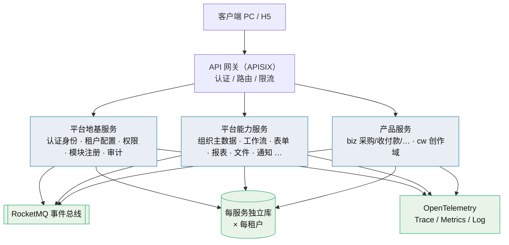

# 微服务演进规划

> BMS 微服务目标架构 · 服务清单 · 服务化地基 · 演进路线 · 阶段与迁移

[文档首页](../文档首页.md) › 规划 › 微服务演进规划　|　[同级：平台可扩展性规划 →](平台可扩展性规划.md)

> **文档说明**：本文档回答「BMS 如何以微服务为目标架构设计与演进」——目标与原则、目标架构与服务清单、服务化地基要求与门禁、演进路线、阶段与排期影响、与现状差异及迁移、风险与待实测。
>
> | 项 | 说明 |
> | --- | --- |
> | 读者 | 平台维护者、产品负责人（biz / cw 等）、AI 助手（按本文建立上下文） |
> | 分工 | 本文定**目标架构、服务清单、地基要求与演进路线**；选型的候选对比与推荐见《[微服务 · 12 选型对比（BMS）](../资料/知识档案/微服务/12_微服务_选型对比.md)》；决策评估与触发条件见《[微服务 · 10 项目评估（BMS）](../资料/知识档案/微服务/10_微服务_项目评估.md)》；接入操作与产品形态见《[平台可扩展性规划](平台可扩展性规划.md)》 |
> | 维护 | 目标架构、服务清单、地基要求、演进路线变更须先改本文，再同步《[项目规划说明](项目规划说明.md)》《[总体项目规划](总体项目规划.md)》与《[架构设计](../设计/架构设计/01_架构设计_总览.md)》对应节点 |

## 1. 目标与原则 

**目标**：把 BMS 演进为**微服务架构**——平台内部模块与产品（biz / cw）**全服务化**；且**从一开始就按分布式构建**，从架构上一次性设计到位，避免「先做单体、以后再拆」的返工。

> 本规划改写《[项目规划说明](项目规划说明.md)》「明确不采用」节原「不引入微服务」条目。决策依据、收益代价与行业证据见《[微服务 · 02 单体与微服务取舍](../资料/知识档案/微服务/02_微服务_单体与微服务取舍.md)》，本项目约束代入与触发条件见《[微服务 · 10 项目评估（BMS）](../资料/知识档案/微服务/10_微服务_项目评估.md)》，技术选型见《[微服务 · 12 选型对比（BMS）](../资料/知识档案/微服务/12_微服务_选型对比.md)》。

### 1.1 设计原则 

1. **一开始就分布式构建**：逻辑多服务 + 物理单机多容器（Docker Compose），架构按「可平滑迁多机 / k3s」设计；**分部署即微服务，不保留单体运行形态**。
2. **每服务独立库**（database-per-service）：不共享库、不跨库 JOIN；跨服务读经契约 / 事件或只读投影。
3. **按限界上下文 / 业务能力垂直切分**：禁止按技术层拆（否则得到分布式单体）。
4. **地基先行**：无网关、契约、分布式一致性与可观测地基，拆分只会得到「分布式单体」——服务化地基必须先于业务服务落地。
5. **保留既有产出、重构为分布式**：阶段一~五已交付的分层、基类体系、`sys_module` 注册、事件总线、前端模块化**保留**，按服务边界重组，不推倒重来。
6. **横切能力做成地基服务**：认证、权限、租户、审计、可观测等收敛为地基服务，不在每个服务重复实现。
7. **前后端解耦推进**：本轮只登记「前端经网关 / BFF 接入后端服务」这一对接事项；微前端（Module Federation）治理另有《[微前端](../资料/知识档案/微前端/01_微前端_总览.md)》专题，另行讨论。

## 2. 目标架构与服务清单 

### 2.1 架构形态 

- **进程模型**：一服务一容器、一服务一库；服务间同步走 REST，异步走 RocketMQ；服务身份与认证走网关 + OIDC / JWT。
- **寻址**：服务间按稳定主机名寻址（Compose DNS → 迁 K8s 后原生 Service），地址收敛进配置层，禁止硬编码 IP。
- **注册升格**：现有 `sys_module` 模块注册表升格为**服务目录与契约 / 版本登记**。

### 2.2 服务清单与建设批次 

划分原则：按限界上下文 / 业务能力垂直切分；每服务独立库、独立发布；横切收敛为地基服务。**下表只到分批与分组**，具体服务目录与注册要素（表前缀 / 业务码 / 错误码段 / 事件域）留到「阶段二」需求基线登记。

| 批次 | 服务 | 说明 |
| --- | --- | --- |
| **第 0 批（地基）** | 网关 / 边缘、认证与身份（含 SSO / IdP、会话令牌、服务身份）、租户与配置（租户开通 / 域名 / 配额、系统参数）、权限、模块注册 / 服务目录、审计（操作 / 登录 / 哈希链）、事件与可观测基座 | 分布式起步的前置；无此则得到分布式单体 |
| **第 1 批（边缘独立、低耦合）** | 文件、通知（站内信 / 推送 / 邮件短信）、任务调度、全文检索、报表、AI | 失败可降级、资源画像独特，先建以验证地基 |
| **第 2 批（核心主数据与业务能力）** | 组织主数据（用户 / 部门 / 岗位 / 角色 / 菜单）、工作流、表单定制、公告 / 帮助、导入导出、开放接口 / Webhook、归档 / 备份 / 回收站、首页工作台 | 强一致与横切最多，地基稳定后建 |
| **第 3 批（产品服务）** | biz（采购 / 收付款 / 销售 / 仓储 / 供应商，按 biz 域拆）、cw（创作域） | 产品仓库按服务独立部署 |

> **顺序说明**：认证 / 权限 / 审计属**地基**，虽为强一致最重、风险最高，仍须先建（因「从零分布式」而非「从单体抽取」，与知识档案《[09 渐进式演进](../资料/知识档案/微服务/09_微服务_渐进式演进.md)》「核心链路最后拆」的顺序不同）。

### 2.3 仓库形态 

- **平台**：`bms` monorepo 内多服务工程，共享基座库与工具链；CI 按服务粒度构建；服务边界靠 CI 校验强制。
- **产品**：biz / cw 独立仓库，按服务独立部署（《[平台可扩展性规划](平台可扩展性规划.md)》「代码复用能力边界」节）。

### 2.4 技术选型（已确认） 

| 子项 | 选型 | 子项 | 选型 |
| --- | --- | --- | --- |
| API 网关 | Apache APISIX | 服务身份 | 网关 OIDC + 双类 JWT（Keycloak 自托管） |
| 容器编排 | Compose 现网 → 触发时直上 k3s | 可观测 | OpenTelemetry + Tempo + Prometheus / Grafana + Loki |
| 服务发现 | DNS（Compose DNS → K8s Service） | CI/CD 构建 | 父-子流水线（monorepo 多服务） |
| 配置中心 | `config.toml` + 环境变量（暂不引入） | 发布回滚 | 不可变镜像 + 一键回滚 + 健康检查门禁 |
| 服务间通信 | REST + RocketMQ 事件（演进见第 4 节） | 契约测试 | Schemathesis + OpenAPI 契约快照 |
| 后端语言 | 单一 Python / FastAPI | API 兼容 | oasdiff（breaking 门禁） |
| 一致性 | 本地事务 + 自研薄 Outbox + 幂等 | 容器编排升级 | 单机多容器 → 多机 / k3s（见第 4 节） |

> 候选对比、推荐理由与参考链接见《[微服务 · 12 选型对比（BMS）](../资料/知识档案/微服务/12_微服务_选型对比.md)》；落选方案（Kong / Traefik / 服务网格 / 2PC-XA / Nacos 等）与排除理由同见该页。

## 3. 服务化地基要求与门禁 

服务化地基要求取代原「可拆分性七项」，作为**横切门禁贯穿各阶段**（不单列阶段，随对应阶段自然落地并卡门禁）：

| # | 要求 | 门禁口径 |
| --- | --- | --- |
| S1 | 服务边界与契约 | 服务清单 / 服务目录齐备；每服务唯一公开契约（OpenAPI）；禁止跨服务访问内部实现与非自身数据库 |
| S2 | 数据所有权 | 每服务独立库；写侧唯一归属；读侧经契约 / 事件或只读投影；**禁止跨库 JOIN** |
| S3 | 事件与一致性 | 事务性 Outbox + 消费幂等 + 去重 + 重放；事件契约版本与「只加不删」；跨服务事务用 Saga / 补偿 |
| S4 | 服务身份与认证 | 网关统一认证；服务间 OIDC / JWT（必要时 mTLS）；权限为独立服务，不逐服务复制 |
| S5 | 运行时无状态与外部化 | 会话 / 缓存 / 文件 / 定时任务外部化；每服务健康与就绪检查、按服务可观测 |
| S6 | 分布式可观测 | OpenTelemetry 全链路 Trace + Metrics + 日志聚合；跨服务问题可定位 |
| S7 | 度量与门禁 | 服务边界越界数、跨库访问数、契约破坏数、服务独立发布成功率等度量，挂 CI 与阶段门禁 |

> 落地：以上要求主要随「阶段二 后端基座与服务化地基」交付（见第 5 节）；后续阶段引入新服务时，对应门禁项逐条判定，未达标不放行。

## 4. 演进路线（E1~E5） 

原「何时从单体拆」的触发条件（T1~T8）随分布式起步失效，改写为「**何时升级运行与治理能力**」：

| # | 触发条件 | 动作 |
| --- | --- | --- |
| E1 | 单机多容器资源触顶 | 迁多主机 |
| E2 | 容器编排复杂度超 Compose | 引入 k3s / 服务网格 |
| E3 | 服务数量与团队规模上升 | 引入配置中心 / 服务发现 / 契约注册的托管方案 |
| E4 | 跨服务一致性问题频发 | 引入编排式 Saga（Temporal） |
| E5 | 合规 / 隔离要求 | 物理隔离部署 |

**通信演进**：现期 REST / JSON + 事件；随内部高频或流式场景增多，**参考 gRPC 并评估自研高性能服务间同步通信**（须与生态——可观测 / 契约 / 服务身份——兼容，按实测收益评估，不阻塞地基）。

**能力替换与服务化的关系**：插件化（进程内能力可替换）继续保留，对冲上游供应链风险；微服务针对**业务域与数据所有权的独立部署**，两者不互斥（边界见《[微服务 · 11 常见误区](../资料/知识档案/微服务/11_微服务_常见误区.md)》）。

## 5. 阶段与排期影响 

**阶段二 由「后端基座」扩为「后端基座与服务化地基」**，服务化地基并入该阶段交付；**后续阶段三~十九编号不变**（不重排、不顺延），避免全库阶段引用与项目目录大规模改动。

阶段二完成标准在原「数据访问真实落库（三库拓扑 / 租户隔离 / 模块注册接库校验 / `BaseModel` 落库）」基础上**增补**：

- 服务化底座就位：APISIX 网关（standalone → K8s 同模型）、DNS 寻址、服务目录与契约 / 版本登记、自研 Outbox 与幂等基座、OpenTelemetry + Tempo / Prometheus / Loki 可观测栈、OIDC IdP 与双类 JWT；
- 多服务 CI/CD：父-子流水线、按服务构建与独立发布、不可变镜像 + 一键回滚；
- 数据拓扑升级：从「平台库 + 租户库」支持「**每服务独立库 × 每租户**」的自动建库与批量迁移；
- 多服务骨架：现有分层单体重构为多服务工程，本地一键拉起。

**指标与结论修订**：

- 《[项目规划说明](项目规划说明.md)》「性能与高并发设计」节性能目标**按服务化重定**（区分关键 / 非关键链路分档），阶段十四压测以新口径为准，具体数值随阶段二 / 十四需求基线确定；
- 《[项目规划说明](项目规划说明.md)》「明确不采用」节 **Kubernetes 条目改为演进路线**（单机多容器触顶或编排复杂度上升时引入 k3s，见 E2）。

## 6. 与现状差异及迁移 

### 6.1 与现状的差异 

| 维度 | 现状（阶段一~五） | 目标 |
| --- | --- | --- |
| 部署形态 | 单体进程 + 独立 worker | 多服务多容器、独立发布 |
| 数据 | 平台库 + 租户库 | 每服务独立库 × 每租户 |
| 模块边界 | 模块注册 + CI 唯一性校验（进程内） | 服务目录 + 契约 / 版本登记（跨进程） |
| 一致性 | 本地事务为主 | 本地事务 + Outbox + Saga / 补偿 |
| 横切 | 进程内基座 | 地基服务（认证 / 权限 / 审计 / 可观测） |
| 交付 | 单体一次发布 | 按服务构建、独立发布与回滚 |

### 6.2 迁移方式 

- **保留产出、按服务重组**：阶段一~五的分层、基类、`sys_module`、事件总线、前端模块化保留，重构为分布式，不推倒重来。
- **无「抽取」环节**：因从零分布式，不采用 Strangler Fig 的「包旧系统」路径；但数据落地仍按「先包访问 → 独立库 + 导入同步 → 切权威库」的思路逐步完成（见《[微服务 · 09 渐进式演进](../资料/知识档案/微服务/09_微服务_渐进式演进.md)》「数据拆库三步」）。
- **回退预案**：若拆分不达预期，按「合并关键依赖路径、用模块而非网络分区」回退（DHH 清单），保留插件化与模块化纪律。

### 6.3 需同步修订的文档 

| 文档 | 修订内容 |
| --- | --- |
| 《[项目规划说明](项目规划说明.md)》 | 「明确不采用」节微服务条目改写为指向本规划；「性能与高并发设计」性能目标口径；「演进路线」节补微服务 |
| 《[总体项目规划](总体项目规划.md)》 | 「范围外 / 明确不采用」节；阶段二名称与内容；里程碑与工期基线（阶段二） |
| 《[架构设计 · 决策与风险](../设计/架构设计/34_架构设计_决策与风险.md)》 | 微服务拆分评估结论改写；演进路线节点 |
| 《[架构设计 · 总体架构](../设计/架构设计/03_架构设计_总体架构.md)》 | 分层单体形态改写为服务化形态 |
| 《[平台可扩展性规划](平台可扩展性规划.md)》 | 目标与成功标准「不引入微服务」口径改写；产品接入两轨重估 |
| 《[架构设计 · 前端架构](../设计/架构设计/08_架构设计_前端架构.md)》《[架构设计 · 前端模块契约](../设计/架构设计/35_架构设计_前端模块契约.md)》《[前端开发规范](../规范/前端开发规范.md)》 | 前端按服务段寻址与契约类型生成口径（9 份契约 → `@bms/api-types`）；模块契约新增请求能力 `api`（契约版本升 2，随阶段六交付） |
| 《[阶段二计划](../项目/02_后端基座与服务化地基/计划/01_计划_后端基座与服务化地基.md)》 | 补登前端接入改造归口（阶段六）与网关请求体风险（部署阶段） |
| 《[微服务 · 10 项目评估（BMS）](../资料/知识档案/微服务/10_微服务_项目评估.md)》 | 结论从「维持单体」改为「目标演进」；触发条件 T1~T8 改 E1~E5 |
| 《[微服务 · 02](../资料/知识档案/微服务/02_微服务_单体与微服务取舍.md)》/《[03](../资料/知识档案/微服务/03_微服务_模块化单体.md)》/《[09](../资料/知识档案/微服务/09_微服务_渐进式演进.md)》 | 「先模块化单体」导向段加注「本项目已定分布式起步」 |
| README / 《[文档首页](../文档首页.md)》 | 项目状态、目录结构与导航登记本规划 |

## 7. 风险与待实测 

| # | 风险 / 待实测 | 说明与对策 |
| --- | --- | --- |
| 1 | 运维负载 × 服务数 | 单人兼职下服务数 ×（部署 + 监控 + 日志 + 告警 + 升级）是最大风险；S6 / S7 地基不是可选项 |
| 2 | 租户库爆炸 | 「每服务独立库 × 每租户一库」库数量乘法，须自动化建库 / 迁移；现有 `ops` 批量迁移需重做 |
| 3 | 强一致场景 | 审计哈希链、软删除复合唯一、乐观锁、审批状态机跨库后需 Saga / 补偿，正确性风险高 |
| 4 | 性能目标 | 多跳调用威胁原 P99 ≤ 1s 目标，需按服务化重定并实测（见第 5 节） |
| 5 | 初始成本 | 实证初始成本 +20%~30%、ROI 2~3 年；须与单人兼职排期权衡 |
| 6 | 基础设施 | 已 8+ 组件，再叠加网关 / 追踪 / 编排，单机资源与认知负载上升 |
| 7 | 边界切错 | 服务边界未验证即固化 → 分布式单体；以限界上下文划分 + 门禁逐阶段校验 |
| 8 | 待实测 | RocketMQ 版本与 Python 事务消息、dmSQLAlchemy 对 SQLAlchemy 2.0 async、达梦 `SKIP LOCKED` 与唯一索引 NULL 语义、信创国密红线（见《[微服务 · 12 选型对比（BMS）](../资料/知识档案/微服务/12_微服务_选型对比.md)》待实测清单） |

---

> 依《[文档生成规范](../规范/文档生成规范.md)》编写
