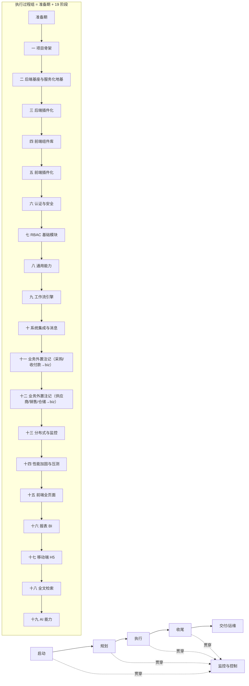
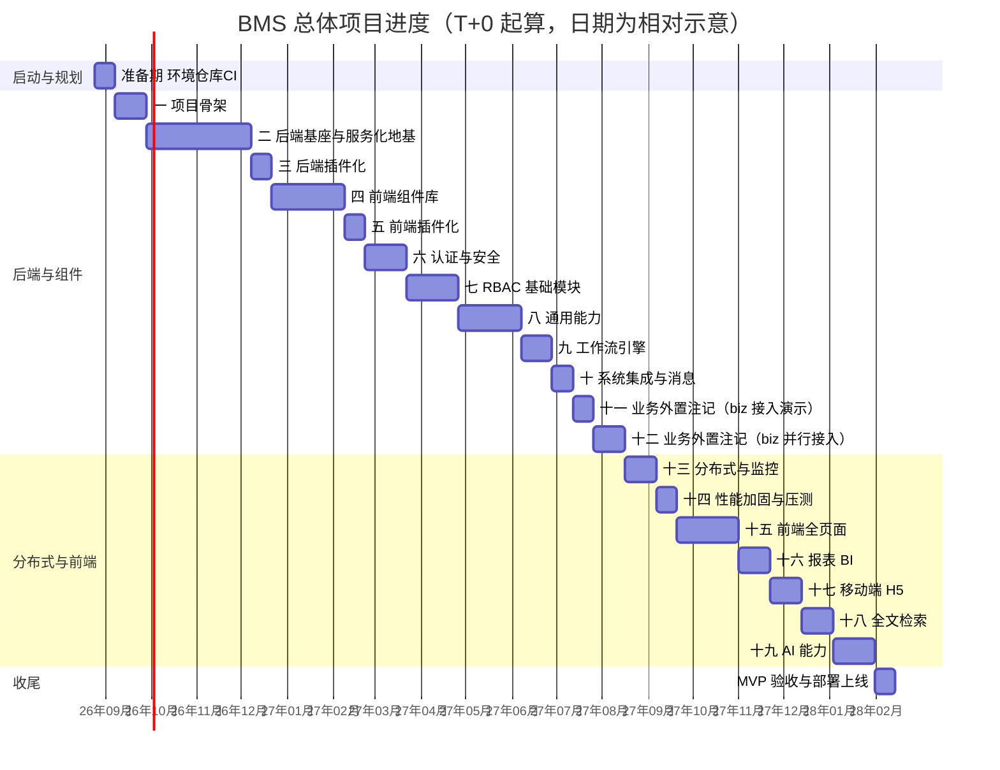

# 总体项目规划

> BMS 基础管理系统 · 从启动到收尾的总体规划（项目管理 + 工程排期）

[文档首页](../文档首页.md) › [规划](项目规划说明.md) › 总体项目规划　|　[同级：项目规划说明 →](项目规划说明.md)　[开发部署规划 →](开发部署规划.md)

## 1. 文档说明 

本文档是 BMS 项目的**总体项目规划**，回答三个问题：这个项目**怎么管**（目标/范围/组织/风险/质量/沟通）、**按什么顺序做**（阶段划分与 WBS）、**做到什么程度算完成**（里程碑与验收）。与既有文档分工互补：

| 文档 | 回答的问题 |
| --- | --- |
| 本文档《总体项目规划》 | 项目管理与实施排期（启动→执行→收尾） |
| 《[项目规划说明](项目规划说明.md)》 | 技术与方案（用什么做、模块/数据/权限怎么设计、19 阶段做什么）+ 目标与验收口径、AI 辅助开发治理、变更管理与度量、外部依赖与降级 |
| 《[开发部署规划](开发部署规划.md)》 | 开发环境（在哪做、两台机器怎么分工） |

依据与约束：

- 本规划「阶段内容与完成标准」（6.1 节）与「MVP 验收标准」（14.1 节）——发布分层 5.1、里程碑与工期第 7 节（验收与准出为 AND 关系）
- 《[开发部署规划](开发部署规划.md)》的环境批次与分阶段落地节奏
- 《[命名规范](../规范/命名规范.md)》与《[文档生成规范](../规范/文档生成规范.md)》的命名与格式约定
- 《[测试规范](../规范/测试规范.md)》的分层测试、覆盖率门禁、缺陷管理与准出标准
- 《[架构设计总纲](../设计/架构设计/01_架构设计_总览.md)》的总体架构与子系统划分

**取值说明**：

- **时间基准**：以开工日为 T+0，采用**相对工期**（周）表达，不写具体日历日期；甘特图中的日期仅为画图示意，真实开工日以项目启动令为准。
- **人力口径**：按**单人兼职全栈开发**估算；因兼职投入，实际日历耗时会长于全职人周口径，故工期以「周（兼职）」为单位。
- **工期性质**：各阶段工期为**建议估算基线**，可按实际进度滚动调整（见第 15 节）；调整走第 12 节变更管理。

## 2. 项目概述 

### 2.1 项目背景 

BMS 基础管理系统（简称 BMS），主要用作后端管理。支持分布式、集群部署；多租户 SaaS 架构（租户独立库）；支持 SSO 单点登录；内置报表 BI 与移动端 H5。

后端基于 FastAPI + SQLAlchemy，前端基于 Vue 3 + Vite（PC 管理端 + 移动端 H5 双工程）。项目当前**尚无源代码**，规划已定案，处于「启动→规划完成、即将进入执行」节点，本规划即从该节点起指导后续全部开发。

### 2.2 项目目标 

交付一个可商业交付的 BMS MVP：登录（含图形验证码）→ 主体链 RBAC 权限 → 各模块 CRUD → 日志与审计 → 文件管理全链路可用；业务产品经平台扩展接入演示业务闭环（biz 采购/收付款等，机制见《平台可扩展性规划》）、报表与大屏、移动端审批与免登、全文检索与 AI 辅助能力；多租户独立库隔离；监控、链路追踪、任务调度、备份归档可运维；最终达到 **500 并发 / P99 ≤ 1s** 的性能目标。

### 2.3 成功标准 

项目成功的判定以 MVP 验收为准，具体验收项见第 14 节，核心三条：

1. **功能可用**：MVP 验收清单逐项通过，功能用例通过率 ≥ 98%，P0/P1 缺陷清零。
2. **质量达标**：核心模块（认证/RBAC/工作流/审计）行覆盖 ≥ 80%、整体 ≥ 70%；安全专项用例集全部通过；MySQL/PostgreSQL/达梦 DM8 三库 CI 通过。
3. **可交付可运维**：压测达到 500 并发 / P99 ≤ 1s；Docker Compose 一键部署成功；部署手册、运维手册、测试报告等文档交付齐全。

## 3. 项目范围 

### 3.1 范围内（MVP） 

MVP 范围即《项目规划说明》「功能模块」节清单与第 20 节 19 个开发阶段，按交付性质归为八类：后端基座、后端插件化、前端组件库、前端插件化、平台基座（认证 / RBAC / 租户 / 国际化）、通用能力、集成与扩展、工程与体验。各阶段技术内容与验收标准以《项目规划说明》与《架构设计》对应节点为准；本文档只做排期、里程碑与交付物管理。

### 3.2 范围外 / 明确不采用 

- **范围外（预留）**：产品扩展（biz 的销售/仓储 `sale_`/`wh_`、cw 创作系统等随各自产品仓库排期，不纳入平台 MVP）；独立服务集成（单独立项）。
- **目标架构（新增）**：微服务——平台内部模块与产品（biz / cw）全服务化，从一开始就按分布式构建（逻辑多服务 + 物理单机多容器、每服务独立库）；目标架构、服务清单、服务化地基与演进路线见《[微服务演进规划](微服务演进规划.md)》。
- **明确不采用**（详见《项目规划说明》「明确不采用」节）：Kubernetes（MVP 用 Docker Compose，单机多容器触顶后迁 k3s）、Kafka（RocketMQ 已覆盖）、MFA/2FA、原生 WebSocket（统一 Socket.IO）、APNs/FCM 系统推送、前端 SSR/Nuxt。

### 3.3 范围变更控制 

MVP 范围一经确认即冻结；新增需求、模块或技术方案一律走第 12 节变更流程，评估对进度、质量、风险的影响并更新本规划与《项目规划说明》后方可执行，不擅自扩展。

## 4. 组织与职责 

本项目为**单人兼职全栈开发**，一人兼任全部角色。角色矩阵如下，按阶段切换工作侧重：

| 角色 | 职责 | 兼任说明 |
| --- | --- | --- |
| 项目负责人 | 目标/范围/计划制定、里程碑评审、风险与变更决策、需求/任务/计划文档维护 | 全程 |
| 后端开发 | backend 分层开发、Alembic 迁移、Celery/事件/工作流 | 阶段一~十四为主 |
| 前端开发 | frontend/apps/desktop / frontend/apps/mobile 双工程、组件与页面、E2E | 阶段四（前端组件库）起，阶段十五~十九为主，与后端穿插 |
| 测试 | 单元/接口/组件测试编写、CI 三库测试、缺陷复现 | 随各阶段，验收前集中 |
| 运维/部署 | mjbk 服务编排、监控告警、备份恢复、发布 | 阶段十三起 |
| 文档 | 规范/设计/手册/报告编写 | 随各阶段交付 |
| AI 助手（非责任主体） | 设计与文档初稿、编码与测试脚本、日志与指标分析、缺陷定位与修复补丁建议 | 全程；产出分三级——**可直出（抽查）** / **必须人工审核后生效** / **禁止单独决定**（范围、发布与回滚、数据处理、安全策略），且**不得自动合入**（见《[项目规划说明](项目规划说明.md)》「AI 辅助开发与交付治理」节） |

> 单人兼职意味着：任务以串行为主、多角色切换有切换成本、工期对个人可用时间高度敏感。因此进度基线取保守值，并以**里程碑门禁 + 阶段末复盘**替代多人协作的例会机制（见第 11、13 节）。

## 5. 项目生命周期与阶段划分 

采用标准项目管理五大过程组，**执行过程组**展开为《项目规划说明》的「准备期 + 19 个开发阶段」：

过程组与阶段对应关系：

| 过程组 | 内容 | 对应阶段/产物 |
| --- | --- | --- |
| 启动 | 立项、目标与范围确认、环境/仓库/文档化项目管理体系建立 | 准备期 |
| 规划 | 本规划、《项目规划说明》《开发部署规划》定稿 | 阶段一前（已交付） |
| 执行 | 19 个开发阶段按序交付 | 阶段一~十九 |
| 监控与控制 | CI 门禁、阶段末测试报告、里程碑评审、风险跟踪 | 贯穿全程 |
| 收尾 | MVP 验收、部署上线、文档归档、复盘 | 阶段十九后 |

### 5.1 发布分层（Alpha / Beta / GA） 

19 个阶段体量接近完整产品而非传统意义的"最小可行产品"，为控制交付风险、避免范围失控，引入行业通行的三级发布分层对阶段分组（仅标注交付节奏，不改变各阶段内容与完成标准）：

| 层级              | 覆盖阶段                           | 达成标志                                                                                                                                                                                                                                                  |
| ----------------- | ---------------------------------- | --------------------------------------------------------------------------------------------------------------------------------------------------------------------------------------------------------------------------------------------------------- |
| Alpha（内部可用） | 阶段一~十                          | 平台底座与前后端地基完整：**后端基座（地基波）可用**（core 基座 / 模块基类 / 异常体系 / 数据访问底座 / 多租户拓扑 / 模块注册）、**前端基础组件库（地基波）可用**，认证 / RBAC / 租户 / 通用能力 / 工作流 / 系统集成可运行，团队内部可登录操作 |
| Beta（功能完整）  | 阶段十一~十五（八/九为业务外置注记） | 平台能力闭环（事件/消息/监控/分片）、非功能加固（分片 / 监控 / 压测达标）、前端全页面完成，**此后冻结功能范围**                                                                                                                                     |
| GA（正式发布）    | 阶段十六~十九                      | 报表 BI、移动端 H5、全文检索、AI 能力齐备，通过文末 MVP 验收标准全量走查后定版                                                                                                                                                                            |

约束：Beta 起功能范围冻结，阶段十六~十九属既定增强能力，新增需求一律进演进路线；任一层级未达成不进入下一层级的演示 / UAT。

> 19 个阶段的**详细内容与完成标准**见 6.1 节；里程碑与工期见第 7 节；MVP 验收标准见 14.1 节。本文档做排期、里程碑与交付物管理。

## 6. 工作分解结构（WBS） 

WBS 分三层：**阶段 → 工作包 → 可交付成果**；下表给出**阶段 → 内容与完成标准**（可交付成果见第 8 节，发布分层见 5.1，验收见 14.1）：

### 6.1 阶段内容与完成标准 

| 阶段                            | 内容                                                                                                                                                                                                                                                                                                                                                                                                                                                                                                                                                                                                                                                                                                        | 完成标准                                                                                                                                                                                                                                                                                                |
| ------------------------------- | ----------------------------------------------------------------------------------------------------------------------------------------------------------------------------------------------------------------------------------------------------------------------------------------------------------------------------------------------------------------------------------------------------------------------------------------------------------------------------------------------------------------------------------------------------------------------------------------------------------------------------------------------------------------------------------------------------------- | ------------------------------------------------------------------------------------------------------------------------------------------------------------------------------------------------------------------------------------------------------------------------------------------------------- |
| 一 项目骨架                     | monorepo（含 frontend/apps/mobile）、配置管理、日志体系、健康检查、CI 流水线激活；前端契约/数据根与后端 core 基座首批（`BaseObject` 根基类 / 有序集合 / 并发集合 / Redis 封装 / `BaseRepository`·`BaseService`·`BaseSchema`）；**后端基座体系（骨架 + 接口占位）**——根系 根基类 / 集合体系 / 模块基类 / core 横切（`BizError` + 统一响应、配置 / 安全 / 日志结构）/ 跨阶段基座登记 / 机制底座接口占位（数据访问 / 多租户拓扑 / 模块注册），真实实现随阶段二                                                                                    | 本地起服务、/healthz /readyz 正常、CI 流水线激活通过；治理脚本`collect_metrics.py` / `review_stage.py` 可用（度量采集与阶段末复盘清单执行，见《项目规划说明》「变更管理与项目度量」节）；基座体系占位就位（依赖注入可解析、应用可启动、占位可断言），异常体系生效 |
| 二 后端基座与服务化地基 | **后端基座（真实实现）**——数据访问底座落地（引擎 / 会话工厂 / 四库方言 / 读写分离 / 连接池、`DbUnitOfWork` 事务、`BaseRepository` 异步化与 DB 实现）、Alembic 在线迁移与租户库初始化（`ops` 批量迁移幂等）、多租户数据拓扑落库与实测（平台库表 / 租户解析全局中间件 / 引擎注册表 LRU 与连接预算 / 租户隔离）、模块注册表落库（`sys_module` 表与种子 / 启动与 CI 接库唯一性校验）、`BaseModel` 落库（雪花 ID / 软删除 / 审计 / 乐观锁 / 四库类型映射）、排序契约 DB 侧（ORDER BY 白名单 / 四库 NULLS / 分页限深）、三库真库集成与达梦方言实测、CI 三库 job（`verify/db` 档）与阶段验收；工程约束：事件发布占位（`sys_outbox` 表与投递器接口，可靠性口径见知识档案《[微服务 · 05 通信与分布式一致性](../资料/知识档案/微服务/05_微服务_通信与分布式一致性.md)》）、分层依赖硬校验（自研 `ops/check_layers.py` 挂 CI）。**服务化地基（微服务）**——APISIX 网关（standalone → K8s 同模型）、DNS 寻址、服务目录与契约 / 版本登记、自研 Outbox + 幂等基座、OpenTelemetry + Tempo / Prometheus / Loki 可观测栈、OIDC IdP 与双类 JWT、父-子流水线多服务 CI/CD（不可变镜像 + 一键回滚）、每服务独立库 × 每租户的自动建库与批量迁移、平台层表归属定案与实现迁出共享基座库、多服务骨架重构（保留阶段一~五产出）；架构见《[微服务演进规划](../规划/微服务演进规划.md)》与《[架构设计 · 后端基础类体系](../设计/架构设计/04_架构设计_后端基础类体系.md)》 | 数据访问真实落库：三库拓扑可路由（MySQL/PostgreSQL/达梦 DM8）、租户隔离与批量迁移正确、模块注册接库校验生效（表前缀/错误码段/事件域冲突被拒）、`BaseModel` 落库与排序 DB 侧生效、基类异步切换完成、三库真库集成与达梦方言实测通过、阶段测试报告与 M2 门禁齐备；**服务化地基**：网关 / 发现 / 契约 / 一致性 / 可观测 / 多服务 CI-CD 就位、多服务本地一键拉起、每服务独立库迁移验证通过 |
| 三 后端插件化 | **后端插件化（能力可替换，纵向）**：中间层 `BasePluggable`、插件注册表（继承自动登记 + 显式注册双入口）、配置驱动装配与 `resolve_plugin`、契约测试覆盖全部实现。机制见《[架构设计 · 扩展点与插件化](../设计/架构设计/10_架构设计_子系统_扩展点与插件化.md)》 | 换实现只改配置生效；非法 provider / 重名 / 契约版本不符启动被拒；继承 / 组合双轨注册可用；契约测试覆盖全部注册实现 |
| 四 前端组件库                   | **前端基础组件库（地基波）**——基础类体系（契约/数据根已在阶段一落地不重复）、基础类、基础控件类、容器组件类、布局组件类（含侧边菜单）、展示类「异常与空状态」（随地基波先行）、前端扩展点与注册表基座与微前端骨架起步（宿主薄壳与模块契约；运行时加载随阶段五，构建期合并为过渡）；契约以《[组件设计](../设计/组件设计/01_组件设计_总览.md)》各节点与可交互原型为准，含组件单测；字段类/展示类/交互类等依赖后端能力的组件按对应阶段回补                                                                                                                                                              ；设计令牌与组件契约保持可被独立模块复用的形态、**微前端骨架起步**（宿主外壳薄壳与模块契约）。微前端机制见《[架构设计 · 前端架构](../设计/架构设计/08_架构设计_前端架构.md)》 | 基础类体系与地基波组件全部可用、组件单测通过、与可交互原型一致（原型即验收基准）；宿主外壳与模块契约就位（可加载演示模块验证）；组件不完成则前端页面开发无法推进                                                                                                                                                                                      |
| 五 前端插件化 | **前端插件化（扩展点与运行时组合）**：前端注册表（路由/菜单、通用组件、字段渲染器、图标、工作台卡片、主题）+ **Module Federation 运行时加载**（宿主/模块契约、模块清单与版本字段、shared 依赖 singleton 基础配置）+ 动态导入分包；**新业务页面按模块形态独立构建与发布**（首个业务页面即首个模块样例），平台自身页面在主应用内；构建期合并保留为过渡/存量形态。机制见《[架构设计 · 扩展点与插件化](../设计/架构设计/10_架构设计_子系统_扩展点与插件化.md)》与《[架构设计 · 前端架构](../设计/架构设计/08_架构设计_前端架构.md)》 | 宿主可运行时加载模块（演示模块验证：动态路由生效、产物独立构建、shared 依赖单实例）；注册表与模块清单运行时可用；首个业务页面按模块形态开发通过；插件页面动态导入、独立分包、不进首屏 |
| 六 认证与安全                   | 双 token、登录/刷新/登出、限流、图形验证码、会话管理、账号锁定/解锁管理、SSO（OIDC 客户端 + CAS 兼容、JIT 建号、BMS 兼作 IdP、企业微信/钉钉免登）、密码策略合规、数据脱敏。**前端接入**：前端按服务段寻址（请求层服务前缀映射）、登录页 / 路由守卫 / 401 刷新、能力源按服务分流、9 份契约的前端类型生成（`@bms/api-types`）。**建表衔接**：本阶段先行落地 `sys_user` 最小模型（账号状态/锁定/密码哈希等字段，锁定/解锁读写其中），供登录链路与 SSO JIT 建号使用；用户管理完整 CRUD 与组织归属归阶段七                                                                                                                                                                                                                                                                                                                                                 | 登录链路（本地 + SSO，均基于 sys_user 最小模型）E2E 通过、JIT 建号落库正确、前端登录与按服务寻址联通、策略强制生效                                                                                                                                                                                                                |
| 七 RBAC 基础模块                | 部门/岗位/用户/角色（在阶段六`sys_user` 最小模型之上补齐用户完整域：个人资料/头像 URL、组织归属）、主体链角色绑定、业务与动作权限、菜单/表单/按钮/字段挂接、字段权限、动作级数据范围、三权分立、平台超管与租户管理（含模块开通勾选与租户模块开关）、动态菜单接口                                                                                                                                                                                                                                                                                                                                                                                                                                          | 主体链任意长度权限计算正确、越权与跨租户访问被拒验证通过、数据范围读写检查生效、字段权限生效、配额超限拦截生效、三权互斥生效、租户模块开关生效（停用模块菜单/接口被拒、数据保留、重新开通恢复）                                                                                                         |
| 八 通用能力                     | 消息与任务基础设施（RocketMQ 事件总线 + Celery）、字典、系统参数、文件管理（分片上传/断点续传/预签名下载/在线预览）、Excel 导入导出、通知中心、公告管理、帮助中心、回收站、邮件与短信通知、操作/登录日志、字段级变更审计与哈希链、国际化管理、归档管理、首页工作台后端（卡片注册表/平台与角色模板/个人布局与一键重置接口）、表单定制后端（布局配置表与三级解析/字段属性/租户自建字段动态 DDL 与跨方言类型映射/服务端动态校验/查询区与明细区配置）；**组件回补**：06 字段类（字典/组织选择/文件上传/验证码等）、07 展示类（表格/筛选/通知/文件预览/审计差异等）随本阶段能力就绪补齐                                                                                                                    | 各模块 CRUD + 日志落库、审计链校验通过、归档流转可用、工作台模板与个人布局接口可用、表单三级布局解析与动态 DDL 加列/动态校验验证通过；对应回补组件可用                                                                                                                                                  |
| 九 工作流引擎                   | SpiffWorkflow 集成、bpmn-js 流程建模、会签/或签、条件分支可视化、流程版本管理；**组件回补**：08 交互类审批流展示/流程建模器（依赖本阶段能力）                                                                                                                                                                                                                                                                                                                                                                                                                                                                                                                                                         | 管理端可建流程并执行完整流转；审批类组件可用                                                                                                                                                                                                                                                            |
| 十 系统集成与消息               | 开放接口管理（OAuth2）、Webhook、事件总线事件模型；**独立服务接入最小骨架清单**（`sys_client` 注册要素 / 最小 scope 集合 / 必供项与兼容承诺，见《[平台可扩展性规划](平台可扩展性规划.md)》「独立服务形态口径」节）                                                                                                                                                                                                                                                                                                                                                                                                                                                                                                                           | 外部调用鉴权通过、事件推送成功；「独立服务接入最小骨架清单」随本阶段交付                                                                                                                                                                                                                                                                          |
| 十一 业务外置（采购/收付款）      | 原采购管理、收付款管理两个业务阶段随[《平台可扩展性规划》](平台可扩展性规划.md)迁至 **biz 企业运营管理**仓库开发；平台侧不再安排业务功能阶段，工作流/支付渠道等能力已在阶段九/十一落地                                                                                                                                                                                                                                                                                                                                                                                                                                                                                                                 | 平台工作流引擎经流程实例/待办链路验证通过（业务单据由 biz 出样演示）                                                                                                                                                                                                                                    |
| 十二 业务外置（供应商/销售/仓储） | 供应商/销售/仓储等业务随 biz 仓库排期接入（产品服务形态，见「平台扩展接入流程」节与《[微服务演进规划](微服务演进规划.md)》第 3 批），不在本平台阶段计划                                                                                                                                                                                                                                                                                                                                                                                                                                                                                                                                                                                                     | 见 biz《biz 企业运营管理规划》                                                                                                                                                                                                                                                                          |
| 十三 分布式与监控               | 真实分片规则落地、租户独立库路由与批量迁移演练、系统监控、缓存管理、备份管理、链路追踪、任务调度                                                                                                                                                                                                                                                                                                                                                                                                                                                                                                                                                                                                            | 分片查询正确、租户隔离正确、监控指标与追踪链路可见、缓存清理生效、备份任务与记录可查、任务页面可管理；治理脚本`check_release.py` / `drill_restore.py` / `check_inventory.py` 可用（发版检查、恢复演练、容量与许可检查，见《项目规划说明》「变更管理与项目度量」节）                                                                  |
| 十四 性能加固与压测             | 缓存三防落地、限流/降级/熔断、索引与慢查询走查、locust 压测                                                                                                                                                                                                                                                                                                                                                                                                                                                                                                                                                                                                                                                 | 压测达到 500 并发 / P99 ≤ 1s                                                                                                                                                                                                                                                                           |
| 十五 前端全页面                 | 主布局、首页工作台（卡片拖拽定制/自建图表卡片/一键重置，登录后默认页）、表单布局管理（vuedraggable 设计器：分区/分组/列数/跨列/顺序/标签宽度、查询表单区、明细区列配置、字段属性、租户自建字段）、全部管理页（含流程建模与审批页面、验证码登录、Socket.IO 客户端、分片上传组件）、i18n、个人中心、E2E 抽样                                                                                                                                                                                                                                                                                                                                                                                                  | 全链路可用（组件库阶段四已交付地基波，本阶段主要为页面组装与依赖类组件收口）                                                                                                                                                                                                                            |
| 十六 报表 BI                    | 数据集管理（SQL 建模、只读从库安全执行）、拖拽报表设计器（ECharts）、大屏设计器与轮播播放、工作台数据集图表卡挂接；**组件回补**：图表卡/报表设计器/大屏设计器与播放                                                                                                                                                                                                                                                                                                                                                                                                                                                                                                                                   | 报表与大屏全链路可用、工作台图表卡可挂数据集渲染；对应组件可用                                                                                                                                                                                                                                          |
| 十七 移动端 H5                  | frontend/apps/mobile 工程、审批中心（附件预览）、通知、公告查看、个人中心、数据查询、企业微信/钉钉免登                                                                                                                                                                                                                                                                                                                                                                                                                                                                                                                                                                                                           | 移动端审批、附件预览与免登 E2E 通过                                                                                                                                                                                                                                                                     |
| 十八 全文检索                   | ElasticSearch 接入、RocketMQ 事件异步同步、索引规划与重建、文件内容解析、全局搜索页面、检索权限与租户隔离；**组件回补**：全局搜索                                                                                                                                                                                                                                                                                                                                                                                                                                                                                                                                                                     | 检索命中与高亮正确、权限与租户过滤验证通过、索引重建可用、降级兜底生效；全局搜索组件可用                                                                                                                                                                                                                |
| 十九 AI 能力                    | LLM 适配层；智能报表助手（NL2SQL）；智能审批辅助；AI 内容生成；语义搜索与文件问答（Milvus）；OCR 与文件自动分类；审计异常检测；知识库问答机器人；帮助文档智能维护；AI 自动执行写操作与 AI 自动审批（开关默认关闭）；**组件回补**：AI 助手                                                                                                                                                                                                                                                                                                                                                                                                                                                             | NL2SQL 安全执行验证通过；默认仅辅助、两开关关闭时无自动写操作验证通过；开关开启场景白名单/二次确认/审计/撤销验证通过；审批开关依赖校验验证通过；检索/问答租户隔离验证通过；AI 交互全量落审计日志；异常检测告警可达；模型配置页面可管理；帮助文档 AI 生成草稿与人工审核发布链路验证通过；AI 助手组件可用 |
| 产品服务（预留）                | 按「平台扩展接入流程」节以**产品服务（独立服务）**形态接入 biz（采购/收付款/供应商/销售/仓储）、cw（创作系统）等产品；异构外部系统按外部独立服务集成；启动时间随产品仓库排期，不纳入平台 MVP 排期                                                                                                                                                                                                                                                                                                                                                                                                                                                                                                                                                        | 见对应产品规划，随服务交付                                                                                                                                                                                                                                                                              |

## 7. 进度计划 

### 7.1 里程碑 

以「阶段完成标准」为里程碑门禁，未达标不进入下一阶段。累计工期为**相对工期（周，兼职）**，估算基线，可滚动调整：

| 里程碑 | 对应阶段 | 达成标志（验收要点） | 建议累计工期 |
| --- | --- | --- | --- |
| M0 启动就绪 | 准备期 | 环境/仓库/CI 就绪，可进入骨架开发 | 2 周 |
| M1 骨架 + 基座体系（占位口径）可用 | 一 | 本地起服务、/healthz /readyz 正常、CI 流水线激活通过；基座体系接口占位就位（依赖注入可解析、应用可启动、占位可断言）、异常体系生效 | 5 周 |
| M2 后端基座与服务化地基可用 | 二 | 数据访问真实落库：三库拓扑可路由、租户隔离与批量迁移正确、模块注册接库校验生效、`BaseModel` 落库与排序 DB 侧生效、基类异步切换完成、三库真库集成与达梦方言实测通过；服务化地基：网关 / 发现 / 契约 / 一致性 / 可观测 / 多服务 CI-CD 就位、多服务本地一键拉起、平台层表归属定案与每服务独立库迁移验证通过 | 15 周 |
| M3 后端插件化可用 | 三 | `BasePluggable` 与插件注册表可用；配置切换 provider 生效且业务代码零改动；非法 provider / 重名 / 契约版本不符启动被拒；继承与组合双轨注册可用；契约测试覆盖全部注册实现 | 17 周 |
| M4 组件库可用 | 四 | 前端基类体系（开放式）与地基波组件（布局（含侧边菜单）/容器/基础控件/基础类/异常与空状态）全部可用、组件单测通过、与可交互原型一致；微前端骨架起步（宿主薄壳与模块契约） | 24 周 |
| M5 前端插件化可用 | 五 | 八类扩展点注册表与模块清单可用；宿主运行时加载模块（动态路由生效、产物独立构建、shared 依赖单实例）；新业务页面按模块形态独立发布（首个页面为样例） | 26 周 |
| M6 认证安全可用 | 六 | 本地 + SSO 登录链路 E2E 通过、密码策略强制生效 | 30 周 |
| M7 权限体系可用 | 七 | 主体链权限计算正确、越权与跨租户被拒、数据范围/字段权限/三权/租户模块开关生效 | 35 周 |
| M8 通用能力可用 | 八 | 各模块 CRUD + 日志落库、审计链/归档/工作台/表单定制后端可用 | 41 周 |
| M9 工作流可用 | 九 | 管理端可建流程并执行完整流转 | 44 周 |
| M10 集成消息可用 | 十 | 开放接口鉴权通过、事件推送成功 | 46 周 |
| M11 业务外置与扩展机制演示 | 十一/十二 | 平台侧按「平台扩展接入流程」完成样例**产品服务**接入演示（服务接入 + 单据→审批→待办→事件全链路）；biz 业务随之在 biz 仓库并行开发 | 51 周 |
| M12 分布式监控可用 | 十三 | 分片查询正确、租户隔离、监控与追踪可见、缓存/备份/任务可用 | 54 周 |
| M13 性能达标 | 十四 | 500 并发 / P99 ≤ 1s | 56 周 |
| M14 前端全页面 | 十五 | 前端全链路可用 | 62 周 |
| M15 报表 BI | 十六 | 报表与大屏全链路、工作台图表卡可挂数据集渲染 | 65 周 |
| M16 移动端 H5 | 十七 | 移动端审批、附件预览与免登 E2E 通过 | 68 周 |
| M17 全文检索 | 十八 | 检索命中与高亮、权限租户过滤、索引重建、降级兜底 | 71 周 |
| M18 AI 能力 | 十九 | NL2SQL 安全执行、默认仅辅助、租户隔离、审计落库、帮助 AI 草稿发布 | 75 周 |
| M19 MVP 验收 | 十九结束 | 准出标准全部满足，Docker Compose 一键部署成功 | 75 周 |

> 阶段十九后另需约 2 周收尾活动（验收报告、部署上线、复盘归档），项目总工期约 77 周（兼职，约 18 个月），见第 15 节。
>
> **里程碑分层映射**（见 5.1 节发布分层）：Alpha 内部可用 = M0~M10（阶段一~十）；Beta 功能完整 = M11~M14（阶段十一~十五；十一/十二为业务外置注记，**此后冻结功能范围**）；GA 正式发布 = M15~M19 + 收尾（阶段十六~十九）。任一层级未达成不进入下一层级的演示 / UAT。

### 7.2 甘特图 

按串行保守基线绘制（单人兼职以串行为主；前端、移动端、全文检索、AI 等阶段在前置能力就绪后可部分并行，届时以里程碑门禁为准调整）：

## 8. 交付物清单 

### 8.1 代码交付物 

按阶段交付可运行的代码与配置，CI 通过为准入：backend / frontend/apps/desktop / frontend/apps/mobile 三工程、迁移与种子数据、`deploy/` 编排与 nginx 配置、`.gitlab-ci.yml`、各阶段测试（pytest / Vitest / Playwright）与治理脚本（清单见《[架构设计 · 测试与质量](../设计/架构设计/32_架构设计_测试与质量.md)》）。后端基座、后端插件化、前端组件库、前端插件化各阶段的交付内容与技术契约分别以《[架构设计 · 后端基础类体系](../设计/架构设计/04_架构设计_后端基础类体系.md)》《[架构设计 · 扩展点与插件化](../设计/架构设计/10_架构设计_子系统_扩展点与插件化.md)》《[组件设计](../设计/组件设计/01_组件设计_总览.md)》《[架构设计 · 前端组件体系](../设计/架构设计/05_架构设计_前端组件体系.md)》为准。

### 8.2 文档交付物 

对齐《项目规划说明》「文档计划」节：

| 文档 | 产出阶段 | 说明 |
| --- | --- | --- |
| 总体项目规划（本文档） | 阶段一前 | 项目管理与实施排期 |
| 开发部署规划 | 阶段一前（已交付） | 开发环境两台机器分工 |
| 后端开发规范 / 前端开发规范 | 阶段一 | 基座体系（后端：根系 + 集合 + 模块基类 + core 横切；前端：开放式基类体系）、分层职责、代码约定、测试写法 |
| 组件设计 | 阶段四前（设计与原型已交付） | 通用组件契约与可交互原型，是阶段四组件实施与页面开发的前置依据 |
| README | 阶段一起持续更新 | 项目简介、快速启动、目录导航 |
| 接口契约快照 | 阶段六起随版本维护 | CI 导出 swagger.json 存档 |
| 测试报告 | 阶段一起每阶段末 | 用例执行、缺陷、覆盖率、风险与遗留项；CI 数据脚本汇总 + AI 初稿，人工补充结论 |
| 部署手册 / 运维手册 | 阶段十三 | Compose/环境变量/备份演练、监控告警/日志/排障 |
| 压测报告 | 阶段十四 | 场景、结果与优化记录 |
| 用户操作手册 / 系统管理员手册 | Beta 起、GA 前定稿 | 最终用户与管理员指南；AI 依功能代码、表单元数据与帮助中心内容生成初稿，人工审核定稿 |
| 培训材料 | 按需（合同要求时） | 图文/视频脚本，AI 辅助生成；自用场景不出 |

> 设计文档（架构设计、概要设计、布局/组件/原型设计）随对应阶段在《文档生成规范》设计体系下产出，其中概要设计逐模块随阶段交付，见《[概要设计总纲](../设计/概要设计/01_概要设计_总览.md)》《[组件设计总纲](../设计/组件设计/01_组件设计_总览.md)》。

## 9. 质量管理 

> 分层测试、AI 辅助用例、覆盖率门禁、用例管理（Kiwi TCMS）、缺陷管理、镜像扫描与准出标准以《[架构设计 · 测试与质量](../设计/架构设计/32_架构设计_测试与质量.md)》与《[测试规范](../规范/测试规范.md)》为准；本文档不复制质量技术细节。项目层面保留一条口径：准出标准与《总体项目规划》「阶段内容与完成标准」节的 MVP 功能走查清单为 **AND 关系**——准出是质量门槛，功能走查是能力覆盖，两者同时满足方可验收。

## 10. 风险管理 

风险登记册（按发生概率 × 影响排序，阶段内滚动更新）：

| 风险 | 影响 | 应对 |
| --- | --- | --- |
| Python 3.14 与核心依赖/dameng/SpiffWorkflow 兼容性未知 | 骨架阶段阻塞 | 阶段一逐依赖验证，任一核心依赖不兼容整体回退 Python 3.13（既定口径） |
| 单人兼职投入不稳，工期易延 | 里程碑延期 | 串行保守基线 + 里程碑门禁 + 阶段末复盘，必要时收缩/顺延非核心功能（走变更） |
| 阶段二（后端基座真实实现）、阶段四（前端组件库）、阶段八（通用能力）、阶段十五（前端全页面）工作量最大 | 进度瓶颈 | 拆子任务分批交付，优先核心链路（后端基座真实实现→前端组件库→认证→权限→工作流→扩展接入演示）；后端基座不落库后端模块无法按统一口径实现，组件库地基波不完成则前端页面开发无法推进，两块地基均置于前面并优先保障 |
| 500 并发 / P99 ≤ 1s 不达标 | 验收失败 | 阶段十三/十二提前预留，缓存三防、索引、连接池规划前置，压测发现问题即调优 |
| 开发服务器外网依赖（GitHub 归档） | 同步中断 | 2026-08-22 复核可用（push mirror 一直正常、api.github.com 通）；GitHub release 类下载走 ghfast.top 镜像代理；异常时暂缓不影响内网主链路 |
| 第三方许可合规（AGPL/GPL/达梦/ES） | 商业交付风险 | 独立部署、不改第三方源码、交付附 SBOM + NOTICE |
| 密钥/凭据泄露 | 数据安全 | 密钥只走环境变量、deploy/.env 与本地资源 gitignore、不入库不入镜像 |
| mjbk 单点承载 GitLab CI + 常驻三库 + Kiwi TCMS + 依赖服务 | 开发全链路中断 | 每日备份 + 云容灾异机存放、环境脚本化可重建、Timeshift 系统快照；故障期本地继续开发，恢复后补推补跑（见《[开发部署规划](开发部署规划.md)》第 8、11 节） |
| 单人知识/状态中断 | 恢复成本高 | 文档完备、CI 与 Issue 留痕 |

> 本节管**项目管理层面**风险；技术实现类风险（达梦方言、动态 DDL 安全、依赖停维等）另见《[项目规划说明](项目规划说明.md)》「风险管理」节风险登记册（含单机性能达标、外部 LLM 成本、AI 两开关误用、开发基础设施单点、数据迁移、合规不确定等技术类条目），两册互补、阶段末复盘时一并走查。

## 11. 沟通与协作管理 

单人项目以**留痕化**替代例会沟通，保证中断可恢复、决策可追溯：

- 提交信息遵循 `type(scope): 中文描述`，分支 `类型/描述`（见《[Git协作规范](../规范/Git协作规范.md)》）。
- 代码缺陷以 GitLab Issue 为唯一记录，MR 关联 Issue；关键决策记录于规划/设计文档。
- 需求/任务/计划在**文档体系**（需求/任务/计划三类项目文档，见《[项目管理规范](../规范/项目管理规范.md)》）登记管理：阶段任务对应里程碑（M0~M19）文档化编排，进度以文档状态/日期为准，任务与 GitLab Issue 以引用互指；平台工具待项目扩大后按需引入。
- 阶段末输出测试报告与复盘小节，作为进度与问题的正式沟通产物。

## 12. 配置与变更管理 

- **分支模型**：`main` 保护分支，`feature/xxx` 开发，MR 合入需 CI 通过；单人开发口径——核心模块（认证/RBAC/工作流/审计）改动提交前经 AI 交叉评审、MR 描述附评审结论，多人协作时再启用强制人工批准。
- **版本管理**：里程碑 tag 语义化版本（`v1.0.0`），镜像 `bms-组件:版本`；发布检查单、Schema 向后兼容与应用回滚规则见《[项目规划说明](项目规划说明.md)》「版本与发布管理」节。
- **依赖升级**：人工按需、分批、可回滚（2026-09 起停用自动升级 bot），安全更新优先。
- **变更流程**：新需求/范围/技术方案变更 → 先在需求/任务文档登记 → 评估对范围、进度、风险影响 → 更新本规划与《项目规划说明》→ 确认后执行；未走流程不得自行扩展范围（四类变更——需求 / Schema / 依赖 / 文档基线——的具体口径见《项目规划说明》「变更管理与项目度量」节）。
- **配置基线**：config.toml + 环境变量覆盖，三套环境 dev / test / prod 由 `BMS_ENV` 区分。

## 13. 监控与报告 

- **CI 门禁**（分层，2026-08-23 起单人期口径）：纯文档推送免 CI；含代码改动的 main 直推自动跑冒烟层（gate-smoke + ruff + pytest + ESLint + Vitest + 双端构建，随代码目录落地激活）；重验证层仅 main 运行（E2E + 三库集成测试 + 镜像构建 + 镜像扫描 + 契约快照 + Allure 报告导入 Kiwi TCMS）。MR 流水线门禁随 MR 流程一并暂缓至多人协作期。
- **阶段报告**：每阶段末由脚本采集度量 + 执行 AI 汇总初稿 + **第二个 AI 交叉审核**（口径见《[项目规划说明](项目规划说明.md)》「治理机制的落地方式」节），**人只处理异常项**并据此决定里程碑是否放行——不为报告本身安排人工时间。
- **运行监控**：阶段十三起 Prometheus + Loki + Grafana + Alertmanager + Jaeger 全程可见，作为性能与稳定性证据；可用性目标 99.9% 与核心链路 SLO 作为告警阈值锚点（严重/警告两级，定义见《[项目规划说明](项目规划说明.md)》「可用性目标与 SLO」小节）。开发期度量**只保留三项且全部脚本采集**（工期偏差、缺陷收敛、覆盖率），用例通过率与 CI 健康已由准出与 CI 门禁承担、容量水位在告警阈值触发时才处理；执行方式（脚本 + AI 执行 + 第二 AI 审核 + 人看异常）见《[项目规划说明](项目规划说明.md)》「项目度量与报告」与「治理机制的落地方式」。

## 14. 验收与收尾 

### 14.1 MVP 验收标准 

MVP 验收逐域走查，用例来源于 Kiwi TCMS 并与验收项双向追溯；与 14.2 准出标准为 **AND 关系**（非功能门槛以 14.2 为准）：

| 域             | 验收点                                                                                                                                                                                                               | 关联阶段    |
| -------------- | -------------------------------------------------------------------------------------------------------------------------------------------------------------------------------------------------------------------- | ----------- |
| 后端基座与服务化地基 | core 基座与模块基类可用（`BizError` 统一异常与统一响应生效、`BaseModel` 落库、基类异步切换完成）；三库拓扑可路由、租户隔离与批量迁移正确、模块注册校验生效；跨阶段基座登记齐备；服务化地基就位（网关 / 发现 / 契约 / 一致性 / 可观测 / 多服务 CI-CD、多服务一键拉起、每服务独立库迁移） | 二          |
| 后端插件化 | 配置切换 provider 生效且业务代码不改；非法 provider / 重名 / 契约版本不符启动被拒；继承 / 组合双轨注册可用；全部注册实现契约测试通过 | 三 |
| 前端组件库     | 前端基类体系（开放式）与地基波组件（布局（含侧边菜单）/ 容器 / 基础控件 / 基础类 / 异常与空状态）可用；组件契约与《组件设计》节点及可交互原型一致；组件单测通过、覆盖率达标                                                                         | 三          |
| 前端插件化 | 前端扩展点注册生效；宿主运行时加载模块（独立构建产物、动态路由、shared 依赖单实例）；新业务页面按模块形态独立发布；插件页面动态导入、独立分包、不进首屏 | 五 |
| 认证与会话     | 登录（含图形验证码）可用；SSO 登录与 JIT 建号可用、BMS 作 IdP 通过；会话强制踢出即时生效；账号锁定与手动解锁可用                                                                                                     | 四 / 五     |
| 权限           | 主体链 RBAC 计算正确、越权与跨租户访问被拒；字段权限与动作级数据范围生效；三权分立生效                                                                                                                               | 五          |
| 租户           | 多租户独立库隔离验证通过；租户配额超限拦截生效；租户模块开关生效（停用入口禁用、数据保留）                                                                                                                           | 二 / 五     |
| 通用能力       | 各模块 CRUD 与操作/登录日志可用；文件管理全链路（分片上传 / 断点续传 / 预签名下载 / 在线预览）；Excel 导入导出；通知批量已读；公告发布与已读统计；帮助中心；回收站可用且审计留痕；用户喜好跨端同步；短信发送记录可查 | 六          |
| 首页与表单     | 首页工作台可用（内置卡片展示、个人布局定制、角色模板与平台默认模板、一键重置）；表单定制可用（三级布局解析与权限叠加、字段属性动态校验、租户自建字段动态 DDL 加列、查询区与明细区配置、导入导出联动）                | 六 / 十三   |
| 工作流         | 流程定义 / 实例 / 待办流转验证通过；审批事件经 Webhook / 消息总线推送成功                                                                                                                                            | 七 / 八     |
| 系统集成       | 外部系统经 OAuth2 Client Credentials 调用开放接口鉴权通过；Webhook 订阅与重试记录可用                                                                                                                                | 八          |
| 数据与分片     | 真实分片规则查询正确；租户库批量迁移演练通过                                                                                                                                                                         | 十一        |
| 监控与运维     | 系统监控与链路追踪可见；缓存管理可用；任务调度可管理；备份任务与记录可查、恢复演练登记可用                                                                                                                           | 十一        |
| 审计与归档     | 审计合规可用（字段级审计、哈希链校验、三权分立、密码策略）；归档管理可用（含审计链跨归档校验）                                                                                                                       | 六 / 十一   |
| 国际化         | 语言与语言包扩展可用，界面按 locale 切换正确                                                                                                                                                                         | 六          |
| 报表与移动端   | 报表与大屏可用；移动端审批、附件预览与免登可用                                                                                                                                                                       | 十四 / 十五 |
| 全文检索       | 检索命中与高亮正确、权限与租户过滤生效、索引重建可用、降级兜底生效                                                                                                                                                   | 十六        |
| AI 能力        | 八项能力主链路可用；两开关默认关闭时无自动写操作；开关开启的二次确认 / 审计 / 撤销生效；AI 交互全量落审计                                                                                                            | 十七        |
| 部署           | Docker Compose 一键部署成功（平台 + 依赖服务全量拉起）                                                                                                                                                               | 一 / 十一   |

> 初版 MVP 验收清单遗漏了阶段十八（检索）与阶段十九（AI），已补齐；并新增**后端基座**域（阶段一交付骨架与接口占位、阶段二落地真实实现，后端全部模块的前置基础）与**前端组件库**域（阶段四地基波，前端页面开发的前置基础）。GA 定版前按上表全量走查（见《[架构设计 · 部署与运维](../设计/架构设计/33_架构设计_部署与运维.md)》「GA 正式上线计划」节）。

各阶段完成标准含模块测试交付：模块接口测试（pytest + httpx）通过、关键链路 E2E 抽样通过、覆盖率达标（核心 ≥ 80%、整体 ≥ 70%，CI 门禁），用例登记 Kiwi TCMS 并随执行结果导入归档；不设独立测试阶段，MVP 验收前集中全量回归、安全专项、压测、UAT 与探索性测试（详见《[架构设计 · 测试与质量](../设计/架构设计/32_架构设计_测试与质量.md)》与《[测试规范](../规范/测试规范.md)》）。

### 14.2 准出标准 

见第 9 节「准出标准」，与《项目规划说明》「进入与准出标准」节一致。

### 14.3 收尾活动 

1. 全量回归 + 安全专项 + 压测 + UAT（E2E 全量回归先行、按验收清单抽检）+ 探索性测试通过。
2. Docker Compose 一键部署验证（dev/test/prod 三环境）。
3. 部署手册、运维手册、测试报告、README 定稿交付。
4. 归档镜像同步 GitHub、版本 tag、依赖 SBOM + NOTICE。
5. 遗留项列入「演进路线」节（**不设复盘会**——一次性仪式不列为机制，见《[项目规划说明](项目规划说明.md)》「治理机制的落地方式」节 砍除原则）。

## 15. 阶段工期估算基线 

工期为**建议估算基线（周，兼职）**，依赖为串行前提下的前置关系；可按实际滚动调整并记录调整原因：

| 阶段 | 建议工期（周） | 前置依赖 | 关键交付物 | 累计工期 |
| --- | --- | --- | --- | --- |
| 准备期 | 2 | 无 | 环境、仓库、CI、Kiwi TCMS | 2 |
| 一 项目骨架 | 3 | 准备期 | monorepo、配置/日志/健康检查、CI 流水线激活、core 基座首批、基座体系占位（异常 / 模块基类 / 机制底座接口） | 5 |
| 二 后端基座与服务化地基 | 10 | 一 | 数据访问真实实现、Alembic 迁移与租户库初始化、多租户拓扑落库、模块注册与 BaseModel 落库、三库真库实测、**平台层表归属定案与实现迁出**、**服务化地基（网关 / 发现 / 契约 / 一致性 / 可观测 / 多服务 CI-CD / 每服务独立库）**、阶段验收 | 15 |
| 三 后端插件化 | 2 | 二 | `BasePluggable` 与插件注册表、配置驱动装配、启动校验与契约测试、插件清单接口 | 17 |
| 四 前端组件库 | 7 | 三 | 基础类 开放式基类体系、布局（含侧边菜单）/容器/基础控件/基础类组件、异常与空状态、组件单测、微前端骨架起步 | 24 |
| 五 前端插件化 | 2 | 四 | 扩展点注册表、动态导入分包与模块清单、Module Federation 运行时加载与首个模块样例 | 26 |
| 六 认证与安全 | 4 | 五 | 双 token、登录链路、SSO、密码策略、脱敏 | 30 |
| 七 RBAC 基础模块 | 5 | 六 | 主体链权限、权限码、动态菜单、三权、租户管理 | 35 |
| 八 通用能力 | 6 | 七 | 字典/文件/通知/日志/审计链/归档/工作台/表单定制后端 + 字段/展示类组件回补 | 41 |
| 九 工作流引擎 | 3 | 八 | SpiffWorkflow + bpmn-js 全流程 + 审批类组件回补 | 44 |
| 十 系统集成与消息 | 2 | 九 | 开放接口、Webhook、事件模型 | 46 |
| 十一 业务外置注记（biz 接入演示） | 2 | 九/十 | 扩展机制出样演示、biz 并行接入 | 44 |
| 十二 业务外置注记（biz 并行接入） | 3 | 十一 | biz 业务并行开发（供应商/销售/仓储） | 47 |
| 十三 分布式与监控 | 3 | 八/十二 | 分片、租户路由、监控追踪、缓存/备份/任务 | 50 |
| 十四 性能加固与压测 | 2 | 十三 | 缓存三防、限流降级、压测报告 | 52 |
| 十五 前端全页面 | 6 | 一~十二 | 主布局、工作台、表单设计器、全部管理页（组件库阶段四已交付地基波） | 58 |
| 十六 报表 BI | 3 | 十五 | 数据集、报表设计器、大屏、图表卡 + 报表类组件回补 | 61 |
| 十七 移动端 H5 | 3 | 十五 | 审批/通知/公告/个人中心/免登 | 64 |
| 十八 全文检索 | 3 | 八/十五 | ES 同步、索引重建、全局搜索、文件解析 + 全局搜索组件回补 | 67 |
| 十九 AI 能力 | 4 | 八/十五/十八 | LLM 适配、NL2SQL、语义搜索、帮助 AI + AI 助手组件回补 | 71 |
| MVP 验收与收尾 | 2 | 十九 | 验收报告、部署上线、复盘 | 73 |

> **阶段二并入服务化地基（工期已二次重估）**：阶段二由原基线 4 周**重估为 8 周**，再因域六新增前置专项「平台层表归属与按服务拆分」（40h，平台库共享问题定案）**重估为 10 周**（累计 15 周），后续阶段累计工期相应顺延；排期见《[后端基座与服务化地基计划](../项目/02_后端基座与服务化地基/计划/01_计划_后端基座与服务化地基.md)》。

> 累计工期约 77 周（兼职，约 18 个月）；若投入强度提高、或前端/移动端/检索/AI 阶段与后端并行推进，可显著缩短，届时以第 7.2 节甘特图按里程碑门禁滚动调整。

> 本文档依《文档生成规范》编写 · 关键决策已逐项确认
