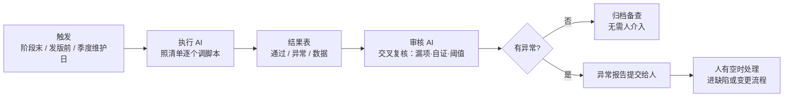

# 项目规划说明

> BMS 基础管理系统 · 技术栈 / 模块 / 数据 / 权限 / 计划

[文档首页](../文档首页.md) › 规划 › 项目规划说明　|　[同级：开发部署规划 →](开发部署规划.md)

## 1. 项目概述 <a id="overview"></a>

### 1.1 文档说明 <a id="overview-doc"></a>

本文档是 BMS 平台的**规划主文件**：定技术栈与选型、功能模块与数据、权限与接口、非功能设计、测试与验收、部署运维、开发计划与扩展接入，是架构设计与概要设计的上游依据。

| 项 | 说明 |
| --- | --- |
| 读者 | 项目负责人与开发实施者、AI 助手（按本文建立上下文）、评审与交付方 |
| 配套文档 | 《[总体项目规划](总体项目规划.md)》（阶段工期、里程碑与甘特、交付物、质量与风险管理）、《[开发部署规划](开发部署规划.md)》（环境、机器、磁盘与端口、CI 基础设施）、《[平台可扩展性规划](平台可扩展性规划.md)》（三层模型与产品接入）、《[架构设计 · 总览](../设计/架构设计/01_架构设计_总览.md)》（机制细节） |
| 分工 | 本文定**口径与结论**（做什么、做到什么程度、受什么约束）；机制细节（怎么做）一律下沉到架构设计节点，本文只给链接不复制 |
| 维护 | 结论变更经确认后回写本文，并同步受影响的下游文档；`bms文档/项目/` 下任务与需求文档按节号引用本文，节号调整须一并复核（见 2 节编号说明） |

### 1.2 项目定位 <a id="overview-position"></a>

基础管理系统，主要用作后端管理，简称 BMS。支持分布式、集群部署；多租户 SaaS 架构（租户独立库），支持 SSO 单点登录，内置报表 BI 与移动端 H5。

后端基于 FastAPI + SQLAlchemy，前端基于 Vue 3 + Vite（PC 管理端 + 移动端 H5 双工程），通过知识图谱（graphify）辅助代码理解与架构分析。

### 1.3 项目目标与成功标准 <a id="overview-goal"></a>

| 编号 | 目标 | 成功标准（可衡量） |
| --- | --- | --- |
| G1 平台化底座 | 通用能力完备，产品仓库不必自建 | 认证 / RBAC / 租户 / 文件 / 通知 / 审计 / i18n / 任务调度 / 事件总线 / 工作流 / 报表 / 检索十二类能力齐备并经验证项走通 |
| G2 多租户隔离 | 一租户一库，数据与权限边界可信 | 跨租户越权访问被拒验证通过；平台库 + N 租户库批量迁移可用；租户配额超限拦截生效 |
| G3 业务可插拔 | 业务不入平台 | biz / cw 等产品按「平台扩展接入流程」节接入，平台侧不改代码；表前缀 / 错误码段 / 事件域注册唯一性校验生效 |
| G4 非功能达标 | 性能、安全、三库兼容 | 压测 500 并发 / P99 ≤ 1s；MySQL / PostgreSQL / 达梦 DM8 三库 CI 通过；安全专项用例集全部通过（准出标准见 16.4） |
| G5 可运维可演进 | 单人可维护、可恢复 | Compose 一键部署成功；监控告警与备份恢复演练可用；文档体系 + 知识图谱 + AI 辅助运维支撑 bus factor = 1 |

### 1.4 范围边界与变更控制 <a id="overview-scope"></a>

- **范围内（平台）**：第 5 节通用能力清单 + 平台机制（认证、权限、租户、审计、事件、任务、国际化、归档、备份、监控）+ 对外开放能力（`/api/open`、Webhook、事件总线、OIDC Provider）。
- **范围外（产品仓库）**：采购 / 收付款 / 供应商 / 销售 / 仓储（biz）、小说多媒体创作（cw）等**业务功能一律不在平台实现**；平台只提供通用能力与接入流程（见「平台扩展接入流程」节）。技术层面不做项见「明确不采用」节。
- **变更控制**：Beta 起功能范围冻结（见「开发计划与验收标准」节），新增需求进「演进路线」节或按「变更管理与项目度量」节的三类触发留痕；平台对产品的兼容性承诺见 23.9；需求 / 任务 / 计划的变更口径见《[项目管理规范](../规范/项目管理规范.md)》。

## 2. 技术栈 <a id="stack"></a>

> 技术栈选型全景（后端核心 / 前端 / 工程化与质量 / 部署与运维四张清单）见[《架构设计 · 总体架构》](../设计/架构设计/03_架构设计_总体架构.md)第 6 节，本规划不再复制表格与细节；选型理由见第 3 节，许可与预算见 2.1 / 2.2 节。
>
> **编号说明**：技术栈四张清单（原 2.1~2.4：后端核心 / 前端 / 工程化与质量 / 部署与运维）已迁至《架构设计 · 总体架构》「技术栈全景」节，本节只保留**许可协议（2.1）**与**项目预算（2.2）**，原 2.5 / 2.6 顺延前移；`bms文档/项目/` 下任务与需求文档对旧 2.x 的引用已同步更正为「第 2 节」或对应选型小节（3.1~3.4）。

### 2.1 开源与许可协议 <a id="stack-license"></a>

除注明外均为 OSI 认证开源许可；"source-available"指开放源码但不符 OSI 开源定义。本系统仅将各组件作为独立服务或依赖使用、不修改其源码，相关传染性条款（AGPL/GPL/LGPL/ELv2/SSPL）对本系统不产生约束。

#### 后端核心

| 技术选型 | 是否开源 | 许可协议 | 备注 |
| --- | --- | --- | --- |
| Python 3.14+ | 是 | PSF-2.0 | Python 软件基金会许可 |
| FastAPI | 是 | MIT |  |
| uvicorn | 是 | BSD-3-Clause |  |
| Pydantic v2 | 是 | MIT |  |
| SQLAlchemy 2.0+ | 是 | MIT |  |
| Alembic | 是 | MIT |  |
| SQLite / aiosqlite | 是 | 公有领域（SQLite）/ MIT（aiosqlite） |  |
| MySQL 8.x | 是（社区版） | GPL-2.0（社区版） | Oracle 双许可，商用需购买商业版；仅作数据库服务使用无传染 |
| PostgreSQL 16+ | 是 | PostgreSQL License | 宽松许可，类 MIT/BSD |
| aiomysql / PyMySQL | 是 | MIT |  |
| 达梦 DM8 | 否 | 商业闭源 | 信创场景选配；开发环境用官方镜像（含试用授权），商业交付需采购商业许可 |
| dmPython | 否 | 随达梦分发 | 达梦官方 Python 驱动，非 OSI 开源 |
| psycopg 3 | 是 | LGPL-3.0（含例外） |  |
| Redis 服务端 | 是（8.x） | AGPL-3.0（8.0 起） | 7.x 及以前为 RSALv2 + SSPLv1（source-available）；仅作独立服务使用无传染 |
| redis-py | 是 | MIT |  |
| dogpile.cache | 是 | BSD-3-Clause | 进程内字典内存缓存（Region 分域管理） |
| PyJWT | 是 | MIT |  |
| authlib | 是 | BSD-3-Clause |  |
| Pillow | 是 | HPND | OSI 认证（PIL 许可） |
| python-multipart | 是 | Apache-2.0 |  |
| MinIO | 是 | AGPL-3.0 | 另提供商业订阅；仅作独立对象存储服务无传染 |
| openpyxl | 是 | MIT |  |
| Babel | 是 | BSD-3-Clause |  |
| yitter/IdGenerator | 是 | MIT |  |
| structlog | 是 | Apache-2.0 或 MIT | 双许可 |
| SpiffWorkflow | 是 | MIT |  |
| Jinja2 | 是 | BSD-3-Clause |  |
| python-socketio | 是 | MIT |  |
| RocketMQ 5.x | 是 | Apache-2.0 | Apache 顶级项目 |
| Celery | 是 | BSD-3-Clause |  |
| aiosmtplib | 是 | MIT |  |
| 阿里云 / 腾讯云短信 SDK | 是 | Apache-2.0 | 短信通道官方 Python SDK（验证码/告警/通知） |
| ElasticSearch 8.x | 是（8.15+ 提供 AGPLv3 选项） | 默认 ELv2 + SSPLv1；可选 AGPL-3.0 | ELv2/SSPL 为 source-available；仅作独立检索服务使用无影响 |
| elasticsearch-py | 是 | MIT | ES 官方 Python 客户端 |
| pymilvus | 是 | Apache-2.0 | Milvus 官方 Python 客户端 |
| Milvus | 是 | Apache-2.0 |  |
| PaddleOCR | 是 | Apache-2.0 |  |
| slowapi / limits | 是 | MIT |  |
| OpenTelemetry / otel-collector | 是 | Apache-2.0 |  |
| Jaeger | 是 | Apache-2.0 |  |

#### 前端

| 技术选型 | 是否开源 | 许可协议 | 备注 |
| --- | --- | --- | --- |
| Vue 3 | 是 | MIT |  |
| Vite | 是 | MIT |  |
| TypeScript | 是 | Apache-2.0 |  |
| openapi-typescript | 是 | MIT | OpenAPI schema 转 TypeScript 类型工具 |
| Element Plus | 是 | MIT |  |
| @element-plus/icons-vue | 是 | MIT | Element Plus 官方图标库 |
| Vue Router 4 / Pinia | 是 | MIT |  |
| Axios | 是 | MIT |  |
| bpmn-js | 是 | MIT |  |
| ECharts | 是 | Apache-2.0 |  |
| gridstack.js | 是 | MIT |  |
| @vue-flow/core | 是 | MIT |  |
| vuedraggable | 是 | MIT |  |
| @wangeditor/editor（富文本编辑器内核） | 是 | MIT | 公告/帮助正文富文本编辑（组件设计 · 富文本字段） |
| @wangeditor/editor-for-vue | 是 | MIT | wangEditor 5 的 Vue 3 封装 |
| @wangeditor/plugin-formula | 是 | MIT | 公式插件（KaTeX 渲染） |
| @wangeditor/plugin-code-highlight | 是 | MIT | 代码高亮插件（PrismJS） |
| KaTeX | 是 | MIT | 公式渲染（编辑器与前台渲染同源） |
| PrismJS | 是 | MIT | 只读代码高亮（含富文本代码块，组件设计 · 富文本字段/代码表达式编辑器） |
| CodeMirror 6（@codemirror/*） | 是 | MIT | 代码/表达式/cron 编辑内核（组件设计 · 代码表达式编辑器）；语言包按需、独立分包 |
| markdown-it | 是 | MIT | 轻 Markdown 档解析（组件设计 · 富文本字段） |
| DOMPurify | 是 | Apache-2.0 或 MPL-2.0（双许可） | 富文本 HTML 白名单净化（XSS 双向清洗） |
| Vant | 是 | MIT |  |
| socket.io-client | 是 | MIT |  |
| vue-i18n | 是 | MIT |  |
| SCSS（Sass） | 是 | MIT |  |
| npm | 是 | Artistic-2.0 |  |
| ESLint / Prettier | 是 | MIT |  |
| Vitest | 是 | MIT |  |
| Playwright | 是 | Apache-2.0 |  |

#### 工程化与质量

| 技术选型 | 是否开源 | 许可协议 | 备注 |
| --- | --- | --- | --- |
| uv | 是 | MIT 或 Apache-2.0 | 双许可 |
| ruff | 是 | MIT |  |
| pyright | 是 | MIT |  |
| pytest | 是 | MIT |  |
| httpx | 是 | BSD-3-Clause |  |
| pytest-cov | 是 | MIT | 覆盖率统计与 CI 门禁 |
| Kiwi TCMS | 是 | GPL-3.0 | 独立部署于 mjbk，仅测试基础设施、不随产品交付，无传染影响 |
| Allure | 是 | Apache-2.0 | 自动化测试报告 |
| locust | 是 | MIT | 压测工具（登录/列表查询/审批提交场景） |
| Swagger UI | 是 | Apache-2.0 |  |
| ReDoc | 是 | MIT |  |
| graphify | 是 | Apache-2.0 或 MIT（双许可） | 官方仓库 Graphify-Labs/graphify（PyPI 包名 graphifyy，CLI 命令 graphify） |

#### 部署与运维

| 技术选型 | 是否开源 | 许可协议 | 备注 |
| --- | --- | --- | --- |
| Docker Engine + Docker Compose（开发 / 生产一致） | 是 | Apache-2.0 | 免费开源，无商用订阅 |
| nginx | 是 | BSD-2-Clause |  |
| Prometheus / Alertmanager | 是 | Apache-2.0 |  |
| Loki | 是 | AGPL-3.0 | 仅作独立日志服务使用无传染 |
| Grafana | 是 | AGPL-3.0 | 仅作独立展示服务使用无传染 |
| etcd | 是 | Apache-2.0 |  |
| GitLab CE / gitlab-runner | 是 | MIT | 自托管代码托管 + CI/CD 一体（MR、内置容器 Registry、安全扫描模板）；不随产品交付 |
| GitHub（归档镜像） | 平台不开源（SaaS） | — | push mirror 单向只读归档同步，不承载协作 |
| Renovate | 是 | AGPL-3.0 | 依赖自动升级（原生支持自托管 GitLab，自动提 MR）；自托管运行不改源码无传染 |

#### 商业使用许可合规说明

本项目作为商业应用交付时，采用"**独立进程部署、不修改第三方源码、动态链接/协议调用**"的用法边界：宽松许可（MIT/BSD/Apache/PSF/PostgreSQL License 等）组件可随商业闭源产品自由分发；传染性许可（AGPL/GPL/LGPL）与 source-available（ELv2/SSPL/RSALv2）组件在标准用法下均不触发传染。需重点关注项：

| 组件 | 许可 | 标准用法 | 红线（触发传染/付费） |
| --- | --- | --- | --- |
| MySQL 8.x | GPL-2.0 社区版 | 独立数据库服务，Python 驱动走协议连接 | 修改 MySQL 源码、或将 MySQL 二进制打包进交付物分发；介意可换 PostgreSQL/MariaDB |
| 达梦 DM8 | 商业闭源 | 独立数据库服务，Python 驱动走协议连接 | 修改达梦源码或分发其二进制；需采购商业授权（按套件/核数计费） |
| Redis 8.x | AGPL-3.0 | 独立服务、不改源码 | 二次开发 Redis 并向第三方提供网络服务；7.x 及以前为 RSALv2/SSPL（source-available） |
| MinIO | AGPL-3.0 | S3 协议独立服务 | 修改 MinIO 提供服务；官方提供商业订阅，介意可换云上 S3 服务 |
| ElasticSearch 8.x | ELv2 + SSPLv1（默认）/ AGPL-3.0 可选 | REST 独立服务、不改源码 | 修改 ES 源码后分发或托管（SSPL 传染面最宽）；8.15+ 可切换 AGPL，或采购 Elastic 商业许可 |
| Grafana / Loki | AGPL-3.0 | 独立部署展示与日志聚合 | 修改源码或深度内嵌定制；Grafana Enterprise 另收费 |
| psycopg 3 | LGPL-3.0（含例外） | Python 动态导入 | 打包单文件二进制静态并入需满足 LGPL 替换条款；介意可换 asyncpg |

**商业成本类**（许可无碍，但按规模付费）：GitHub 仅作归档镜像（私有仓库免费额度内）；GitLab CE 软件免费，部署于开发服务器 mjbk（常开，Docker Compose 容器运行，建议内存 ≥4GB，仅需机器资源成本）；Docker Engine + Docker Compose（开发与生产一致）均为免费开源无订阅成本；MySQL 商业版 / 达梦 DM8 商业授权（信创交付按客户环境采购）/ Grafana Enterprise / Elastic 商业许可（需官方支持或高级功能时）；AI 阶段外部 LLM API（DeepSeek/Qwen 等按量计费，属商业 API 使用条款）。

**合规动作**：1）将"独立部署、不修改第三方源码"作为项目约束写入开发规范，禁止为性能优化修改 ES/Redis/MinIO 源码；2）交付清单附第三方组件许可清单（SBOM + NOTICE），满足商业合同要求——清单由工具自动生成（镜像扫描 + uv lock / package-lock 导出），Renovate 升级 PR 附许可变化提示，不依赖人工维护；3）若未来计划内嵌 ES 能力或深度定制 Grafana，提前切换 AGPL 选项或采购商业许可。

### 2.2 项目预算（估算基线） <a id="budget"></a>

> 以下为**估算基线**（人民币），用于把控投入量级，非合同承诺；随监控实测与用量调整，实际发生额以采购/账单为准。开发期依赖复用现有开发服务器（mjbk，硬件见《开发部署规划》），无额外硬件采购。

| 科目 | 类型 | 估算基线 | 说明 |
| --- | --- | --- | --- |
| 开发服务器 mjbk | 一次性 | 已有，零新增 | 承载开发环境 + CI + 常驻依赖服务；内存/磁盘不足时按容量模型（19.6）扩展数据盘/内存 |
| 生产硬件（MVP 单机 Compose） | 一次性 | 云主机 4C8G 起约 1500~3000 元/年，或自有服务器 | 覆盖 19.6 基线容量模型（首年 50 租户 × 200 用户）；规模增长后先扩数据盘/内存，超单机承载按演进路线 K8s 化 |
| 域名与 TLS 证书 | 年度 | 泛域名证书约 100~500 元/年 | 生产子域名租户路由（*.bms.example.com）需要，可蛋壳/Let's Encrypt 免费用量内 |
| 外部 LLM API | 年度 | 预留 2000~10000 元/年（按量计费） | 阶段十五起 DeepSeek/Qwen 等按 token 计费；AI 两开关默认关闭，成本随开放率上升 |
| 短信通道 | 年度 | 预留 500~2000 元/年 | 阿里云/腾讯云短信按条计费，仅验证码与告警场景 |
| 对象存储 | 年度 | 自托管 MinIO，成本并入服务器 | 数据盘随容量增长扩容，无独立许可费 |
| 云备份 | 年度 | 复用现有百度网盘/对象存储额度 | 备份产物 gpg 加密上传，零新增成本（见《开发部署规划》云容灾） |
| 商业许可（选配） | 按需 | 信创交付时按客户环境采购 | 达梦 DM8、MySQL 商业版、Grafana Enterprise、Elastic 商业许可等（见 2.1） |

**成本模型原则**：MVP 单机承载期"先扩容、不升级"——容量增长优先扩展数据盘/内存，数据库升配或拆库按 19.6 容量模型触发；外部 API（LLM/短信）为按量成本，随用量线性增长，AI 开关默认关闭即为成本闸门；GA 对外商业化后租户计费模型（订阅/配额超限计费）另行设计，纳入演进路线（22 节）。

## 3. 选型说明 <a id="selection"></a>

> 关键选型的完整决策记录（ADR，含逐项取舍评估）见《[架构设计·决策与风险](../设计/架构设计/31_架构设计_决策与风险.md)》，本节为概览性说明；两处口径以架构节点为准。

### 3.1 后端核心 <a id="sel-backend"></a>

- **Python 3.14+**：配合 uv 管理依赖与虚拟环境；语法新特性提升开发效率。版本兼容口径：阶段一骨架阶段逐依赖验证（FastAPI/SQLAlchemy/Pydantic/psycopg/Celery/SpiffWorkflow 等），任一核心依赖不兼容则整体回退 Python 3.13。
- **FastAPI**：原生异步、基于 Pydantic 自动生成 OpenAPI 文档，与异步 SQLAlchemy 天然契合；自带 Swagger UI / ReDoc，调试接口零成本。
- **Pydantic v2**：Rust 内核，校验与序列化性能数倍于 v1；作为请求/响应模型与 ORM 解耦。
- **SQLAlchemy 2.0 异步**：统一 ORM/Core 两套 API；多数据源用多个异步 engine 管理，租户独立库按 tenant 动态路由 engine（懒加载创建 + 闲置回收 + 池上限控制）。注意：异步会话不可跨请求共享，避免循环内多次查询（N+1），大事务显式声明边界。
- **Alembic**：schema 版本管理；URL 从 config.toml 读取。注意 MySQL / PostgreSQL / 达梦 DM8 方言差异需分环境验证迁移脚本。
- **SQLite / MySQL 8.x / PostgreSQL 16+ / 达梦 DM8**：开发与测试用 SQLite 零部署成本；生产三库并行支持（达梦为信创场景选配），ORM 层禁用方言特有功能（见"数据库兼容"节）。
- **aiomysql**：MySQL 异步驱动，与整体异步栈一致；同步 fallback 可换 PyMySQL（aiomysql 底层即其移植）。备选 asyncmy，性能更好但维护活跃度一般。
- **psycopg 3**：PostgreSQL 官方维护驱动，原生异步支持（dialect `postgresql+psycopg`），替代已冻结的 psycopg2。
- **dmPython**：达梦官方 Python 驱动（同步），dialect `dm+dmPython`；达梦 DM8 与 Oracle 语法兼容，方言差异大，迁移脚本与集成测试单独维护；对 Python 3.14 兼容性未知，纳入阶段一逐依赖验证，任一核心依赖不兼容则按既定口径整体回退 Python 3.13。
- **Redis（redis-py）**：官方客户端，RESP2 兼容旧版服务器；用异步客户端（redis.asyncio）配合缓存、限流、token 黑名单场景。集群环境统一走 Redis 作为共享缓存源；字典为只读热配置，另加进程内内存字典缓存（整类型 dict，版本号比对保证多实例一致，见「性能与高并发设计·缓存策略」）。
- **JWT + Redis 会话状态校验 + PBKDF2**：JWT 便于横向扩展；鉴权时随 access token 一并校验 Redis 会话有效标记（每请求一次 Redis 读，毫秒级开销），强制踢出即时生效；PBKDF2 用标准库实现。注意 access token 有效期不可过长，见"认证与安全"节。
- **authlib（SSO）**：OIDC 为主 + CAS 兼容——作为客户端接入各租户外部 IdP（Keycloak/AD/Authing 等）；同时提供 OIDC Provider 能力，其他系统以 BMS 租户用户体系为统一认证源；企业微信/钉钉免登复用同一外部身份框架。SSO 首次登录 JIT 自动建号，本地账号密码登录并存（超管应急通道）。
- **slowapi**：基于 limits 库的 FastAPI 限流方案，装饰器声明限流规则（IP / 用户 / client 维度），Redis 后端集群共享计数，Redis 故障降级 memory 后端；登录防爆破优先。
- **图形验证码**：Pillow 生成验证码图片，Redis 存储（bms:global:captcha:{uuid}，短 TTL 5 分钟），登录连续失败 3 次后强制要求，与 slowapi 限流叠加防爆破。
- **python-multipart**：FastAPI 处理表单与文件上传的必备依赖。
- **openpyxl**：Excel 读写，支撑用户批量导入与列表导出。
- **MinIO**：S3 兼容对象存储，多实例共享文件；本地开发可用文件系统模拟，生产独立部署或对接现有 S3 服务。大文件分片上传：分片临时对象存 MinIO（object key 加 .part 标识），全部上传后合并为最终对象并清理分片；集群实例无本地磁盘依赖，遵循无状态原则。孤儿分片（上传中断遗留的 .part 对象）由 Celery 定时任务回收。
- **消息文案入库 + Babel**：前后端固定文案（错误消息、按钮、提示）统一存 sys_i18n_message，页面在线维护、运行时下发（Redis 缓存），新增语言免发版；Babel 仅开发期提取消息 key 入库。业务展示文案（菜单名、字典 label、邮件模板等）走 i18n 附表；运行时通知内容按收件人 locale 渲染。用户级时区：sys_user.timezone，时间按用户偏好时区展示；数字/日期格式经 Intl API 本地化；RTL 语言由 sys_i18n_locale.rtl 标记驱动前端布局切换。
- **TOML（config.toml + 环境变量覆盖）**：单配置文件易读；部署时用环境变量覆盖敏感项（DB URL、密钥），遵循 12-factor。
- **yitter/IdGenerator**：雪花算法，分布式环境下无需中心协调即可生成全局唯一 ID；注意时钟回拨处理配置。
- **structlog**：结构化 JSON 日志，携带 request_id 贯穿请求链路，配合 Loki 跨实例聚合检索；与标准 logging 集成，不影响第三方库输出。
- **SpiffWorkflow**：Python 生态最成熟的 BPMN 2.0 引擎，解析执行标准 BPMN XML（用户任务、网关、结束事件）；同步执行，在 FastAPI 异步栈中放线程池运行；引擎本身不持久化，流程实例/任务/审批记录由 BMS 自建表维护。注意 Python 3.14 兼容性风险：若引擎暂未适配，可退回 Python 3.13。
- **Jinja2**：服务端模板渲染（邮件/通知模板、简单 HTML 页面输出，如导出预览）；邮件模板入库（sys_mail_template）支持页面在线编辑，保存前做语法校验与沙箱渲染测试，多语言内容走 i18n 附表；页面主体仍为前后端分离。
- **python-socketio**：Socket.IO 协议服务端，内置自动重连、事件机制、心跳保活；集群多实例用 Redis 适配器（socketio.RedisManager）跨实例广播消息；握手阶段校验 token 鉴权。
- **RocketMQ 5.x**：Apache 顶级项目，作事件总线（操作日志异步化、Webhook 推送、审计链按租户分区有序消费、模块解耦）；分区有序消息保证审计链顺序，事务消息兜底；消息量级远未到 Kafka 场景但保留生态与扩展空间。注意：Celery 官方不支持 RocketMQ broker，故定时任务 Celery 的 broker 用 Redis（官方支持，复用现有 Redis），事件总线与任务队列解耦。
- **Celery**：分布式任务队列，任务在 worker 间分配执行，多实例无需额外锁；broker 用 Redis，事件总线独立走 RocketMQ；定时任务用 celery beat，任务定义入库（sys_task），自研数据库调度器（beat 启动时加载、任务变更事件触发重载），页面可动态增删改与启停，执行历史落 sys_task_log；失败自动重试、ack 确认；承担孤儿分片清理、日志归档、分片表预创建等周期性任务。注意：worker 为同步进程，任务内执行异步业务须用 asyncio.run 或独立引擎，禁止跨事件循环复用连接/会话；beat 单副本运行避免重复调度。
- **aiosmtplib**：异步 SMTP 客户端，配合 Jinja2 模板发送邮件通知（审批提醒、告警）。
- **ElasticSearch 8.x**：全文检索，覆盖三类场景——主数据全局搜索（用户/部门/角色/字典/业务单据/文件元数据/帮助文章）、审计日志检索（操作/登录/开放接口/数据变更，按月索引与分片表对齐）、文件内容检索（PDF/Word/Excel/TXT，经 Celery 任务解析文本后入库索引；扫描件 OCR 由阶段十五 AI 支持）。数据同步走 RocketMQ 事件驱动异步消费（独立 event-worker 进程，复用现有事件模型；索引重建时重放事件）；ES 只承担检索匹配，返回业务 ID + 高亮，详情回查数据库取最新数据，避免双写一致性难题。索引按用途分（主数据/日志/文件），均含 tenant_id 字段，查询强制租户隔离与数据权限过滤；生产开启安全认证，MVP 单节点部署。
- **AI 能力（阶段十五）**：统一 LLM 适配层——默认接入外部大模型 API（DeepSeek/Qwen 等），敏感场景可配置私有化端点（Ollama/vLLM），API key 走 Secret 管理，模型可切换不侵入业务代码。八项能力（智能报表助手、智能审批辅助、AI 内容生成、语义搜索与文件问答、OCR 与自动分类、审计异常检测、知识库问答机器人、帮助文档智能维护）与模块的结合见"功能模块"节；向量检索用 Milvus（独立部署，依赖 etcd 与 MinIO，MinIO 已复用），embedding 管线经 RocketMQ 事件驱动（复用 event-worker）；OCR 默认本地 PaddleOCR，可切换多模态模型 API。帮助文档智能维护：输入源为功能代码（graphify 知识图谱）、设计文档与表单元数据（sys_form/sys_field/业务权限码清单），支持手动触发（维护人点击生成/更新草稿）、变更事件自动触发（菜单/表单/字段变更经 form.updated 事件驱动，自动生成更新草稿并通知维护人）、定时质量评估扫描（评估陈旧度/完整性/准确性并生成改进建议）；生成结果一律为草稿（draft），人工审核后发布，不自动覆盖已发布文章，全量落 ai_chat_log 审计。设计约束：AI 交互全量落 ai_chat_log 审计、提示词与数据不出租户边界（向量库按租户隔离、prompt 注入防护）、AI 结果默认仅辅助展示（意见、草稿、检索、告警建议）、AI 接口独立限流。AI 自动执行写操作与 AI 自动审批为两个独立可选功能，各自由 sys_config 开关控制且默认关闭，AI 自动审批依赖 AI 自动执行写操作开启（见"认证与安全"节）。
- **OpenTelemetry**：链路追踪，MVP 即接入；应用经 otel-collector 上报 trace 至 Jaeger 存储展示，trace_id 与 structlog 的 request_id 关联，随 Grafana 统一可视化（Jaeger 数据源）。

### 3.2 前端 <a id="sel-frontend"></a>

- **Vue 3 + Vite + TypeScript**：组合式 API 适合中后台业务；Vite 冷启动快；TS 提供类型安全，与后端 Pydantic schema 经 openapi-typescript 由 OpenAPI schema 自动生成 TS 类型，保持前后端契约一致。
- **Element Plus**：中文社区生态最大，后台管理组件齐全（表格、表单、树、弹窗），主题可定制；与 Vue 3 同源维护。
- **Vue Router 4 / Pinia**：官方路由与状态管理，路由守卫配合业务权限做菜单级控制；Pinia 取代 Vuex，TS 支持好。
- **Axios**：统一封装请求拦截器（注入 access token、处理 401 刷新）；响应拦截器统一错误提示。
- **vue-i18n**：中英文切换，语言偏好 localStorage 持久化；语言包运行时从后端拉取（GET /api/v1/i18n/messages，Redis 缓存 + localStorage 二次缓存），文案统一存 sys_i18n_message，页面在线维护、新增语言免发版；前端不硬编码文案。
- **SCSS**：配合 Element Plus 主题变量定制样式；避免引入重型 UI 框架外的 CSS 方案。
- **npm**：Node 官方自带包管理器，零额外依赖、不生成任何额外配置文件；frontend 与 frontend-mobile 双工程依赖与配置各自独立（各自 package-lock.json、ESLint/Prettier/TS 配置，互不共享）；CI 用 npm ci 锁定安装保证可复现。
- **ESLint + Prettier**：规范代码风格；与 Vue 官方插件链配合。
- **Vitest**：与 Vite 同构，组件/单元测试零配置，内置 coverage 统计前端覆盖率；E2E 用 Playwright——自动等待、录制器、跨浏览器，替代 Selenium。
- **bpmn-js**：BPMN 流程图建模组件，管理端拖拽绘制流程定义，导出 BPMN XML 交由 SpiffWorkflow 执行。
- **wangEditor 5 + KaTeX / PrismJS + markdown-it + DOMPurify**：富文本字段（组件设计 · 富文本字段）的编辑器内核与配套库；公式 KaTeX、代码高亮 PrismJS 与前台只读渲染同源；轻 Markdown 档由 markdown-it 解析后统一转 **HTML** 入库（不保留 Markdown 原文列）；富文本 HTML 前端 DOMPurify 与后端白名单**双向**清洗（XSS 防护）；编辑器与插件异步按需加载、独立分包，不进首屏主包。
- **CodeMirror 6（@codemirror/* + 语言包）**：代码/表达式编辑器（组件设计 · 代码表达式编辑器）内核——报表数据集 SQL、工作流条件与数据范围表达式、任务调度 cron 的编辑与校验；模块化、语言包按需、独立分包懒加载、主题接设计令牌；与 PrismJS 分工明确：**编辑用 CodeMirror 6、只读高亮用 PrismJS**（后者亦用于富文本代码块）。
- **ECharts**：报表与大屏渲染，中文生态最全，图表类型覆盖管理端全场景。
- **gridstack.js**：工作台卡片与报表设计器统一使用——框架无关、活跃维护，支持网格拖拽、卡片尺寸调整与响应式断点；工作台个人布局（sys_user_preference）与角色模板（sys_dashboard_template）的 layout_config 均序列化为 gridstack 布局结构。
- **vue-flow（@vue-flow/core）**：大屏自由画布——节点自由拖拽（绝对定位）、缩放平移，配合 ECharts 渲染图表节点；与 gridstack 网格布局分工明确，互不混用。
- **vuedraggable（SortableJS 封装）**：表单设计器专用——字段排序、分组与跨分区拖拽、查询区/明细列顺序调整；与 gridstack（网格布局）、vue-flow（自由画布）三者分工：列表排序 / 网格布局 / 自由画布。
- **Vue 3 + Vant（移动端）**：frontend-mobile 独立工程，Vant 移动端组件库；复用后端 API 与会话体系，企业微信/钉钉内免登。

### 3.3 工程化与质量 <a id="sel-eng"></a>

- **uv**：Python 依赖管理 + 虚拟环境一体化，速度远超 pip；`pyproject.toml` 集中声明依赖与工具配置。
- **ruff**：lint + format 一体化，性能极高，替换 flake8/black/isort。
- **pyright**：严格类型检查，VS Code 原生支持；与 Pydantic v2 模型配合可在 IDE 中即时发现类型错误。
- **pytest + httpx**：FastAPI 测试用 ASGITransport 免启服务器；测试库统一 SQLite 保证可移植；pytest-cov 统计覆盖率并作 CI 门禁。
- **Kiwi TCMS**：测试用例唯一管理平台（mjbk 以 Docker Compose 常驻部署，复用 mjbk MySQL），手工与自动化用例统一登记（代码以用例 ID 关联）、执行结果导入归档、历史统计；用例内容中文。
- **Allure**：自动化测试报告（pytest/Playwright 结果生成，CI 产物归档）。
- **Swagger UI / ReDoc**：FastAPI 自动生成，接口联调与验收依据。
- **graphify**：知识图谱辅助代码理解与架构分析，详见《[graphify 部署使用说明](../资料/AI/graphify部署使用说明.md)》。
- **项目管理**：需求/任务/计划三类文档（见《[项目管理规范](../规范/项目管理规范.md)》）为项目进度与任务管理的唯一事实源（个人开发期）；与 GitLab CE、Kiwi TCMS 职责分工：**文档管需求/任务/计划/进度**，**GitLab Issue 只承载代码缺陷与 MR 关联**，测试用例以 Kiwi TCMS 为唯一用例库。项目管理平台待项目扩大后按需再引入。

### 3.4 部署与运维 <a id="sel-ops"></a>

- **Docker + Docker Compose**：backend / frontend / redis / rocketmq（nameserver + broker）/ minio / 数据库 一键编排，本地与生产环境一致；开发与生产统一使用 Docker Engine + Compose（mjbk 已换装 Ubuntu 24.04.4，apt 清华 docker-ce 源直装），共用同一套 Compose 编排文件。
- **nginx**：托管前端静态资源（PC + 移动端）并反代 /api 到后端；负载均衡与 TLS 终止层；子域名租户路由。
- **MinIO**：对象存储服务，backend 多副本共享同一存储端点。
- **Prometheus + Loki + Grafana + Alertmanager**：Prometheus 采集 /metrics 指标；Loki 聚合 structlog 日志跨实例检索；Grafana 统一展示；Alertmanager 推送告警——邮件走原生 SMTP receiver，企业微信/钉钉群机器人经 webhook receiver 转 BMS 内部接口转换格式后推送；链路追踪 OpenTelemetry（otel-collector + Jaeger）随监控一并落地。
- **/healthz、/readyz**：存活探针与就绪探针分离，就绪检查依赖（DB/Redis）连通性，供编排系统滚动发布。
- **GitLab CE**：自托管 GitLab CE + gitlab-runner（Docker Compose 部署，仅作开发与 CI 基础设施，不随产品交付）；gitlab-runner 以容器方式运行（gitlab/gitlab-runner 镜像挂载 docker.sock，executor=docker，开发环境并发上限 2）；代码仓库、Merge Request、CI 流水线与容器 Registry 一体。GitHub 仓库保留为只读归档：GitLab 配置 push mirror 单向同步 main 变更至 GitHub（GitHub 侧改动不回传、不承载协作）。**外网访问边界说明**：mjbk 访问 GitHub 仅限 push mirror 同步这一处；Renovate 对自托管 GitLab 全本地运行（平台操作走本地 API），查新走各语言官方 registry（PyPI/npm/Docker Hub，均国内可达），零 GitHub 依赖——勿误以为 Renovate 需要访问 GitHub；GitHub release 类文件下载一律走 ghfast.top 镜像代理。流水线以 .gitlab-ci.yml 定义——MR 流水线：后端 ruff + pytest（含 pytest-cov 覆盖率门禁，低于门槛失败）、前端 ESLint + Vitest（含 coverage 门禁）+ 双端构建；main 流水线：另含 Playwright E2E 独立 job、MySQL/PostgreSQL/达梦 DM8 三库方言集成测试（复用开发服务器常驻三库，job 内建 bms_test 前缀独立测试库，建库 → 迁移 → 测试 → 清理）、构建镜像推送 GitLab Registry、导出 swagger.json 契约快照；测试结果生成 Allure 报告（CI 产物归档）并经官方插件导入 Kiwi TCMS 归档；main 保护分支，MR 合入需 CI 通过。依赖升级用 Renovate（原生支持自托管 GitLab，自动提 MR 升级依赖）。

## 4. 项目目录结构 <a id="structure"></a>

采用 monorepo 布局（职责见行尾注释）：

```text
bms/
├── backend/          # FastAPI 后端
│   ├── app/
│   │   ├── core/         # 配置、安全、异常处理
│   │   ├── api/          # 路由层（按模块），依赖注入
│   │   ├── models/       # SQLAlchemy 模型
│   │   ├── schemas/      # Pydantic 请求/响应模型
│   │   ├── services/     # 业务逻辑
│   │   ├── repositories/ # 数据访问，多数据源/分片路由
│   │   ├── db/           # 异步引擎、AsyncSession、读写分离路由
│   │   ├── tasks/        # Celery 任务定义
│   │   ├── ws/           # Socket.IO 连接与会话事件
│   │   └── i18n/         # 国际化管理（语言包接口、运行时翻译）
│   ├── alembic/          # 迁移脚本
│   ├── tests/            # pytest
│   ├── config.toml
│   └── pyproject.toml
├── frontend/         # Vue 3 + Vite
│   ├── src/
│   │   ├── api/          # Axios 封装与接口定义
│   │   ├── router/       # 动态路由生成
│   │   ├── stores/       # Pinia
│   │   ├── views/        # 页面（按模块）
│   │   ├── layouts/      # 主布局
│   │   ├── components/   # 通用组件（按域分目录：chart / query / table / display / modal / import-export / editor / icon / approval 等，见组件设计（四类节点））
│   │   ├── i18n/         # 中英文文案
│   │   └── utils/        # 工具与组合式函数（useRequest / useListPage / useFormModal / useChart / iconRegistry 等）
│   ├── package.json
│   └── .nvmrc
├── frontend-mobile/  # Vue 3 + Vant（移动端 H5：审批、通知、数据查询）
├── deploy/           # Docker Compose、nginx 配置（含 GitLab CE、gitlab-runner、Renovate 编排）
├── scripts/          # 开发期工具链（WOL / bg / graphify / defect / backup / gitlab / reorder-design / base-check）
├── ops/              # 产品运维脚本（种子数据 / 备份恢复 / 租户库迁移）
├── .gitlab-ci.yml    # CI 流水线定义（GitLab CE）
└── bms文档/          # 项目文档（AGENTS/opencode/图谱为工作区根配置，不在本仓）
```

monorepo 布局（职责见行尾注释）；各分层职责（api/services/repositories 边界）与工程结构细化见《[架构设计 · 总体架构](../设计/架构设计/03_架构设计_总体架构.md)》。

## 5. 功能模块 <a id="modules"></a>

MVP 模块清单：

| 模块 | 说明 | 状态 |
| --- | --- | --- |
| 用户管理 | 用户增删改查、启用/停用、重置密码、分配岗位、主体角色绑定、SSO 身份绑定查看、账号锁定/解锁（锁定列表、手动解锁、解锁记录审计） | MVP |
| 首页工作台 | 登录后默认首页；卡片式工作台：待办/已办、通知、公告、快捷入口、数据统计、报表图表等卡片自由组合；用户完整定制（卡片显隐/排序/网格拖拽布局/卡片尺寸/自建图表卡片）；三级模板：平台默认模板 → 角色模板 → 个人布局，个人优先，一键重置逐级回退；卡片双轨制扩展——功能卡由卡片注册表（内置渲染器组件）提供，图表卡挂接报表数据集（rpt_dataset）动态渲染；平台内置卡片租户开通即用、平台升级批量同步；待办角标另作为顶栏/侧边栏全局元素实时展示 | MVP |
| 用户喜好 | 主题模式（深色/浅色）、列表页个性化（列显隐/顺序/宽度、每页条数、密度）、通知偏好（站内信/邮件/短信渠道开关、免打扰时段）、工作台自定义（快捷入口/卡片排序）；存 sys_user_preference（key + JSON value），PC 与移动端跨端同步；语言与时区偏好已有（sys_user.locale/timezone） | MVP |
| 岗位管理 | 岗位增删改查（归属部门），作为主体链中间实体分配角色 | MVP |
| 角色管理 | 角色增删改查、主体绑定（用户/岗位/部门等任意主体链）、菜单/表单权限授予（业务权限按表单→业务对照关系推导）、动作权限授予（按钮级，默认无）、动作数据范围配置 | MVP |
| 菜单管理 | 菜单/表单/按钮/字段维护：菜单挂表单（1:1）、表单挂业务、按钮挂动作、字段挂表单，字段权限授予（visible/editable）（平台侧统一维护），业务/动作码由 sys_business/sys_action 平台统一 | MVP |
| 表单定制 | 业务表单在线定制：布局定制（分区/分组、1/2/3 列栅格、字段跨列与顺序、标签宽度，含列表页查询表单与明细区列配置）；字段属性调整（必填/默认值/提示/校验规则、组件类型与选项集、只读/隐藏，服务端按布局动态校验）；租户自建字段（运行时动态 DDL 加物理列，ext_ 前缀、停用不删列、跨四库类型映射，类型：文本/长文本/数字/日期/字典单选多选/开关/文件，支持列表筛选排序与导入导出）；三级布局——平台默认 → 租户覆盖 → 角色视图（角色视图即角色级可见性结构），与字段权限（sys_role_field visible/editable）叠加、权限优先；一套布局三态共用（新增/编辑/详情），空布局回退字段 sort 默认栅格；平台库表不可定制 | MVP |
| 部门管理 | 组织架构树，用户归属部门，作为主体链中间实体分配角色，数据权限依据 | MVP |
| 字典管理 | 通用数据字典维护 | MVP |
| 系统参数 | 系统级参数配置 | MVP |
| 操作日志 | 关键操作审计日志（谁在何时做了什么） | MVP |
| 登录日志 | 登录成功/失败记录 | MVP |
| 文件管理 | 文件上传/下载与在线预览（图片/PDF 预签名 URL 直开）（MinIO/S3 对象存储，类型白名单，≤20MB 整包上传、超限分片上传+断点续传，预签名 URL 限时下载） | MVP |
| 会话管理 | 查看在线会话、强制踢出 | MVP |
| 工作流管理 | BPMN 流程定义（bpmn-js 拖拽建模、条件分支可视化）、流程实例、我的待办/已办、审批记录、会签/或签、流程版本管理 | MVP |
| 通知中心 | 站内信、审批待办提醒（待办角标，Socket.IO 实时推送）、批量已读/全部已读（PC + 移动端） | MVP |
| 帮助中心 | 帮助分类与文章维护（草稿/发布/下架/置顶，在线编辑入库）、前台展示（PC + 移动端，工作台卡片/个人中心入口）、页面内帮助按钮（表单/模块级）、阅读反馈与统计（有帮助/无帮助、阅读计数）、纳入全文检索与 AI 问答知识源；阶段十五 AI 智能维护（自动编写/更新帮助草稿、质量评估，人工审核后发布） | MVP |
| 公告管理 | 全员公告发布/编辑/置顶/过期自动下线、已读回执统计（区别于通知中心的个人站内信，公告面向全员） | MVP |
| 导入导出 | Excel 批量导入（用户等）、列表导出 | MVP |
| 开放接口管理 | 第三方应用注册、scope 分配、IP 白名单、调用日志 | MVP |
| Webhook 管理 | 事件订阅注册、推送状态与重试记录 | MVP |
| 系统监控 | 健康检查、Prometheus/Loki 指标与日志聚合、Socket.IO 连接数监控、缓存管理（Redis key 分布/内存占用、按前缀清理、热数据一键刷新）、告警（Alertmanager 推送邮件/企业微信/钉钉/短信，Grafana 独立部署，BMS 内页面跳转/嵌入，含 DB/Redis/MinIO 依赖状态） | MVP |
| 任务调度 | 定时任务入库（sys_task：定义/cron/启停），页面动态管理与手动触发，执行记录（sys_task_log）；Celery beat 自研数据库调度器；内置孤儿分片清理、日志归档、分片表预创建任务 | MVP |
| 邮件通知 | 邮件模板入库（Jinja2，页面在线编辑、语法校验、i18n 附表多语言）、邮件发送（SMTP）、短信通知（阿里云/腾讯云渠道，验证码与告警）、发送记录 | MVP |
| 租户管理 | 租户开通（自动建库+迁移+种子，含模块开通勾选）、停用/启用、域名配置、配额管理（用户数/存储/开放接口调用量限额，超限拦截与告警）、租户模块开关（平台超管启停，停用后入口禁用、数据保留）、平台超管运营视图 | MVP |
| 身份认证（SSO） | 外部 IdP 配置（OIDC/CAS/企业微信/钉钉）、JIT 自动建号、BMS 兼作 IdP（OIDC 客户端注册）、本地登录并存 | MVP |
| 报表中心 | 数据集管理（SQL 建模、只读从库执行、安全校验）、拖拽报表设计器（ECharts）、可视化大屏（自由画布设计器+轮播播放）、报表移动端查看 | MVP |
| 审计合规 | 关键表字段级变更审计（sys_data_audit_log）、审计日志哈希链防篡改与校验、三权分立管理、合规留存归档 | MVP |
| 国际化管理 | 语言清单维护（含 RTL 标记）、语言包页面维护（sys_i18n_message）、用户时区偏好 | MVP |
| 归档管理 | 归档策略配置（全表可配：时间阈值/保留期/目标）、两段式归档（归档库→对象存储）、归档数据查询（只读）、物理清理与合规销毁、执行记录 | MVP |
| 备份管理 | 备份任务配置（周期/保留期，Celery 执行）、手动备份、备份记录与恢复演练登记（对接每日全量 + Binlog/WAL 策略） | MVP |
| 回收站 | 软删除数据查看与恢复（复用 deleted_at，无独立表；恢复动作落操作日志与字段级审计 sys_data_audit_log），过期数据由 Celery 定时物理清理 | MVP |
| 全文检索 | 主数据全局搜索（用户/部门/角色/字典/单据/文件元数据）、审计日志全文检索、文件内容检索（PDF/Word/Excel/TXT 解析）；RocketMQ 事件异步同步、索引重建任务（sys_task 入库）、检索权限与租户过滤 | 阶段十四 |
| AI 能力 | 智能报表助手（NL2SQL 问数）、智能审批辅助（参考意见/风险提示）、AI 内容生成（邮件/通知模板、审批意见、申请理由草稿）、语义搜索与文件问答（Milvus）、OCR 与文件自动分类、审计异常检测、知识库问答机器人；LLM 适配层（外部 API/私有化可切）、AI 交互审计（ai_chat_log）；AI 自动执行写操作（独立开关，默认关闭）与 AI 自动审批（独立开关，默认关闭，依赖写操作开关开启） | 阶段十五 |

> 本平台**不自营业务模块**：采购/收付款/供应商/销售/仓储等重业务作为产品承载于独立仓库 biz（《biz 企业运营管理规划》），创作业务承载于 cw（《cw 项目规划》），业务功能清单见各产品仓库；本平台只提供通用能力（上表）。产品接入方式见[《平台可扩展性规划》](平台可扩展性规划.md)。

## 6. 核心数据表清单 <a id="tables"></a>

核心数据表统一规范：雪花 ID 主键、软删除（deleted_at）、审计字段（created_at/created_by/updated_at/updated_by）、乐观锁（version）、时间 UTC 存储、关联表唯一联合主键；平台域固定前缀 sys_/wf_/rpt_/ai_，业务模块表用注册制独立前缀（产品仓库各自规划维护）。库划分：平台库（bms_platform，标注【平台库】）、租户库（bms_tenant_{code}，一租户一库）、归档库（bms_archive，只读）；跨库引用用逻辑外键（code）。多语言文案不入主表、存 `{主表}_i18n` 附表。

> 产品业务表（如 biz 的 pur_/pay_/sup_/sale_/wh_、cw 的 cw_）表级清单在对应产品仓库的规划与设计中维护，不在平台枚举；前缀统一在平台 sys_module 注册（见「平台扩展接入流程」节）。

> 表级清单（表名 + 归属 + 说明）以架构与概要设计为准：全量表名见《[架构设计 · 数据架构](../设计/架构设计/05_架构设计_数据架构.md)》，逐表关键字段与字段语义见各《[概要设计](../设计/概要设计/01_概要设计_总览.md)》模块节点与《[数据库设计](../设计/数据库设计/01_数据库设计_总览.md)》，不再在本节维护逐字段时间。

| 表 | 说明 |
| --- | --- |
| sys_user | 用户，归属部门；密码策略字段与语言/时区偏好 |
| sys_user_preference | 用户喜好（主题/列表页个性化/通知偏好/工作台自定义），user_id + pref_key 联合主键；个人工作台布局存 pref_key=dashboard:layout |
| sys_dashboard_card | 工作台卡片注册表（租户库，与 sys_config 同模式：平台内置卡在租户开通时复制，平台升级由批量迁移同步新增）；card_type=builtin 为内置功能卡（render_key 指向前端渲染器组件，如待办/已办、通知、公告、快捷入口、帮助入口、统计卡），card_type=dataset 为数据集图表卡（dataset_id 逻辑引用 rpt_dataset，chart_type 为 ECharts 图表类型）；多语言名称存 sys_dashboard_card_i18n |
| sys_dashboard_template | 工作台模板（租户库）：平台默认模板（scope=platform，租户开通种子创建）与角色模板（scope=role，role_id 关联），layout_config 存卡片引用（code/dataset_id）+ 网格位置 + 卡片尺寸；优先级 个人布局（sys_user_preference）→ 角色模板 → 平台默认模板，一键重置逐级回退 |
| sys_post | 岗位，归属部门；作为主体链中间实体可分配角色 |
| sys_user_post | 用户-岗位关联（多对多），联合主键 |
| sys_dept | 部门树；作为主体链中间实体可分配角色，数据权限依据 |
| sys_role | 角色（数据范围已移至动作级 sys_data_scope） |
| sys_role_assign | 主体-角色通用绑定（用户/岗位/部门等任意主体类型，新增实体仅扩枚举），权限计算收敛为用户→角色 |
| sys_business | 【平台库】业务权限码平台统一维护，租户侧可见、可分配、不可增删 |
| sys_action | 【平台库】动作权限码归属业务，平台统一维护 |
| sys_module | 【平台库】业务模块注册表：模块简称（module_key）、表前缀（table_prefix）、错误码段（errcode_segment 段号）、事件域（event_domain）平台统一注册，启动与 CI 校验三者唯一；平台域内置种子（sys/wf/rpt/ai）；多语言模块名存 sys_module_i18n；租户侧可见、不可增删 |
| sys_role_permission | 角色授予菜单/表单权限（业务权限按表单→业务对照关系推导）或动作权限（按钮级），target_id 跨库逻辑引用平台码 |
| sys_menu | 【平台库】菜单树平台统一维护，动态路由依据；多语言菜单名存 sys_menu_i18n |
| sys_form | 【平台库】表单：菜单 1:1 挂接业务权限（菜单→表单→业务） |
| sys_field | 【平台库】表单界面字段实体，字段权限控制依据 |
| sys_field_ext | 租户自建字段（租户库）：form_id 跨库逻辑引用平台库 sys_form.code；column_name 为动态 DDL 生成的物理列名（ext_ 前缀，蛇形）；停用不删列；多语言名称存 sys_field_ext_i18n |
| sys_form_layout | 表单布局配置（租户库）：三级布局——平台默认（scope=platform，租户开通种子复制）、租户覆盖（scope=tenant）、角色视图（scope=role，role_id 关联）；layout_config 存分区/分组、列数、字段引用与跨列/顺序、标签宽度、查询表单区与明细区列配置；空布局回退字段 sort 默认栅格 |
| sys_role_field | 角色字段权限（联合主键 role_id+form_id+field_id），默认全部可见可编辑，授予后收窄 |
| sys_button | 【平台库】表单按钮：按钮 1:1 挂接动作权限（按钮→动作），默认无任何按钮权限 |
| sys_data_scope | 动作级数据范围配置（动作→范围规则），写读双向校验，默认无数据权限 |
| sys_dict_type / sys_dict_item | 字典类型与条目（平台库存默认，租户库可覆盖/自建）；parent_id 逻辑引用条目自身 id，支撑级联联动；attr_json 存扩展属性值（JSON，普通运行时接口不返回）；多语言 label 存各自 _i18n 附表 |
| sys_dict_attr | 字典类型的扩展属性定义（高级查询可查字段）：attr_key、data_type、operators、options、scope（平台预置/租户自建）；多语言名存 sys_dict_attr_i18n |
| sys_query_scheme | 高级查询方案（scope=platform/tenant/user 三级）：conditions/params/layout（JSON）、is_default、shared |
| sys_config | 系统参数（key 为 MySQL 保留字，字段名用 config_key；平台库存默认，租户库可覆盖） |
| sys_operation_log | 操作审计，按月分表（分片键=时间），哈希链防篡改，保留 90 天归档 |
| sys_login_log | 登录审计，哈希链防篡改，保留 90 天归档 |
| sys_file | 文件元数据，内容存 MinIO；分片上传状态跟踪 |
| sys_session | 会话记录，强制踢出依据 |
| sys_account_lock | 账号锁定/解锁记录（解锁操作审计） |
| sys_notification | 站内信/待办提醒（个人维度） |
| sys_help_category | 帮助分类树 |
| sys_help_article | 帮助文章（在线编辑入库）；多语言标题/内容存 sys_help_article_i18n |
| sys_help_feedback | 文章阅读反馈，联合主键（article_id + user_id）防重复 |
| sys_notice | 全员公告（区别于站内信），过期自动下线 |
| sys_notice_read | 公告已读回执，联合主键 |
| wf_process | 流程定义，bpmn-js 建模保存 XML；definition_key+version 唯一，支持流程版本管理 |
| wf_instance | 流程实例 |
| wf_task | 待办任务，支持会签（多人审批） |
| wf_record | 审批记录 |
| sys_client | 【租户库】第三方应用（OAuth2 Client Credentials + OIDC 授权码客户端，支撑 BMS 兼作 IdP） |
| sys_webhook | Webhook 订阅 |
| sys_open_log | 开放接口调用审计，按月分表（分片键=时间），哈希链防篡改，保留 90 天归档 |
| sys_mail_template | 邮件模板（Jinja2），页面在线编辑（平台库存默认，租户库可覆盖）；多语言主题/内容存 sys_mail_template_i18n |
| sys_sms_template | 短信模板，页面在线编辑（验证码/告警/通知） |
| sys_mail_log | 邮件发送记录 |
| sys_sms_log | 短信发送记录（验证码/告警/通知） |
| sys_webhook_log | Webhook 推送状态与重试记录 |
| sys_task | 定时任务定义，beat 数据库调度依据，页面动态管理 |
| sys_task_log | 定时任务执行记录 |
| *_i18n 附表 | sys_module_i18n、sys_menu_i18n、sys_business_i18n、sys_action_i18n、sys_field_i18n、sys_dict_type_i18n、sys_dict_item_i18n、sys_dict_attr_i18n、sys_mail_template_i18n、sys_dashboard_card_i18n、sys_help_article_i18n、sys_field_ext_i18n；联合主键（主表 ID + locale） |
| sys_tenant | 【平台库】租户注册，db_key 指向数据源配置，租户路由依据 |
| sys_tenant_quota | 【平台库】租户配额（用户数/存储/开放接口调用量），超限拦截与告警 |
| sys_tenant_module | 【平台库】租户-模块关系表：租户开通的模块清单与启停状态，只允许引用 sys_module 已注册且启用的模块；租户开通时勾选写入，平台超管运营期启停；停用后菜单/接口不可用、数据保留 |
| sys_admin | 【平台库】平台运营账号（平台超管） |
| sys_user_identity | 【平台库】SSO 全局身份映射，登录时定位租户与用户 |
| sys_identity_provider | 【租户库】租户外部 IdP 配置 |
| rpt_dataset | 【租户库】报表数据集（SQL 建模，只读从库执行） |
| rpt_report | 【租户库】拖拽报表（ECharts 配置） |
| rpt_screen | 【租户库】可视化大屏（自由画布配置） |
| sys_data_audit_log | 关键表字段级变更审计，按月分表，哈希链防篡改 |
| sys_i18n_locale | 语言清单（多语言动态扩展，rtl 标记驱动前端布局切换） |
| sys_i18n_message | 前后端固定文案语言包，页面维护、运行时下发，联合主键（msg_key + locale） |
| sys_archive_policy | 归档策略，页面配置，Celery 调度执行 |
| sys_archive_log | 归档执行记录（含物理清理记录） |
| sys_backup_task | 备份任务配置，Celery 调度执行 |
| sys_backup_log | 备份执行记录（含恢复演练登记） |
| sys_ai_provider | 【平台库】AI 模型端点配置（外部 API/私有化），租户按需引用 |
| ai_chat_log | AI 交互审计（问答/生成/辅助全量落库），按月分表 |
| ai_file_segment | 文件内容分段（分段文本落库，向量存 Milvus），带 tenant_id 按租户隔离 |

## 7. 权限模型 <a id="perm"></a>

采用 RBAC + 主体链 + 权限分层（菜单→表单→业务、按钮→动作、字段可见可编辑）+ 动作级数据权限。要点：主体角色绑定用通用表 sys_role_assign（任意主体链，最终收敛为用户→角色）；业务/动作权限码命名 `业务:动作`，平台统一维护；前端按权限码显隐、后端 `require_permission` 双重强制校验；平台超管 + 租户侧三权分立（系统/安全/审计三类管理员权限互斥）。

> 机制细节（主体链收敛、权限分层推导、字段/数据权限、两级校验点、三权分立）见《[架构设计 · 子系统 · 权限计算引擎](../设计/架构设计/11_架构设计_子系统_权限计算引擎.md)》。

### 7.1 业务与动作清单（权限码总表） <a id="perm-list"></a>

权限码 = `业务:动作`。业务码存 sys_business、动作码存 sys_action，均【平台库】统一维护，租户侧可见、可分配、不可增删；作为种子数据与菜单/按钮挂接依据。

> MVP 全量清单（业务码逐码说明、动作码含义与典型权限码）见《[架构设计 · 子系统 · 权限计算引擎](../设计/架构设计/11_架构设计_子系统_权限计算引擎.md)》「业务与动作清单」节与《[英文简称规范](../规范/英文简称规范.md)》「动作码简称」节，此处不再重复维护。

## 8. API 设计规范 <a id="api"></a>

- 前缀：内部接口 `/api/v1`；外部系统 `/api/open`（与内部隔离，见"系统集成"节）。
- 统一响应：`{code, message, data}`；code=0 成功，非 0 为业务错误码；HTTP 状态码与业务错误码分离。
- 错误码：平台段 1xxxx~9xxxx 为 5 位数字（万位为模块段、后 4 位段内序号），产品扩展段 10xxxx 起升为 6 位（分配见"平台扩展接入流程"节）；一经发布稳定不变，文案由前端按 i18n 映射。分段明细见[《架构设计 · 接口与集成》](../设计/架构设计/06_架构设计_接口与集成.md#api-error)。

- 鉴权：除登录/刷新/健康检查外一律 Bearer access token，`require_permission` 依赖强制校验；生产按子域名识别租户，开发环境以 access token 内 tenant_id 兜底、一人多租户经 X-Tenant-ID 切换。
- 幂等：审批提交、Excel 导入等写接口支持幂等键（Redis SETNX 前置拦截 + 唯一约束兜底）。
- 版本演进：破坏性变更升级大版本（/api/v2），新旧版本并行至少一个发布周期后下线旧版；生产关闭 Swagger/ReDoc，OpenAPI 契约由 CI 导出快照分发。

> 完整约定（分页格式、RESTful 命名、错误码结构、防重放、契约快照）见《[架构设计 · 接口与集成](../设计/架构设计/06_架构设计_接口与集成.md)》。

## 9. 系统集成 <a id="integration"></a>

与其他系统的接口连接方案：

### 9.1 对外 API（外部系统调 BMS） <a id="integ-out"></a>

独立前缀 `/api/open` 与内部接口隔离；OAuth2 Client Credentials 鉴权 + scope 权限范围 + IP 白名单 + X-Timestamp/X-Nonce 防重放三重防护；OpenAPI 契约随版本分发；BMS 兼作 IdP（OIDC 授权码）。

### 9.2 出站集成（BMS 调外部） <a id="integ-in"></a>

httpx 统一封装（超时/重试/熔断）；Webhook 订阅经 RocketMQ 事件总线异步推送，HMAC 签名、指数退避重试、失败记录。

### 9.3 事件总线事件模型 <a id="integ-event"></a>

事件命名 `{域}.{动作}`，Webhook 按事件名订阅；默认事件全量清单见架构 06。

### 9.4 开放接口管理模块 <a id="integ-open"></a>

第三方应用注册（client_id/secret）、scope 分配与回收、IP 白名单、调用日志与统计。

> 对外 API / 出站集成 / 事件模型全量清单（防重放细节、分页、订阅开关矩阵）见《[架构设计 · 接口与集成](../设计/架构设计/06_架构设计_接口与集成.md)》。

## 10. 多数据源策略 <a id="datasource"></a>

支持三层数据架构（分层设计，逐层可选）：

1. **多业务库并存**：config.toml 声明多个数据源，SQLAlchemy 2.0 多异步 bind；**多租户落地于本层**——一租户一独立库，平台库 sys_tenant.db_key 指向数据源配置，请求按租户路由到对应异步 engine。
2. **主从读写分离**：每库一主多从，AsyncSession 工厂按读写标记选择引擎，写操作与事务强制走主库。
3. **分库分表**：抽象 ShardingRouter 层（分片键 → 物理库/表解析），MVP 落地 sys_operation_log/sys_open_log 按月分表，分片键支持按租户/按时间。

迁移策略：Alembic 按数据源分别维护迁移脚本；租户库批量迁移遍历 sys_tenant；开发环境用多个 SQLite 文件模拟三库。

> 路由实现（租户 engine 懒加载/池控制、读写分离、分片机制）见《[架构设计 · 子系统 · 多租户路由](../设计/架构设计/08_架构设计_子系统_多租户路由.md)》与《[架构设计 · 子系统 · 数据访问与分片](../设计/架构设计/09_架构设计_子系统_数据访问与分片.md)》。

## 11. 数据库兼容 <a id="dbcompat"></a>

开发环境/测试环境默认 SQLite，生产同时支持 MySQL 8.x、PostgreSQL 16+ 与达梦 DM8（信创选配）；ORM 层禁用方言特有功能（JSON 等用跨方言通用类型兜底，分页统一 limit/offset）；Alembic 维护三套方言迁移，SQLite 开发库自动建表。

### 11.1 数据规范 <a id="dbrule"></a>

主键（雪花 ID）、软删除（复合唯一索引 + 回收站）、审计字段、乐观锁、UTC 时间、多语言 i18n 附表、字符集、索引与 SQL 规范等约定见《[架构设计 · 数据架构](../设计/架构设计/05_架构设计_数据架构.md)》「数据规范」节。

## 12. 认证与安全 <a id="security"></a>

认证与安全要点：双 token（access 30 分钟 + refresh 14 天滚动轮换，refresh 存 httpOnly + Secure + SameSite cookie）；SSO 单点登录（OIDC 为主 + CAS 兼容，外部 IdP 回跳 JIT 自动建号，本地账号密码并存作超管应急）；移动端企业微信/钉钉内嵌 H5 免登；密码 PBKDF2 + 失败限流；找回密码双通道、token 短时效单次有效；数据脱敏（掩码 + 导出脱敏 + data:plain 明文权限）；多端会话（上限 5、强制踢出即时生效）；上传安全（白名单 + 分片 SHA256 + MinIO 私有桶 + 预签名 URL）；JWT secret 轮换、密钥走 Secret 管理；AI 安全（交互全量审计、ai.auto_execute / ai.auto_approve 独立开关默认关闭且 approve 依赖 execute 开启）。

> 机制细节（双 token 存储/轮换、限流验证码、密码与账号策略、会话黑名单与踢出、密钥轮换、上传与基础防护、AI 开关约束）见《[架构设计 · 子系统 · 认证与会话](../设计/架构设计/10_架构设计_子系统_认证与会话.md)》与《[架构设计 · 性能与安全](../设计/架构设计/27_架构设计_性能与安全.md)》「安全架构」节。

### 12.1 安全开发基线（SDL） <a id="security-sdl"></a>

安全不只靠认证机制与测试专项，开发全过程按下列基线执行（安全专项用例集见「测试策略与测试流程」节）：

| 环节 | 基线 |
| --- | --- |
| 需求与设计 | 涉及权限、数据导出、外部集成、AI 自动执行的需求须标注安全影响；设计节点明确越权 / 注入 / 越界场景的防护点与校验位置 |
| 编码 | 入参一律经 Pydantic 校验；SQL 只用 ORM 与参数化，禁止字符串拼接（含动态 DDL）；输出经模板转义防 XSS；上传走类型白名单 + 大小与数量限制；越权校验在服务端强制，前端仅做显隐 |
| 依赖与镜像 | Renovate 自动升级；依赖漏洞与 Trivy 镜像扫描 CVSS ≥ 9 阻断发版；SBOM + NOTICE 随交付维护（见「开源与许可协议」节） |
| 密钥与配置 | 密钥只走环境变量 / Secret 管理，不入配置文件、不入库、不入镜像、不写日志；JWT secret 定期轮换 |
| 评审与测试 | 安全专项用例集每阶段随交付执行（越权 / 注入 / XSS / 上传绕过 / 限流爆破 / 脱敏泄露 / 会话劫持）；P0 / P1 安全缺陷阻断合入 |
| 运行期 | 生产关闭 Swagger / ReDoc；默认脱敏展示，明文查看走 `data:plain` 权限并落操作日志；AI 两开关默认关闭，开启需白名单 + 二次确认 + 审计 + 撤销 |

## 13. 审计合规 <a id="audit"></a>

审计合规要点：关键表字段级变更审计（ORM 事件自动记录，按月分表）；审计类日志哈希链防篡改（prev_hash + record_hash，RocketMQ 分区有序消费保证链序，链校验工具定期巡检）；三权分立（系统/安全/审计管理员权限互斥）；合规留存（90 天热表 + 归档冷存储，归档前链完整性校验，哈希链随归档导出，合规销毁留日志）。

> 机制细节（捕获、链构造、跨月衔接、校验巡检、留存销毁）见《[架构设计 · 子系统 · 审计哈希链](../设计/架构设计/15_架构设计_子系统_审计哈希链.md)》。

### 13.1 法律合规 <a id="legal"></a>

- **等级保护**：目标定级**等保三级**（与三权分立、审计哈希链设计匹配）；定级备案与正式测评**按需启动**——商业交付合同明确要求时执行，自用 / 内部部署不强制、不作为 GA 前置；测评结果存档备查。
- **个人信息保护（PIPL）**：最小必要采集、处理告知同意由租户侧完成、界面默认脱敏展示与导出脱敏、明文查看全量落操作日志；租户作为个人信息处理者，BMS 提供技术支撑能力（字段级审计、脱敏、销毁留痕）。
- **数据安全（数安法）**：数据分类分级——业务重要数据（等级由产品仓库定义，平台提供分级管控能力：访问审计 + 导出审批 + 归档加密存储）；销毁动作留销毁日志备查。
- **涉外场景预留**：i18n 支持 RTL 语言暗示潜在海外交付；若涉及境外用户或数据出境，另行评估 GDPR 合规与数据出境安全评估要求，不在 MVP 范围。

> 法律合规为架构约束，同口径详见《[架构设计 · 目标与约束](../设计/架构设计/02_架构设计_目标与约束.md)》「法律合规」节。


## 14. 性能与高并发设计 <a id="perf"></a>

性能与高并发设计要点：

- **性能目标**：≥ 500 并发用户，P99 响应 ≤ 1s（登录、列表查询、审批提交主链路）；验收前压测验证。
- **前端性能基线**：**数值不在此重复，以《[架构设计 · 前端架构](../设计/架构设计/28_架构设计_前端架构.md)》的性能预算为准**（包体积、Core Web Vitals、移动端档位、Lighthouse 抽测与超预算跟踪均在该节点定义）。规划层只约束三条工程要求：路由级按需分包、ECharts 与大屏组件懒加载、构建产物超预算即 CI 告警并列入优化清单。
- **可用性目标与 SLO** <a id="slo"></a>：可用性 99.9%（MVP 单机不作为验收门禁）；核心链路 SLO——登录成功率 ≥ 99.9%、列表查询 P99 ≤ 1s、审批提交成功率 ≥ 99.95%、Socket.IO 待办推送延迟 P95 ≤ 2s、备份任务每日成功；告警分级：警告（SLO 逼近阈值）→ 工作时间处理，严重（错误率突增/依赖宕机/备份失败/审计链校验失败）→ 三通道立即通知。
- **部署与连接**：uvicorn 多 worker；总连接数 = worker × (pool_size + max_overflow) ≤ 数据库 max_connections 的 70%；多租户按活跃租户数规划连接（engine 懒加载 + 闲置回收）。
- **缓存策略**：只读热数据 Redis 短 TTL 缓存 + 进程内内存字典缓存（全局版本号惰性比对）；key 规范 `bms:{租户|global}:{域}:{业务键}`，全 key 带 TTL；三防（穿透空值/击穿互斥锁/雪崩随机偏移）；先写库后删缓存。
- **限流与降级**：slowapi Redis 后端（IP/用户维度）；降级——Redis 故障直连 DB + memory 后端、主库故障只读模式、接口熔断快速失败；DB/Redis 短超时快速失败、日志经 RocketMQ 异步写入。

> 上述机制的完整设计（连接规划、key 空间、三防与一致性协议、分页/索引、降级矩阵、超时资源）见《[架构设计 · 性能与安全](../设计/架构设计/27_架构设计_性能与安全.md)》「性能架构」节与《[架构设计 · 数据架构](../设计/架构设计/05_架构设计_数据架构.md)》「缓存架构」节（缓存）。

## 15. 前端页面清单与菜单机制 <a id="pages"></a>

**页面（PC 管理端）**：登录页、主布局、首页工作台、工作台卡片管理、工作台模板管理、表单布局管理、用户管理、账号锁定、岗位管理、角色管理、菜单管理（含表单/按钮/字段维护与字段权限配置）、业务权限管理、动作权限管理、部门管理、字典管理、系统参数、操作日志、登录日志、文件管理、会话管理、公告管理、帮助中心、帮助管理、流程建模、流程实例、我的待办/已办、通知中心、开放接口管理、Webhook 管理、系统监控、任务调度、邮件模板、邮件日志、短信记录、租户管理（含配额与模块开通/开关）、IdP 配置、数据集管理、报表设计器、报表查看、大屏设计器、大屏播放、数据变更审计、语言管理、语言包维护、归档策略、归档执行记录、备份管理、回收站、归档数据查询、全局搜索、AI 助手、模型配置、个人中心（改密/语言/时区/喜好偏好）。

> 业务页面（biz 的采购/收付款/供应商/销售/仓储，cw 的创作模块）由产品仓库前端模块提供，经平台动态路由合并展示，不在平台页面清单。

**菜单机制**：菜单树由后端按用户权限动态返回（菜单→表单→业务权限过滤，按 locale 关联 i18n 附表翻译），表单内按钮按动作权限显隐（默认无）、字段按字段权限控制；前端不硬编码路由表，新增菜单/表单/按钮/字段无需发版。

**通用组件（组件设计体系）**：管理端反复出现的界面元素沉淀为可复用组件，位于布局设计之下、页面实现之上；契约（职责、Props 与事件、取数与缓存、交互与边界）见《[组件设计 · 总览](../设计/组件设计/01_组件设计_总览.md)》，按四类分文件夹（字段类 / 展示类 / 交互类 / 基础类，类内编号），组件清单与路线图以总览为权威：

- **字段类 01-08（已建）＋ 09-12（规划中）**：字典字段（`DictSelect`）、日期时间字段（`DateField`/`DateRangeField`）、数值与金额字段（`NumberField`/`AmountField`）、树选择字段（`DeptTreeSelect`）、组织选择字段（`UserSelectField`）、文件上传字段（`FileUploadField`）、富文本字段（`RichTextField`/`MarkdownField`）、开关与枚举字段（`SwitchField`/`EnumField`）；穿梭框（`TransferField`）、验证码（`Captcha`）、标签输入（`TagInput`）、级联选择（`CascaderField`）；
- **展示类 01-09（已建）＋ 10-14（规划中）**：通用表格（`ProTable`）、查询筛选区（`QueryFilter`）、状态标签与描述列表（`StatusTag`/`DescList`）、图表卡（`EChart`/`ChartCard`）、异常与空状态（`ErrorPage`/`EmptyState`/`SkeletonBlock`）、通知与消息（`NotificationBell`/`NotificationList`）、全局搜索（`GlobalSearch`/`SearchResults`）、文件预览（`FilePreview`/`ImageViewer`/`PdfViewer`）、审计差异查看（`AuditDiffViewer`/`DiffTable`/`FieldDiff`）、指标卡（`StatCard`）、快捷入口（`QuickEntry`）；规划头像与用户信息（`Avatar`/`UserPill`）、二维码（`QRCode`）、水印（`Watermark`）；
- **交互类 01-12（已建）＋ 13-22（规划中）**：弹窗/抽屉表单（`FormDialog`/`FormDrawer`）、导入导出（`ImportDialog`/`ExportButton`）、审批流展示（`FlowProgress`/`ApprovalTimeline`/`ApprovalActionPanel`）、图标选择器（`IconPicker`/`IconDisplay`）、代码/表达式编辑器（`SqlEditor`/`ExpressionEditor`/`CronEditor`，CodeMirror 6）、表单设计器（`FormDesigner`/`DesignerCanvas`，vuedraggable）、流程建模器（`ProcessDesigner`/`BpmnCanvas`，bpmn-js）、权限配置（`PermissionConfig`）、报表设计器（`ReportDesigner`/`ReportCanvas`，ECharts + gridstack）、大屏设计器与播放（`ScreenDesigner`/`ScreenPlayer`，vue-flow）、AI 助手（`AiAssistant`/`ChatPanel`，SSE 流式）、国际化文案编辑器（`I18nEditor`/`MessageGrid`）；规划表单渲染器（`FormRenderer`）、多标签导航（`TabsNav`）、侧边菜单（`SideMenu`）、树形主从布局（`MasterDetail`）、向导/步骤（`Wizard`）、偏好设置面板（`PreferencePanel`）、批量操作栏（`BatchActionBar`）、主题与品牌化（`ThemeSwitcher`）、租户切换（`TenantSwitcher`）、打印/导出 PDF（`PrintTemplate`）；
- **基础类 01-03（已建）**：请求封装与错误处理（`useRequest`/`useListPage`）、权限指令与字段权限（`v-perm`/`v-plain`）、格式化工具与组合式函数（`formatDateTime`/`formatAmount`/`validators`）。

> 组件按域分目录置于 `frontend/src/components/`，工具与组合式函数置于 `frontend/src/utils/`；组件契约变更须先改组件设计节点再改代码。移动端 `frontend-mobile/` 不复用 PC 组件（Vant 生态，部分节点单独说明移动端口径）。

**移动端 H5（frontend-mobile，Vue 3 + Vant）**：登录（账号密码/SSO/企业微信/钉钉免登）、首页工作台、我的待办/已办、审批操作（附件在线预览）、通知列表（批量/全部已读）、公告查看、我发起的、数据查询（报表查看）、帮助中心、个人中心；企业微信/钉钉工作台内嵌免登。

> 前端工程结构、菜单机制细粒度（动态路由注册、v-perm 指令、字段权限渲染）、双工程技术要点与性能预算见《[架构设计 · 前端架构](../设计/架构设计/28_架构设计_前端架构.md)》。

## 16. 测试策略与测试流程 <a id="test"></a>

分层测试与工具选型：单元/接口测试 pytest + httpx（SQLite，CI 每次 PR 执行）；集成测试由 GitLab CI 起 MySQL/PostgreSQL 容器（达梦复用 mjbk 常驻库）覆盖多数据源、读写分离、真实分片与三库方言迁移；前端 Vitest 组件测试 + Playwright E2E；压测 locust（登录/列表/审批场景）；安全专项（越权/注入/XSS/上传绕过/限流爆破/脱敏泄露/会话劫持）+ 依赖漏洞扫描 + Trivy 容器镜像扫描（CVSS ≥ 9 阻断发版）；兼容性 PC 四浏览器自动化、移动端缩减矩阵；测试数据独立种子脚本。新功能覆盖清单逐项随模块交付纳入测试，全量条目见架构 29。

> 完整测试策略（分层定义、新功能覆盖全量清单、兼容性矩阵）见《[架构设计 · 测试与质量](../设计/架构设计/29_架构设计_测试与质量.md)》。

### 16.1 测试计划与阶段 <a id="test-plan"></a>

测试活动并入各阶段完成标准，不设独立测试阶段；MVP 验收前集中全量回归、安全专项、压测、UAT 与探索性测试。单人 + AI 辅助：测试资产以自动化为主，手工用例仅覆盖自动化不可覆盖场景；用例初稿由 AI 生成、人工审核后登记 Kiwi TCMS（唯一用例库，pytest/Playwright 结果导入归档）；重负载执行以 mjbk 上 GitLab CI 为主；用例按优先级与风险设计、与验收项双向追溯。

### 16.2 缺陷管理 <a id="test-defect"></a>

GitLab Issue + Milestone 为载体，分 P0~P3 四级，P0/P1 阻断合入；自动化测试失败由 `scripts/tools/defect/defect_capture.py` 自动归档 REPRO 复现包并创建/复用 Issue（defect-auto 标签），AI 修复代理（`ai_fix.py`）定位根因推送 `fix/defect-*` 分支提 MR、**人工 review 合入并关闭**，复现验证用 `reproduce.py`。

> 工具链流程与口径详见《[测试规范](../规范/测试规范.md)》「缺陷管理」节。

### 16.3 回归策略 <a id="test-regression"></a>

冒烟回归每次 MR 与发版前执行（登录含验证码、主体链 RBAC、核心 CRUD 主链路）；全量回归每阶段末与 MVP 验收前执行全部自动化用例并导入 Kiwi TCMS 归档。

### 16.4 进入与准出标准 <a id="test-exit"></a>

**进入准则**（进入全量回归与 UAT 的前置条件，同时满足）：冒烟回归通过；CI 流水线绿色；Kiwi TCMS 用例登记完成且用例 ID 与代码关联一致。

**准出标准**（阶段交付与 MVP 验收，同时满足）：P0/P1 缺陷清零；功能用例通过率 ≥ 98%；安全专项用例集全部通过；压测达到 500 并发 / P99 ≤ 1s；MySQL/PostgreSQL/达梦 DM8 三库 CI 通过；代码覆盖率达标——核心模块（认证/RBAC/工作流/审计/事件总线）行覆盖 ≥ 80%、整体 ≥ 70%（后端 pytest-cov、前端 Vitest coverage，CI 门禁）。

> **与 MVP 验收标准的关系（AND）**：本节是**门槛指标**——质量与工程口径（缺陷、通过率、安全、性能、三库、覆盖率）；「开发计划与验收标准」节末的 MVP 验收标准是**功能走查清单**——平台能力与业务链路的覆盖。二者为 **AND 关系**：阶段交付须先满足本节准出标准；MVP/GA 验收须**同时**满足本节准出标准与功能走查清单，任一不满足不得放行。非功能项以本节为准，功能走查不再重复压测与覆盖率口径。

### 16.5 测试报告 <a id="test-report"></a>

后端 pytest + Allure、前端 Vitest/Playwright 生成自动化报告（CI 产物归档）；每阶段末输出汇总报告（由 CI 数据脚本汇总 + AI 初稿 + 人工补风险结论），MVP 验收前输出总测试报告，均含经验教训小节。

## 17. 环境与配置 <a id="env"></a>

- 三套环境 dev / test / prod，config.toml 按环境分层（BMS_ENV 指定）+ 环境变量覆盖；密钥类配置只走环境变量，不入配置文件、不入库。
- 开发环境依赖（Redis/RocketMQ/ElasticSearch/MinIO）由 Docker Compose 统一提供；Milvus（含 etcd）随阶段十五 AI 加入 Compose。
- 项目管理采用文档体系（见《[项目管理规范](../规范/项目管理规范.md)》），不部署独立项目管理平台。
- 版本锁定：后端 `.python-version` 固定 3.14（uv 管理）；前端 `.nvmrc` 固定 22 LTS（volta/fnm）。
- 生产由 nginx 同源反代不开放跨域；租户域名泛域名 DNS + 泛 TLS 证书。
- git 分支：**单人开发期（2026-08-23 起）直推 main，不走 MR**，含代码改动由 main 流水线自动冒烟验证；**MR 全流程暂缓**至产品成型或多人协作期恢复（恢复口径见《[Git协作规范](../规范/Git协作规范.md)》）；AI 修复代理的 fix/defect-* 分支仍人工 review 后合入。

> 部署细节（Compose 编排、版本维护）见《[架构设计 · 部署与运维](../设计/架构设计/30_架构设计_部署与运维.md)》。

## 18. 初始化数据 <a id="seed"></a>

> 种子数据与 i18n 英文文案量大，采用 **AI 辅助生成**：按《[命名规范](../规范/命名规范.md)》与既有模块模式批量生成初稿、人工抽查校对；CI 校验完整性（菜单/表单/按钮/字段与业务/动作码挂接对齐、i18n key 缺失检测），不逐条手工编写。

覆盖范围：初始菜单/表单/按钮/字段与业务/动作种子（含 i18n 附表英文文案）、基础字典、基础邮件模板、帮助分类与基础文章、工作台卡片与平台默认模板、初始定时任务（孤儿分片清理/日志归档/分片表预创建/每日备份）；平台库种子（超管账号首次启动强制改密、平台统一挂接与默认字典参数模板）；租户开通种子（三类内置管理员角色权限互斥、默认 IdP 占位配置、初始归档策略 90 天）；语言包（中英文 sys_i18n_locale/sys_i18n_message）；表单定制无独立布局种子（空布局按字段 sort 回退默认栅格）。

> 种子结构、顺序与幂等要求见《[架构设计 · 部署与运维](../设计/架构设计/30_架构设计_部署与运维.md)》「初始化数据」节。

## 19. 部署与运维 <a id="deploy"></a>

### 19.1 部署拓扑 <a id="deploy-topo"></a>

入口 nginx（TLS 终止、/api 反代、前端静态托管）→ backend 多副本（无状态可横向扩展）；数据层 MySQL/PostgreSQL 主从（1 平台库 + N 租户库 + 1 归档库）/达梦 DM8（DM 数据守护）+ Redis + RocketMQ + ElasticSearch + Milvus（阶段十五）+ MinIO（按租户 bucket 隔离）；监控 Prometheus + Loki + Grafana + Alertmanager + Jaeger（otel-collector 采集）。

### 19.2 集群设计要点 <a id="deploy-cluster"></a>

无状态设计（会话标记/黑名单/限流存 Redis、文件 MinIO、定时任务 Celery 分布式）；缓存一致性统一共享 Redis（字典只读热配置例外，进程内缓存 + 全局版本号比对）；分布式锁与幂等拦截用 Redis SETNX；Socket.IO 经 Redis 适配器广播、踢出即时生效；分布式限流 slowapi Redis 后端（故障降级 memory）；连接池按实例规划；数据库主从故障切换、RocketMQ 多副本、ElasticSearch 多节点（MVP 单节点、可事件重放重建索引、降级模糊查询兜底）；密钥走 Secret 管理不入库不入镜像。

### 19.3 基础设施编排 <a id="deploy-compose"></a>

初版 Compose 编排 backend（多副本）+ celery-worker（多副本）+ celery-beat（单副本）+ event-worker + frontend（nginx 托管 PC/移动端）+ redis + rocketmq + elasticsearch + milvus + minio + 数据库（按环境选型）+ 监控 + jaeger + otel-collector；nginx 需放行 `/socket.io` Upgrade 头并用 ip_hash/Cookie 亲和保证连接固定同实例；健康检查 /healthz /readyz；TLS 与安全响应头 nginx 层统一配置；优雅停机配合 K8s preStop；数据量增长后演进至 Kubernetes。

### 19.4 备份与恢复 <a id="deploy-backup"></a>

数据库每日全量备份 + Binlog/WAL（达梦 dmrman），保留 30 天异机存储、归档库纳入备份；MinIO 对象定期增量备份 + 生命周期策略；目标 RTO ≤ 4 小时、RPO ≤ 1 小时；数据归档全表可配策略（sys_archive_policy），热表迁归档库可在线查询、按保留期冷化对象存储，过期文件与软删除残留由 Celery 物理清理。

**恢复演练（季度维护日，脚本执行）**：每季度一次并入**季度维护日**——同一时段一并完成依赖升级复核、备份完整性校验、恢复演练、磁盘与内存水位检查（一次约半天，也可由 AI 照清单调脚本执行，见 25.3）；GA 上线前必须完成一次。演练范围轮换覆盖平台库 / 租户库 / MinIO 对象 / 归档库；**恢复到临时目标**（临时库或临时目录）校验后清理，不覆盖在用数据。演练结论（时间、恢复对象、耗时、是否达标、遗留项）由脚本输出并登记 `sys_backup_log` 的恢复演练字段，仅**异常项**进缺陷流程跟踪。

### 19.5 版本与发布管理 <a id="deploy-release"></a>

- **版本号**：语义化版本（主.次.修订），Git tag 与 CI 镜像一一对应；与里程碑分层映射——Alpha `0.x.y`、Beta `0.7.x ~ 0.11.x`、GA 后首个正式发布 `1.0.0`。
- **发布检查单**（逐项确认）：CI 绿色、三库迁移演练通过、当日备份成功可恢复、契约快照归档（有 API 变更时）、发布说明齐备；状态由 CI job 自动采集、人工仅最终放行。
- **Schema 兼容**：只加列不删列不改列、新列可空或带默认值；删列/改类型延后两个版本分步执行；不兼容变更随主版本停机窗口升级。
- **回滚**：镜像按版本留存 Registry，切换上一 tag 重启；迁移向前修复优先，仅加列类可 Alembic downgrade。
- **发布流程**：main 打 tag → CI 构建 → 检查单确认 → 滚动发布 → 冒烟回归通过即完成；失败触发回滚。灰度：test 先行 → 生产低峰滚动 → 试点租户走查核心链路、SLO 无异常后全量。

### 19.6 容量规划 <a id="deploy-capacity"></a>

首年基线：50 租户 × 200 用户、单租户库 ≤ 10GB、审计月表 ≤ 500 万行；ElasticSearch 日志索引按月滚动、JVM 堆 ≤ 31GB、磁盘 70% 告警；RocketMQ commitlog 保留 72 小时、消费滞后告警；Redis maxmemory + volatile-lru、内存 70% 告警；指标保留 15 天、日志热保留 30 天；阶段九、阶段十各修订一次基线，此后随运维复盘年度修订。

### 19.7 GA 正式上线计划 <a id="deploy-ga"></a>

> GA 上线是首次商用发布的整项目编排，区别于 19.5 日常发布；触发条件为 GA 里程碑达成（20 节）且通过 MVP 准出标准（16.4）。上线动作一次走完，重跑即走 19.5 常规发布流程。

- **上线检查单**：MVP 准出标准全部满足（16.4）；三库迁移演练通过、备份可恢复；契约快照归档；生产密钥就位；泛域名 DNS + 泛 TLS 证书生效；监控告警阈值配齐；租户路由与开通冒烟通过。
- **上线步骤**：test 全量预演 → 生产 Compose 部署 → 种子初始化 → 平台库 + 首批试点租户开通 → 试点子域名灰度走查核心链路 → 全量放量并观察 24 小时 SLO。
- **放量节奏**：试点 3~5 租户、观察 24~48 小时（含一次备份验证）后全量；首周为重点观察期。
- **回滚预案**：镜像回滚为主，GA 放量 72 小时内核心链路 SLO 连续超阈值或 P0 缺陷即触发回滚并复盘。
- **上线后移交**：监控 dashboard、运维手册签收、值班口径生效、缺陷与支持渠道明确。

> 完整检查单与上线步骤见《[架构设计 · 部署与运维](../设计/架构设计/30_架构设计_部署与运维.md)》「GA 正式上线计划」节。

### 19.8 运营支持模型 <a id="deploy-support"></a>

> **本节为运营期口径，GA 后启用**——MVP 开发期（阶段一~十五）不执行值班与月度复核，不做相应留痕。

平台运营以一人兼职为主：问题分级（内部底线 SLO）P0 平台不可用 / 数据泄露 / 审计链校验失败、P1 核心链路故障、P2 单功能降级、P3 轻微问题，响应与处置时限逐级收紧；**容量、成本水位与外部 API 用量的月度复核、密钥轮换与凭据抽查，均由脚本采集 + AI 执行与交叉审核（见 25.3），只把异常项报给人**；版本支持期 ≥ 12 个月、过期仍收安全修复、主版本升级提前公告。

> 值班口径、问题分级时限表、容量与成本监控、License 健康、机密与权限复核见《[架构设计 · 部署与运维](../设计/架构设计/30_架构设计_部署与运维.md)》「运营支持模型」节。

## 20. 开发计划与验收标准 <a id="plan"></a>

> 阶段工期估算、依赖关系、里程碑排期与甘特图见《[总体项目规划](总体项目规划.md)》——本节为阶段内容定义、完成标准与验收口径，不重复排期。里程碑分三层：

### 里程碑分层（Alpha / Beta / GA）

15 个阶段体量接近完整产品而非传统意义的"最小可行产品"，为控制交付风险、避免范围失控，引入行业通行的三级发布分层对阶段分组（仅标注交付节奏，不改变各阶段内容与完成标准）：

| 层级 | 覆盖阶段 | 达成标志 |
| --- | --- | --- |
| Alpha（内部可用） | 阶段一 ~ 六 | 平台底座完整：认证 / RBAC / 租户 / 通用能力 / 工作流 / 系统集成可运行，团队内部可登录操作 |
| Beta（功能完整） | 阶段七 ~ 十一（七/八为业务外置注记） | 平台能力闭环（事件/消息/监控/分片）、非功能加固（分片 / 监控 / 压测达标）、前端全页面完成，**此后冻结功能范围** |
| GA（正式发布） | 阶段十二 ~ 十五 | 报表 BI、移动端 H5、全文检索、AI 能力齐备，通过文末 MVP 验收标准全量走查后定版 |

约束：Beta 起功能范围冻结，阶段十二 ~ 十五属既定增强能力，新增需求一律进演进路线；任一层级未达成不进入下一层级的演示 / UAT。

### 阶段清单

| 阶段 | 内容 | 完成标准 |
| --- | --- | --- |
| 一 项目骨架 | monorepo（含 frontend-mobile）、配置/日志/健康检查、SQLAlchemy 接入、平台库/租户库拓扑与租户解析、批量迁移工具、CI 流水线、模块注册表（sys_module：模块简称/表前缀/错误码段/事件域平台统一维护，启动与 CI 校验唯一） | 本地起服务、CI 通过、/healthz /readyz 正常、三库拓扑可路由（MySQL/PostgreSQL/达梦 DM8，驱动兼容性验证通过）、模块注册校验生效（表前缀/错误码段/事件域冲突被拒）；治理脚本 `collect_metrics.py` / `review_stage.py` 可用（度量采集与阶段末复盘清单执行，见 25.3） |
| 二 认证与安全 | 双 token、登录/刷新/登出、限流、图形验证码、会话管理、账号锁定/解锁管理、SSO（OIDC 客户端 + CAS 兼容、JIT 建号、BMS 兼作 IdP、企业微信/钉钉免登）、密码策略合规、数据脱敏。**建表衔接**：本阶段先行落地 `sys_user` 最小模型（账号状态/锁定/密码哈希等字段，锁定/解锁读写其中），供登录链路与 SSO JIT 建号使用；用户管理完整 CRUD 与组织归属归阶段三 | 登录链路（本地 + SSO，均基于 sys_user 最小模型）E2E 通过、JIT 建号落库正确、策略强制生效 |
| 三 RBAC 基础模块 | 部门/岗位/用户/角色（在阶段二 `sys_user` 最小模型之上补齐用户完整域：个人资料/头像 URL、组织归属）、主体链角色绑定、业务与动作权限、菜单/表单/按钮/字段挂接、字段权限、动作级数据范围、三权分立、平台超管与租户管理（含模块开通勾选与租户模块开关）、动态菜单接口 | 主体链任意长度权限计算正确、越权与跨租户访问被拒验证通过、数据范围读写检查生效、字段权限生效、配额超限拦截生效、三权互斥生效、租户模块开关生效（停用模块菜单/接口被拒、数据保留、重新开通恢复） |
| 四 通用能力 | 消息与任务基础设施（RocketMQ 事件总线 + Celery）、字典、系统参数、文件管理（分片上传/断点续传/预签名下载/在线预览）、Excel 导入导出、通知中心、公告管理、帮助中心、回收站、邮件与短信通知、操作/登录日志、字段级变更审计与哈希链、国际化管理、归档管理、首页工作台后端（卡片注册表/平台与角色模板/个人布局与一键重置接口）、表单定制后端（布局配置表与三级解析/字段属性/租户自建字段动态 DDL 与跨方言类型映射/服务端动态校验/查询区与明细区配置） | 各模块 CRUD + 日志落库、审计链校验通过、归档流转可用、工作台模板与个人布局接口可用、表单三级布局解析与动态 DDL 加列/动态校验验证通过 |
| 五 工作流引擎 | SpiffWorkflow 集成、bpmn-js 流程建模、会签/或签、条件分支可视化、流程版本管理 | 管理端可建流程并执行完整流转 |
| 六 系统集成与消息 | 开放接口管理（OAuth2）、Webhook、事件总线事件模型 | 外部调用鉴权通过、事件推送成功 |
| 七 业务外置（采购/收付款） | 原采购管理、收付款管理两个业务阶段随[《平台可扩展性规划》](平台可扩展性规划.md)迁至 **biz 企业运营管理**仓库开发；平台侧不再安排业务功能阶段，工作流/支付渠道等能力已在阶段五/九落地 | 平台工作流引擎经流程实例/待办链路验证通过（业务单据由 biz 出样演示） |
| 八 业务外置（供应商/销售/仓储） | 供应商/销售/仓储等业务随 biz 仓库排期接入（平台扩展方式，见「平台扩展接入流程」节），不在本平台阶段计划 | 见 biz《biz 企业运营管理规划》 |
| 九 分布式与监控 | 真实分片规则落地、租户独立库路由与批量迁移演练、系统监控、缓存管理、备份管理、链路追踪、任务调度 | 分片查询正确、租户隔离正确、监控指标与追踪链路可见、缓存清理生效、备份任务与记录可查、任务页面可管理；治理脚本 `check_release.py` / `drill_restore.py` / `check_inventory.py` 可用（发版检查、恢复演练、容量与许可检查，见 25.3） |
| 十 性能加固与压测 | 缓存三防落地、限流/降级/熔断、索引与慢查询走查、locust 压测 | 压测达到 500 并发 / P99 ≤ 1s |
| 十一 前端全页面 | 主布局、首页工作台（卡片拖拽定制/自建图表卡片/一键重置，登录后默认页）、表单布局管理（vuedraggable 设计器：分区/分组/列数/跨列/顺序/标签宽度、查询表单区、明细区列配置、字段属性、租户自建字段）、全部管理页（含流程建模与审批页面、验证码登录、Socket.IO 客户端、分片上传组件）、i18n、个人中心、E2E 抽样 | 全链路可用 |
| 十二 报表 BI | 数据集管理（SQL 建模、只读从库安全执行）、拖拽报表设计器（ECharts）、大屏设计器与轮播播放、工作台数据集图表卡挂接 | 报表与大屏全链路可用、工作台图表卡可挂数据集渲染 |
| 十三 移动端 H5 | frontend-mobile 工程、审批中心（附件预览）、通知、公告查看、个人中心、数据查询、企业微信/钉钉免登 | 移动端审批、附件预览与免登 E2E 通过 |
| 十四 全文检索 | ElasticSearch 接入、RocketMQ 事件异步同步、索引规划与重建、文件内容解析、全局搜索页面、检索权限与租户隔离 | 检索命中与高亮正确、权限与租户过滤验证通过、索引重建可用、降级兜底生效 |
| 十五 AI 能力 | LLM 适配层；智能报表助手（NL2SQL）；智能审批辅助；AI 内容生成；语义搜索与文件问答（Milvus）；OCR 与文件自动分类；审计异常检测；知识库问答机器人；帮助文档智能维护；AI 自动执行写操作与 AI 自动审批（开关默认关闭） | NL2SQL 安全执行验证通过；默认仅辅助、两开关关闭时无自动写操作验证通过；开关开启场景白名单/二次确认/审计/撤销验证通过；审批开关依赖校验验证通过；检索/问答租户隔离验证通过；AI 交互全量落审计日志；异常检测告警可达；模型配置页面可管理；帮助文档 AI 生成草稿与人工审核发布链路验证通过 |
| 产品扩展（预留） | 按"平台扩展接入流程"节接入 biz（收付款/供应商/销售/仓储）、cw（创作系统）等产品扩展包；独立服务按需集成；启动时间随产品仓库排期，不纳入平台 MVP 排期 | 见对应产品规划，随模块交付 |

**MVP 验收标准（功能走查清单）**：与 16.4 准出标准为 AND 关系（非功能门槛以 16.4 为准）。逐域走查，用例来源于 Kiwi TCMS 并与验收项双向追溯：

| 域 | 验收点 | 关联阶段 |
| --- | --- | --- |
| 认证与会话 | 登录（含图形验证码）可用；SSO 登录与 JIT 建号可用、BMS 作 IdP 通过；会话强制踢出即时生效；账号锁定与手动解锁可用 | 二 / 三 |
| 权限 | 主体链 RBAC 计算正确、越权与跨租户访问被拒；字段权限与动作级数据范围生效；三权分立生效 | 三 |
| 租户 | 多租户独立库隔离验证通过；租户配额超限拦截生效；租户模块开关生效（停用入口禁用、数据保留） | 一 / 三 |
| 通用能力 | 各模块 CRUD 与操作/登录日志可用；文件管理全链路（分片上传 / 断点续传 / 预签名下载 / 在线预览）；Excel 导入导出；通知批量已读；公告发布与已读统计；帮助中心；回收站可用且审计留痕；用户喜好跨端同步；短信发送记录可查 | 四 |
| 首页与表单 | 首页工作台可用（内置卡片展示、个人布局定制、角色模板与平台默认模板、一键重置）；表单定制可用（三级布局解析与权限叠加、字段属性动态校验、租户自建字段动态 DDL 加列、查询区与明细区配置、导入导出联动） | 四 / 十一 |
| 工作流 | 流程定义 / 实例 / 待办流转验证通过；审批事件经 Webhook / 消息总线推送成功 | 五 / 六 |
| 系统集成 | 外部系统经 OAuth2 Client Credentials 调用开放接口鉴权通过；Webhook 订阅与重试记录可用 | 六 |
| 数据与分片 | 真实分片规则查询正确；租户库批量迁移演练通过 | 九 |
| 监控与运维 | 系统监控与链路追踪可见；缓存管理可用；任务调度可管理；备份任务与记录可查、恢复演练登记可用 | 九 |
| 审计与归档 | 审计合规可用（字段级审计、哈希链校验、三权分立、密码策略）；归档管理可用（含审计链跨归档校验） | 四 / 九 |
| 国际化 | 语言与语言包扩展可用，界面按 locale 切换正确 | 四 |
| 报表与移动端 | 报表与大屏可用；移动端审批、附件预览与免登可用 | 十二 / 十三 |
| 全文检索 | 检索命中与高亮正确、权限与租户过滤生效、索引重建可用、降级兜底生效 | 十四 |
| AI 能力 | 八项能力主链路可用；两开关默认关闭时无自动写操作；开关开启的二次确认 / 审计 / 撤销生效；AI 交互全量落审计 | 十五 |
| 部署 | Docker Compose 一键部署成功（平台 + 依赖服务全量拉起） | 一 / 九 |

> 阶段十四（检索）与阶段十五（AI）原未列入 MVP 验收清单，属遗漏，本次补齐；GA 定版前按上表全量走查（见 19.7 GA 上线检查单）。

各阶段完成标准含模块测试交付：模块接口测试（pytest + httpx）通过、关键链路 E2E 抽样通过、覆盖率达标（核心 ≥ 80%、整体 ≥ 70%，CI 门禁），用例登记 Kiwi TCMS 并随执行结果导入归档；不设独立测试阶段，MVP 验收前集中全量回归、安全专项、压测、UAT 与探索性测试（详见"测试策略与测试流程"节）。

## 21. 文档计划 <a id="docs"></a>

随阶段交付产出并持续维护以下文档（中文，格式遵循《[文档生成规范](../规范/文档生成规范.md)》，命名遵循《[命名规范](../规范/命名规范.md)》）：

| 文档 | 说明 | 产出阶段 |
| --- | --- | --- |
| 后端开发规范 | 分层职责、异常与错误码用法、SQL 规范、测试写法 | 阶段一 |
| 前端开发规范 | 目录约定、组件与状态管理约定、提交规范 | 阶段一 |
| 组件设计 | 通用组件契约（职责、Props 与事件、取数与缓存、交互与边界），总纲 + 四类节点（字段 01-08 / 展示 01-09 / 交互 01-12 / 基础 01-03） | 阶段十一前（已交付） |
| 开发部署规划 | 开发环境两台机器分工、服务部署、磁盘/端口规划、CI 基础设施 | 阶段一前（已交付） |
| 接口契约快照 | CI 导出的 swagger.json 存档目录与版本对应表，外部系统集成依据 | 阶段二起随版本维护 |
| 部署手册 | Compose 编排、环境变量清单、备份恢复演练步骤、安全响应头说明 | 阶段九 |
| 运维手册 | 监控告警配置、日志检索、常见故障排查 | 阶段九 |
| 压测报告 | 压测场景、结果与优化记录 | 阶段十 |
| 用户操作手册 | 面向最终用户：登录、工作台、审批、通知、导入导出、个人设置等日常操作指引（图文）；**AI 依据功能代码、sys_form/sys_field 元数据与帮助中心文章生成初稿，人工审核定稿** | Beta 起、GA 前定稿 |
| 系统管理员手册 | 面向租户管理员：组织与权限配置、流程建模、表单定制、报表与大屏配置、租户开通等管理指南；**AI 初稿 + 人工审核定稿**（同上素材来源） | Beta 起、GA 前定稿 |
| 培训材料 | 图文 / 视频脚本形式的操作培训材料，**AI 辅助生成**；按商业交付合同需要产出（自用场景不出），非固定交付物 | 按需（合同要求时） |
| 测试报告 | 每阶段末测试汇总（用例执行统计、缺陷统计、覆盖率、风险与遗留项）；MVP 验收前总测试报告 | 阶段一起每阶段末 |
| README | 项目简介、快速启动、目录导航，与规划文档保持一致 | 阶段一起持续更新 |

各阶段"完成标准"含对应文档交付项（完成标准见"开发计划与验收标准"节）。

## 22. 演进路线 <a id="roadmap"></a>

- Kubernetes 化部署。
- 平台能力演进：支付渠道抽象层（银企直连/第三方支付对接）随 biz 业务需求在 biz 仓库落地，平台提供渠道抽象通用组件支撑。
- 产品扩展：biz（收付款/供应商/销售/仓储等）、cw（创作系统）等产品按"平台扩展接入流程"接入，随各自仓库排期；大型独立业务系统按"独立服务集成"接入。

## 23. 平台扩展接入流程 <a id="addon"></a>

BMS 平台**不自营业务**：业务以产品仓库承载（biz 企业运营管理、CW 创作系统等），按本章流程便捷接入平台。接入方式分两轨：**平台扩展**（主推，产品代码随独立仓库演进、运行时并入平台）与**独立服务**（独立部署，经认证/开放接口/事件总线集成）。机制方向见[《平台可扩展性规划》](平台可扩展性规划.md)，本章为接入操作流程；产品仓库在工作区中与 bms 克隆平级并置（工作区模型见《平台可扩展性规划》「工作区模型与基座引用」节），产品文档根按项目命名（`<产品>文档/`，如 `biz文档/`、`cw文档/`）且仓库根以软链 `bms文档 → ../bms/bms文档` 并排引用基座。

### 23.1 接入方式（两轨） <a id="addon-ways"></a>

| 方式 | 说明 | 适用场景 |
| --- | --- | --- |
| 平台扩展（主推） | 产品独立 git 仓库按既有分层（api/models/schemas/services/repositories）开发业务模块，前端模块构建期合并进平台前端应用、后端以扩展包并入 BMS 进程；经种子数据注册业务/动作权限码、菜单/表单/按钮/字段（含 i18n 附表）；数据落租户库，复用工作流、报表、导入导出、全文检索、审计、回收站等全部平台能力 | biz（采购/收付款/供应商/销售/仓储）、CW（创作系统）等独立产品业务 |
| 独立服务 | 单独部署的业务系统（可异构技术栈），以 BMS 为统一认证源（OIDC IdP）、经 /api/open 开放接口（OAuth2 Client Credentials + scope）交互、Webhook 订阅事件；数据独立存储，不进租户库；菜单以外部链接形式挂入 sys_menu | 大型独立业务系统、外部团队开发、强隔离或异构技术栈需求 |

### 23.2 平台扩展接入流程 <a id="addon-flow"></a>

0. **工作区与文档基座接入**：在工作区根并置 bms 克隆与产品仓库（工作区模型），产品文档根按项目命名（`<产品>文档/`，如 `biz文档/`）且仓库根按《平台可扩展性规划》「新产品文档初始化流程」节 建 `bms文档` 软链（→ `../bms/bms文档`）并排引用基座；在工作区根运行 `graphify update .` 纳入知识图谱（`.graphifyignore` 忽略该软链，避免基座重复入库）。
1. **模块注册**：确定模块简称、表前缀、业务码、错误码段、事件域，在 sys_module 平台注册（阶段一已实现的基础能力，含唯一性校验），并登记业务/动作码（见 23.3/23.4/23.5），避免冲突。
2. **数据模型**：新表用 {前缀}_ 命名（表名单数 snake_case），遵循"数据规范"节（雪花 ID、软删除、审计字段、乐观锁、UTC 时间、i18n 附表、跨库逻辑外键）；Alembic 迁移脚本三库可执行；表位于租户库。
3. **代码组织**：后端按模块在**产品仓库**维护 app/api/{简称}/、models/、schemas/、services/、repositories/ 目录，遵守分层职责（api 只做参数校验与路由分发，禁止直接操作模型）；模块间引用走服务层或事件，禁止跨模块直接操作模型；前端在 frontend/src/views/{简称}/ 维护页面，构建期合并发布。
4. **权限接入**：业务码注册 sys_business、动作码注册 sys_action（平台库种子，动作按业务分配）；动作码若为通用语义（query/create/update/delete/manage 等）复用既有清单，模块私有动作再新增。
5. **菜单/页面接入**：菜单/表单/按钮/字段种子（sys_menu/sys_form/sys_button/sys_field + 各自 i18n 附表），前端动态路由自动生效、按钮/字段权限自动挂接，无需平台前端发版。
6. **工作流接入**：审批类单据定义流程模板（wf_process，bpmn-js 建模），wf_instance.business_type 指向模块业务码，待办/通知/移动端审批自动复用。
7. **事件接入**：事件命名 {域}.{动作}（如 sale.order.created），Webhook 订阅按事件名注册；检索索引同步、审计异步化等平台机制经事件总线自动复用。
8. **报表与导入导出**：rpt_dataset 挂接新表 SQL（只读从库执行）；Excel 导入导出按平台通用能力接入。
9. **国际化**：模块固定文案入 sys_i18n_message（页面在线维护），业务展示文案（菜单名、字典 label 等）用对应 i18n 附表。
10. **测试与 CI**：模块接口测试（pytest + httpx）、关键链路 E2E 抽样、CI 三库方言集成测试纳入产品仓库流水线；随模块交付对应概要设计文档与验收标准。

### 23.3 模块注册要素 <a id="addon-register"></a>

新增模块在平台库 sys_module 统一登记以下要素（一处登记、全局生效；该机制为阶段一实现的平台基础能力，启动与 CI 校验表前缀/错误码段/事件域唯一），简称全小写、与英文名一致：

| 要素 | 规则 | 示例（biz·sale 销售） |
| --- | --- | --- |
| 模块简称 | 英文名词，2-6 位全小写 | sale |
| 表前缀 | {简称}_，表名 {前缀}{表名单数} | sale_order |
| 业务码 | 与模块简称一致（sys_business 注册） | sale |
| 错误码段 | 10xxxx 起逐模块分配，注册即定、稳定不变 | 12xxxx |
| 事件域 | {简称}.{动作} 事件命名 | sale.order.created |
| 后端目录 | app/api/{简称}/ 等分层目录 | app/api/sale/ |
| 前端目录 | frontend/src/views/{简称}/ | views/sale/ |

### 23.4 模块前缀登记 <a id="addon-prefix"></a>

平台域固定前缀由平台维护；**产品业务模块前缀在 sys_module 注册登记**（平台库，种子维护，启动与 CI 校验唯一），新增模块先查注册表防冲突：

| 域/模块 | 前缀 | 归属 |
| --- | --- | --- |
| 系统（含权限体系） | sys_ | 平台域固定 |
| 工作流 | wf_ | 平台域固定 |
| 报表 | rpt_ | 平台域固定 |
| AI 域 | ai_ | 平台域固定 |

- 产品业务模块前缀（如 biz 的 `pur_`/`pay_`/`sup_`/`sale_`/`wh_`、cw 的 `cw_`）在产品仓库规划中申请并登记，明细见各产品仓库规划与平台 `sys_module` 注册表；平台文档不再维护产品模块的前缀分配表。
- 注册表为唯一事实源：启动与 CI 校验前缀唯一，跨产品误用注册即被拒绝。

### 23.5 错误码段规则与注册 <a id="addon-errcode"></a>

**平台只定规则与注册位置，不登记产品专属分配**（各产品的段位分配落产品仓库规划，随注册写入平台库 `sys_module`）：

- 平台段 `1xxxx`–`9xxxx` 保持不动（5 位，万位为模块段、后 4 位段内序号），不因产品扩展调整；
- 产品扩展段自 `10xxxx` 起**逐模块顺延分配**（段号两位 + 段内序号 4 位 = 6 位），**注册即定、稳定不变**；
- 分配记录 = 平台库 `sys_module.errcode_segment` 注册表（启动与 CI 校验唯一），产品规划中登记本产品的段位明细；
- 无空段跳号要求，但已分配段不得回收改派（错误码一经发布稳定不变，文案由前端按 i18n 映射）。

> 示例：biz 的采购/收付款/销售/仓储/供应商、cw 的创作模块段位分配见各产品仓库规划；平台文档不再复述产品专属分配，避免每加一个产品/模块都要改平台文档。

### 23.6 示例产品模块设计 <a id="addon-example"></a>

业务模块简要设计（销售 sale_、仓储 wh_ 等核心表/菜单/主流程）按本章注册要素在 **biz** 仓库《biz 企业运营管理规划》中展开，此处不复述；CW 创作系统模块见 cw 仓库《cw 项目规划》。

### 23.7 独立服务集成 <a id="addon-service"></a>

- **认证**：BMS 作 OIDC Provider，独立服务以 BMS 租户用户体系单点登录（客户端注册复用 sys_client，scope 最小化分配）。
- **数据交互**：经 /api/open 开放接口（OAuth2 Client Credentials + 调用审计），不直连租户库。
- **事件联动**：Webhook 订阅 BMS 事件（如产品事件域 biz.*、平台域 sys.*）；独立服务自有事件回传经其自身 Webhook 或独立通道，不占用 BMS 事件域。
- **数据边界**：独立服务自建库，不进租户库；与租户数据交互一律走开放接口，遵守租户隔离与调用审计。
- **页面入口**：以外部链接菜单挂入 sys_menu（sys_form 挂外链类型），权限分配走既有菜单权限机制。

### 23.8 开发计划与演进 <a id="addon-plan"></a>

- 产品扩展：biz（收付款/供应商/销售/仓储）、cw（创作系统）等产品按 23.2 平台扩展框架推进，启动时间随各产品仓库排期；每个模块交付时配套概要设计文档（遵循《[文档生成规范](../规范/文档生成规范.md)》设计体系）与验收标准。
- 独立服务按 23.7 接入，不占平台开发计划阶段，单独立项。
- 模块前缀、错误码段、事件域等注册于 sys_module（阶段一实现，平台库种子维护、启动与 CI 校验唯一），随产品模块交付同步更新种子；《[命名规范](../规范/命名规范.md)》表前缀规则与本文档保持一致。

### 23.9 平台对产品的兼容性承诺 <a id="addon-compat"></a>

产品仓库（biz / cw 等）按本章契约依赖平台能力，平台按下述承诺收敛变更影响：

| 项 | 承诺 |
| --- | --- |
| 扩展契约稳定性 | 23.2 定义的接入契约（模块注册要素、分层目录、权限码与菜单/表单/按钮/字段种子、事件命名、`/api/open`）在**同一主版本内保持向后兼容** |
| 破坏性变更 | 必须变更时提前**至少一个次版本**公告（发布说明 +「演进路线」节），附迁移步骤与过渡期，过渡期内新旧并存 |
| 能力下线 | 平台能力下线前公告并提供替代方案，过渡期不短于一个发布周期，不静默移除产品依赖的接口 |
| 内部机制重构 | 权限计算、租户路由等架构级重构不得影响产品已接入的契约；确需影响时走破坏性变更流程 |
| 通知渠道 | 发布说明与「演进路线」节同步；产品侧在工作区 `git -C bms pull` 后即时可见，平台不承担逐一通知 |
| 产品侧义务 | 产品须按 23.3 注册唯一要素、不做跨模块直连模型；平台契约变更时产品在过渡期内完成适配 |

> 承诺的原则口径见《[平台可扩展性规划](平台可扩展性规划.md)》「平台对产品的契约与兼容性承诺」节；本节为操作细节，两处口径一致、互为引用。

## 24. AI 辅助开发与交付治理 <a id="ai-governance"></a>

本项目由一人 + AI 助手协作完成，AI 深度参与编码、文档、测试与设计。为防止"AI 产出不经把关即入库"，统一本节口径：**AI 产出是初稿，人是唯一责任主体与放行主体**。

### 24.1 分工边界 <a id="ai-role"></a>

| 事项 | 人（责任主体） | AI 助手 |
| --- | --- | --- |
| 需求与范围 | 定义需求、确认范围与优先级、拍板取舍 | 起草需求文档、列备选方案与影响面 |
| 设计 | 定案架构与关键设计、确认契约与编号变更 | 出设计初稿、补一致性检查与影响分析 |
| 编码 | 定接口与数据结构、review 并合入 | 按设计写代码与测试、补注释与文档 |
| 测试 | 定用例优先级与验收口径、判定放行 | 生成用例初稿与自动化脚本、执行并汇总结果 |
| 运维与故障 | 决定处置动作与对外承诺 | 分析日志与指标、给定位建议与修复补丁 |

### 24.2 产出分级：可直出 / 必须人工审核 <a id="ai-artefact"></a>

| 级别 | 产物 | 要求 |
| --- | --- | --- |
| 可直出（抽查） | 语言包与种子数据初稿、帮助文章草稿、测试用例初稿、文档格式与链接检查、知识图谱更新 | AI 生成后人工**抽查**，CI 校验完整性（i18n key 缺失、菜单/表单/按钮/字段挂接对齐） |
| 必须人工审核后生效 | 规划与设计文档、需求与任务文档、数据库迁移脚本、权限码与模块注册、CI 流水线变更、涉及安全与权限的代码 | 逐项人工审核后生效；审核历史由 git 承载，文档内不留修订痕迹（依《[文档生成规范](../规范/文档生成规范.md)》「修订记录约定」节） |
| 禁止 AI 单独决定 | 范围与优先级变更、生产发布与回滚、数据删除与迁移执行、安全策略与密钥、对外承诺 | 只能由人决定，AI 仅提供分析与建议 |

### 24.3 留痕与不得自动合入 <a id="ai-trace"></a>

- **留痕**：AI 生成的规划/设计/需求/任务文档经人工审核后按《[项目管理规范](../规范/项目管理规范.md)》入库；代码走 Git 提交与 MR，提交信息遵循《[命名规范](../规范/命名规范.md)》。
- **不得自动合入**：自动修复代理（`ai_fix.py`）只能推 `fix/defect-*` 分支并提 MR，**人工 review 后合入并关闭 Issue**（见「缺陷管理」节）；CI 不得自动合入 main。
- **运行期 AI 行为**：产品内 AI 能力（阶段十五）默认仅辅助展示，`ai.auto_execute` / `ai.auto_approve` 两开关默认关闭，开启需白名单 + 二次确认 + 全量审计（见「认证与安全」节）。
- **交互审计**：平台侧 AI 交互全量落 `ai_chat_log`；开发期 AI 助手的产出以 git 历史与文档承载，不另建审计库。
- **治理动作的执行与审核分离**：周期性治理动作（阶段复盘、发版检查、恢复演练、容量与成本检查）由「执行 AI」照清单调脚本产出结果表，再由**另一个 AI（独立会话）交叉审核**漏项与自证问题，只把**异常项**形成报告提交给人；两个 AI 均不得自动修改代码与数据（落地方式见 25.3）。

## 25. 变更管理与项目度量 <a id="change"></a>

### 25.1 变更管理 <a id="change-mgmt"></a>

**只在三类触发时留痕**，日常小改（文案、内部重构、加列类迁移、普通依赖升级）不登记——单人兼职不为低风险变更付流程成本：

| 触发条件（命中即留痕） | 留痕方式 |
| --- | --- |
| Beta 后新增需求或调整已冻结范围 | 在需求/任务文档写一行决策（含影响面：范围/进度/风险），并更新「演进路线」节或阶段完成标准 |
| Schema 删列 / 改类型 / 不兼容变更 | 迁移脚本注释 + 发布说明；按「版本与发布管理」节延后两个版本分步执行 |
| 核心依赖升级（Python、数据库驱动、工作流引擎、框架大版本） | Renovate MR 附兼容性验证结论；不兼容则按既定口径回退（见「选型说明」节） |

> 其余变更按既有工程约束执行即可（只加列不删不改、CI 通过、文档上游先改），**不额外登记**。

### 25.2 项目度量与报告 <a id="metrics"></a>

度量**只保留三项且全部由脚本采集**（其余可派生项不单列，避免为度量而度量）：

| 度量 | 数据来源 | 判定 |
| --- | --- | --- |
| 阶段工期偏差 | 需求/任务文档日期 vs《[总体项目规划](总体项目规划.md)》基线 | 偏差 > 20% 记入报告 |
| 缺陷分布与收敛 | GitLab Issue（P0~P3、按模块） | 未收敛或 P0/P1 未清零即准出失败（见 16.4） |
| 覆盖率 | CI pytest-cov / Vitest | 核心 ≥ 80%、整体 ≥ 70%，CI 门禁自动判定 |

> 用例通过率、CI 成功率、容量水位等**不列入度量项**：前两者已是准出与 CI 的既有门禁，后者在告警阈值触发时才需处理（见「容量规划」节与 25.3 脚本采集）。

**报告节奏**：每阶段末由脚本采集 + AI 汇总生成测试报告初稿（用例执行、缺陷、覆盖率、风险与遗留项），第二 AI 交叉审核后提交给人，人只处理异常项（见 25.3）；MVP 验收前输出总测试报告。运营期的月度复核按 19.8 在 GA 后启用。

### 25.3 治理机制的落地方式 <a id="govern-exec"></a>

本项目为**一人兼职**，治理机制必须满足「边际执行成本 ≈ 0」，否则必然流于形式、反噬文档可信度。因此全部机制按**四级**分类落地，且**砍掉不重复的一次性仪式**。

| 级别 | 含义 | 执行者 | 人的成本 |
| --- | --- | --- | --- |
| **L0 自动门禁** | 已有或即将由 CI 强制 | CI / Renovate | 0 |
| **L1 脚本 + AI** | **可重复的**检查类动作，做成脚本，由 AI 照清单执行、第二个 AI 交叉审核 | 脚本 + 两个 AI | 只看异常项 |
| **L2 事件触发** | 只在特定条件出现时才由人动笔 | 人 | 5 分钟/次，低频 |
| **L3 砍除 / GA 后启用** | 一次性仪式直接砍掉；运营期动作标记为 GA 后启用 | — | 0 |

**L1 的执行链**（可重复动作统一走这条，人不参与正常路径）：



> 执行 AI 与审核 AI 分离是硬要求：自己执行自己审核等于没有审核（同 24 节 AI 治理口径）。两个 AI 均**只产出报告，不改代码、不写数据**（写操作类动作如恢复演练，限定在临时目标执行）。

**治理脚本清单**（登记于 `scripts/tools/governance/`，与 `defect/`、`base-check/` 同构；**未实现前由 AI 照清单手动执行等价命令**，实现后替换为调脚本）。脚本落地已写入阶段完成标准——阶段一（`collect_metrics` / `review_stage`）、阶段九（`check_release` / `drill_restore` / `check_inventory`，见「开发计划与验收标准」节），阶段末复盘时按此核对，避免遗漏：

| 脚本 | 覆盖机制 | 输出 | 落地阶段 |
| --- | --- | --- | --- |
| `collect_metrics.py` | 25.2 度量、阶段测试报告数据 | 工期偏差 / 缺陷收敛 / 覆盖率 | 阶段一后 |
| `review_stage.py` | 阶段末复盘清单（见下） | 逐项结果与遗留项 | 阶段一后 |
| `check_release.py` | 19.5 发布检查单 | CI/迁移/备份/契约快照状态 | 阶段九 |
| `drill_restore.py` | 19.4 恢复演练（恢复至临时目标） | 耗时、是否达标、遗留项 | 阶段九 |
| `check_inventory.py` | 19.6 容量、19.8 月度复核、2.1 许可与依赖 | 水位 / 版本 / 许可 / 密钥到期 | 阶段九（GA 后启用月度项） |

**阶段末复盘清单**（L1，一个动作承载多项机制，AI 照此执行，约 30~60 分钟机器时间 + 人看异常）：

1. 采集三项度量（工期偏差、缺陷收敛、覆盖率）并与基线比对；
2. 风险登记册走查——本阶段新增 / 关闭 / 等级变化；
3. 变更回顾——本阶段是否命中 25.1 三类触发，留痕是否完整；
4. 文档对齐——规划 / 架构 / 概要口径是否一致，节号引用是否有效；
5. 测试报告定稿（CI 数据 + AI 初稿 + 审核结论）；
6. 下阶段范围与判据确认。

**全机制落地对照**：

| 治理动作 | 级别 | 频率 | 说明 |
| --- | --- | --- | --- |
| 准出门禁（覆盖率 / 安全专项 / 三库 / 压测） | L0 | 每次 | CI 强制，失败即阻断 |
| 依赖升级与许可变化复核 | L0 | 每次 | Renovate 提 MR + CI |
| 阶段度量与测试报告、阶段末复盘 | L1 | 每阶段 | 脚本 + AI，人看异常 |
| 发版检查单 | L1 | 每次发版 | 脚本采集，人只最终放行 |
| 恢复演练与备份校验 | L1 | 季度 | 季度维护日一并执行 |
| 容量 / 成本 / 许可 / 密钥到期检查 | L1 | 季度（GA 后月度） | 脚本采集，异常才报 |
| 需求 / Schema / 核心依赖变更留痕 | L2 | 三类触发时 | 人写一行决策 |
| 兼容性公告与过渡期 | L2 | 破坏性变更时 | 有产品接入后才需执行 |
| 外部依赖台账更新 | L2 | 新增依赖或故障时 | 人补一行 |
| 运营值班、月度复核、问题分级时限 | L3 | GA 后启用 | 见 19.8 |
| 项目复盘会、上线移交签收等一次性仪式 | L3 | **砍除** | 见下 |

**砍除原则**：只发生一次、既不产出可复用资产、也不沉淀为规则的仪式性动作，不列为机制——发生时按一次性任务处理即可，不在规划中占位（如项目复盘会、UAT 动员、上线移交签收）。**例外**：一次性但产出可复用资产的动作保留（GA 上线检查单、压测报告、契约快照——它们本身就是下次可复用的清单与基线）。

## 26. 外部依赖与降级 <a id="external-dep"></a>

平台运行依赖若干外部服务与第三方能力，统一登记降级口径（降级矩阵细化见《[架构设计 · 性能与安全](../设计/架构设计/27_架构设计_性能与安全.md)》）：

| 依赖 | 用途 | 不可用影响 | 降级与兜底 |
| --- | --- | --- | --- |
| 外部 LLM API | AI 八项能力（阶段十五） | AI 功能不可用 | AI 开关默认关闭即为成本与可用性闸门；可切私有化端点；主链路不受影响 |
| 短信通道 | 验证码与告警 | 验证码短信不可发、告警短信不可达 | 告警降级为邮件 / 站内信 / 企业微信；验证码提示稍后重试，图形验证码不受影响 |
| SMTP 邮件 | 通知与审批提醒 | 邮件不可达 | 站内信与待办照常；失败进重试队列并记 `sys_mail_log` |
| MinIO 对象存储 | 文件上传下载与预览 | 上传不可用、预览失败 | 入口降级提示；已存对象只读；恢复后分片续传，孤儿分片定时清理 |
| ElasticSearch | 全文检索 | 检索不可用 | 降级数据库模糊查询兜底；索引可经事件重放重建 |
| RocketMQ | 事件总线 | 事件异步化与 Webhook 延迟 | 业务同步落库优先，事件堆积后重放；审计链恢复后校验 |
| Redis | 缓存 / 限流 / 会话标记 | 缓存失效、限流降级 | 限流降级 memory 后端、缓存直连 DB；会话标记不可用时按短 TTL 令牌兜底 |
| 外部 IdP | SSO 登录 | 该租户 SSO 不可登 | 本地账号密码应急通道（超管）；已登录会话不受影响 |
| GitLab CE（开发基础设施） | 代码托管与 CI | 无法提交与跑流水线 | 本地继续开发，恢复后补推补跑；代码本地与 GitHub 归档镜像各存一份 |
| 容器 / 语言镜像源 | 依赖与镜像拉取 | 安装与构建变慢或失败 | 走国内镜像源（见《[开发部署规划](开发部署规划.md)》）；GitHub 资源走 ghfast.top 代理 |

原则：外部依赖一律**可降级或可关闭**，任一外部依赖不可用不得导致平台整体不可用；新增外部依赖须在本表登记并明确降级方案。

## 27. 明确不采用 <a id="exclude"></a>

MVP 明确不采用的技术与方案（防止后续反复讨论，按需再评估）：

- Kubernetes：MVP 用 Docker Compose 部署，数据量或部署规模增长后按"演进路线"迁移。
- Kafka：消息量级未到，RocketMQ 已覆盖事件总线，Redis 已覆盖任务队列。
- MFA / 2FA：账号密码 + 图形验证码 + 找回密码双通道 + 限流已满足 MVP 安全基线。
- 原生 WebSocket：统一采用 Socket.IO（自动重连、Redis 跨实例广播）。
- APNs / FCM 等移动端系统推送：MVP 站内信 + 企业微信/钉钉内免登即达。
- 微服务拆分：保持单体模块化 + 独立 worker 进程，跨域调用走事件总线。评估结论——微服务虽带来独立部署、故障隔离、独立扩缩容等收益，但对本项目代价过大：分布式事务（审计哈希链、软删除复合唯一约束、乐观锁等强一致场景）、跨服务延迟（威胁 P99 ≤ 1s 目标）、权限体系与多租户路由横切全局难以拆分、基础设施已 8+ 组件再拆分运维翻倍、小团队维护成本高；单体 + worker 已通过事件总线获得模块解耦与独立伸缩的大部分收益。
- 前端 SSR / Nuxt：管理端与 H5 均为 SPA。
- WCAG / 信息无障碍专项适配：不纳入 MVP 范围（内部管理后台场景，Element Plus 组件自带基础可访问性兜底）；交付客户合同有明确要求时以 WCAG 2.1 AA 为基线专项立项。

## 28. 风险管理 <a id="risk"></a>

风险登记册随阶段复审（每阶段末测试复盘时一并走查），新识别风险登记并跟踪闭环；概率 / 影响按高、中、低三级定性评估：

| 风险 | 影响 | 概率 | 缓解措施 |
| --- | --- | --- | --- |
| Python 3.14 生态兼容性（dmPython / Celery / SpiffWorkflow 等核心依赖） | 高 | 中 | 阶段一逐依赖验证，任一核心依赖不兼容整体回退 Python 3.13（既定口径，见"选型说明"节） |
| 达梦 DM8 方言差异与 dmPython 驱动成熟度 | 高 | 中 | 迁移脚本单独维护、CI 三库验证；信创场景选配，交付受阻时该场景单独排期不阻塞主版本 |
| MVP 范围过大导致排期失控 | 高 | 中 | Alpha / Beta / GA 三层里程碑分组（见"开发计划与验收标准"节），Beta 起冻结功能范围，新增需求进演进路线 |
| SpiffWorkflow 引擎能力不足（复杂会签 / 驳回 / 超时催办等场景） | 中 | 中 | 阶段五早期以审批全场景做引擎验证（业务单据由 biz 出样）；不足处由自建 wf_* 表补充实现，极端情况兜底替换为轻量自研流转 |
| 租户自建字段动态 DDL 的安全风险（注入 / 破坏表结构） | 高 | 低 | 类型白名单 + 跨四库类型映射 + DDL 生成不走字符串拼接，集成测试覆盖（阶段四验证项） |
| 第三方组件许可变更或误用触发传染 | 中 | 低 | "独立部署、不改源码"写入开发规范；SBOM + NOTICE 清单随交付维护，Renovate 升级时复核许可变化 |
| 关键依赖停维 / 降速（如 aiomysql 维护放缓） | 中 | 低 | 选型时已注明备选（asyncmy / PyMySQL 等），切换成本低；依赖健康度纳入 Renovate 升级观察 |
| 单人团队知识集中（bus factor = 1） | 高 | 高 | 文档体系（规划 / 架构 / 概要三层设计文档）+ graphify 知识图谱 + AI 辅助修复与测试降低恢复成本；关键操作均有可复现文档 |
| 单机环境下 500 并发 / P99 ≤ 1s 达标风险（准出硬指标，但 MVP 为单机 Compose） | 高 | 中 | 阶段十前完成缓存三防、限流降级与索引/慢查询走查；压测不达标先优化与扩容，仍不达标则**显式调整目标口径并留记录**，不隐性放宽 |
| 外部 LLM 供应商与成本不确定（阶段十五 + 年度预留 2000~10000 元） | 中 | 中 | 两开关默认关闭作为成本与可用性闸门；按月复核用量与预算（见「项目度量与报告」节）；可切私有化端点降低依赖 |
| AI 自动执行 / 自动审批误用（越权写操作、错误审批） | 高 | 低 | 默认关闭 + 白名单 + 二次确认 + 全量审计 + 撤销；开启场景专项用例覆盖（见 12.1 与 24.3） |
| 开发基础设施单点（mjbk 承载 GitLab CI + 常驻三库 + Kiwi TCMS 与依赖服务） | 中 | 中 | 每日备份 + 云容灾；环境脚本化可重建；故障期本地继续开发，恢复后补推补跑流水线（见「外部依赖与降级」节） |
| SQLite → 三库的数据迁移与方言差异（开发测试用 SQLite、生产三库） | 中 | 中 | main 流水线三库方言集成测试；迁移脚本三库可执行；ORM 层禁用方言特有特性（见「数据库兼容」节） |
| 等保三级与合规要求不确定（定级备案按需启动） | 中 | 低 | 合规能力（三权分立、哈希链、脱敏、留存与销毁）已设计到位；合同要求时单独立项，不阻塞主版本（见「法律合规」节） |

## 29. 术语表 <a id="glossary"></a>

本文档自定义概念较多，集中收录高频术语（按文中出现顺序归类）：

| 术语 | 定义 | 出处 |
| --- | --- | --- |
| 平台库 / 租户库 / 归档库 | 平台级数据存平台库（bms_platform）；一租户一独立库存全量业务数据（bms_tenant_{code}）；归档数据统一收存归档库（bms_archive，只读） | 多数据源策略 |
| 主体链 | 用户与角色之间可插入任意中间实体（岗位/部门等）的绑定链条，权限计算统一收敛为用户 → 角色，多链取并集 | 权限模型 |
| 业务码 / 动作码 / 权限码 | 业务码抽象资源（sys_business）、动作码抽象操作（sys_action）、权限码 = `业务:动作`（如 user:create） | 权限模型 |
| 三权分立 | 租户侧系统管理员/安全管理员/审计管理员三类内置角色权限互斥、不得兼任 | 权限模型 |
| 三级布局 | 表单布局三级回退：平台默认 → 租户覆盖 → 角色视图，空布局回退字段 sort 默认栅格 | 功能模块·表单定制 |
| 三态共用 | 同一表单布局结构同时服务新增/编辑/详情三个界面形态 | 功能模块·表单定制 |
| 租户自建字段 | 租户在表单定制中动态加的物理列（ext_ 前缀，运行时 DDL），停用不删列、跨四库类型映射 | 功能模块·表单定制 |
| 逻辑外键 | 跨库引用用 code 等逻辑字段关联，不建物理外键约束（多库拓扑下物理外键不可行） | 核心数据表清单 |
| 分片表 | 按月拆分的物理表（表名带 yyyyMM 后缀），逻辑表名不带后缀；分片键=时间 | 多数据源策略 |
| i18n 附表 | {主表}_i18n 结构的多语言附表（主表 ID + locale + 翻译字段，联合主键），查询按当前 locale 关联、缺省回退主表默认文案 | 数据规范 |
| 哈希链 | 审计日志逐条 prev_hash + record_hash 串联防篡改，分片表内成链、跨月衔接，提供链校验巡检 | 审计合规 |
| 事件域 | RocketMQ 事件总线的命名空间，事件名格式 {域}.{动作}（如 sale.order.created），与 sys_module 注册绑定 | 系统集成 |
| 卡片双轨制 | 工作台卡片两类来源：功能卡（卡片注册表内置渲染器）/ 图表卡（挂接报表数据集动态渲染） | 功能模块·首页工作台 |
| JIT 自动建号 | SSO 首次登录经全局身份映射定位租户后自动创建本地账号 | 认证与安全 |
| 两段式归档 | 归档流转两步：热表超阈值迁归档库（可在线查询）→ 按保留期转对象存储冷化 | 部署与运维 |
| forward-fix | 数据库迁移缺陷不做 downgrade 回退、以向前修复方式处理；仅兼容性迁移允许回退 | 版本与发布管理 |
| Alpha / Beta / GA | 三层里程碑分组：内部可用（阶段一~六）/ 功能完整并冻结范围（阶段七~十一，七/八为业务外置注记）/ 正式发布（阶段十二~十五） | 开发计划与验收标准 |
| 平台扩展 / 独立服务 | 产品接入平台的两轨方式：平台扩展（产品代码随仓库演进、运行时并入平台进程，主推）与独立服务（独立部署，经认证与开放接口集成） | 平台扩展接入流程 |
| 模块注册 | 产品在 `sys_module` 登记模块简称、表前缀、业务码、错误码段、事件域，启动与 CI 校验唯一 | 平台扩展接入流程 |
| 错误码段 | 平台段 `1xxxx`~`9xxxx`（5 位）；产品扩展段自 `10xxxx` 起按模块顺延（6 位），注册即定、不回收改派 | API 设计规范 |
| SBOM | 第三方组件物料清单（含许可信息），随交付维护并附 NOTICE，由工具自动生成不人工维护 | 开源与许可协议 |
| SLO | 服务等级目标（登录成功率、列表 P99、审批成功率、推送延迟、备份成功），告警按警告 / 严重分级响应 | 性能与高并发设计 |
| RTO / RPO | 恢复时间目标 ≤ 4 小时 / 恢复点目标 ≤ 1 小时；恢复演练每季度至少一次 | 备份与恢复 |
| 契约快照 | CI 导出的 swagger.json 存档（外部系统集成依据），随版本归档分发 | API 设计规范 |
| 幂等键 | 写接口防重键（Redis SETNX 前置拦截 + 唯一约束兜底），用于审批提交、Excel 导入等 | API 设计规范 |
| AI 两开关 | `ai.auto_execute`（自动执行写操作）与 `ai.auto_approve`（自动审批），各自独立、默认关闭，后者依赖前者开启 | 认证与安全 |
| 灰度发布 | 放量节奏：test 先行 → 生产低峰滚动 → 试点租户走查核心链路 → SLO 无异常后全量 | 版本与发布管理 |
| 降级 | 依赖不可用时保留核心能力的兜底运行方式（如 ES 不可用降级模糊查询、Redis 不可用降级 memory 限流） | 外部依赖与降级 |
| 准出标准 / 功能走查 | 准出为质量与工程门槛指标（缺陷、通过率、安全、性能、覆盖率），功能走查为能力覆盖清单，二者 AND 关系 | 测试策略与开发计划 |
| 治理分级（L0~L3） | 单人兼职下的机制落地分级：L0 自动门禁 / L1 脚本 + AI 执行与交叉审核 / L2 事件触发 / L3 砍除或 GA 后启用 | 治理机制的落地方式 |
| 季度维护日 | 每季度一次合并执行依赖升级复核、备份校验、恢复演练与容量水位检查的维护时段（由脚本 + AI 执行） | 备份与恢复 |
| 执行 AI / 审核 AI | 治理动作的两个 AI 角色：前者照清单跑脚本产出结果，后者独立会话交叉复核，只将异常项报给人 | 治理机制的落地方式 |

> 本文档依《[文档生成规范](../规范/文档生成规范.md)》编写 · 与《[开发部署规划](开发部署规划.md)》《[平台可扩展性规划](平台可扩展性规划.md)》《[总体项目规划](总体项目规划.md)》配套