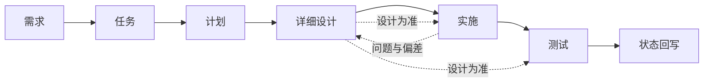

# AI 开发规范

> AI 协作开发总纲：阅读顺序 · 产出流程 · 详细设计核心 · 资料与资源

[文档首页](../文档首页.md) › 规范 › AI 开发规范　|　[同级：文档生成规范 →](文档生成规范.md)　[后端开发规范 →](后端开发规范.md)　|　[关联：项目管理规范 →](项目管理规范.md)

## 1. 目的与适用范围 

定义人类与 AI 协作开发本项目的**阅读顺序、产出顺序、留痕要求与红线**，使 AI 能独立、可复现地推进开发而不偏离既定文档体系。

- 适用于本工作区（bizs / cws）内全部开发活动；
- 与《[文档生成规范](文档生成规范.md)》及各类专项规范同时适用：**本规范管流程与顺序**，具体格式与字段以对应专项规范为准；
- 冲突时：专项规范 > 本规范（格式/字段层面）；本规范 > 习惯做法（流程/顺序层面）。

## 2. 阅读顺序（动手前必读） 

| 顺序 | 层级 | 入口 | 读取目的 |
| --- | --- | --- | --- |
| 1 | 本地资源 | `用户文档/本地资源.md`、`deploy/.env`（均 gitignore） | 知道可以调用哪些服务器 / 服务 / 账号与凭据入口 |
| 2 | 规划 | `bms文档/规划/`（项目规划说明、总体项目规划、开发部署规划、平台可扩展性规划） | 对总体有概念：范围、阶段、里程碑、约束 |
| 3 | 规范 | `bms文档/规范/` | 知道规矩与规则，避免返工 |
| 4 | 设计 | `bms文档/设计/`（架构 / 概要 / 布局 / 数据库 / 原型） | 知道该朝什么方向做、大概做成什么样子 |
| 5 | 项目 | `bms文档/项目/{阶段}/` | 进入具体开发阶段 |
| 6 | 需求 | `项目/{阶段}/需求/` | 具体需要做什么（需求分析：目标 / 边界 / 验收） |
| 7 | 任务 | `项目/{阶段}/任务/{NN}_{域名}/` | 任务落实（WBS 拆解，可递归嵌套） |
| 8 | 计划 | `项目/{阶段}/计划/` | 开发进度、先后顺序、依赖与里程碑 |
| 9 | 详细设计 | 任务目录内 `设计/` | 本任务具体怎么做（开发核心文档） |

## 3. 产出与执行流程 

1. **需求**：按《[需求文档规范](需求文档规范.md)》编写（背景与动机必填）；先做需求分析，明确范围、边界与验收标准。
2. **任务**：按《[任务文档规范](任务文档规范.md)》由需求生成子任务（可递归嵌套），关联需求编号，禁止无需求的任务。
3. **计划**：按《[计划文档规范](计划文档规范.md)》排期（依赖、窗口、工时、甘特）；嵌套子任务并入其直属父任务行。
4. **详细设计**：**先设计后编码**——设计须含交付物清单、接口 / 字段 / 边界与失败分支、测试设计与验收映射。
5. **实施**：严格按详细设计实施；实现过程、关键命令、遇到的问题与处置全部记录到实施文档。
6. **测试**：依据「详细设计 + 实施记录」设计测试用例（先登记 Kiwi TCMS 再编码），记录覆盖率、问题与偏差。
7. **回写**：需求 / 任务 / 计划状态三处一致；**设计发生变更时先回写设计文档，再继续实施或测试**。

## 4. 详细设计的核心地位 

- 详细设计是**开发的核心文档**：实施、测试、验收一律以其为准；代码与设计不一致时，以设计为准（或先修订设计再改代码）。
- 任务开工前必须完成详细设计并逐项确认；设计须写清：边界与失败分支、接口契约、数据结构、测试设计与验收映射、与相邻任务的职责边界。
- 变更纪律：实施中发现设计偏差 → 在实施记录登记问题 → 回写设计（含对齐记录）→ 再推进；不得默默绕过。

## 5. 资料与资源 

- **资料**（`bms文档/资料/`）：部署使用说明、技术资料与辅助文档统一存放。开发中需要而缺失的资料，**先去网上查找**；找到后在资料文件夹按《[文档生成规范](文档生成规范.md)》生成对应文档，以备以后直接使用与对照（版本、命令、步骤按实测记录）。
- **资源**（`bms文档/资源/`）：存放各类被各文件夹共享的资源文件（图片 / 音频 / 视频 / 公共样式等）；html 资产的资源放同级「资源」目录（见《文档生成规范》第 4/7 节）。
- **本地资源与凭据**：仅存 gitignore 文档（`用户文档/本地资源.md`、`deploy/.env`），不入库、不写入其他文档（公开文档红线）。

## 6. 红线与纪律（强制） 

- **不跳步**：不得越过「规划 → 规范 → 设计 → 项目 → 需求 → 任务 → 计划 → 详细设计」直接编码；无需求不建任务，无设计不开工。
- **不臆造**：版本、命令、接口、结论必须实测或查证；不确定时先查资料并落文档。
- **不擅动**：破坏性操作、范围外改动、提交与推送，先逐项确认（《[项目管理规范](项目管理规范.md)》与工作区约定）。
- **不泄露**：公开文档不出现本地资源信息；凭据不入库。
- **可追溯**：需求 ↔ 任务 ↔ 计划 ↔ 设计 ↔ 实施 ↔ 测试 链路留痕完整，状态三处一致。

## 7. 检查清单 

- □ 动手前已按第 2 节顺序完成阅读（资源 → 规划 → 规范 → 设计 → 项目 → 需求 → 任务 → 计划 → 详细设计）
- □ 需求含背景与动机；任务关联需求；计划排期与依赖完整
- □ 开发任务先有已确认的详细设计，实施 / 测试均以其为准
- □ 实施过程与问题已记录；测试用例基于设计与实施且先登记 Kiwi
- □ 新资料已落 `资料/`；共享资源已放 `资源/`；无红线违规

> 依《文档生成规范》编写 · 与《项目管理规范》《文档生成规范》及各类专项规范配套
