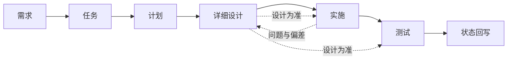

# AI 开发规范

> AI 协作开发总纲：阅读顺序 · 产出流程 · 详细设计核心 · 资料与资源

[文档首页](../文档首页.md) › 规范 › AI 开发规范　|　[同级：文档生成规范 →](文档生成规范.md)　[后端开发规范 →](后端开发规范.md)　|　[关联：项目管理规范 →](项目管理规范.md)

## 1. 目的与适用范围 

定义人类与 AI 协作开发本项目的**阅读顺序、产出顺序、留痕要求与红线**，使 AI 能独立、可复现地推进开发而不偏离既定文档体系。

- 适用于本工作区（bizs / cws）内全部开发活动；
- 与《[文档生成规范](文档生成规范.md)》及各类专项规范同时适用：**本规范管流程与顺序**，具体格式与字段以对应专项规范为准；
- 冲突时：专项规范 > 本规范（格式/字段层面）；本规范 > 习惯做法（流程/顺序层面）。

## 架构铁律（强制 · 先读） 

> **主体开发（平台内建主线）用继承保统一，项目二次开发 / 定制用组合保灵活**——两轨不互斥，汇入同一登记与契约体系。细则见《[前端开发规范](前端开发规范.md)》《[后端开发规范](后端开发规范.md)》「架构铁律」节与工作区 `AGENTS.md`。

1. **主体内建必须继承**：平台自有实现一律沿基类体系继承链派生（后端 `BaseXxx` → `BasePluggable`；前端 **总基类 → 组件根 → 插件基类 → 能力域基类 → 具体组件 / 件**，顶层固定三段、其下每条链长短由功能与抽象需要决定）；**横切功能即继承链上的基类**；公共字段与方法只在链上对应基类维护；不得绕过链层另起炉灶，**不得在链外自由挂接功能**。**前端继承链全系统只有《[前端基类清单](../前端基类清单.md)》一份**，其他文档一律引用。
2. **二次开发 / 定制用组合**：不继承平台基类，经统一注册通道登记接入，不回改平台基类。
3. **两轨汇入同一体系**：同一注册表 / 登记清单 + 同一套契约测试（后端 `contract_version` 校验、前端 `@bms/core/testing` 契约用例工厂），**均须过契约测试**。
4. **依赖方向**：只准上层依赖下层，禁止反向依赖；层 / 能力之间的依赖须在登记表显式声明，禁止隐式自由挂接。
5. **返工教训（2026-09-17 · 本轮为第三次口径修正）**：前端曾把该口径写成「组合轨默认、能力不在继承链上、域基类只是可选语义归类」（一次返工），后修正为「能力入继承链」（二次返工）；**本轮进一步推翻「固定分层 + 能力片段」框架**——层级不固定、横切功能一律落为继承链上的基类、「能力类」实体不再存在（仅保留 `BaseCapability` 作能力声明机制）。**AI 动手前必须核本铁律；发现文档口径与铁律冲突时，先报冲突、按铁律执行并回写冲突文档，不得沿旧口径继续实施——不允许出现第四次返工。**

## 2. 阅读顺序（动手前必读） 

| 顺序 | 层级 | 入口 | 读取目的 |
| --- | --- | --- | --- |
| 1 | 本地资源 | 本地凭据文件与部署环境变量文件（均不入库） | 知道可以调用哪些服务器 / 服务 / 账号与凭据入口；涉及具体操作的服务，再读 `资料/开发服务器/` 下对应部署说明（入口《[开发服务器部署使用说明总览](../资料/开发服务器/linux/开发服务器部署使用说明总览.md)》） |
| 2 | 规划 | `bms文档/规划/`（项目规划说明、总体项目规划、开发部署规划、平台可扩展性规划） | 对总体有概念：范围、阶段、里程碑、约束 |
| 3 | 规范 | `bms文档/规范/` | 知道规矩与规则，避免返工 |
| 4 | 设计 | `bms文档/设计/`（架构 / 概要 / 布局 / 数据库 / 原型） | 知道该朝什么方向做、大概做成什么样子 |
| 5 | 项目 | `bms文档/项目/{阶段}/` | 进入具体开发阶段 |
| 6 | 需求 | `项目/{阶段}/需求/` | 具体需要做什么（需求分析：目标 / 边界 / 验收） |
| 7 | 任务 | `项目/{阶段}/任务/{NN}_{域名}/` | 任务落实（WBS 拆解，可递归嵌套） |
| 8 | 计划 | `项目/{阶段}/计划/` | 开发进度、先后顺序、依赖与里程碑 |
| 9 | 详细设计 | 任务目录内 `设计/` | 本任务具体怎么做（开发核心文档） |
| — | 审计（按需） | `bms文档/规范/前端审计规范.md`、`bms文档/规范/后端审计规范.md` | 审计任务（阶段收口合规审计 / 安全 / 性能 / 文档）启动时按端增读：流程、检查维度框架、报告规范与护栏沉淀要求 |

## 3. 产出与执行流程 

1. **需求**：按《[需求文档规范](需求文档规范.md)》编写（背景与动机必填）；先做需求分析，明确范围、边界与验收标准。
2. **任务**：按《[任务文档规范](任务文档规范.md)》由需求生成子任务（可递归嵌套），关联需求编号，禁止无需求的任务。
3. **计划**：按《[计划文档规范](计划文档规范.md)》排期（依赖、窗口、工时、甘特）；嵌套子任务并入其直属父任务行。
4. **详细设计**：**先设计后编码**——设计须含交付物清单、接口 / 字段 / 边界与失败分支、测试设计与验收映射。
5. **实施**：严格按详细设计实施；实现过程、关键命令、遇到的问题与处置全部记录到实施文档。
6. **测试**：依据「详细设计 + 实施记录」设计测试用例（先登记 Kiwi TCMS 再编码），记录覆盖率、问题与偏差。
7. **回写**：任务 / 计划状态两处一致（需求文档不承载进度）；**设计发生变更时先回写设计文档，再继续实施或测试**。

### 3.1 补充需求的处理方式 

开发中基于**架构设计**（`bms文档/设计/架构设计/`）深挖，识别尚未覆盖、且具「基座 / 公共封装 / 扩展点」性质的能力，按下列口径补充（「建得好，后面调整少」）：

1. **判别（不硬凑）**：候选须满足「会被多模块复用 + 现在能定接口 / 占位」；**明确属后续阶段内部实现的（如回收站恢复、中间件链等）不立项**，归对应阶段，必要时在计划「后续阶段待办」登记。
2. **需求**：在对应需求域文档按编号**顺延新增**（如后端基座 `02-17` 起），写背景与动机 / 内容 / 完成标准 / 参考文档，状态 `未开始`；同步需求总览计数与需求总清单。
3. **任务**：优先挂到**现有父任务**下作**嵌套子任务**（任务树可递归、可随时附加，不依赖序号连续）；无合适父任务才新建父任务；每个任务关联需求编号，工时按「接口占位」口径。
4. **计划重排**：父任务因追加嵌套子任务而重开——状态改 `部分完成`、**从已完成表移回剩余排期**、工时按「自有 + 直属子任务合计」回写；表内「**偏差与遗留**」列跟踪处理情况及归口（防遗漏）。
5. **一致性回写**：任务域总览、计划两处一致（需求文档不承载进度）；实施完成后按第 3 节流程回写状态。
6. **确认纪律**：补充范围、编号、挂载父任务、工时、排期窗口等逐项确认后再执行（见第 7 节「不擅动」）。

## 4. 详细设计的核心地位 

- 详细设计是**开发的核心文档**：实施、测试、验收一律以其为准；代码与设计不一致时，以设计为准（或先修订设计再改代码）。
- 任务开工前必须完成详细设计并逐项确认；设计须写清：边界与失败分支、接口契约、数据结构、测试设计与验收映射、与相邻任务的职责边界。
- 变更纪律：实施中发现设计偏差 → 在实施记录登记问题 → 回写设计（含对齐记录）→ 再推进；不得默默绕过。

## 5. 单任务交付「一条龙」 

单个开发任务（基座 / 接口占位类为其典型形态）从设计到收尾按固定链条一次走完，各步留痕、状态一致。链条内每一处待拍板事项均按第 3 节与第 7 节纪律**逐项确认**，不以推荐值或默认值擅自执行；**详细设计一经定稿即自动提交并自动续行后续各步，直至任务完成**——仅在两处停下：遇不清楚或需用户拍板之处（见「随时可停」），以及推送远程（见「提交与推送」）。

| 步 | 动作 | 留痕 / 产物 |
| --- | --- | --- |
| 1 上下文 | 按第 2 节顺序读本地资源 → 规划 → 规范 → 设计 → 项目 → 需求 → 任务 → 计划；再读该任务相关架构节点 | — |
| 2 决策确认 | 该任务待拍板事项（代码落点 / 契约签名 / 数据契约 / 占位语义 / 常量 / 路由 / 测试编号等）用 question 工具逐项确认，推荐项在前 | — |
| 3 详细设计 | 任务目录 `设计/` 落详细设计（交付物清单 / 接口与字段边界及失败分支 / 测试设计与验收映射 / 登记落点 / 边界与开放项 / 对齐记录）；**先设计后编码**；**定稿即提交（`docs(scope)`）并自动续行** | 详细设计文档 + 提交 |
| 4 实施 | 按设计落代码（横切能力域一域一目录，依赖注入提供者 + 应用装配）；**不实现真实能力** | 代码 |
| 5 测试 | **先登记 Kiwi TCMS 用例取得编号**（分类 / 优先级 / 状态 / 标签 / `text` 字段与批量脚本模板见《[KiwiTCMS部署使用说明](../资料/开发服务器/linux/KiwiTCMS部署使用说明.md)》「用例约定」节与「用例登记（脚本化批量）」节），再写用例并标注 `@pytest.mark.kiwi_id(N)`；占位契约用护栏用例（依赖注入可解析、应用可启动、固定返回可断言） | 用例代码 + 平台编号 |
| 6 验证 | `uv run pytest --cov=app -q` / `ruff check` / `ruff format --check` / `pyright` / `python3 scripts/tools/base-check/check-base.py` 全绿；新增模块覆盖率 100% | 命令输出 |
| 7 登记回写 | 架构（基类清单 / 横切基座 / 跨阶段基座契约表）、《后端基类清单》、《后端开发规范》「后端基座体系」节、计划（后续阶段待办 + 父任务偏差跟踪）、任务与父任务状态（需求文档不承载进度） | 登记落点表 |
| 8 记录 | 任务目录 `实施/`、`测试/` 各一份记录（信息 / 过程 / 问题与处置 / 验证 / 覆盖率 / 偏差与遗留） | 实施记录 + 测试记录 |
| 9 提交 | **各仓库独立提交**；代码与文档分开（`feat(scope)` / `docs(scope)`）；只暂存本次任务相关文件；**链内自动执行** | 提交 |
| 10 处理偏差与遗留 | 消费方任务文档补「前置契约（已交付）」/「协同契约」；计划 §3.1 与需求注块归口；记录遗留条闭环；**独立提交** | 闭环提交 |
| 11 收尾 | 推送按两级指令独立确认 | 收尾 |

补充纪律：

- **随时可停**：链条推进中凡遇不清楚、或需用户拍板之处，**随时停下**，用 question 工具列出候选选项（推荐项在前、附差异说明）请用户选择后再继续——不必等整步走完，也不得以推荐值或默认值擅自越过。
- **编号对齐**：Kiwi 用例号以平台自增主键为准——**先在平台登记取得编号**，再回填代码 `kiwi_id` 与任务记录；平台既有编号不得复用或改派。
- **提交与推送**：一条龙链内各次提交（详细设计 / 代码 / 文档 / 偏差遗留闭环）**自动执行并自动续行**，无需逐步询问；仅**推送远程**需两级独立确认（说「提交」只做 commit、说「推送」只做 push）。链外任务仍按第 7 节与《[项目管理规范](项目管理规范.md)》询问是否提交。
- **闭环才算完成**：偏差与遗留未登记去向、下游消费方未标注，不得视为任务完成。

## 6. 资料与资源 

- **资料**（`bms文档/资料/`）：部署使用说明、技术资料与辅助文档统一存放。开发中需要而缺失的资料，**先去网上查找**；找到后在资料文件夹按《[文档生成规范](文档生成规范.md)》生成对应文档，以备以后直接使用与对照（版本、命令、步骤按实测记录）。
- **资源**（`bms文档/资源/`）：存放各类被各文件夹共享的资源文件（图片 / 音频 / 视频 / 公共样式等）；html 资产的资源放同级「资源」目录（见《文档生成规范》第 4/7 节）。
- **本地资源与凭据**：仅存 gitignore 文档（`用户文档/本地资源.md`、`deploy/.env`），不入库、不写入其他文档（公开文档红线）。
- **外部服务操作先读部署说明**：涉及具体服务与平台的操作（Kiwi 用例登记、服务部署与重建、备份恢复、数据库、远程唤醒 / 睡眠 / 关机等），**先读 `资料/开发服务器/` 下对应的部署使用说明再动手**——命令模板、字段口径与排障结论均在文档中，不得凭记忆下手；入口见《[开发服务器部署使用说明总览](../资料/开发服务器/linux/开发服务器部署使用说明总览.md)》。
- **动手前定向检索**：进入实施 / 编码 / 外部操作前，先按本次任务关键词（服务名、动作名、能力域、技术主题）在 `资料/开发服务器/`、`资料/知识档案/`、`设计/架构设计/` 定向检索，命中即先读。资料类文档为**辅助参考**（会过时、不具强制力），读后须结合当前现状自行判断；强制口径只认 `规范/` 下的规范文档。项目的坑与来龙去脉多已沉淀在资料中，检索仍是成本最低的避坑手段。

## 7. 红线与纪律（强制） 

- **不跳步**：不得越过「规划 → 规范 → 设计 → 项目 → 需求 → 任务 → 计划 → 详细设计」直接编码；无需求不建任务，无设计不开工。
- **不臆造**：版本、命令、接口、结论必须实测或查证；不确定时先查资料并落文档。
- **不擅动**：破坏性操作、范围外改动、提交与推送，先逐项确认（《[项目管理规范](项目管理规范.md)》与工作区约定）。
- **不泄露**：公开文档不出现本地资源信息；凭据不入库。
- **可追溯**：需求 ↔ 任务 ↔ 计划 ↔ 设计 ↔ 实施 ↔ 测试 链路留痕完整，状态两处（任务 / 计划）一致。

## 8. 检查清单 

- □ 动手前已按第 2 节顺序完成阅读（资源 → 规划 → 规范 → 设计 → 项目 → 需求 → 任务 → 计划 → 详细设计）
- □ 需求含背景与动机；任务关联需求；计划排期与依赖完整
- □ 开发任务先有已确认的详细设计，实施 / 测试均以其为准
- □ 实施过程与问题已记录；测试用例基于设计与实施且先登记 Kiwi
- □ 已按任务主题在 `资料/`（部署说明 / 知识档案）与 `设计/架构设计/` 定向检索，并读过命中文档
- □ 涉及外部服务 / 平台的操作（如 Kiwi 用例登记）已先读 `资料/开发服务器/` 下对应部署说明
- □ 新资料已落 `资料/`；共享资源已放 `资源/`；无红线违规
- □ 补充需求已按第 3.1 节判别（不硬凑）、顺延编号、挂现有父任务、同步计划与状态两处
- □ 单任务交付已按第 5 节「一条龙」链条闭环（设计 → 实施 → 测试 → 验证 → 登记 → 记录 → 提交 → 偏差遗留 → 收尾）
- □ 写 / 改设计文档与规范时遵守《[文档生成规范](文档生成规范.md)》「架构节点的语义与实现分层」节：架构节点只写语义；实现细节落实现侧清单与详细设计；规范只写全局原则与强制口径，不含技术细节（举例除外）；**组件设计节点只写通用组件的语义与契约边界**——实现侧命名与落点见《[前端基类清单](../前端基类清单.md)》、实现契约细节见项目详细设计

> 依《文档生成规范》编写 · 与《项目管理规范》《文档生成规范》及各类专项规范配套
