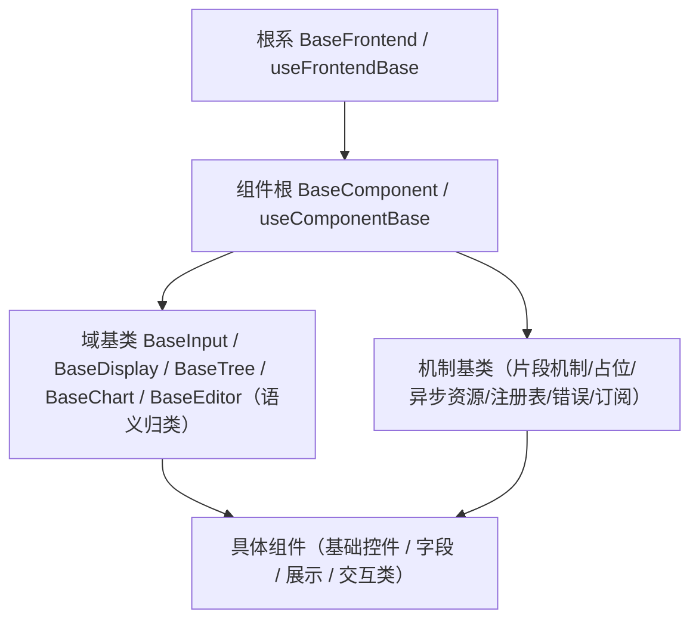

# 前端开发规范

> 本项目 · frontend（Vue 3 + Vite + TS）开发约定

[文档首页](../文档首页.md) › 规范 › 前端开发规范　|　[同级：后端开发规范 →](后端开发规范.md)　|　[命名规范 →](命名规范.md)

## 1. 概述 <a id="overview"></a>

本文档定义本项目前端（frontend PC 管理端；frontend-mobile 移动端按同约定执行）的开发规范：
目录约定、TypeScript、Vue 组件、状态管理、权限、布局框架组件、样式、国际化、请求封装、
测试与提交规范。依据《项目规划说明》《架构设计》《命名规范》《文档生成规范》及
《主框架布局设计》《表单框架布局设计》《移动端布局设计》展开，与《后端开发规范》配套。

## 2. 目录约定 <a id="structure"></a>

```text
frontend/
├── src/
│   ├── api/        # Axios 封装与接口定义（api/user.ts → getUserList()）
│   ├── router/     # 动态路由生成（不硬编码路由表）
│   ├── stores/     # Pinia（useUserStore / useDictStore）
│   ├── views/      # 页面（views/user/UserList.vue）
│   ├── layouts/    # 主布局（侧边栏 + Tab 栏 + 内容区）
│   ├── components/ # 通用组件（PascalCase 单数名词，如 UserForm.vue）
│   ├── i18n/       # 中英文文案（zh-CN.ts / en-US.ts）
│   ├── styles/     # 全局样式与变量（移动端安全区等）
│   └── utils/      # 通用工具与组合式函数（useTabs/useRequest 等）
├── tests/          # 集中测试（与 src 分离；helpers/mount.ts 测试基座）
├── .npmrc          # npm 源（npmmirror）
├── package.json
├── package-lock.json # 依赖锁定（必须提交）
└── .nvmrc
```

- 双工程独立：frontend 与 frontend-mobile 各自 package.json / lock 与 ESLint/Prettier/TS 配置，互不共享；npm 管理
- npm 源与锁定：`.npmrc` 配 npmmirror；`package-lock.json` 必须提交；`legacy-peer-deps` 仅在上游 peer 声明滞后时临时启用并在文件内注明
- **基础类与继承约定（强制）**：公共字段/方法只在基础类维护，模块不得重复实现；体系角色（根系 / 组件根 / 能力片段 / 域基类）与扩展约定见第 3 节「前端基类体系」
- 路由 path kebab-case（/user-management）；路由 name PascalCase 与页面组件对应（UserManagement）
- 图片等资源 kebab-case（logo-bms.png）

## 3. 前端基类体系（开放式，强制） <a id="base-class"></a>

与后端《[后端开发规范](后端开发规范.md)》「后端基座体系（强制）」节对齐：前端基类按**角色 + 开放扩展**组织（根系 / 组件根 / 机制基类 / 能力片段 / 域基类），**公共字段/方法只在对应基类或能力片段维护，任何组件与模块不得重复实现**；新增能力 = 新增**片段**（或按需域基类）+ 登记，不改根、不设层数/数量上限。**基类清单**（角色、职责、代码位置、依赖、状态）由《[前端基类清单](../前端基类清单.md)》提供，本规范只定强制用法口径；组件契约见组件设计 00 类节点，体系机制见平台《架构设计 · 前端组件体系》。

### 3.1 强制用法 <a id="base-class-usage"></a>

- **必须从根派生（强制）**：一切基类从根系 `BaseFrontend` / `useFrontendBase` 派生（契约/数据根、组件根、机制基类、域基类同）；UI 组件必须挂到组件根或域基类的组件包装上；片段与域基类不得绕过组件根另起炉灶。
- **必须组合（强制）**：UI 组件与域基类的横切能力**必须经能力片段获得**，片段**必须经片段机制（`useCapabilityBase` + `BaseCapability`）声明并登记**；禁止绕过片段在组件内自实现（同后端「禁止绕过 `BaseService` 直连 `BaseRepository`」）。
- **继承与组合分工**：继承承载**身份与家族契约**（根系 → 组件根 → 域基类/机制基类 → 具体组件），组合承载**正交横切能力**（能力片段）；两轨边界见 3.4 节。
- **禁止**：组件/模块重复实现基类或片段已提供的公共字段/方法；绕过基类体系另起炉灶；基类依赖具体组件；片段反向依赖上层；未登记片段存在。
- **依赖方向**：只准上层依赖下层（具体组件 → 域基类/片段 → 组件根 → 根系）；机制基类由组件根统一挂接，不直接面向具体组件；层次由依赖关系决定，**不设层数上限**；片段之间依赖须单向并登记。
- **命名**：基类（含机制基类、域基类、组件包装）一律 `Base` 打头——`BaseFrontend` / `BaseComponent` / `BaseInput` / `BaseDisplay` / `BaseTree` / `BaseChart` / `BaseEditor` / `BaseCapability` / `BasePlaceholder` / `BaseAsyncResource` / `BaseProviderRegistry` / `BaseProvider` / `BaseError` / `BaseSubscription`；能力片段 `useXxx`（不带 `Base` 后缀）；机制层组合式 `useXxxBase`（`useFrontendBase` / `useComponentBase` / `useCapabilityBase`）——统一遵循《[命名规范](命名规范.md)》「前端命名」节。
- **双端同款基线**：frontend 与 frontend-mobile 同步扩展，不得只在单端加基类能力。

### 3.2 扩展规则 <a id="base-class-extend"></a>

- **新增能力 → 新增能力片段**（`useXxx`，正交可组合）：七形态等预置片段只是首批，非封闭枚举；机制横切归机制基类（`src/base/`：片段机制 `BaseCapability`、占位 `BasePlaceholder`、异步资源 `BaseAsyncResource`、注册表 `BaseProviderRegistry` + 注册项 `BaseProvider`、错误 `BaseError`、订阅 `BaseSubscription`）；**新增域语义 → 新增域基类**（按需，如 `BaseTree` / `BaseChart` / `BaseEditor`）——两者均不改动根系 / 组件根。
- **新增即登记（对齐后端候选机制）**：候选 → 设计节点（组件设计）→ 评审确认 →《[前端基类清单](../前端基类清单.md)》登记 → 同步《架构设计 · 前端组件体系》；未登记的能力不得散落在具体组件内重复实现。
- 公共逻辑只在所属片段 / 基类维护，具体组件只负责自身特性；修改公共行为改片段 / 基类即可全链生效。
- **兼容性**：新增片段 / 基类为兼容变更；调整既有片段契约（行为 / 参数 / 事件）须评估使用方并升**主版本**标注（组件设计节点与清单同步）。

### 3.3 演进原则 <a id="base-class-evolve"></a>

- 遇职责冲突优先**新增片段**或**插入中间机制**承前启后，每片段只解决一类横切职责；禁止把多类横切职责塞进同一片段，禁止为容纳新类型而扩充封闭枚举。
- 演进示例（形态片段与域职责冲突 → 拆分 `useValue` / `useFieldShell` / `useFieldPerm` 片段消解）见《[前端基类清单](../前端基类清单.md)》「扩展与演进」节。

### 3.4 继承与组合分工（强制） <a id="base-class-composition"></a>

前端基类体系与后端《[后端开发规范](后端开发规范.md)》「后端基座体系」节同构：**继承承载身份与家族契约，组合承载正交能力**；两轨并行、边界清晰，禁止混用（继承链上不得夹带正交能力，片段不得充当家族身份）。

**继承轨（身份与家族契约）**：



- 继承链：根系（通用字段/方法唯一落点）→ 组件根（UI 通用：透传/尺寸密度/主题/可访问性）→ 域基类（域语义与家族统一契约）→ 具体组件；
- 组件包装与域基类必须从根派生；公共能力只在对应基类维护，改基类即全链生效；
- 机制基类（体系公共机制，不是某个组件的能力）由组件根统一挂接，不直接面向具体组件。

**组合轨（正交横切能力）**：

- 能力片段 `useXxx`：单点实现（`src/components/base/<能力域>/`）、`key` 唯一、按需组合；组件组合多个片段即可工作，域基类只是可选语义归类；
- 片段依赖须经 `useCapabilityBase` 单向声明并登记，不得循环、不得依赖上层、不得依赖具体组件；
- 公共能力只在片段维护；具体组件只负责自身特性。

**分工判定（新能力落点）**：

| 新能力形态 | 落点 |
| --- | --- |
| 多个组件可自由选配的横切能力（形态 / 值 / 权限 / 数据源 / 上传…） | 新增**能力片段** |
| 同类组件的家族身份与统一契约（输入域 / 展示域 / 树域 / 图表域…） | 新增**域基类** |
| 体系级公共机制（片段声明 / 占位 / 资源释放 / 注册表 / 错误 / 订阅…） | 新增**机制基类**（`src/base/`） |
| 所有基类共有的横切（日志 / 配置 / i18n…） | 上提**根系**；所有 UI 组件共有 → 上提**组件根** |

### 3.5 执行护栏（指引） <a id="base-class-guard"></a>

本节强制口径由**机器护栏**执行（不依赖自觉）：CI 继承护栏（扫描基类链 / 组件包装 / 片段声明）、依赖边界测试（import 方向断言，禁止反向 / 重复实现）、契约测试套件（片段与基类契约，所有实现跑同一套）、清单对账脚本（《[前端基类清单](../前端基类清单.md)》↔ 代码双向校验）、注册表「不注册不可用」。护栏清单、落点与阶段随平台《架构设计 · 前端组件体系》（「执行护栏」节）与阶段四任务完成标准登记，本规范不重复展开。

## 4. TypeScript 规范 <a id="ts"></a>

- 变量/函数 camelCase；常量 UPPER_SNAKE；类型/接口 PascalCase；禁止 any（除适配层显式注释）
- 接口类型由 openapi-typescript 从后端 OpenAPI 自动生成（保持前后端契约一致）；手写类型不得与生成类型冲突
- 统一响应类型：type ApiResponse<T> = { code: number; message: string; data: T }；分页响应 { list, total, page, size }
- 严格模式开启（strict）；ESLint + Prettier 强制（CI）

### 4.1 注释规范 <a id="ts-comment"></a>

**注释是交付物的一部分**：组件文档、接口类型注释与后端契约同源；注释一律使用中文（标识符用英文，见《命名规范》）。

| 对象 | 规范 | 示例 |
| --- | --- | --- |
| 组件文件头注释 | JSDoc：组件职责、主要 props/emit、使用场景；每个页面/通用组件必写 | `/**\n * 用户列表页：列表查询 + 双击行打开详情。\n * 与 UserForm 经 FormFrame 约定事件交互。\n */` |
| 函数 JSDoc | @param / @returns；复杂逻辑（状态机、缓存、权限计算）必写说明 | `/** 打开详情 Tab，已打开则激活。 @param item 列表行数据 */` |
| 类型/接口注释 | 字段注释含义，枚举值逐一说明；接口字段与后端字段映射说明（如 deptId ↔ dept_id） | `/** 数据范围规则：字段+运算符+预置变量 */\ntype ScopeRule = {...}` |
| 生成类型注释链路 | 后端接口 docstring → OpenAPI description → openapi-typescript 生成的 TS 类型自带注释；引用生成类型不重复注释，注释不全的字段在业务侧补注 | — |
| 行注释 | 解释"为什么"（why）；复杂表达式、权限指令（v-perm）、边界处理必写 | `// 关闭激活 Tab 后激活左侧相邻，与 VS Code 一致` |
| 模板注释 | `<!-- 说明 -->` 仅在结构不直观处（嵌套插槽、条件块）使用，避免泛滥 | `<!-- 编辑态才显示保存按钮 -->` |
| 标记 | TODO（待办）/ FIXME（已知缺陷）统一前缀，带简述 | `// TODO: 接入游标分页后移除 limit/offset` |

- **类型优先**：TS 类型能表达的语义不重复写注释；禁止为变量名可读的代码加注释
- **禁止**：逐行废话注释、注释掉的代码（一律删除，需要时从 git 找回）、与代码不同步的过期注释
- 组件 props 定义处逐项注释（编辑器悬停提示即组件文档）；emit 事件说明触发时机
- 注释随代码变更同步更新；组件职责变化必须同步文件头注释

## 5. Vue 组件规范 <a id="component"></a>

### 5.1 SFC 结构 <a id="component-sfc"></a>

- 组合式 API（<script setup lang="ts">）；组件名 PascalCase 单数名词；文件名与组件名一致
- 需要被 keep-alive 缓存的组件（Workbench / FormFrame）显式声明 name（defineOptions）
- SFC 顺序：template → script → style（scoped）；样式类名 kebab-case（BEM 简化：.user-form）
- 逻辑提取：组件内逻辑超过约 200 行拆组合式函数（src/utils 或 components/ 同级 composables）

### 5.2 props / emit 约定 <a id="component-props"></a>

- props 用 withDefaults + 类型定义；事件名 kebab-case（open-detail / title-change）；emit 显式声明
- 列表页与表单页通过 FormFrame 约定交互（见第 8 节），禁止跨组件直接访问内部状态
- 表单页 expose 脏数据状态（dirty）供 FormFrame 拦截确认

## 6. 状态管理（Pinia） <a id="store"></a>

- store 命名 use + 模块 + Store（useUserStore / useDictStore）；按模块拆分，禁止单一巨型 store
- 服务端数据不重复存 store（列表/详情数据由页面组件管理，store 只存会话、权限、配置等全局态）
- useTabs 为模块级单例组合式函数（非 store）：维护 Tab 列表与 localStorage 同步（bms_open_tabs）

## 7. 动态菜单与权限 <a id="perm"></a>

- 菜单树由后端按权限动态下发（含 locale 翻译），前端动态注册路由与生成侧边栏，禁止硬编码路由表
- 按钮显隐：v-perm="'业务:动作'" 指令（默认无按钮权限）；字段权限按表单元数据 visible/editable 渲染
- 路由守卫：校验登录态与权限码，无权限跳 403 页（或首页）；地址栏直达无权限路由同样拦截
- 权限码变更（角色/授权）后刷新权限缓存（后端版本号机制），前端重新拉取菜单

## 8. 布局与框架组件约定 <a id="layout"></a>

### 8.1 Tab 与路由 <a id="layout-tabs"></a>

- 顶层 Tab 由 useTabs 管理：激活 Tab 同步路由 push；前进/后退驱动激活；直接访问先建后激活（详见《主框架布局设计》）
- Tab 标题取菜单名（locale 翻译）/meta.title，不直接用路由 name；白名单 ALLOWED_PATHS 过滤
- localStorage key 统一 bms_ 前缀（bms_open_tabs / bms_menu_expanded）

### 8.2 FormFrame / FormDetailPanel <a id="layout-frame"></a>

- 实体页面路由组件统一 FormFrame（路由 props 注入 title/listComponent/detailComponent）
- 组件名 → 组件映射表：import.meta.glob 批量注册；未注册组件名拦截并提示（防菜单配置错误白屏）
- 表单页复用 FormDetailPanel（只读/编辑分态、信息栏、主表+明细）；用户等简单表单自行实现
- 表单内 Tab 为页面内部状态（FormFrame 内维护），不参与顶层 useTabs 与持久化

### 8.3 列表页 / 表单页约定 <a id="layout-list-form"></a>

- 职责分离：列表页与表单页独立组件文件，仅通过约定事件交互（open-detail / saved / deleted / title-change / fetchList / dirty）
- 列表页公共逻辑（分页/查询/刷新）优先用 `useListPage`（`src/utils/useListPage.ts`）；异步状态与竞态用 `useRequest`；表单校验用 `validators` 规则工厂
- 列表页无操作列，双击行打开详情（移动端点击进入）；分页 page/size + 筛选参数
- 保存：整体提交主表+明细（单事务）；携带 version 乐观锁；保存后刷新列表
- 脏数据保护：切换/关闭 Tab 前确认（详情见《表单框架布局设计》）

## 9. 样式规范 <a id="style"></a>

- SCSS + Element Plus 主题变量定制；避免引入重型 CSS 方案
- 深色/浅色主题：CSS 变量驱动切换，主题偏好持久化（sys_user_preference）+ localStorage 临时态
- 类名 kebab-case（BEM 简化）；组件内样式 scoped；全局样式仅放全局变量/混入
- 移动端（Vant）：postcss px→vw 视口适配（设计稿 375、保留 1px，兼容问题可切 rem）+ 安全区 `env(safe-area-inset-*)` 变量

## 10. 国际化 <a id="i18n"></a>

- 文案不硬编码：vue-i18n 语言包运行时从后端拉取（Redis 缓存 + localStorage 二次缓存）
- i18n key 点分：模块.页面.字段（user.form.username、common.confirm）；错误码按 error.{code} 映射
- RTL 布局按 sys_i18n_locale.rtl 切换；时间/数字按用户时区与 Intl 本地化

## 11. 请求封装 <a id="http"></a>

- Axios 统一实例：请求拦截器注入 Bearer access token（access token 仅存内存）；响应拦截器统一处理 {code, message, data}
- 请求统一经 `request<T>()` 解开 `{code, message, data}`；模块 API 继承 `BaseApi`（`src/api/base.ts`），禁止绕过基类裸用 axios
- 401 静默刷新（refresh 轮换）；刷新失败跳登录；会话失效（session.revoked）强制登出
- 统一错误提示（Toast/Message）；业务错误码映射 i18n 文案
- 写接口带幂等键（Idempotency-Key）；列表接口统一分页参数

## 12. 测试 <a id="test"></a>

- Vitest：单元/组件测试统一放 `tests/`（与 src 分离），文件 `模块.spec.ts`（`utils.spec.ts`、`UserForm.spec.ts`）；覆盖核心组件与组合式函数
- 组件测试统一用 `tests/helpers/mount.ts` 的 `mountWithPlugins`（预挂 pinia/i18n，可选 router）
- Playwright E2E：功能描述命名（login.spec.ts）；覆盖登录、RBAC 权限（按钮显隐与字段权限）、核心 CRUD 主流程
- E2E 环境：CI 服务容器起 backend（SQLite）与前端产物
- 组件测试断言：渲染、事件、权限指令行为（v-perm 显隐）

## 13. 提交规范 <a id="git"></a>

| 项 | 约定 | 示例 |
| --- | --- | --- |
| 提交信息 | `type(scope): 中文描述`；type：feat/fix/docs/refactor/test/chore | `feat(tabs): Tab 溢出更多按钮` |
| 分支 | `类型/描述` | `feature/user-management` |
| PR 合入 | CI 通过（ESLint + Vitest + 构建 + 体积预算 + Playwright E2E）方可合并 | — |

## 14. 构建体积预算 <a id="budget"></a>

- 门禁：`npm run budget`（`scripts/check-bundle-budget.mjs`，零依赖）统计 `dist` 下 js/css 的 gzip 体积，
  与工程根 `budget.json` 的 `totalGzipKb` / `largestGzipKb` 比较，超限退出码 1；
  已挂 CI 双端 `build` job（构建后自动跑）。
- 阈值口径：初次落地取「当前基线 + 20%」（2026-09-15：frontend 85 / 63 KB，frontend-mobile 83 / 83 KB）；
  因需求增长需放宽时，在同一提交中调整 `budget.json` 并说明原因（评审可见）。
- 定位：防「悄悄变大」的早期预警，不替代性能优化（缓存、懒加载、拆包按《项目规划说明》性能设计执行）。

> 依《文档生成规范》编写 · 与《后端开发规范》《命名规范》《架构设计》《布局设计》配套
