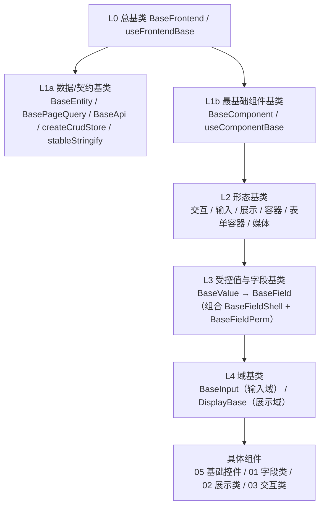
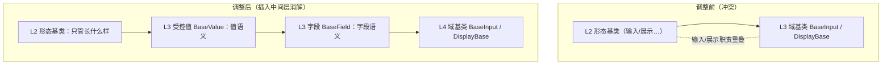

# 前端开发规范

> 本项目 · frontend（Vue 3 + Vite + TS）开发约定

[文档首页](../文档首页.md) › 规范 › 前端开发规范　|　[同级：后端开发规范 →](后端开发规范.md)　|　[命名规范 →](命名规范.md)

## 1. 概述 <a id="overview"></a>

本文档定义本项目前端（frontend PC 管理端；frontend-mobile 移动端按同约定执行）的开发规范：
目录约定、TypeScript、Vue 组件、状态管理、权限、布局框架组件、样式、国际化、请求封装、
测试与提交规范。依据《项目规划说明》《架构设计》《命名规范》《文档生成规范》及
《主框架布局设计》《表单框架布局设计》《移动端布局设计》展开，与《后端开发规范》配套。

## 2. 目录约定 <a id="structure"></a>

```text
frontend/
├── src/
│   ├── api/        # Axios 封装与接口定义（api/user.ts → getUserList()）
│   ├── router/     # 动态路由生成（不硬编码路由表）
│   ├── stores/     # Pinia（useUserStore / useDictStore）
│   ├── views/      # 页面（views/user/UserList.vue）
│   ├── layouts/    # 主布局（侧边栏 + Tab 栏 + 内容区）
│   ├── components/ # 通用组件（PascalCase 单数名词，如 UserForm.vue）
│   ├── i18n/       # 中英文文案（zh-CN.ts / en-US.ts）
│   ├── styles/     # 全局样式与变量（移动端安全区等）
│   └── utils/      # 通用工具与组合式函数（useTabs/useRequest 等）
├── tests/          # 集中测试（与 src 分离；helpers/mount.ts 测试基座）
├── .npmrc          # npm 源（npmmirror）
├── package.json
├── package-lock.json # 依赖锁定（必须提交）
└── .nvmrc
```

- 双工程独立：frontend 与 frontend-mobile 各自 package.json / lock 与 ESLint/Prettier/TS 配置，互不共享；npm 管理
- npm 源与锁定：`.npmrc` 配 npmmirror；`package-lock.json` 必须提交；`legacy-peer-deps` 仅在上游 peer 声明滞后时临时启用并在文件内注明
- **基础类与继承约定（强制）**：公共字段/方法只在基础类维护，模块不得重复实现；完整分层（L0-L4）、各层职责与继承约定见第 3 节「前端基础类体系」
- 路由 path kebab-case（/user-management）；路由 name PascalCase 与页面组件对应（UserManagement）
- 图片等资源 kebab-case（logo-bms.png）

## 3. 前端基础类体系（L0-L4，强制） <a id="base-class"></a>

与后端「基础类」体系对齐：前端所有**基类**收敛为一套分层体系，**公共字段/方法只在对应层基类维护，任何组件与模块不得重复实现**；调整某一层基类即全链生效（无需逐组件改造，适配上千表单/海量字段场景）。**数据/契约基类**与 **UI 组件基类**并列，二者共同继承自 **L0 总基类**；有新的类型就加一种基类，有新的扩展就加一层基类。本规范为**前端基础类体系的权威**，组件设计 00 类按层落地组件契约。

### 3.1 分层总览 <a id="base-class-layers"></a>



| 层 | 基类 / 能力 | 形态 | 父层 | 职责 |
| --- | --- | --- | --- | --- |
| L0 | 总基类 `BaseFrontend` + `useFrontendBase` | 抽象类 + 组合式 | — | 一切前端基类之根：通用字段与通用方法（日志、错误上报、配置/环境读取、i18n、生命周期钩子） |
| L1a | 数据/契约基类 `BaseEntity`/`BasePageQuery`/`BaseApi`/`createCrudStore`/`stableStringify` | 接口 / 类 / 工厂 | L0 | 响应与实体契约、请求封装、CRUD store 工厂、稳定序列化（详见项目骨架 01-04-1） |
| L1b | 最基础组件基类 `BaseComponent` + `useComponentBase` | 抽象类 + 组合式 | L0 | 所有 UI 组件通用：attrs 透传与根元素约定、尺寸/密度/主题令牌、i18n 与命名空间、生命周期与埋点、可访问性(aria)与 ref/expose、通用 loading/disabled/显隐 |
| L2 | 交互基类 `BaseInteractive` | 组合式 | L1b | 可点击/loading/disabled/焦点语义 |
| L2 | 输入基类 `BaseInputControl` | 组合式 | L1b | 通用输入形态：值绑定、前后缀插槽、清空、只读 |
| L2 | 展示基类 `BaseDisplayControl` | 组合式 | L1b | 通用只读形态：密度/令牌/空值/省略 |
| L2 | 容器基类 `BaseContainer` | 组合式 | L1b | 插槽/折叠/分栏/区域 |
| L2 | 表单容器基类 `BaseFormContainer` | 组合式 | L1b | 表单/分区/校验汇总 |
| L2 | 媒体基类 `BaseMedia` | 组合式 | L1b | 图片/音视频/文件预览 |
| L3 | 受控值基类 `BaseValue` | 组合式 | L2 输入/展示 | 值归一、格式化调度、三态、`change` 上报 |
| L3 | 字段基类 `BaseField` | 组合式 | `BaseValue` | 字段上下文（字段壳）、字段权限、校验触发、`fieldKey`；**组合** `BaseFieldShell` + `BaseFieldPerm` |
| L3 | 字段壳基类 `BaseFieldShell` | 组合式 + 组件 | L3 | label/必填/帮助/错误/栅格跨度/只读回显 |
| L3 | 字段权限基类 `BaseFieldPerm` | 组合式/指令 | L3 | `visible`/`editable`/`required`/脱敏（`v-plain`） |
| L4 | 输入域基类 `BaseInput` | 组合式 + 组件 | `BaseField` | 输入域细化（受控、校验、字段上下文） |
| L4 | 展示域基类 `DisplayBase` | 组合式 + 组件 | `BaseDisplayControl` + `BaseValue` | 展示域细化（值格式化、空值占位、密度） |
| — | 具体组件 | — | L4 | 05 基础控件 / 01 字段类 / 02 展示类 / 03 交互类 |

### 3.2 L0 总基类 <a id="base-class-l0"></a>

- 形态：抽象类 `BaseFrontend` + 组合式 `useFrontendBase`；**所有基类（含 `BaseApi`/`BaseComponent`）从其派生**。
- 提供：通用字段（如命名空间、版本/标识）与通用方法（日志、错误上报、配置/环境读取、i18n 取词、生命周期钩子）；不含任何 UI 或业务语义。
- 约束：L0 只放"所有基类共有"的横切能力；任何一方（数据/UI）特有逻辑不得上提 L0。

### 3.3 L1 基类（数据/契约 与 UI 最基础） <a id="base-class-l1"></a>

- **L1a 数据/契约基类**：响应/分页/实体类型、`BaseApi`、`createCrudStore`、`stableStringify`；详细设计见项目骨架 01-04-1《前端基础类详细设计》，本规范统一声明其继承自 L0。
- **L1b 最基础组件基类 `BaseComponent`**：所有 UI 组件公共能力——
  - attrs 透传（`id`/`class`/`style`/`data-*`）与根元素约定；
  - 尺寸 `size` / 密度 `density` / 主题令牌消费（随亮暗与租户品牌自动适配）；
  - i18n 取词与样式命名空间/前缀；
  - 生命周期埋点、错误上报、开发告警；
  - 可访问性（aria、键盘焦点）与 `ref`/`expose` 规范；
  - 通用 `loading`/`disabled`/显隐态。

### 3.4 L2 形态基类（六类） <a id="base-class-l2"></a>

- `BaseInteractive`：可点击组件的公共（loading/disabled/焦点/键盘触发）。
- `BaseInputControl`：输入形态公共（值绑定、前后缀插槽、清空、只读），**不含表单字段语义**。
- `BaseDisplayControl`：展示形态公共（密度、令牌、空值、省略），**不含字段格式化编排**。
- `BaseContainer` / `BaseFormContainer` / `BaseMedia`：容器、表单容器、媒体形态公共。
- L2 只描述"组件长什么样、怎么交互"，不绑定具体业务或表单字段。

### 3.5 L3 受控值与字段基类 <a id="base-class-l3"></a>

- `BaseValue`（承前启后）：承接 L2，统一输入与展示共用的**值语义**（值归一、格式化调度、三态、`change`）。
- `BaseField`：在 `BaseValue` 之上提供**表单字段语义**（字段上下文、字段权限、校验触发、`fieldKey`），并**组合** `BaseFieldShell`（字段壳）与 `BaseFieldPerm`（字段权限）。
- `BaseFieldShell` / `BaseFieldPerm`：由原「字段壳」「字段权限」升级为继承链上的基类能力，供 `BaseField` 组合、可独立复用；详细契约见组件设计 00 类对应节点。

### 3.6 L4 域基类 <a id="base-class-l4"></a>

- `BaseInput`（输入域）：继承 `BaseField`，做输入域的最终细化，供 01 字段类与 05 基础控件继承。
- `DisplayBase`（展示域）：组合 `BaseDisplayControl` + `BaseValue`，做展示域细化，供 02 展示类与字段只读回显继承。

### 3.7 继承与实现约定 <a id="base-class-inherit"></a>

- **模拟继承**：Vue 3 无类多继承，统一以**组合式函数 + 组件包装**模拟继承；一个组件可**组合多个基类**（如展示域 = 展示形态基类 + 受控值基类）。
- **依赖方向**：只准上层依赖下层，**禁止反向依赖**（L4 不得依赖具体组件，L0 不得依赖任何上层）。
- **命名**：基类组件 `BaseXxx`、组合式 `useXxxBase`/`useXxx`；基类字段/方法用统一前缀（如 `base`/`$` 命名空间，具体由实现定）。
- **目录**：`00_基础组件类/` 按层分子目录（`L0_总基类/`、`L1b_最基础组件基类/`、`L2_形态基类/`、`L3_受控值与字段基类/`、`L4_域基类/`），代码对应 `src/components/base/<layer>/`（L1a 在 `src/api/`、`src/stores/`、`src/utils/`）。
- **字段控件统一继承链**：`具体控件 → BaseInput(L4) → BaseField(L3) → BaseValue(L3) → BaseInputControl(L2) → BaseComponent(L1b) → BaseFrontend(L0)`。
- **双端同款基线**：frontend 与 frontend-mobile 同步扩展，不得只在单端加基类能力。

### 3.8 扩展规则 <a id="base-class-extend"></a>

- **加类型**：出现新的组件类型 → 新增对应基类；**加扩展**：出现新的横切能力 → 新增一层基类。
- 公共逻辑只在所属层基类维护，具体组件只负责自身特性；修改公共行为改基类即可全链生效。
- 新增/调整基类须同步：本规范章节 + 组件设计 00 类节点（契约与原型）+ 《架构设计 · 前端架构》组件分层登记。

### 3.9 分层演进示例：冲突时插入中间层（可多层） <a id="base-class-example"></a>

分层不是一次定死，而是**遇到职责冲突就插入中间层承前启后**；同一冲突可能不止一处，可插入**多层**，每层只解决一类横切职责（加层优先于在既有层堆逻辑）。

**示例（本体系已发生的真实冲突）**：最初构想 L2 形态基类（含"输入/展示"）直接接 L3 域基类 `BaseInput`/`DisplayBase`，结果"输入/展示"在 L2 与 L3 两处都出现、职责打架——L2 讲"组件长什么样"，L3 讲"表单字段怎么用"，两者被混为一层。处理方式是**把冲突职责独立成层**：



- 结果：L2 只管形态；新增 L3 `BaseValue`（值归一/格式化/三态/change）与 `BaseField`（字段上下文/权限/校验）承前启后；L4 域基类只做域内细化。
- **可继续加层**：若后续出现新横切职责（如"授权/审计""实时/订阅""离线/缓存"），按同一办法再插一层（如 `BaseAuthorized`、`BaseReactive`、`BaseCacheable`），插在合适的两层之间，**不动其它层**。
- 原则：**改一层即全链生效**；禁止把多类横切职责塞进同一层，导致后续无法只调整某一类。

## 4. TypeScript 规范 <a id="ts"></a>

- 变量/函数 camelCase；常量 UPPER_SNAKE；类型/接口 PascalCase；禁止 any（除适配层显式注释）
- 接口类型由 openapi-typescript 从后端 OpenAPI 自动生成（保持前后端契约一致）；手写类型不得与生成类型冲突
- 统一响应类型：type ApiResponse<T> = { code: number; message: string; data: T }；分页响应 { list, total, page, size }
- 严格模式开启（strict）；ESLint + Prettier 强制（CI）

### 4.1 注释规范 <a id="ts-comment"></a>

**注释是交付物的一部分**：组件文档、接口类型注释与后端契约同源；注释一律使用中文（标识符用英文，见《命名规范》）。

| 对象 | 规范 | 示例 |
| --- | --- | --- |
| 组件文件头注释 | JSDoc：组件职责、主要 props/emit、使用场景；每个页面/通用组件必写 | `/**\n * 用户列表页：列表查询 + 双击行打开详情。\n * 与 UserForm 经 FormFrame 约定事件交互。\n */` |
| 函数 JSDoc | @param / @returns；复杂逻辑（状态机、缓存、权限计算）必写说明 | `/** 打开详情 Tab，已打开则激活。 @param item 列表行数据 */` |
| 类型/接口注释 | 字段注释含义，枚举值逐一说明；接口字段与后端字段映射说明（如 deptId ↔ dept_id） | `/** 数据范围规则：字段+运算符+预置变量 */\ntype ScopeRule = {...}` |
| 生成类型注释链路 | 后端接口 docstring → OpenAPI description → openapi-typescript 生成的 TS 类型自带注释；引用生成类型不重复注释，注释不全的字段在业务侧补注 | — |
| 行注释 | 解释"为什么"（why）；复杂表达式、权限指令（v-perm）、边界处理必写 | `// 关闭激活 Tab 后激活左侧相邻，与 VS Code 一致` |
| 模板注释 | `<!-- 说明 -->` 仅在结构不直观处（嵌套插槽、条件块）使用，避免泛滥 | `<!-- 编辑态才显示保存按钮 -->` |
| 标记 | TODO（待办）/ FIXME（已知缺陷）统一前缀，带简述 | `// TODO: 接入游标分页后移除 limit/offset` |

- **类型优先**：TS 类型能表达的语义不重复写注释；禁止为变量名可读的代码加注释
- **禁止**：逐行废话注释、注释掉的代码（一律删除，需要时从 git 找回）、与代码不同步的过期注释
- 组件 props 定义处逐项注释（编辑器悬停提示即组件文档）；emit 事件说明触发时机
- 注释随代码变更同步更新；组件职责变化必须同步文件头注释

## 5. Vue 组件规范 <a id="component"></a>

### 5.1 SFC 结构 <a id="component-sfc"></a>

- 组合式 API（<script setup lang="ts">）；组件名 PascalCase 单数名词；文件名与组件名一致
- 需要被 keep-alive 缓存的组件（Workbench / FormFrame）显式声明 name（defineOptions）
- SFC 顺序：template → script → style（scoped）；样式类名 kebab-case（BEM 简化：.user-form）
- 逻辑提取：组件内逻辑超过约 200 行拆组合式函数（src/utils 或 components/ 同级 composables）

### 5.2 props / emit 约定 <a id="component-props"></a>

- props 用 withDefaults + 类型定义；事件名 kebab-case（open-detail / title-change）；emit 显式声明
- 列表页与表单页通过 FormFrame 约定交互（见第 8 节），禁止跨组件直接访问内部状态
- 表单页 expose 脏数据状态（dirty）供 FormFrame 拦截确认

## 6. 状态管理（Pinia） <a id="store"></a>

- store 命名 use + 模块 + Store（useUserStore / useDictStore）；按模块拆分，禁止单一巨型 store
- 服务端数据不重复存 store（列表/详情数据由页面组件管理，store 只存会话、权限、配置等全局态）
- useTabs 为模块级单例组合式函数（非 store）：维护 Tab 列表与 localStorage 同步（bms_open_tabs）

## 7. 动态菜单与权限 <a id="perm"></a>

- 菜单树由后端按权限动态下发（含 locale 翻译），前端动态注册路由与生成侧边栏，禁止硬编码路由表
- 按钮显隐：v-perm="'业务:动作'" 指令（默认无按钮权限）；字段权限按表单元数据 visible/editable 渲染
- 路由守卫：校验登录态与权限码，无权限跳 403 页（或首页）；地址栏直达无权限路由同样拦截
- 权限码变更（角色/授权）后刷新权限缓存（后端版本号机制），前端重新拉取菜单

## 8. 布局与框架组件约定 <a id="layout"></a>

### 8.1 Tab 与路由 <a id="layout-tabs"></a>

- 顶层 Tab 由 useTabs 管理：激活 Tab 同步路由 push；前进/后退驱动激活；直接访问先建后激活（详见《主框架布局设计》）
- Tab 标题取菜单名（locale 翻译）/meta.title，不直接用路由 name；白名单 ALLOWED_PATHS 过滤
- localStorage key 统一 bms_ 前缀（bms_open_tabs / bms_menu_expanded）

### 8.2 FormFrame / FormDetailPanel <a id="layout-frame"></a>

- 实体页面路由组件统一 FormFrame（路由 props 注入 title/listComponent/detailComponent）
- 组件名 → 组件映射表：import.meta.glob 批量注册；未注册组件名拦截并提示（防菜单配置错误白屏）
- 表单页复用 FormDetailPanel（只读/编辑分态、信息栏、主表+明细）；用户等简单表单自行实现
- 表单内 Tab 为页面内部状态（FormFrame 内维护），不参与顶层 useTabs 与持久化

### 8.3 列表页 / 表单页约定 <a id="layout-list-form"></a>

- 职责分离：列表页与表单页独立组件文件，仅通过约定事件交互（open-detail / saved / deleted / title-change / fetchList / dirty）
- 列表页公共逻辑（分页/查询/刷新）优先用 `useListPage`（`src/utils/useListPage.ts`）；异步状态与竞态用 `useRequest`；表单校验用 `validators` 规则工厂
- 列表页无操作列，双击行打开详情（移动端点击进入）；分页 page/size + 筛选参数
- 保存：整体提交主表+明细（单事务）；携带 version 乐观锁；保存后刷新列表
- 脏数据保护：切换/关闭 Tab 前确认（详情见《表单框架布局设计》）

## 9. 样式规范 <a id="style"></a>

- SCSS + Element Plus 主题变量定制；避免引入重型 CSS 方案
- 深色/浅色主题：CSS 变量驱动切换，主题偏好持久化（sys_user_preference）+ localStorage 临时态
- 类名 kebab-case（BEM 简化）；组件内样式 scoped；全局样式仅放全局变量/混入
- 移动端（Vant）：postcss px→vw 视口适配（设计稿 375、保留 1px，兼容问题可切 rem）+ 安全区 `env(safe-area-inset-*)` 变量

## 10. 国际化 <a id="i18n"></a>

- 文案不硬编码：vue-i18n 语言包运行时从后端拉取（Redis 缓存 + localStorage 二次缓存）
- i18n key 点分：模块.页面.字段（user.form.username、common.confirm）；错误码按 error.{code} 映射
- RTL 布局按 sys_i18n_locale.rtl 切换；时间/数字按用户时区与 Intl 本地化

## 11. 请求封装 <a id="http"></a>

- Axios 统一实例：请求拦截器注入 Bearer access token（access token 仅存内存）；响应拦截器统一处理 {code, message, data}
- 请求统一经 `request<T>()` 解开 `{code, message, data}`；模块 API 继承 `BaseApi`（`src/api/base.ts`），禁止绕过基类裸用 axios
- 401 静默刷新（refresh 轮换）；刷新失败跳登录；会话失效（session.revoked）强制登出
- 统一错误提示（Toast/Message）；业务错误码映射 i18n 文案
- 写接口带幂等键（Idempotency-Key）；列表接口统一分页参数

## 12. 测试 <a id="test"></a>

- Vitest：单元/组件测试统一放 `tests/`（与 src 分离），文件 `模块.spec.ts`（`utils.spec.ts`、`UserForm.spec.ts`）；覆盖核心组件与组合式函数
- 组件测试统一用 `tests/helpers/mount.ts` 的 `mountWithPlugins`（预挂 pinia/i18n，可选 router）
- Playwright E2E：功能描述命名（login.spec.ts）；覆盖登录、RBAC 权限（按钮显隐与字段权限）、核心 CRUD 主流程
- E2E 环境：CI 服务容器起 backend（SQLite）与前端产物
- 组件测试断言：渲染、事件、权限指令行为（v-perm 显隐）

## 13. 提交规范 <a id="git"></a>

| 项 | 约定 | 示例 |
| --- | --- | --- |
| 提交信息 | `type(scope): 中文描述`；type：feat/fix/docs/refactor/test/chore | `feat(tabs): Tab 溢出更多按钮` |
| 分支 | `类型/描述` | `feature/user-management` |
| PR 合入 | CI 通过（ESLint + Vitest + 构建 + Playwright E2E）方可合并 | — |

> 依《文档生成规范》编写 · 与《后端开发规范》《命名规范》《架构设计》《布局设计》配套
