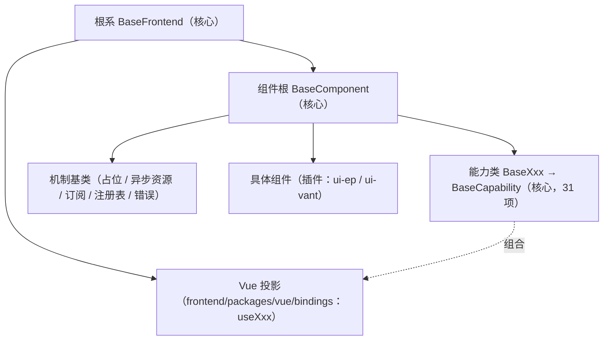

# 前端开发规范

> 本项目 · 前端单仓多包（frontend/packages/* 基座 + frontend/apps/* 宿主）开发约定

[文档首页](../文档首页.md) › 规范 › 前端开发规范　|　[同级：后端开发规范 →](后端开发规范.md)　|　[命名规范 →](命名规范.md)

## 1. 概述 <a id="overview"></a>

本文档定义本项目前端（`frontend/packages/*` 基座包；`frontend/apps/desktop` PC 管理端与 `frontend/apps/mobile` 移动端按同约定执行）的开发规范：
目录约定、TypeScript、Vue 组件、状态管理、权限、布局框架组件、样式、国际化、请求封装、
测试与提交规范。依据《项目规划说明》《架构设计》《命名规范》《文档生成规范》及
《主框架布局设计》《表单框架布局设计》《移动端布局设计》展开，与《后端开发规范》配套。

## 2. 目录约定 <a id="structure"></a>

```text
frontend/apps/desktop/
├── src/
│   ├── api/        # Axios 封装与接口定义（api/user.ts → getUserList()）
│   ├── router/     # 动态路由生成（不硬编码路由表）
│   ├── stores/     # Pinia（useUserStore / useDictStore）
│   ├── views/      # 页面（views/user/UserList.vue）
│   ├── layouts/    # 主布局（侧边栏 + Tab 栏 + 内容区）
│   ├── components/ # 通用组件（PascalCase 单数名词，如 UserForm.vue）
│   ├── i18n/       # 中英文文案（zh-CN.ts / en-US.ts）
│   ├── styles/     # 全局样式与变量（移动端安全区等）
│   └── utils/      # 通用工具与组合式函数（useTabs/useRequest 等）
├── tests/          # 集中测试（与 src 分离；helpers/mount.ts 测试基座）
├── .npmrc          # npm 源（npmmirror）
├── package.json
├── package-lock.json # 依赖锁定（必须提交）
└── .nvmrc
```

- 双工程独立：frontend/apps/desktop 与 frontend/apps/mobile 各自 package.json / lock 与 ESLint/Prettier/TS 配置，互不共享；npm 管理；**前端单仓多包 workspace**（`frontend/packages/*` 见 §3「新体系分层」）
- **包级门禁（S7 工程化批次）**：`frontend/packages/*` 各自 `eslint.config.js`（根 `devDependencies` 统一装 eslint / typescript-eslint / eslint-plugin-vue / vue-eslint-parser / @vue/eslint-config-prettier），各包 `npm run lint`（`--max-warnings 0`）并汇入根 `npm run lint` / `npm run check`（CI `core-check` 自动覆盖）；格式化规则交 Prettier（`skip-formatting`），不在 ESLint 重复
- npm 源与锁定：`.npmrc` 配 npmmirror；`package-lock.json` 必须提交；`legacy-peer-deps` 仅在上游 peer 声明滞后时临时启用并在文件内注明
- **基础类与继承约定（强制）**：公共字段/方法只在基础类维护，模块不得重复实现；体系角色（根系 / 组件根 / 机制基类 / 能力 / 域基类）与扩展约定见第 3 节「前端基类体系」
- 路由 path kebab-case（/user-management）；路由 name PascalCase 与页面组件对应（UserManagement）
- 图片等资源 kebab-case（logo-bms.png）

## 3. 前端基类体系（开放式，强制） <a id="base-class"></a>

与后端《[后端开发规范](后端开发规范.md)》「后端基座体系（强制）」节对齐：前端基类按**角色 + 开放扩展**组织（根系 / 组件根 / 机制基类 / 能力 / 域基类），**公共字段/方法只在对应基类或能力维护，任何组件与模块不得重复实现**；新增能力 = 新增**核心能力类（`BaseXxx extends BaseCapability`）+ 登记（`manifest.ts`）+ 按需投影**，不改根、不设层数/数量上限。**基类清单**（角色、职责、代码位置、依赖、状态）由《[前端基类清单](../前端基类清单.md)》提供，本规范只定强制用法口径；组件契约见组件设计 00 类节点，体系机制见平台《架构设计 · 前端组件体系》。

**新体系分层（S0 ~ S8 落地，强制）**：前端基类体系 = **纯 TS/JS 框架无关核心**（`frontend/packages/core`）+ 可替换渲染插件。单仓多包 workspace：

| 层 | 落点 | 约束 |
| --- | --- | --- |
| 核心 | `frontend/packages/core`（根系 / 机制 / 能力类 / 领域 / 契约；测试工具 `@bms/core/testing`） | **不得依赖 Vue / UI 库 / 插件 / 宿主**（护栏 `guard-core-framework-agnostic.spec.ts`）；能力类必须继承机制基类并登记 |
| Vue 绑定插件 | `frontend/packages/vue`（组合式投影 `useXxx` / 指令 / 令牌样式） | 依赖 core，不依赖 UI 库与宿主；`useXxx` 只存在于此 |
| 渲染插件 | `frontend/packages/ui-ep`（PC，Element Plus）/ `frontend/packages/ui-vant`（移动端，Vant） | 依赖 core + vue；插件之间不互相依赖 |
| 宿主装配 | `frontend/apps/desktop` / `frontend/apps/mobile`（路由 / 菜单运行时 / 页面 / 注入接线） | 依赖插件与 core；宿主不含基座实现 |

**依赖方向（强制）**：宿主 → 插件 → core；**「同接口多实现 + 契约测试同一套断言」**——同一契约由各渲染插件实现，契约用例工厂（`@bms/core/testing`）对全部实现跑同一套断言（案例：容器件 8 件 + `PermButton`（S4b）与反馈件 4 件（03-2-1）在 `ui-ep` / `ui-vant` 双实现全绿）。

### 3.1 强制用法 <a id="base-class-usage"></a>

- **必须从根派生（强制）**：一切基类从根系 `BaseFrontend` / `useFrontendBase` 派生（契约/数据根、组件根、机制基类、域基类同）；UI 组件必须挂到组件根或域基类的组件包装上；能力与域基类不得绕过组件根另起炉灶。
- **必须组合（强制）**：UI 组件与域基类的横切能力**必须经能力取得**（S4 起：核心 `BaseXxx extends BaseCapability` 类化 + 登记，Vue 投影经 `@bms/vue` 的 `createCapability`）；禁止绕过能力在组件内自实现（同后端「禁止绕过 `BaseService` 直连 `BaseRepository`」）。
- **继承与组合分工**：继承承载**身份与家族契约**（根系 → 组件根 → 域基类/机制基类 → 具体组件），组合承载**正交横切能力**（能力 + 投影）；两轨边界见 3.4 节。
- **禁止**：组件/模块重复实现基类或能力已提供的公共字段/方法；绕过基类体系另起炉灶；基类依赖具体组件；能力反向依赖上层；未登记能力存在。
- **依赖方向**：只准上层依赖下层（具体组件 → 域基类/能力 → 组件根 → 根系）；机制基类由组件根统一挂接（经 `mechanisms` 装配点 `attach` / `detach`，组件根释放联动取消订阅 / 释放资源），不直接面向具体组件；层次由依赖关系决定，**不设层数上限**；能力之间依赖须单向并登记（`manifest.ts`）。
- **组件根契约（强制）**：UI 组件经组件根取得通用 props（`size` / `density` / `ns` / `loading` / `disabled` / `visible` / `dataTest`）与**令牌属性协议**——档位只写根元素属性（`data-size` / `data-density`）、状态只加状态类（`is-loading` / `is-disabled`）、可访问性基础（`aria-disabled` / `aria-busy`）由组件根统一产出；组件只消费令牌语义变量（`--bms-size-*` / `--bms-density-*`），**不得硬编码色值与尺寸**；未声明属性经单根元素透传（内部保留键不回传）。
- **组件根契约补充——尺寸硬编码白名单（豁免项，2026-09-16）**：以下结构常量允许直接书写：① 1px 描边 / 分隔线；② 媒体查询断点（`767px` / `768px` 等，断点值无法用 CSS 变量表达）；③ 树形 / 层级递归缩进；④ JS 运行时计算的内联值（弹出层坐标等）；⑤ 组件内置图形与骨架 / 加载形态尺寸（徽标内边距 / 圆角 / 行高、旋转圈、骨架行高、分栏手柄、抽屉宽、下拉最小宽等——令牌化随品牌化任务统一评估，计划登记）。**色值不设豁免**（一律消费令牌，护栏拦截 `#hex` / `rgb()` / `rgba()`）。
- **命名**：核心类（根系 / 组件根 / 机制基类 / 能力类 / 域基类）一律 `Base` 打头——`BaseFrontend` / `BaseComponent` / `BaseCapability` / `BasePlaceholder` / `BaseAsyncResource` / `BaseSubscription` / `BaseRegistry` / `BaseError` / `BaseValue` / `BaseField` …；注册项类型 `RegistryItemLike`；能力 `key` kebab-case；**组合式投影一律落 `frontend/packages/vue/src/bindings/useXxx.ts`**（`useXxx` 只存在于此；根系 / 组件根投影固定名 `useFrontendBase` / `useComponentBase`）——统一遵循《[命名规范](命名规范.md)》「前端命名」节。
- **同一契约多实现（S4 起，替代原「双端同款基线」）**：`frontend/packages/ui-ep`（PC）与 `frontend/packages/ui-vant`（移动端）是**同一契约的两个实现**，不要求字节级同款；一致性由 `@bms/core/testing` 契约用例工厂（同一套断言）与 `@bms/core` 共享逻辑（单实现）共同保证。新增基础能力时：**先落 core / vue（框架无关）**，再按需在各渲染插件提供实现与契约用例——不得只在单端新增导致契约漂移。

### 3.2 扩展规则 <a id="base-class-extend"></a>

- **新增能力 → 新增核心能力类**（`BaseXxx extends BaseCapability`，纯 TS；正交可组合）：形态等预置 31 项只是首批，非封闭枚举；机制横切归机制基类（`frontend/packages/core/src/mechanisms/`：能力机制 `BaseCapability` + `CapabilityRegistry`、占位 `BasePlaceholder`、异步资源 `BaseAsyncResource`、订阅 `BaseSubscription`、注册表 `BaseRegistry` + `RegistryItemLike`、错误 `BaseError`）；**新增域语义 → 新增域基类**（按需：核心能力 + 投影 + 插件包装）——两者均不改动根系 / 组件根。
  - **机制基类契约要点**：占位——三类原因（`pending` / `null` / `stub`）× 三类降级（`empty` / `disabled` / `hidden`），**占位态不发起请求、不写缓存、无副作用**，`stub` 调用统一抛错；异步资源——登记 / **逆序释放** / 幂等 / 释放后拒绝登记 / 单资源失败不阻断；错误——`code` / `userMessage` + 统一响应解析 + 提示映射（i18n `error.{code}` 回退）+ 上报**委托根系**；订阅——`topic` 点分小写且与后端事件表同源、来源解耦（占位总线先行）、取消函数登记异步资源（卸载自动取消）。
  - **能力机制契约要点（强制）**：能力类继承 `BaseCapability`（`key` kebab-case，与《前端基类清单》『能力』节一致）并在 `frontend/packages/core/src/capabilities/manifest.ts` 登记 `depends`（**只登记能力→能力的单向依赖**；节点正文的「协作 / 消费」关系不入表）；开发态校验「依赖已登记 / 无循环 / `key` 合法」，违规默认告警；「不得依赖上层」由核心护栏（import 方向扫描）把关。
  - **注册表契约要点（强制）**：`BaseRegistry<T>`——`register` 同 `key` 唯一性拒重（严格域抛错、一般域告警保留首个）、`get` 未命中返回 `undefined`（不替各域裁决兜底）、`keys` / `values` / `list` 保序、`snapshot` 只读快照（数量取 `count`）；注册项实现 `RegistryItemLike`（`key` + `describe()`）；各域注册表基于基座扩展（如 `CapabilityRegistry`），**不得另起 Map 登记实现**。
  - **错误码段位（强制）**：前端内建码对齐平台段位——`10001` PARAM（能力声明违规）、`10002` PROVIDER_NOT_REGISTERED（扩展点未登记）、`10003` CONFLICT（注册表唯一性冲突）、`10005` RATE_LIMIT、`30001` PERMISSION；前端保留子段 `19xxx`（`19001` 未实现）；不得自造段位或复用平台已发布码。
  - **能力层落点（强制）**：能力类统一落 `frontend/packages/core/src/capabilities/<能力域>.ts`（`BaseXxx extends BaseCapability`，纯 TS；登记表 `frontend/packages/core/src/capabilities/manifest.ts`）+ 领域共享逻辑 `frontend/packages/core/src/domain/` + 契约类型 `frontend/packages/core/src/contracts/`；Vue 组合式投影落 `frontend/packages/vue/src/bindings/useXxx.ts`（`useXxx` 只存在于此）；具体组件落各渲染插件 `frontend/packages/ui-ep|ui-vant/src/components/<域>/`。**旧 `src/components/base/` 能力层已随 S4c / S6 删除**（历史经 git 追溯），新代码一律走上表新体系；能力**不含 UI 视觉与业务语义**，横切能力经根系 / 组件根取得，不得重复实现。
- **新增即登记（对齐后端候选机制）**：候选 → 设计节点（组件设计）→ 评审确认 →《[前端基类清单](../前端基类清单.md)》登记 → 同步《架构设计 · 前端组件体系》；未登记的能力不得散落在具体组件内重复实现。
- 公共逻辑只在所属能力 / 基类维护，具体组件只负责自身特性；修改公共行为改能力 / 基类即可全链生效。
- **兼容性**：新增能力 / 基类为兼容变更；调整既有能力契约（行为 / 参数 / 事件）须评估使用方并升**主版本**标注（组件设计节点与清单同步）。

### 3.3 演进原则 <a id="base-class-evolve"></a>

- 遇职责冲突优先**新增能力**或**插入中间机制**承前启后，每能力只解决一类横切职责；禁止把多类横切职责塞进同一能力，禁止为容纳新类型而扩充封闭枚举。
- 演进示例（形态与域职责冲突 → 拆分 `value` / `field-shell` / `field-perm` 能力消解）见《[前端基类清单](../前端基类清单.md)》「扩展与演进」节。

### 3.4 继承与组合分工（强制） <a id="base-class-composition"></a>

前端基类体系与后端《[后端开发规范](后端开发规范.md)》「后端基座体系」节同构：**继承承载身份与家族契约，组合承载正交能力**；两轨并行、边界清晰，禁止混用（继承链上不得夹带正交能力，能力不得充当家族身份）。

**继承轨（身份与家族契约）**：



- 继承链：根系（通用字段/方法唯一落点）→ 组件根（UI 通用：透传/尺寸密度/主题/可访问性）→ 能力类（正交横切）与具体组件；域基类（按需）为语义归类（核心能力 + 投影 + 插件包装，随域 05+ 回补波重建）；
- 具体组件必须从组件根派生（经 `useComponentBase` 投影）；公共能力只在对应基类 / 能力类维护，改基类 / 能力即全链生效；
- 机制基类（体系公共机制，不是某个组件的能力）供能力与组件根复用，不直接面向具体组件。

**组合轨（正交横切能力）**：

- 能力类 `BaseXxx`（核心，一类一文件）+ 按需投影 `useXxx`（`frontend/packages/vue/src/bindings/`）：单点实现、`key` 唯一、按需组合；组件组合多个能力即可工作，域基类只是可选语义归类；
- 能力依赖须经 `capabilities/manifest.ts` 单向登记，不得循环、不得依赖上层、不得依赖具体组件（核心护栏扫 import 方向）；
- 公共能力只在能力类维护；具体组件只负责自身特性。

**分工判定（新能力落点）**：

| 新能力形态 | 落点 |
| --- | --- |
| 多个组件可自由选配的横切能力（形态 / 值 / 权限 / 数据源 / 上传…） | 新增**核心能力类**（`capabilities/<域>.ts` + `manifest.ts` 登记；投影按需） |
| 同类组件的家族身份与统一契约（输入域 / 展示域 / 树域 / 图表域…） | 新增**域基类**（核心能力 + 投影 + 插件包装，按需） |
| 体系级公共机制（能力声明 / 占位 / 资源释放 / 注册表 / 错误 / 订阅…） | 新增**机制基类**（`frontend/packages/core/src/mechanisms/`） |
| 所有基类共有的横切（日志 / 配置 / 生命周期…） | 上提**根系**（`frontend/packages/core/src/base/`）；所有 UI 组件共有 → 上提**组件根** |
| 视觉 / 交互实现（同契约多端） | 各**渲染插件**（`frontend/packages/ui-ep` / `ui-vant`）+ 契约用例（`@bms/core/testing`） |

### 3.5 执行护栏（指引） <a id="base-class-guard"></a>

本节强制口径由**机器护栏**执行（不依赖自觉）：

- **核心框架无关护栏**（`frontend/packages/core/tests/guard-core-framework-agnostic.spec.ts`）：core 源码零 Vue / UI 库 / 插件 / 宿主依赖 + 包依赖面为空；
- **契约测试套件**（`@bms/core/testing`）：确认 / 权限 / 容器件 / 权限按钮 / 反馈件等契约由各插件跑**同一套断言**——「同接口多实现」的机器保障；
- **能力登记校验**：`capabilities/manifest.ts` 登记 + 开发态依赖校验（`BaseCapability`，违规告警）；
- **清单对账护栏（新体系版）待重建**（候选：`manifest.ts` ↔《前端基类清单》§6 ↔ 插件导出 ↔ 组件清单双向校验），列入域 05+ 前的工程化待办；旧双端 `guard-*`（继承 / 依赖 / 清单 / 演练）随旧层删除，历史经 git 追溯。

以上护栏随 CI `core-check`（根 `npm run check`：lint / typecheck / test）与双端 `test:cov` 执行。**机制未挂接**保持开发态告警（不升级构建期硬失败；再评估触发条件随新护栏批次）。

> 合规审计（基类链 / 能力声明 / 组件根 / 令牌 / 依赖方向 / 双端契约一致性）按《[前端审计规范](前端审计规范.md)》执行：检查维度与现有资产见其附录。

## 4. TypeScript 规范 <a id="ts"></a>

- 变量/函数 camelCase；常量 UPPER_SNAKE；类型/接口 PascalCase；禁止 any（除适配层显式注释）
- 接口类型由 openapi-typescript 从后端 OpenAPI 自动生成（保持前后端契约一致）；手写类型不得与生成类型冲突
- 统一响应类型：type ApiResponse<T> = { code: number; message: string; data: T }；分页响应 { list, total, page, size }
- 严格模式开启（strict）；ESLint + Prettier 强制（CI）

### 4.1 注释规范 <a id="ts-comment"></a>

**注释是交付物的一部分**：组件文档、接口类型注释与后端契约同源；注释一律使用中文（标识符用英文，见《命名规范》）。

| 对象 | 规范 | 示例 |
| --- | --- | --- |
| 组件文件头注释 | JSDoc：组件职责、主要 props/emit、使用场景；每个页面/通用组件必写 | `/**\n * 用户列表页：列表查询 + 双击行打开详情。\n * 与 UserForm 经 FormFrame 约定事件交互。\n */` |
| 函数 JSDoc | @param / @returns；复杂逻辑（状态机、缓存、权限计算）必写说明 | `/** 打开详情 Tab，已打开则激活。 @param item 列表行数据 */` |
| 类型/接口注释 | 字段注释含义，枚举值逐一说明；接口字段与后端字段映射说明（如 deptId ↔ dept_id） | `/** 数据范围规则：字段+运算符+预置变量 */\ntype ScopeRule = {...}` |
| 生成类型注释链路 | 后端接口 docstring → OpenAPI description → openapi-typescript 生成的 TS 类型自带注释；引用生成类型不重复注释，注释不全的字段在业务侧补注 | — |
| 行注释 | 解释"为什么"（why）；复杂表达式、权限指令（v-perm）、边界处理必写 | `// 关闭激活 Tab 后激活左侧相邻，与 VS Code 一致` |
| 模板注释 | `<!-- 说明 -->` 仅在结构不直观处（嵌套插槽、条件块）使用，避免泛滥 | `<!-- 编辑态才显示保存按钮 -->` |
| 标记 | TODO（待办）/ FIXME（已知缺陷）统一前缀，带简述 | `// TODO: 接入游标分页后移除 limit/offset` |

- **类型优先**：TS 类型能表达的语义不重复写注释；禁止为变量名可读的代码加注释
- **禁止**：逐行废话注释、注释掉的代码（一律删除，需要时从 git 找回）、与代码不同步的过期注释
- 组件 props 定义处逐项注释（编辑器悬停提示即组件文档）；emit 事件说明触发时机
- 注释随代码变更同步更新；组件职责变化必须同步文件头注释

## 5. Vue 组件规范 <a id="component"></a>

### 5.1 SFC 结构 <a id="component-sfc"></a>

- 组合式 API（<script setup lang="ts">）；组件名 PascalCase 单数名词；文件名与组件名一致
- 需要被 keep-alive 缓存的组件（Workbench / FormFrame）显式声明 name（defineOptions）
- SFC 顺序：template → script → style（scoped）；样式类名 kebab-case（BEM 简化：.user-form）
- 逻辑提取：组件内逻辑超过约 200 行拆组合式函数（src/utils 或 components/ 同级 composables）

### 5.2 props / emit 约定 <a id="component-props"></a>

- props 用 withDefaults + 类型定义；事件名 kebab-case（open-detail / title-change）；emit 显式声明
- 列表页与表单页通过 FormFrame 约定交互（见第 8 节），禁止跨组件直接访问内部状态
- 表单页 expose 脏数据状态（dirty）供 FormFrame 拦截确认

## 6. 状态管理（Pinia） <a id="store"></a>

- store 命名 use + 模块 + Store（useUserStore / useDictStore）；按模块拆分，禁止单一巨型 store
- 服务端数据不重复存 store（列表/详情数据由页面组件管理，store 只存会话、权限、配置等全局态）
- 页签状态为模块级组合式（非 store）：`@bms/vue` `useTabs` 投影（核心 `BaseTabs` 单源）+ 宿主 `adapters/use-app-tabs.ts` 桥接（路由联动 / 缓存键 / localStorage `bms_open_tabs`）

## 7. 动态菜单与权限 <a id="perm"></a>

- 菜单树由后端按权限动态下发（含 locale 翻译），前端动态注册路由与生成侧边栏，禁止硬编码路由表
- 按钮显隐：v-perm="'业务:动作'" 指令（默认无按钮权限）；字段权限按表单元数据 visible/editable 渲染
- 路由守卫：校验登录态与权限码，无权限跳 403 页（或首页）；地址栏直达无权限路由同样拦截
- 权限码变更（角色/授权）后刷新权限缓存（后端版本号机制），前端重新拉取菜单
- **实现口径（现行）**：权限码集合与判定唯一来源为核心能力 `BaseAccess` + `@bms/vue` `useAccess` 投影；`usePermissionStore`（`frontend/apps/*/src/stores/permission.ts`）仅应用态汇聚（集合 / 菜单 / 版本 / 加载编排）；`v-perm`（`frontend/apps/*/src/directives/perm.ts`，双端注册）支持 anyOf / `.all` / `.not`，无权限移除 DOM、权限恢复回插；脚本场景经宿主 `hasPerm` / `canAccess`（`frontend/apps/*/src/utils/perm.ts`）→ 插件注入点 `checkPerm`（宿主装配经 `adapters/ui-bootstrap.ts`）；路由守卫注册与 403 页随后续任务。

## 8. 布局与框架组件约定 <a id="layout"></a>

### 8.1 Tab 与路由 <a id="layout-tabs"></a>

- 顶层 Tab 由 useTabs 管理：激活 Tab 同步路由 push；前进/后退驱动激活；直接访问先建后激活（详见《主框架布局设计》）
- Tab 标题取菜单名（locale 翻译）/meta.title，不直接用路由 name；白名单 ALLOWED_PATHS 过滤
- localStorage key 统一 bms_ 前缀（bms_open_tabs / bms_menu_expanded）

### 8.2 FormFrame / FormDetailPanel <a id="layout-frame"></a>

- 实体页面路由组件统一 FormFrame（路由 props 注入 title/listComponent/detailComponent）
- 视图名 → 组件映射：经插件注入点 `resolveView`（宿主 `adapters/ui-bootstrap.ts` 接路由视图工具；未注册回退占位视图并开发态告警，防菜单配置错误白屏）
- 表单页复用 FormDetailPanel（只读/编辑分态、信息栏、主表+明细）；用户等简单表单自行实现
- 表单内 Tab 为页面内部状态（FormFrame 内维护），不参与顶层 useTabs 与持久化

### 8.3 列表页 / 表单页约定 <a id="layout-list-form"></a>

- 职责分离：列表页与表单页独立组件文件，仅通过约定事件交互（open-detail / saved / deleted / title-change / fetchList / dirty）
- 列表页公共逻辑（分页/查询/刷新）优先用 `useListPage`（`src/utils/useListPage.ts`）；异步状态与竞态用 `useRequest`；表单校验用 `validators` 规则工厂
- 列表页无操作列，双击行打开详情（移动端点击进入）；分页 page/size + 筛选参数
- 保存：整体提交主表+明细（单事务）；携带 version 乐观锁；保存后刷新列表
- 脏数据保护：切换/关闭 Tab 前确认（详情见《表单框架布局设计》）

## 9. 样式规范 <a id="style"></a>

- SCSS + Element Plus 主题变量定制；避免引入重型 CSS 方案
- 设计令牌：唯一来源 `frontend/apps/*/src/styles/tokens.scss`（基础令牌五组 `--bms-color-*` / `--bms-font-*` / `--bms-space-*` / `--bms-radius-*` / `--bms-shadow-*` + size / density 档位）；间距用数字步进 `--bms-space-{n}`（n × 4px）；组件只消费令牌语义变量，**不得硬编码色值与尺寸**；Element Plus / Vant 主题变量由 tokens.scss 映射（色阶经 `color-mix()` 运行时派生）；**新增令牌先登记后使用**（暗色 / 租户品牌覆盖随后续任务）
- 深色/浅色主题：CSS 变量驱动切换，主题偏好持久化（sys_user_preference）+ localStorage 临时态
- 类名 kebab-case（BEM 简化）；组件内样式 scoped；全局样式仅放全局变量/混入
- 空态与加载分级：空状态优先**文案引导**（空态组件按场景矩阵；插画统一各插件 `src/assets/images/empty-*.svg`（`ui-ep` / `ui-vant` 自足），kebab-case，不内联大段 SVG）；首屏用骨架屏、局部刷新用内容遮罩（`delay` 防闪）、按钮提交用按钮内 loading（EP 自带）；错误页**不展示技术堆栈**，独立路由 `/403` `/500` 与未知路径兜底 `/404`（`03_02`）
- 移动端（Vant）：postcss px→vw 视口适配（设计稿 375、保留 1px，兼容问题可切 rem）+ 安全区 `env(safe-area-inset-*)` 变量
- **浏览器能力降级（2026-09-16 登记）**：基线为现代浏览器（Chromium 系）；关键能力缺失一律提供降级态——Fullscreen API 不可用 / 被拒 → 固定铺满降级（`FullscreenContainer`）；CSS `aspect-ratio` 不支持 → padding-top 技巧（`AspectRatio`）；`ResizeObserver` / `IntersectionObserver` 缺失 → 尺寸回调（`offsetHeight`）/ 直接渲染降级

## 10. 国际化 <a id="i18n"></a>

- 文案不硬编码：vue-i18n 语言包运行时从后端拉取（Redis 缓存 + localStorage 二次缓存）
- i18n key 点分：模块.页面.字段（user.form.username、common.confirm）；错误码按 error.{code} 映射
- RTL 布局按 sys_i18n_locale.rtl 切换；时间/数字按用户时区与 Intl 本地化
- **实现口径（现行）**：格式化纯函数落 `frontend/apps/*/src/utils/format.ts`（一律 `Intl`、按用户时区 / locale、空值与非法值占位；默认基准经 `configureFormatDefaults` 注入，时区偏好经 `useTimezone` 占位管理）；名义格式化器注册表随展示域回补波按新体系重建（原能力层 `formatters.ts` 已随旧层删除）；校验规则工厂落 `frontend/apps/*/src/utils/validators.ts`（空值跳过、必填归 `required`）。

## 11. 请求封装 <a id="http"></a>

- Axios 统一实例：请求拦截器注入 Bearer access token（access token 仅存内存）；响应拦截器统一处理 {code, message, data}
- 请求统一经 `request<T>()` 解开 `{code, message, data}`；模块 API 继承 `BaseApi`（`src/api/base.ts`），禁止绕过基类裸用 axios
- 401 静默刷新（refresh 轮换）；刷新失败跳登录；会话失效（session.revoked）强制登出
- 统一错误提示（Toast/Message）；业务错误码映射 i18n 文案
- 写接口带幂等键（Idempotency-Key）；列表接口统一分页参数
- **实现口径（现行）**：请求层落 `frontend/apps/*/src/api/{http,request,error,token,adapter}.ts`（两宿主同契约；核心不依赖 UI 库与路由）；提示 / 登录与 403 跳转 / 刷新处理器经 `configureHttpAdapter` 各端入口注入；**未注入 `refreshHandler` 时 401 按会话失效占位**（清会话 + 跳登录、不请求）；业务错误码在 `request` 层判定并抛 `ApiError`（继承核心 `BaseError`），文案走 i18n `error.{code}`；`BaseApi` 继承核心 `BaseFrontend`，写方法自动生成 `Idempotency-Key`。

## 12. 测试 <a id="test"></a>

- Vitest：单元/组件测试统一放 `tests/`（与 src 分离），文件 `模块.spec.ts`（`utils.spec.ts`、`UserForm.spec.ts`）；覆盖核心组件与组合式函数
- 组件测试统一用 `tests/helpers/mount.ts` 的 `mountWithPlugins`（预挂 pinia/i18n，可选 router）
- Playwright E2E：功能描述命名（login.spec.ts）；覆盖登录、RBAC 权限（按钮显隐与字段权限）、核心 CRUD 主流程
- E2E 环境：CI 服务容器起 backend（SQLite）与前端产物
- 组件测试断言：渲染、事件、权限指令行为（v-perm 显隐）

## 13. 提交规范 <a id="git"></a>

| 项 | 约定 | 示例 |
| --- | --- | --- |
| 提交信息 | `type(scope): 中文描述`；type：feat/fix/docs/refactor/test/chore | `feat(tabs): Tab 溢出更多按钮` |
| 分支 | `类型/描述` | `feature/user-management` |
| PR 合入 | CI 通过（ESLint + Vitest + 构建 + 体积预算 + Playwright E2E）方可合并 | — |

## 14. 构建体积预算 <a id="budget"></a>

- 门禁：`npm run budget`（`scripts/check-bundle-budget.mjs`，零依赖）统计 `dist` 下 js/css 的 gzip 体积，
  与工程根 `budget.json` 的 `totalGzipKb` / `largestGzipKb` 比较，超限退出码 1；
  已挂 CI 双端 `build` job（构建后自动跑）。
- 阈值口径：初次落地取「当前基线 + 20%」（2026-09-15：`frontend/apps/desktop` 85 / 63 KB，`frontend/apps/mobile` 83 / 83 KB）；
  因需求增长需放宽时，在同一提交中调整 `budget.json` 并说明原因（评审可见）。**调整记录**：2026-09-16 `frontend/apps/desktop` 85 / 63 → **100 / 75 KB**（原因：请求层统一错误提示引入 `ElMessage` 与消息样式，`02_06_01`）；2026-09-16 `frontend/apps/desktop` 100 / 75 → **130 / 90 KB**（原因：错误页独立路由 chunk 与 EP 按钮样式、i18n 文案入产物，域 03 组件将持续增长，`03_02`）；2026-09-16 `frontend/apps/desktop` 130 / 90 → **200 / 100 KB**（原因：宿主完整装配（守卫 / 基座 / axios 链）与组件库代码进入产物，此前未被引用被 tree-shake，`03_05`）；2026-09-16 `frontend/apps/desktop` 200 / 100 → **240 / 120 KB**（原因：S5a 切流后基座新体系（`@bms/core` + `@bms/vue` + `@bms/ui-ep`，源码直出）合入产物，S5c 切流收口记录）；2026-09-17 `frontend/apps/mobile` 83 / 83 → **140 / 83 KB**（原因：S4b / S4c 移动端切流消费共享框架 + `ui-vant` Vant 对话框资源，经用户确认放宽，见实施记录 19）。
- 定位：防「悄悄变大」的早期预警，不替代性能优化（缓存、懒加载、拆包按《项目规划说明》性能设计执行）。

> 依《文档生成规范》编写 · 与《后端开发规范》《命名规范》《架构设计》《布局设计》配套
