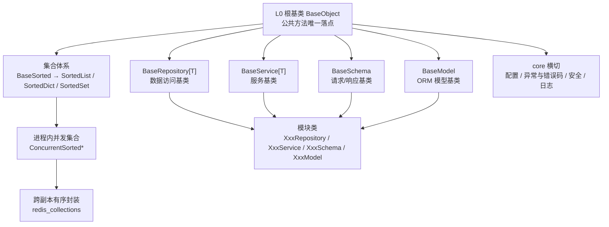
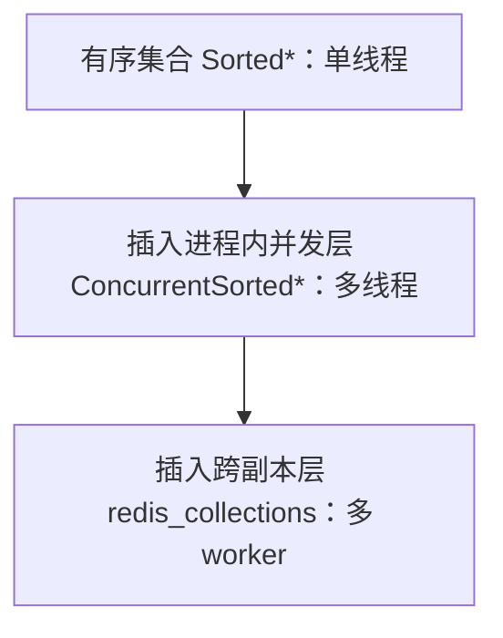

# 后端开发规范

> 本项目 · backend（FastAPI）开发约定

[文档首页](../文档首页.md) › 规范 › 后端开发规范　|　[同级：前端开发规范 →](前端开发规范.md)　|　[命名规范 →](命名规范.md)

## 1. 概述 <a id="overview"></a>

本文档定义本项目后端（backend，FastAPI）的开发规范：基座体系、分层职责、编码与命名、异常与错误码、接口开发、SQL 与数据访问、异步并发、事件任务、测试写法与提交规范。
依据《项目规划说明》《架构设计》《命名规范》《文档生成规范》展开，与《前端开发规范》配套。**后端基座体系与平台《架构设计 · 后端基础类体系》同源**——架构节点定分层、基类清单与阶段落地，本规范定强制用法口径；与之对称的前端口径见《[前端开发规范](前端开发规范.md)》「前端基础类体系」节。

## 2. 目录与分层职责 <a id="structure"></a>

```text
backend/
├── app/
│   ├── core/         # 配置、安全、异常与基座（config/security/exceptions/base/collections/concurrent/redis_collections）
│   ├── api/          # 路由层（按模块），依赖注入；只做参数校验与路由分发
│   ├── models/       # SQLAlchemy 模型（按模块文件，如 user.py）
│   ├── schemas/      # Pydantic 请求/响应模型（XxxCreateRequest/XxxResponse）
│   ├── services/     # 业务逻辑与事务边界（XxxService）
│   ├── repositories/ # 数据访问，多数据源/分片路由（XxxRepository）
│   ├── db/           # 异步引擎、AsyncSession 工厂、读写分离路由
│   ├── tasks/        # Celery 任务定义（snake_case 动词短语）
│   ├── ws/           # Socket.IO 连接与会话事件
│   └── i18n/         # 国际化管理（语言包接口、运行时翻译）
├── alembic/          # 迁移脚本（MySQL / PostgreSQL / 达梦 DM8 三套方言）
├── benchmarks/       # 微基准脚本（手动执行，CI 不跑）
├── typings/          # 局部类型存根（pyright stubPath）
├── tests/            # pytest（api/、core/、repositories/、services/、schemas/、integration/）
├── config.toml
├── pyproject.toml
└── README.md
```

| 层 | 职责 | 禁止 |
| --- | --- | --- |
| api | 参数校验、路由分发、依赖注入（require_permission 等） | 禁止直接操作模型 / 写业务逻辑 |
| services | 业务逻辑、事务边界（with session.begin()）、事件发布 | 禁止直接拼 SQL / 绕过 repositories |
| repositories | 数据访问、数据源与分片路由、数据范围注入 | 禁止承载业务规则 |
| models / schemas | ORM 模型 / Pydantic 模型 | 禁止在 models 写业务逻辑 |

- **基座与继承约定（强制）**：公共字段/方法只在所属基类维护，模块类只写差异部分，不得重复实现、不得绕过基类另起炉灶；完整分层（L0 根基类 + 集合体系 + 模块基类 + core 横切）、各层职责、继承链与扩展规则见第 3 节「后端基座体系」

## 3. 后端基座体系（强制） <a id="base-class"></a>

与前端「基础类体系」对称：后端所有**基类**收敛为一套分层体系，**公共字段/方法只在对应层基类维护，任何模块不得重复实现**；调整某一层基类即全链生效（无需逐模块改造，适配上百模块与海量接口场景）。基座以 **L0 根基类 `BaseObject`** 为根，向上分出三条支线——**集合体系**（有序 / 进程内并发 / 跨副本）、**模块基类**（`BaseRepository` / `BaseService` / `BaseSchema` / `BaseModel` 等）、**core 横切基座**（配置 / 异常 / 安全 / 日志）；有新的类类型就加一种基类，有新的横切能力就加一层基类。本规范为**后端基座体系的权威**（强制用法口径），分层与基类清单见平台《架构设计 · 后端基础类体系》，详细契约见项目骨架 01-3-1《基础类详细设计》。

### 3.1 分层总览 <a id="base-class-layers"></a>



| 层 / 支线 | 基类 / 能力 | 形态 | 父层 | 职责 |
| --- | --- | --- | --- | --- |
| L0 | 根基类 `BaseObject` | 类 | — | 一切可继承后端类之根：公共方法唯一落点 |
| 集合 | 有序集合 `BaseSorted` → `SortedList`/`SortedDict`/`SortedSet` | 类 | L0 | 插入即有序；对外输出稳定序 |
| 集合 | 进程内并发集合 `BaseConcurrentSorted` → `ConcurrentSorted*` | 类 | `BaseSorted` | 多线程共享：原子 / 快照语义 |
| 集合 | 跨副本有序封装 `RedisSortedSet` / `RedisSortedDict` / `RedisSnapshot` | 类 | `BaseObject` | 多 worker / 跨副本共享：Redis 为事实源 + 只读快照 + 版本号 |
| 模块基类 | 数据访问基类 `BaseRepository[T]`（契约）/ `BaseMemoryRepository[T]`（内存基线）/ `BaseDbRepository[T]`（DB 骨架） | 抽象类 | L0 | CRUD 契约 + 派生方法 + 数据源 / 分片路由 |
| 模块基类 | 服务基类 `BaseService[T]` / 事务扩展层 `BaseTransactionalService[T]` | 类 | L0 | 通用 CRUD 委派仓储 + 统一不存在语义；事务边界 |
| 数据访问横切 | 工作单元 `UnitOfWork`（`NullUnitOfWork` 占位） | 类 | — | 统一事务公共方法 `begin` / `commit` / `rollback` |
| 模块基类 | 请求/响应基类 `BaseSchema` | 类（多重继承 Pydantic） | L0 | Pydantic 公共配置与统一序列化 |
| 模块基类 | ORM 模型基类 `BaseModel` | 类 | L0 | ORM 公共字段与约定（雪花 ID / 软删除 / 审计 / 乐观锁 / 四库类型映射） |
| 横切 | `BizError` 体系 / 配置 / 安全 / 日志 | 类 / 模块 | — | 统一异常与错误码、配置读取与环境覆盖、安全原语、结构化日志 |
| — | 模块类 | — | 对应基类 | `XxxRepository` / `XxxService` / `XxxCreateRequest`·`XxxResponse` / `XxxModel` |
| — | 跨阶段基座 | — | — | 缓存 Region 分域 / 数据范围注入 / 分片路由 / 事件发布消费 / 任务基座 / ORM 审计捕获（见《架构设计 · 后端基础类体系》「阶段落地」节） |

### 3.2 L0 根基类 <a id="base-class-l0"></a>

- 形态：普通类 `BaseObject`；**所有可继承的后端类默认从其派生**（模块基类、集合类）。
- 提供：公共方法唯一落点——序列化、稳定序序列化、统一字符串输出、主键相等与哈希；序列化取字段**声明字段优先**（dataclass → `dataclasses.fields`；Pydantic → `model_dump()`；其余 → `__dict__` 兜底）；不含任何业务或框架语义。
- 约束：L0 只放"所有后端类共有"的横切能力；任一方的特有逻辑（数据访问流程、序列化配置、并发保护）不得上提 L0。

### 3.3 集合体系（有序 / 进程内并发 / 跨副本） <a id="base-class-collections"></a>

集合是后端公共数据形态，按共享范围自小到大**逐层演进**，层数与形态随需扩展（见 3.7 / 3.8）：

- **有序集合（强制）**：集合对象使用有序集合（插入即有序）；**对外输出必须稳定序**，禁止直接输出裸 `set`；公共位置（API 响应、日志字段、任务参数 / 结果、配置映射、缓存值与导出数据）一律使用有序集合，局部临时变量不限。
- **进程内并发（强制）**：多线程共享走并发集合（`ConcurrentSorted*`，锁策略由 `LockStrategy` 显式传入，默认 `RW`，另有 `RLCK` / `SHARDED` / `SNAPSHOT`），读写与遍历须满足原子 / 快照语义；锁内不得做 IO 与外部回调。
- **跨副本共享（强制）**：跨副本 / 多 worker 共享走跨副本有序封装（`RedisSortedSet` / `RedisSortedDict` / `RedisSnapshot`，Redis 为事实源）；**禁止进程内集合跨副本共享**。

三种形态的锁策略、原子方法、key 规范与复合操作语义见《架构设计 · 后端基础类体系》与《并发集合与并发安全详细设计》。

### 3.4 模块基类（数据访问 / 服务 / 契约 / 模型等） <a id="base-class-module"></a>

模块基类是**平行的兄弟基类**（各自继承 `BaseObject`，互不继承）；模块类分别继承对应基类。它们之间是**调用链**（服务调用仓储、仓储操作模型），不是继承层级。以上为当前已确定的模块基类，出现新的类类型时按 3.7 扩展规则新增基类，数量不固定。

- `BaseRepository[T]`：仓储**契约**——CRUD 抽象 + `exists` 派生方法 + 数据源 / 分片路由钩子；只定契约，不含存储实现。
- `BaseMemoryRepository[T]`：内存基线（字典存储 + 自增 ID），继承契约层，子类只实现 `_build` / `_apply`；作为测试替身 / 骨架期实现。
- `BaseDbRepository[T]`：数据库实现骨架（占位、不连库），继承契约层；真实实现（异步引擎 / 会话 / 多源读写路由）随阶段二数据访问底座接入。
- `BaseService[T]`：通用 CRUD 委派仓储；不存在语义由基类统一抛出；模块服务只写业务规则，不得拼 SQL、不得跨模块直连仓储。
- `BaseTransactionalService[T]`：事务扩展层，继承 `BaseService[T]`；写操作经 `UnitOfWork` 进入事务、读操作不包事务；需事务的模块服务继承本类，无事务需求的通用服务留在 `BaseService[T]`。
- `UnitOfWork`（工作单元，`db/unit_of_work.py`）：统一事务公共方法（`begin` / `commit` / `rollback`）；占位 `NullUnitOfWork` 无副作用，真实实现（`DbUnitOfWork`，基于 `AsyncSession`）随阶段二数据访问底座接入；事务相关横切只改此处。
- `BaseSchema`：Pydantic 公共配置，并继承 `BaseObject` 获得统一序列化（声明字段优先）；请求/响应模型**必须**继承，禁止直接继承 `pydantic.BaseModel`。
- `ApiResponse`（`schemas/common.py`）：统一响应契约 `{code, message, data}`，继承 `BaseSchema`；列表分页 `data` 使用分页契约基类。
- `ErrorCode`（`core/error_codes.py`）：平台错误码与段位（`ErrorCode` / `ErrorSegment`）登记点；模块错误码按注册段位各自登记，禁止占用平台段、禁止复用已发布码。
- 分页契约基类（`schemas/pagination.py`）：`BasePageQuery` / `BasePageResponse[T]`（页码）、`BaseCursorQuery` / `BaseCursorResponse[T]`（游标），均继承 `BaseSchema`；列表接口统一使用，不得各自定义分页结构。
- `BaseModel`：ORM 公共字段与约定（雪花 ID、软删除、审计字段、乐观锁、四库类型映射）；审计由 ORM 事件自动填充（业务代码禁止手动赋值）、乐观锁用 `version_id_col`；L0（公共字段与约定），多租户 / 数据范围 / 审计捕获等横切按插层回补；业务模型**必须**继承，禁止重复声明公共字段。
- `BaseXxx`（命名与扩展）：模块基类统一以 `Base` 前缀命名；上列为当前已确定的模块基类，出现新的类类型（如新数据源形态、新契约形态）时按同一规则新增基类，数量不固定。

### 3.5 core 横切基座 <a id="base-class-core"></a>

- **配置基座**：配置分区 + 环境变量覆盖 + 启动校验；敏感项只走环境变量，不入库、不入镜像。
- **异常与错误码**：`core/exceptions.py` 统一异常基类 `BizError`（携带错误码 / `http_status` / `data`）+ 骨架子类（10000/10001/10002/10003/10004/20001/30001）；业务异常在 services 层抛出，`api/errors.py` 全局处理器统一转统一响应 `ApiResponse`；错误码分段见第 6 节「异常与错误码」与《架构设计 · 接口与集成》，模块不得自定义响应结构或错误码段。
- **安全基座**：密码哈希、令牌与会话安全原语收敛到统一安全模块，供认证与会话复用；模块不得自行实现哈希 / 令牌逻辑。
- **日志基座**：结构化日志 + 链路追踪贯穿（见「日志与可观测性」节）；基类与模块不得绕过统一日志门面直接 print 或另起 logger。
- **稳定序列化**：`core/serialization.py` 统一稳定 JSON（键排序、中文不转义、不可序列化值降级 str）；基类、集合与 Redis 封装一律复用，不得各自实现序列化参数（改口径只改一处）。
- **并发锁原语**：`core/locking.py` 统一锁策略 `LockStrategy`、读写锁 `ReadWriteLock` 与策略守卫 `LockGuard`（`ReadWriteLock` / `LockGuard` 继承 `BaseObject`）；需锁模块一律复用，不得各处自研锁。
- **雪花 ID**：`core/id.py` 标准雪花 41+10+12（`SnowflakeGenerator` 继承 `BaseObject`）；WorkerId 由 `BMS_WORKER_ID` / 配置基座注入，全局唯一由部署保证。

### 3.6 继承与实现约定 <a id="base-class-inherit"></a>

- **继承链**：模块类 → 对应基类 → `BaseObject`；`BaseSchema → (pydantic.BaseModel, BaseObject)`；`ApiResponse → BaseSchema`；集合类 `Sorted*` → `BaseSorted` → `BaseObject`、`ConcurrentSorted*` → `BaseConcurrentSorted` → `BaseSorted` → `BaseObject`；仓储 `BaseMemoryRepository` / `BaseDbRepository` → `BaseRepository` → `BaseObject`；事务服务 `BaseTransactionalService` → `BaseService` → `BaseObject`；异常 `BizError` → `BaseObject`、子类 → `BizError`。
- **依赖方向**：只准上层依赖下层，**禁止反向依赖**（`core/` 不得依赖 `api/`/`services/`/业务模块；`repositories/` 不得依赖 `services/`）；跨模块协作走 services。
- **命名**：基类 `BaseXxx`、集合类 `Sorted*`/`ConcurrentSorted*`、模块类 `XxxRepository`/`XxxService`/`XxxSchema`/`XxxModel` 统一遵循《命名规范》「后端命名」节。
- **目录**：L0、集合与横切在 `app/core/`；模块基类在 `app/repositories/`、`app/services/`、`app/schemas/`、`app/models/`；具体文件见《架构设计 · 后端基础类体系》「基类清单与继承链」节。
- **多重继承克制**：仅 `BaseSchema` 因混合 Pydantic 使用多重继承；其余横切能力以基类方法或组合实现，禁止为复用横插无关基类。
- **禁止**：模块类重复定义基类已提供的公共字段/方法；绕过 `BaseService` 直连 `BaseRepository`；另起炉灶新建平行的 CRUD / 序列化 / 并发 / 异常实现。

### 3.7 扩展规则 <a id="base-class-extend"></a>

- **加类型**：出现新的类类型（新集合形态、新数据源形态、新契约形态）→ 新增对应基类；**加扩展**：出现新的横切能力（多租户强制过滤、限流、灰度路由、审计捕获等）→ 新增一层基类。
- 公共逻辑只在所属层基类维护，模块类只负责自身差异；修改公共行为改基类即可全链生效。
- 新增/调整基类须同步：本规范「后端基座体系（强制）」节 + 平台《架构设计 · 后端基础类体系》「基座分层」「基类清单与继承链」登记 + 对应阶段任务基座清单登记 + 相关详细设计。
- **基座未就位，后端模块不得开工**：否则 CRUD、序列化、并发保护、异常语义会在每个模块重复实现，口径发散；跨阶段回补项须在对应阶段任务列表登记为**前置**，模块不得自行实现临时版本。

### 3.8 分层演进示例：冲突时插入中间层（可多层） <a id="base-class-example"></a>

分层不是一次定死，而是**遇到职责冲突或共享范围扩大就插入中间层承前启后**；同一冲突可能不止一处，可插入**多层**，每层只解决一类横切职责（加层优先于在既有层堆逻辑）。

**示例一（共享范围扩大 → 逐层加层，本体系已发生的真实演进）**：集合从"单线程有序"起步（`BaseSorted` → `Sorted*`）；出现多线程共享后，处理方式不是在每个使用点各自加锁，而是**插入进程内并发层** `BaseConcurrentSorted` → `ConcurrentSorted*`（原子操作 + 快照遍历）；再出现跨副本 / 多 worker 共享，又**插入跨副本层** `redis_collections`（Redis 为事实源 + 只读快照）。三层各自只解决一类共享问题，下层完全不动。



**示例二（实现口径切换 → 停在基类改，不动模块类）**：阶段一交付的 `BaseRepository`/`BaseService` 为**同步实现**；阶段二落地数据访问底座时引入全链路异步，处理方式是**在基类统一切换异步**（调用面改动集中一次），而不是逐个模块类改造；达梦同步驱动例外口径按《架构设计 · 数据访问与分片》与「异步与并发」节执行。

- **可继续加层**：若后续出现新横切职责（如"多租户强制过滤""限流""灰度路由""审计捕获"），按同一办法再插一层（如 `BaseTenantScoped`、`BaseRateLimited`），插在合适的两层之间，**不动其它层**。
- 原则：**改一层即全链生效**；禁止把多类横切职责塞进同一层，导致后续无法只调整某一类。

## 4. Python 编码规范 <a id="python"></a>

- 命名：snake_case（函数/变量）、PascalCase（类）、UPPER_SNAKE（常量）、私有成员单下划线前缀；模块名名词（user_service.py）；详见《命名规范》
- 全部公开函数与成员必须有类型注解（pyright 严格模式校验，CI 强制）
- lint/format：ruff（CI 强制）；禁止未使用导入、避免 except 裸异常
- Pydantic v2：请求/响应模型与 ORM 解耦；响应模型显式声明，禁止直接返回 ORM 对象
- 依赖注入：参数名小写（db: AsyncSession、redis: Redis）；禁止在函数内手动创建全局引擎/会话

### 4.1 注释规范 <a id="python-comment"></a>

**注释是交付物的一部分**：代码注释、接口文档、数据库注释同源维护；注释一律使用中文（代码标识符用英文，见《命名规范》）。

| 对象 | 规范 | 示例 |
| --- | --- | --- |
| 模块 docstring | 文件顶部，说明模块职责与主要对外对象；每个 .py 文件必写 | `"""用户模块：模型、服务与仓库的聚合定义。"""` |
| 函数/方法 docstring | Google 风格：功能一句话 + Args + Returns + Raises；公开 API（services/repositories/任务）必须写，私有方法复杂逻辑必写 | `"""创建用户。\n\nArgs:\n    req: 用户创建请求。\n\nReturns:\n    新建用户 ID。\n\nRaises:\n    BizError: 用户名已存在（30001）。\n"""` |
| 接口（路由）docstring | summary（一句话）+ description（用途、关键参数、权限码、业务约束）——**自动进入 OpenAPI（swagger.json）并随契约导出给外部系统与前端类型生成**，必须完整书写 | `"""创建用户。\n\n需要 user:create 权限；支持幂等键；用户名全局唯一。\n"""` |
| 模型字段 | SQLAlchemy 模型字段写 comment（中文），成为数据库表注释 | `Column(String(64), comment="用户登录名")` |
| 行注释 | 解释"为什么"（why），不解释"是什么"（what）；复杂逻辑（算法、状态机、跨系统交互、并发控制）必须注释 | `# 先删缓存再返回，避免并发下读到旧值` |
| 标记 | TODO（待办）/ FIXME（已知缺陷）/ HACK（临时方案）统一前缀，带简述 | `# TODO: 接入配额校验后移除临时限制` |

- **类型注解优先**：类型注解能表达的语义（参数类型、返回值、Optional）不重复写注释
- **禁止**：逐行废话注释（"此处加 1"）、注释掉的代码（一律删除，需要时从 git 找回）、与代码不同步的过期注释
- 枚举/常量：定义处注释业务含义（如 lock_type 各值含义）；配置项（config.toml）逐项注释说明
- docstring 与代码变更同步更新；改逻辑必查影响注释

## 5. 模块组织 <a id="module"></a>

- 按模块分组：app/api/user/、app/models/user.py、app/services/user_service.py、app/repositories/user_repository.py；模块目录用单数名词
- 路由注册：模块内 APIRouter(prefix="/users", tags=["user"])，在应用工厂统一 include
- 权限码声明：路由装饰器/依赖声明 require_permission("业务:动作")，与菜单/按钮挂接一致
- 新增模块四件套：models + schemas + services + repositories（+ api 路由），缺一不可
- **基座与继承约定（强制）**：模块类**必须**继承对应基类——`XxxRepository → BaseRepository[T]`、`XxxService → BaseService[T]`、请求/响应模型 → `BaseSchema`、ORM 模型 → `BaseModel`（阶段二）、公共方法经 `BaseObject` 落点；模块类只写差异部分，**禁止**重复定义基类已提供的公共字段/方法，禁止绕过基类另起炉灶（新公共能力加到基类，改一处全局生效）。各层职责、继承链与扩展规则见第 3 节「后端基座体系」，代码位置见第 3.6 节

## 6. 异常与错误码 <a id="error"></a>

### 6.1 统一响应 <a id="error-response"></a>

- 统一响应 `{code, message, data}`；code=0 成功，非 0 为业务错误码；HTTP 状态码与业务错误码分离
- 分页响应 `{list, total, page, size}`；大数据量游标分页 `{cursor, limit}`
- 文案由前端按错误码 i18n 映射（`error.{code}`），后端不承担文案拼装

### 6.2 错误码分段 <a id="error-code"></a>

平台段 1xxxx~9xxxx 分段表（一经发布稳定不变、按段内序号递增、禁止复用已发布码）见平台《架构设计 06 接口与集成》；产品业务扩展段（10xxxx 起）分配见《项目规划说明》"平台扩展接入流程"节。

### 6.3 异常使用规则 <a id="error-usage"></a>

- 统一自定义异常基类（core/exceptions），携带错误码与参数；全局异常处理器统一转换为 `{code, message, data}`
- 业务异常在 services 层抛出（raise BizError(code=..., detail=...)），api 层不 catch 业务异常
- 参数校验：Pydantic 校验优先；自定义校验失败抛统一参数异常（1xxxx 段）
- 不向外暴露堆栈与内部细节（生产环境）；异常日志记录完整堆栈（含 trace_id）

## 7. 接口开发规范 <a id="api"></a>

### 7.1 RESTful 与路径 <a id="api-rest"></a>

- 前缀 /api/v1；资源复数名词（/users、/departments），子资源嵌套（/users/{id}/roles）
- 动词交给 HTTP 方法：GET 查、POST 建、PUT 全量改、PATCH 部分改、DELETE 删；动作类动词短语（/auth/login、/users/{id}/reset-password）
- 分页参数 page（从 1 起）/size；筛选查询参数；排序 order_by（白名单字段）
- 响应字段命名与数据库字段映射（dept_id ↔ deptId 由 openapi-typescript 契约同步）
- ID 口径：雪花主键/外键出参 `str(id)`、入参转 `int`；数据库 BIGINT 与 JOIN 不变（见《API接口规范》「统一响应」节）

### 7.2 鉴权与权限 <a id="api-auth"></a>

- 除登录/刷新/健康检查外一律 Bearer access token；依赖注入获取当前用户与租户上下文
- 权限两级校验：业务级（表单入口/表访问）+ 动作级 require_permission("业务:动作")；新增接口必须声明权限码
- 数据范围：读操作在 repository 注入数据范围 SQL 条件；写操作保存前校验（双向）
- 字段权限：读时过滤（序列化层按 visible）、写时校验（保存前按 editable 拒绝）
- 租户隔离：查询强制 tenant 过滤；禁止跨租户访问（逻辑外键 code 引用）

### 7.3 幂等键 <a id="api-idem"></a>

- 审批提交、Excel 导入等写接口支持幂等键（请求头 Idempotency-Key）
- 实现：Redis SETNX 前置拦截（重复键直接返回首次结果）+ 幂等键字段唯一约束兜底
- 幂等键 key：bms:{tenant}:idem:{接口}:{key}（带 TTL）

## 8. SQL 与数据访问规范 <a id="data"></a>

- 禁止 SELECT *；批量写入用 bulk（bulk_insert/bulk_update）；禁止循环内逐条写
- 事务：services 层显式声明边界（with session.begin()）；事务尽量短；禁止跨请求共享会话
- N+1 走查：循环查询用 selectinload/join 预加载；新增列表接口须自查 N+1
- 索引：排序字段、外键、数据权限过滤字段必须建索引（idx_/uq_ 前缀）；唯一约束用唯一索引
- 软删除：业务数据 deleted_at；查询默认过滤已删除；唯一约束 (唯一字段, deleted_at) 复合唯一索引
- 审计字段：created_at/created_by/updated_at/updated_by 由 ORM 事件自动填充，禁止手动赋值
- 乐观锁：version 字段更新时比对；冲突返回明确错误码
- 分片表：按月分片表通过 ShardingRouter 解析，查询必须带分片键条件；逻辑表名不带后缀
- 跨方言：禁用方言特有功能（JSON 等类型用跨方言通用类型、分页统一 limit/offset）
- 数据范围规则：sys_data_scope 规则表达式解析为 SQL 条件（见权限设计文档）

## 9. 异步与并发 <a id="async"></a>

- 全链路异步：FastAPI + 异步 SQLAlchemy + redis.asyncio；禁止在请求路径用同步 DB 驱动
- 异步会话禁止跨请求共享；大事务拆小
- Celery worker 为同步进程：任务内异步业务用 asyncio.run 或独立引擎，禁止跨事件循环复用连接/会话
- 分布式锁：Redis SETNX（带过期防死锁）；幂等/beat 防重/引擎创建防重场景使用
- 并发集合：进程内多线程共享用 `ConcurrentSorted*`（锁策略按读写比选择）；跨副本共享用 Redis 有序封装 + 版本号惰性比对；锁内禁止 IO 与外部回调，`update_atomic` 的 `func` 必须纯计算（语义见《并发集合与并发安全详细设计》）
- **骨架期过渡口径**：01 域交付的基座（BaseRepository / BaseService / 有序与并发集合）为**同步实现**；02-5 数据访问底座落地时在基类统一切换异步（调用面改动集中一次）。达梦同步驱动例外口径按 02-5「先修订《架构设计 09》与本节」执行

## 10. 事件与任务规范 <a id="event"></a>

- 事件发布：统一事件发布组件（EventEnvelope：event_id/type/tenant_id/occurred_at/payload）；业务代码不直接操作 MQ 客户端
- 事件命名 {域}.{对象}.{动作}；新事件先补事件清单文档再发布
- 生产一致性：关键事件用 RocketMQ 事务消息；普通事件事务后发布
- 消费者：必须幂等（event_id 去重）；失败指数退避重试，最终转死信
- Celery 任务：任务定义入库（sys_task）对应 handler 命名 snake_case 动词短语；任务内避免长事务
- 审计类事件：分区键=租户（保证链序）；审计日志 async 写入不阻塞主流程

## 11. 测试写法 <a id="test"></a>

- 目录：tests/ 按测试对象分层（tests/api/、tests/core/、tests/repositories/、tests/services/、tests/schemas/、tests/integration/）；测试数据与独立种子（fixtures/、seeds/）按需建立，不与初始化数据混用
- 命名：test_模块.py；类 TestXxx；函数 test_行为_期望（test_create_user_returns_201）
- 技术：pytest + httpx（ASGITransport 免启服务器）；测试库统一 SQLite（多 SQLite 文件模拟平台/租户/归档库）
- 依赖替换：Redis/RocketMQ 用测试替身或本地模拟；外部 API 用响应桩
- 覆盖要求：新增接口必须带接口测试（成功 + 失败分支 + 权限拒绝 + 越权）；关键写操作补字段级审计断言
- 集成测试：以 `@pytest.mark.integration` 标注，需真实外部服务（三库 / Redis，连接经环境变量注入），未配置环境时自动跳过；三库方言迁移、读写分离、分片路由、哈希链校验由 main 重验证层执行
- 安全用例：越权/注入/XSS/上传绕过/限流爆破/脱敏泄露纳入安全专项用例集

## 12. 日志与可观测性 <a id="log"></a>

- structlog 结构化 JSON；携带 request_id（中间件注入）；trace_id 关联链路
- 敏感字段（密码、token、密钥）脱敏后记录，不落原始值
- 关键操作（登录/踢出/删除/审批/权限变更）必须落操作日志（action 记录权限码）
- 依赖调用（DB/Redis/MinIO）异常记 error 级并告警；慢查询走慢查询日志

## 13. 提交规范 <a id="git"></a>

| 项 | 约定 | 示例 |
| --- | --- | --- |
| 提交信息 | `type(scope): 中文描述`；type：feat/fix/docs/refactor/test/chore | `feat(auth): 登录接口接入验证码` |
| 分支 | `类型/描述` | `feature/workflow-engine` |
| PR 合入 | CI 通过（ruff + pyright + pytest）方可合并 main 保护分支 | — |

> 依《文档生成规范》编写 · 与《前端开发规范》《命名规范》《架构设计》配套
