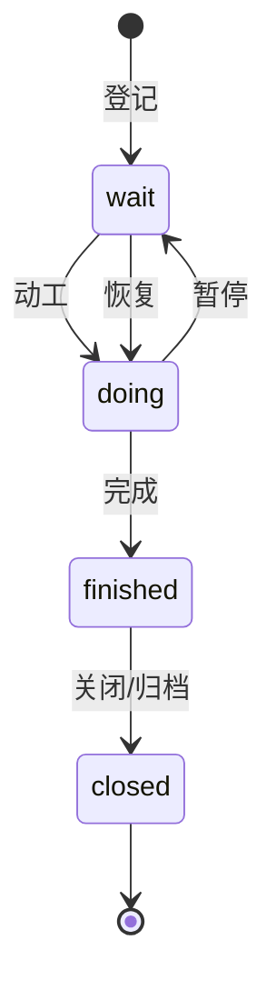

# 项目管理规范

> 文档化管理口径 · 描述三段式 · 阶段与里程碑 · 缺陷流程 · 进度口径

[文档首页](../文档首页.md) › [规范](文档生成规范.md) › 项目管理规范　|　[关联：计划文档规范 →](计划文档规范.md)

## 1. 目的与适用范围 <a id="purpose"></a>

统一本项目的项目管理文档化口径：需求/任务/计划三类文档的编写标准、描述模板、阶段与里程碑约定、缺陷与测试用例的跨平台流程，保证文档自解释、进度可核对、工作可追溯。

- 适用于本项目全部需求、任务、计划、缺陷与测试用例登记。
- **平台分工**：需求/任务/计划/进度**以文档为唯一事实源**；代码缺陷走 GitLab Issue（P0–P3，见《[测试规范](测试规范.md)》「缺陷管理」节）；测试用例在 Kiwi TCMS。
- 文档格式契约：需求/任务/计划三类文档的字段口径分别以《[需求文档规范](需求文档规范.md)》《[任务文档规范](任务文档规范.md)》《[计划文档规范](计划文档规范.md)》为准。

## 2. 需求编写规范 <a id="story"></a>

### 2.1 必填字段 <a id="story-fields"></a>

| 字段 | 必填 | 口径 |
| --- | --- | --- |
| 主题（标题） | 是 | 「对象 + 动作（要点）」，见 2.2 |
| 描述 | 是 | 强制三段式，见第 4 节 |
| 优先级 | 是 | 1–4，见 2.3 |
| 分类 | 是 | feature/interface/performance/safe/experience/improve/other 择一 |
| 所属阶段 | 是 | 对应 M0–M19 里程碑（见第 5 节），在描述中写明 |

### 2.2 主题命名 <a id="story-name"></a>

「对象 + 动作（要点）」——对象是业务或模块，动作是动词，要点用括号列举：

- `用户管理（CRUD/租户隔离/导出）`
- `表单定制（拖拽/条件显示/字段权限）`

- 主题独立成句可看懂，不堆叠「需求」「开发」「功能」等后缀；一个主题只做一件事。

### 2.3 优先级口径 <a id="priority"></a>

| 级别 | 含义 | 使用口径 |
| --- | --- | --- |
| 1 紧急 | 阻塞他人或线上事故，立即处理 | 阻塞并行工作或发布，当日升级处理 |
| 2 高 | 本阶段必做 | M0–M19 内 WBS 任务的默认级别 |
| 3 中 | 正常排期 | 阶段内可顺延 |
| 4 低 | 积压待议 | 后续阶段或不采纳候选 |

> 需求与任务共用本口径表；创建时不填优先级默认 2，仍须显式确认。

## 3. 任务编写规范 <a id="task"></a>

### 3.1 必填字段 <a id="task-fields"></a>

| 字段 | 必填 | 口径 |
| --- | --- | --- |
| 主题（标题） | 是 | 「对象 + 动作（要点）」，见 2.2 |
| 描述 | 是 | 强制三段式，见第 4 节 |
| 父任务 | 子任务必填 | 子任务必须挂父任务（WBS 拆解，见第 5 节） |
| 负责人 | 是 | 当前阶段一律 `minjian` |
| 优先级 | 是 | 1–4，见 2.3 |

> **任务文档不承载进度**：工时 / 状态 / 完成日期 / 排期窗口均在计划表维护（见第 7 节），任务文档不设这些字段。

### 3.2 录入方式 <a id="task-how"></a>

任务创建**只走文档**：按《[任务文档规范](任务文档规范.md)》编写子任务文档（父任务/域总览 + 子任务），进度落到《[计划文档规范](计划文档规范.md)》计划表，文档即唯一事实源。

- **进度单一落点**：工时 / 状态 / 完成日期 / 排期窗口只在计划表维护（任务文档与需求文档均不承载进度）。
- 嵌套子任务不单列计划行，并入其直属父任务统计（计划表口径）。

## 4. 描述三段式模板（强制） <a id="desc"></a>

需求与任务的描述一律采用**三段式**：内容编号清单 + 完成标准 + 参考文档，使文档自解释、验收可核对；**需求在「内容」之前另有必填「背景与动机」段**（为什么做、触发场景、不做的后果，格式见《[需求文档规范](需求文档规范.md)》「单条需求章节（核心结构单元）」节）：

```text
背景与动机：开发服务器是全部环境与 CI 的基座，网络/免密/磁盘一次固化，避免后续反复调整与数据落错盘。
内容（《开发部署规划》「基础环境准备」节/4.2）：
1. Ubuntu 24.04.4 LTS 桌面版、静态 IP、apt 换清华源
2. SSH 免密：mjpc 公钥上 mjbk
3. 磁盘挂载：HDD /mnt/data、2T NVMe SSD /mnt/ssd2t（fstab 自动挂载）
完成标准：mjpc 免密 SSH；重启后双盘自动挂载。
参考文档：《Ubuntu安装部署使用说明》「备份与恢复（Timeshift 系统快照）」节、《开发部署规划》「基础环境准备」节/4.2
```

- **背景与动机**（需求必填）：为什么提这条需求——要解决什么问题、触发场景、不做的后果；
- **内容**：编号清单，一条一事，写清「做什么」，带具体值（版本/端口/路径/账号）；
- **完成标准**：可验证的验收点（命令、现象、结果）；
- **参考文档**：出处与章节号，仓库内文档给出相对链接。

## 5. 阶段与里程碑 <a id="execution"></a>

- 层级：产品「本项目」→ 阶段 M0–M19（与平台《总体项目规划》里程碑一一对应）。
- **排期与工时唯一落点（强制）**：① 阶段划分、阶段内容与完成标准、里程碑与工期基线 → 平台《总体项目规划》；② 阶段内任务排期、排期窗口、工时、状态与完成日期 → 各阶段计划文档（`项目/{阶段}/计划/`）。**除该两处外，任何文档（需求 / 任务 / 设计节点 / 规划节点 / 索引 / 报告等）一律不得写排期与工时**（见《[计划文档规范](计划文档规范.md)》「排期唯一落点与边界」节）。
- 任务按阶段 WBS 登记、指派 `minjian`；阶段内进度以阶段计划文档为唯一事实源。

## 6. 缺陷流程 <a id="defect"></a>

- **载体**：代码缺陷**只登记**在 GitLab Issue；Kiwi TCMS 用例的缺陷链接指向对应 Issue。
- **分级**：P0（阻断主流程/数据安全）、P1（严重功能缺失/可用性降级）、P2（一般缺陷）、P3（轻微/建议）；P0/P1 阻断 MR 合入。
- **流程**：上报（复现步骤 + 关联用例 ID）→ 指派修复 → CI 回归验证 → 关闭。
- **现场数据**：P0/P1 必须附问题现场数据库 dump 与代码 commit（归档于 mjbk 缺陷目录，路径与命令见《[测试规范](测试规范.md)》「缺陷管理」节）。
- **自动上报**：流水线测试失败自动建 Issue（`defect-auto` 标签），人工补充复现步骤与定级后进入指派修复，细则见《[测试规范](测试规范.md)》「缺陷管理」节。

## 7. 进度口径 <a id="status"></a>

### 7.1 状态流转 <a id="status-flow"></a>



- `wait` 未开始 → `doing` 进行中 → `finished` 已完成 → `closed` 已关闭；中断用暂停，恢复后重新动工。
- **状态唯一落点为计划表**：`已完成` ＝ 在计划「已完成任务」表（必填完成日期）；其余取值（`未开始` / `进行中` / `部分完成` / `搁置`）＝ 在计划「剩余任务排期」表的状态列。需求 / 任务两类文档均不承载状态。

### 7.2 工时与排期字段 <a id="time"></a>

| 项 | 含义 | 落点 |
| --- | --- | --- |
| 工时（重估） | 任务重估总工时 | 计划「已完成任务」表 / 「剩余任务排期」表 |
| 完成日期 | 实际完成日期 | 计划「已完成任务」表 |
| 排期窗口 | 计划开始与截止 | 计划「剩余任务排期」表 |

规则：

- 上述三项**只在计划表维护**；任务文档与需求文档一律不写，需要提及时写「见对应阶段计划」，不复制明细。
- 实际工时按小时计；大任务先拆子任务（在计划表按实登记）再分别计工时，避免单任务工时虚高。
- 嵌套子任务不单列计划行：父任务工时 = 自有内容 + 直属子任务合计；状态与完成日期随父任务行维护。

## 8. 检查清单 <a id="checklist"></a>

- □ 需求：主题「对象 + 动作（要点）」、描述四段（背景与动机/内容/完成标准/参考文档）、优先级/分类/所属阶段齐全
- □ 任务：主题、描述、负责人、优先级齐全；子任务有父任务；任务文档不含工时 / 状态 / 完成日期 / 排期字段
- □ 阶段：归属 M0–M19；阶段划分、里程碑与工期基线只写《总体项目规划》，阶段内排期与工时只写阶段计划
- □ 缺陷：走 GitLab Issue（P0–P3 分级）；测试用例在 Kiwi TCMS
- □ 进度：工时 / 状态 / 完成日期 / 排期窗口只在计划表维护（单一落点），需求与任务文档不含进度字段
- □ 存量文档字段缺失已按本规范补齐

> 依《文档生成规范》编写 · 与《测试规范》《需求文档规范》《任务文档规范》《计划文档规范》《总体项目规划》配套
