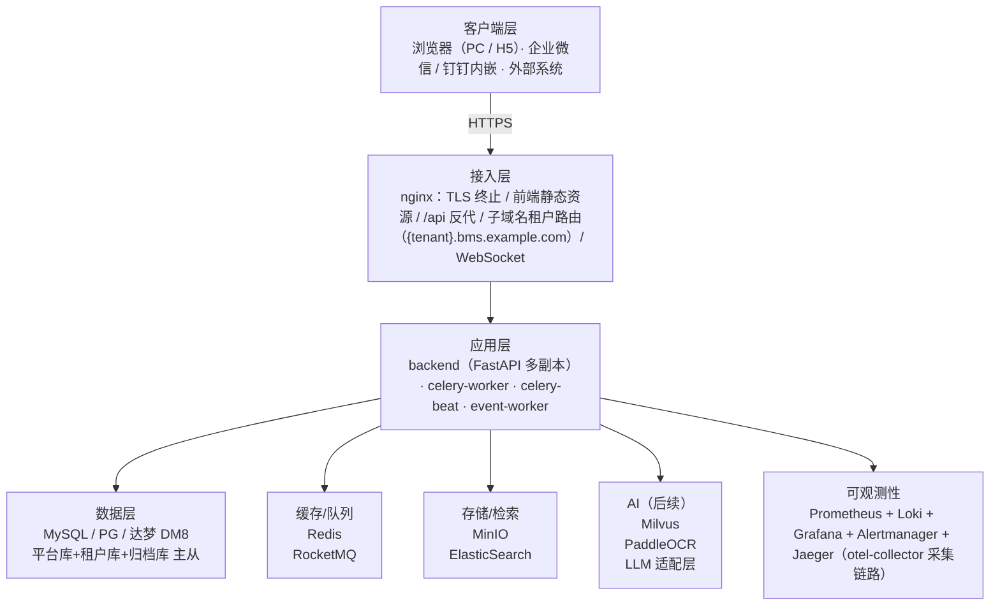
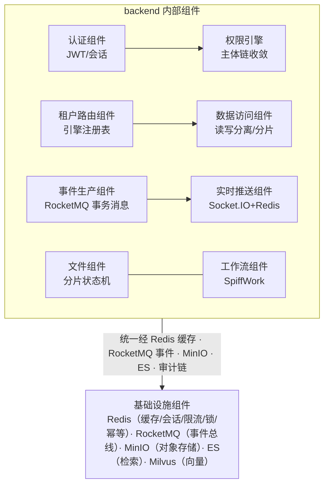
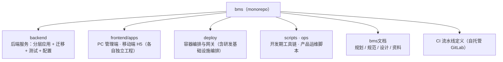

# 架构设计 · 总体架构

> BMS · 分层、进程、组件与技术栈全景

[架构设计](01_架构设计_总览.md) › 03-总体架构　|　[← 02-目标与约束](02_架构设计_目标与约束.md) · [04-后端基础类体系 →](04_架构设计_后端基础类体系.md)

> **本文档只写架构语义**：分层与进程、组件协作、工程骨架、技术选型、阶段映射与验收口径。**实现细节**（代码落点与目录文件清单、类与能力命名、配置项与脚本命令、任务编号与工时）一律不入本文——统一以《[后端基类清单](../../后端基类清单.md)》《[前端基类清单](../../前端基类清单.md)》（实现侧单一权威）与《[后端开发规范](../../规范/后端开发规范.md)》《[前端开发规范](../../规范/前端开发规范.md)》（强制口径与目录约定）为准。

## 1. 概述 

本节点给出 BMS 的总体架构：分层视图、进程模型、组件协作、仓库目录结构与技术栈全景，
并给出开发计划（十九阶段）与架构落地章节的映射关系。对应[《项目规划说明》](../../规划/项目规划说明.md)的「技术栈」
「项目目录结构」章节与[《总体项目规划》](../../规划/总体项目规划.md)「阶段内容与完成标准」章节。

## 2. 分层视图 

## 3. 进程模型 

| 进程 | 职责 | 部署形态 |
| --- | --- | --- |
| backend | FastAPI 应用：REST API（/api/v1、/api/open）、Socket.IO 实时推送、动态数据源路由、Swagger/ReDoc（仅开发） | 多副本（uvicorn 多 worker，如 4 worker） |
| celery-worker | 定时/异步任务执行：孤儿分片清理、日志归档、分片表预创建、每日全量备份、未登录账号锁定扫描等；broker 用 Redis | 多副本 |
| celery-beat | 定时调度：任务定义入库（`sys_task`），自研数据库调度器；Redis 分布式锁防重复调度 | 单副本 |
| event-worker | RocketMQ 事件消费者（多消费组）：操作日志异步化、Webhook 推送、审计链分区有序消费、ES 索引同步（后续）、embedding 管线（后续） | 多副本 |
| frontend/apps/desktop / frontend/apps/mobile | 构建产物由 nginx 托管（PC + 移动端静态资源） | 静态资源 |

## 4. 组件视图与协作 

**协作规则**：

- 分层职责：api 层只做参数校验与路由分发；services 承载业务逻辑与事务边界；repositories 承载数据访问与数据源/分片路由，禁止在 api 层直接操作模型
- **模块独立性（可拆分性）**：模块只拥有自己的数据（写侧禁止跨模块直写、共享 ORM 关系与跨模块 JOIN，读侧经服务层接口或只读投影），跨模块协作经服务层接口或事件；边界声明（表前缀 / 业务码 / 错误码段 / 事件域）由模块注册与 CI 校验，写侧硬禁 / 读侧出口 / 归属与例外登记以《[后端开发规范](../../规范/后端开发规范.md)》「模块边界与数据所有权」节为准。单体形态下保留未来拆分为独立服务的选项（是否拆分见知识档案《[微服务项目评估（BMS）](../../资料/知识档案/微服务/10_微服务_项目评估.md)》「重评触发条件」节）
- 认证组件与权限引擎在中间件/依赖注入层协作：先认证会话，再校验权限码，后做数据范围过滤
- 业务模块不直接调用通知/审计：通过事件总线发布事件，由 event-worker 消费落库/推送（模块解耦）
- 关键写操作经 ORM 事件自动触发审计捕获，审计事件走 RocketMQ 分区有序消费（见审计哈希链子系统）

## 5. 工程结构（Monorepo） 

仓库为**单体多工程（monorepo）**：后端服务、双端前端、部署编排、开发期工具链、产品运维脚本与文档体系各成目录。

- **后端分层**：接口层（按模块，含依赖注入）/ 模型 / 请求响应契约 / 服务层 / 数据访问层（多数据源 · 读写分离 · 分片路由）/ 数据访问底座（引擎 · 会话 · 数据源路由）/ 任务 / 实时通道 / 国际化，另有 core 横切基座、配置、迁移与测试。分层职责与依赖方向见[04-后端基础类体系](04_架构设计_后端基础类体系.md)。
- **前端双工程**：PC 管理端与移动端 H5 各自独立（依赖清单、构建与配置互不共享），工程内按 接口封装 / 路由（动态生成）/ 状态 / 页面（按模块）/ 布局 / 通用组件 / 国际化 / 工具 分层；详见[08-前端架构](08_架构设计_前端架构.md)。
- **目录与文件登记**：具体路径、目录树与文件清单以《[后端基类清单](../../后端基类清单.md)》（后端基座落点）、《[前端基类清单](../../前端基类清单.md)》（前端分层落点）与《[后端开发规范](../../规范/后端开发规范.md)》《[前端开发规范](../../规范/前端开发规范.md)》「目录约定」为准——本节点只给工程骨架，不复制登记表。

## 6. 技术栈全景 

### 6.1 后端核心 

| 层面 | 技术选型 |
| --- | --- |
| 语言 | Python 3.14+（uv 管理） |
| Web 框架 | FastAPI（uvicorn 多 worker 部署） |
| 数据校验 | Pydantic v2 |
| 数据库抽象 | SQLAlchemy 2.0+（异步 ORM/Core，多数据源） |
| 数据库迁移 | Alembic（三套方言，连接地址来自配置） |
| 数据库 | SQLite（开发/测试，aiosqlite）/ MySQL 8.x（aiomysql）/ PostgreSQL 16+（psycopg 3）/ 达梦 DM8（dmPython；Python 3.14 兼容性纳入阶段一验证，信创选配） |
| 缓存 | Redis（redis-py 异步客户端，集群统一缓存）+ dogpile.cache（进程内内存字典缓存，Region 分域管理：小字典整类型 + 超大字典已查条目局部子集，全局版本号 `bms:{tenant}:dict:version` 惰性比对保证多实例一致） |
| 认证 | JWT（PyJWT）+ Redis 会话状态校验 + PBKDF2 密码哈希（标准库） |
| SSO | authlib（OIDC 客户端/Provider + CAS 客户端；企业微信/钉钉免登） |
| 验证码 | 图形验证码（Pillow 生成，Redis 存储校验） |
| 限流 | slowapi（limits 库，Redis 后端） |
| 文件上传 | python-multipart |
| 文件存储 | MinIO（S3 兼容对象存储，预签名 URL 下载） |
| Excel 处理 | openpyxl（导入导出） |
| 后端国际化 | 消息文案入库（sys_i18n_message）+ Babel 开发期提取；Accept-Language 驱动；数据文案走 i18n 附表 |
| 配置格式 | TOML（配置文件 + 环境变量覆盖） |
| ID 生成 | yitter/IdGenerator（雪花算法，时钟回拨处理） |
| 日志 | structlog（结构化 JSON，携带 request_id） |
| 工作流引擎 | SpiffWorkflow（BPMN 2.0，线程池运行） |
| 模板渲染 | Jinja2（邮件模板入库在线编辑、通知模板） |
| 实时推送 | python-socketio（Socket.IO，Redis 适配器跨实例广播） |
| 消息队列 | RocketMQ 5.x（事件总线：操作日志异步化、Webhook 推送、审计链串行消费；分区有序消息） |
| 定时任务 | Celery（Redis broker；beat 数据库调度器） |
| 邮件发送 | aiosmtplib（SMTP，Jinja2 模板） |
| 全文检索 | ElasticSearch 8.x（elasticsearch-py；PDF/Word/Excel/TXT 文本解析） |
| AI（后续） | LLM 适配层（外部 API + 私有化端点可配）、Milvus 向量库、PaddleOCR（本地 + 多模态 API 可切换） |
| 链路追踪 | OpenTelemetry（otel-collector + Jaeger） |
| 插件化机制 | 能力基类（端口）+ 插件注册表 + 配置选择 + 提供者；内建实现走继承登记、二次开发走组合注册；三阶段（配置切换 → 运行时热插拔 → 安装期发现第三方）（见 [10-扩展点与插件化](10_架构设计_子系统_扩展点与插件化.md)） |

### 6.2 前端 

| 层面 | 技术选型 |
| --- | --- |
| 框架 | Vue 3 + Vite + TypeScript |
| UI 库 | Element Plus（PC）/ Vant（移动端） |
| 路由 / 状态 | Vue Router 4 / Pinia |
| HTTP 客户端 | Axios（token 注入、401 刷新） |
| 流程建模 | bpmn-js（拖拽绘制 BPMN 流程图） |
| 图表 | ECharts（报表与大屏渲染） |
| 网格拖拽 | gridstack.js（工作台卡片与报表设计器统一布局：网格拖拽/尺寸调整/响应式） |
| 表单设计器 | vuedraggable（SortableJS 官方封装，表单设计器字段排序/分组/跨区拖拽，与 gridstack 分工：列表排序 vs 网格布局） |
| 大屏画布 | vue-flow（@vue-flow/core，大屏自由画布：绝对定位拖拽、连线与缩放；与 gridstack 网格布局、vuedraggable 列表排序三者分工：自由画布/网格布局/列表排序） |
| 富文本 | wangEditor 5（KaTeX / PrismJS / markdown-it / DOMPurify 配套；HTML 前端与后端白名单双向清洗） |
| 代码编辑 | CodeMirror 6（语言包配套，代码 / 表达式 / cron 编辑内核，独立分包懒加载；只读高亮用 PrismJS） |
| 图标 | Element Plus 图标集（PC；图标统一经图标渲染件解析，业务自绘图标按资产约定存放） |
| 二维码 | qrcode（二维码生成；独立分包懒加载，见[展示类「二维码」组件设计](../组件设计/07_展示类/13_组件设计_二维码/13_组件设计_二维码.md)） |
| 前端插件化 | 扩展点 + 注册表（路由/菜单、组件、字段渲染器、图标、卡片、主题）+ 动态导入分包；产品前端模块**构建期合并**、免发版（见 [10-扩展点与插件化](10_架构设计_子系统_扩展点与插件化.md)） |
| 实时推送 | socket.io-client |
| 国际化 | vue-i18n（语言包运行时拉取、RTL 适配、localStorage 持久化） |
| 样式 | SCSS（Element Plus 主题定制） |
| 包管理 | npm（frontend/apps/desktop / frontend/apps/mobile 各自独立） |
| 代码规范 | ESLint + Prettier |
| 测试 | Vitest（单元）+ Playwright（E2E） |
| 移动端 | Vue 3 + Vant（frontend/apps/mobile 独立工程，复用后端 API） |
| 运行时版本基线 | Node 22 LTS（`.nvmrc` 固定，volta/fnm 管理） |

### 6.3 工程化与质量 

| 层面 | 技术选型 |
| --- | --- |
| Python 包管理 | uv |
| 代码规范 | ruff（lint + format） |
| 类型检查 | pyright（严格模式） |
| 后端测试 | pytest + httpx（ASGITransport）+ pytest-cov（覆盖率门禁） |
| API 文档 | Swagger UI / ReDoc（FastAPI 内置，生产关闭） |
| 缺陷管理 | 缺陷处理三件套——自动上报与复现包（现场 dump / 堆栈 / 日志）、一键复现（检出代码 + 导入现场 + 跑用例）、AI 辅助修复（本地模型优先、云端兜底，自动提 MR 人工合入）；脚本落点与用法见《[项目管理规范](../../规范/项目管理规范.md)》 |
| 压测 | locust（登录/列表/审批场景） |
| 测试用例管理 | Kiwi TCMS（开发服务器常驻部署，唯一用例库） |
| 测试报告 | Allure（自动化报告） |
| 项目管理 | 文档体系（需求/任务/计划三类文档，见《[项目管理规范](../../规范/项目管理规范.md)》）；平台工具待项目扩大后按需引入 |

### 6.4 部署与运维 

| 层面 | 技术选型 |
| --- | --- |
| 容器 | Docker + Docker Compose |
| Web 服务器 | nginx（负载均衡 / TLS 终止 / 子域名租户路由，泛域名证书） |
| 对象存储 | MinIO（S3 兼容） |
| 消息队列 | RocketMQ 5.x（nameserver + broker） |
| 监控 | Prometheus + Loki + Grafana + Alertmanager（告警：邮件/企业微信/钉钉/短信） |
| 链路追踪 | Jaeger + otel-collector |
| 检索 | ElasticSearch 8.x（MVP 单节点，生产集群多副本） |
| AI（后续） | Milvus（milvus + etcd，MinIO 复用）、PaddleOCR（可选） |
| 健康检查 | /healthz、/readyz |
| CI/CD | GitLab CE（自托管：代码仓库 + MR + CI + 容器镜像仓库一体，容器化执行器）+ Renovate（依赖升级自动提 MR）；流水线含 lint / 测试（覆盖率门禁）/ 双端构建 / E2E / 三库集成测试 / 报告与用例库归档 / 镜像构建 / OpenAPI 契约快照；GitHub push mirror 只读归档同步。落地细节见《[部署发布规范](../../规范/部署发布规范.md)》 |

## 7. 阶段映射与验收 

> **开发阶段划分、阶段内容、里程碑分层与 MVP 验收标准不在本节点**——以《[总体项目规划](../../规划/总体项目规划.md)》（总体计划与里程碑）与各阶段计划文档为准；模块范围与技术内容见《[项目规划说明](../../规划/项目规划说明.md)》。本节点只描述阶段无关的架构语义（分层、进程、组件、技术栈、工程结构与约束）。

## 8. 关联节点 

- [目标与约束](02_架构设计_目标与约束.md)：约束依据
- [核心交互时序](06_架构设计_核心交互时序.md)：主流程全景
- [数据架构](07_架构设计_数据架构.md)：数据分布与规范
- [多租户路由](12_架构设计_子系统_多租户路由.md)：租户机制
- [数据访问与分片](13_架构设计_子系统_数据访问与分片.md)：数据访问层
- [认证与会话](14_架构设计_子系统_认证与会话.md)：身份基座
- [权限计算引擎](15_架构设计_子系统_权限计算引擎.md)：权限机制
- [事件总线](16_架构设计_子系统_事件总线.md)：模块解耦
- [任务调度](17_架构设计_子系统_任务调度.md)：异步任务
- [可观测性](27_架构设计_子系统_可观测性.md)：日志/指标/链路
- [前端架构](08_架构设计_前端架构.md)：双端工程
- [前端组件体系](05_架构设计_前端组件体系.md)：基类体系与目录、八类边界与实施约束
- [后端基础类体系](04_架构设计_后端基础类体系.md)：core 基座、模块基类、有序与并发集合、阶段落地
- [部署与运维](33_架构设计_部署与运维.md)：运行期拓扑

> 架构设计节点 · 与《项目规划说明》《文档生成规范》《命名规范》配套