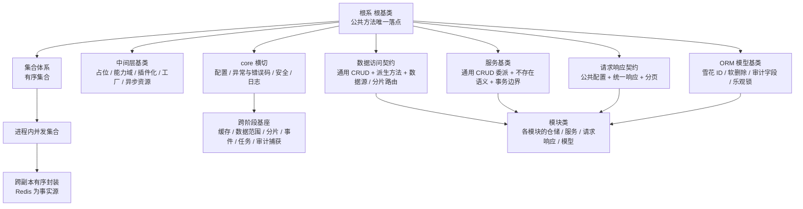

# 架构设计 · 后端基础类体系

> BMS · 基座分层、能力收口原则与贯穿全阶段的实施约束

[架构设计](01_架构设计_总览.md) › 04-后端基础类体系　|　[← 03-总体架构](03_架构设计_总体架构.md) · [05-前端组件体系 →](05_架构设计_前端组件体系.md)

> **本文档只写架构语义**：分层与职责、依赖方向、扩展规则、能力收口原则、阶段波次。**实现细节**（基类与能力的命名、代码落点、目录与文件清单、方法签名与常量、脚本与命令、任务编号与工时）一律不入本文——统一以《[后端基类清单](../../后端基类清单.md)》（实现侧单一权威：分层总览、契约与代码位置、继承链、状态）与《[后端开发规范](../../规范/后端开发规范.md)》（强制口径）为准。

## 1. 概述 

后端基础类体系定义 backend 的**基座分层、各层职责与依赖方向、扩展规则与阶段落地**，是《[后端开发规范](../../规范/后端开发规范.md)》「后端基座体系（强制）」节与「模块组织」「异步与并发」节在架构层的落地依据（本节点定分层语义、扩展规则与**能力收口原则**，规范定强制性规则口径，二者同源；基类清单、契约与代码位置由《[后端基类清单](../../后端基类清单.md)》承载）。对应[《总体项目规划》](../../规划/总体项目规划.md)的「阶段内容与完成标准」节阶段一（基座体系骨架与接口占位）与阶段二（真实实现）；工程结构与分层职责见[03-总体架构](03_架构设计_总体架构.md)、数据访问机制见[13-数据访问与分片](13_架构设计_子系统_数据访问与分片.md)。

**为什么单列节点**：后端基座是**影响全局、贯穿全程**的地基——core 横切基座（根基类、有序集合、并发集合、跨副本封装、异常、配置、安全）与模块基类（数据访问 / 服务 / 请求响应 / ORM 模型）决定所有模块的写法，任一基类能力调整即全链生效；基座不完成，认证 / RBAC / 通用能力等全部后端模块无法按统一口径实现（CRUD、序列化、并发保护、异常语义在每个模块重复实现，口径必然发散）。因此后端基座与前端组件库（[05-前端组件体系](05_架构设计_前端组件体系.md)）并列：基座体系（骨架 + 接口占位）随后续交付，真实实现（机制落库与三库实测）随**阶段二 后端基座**。

## 2. 体系定位与范围 

| 项 | 说明 |
| --- | --- |
| 面向 | backend（异步 Web 栈，Python 3.14+） |
| 目录 | 基座代码落点、目录与文件清单见《[后端基类清单](../../后端基类清单.md)》「分层总览」「继承链与代码位置」节；规范侧见《[后端开发规范](../../规范/后端开发规范.md)》 |
| 范围 | core 横切基座（根基类 / 有序集合 / 并发集合 / 跨副本封装 / 配置 / 异常 / 安全）+ 模块基类（数据访问 / 服务 / 请求响应 / ORM 模型）+ 中间层（占位 / 能力域 / 插件化 / 异步资源）+ 跨阶段基座（缓存分域 / 数据范围注入 / 分片路由 / 事件发布消费 / 任务 / 审计捕获）与横切能力域（脱敏 / 权限校验 / 分布式锁 / 验证码 / 密码策略 / 降级熔断 / 限流幂等防重放 / 指标链路 / 健康检查 / 开放接口 / 对象存储 / LLM / 全文检索 / 通知 / 实时推送 / 出站集成 / 工作流 / 身份源与会话 / 数据查询 / 导入导出 / 哈希链 / 归档 / 字段类型 / 国际化 / 工作台卡片） |
| 上游 | 《项目规划说明》（开发计划与阶段）、《后端开发规范》、《命名规范》 |
| 下游 | 全部后端模块（认证 / RBAC / 通用能力 / 工作流 / 集成 / 报表 / 检索 / AI）与产品仓库后端模块 |
| 稳定性 | 稳定——基类能力变更牵动全部模块；新公共能力只加到基类或新增基类层，模块类不动 |

## 3. 基座分层 

后端基座以 **根系 根基类**为根，向上分出三条支线：**集合体系**（有序 / 并发 / 跨副本）、**模块基类**（数据访问到模型）、**core 横切基座**（配置 / 异常 / 安全 / 日志），并由**中间层基类**承载横切装配语义（占位 / 能力域 / 插件化 / 工厂 / 异步资源）。公共字段与方法只在所属基类维护，模块类只写差异部分。

> 各层基类一览（层 / 基类 / 形态 / 父层 / 代码位置 / 职责 / 状态）以《[后端基类清单](../../后端基类清单.md)》「分层总览」为准，本节点只给分层语义。

约定：只准上层依赖下层；基类与模块类的命名、继承链以《[后端基类清单](../../后端基类清单.md)》与《[命名规范](../../规范/命名规范.md)》为准；模块类必须继承对应基类，**禁止重复定义基类已提供的公共字段 / 方法**；新增公共能力只加到基类或新增基类层（根系是公共方法唯一落点）。

## 4. 基类清单与继承链 

模块基类是**平行的兄弟基类**（各自继承根系，互不继承）；模块类分别继承对应基类。它们之间是**调用链**（服务调用仓储、仓储操作模型），不是继承层级。

**基类清单、继承链、代码位置与状态以《[后端基类清单](../../后端基类清单.md)》为准**——「分层总览」「根系 / 集合体系 / 模块基类 / 中间层基类 / core 横切 / 数据访问与多租户 / 跨阶段基座」各节与「继承链与代码位置」节；本节点不复制清单（状态随清单回写）。

## 5. 有序与并发集合 

集合体系（有序 / 进程内并发 / 跨副本三类形态、锁原语与复合操作语义）见《[后端基类清单](../../后端基类清单.md)》「集合体系」节；**强制用法**（对外稳定序、并发集合原子复合方法与快照遍历、跨副本禁进程内共享、锁内禁 IO 与外部回调）以《[后端开发规范](../../规范/后端开发规范.md)》「后端基座体系（强制）」节为准。

## 6. core 横切基座 

core 横切基座（配置 / 异常与错误码 / 安全 / 日志 / 稳定序列化 / 并发锁原语 / 雪花 ID / 请求上下文）见《[后端基类清单](../../后端基类清单.md)》「core 横切基座」节；链路 / 健康检查 / 开放接口鉴权等横切契约见清单「跨阶段基座」节与 [27-可观测性](27_架构设计_子系统_可观测性.md)、[09-接口与集成](09_架构设计_接口与集成.md)、[14-认证与会话](14_架构设计_子系统_认证与会话.md) 等对应子系统节点。

## 7. 各层基类与模块约定 

| 模块类 | 必须继承 | 只写什么 |
| --- | --- | --- |
| 仓储类 | 数据访问契约（内存基线 / 数据库实现两条落地） | 内存基线只实现构建与过滤钩子，数据库实现覆写 CRUD，存在性判定沿用基类 |
| 服务类 | 服务基类（通用 / 事务扩展） | 通用 CRUD 走基类；业务规则以覆写 / 新增方法实现；事务由事务扩展层经工作单元统一 |
| 请求 / 响应类 | 请求响应基类 | 字段与约束 |
| 接口（路由）类 | 接口路由基类（`BaseRouter`） | 路由定义、依赖注入挂接与统一挂载；只做参数校验与路由分发 |
| 分页请求 / 响应 | 分页契约（偏移 / 游标两式） | 列表接口统一分页契约 |
| 接口响应 | 统一响应契约 | 统一响应结构；列表分页 data 用分页响应契约 |
| ORM 模型类 | ORM 模型基类 | 表名、字段、关系；公共字段（雪花 ID / 审计 / 软删除 / 乐观锁）不得重复声明 |

禁止：在模块类重复定义基类已提供的公共字段 / 方法；绕过基类另起炉灶（新增公共能力加到基类，改一处全局生效）。

## 8. 能力收口与强制口径（语义） 

> 强制性规则口径以《[后端开发规范](../../规范/后端开发规范.md)》「后端基座体系（强制）」节为准；各能力域**必须走哪个基类、关键契约与禁止事项**的逐条细则（含类名、代码位置、方法签名与常量）见《[后端基类清单](../../后端基类清单.md)》「中间层基类 / core 横切基座 / 跨阶段基座」节。本节只给架构侧的**收口原则**与能力域全景。

**收口原则**：

- **必须继承（强制）**：后端所有自定义类都必须继承项目基类，不得以 Python 内建 `object` 为唯一基类——普通类与值对象 / 数据契约从根系派生，模块类经各层基类落地（仓储 / 服务 / 请求响应 / ORM 模型 / 集合 / 能力域契约 / 占位实现 / 异步资源各有对应基类）；由 CI 静态护栏校验。
- **异常段位（强制）**：一切自定义异常继承统一异常基类，并按错误码段位归入段位基（通用 / 认证 / 用户与组织 / 系统配置 / 文件 / 开放·租户·SSO；新增段位先加段位基）；禁止直接继承 Python 内建异常，禁止模块内就地定义游离于体系之外的异常类。
- **能力实现必须收口于基座（强制）**：平台能力的实现一律走「能力基类（端口）+ 插件注册表 + 配置选择 + 提供者」——业务代码只依赖能力基类与提供者，**禁止直连具体实现**（不直接依赖对象存储 / 模型 / 厂商 SDK 等），**禁止各模块自研平行实现**（限流计数、幂等 / 限流 key、签名计算、掩码、降级分支、健康检查聚合、指标埋点、链路 id、审计哈希、列类型映射等）；换实现只改配置文件的 provider 与 options。
- **设计期契约收口（强制）**：**自定义图标**的清单查询与增删改、以及 **icon key 的前缀解析与派生**一律经统一图标出口（图标键为唯一业务标识；平台官方 / 业务自绘 / 租户自定义 / 移动端四类来源共用一套前缀口径），禁止各模块自建图标清单或自拼 key；**代码与表达式校验**（只读试算、语法 / 白名单 / 字段 / 变量诊断、字段清单与预览、超时与限流）一律经统一校验出口，禁止各模块直连数据源执行用户 SQL 或平行实现校验；**校验不通过以结果契约表达、不作为异常**（执行侧故障除外）；**调度表达式**（cron）的合法性校验不属该出口，归任务调度语义。
- **禁止另起炉灶**：不得重复定义基类已提供的公共字段 / 方法；不得绕过服务基类直连数据访问层；不得直接继承第三方校验 / 序列化基类；不得新建平行的 CRUD / 序列化 / 并发 / 异常 / 日志实现。
- **集合与排序**：有序集合对外输出稳定序、禁止裸无序集合；多线程共享走并发集合（锁策略显式传入）；跨副本走跨副本封装（外部存储为事实源），禁止进程内集合跨副本共享；锁内不得做 IO 与外部回调。列表接口排序一律走排序契约（请求侧统一排序参数、仓储以可排序字段白名单声明、白名单外忽略），禁止把用户输入直接拼进排序。
- **中间层语义**：占位实现继承占位基类（统一未实现抛错）；能力域契约继承能力基类；异步资源继承异步资源基类（统一释放协议）；插件化装配语义由插件中间层承载（见 [10-扩展点与插件化](10_架构设计_子系统_扩展点与插件化.md)）。
- **依赖方向**：只准上层依赖下层，**禁止反向依赖**（core 不得依赖接口层 / 服务层 / 业务模块；数据访问层不得依赖服务层）；跨模块协作走服务层。
- **工厂语义**：创建逻辑（对象 / 组件的构造与装配）**收口于工厂层**——工厂沿继承链派生（工厂基类 → 各域工厂基类 → 具体工厂类），公共创建逻辑只在工厂基类维护，**工厂只负责创建与装配、不承载业务判定**；模块类不得在链外自建创建入口，创建入口统一可替换（工厂本身沿插件语义可选实现）。
- **模块独立性（数据所有权，为可拆分性保留）**：模块只拥有自己的数据——写侧禁止跨模块直写他模块的表、共享 ORM 关系或跨模块 JOIN；读侧经服务层接口或**只读投影**（只读视图 / 数据查询提供者 / 事件投影）；边界声明（表前缀 / 业务码 / 错误码段 / 事件域）随模块注册并受 CI 校验。写侧硬禁、读侧出口、归属与例外登记以《[后端开发规范](../../规范/后端开发规范.md)》「模块边界与数据所有权」节为准；事件契约版本与 Outbox 不作为本节落地项，作为《[架构设计 · 事件总线](16_架构设计_子系统_事件总线.md)》的设计输入。单体形态下保留未来拆分为独立服务的选项（是否拆分见知识档案《[微服务项目评估（BMS）](../../资料/知识档案/微服务/10_微服务_项目评估.md)》「重评触发条件」节）。
- **多重继承克制**：仅请求响应基类因混合第三方校验框架使用多重继承；其余横切能力以基类方法或组合实现。

**能力域全景（收口对象）**：脱敏 · 权限校验 · 分布式锁 · 验证码 · 密码策略 · 降级 · 熔断 · 限流 · 幂等 · 防重放 · 指标 · 链路 · 健康检查 · 开放接口与授权面校验 · 对象存储 · LLM 适配 · 全文检索 · 通知发送 · 实时推送 · 出站集成 · 工作流引擎 · 身份源与会话存储 · 数据查询提供者 · 导入导出 · 审计哈希链 · 归档 · 字段类型 · 国际化翻译 · 工作台卡片 · 缓存分域 · 数据范围注入 · 分片路由 · 事件发布 / 消费 · 任务调度 · 审计捕获 · 验证码渠道 · 组织主数据查询 · 字典取数 · 对象存储扩展（分片 / 秒传）· 通知中心 · 列表查询与偏好 · 全局检索 · AI 对话流式 · 用户偏好 · 租户自助 · 打印模板 · 图标与代码校验。

> 上列每个能力域的**契约（方法 / 常量 / 提供者）、代码位置与状态**见《[后端基类清单](../../后端基类清单.md)》。新增能力域按「能力基类（端口）+ 默认实现 + 内建实现 + 配置选择 + 契约测试」同一模式落位，不新造框架。

## 9. 阶段交付与跨阶段基座契约 

> **阶段划分、波次、窗口与工时不在本节点**——以《[总体项目规划](../../规划/总体项目规划.md)》与各阶段计划文档为准；本节只保留与阶段无关的语义。

- **交付形态（语义）**：基座先落「契约与接口骨架」，再落「真实实现」；依赖后端模块能力的**跨阶段基座**先落契约骨架与登记，真实实现随对应模块阶段。
- **跨阶段基座契约（语义）**：缓存分域 / 数据范围注入 / 分片路由 / 事件发布消费 / 任务 / ORM 审计捕获，以及横切扩展的脱敏 / 权限校验 / 分布式锁 / 验证码 / 密码策略 / 降级 / 熔断 / 限流 / 幂等 / 防重放 / 指标 / 链路 / 健康检查 / 开放接口 / 对象存储 / LLM / 全文检索 / 通知 / 实时推送 / 出站集成 / 工作流 / 身份源与会话 / 数据查询 / 导入导出 / 哈希链 / 归档 / 字段类型 / 国际化 / 工作台卡片 / 验证码渠道 / 组织主数据 / 字典取数 / 对象存储扩展 / 通知中心 / 列表查询与偏好 / 全局检索 / AI 对话 / 用户偏好 / 租户自助 / 打印模板 / 图标与代码校验——逐项契约与状态见《[后端基类清单](../../后端基类清单.md)》「跨阶段基座」节。
- 数据访问机制（引擎 / 会话 / 工作单元 / 数据源路由 / 分页 / 只读上下文 / 并发冲突转译）见[13-数据访问与分片](13_架构设计_子系统_数据访问与分片.md)。

## 10. 关联节点 

- [03-总体架构](03_架构设计_总体架构.md)：分层视图、工程结构与阶段映射
- [13-数据访问与分片](13_架构设计_子系统_数据访问与分片.md)：多数据源、读写分离、分片、归档库
- [07-数据架构](07_架构设计_数据架构.md)：数据规范（雪花 ID / 软删除 / 审计字段 / 乐观锁）
- [14-认证与会话](14_架构设计_子系统_认证与会话.md)：安全基座消费方
- [16-事件总线](16_架构设计_子系统_事件总线.md)：事件发布 / 消费基座
- [17-任务调度](17_架构设计_子系统_任务调度.md)：任务调度基座
- [19-审计哈希链](19_架构设计_子系统_审计哈希链.md)：ORM 审计捕获基座
- [10-扩展点与插件化](10_架构设计_子系统_扩展点与插件化.md)：插件化中间层与能力基类承载的可替换机制
- [05-前端组件体系](05_架构设计_前端组件体系.md)：与后端基座对称的前端地基
- 《[后端基类清单](../../后端基类清单.md)》：分层总览、契约与代码位置、继承链、状态（实现侧单一权威）

> 架构设计节点 · 与《项目规划说明》《后端开发规范》《数据库开发规范》《命名规范》《文档生成规范》配套
