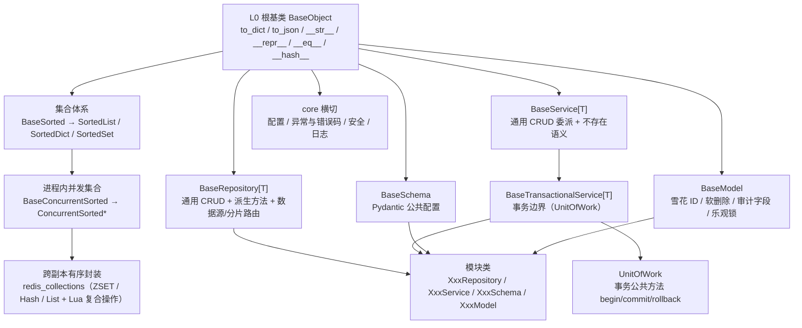

# 架构设计 · 后端基础类体系

> BMS · 基座分层、基类清单与贯穿全阶段的实施约束

[架构设计](01_架构设计_总览.md) › 04-后端基础类体系　|　[← 03-总体架构](03_架构设计_总体架构.md) · [05-前端组件体系 →](05_架构设计_前端组件体系.md)

## 1. 概述 

后端基础类体系定义 backend（FastAPI）的**基座分层、各层基类清单与继承关系、扩展规则与阶段落地**，是《[后端开发规范](../../规范/后端开发规范.md)》「后端基座体系（强制）」节与「模块组织」「异步与并发」节在架构层的落地依据（本节点定分层与清单，规范定强制用法口径，二者同源）。对应[《项目规划说明》](../../规划/项目规划说明.md)的「开发计划与验收标准」节阶段一（基座体系骨架与接口占位）与阶段二（真实实现）；工程结构与分层职责见[03-总体架构](03_架构设计_总体架构.md)、数据访问机制见[13-数据访问与分片](13_架构设计_子系统_数据访问与分片.md)。

**为什么单列节点**：后端基座是**影响全局、贯穿全程**的地基——core 基座（根基类、有序集合、并发集合、Redis 封装、异常、配置、安全）与模块基类（repository / service / schema / model）决定所有模块的写法，任一基类能力调整即全链生效；基座不完成，认证 / RBAC / 通用能力等全部后端模块无法按统一口径实现（CRUD、序列化、并发保护、异常语义在每个模块重复实现，口径必然发散）。因此后端基座与前端组件库（[05-前端组件体系](05_架构设计_前端组件体系.md)）并列：基座体系（骨架 + 接口占位）随阶段一交付，真实实现（机制落库与三库实测）随**阶段二 后端基座**。

## 2. 体系定位与范围 

| 项 | 说明 |
| --- | --- |
| 面向 | backend（FastAPI，异步栈，Python 3.14+） |
| 目录 | 基座代码 `backend/app/core/`、`repositories/`、`services/`、`schemas/`、`models/`；规范 `bms文档/规范/后端开发规范.md` |
| 范围 | core 基座（根基类 / 有序集合 / 并发集合 / Redis 封装 / 配置 / 异常 / 安全）+ 模块基类（`BaseRepository` / `BaseService` / `BaseSchema` / `BaseModel`）+ 跨阶段基座（缓存 Region 分域 / 数据范围注入 / 分片路由 / 事件发布消费 / 任务 / 审计捕获） |
| 上游 | 《项目规划说明》（开发计划与阶段）、《后端开发规范》、《命名规范》 |
| 下游 | 全部后端模块（认证 / RBAC / 通用能力 / 工作流 / 集成 / 报表 / 检索 / AI）与产品仓库后端模块 |
| 稳定性 | 稳定——基类能力变更牵动全部模块；新公共能力只加到基类或新增基类层，模块类不动 |

## 3. 基座分层 

后端基座以 **L0 根基类**为根，向上分出三条支线：**集合体系**（有序 / 并发 / 跨副本）、**模块基类**（数据访问到模型）、**core 横切基座**（配置 / 异常 / 安全 / 日志）。公共字段与方法只在所属基类维护，模块类只写差异部分。

| 层 / 支线 | 基类 | 代码落地位置 | 实施阶段 |
| --- | --- | --- | --- |
| L0 根基类 | `BaseObject` | `app/core/base.py` | **阶段一已交付** |
| 有序集合 | `BaseSorted` → `SortedList` / `SortedDict` / `SortedSet` | `app/core/collections.py` | **阶段一已交付** |
| 进程内并发集合 | `BaseConcurrentSorted` → `ConcurrentSortedList` / `ConcurrentSortedDict` / `ConcurrentSortedSet`（四种锁策略） | `app/core/concurrent.py` | **阶段一已交付** |
| 跨副本有序封装 | Redis 有序封装 + Lua/WATCH 复合操作 | `app/core/redis_collections.py` | **阶段一已交付** |
| 数据访问基类 | `BaseRepository[T]`（契约）/ `BaseMemoryRepository[T]`（内存基线）/ `BaseDbRepository[T]`（数据库实现骨架） | `app/repositories/base_repository.py`、`base_memory_repository.py`、`base_db_repository.py` | **阶段一已交付**（同步基线；阶段二切异步并填 DB 实现） |
| 服务基类 | `BaseService[T]`（委派仓储 + 不存在语义）/ `BaseTransactionalService[T]`（事务边界） | `app/services/base_service.py`、`base_transactional_service.py` | **阶段一已交付** |
| 数据访问横切 | `UnitOfWork`（工作单元：事务公共方法 `begin` / `commit` / `rollback`，占位 `NullUnitOfWork`） | `app/db/unit_of_work.py` | **阶段一已交付**（占位；`DbUnitOfWork` 随阶段二） |
| 请求/响应基类 | `BaseSchema`（`from_attributes` / `str_strip_whitespace`） | `app/schemas/base.py` | **阶段一已交付** |
| ORM 模型基类 | `BaseModel`（雪花 ID / 软删除 / 审计字段 / 乐观锁 / 四库类型映射） | `app/models/base.py` | **阶段一已交付**（基类与字段声明；落库实测随阶段二） |
| core 横切：异常 | `BizError` 体系 + 统一响应 `{code, message, data}` | `app/core/exceptions.py` | **阶段一已交付** |
| core 横切：配置 / 安全 / 日志 | 配置基座（config.toml + `BMS_` 覆盖）、安全基座、structlog 日志 | `app/core/config.py`、`app/core/security.py` | **阶段一已交付**（配置 / 日志真实实现；安全基座结构占位，真实原语随认证阶段） |
| 跨阶段基座 | 缓存 Region 分域 / 数据范围注入 / 分片路由 / 事件发布消费 / 任务基座 / 审计捕获 | 分散于 `core/`、`repositories/`、`services/` | 按对应阶段回补（见第 8 节） |
| 插件化中间层 | `BaseCapability` → `BasePluggable`（能力域键 / 插件键与实现名 / 注册与解析 / 生命周期） | `app/core/capability.py`、`app/core/plugin.py` | 已交付（阶段三 01-1，2026-09-15）；**40 个能力域基类已改继承（02-1，2026-09-15）**，见 [10-扩展点与插件化](10_架构设计_子系统_扩展点与插件化.md) |

约定：只准上层依赖下层；基类一律 `Base` 打头，非 `Base` 打头为继承基类的具体实现类（命名自由）；模块类必须继承对应基类，**禁止重复定义基类已提供的公共字段/方法**；新增公共能力只加到基类或新增基类层（`BaseObject` 是公共方法唯一落点）。

## 4. 基类清单与继承链 

| 基类 | 文件 | 职责 | 状态 |
| --- | --- | --- | --- |
| `BaseObject` | `core/base.py` | 所有可继承类的公共方法唯一落点（普通类、非 ABC；`to_dict` 声明字段优先——dataclass / Pydantic `model_dump` / `__dict__`；稳定序 `to_json`；统一字符串输出；主键相等与哈希） | 已交付 |
| `ValueHolder` | `core/base.py` | `get_locked` 上下文内可替换的值容器（进程内与 Redis 复用），继承 `BaseObject` | 已交付 |
| `BaseSorted[T]` | `core/collections.py` | 有序集合公共方法（`to_list` / `to_dict` / `to_json` / `sorted_by` / `chunk` / `merge` / 集合运算） | 已交付 |
| `BaseConcurrentSorted` | `core/concurrent.py` | 进程内并发集合基类：锁策略守卫 + SNAPSHOT 写时复制模板 | 已交付 |
| `LockStrategy` / `ReadWriteLock` / `LockGuard` | `core/locking.py` | 并发锁原语：锁策略枚举（`RW` 默认 / `RLCK` / `SHARDED` / `SNAPSHOT`）、读写锁、策略守卫（公共横切；`ReadWriteLock` / `LockGuard` 继承 `BaseObject`） | 已交付 |
| `ConcurrentSorted*` | `core/concurrent.py` | 进程内多线程共享集合：读-改-写走原子复合方法、遍历取快照 | 已交付 |
| `RedisSortedSet` | `core/redis_collections.py` | 跨副本有序集合（ZSET 按分值）：加/减/取分、按名次与分值范围查询 | 已交付 |
| `RedisSortedDict` | `core/redis_collections.py` | 跨副本有序字典（ZSET + Hash）：Lua 原子复合 + WATCH + MULTI 乐观重试 | 已交付 |
| `RedisSnapshot` | `core/redis_collections.py` | 本地只读快照：远程版本号（`{key}:version`）变化或本地失效时惰性重载 | 已交付 |
| `BaseRepository[ModelT]` | `repositories/base_repository.py` | 仓储契约（**异步**）：CRUD 抽象（`list(*, sort)`）+ `exists` / `list_page` / `list_cursor` 派生 + 数据源（只读标记）/ 分片路由 / 排序（`sortable_fields` 白名单 + `_apply_sort` 占位）钩子 + `_guard_version` 乐观锁转译 | 已交付 |
| `BaseMemoryRepository[ModelT]` | `repositories/base_memory_repository.py` | 内存基线（异步，继承 `BaseScopedRepository`）：字典存储 + 自增 ID，按作用域过滤；子类只实现同步 `_build` / `_apply` | 已交付（测试替身） |
| `BaseScopedRepository[ModelT]` | `repositories/base_scoped_repository.py` | **作用域过滤中间层**：软删除（`deleted_at IS NULL`）+ 数据范围条件统一（`_scope_conditions` / `_matches_scope`） | 已交付 |
| `BaseDbRepository[ModelT]` | `repositories/base_db_repository.py` | 数据库实现骨架（**异步**占位、不连库，继承 `BaseScopedRepository` + `BaseStub`）；真实 CRUD / 软删除 SQL 随落库阶段回补 | 已交付（占位） |
| `EngineFactory` | `db/engine.py` | 异步引擎工厂（按 `db_key` 创建 / 缓存 `AsyncEngine`，连接池参数、`pool_pre_ping`、可释放），继承 `BaseObject` | 已交付 |
| `get_db` / `get_uow` / `build_session_factory` | `db/session.py` | `async_sessionmaker` 会话工厂、请求级会话依赖与工作单元依赖（每请求独立、退出释放）；公共依赖汇总 `api/deps.py` | 已交付 |
| 读写绑定 / 请求上下文 | `db/routing.py`、`core/context.py` | `read_only` 上下文标记 + `WRITE_BINDING` / `READ_BINDING`（本阶段主从同源）；`current_user_id` / `current_tenant` 上下文变量 | 已交付（占位） |
| `UnitOfWork` | `db/unit_of_work.py` | 工作单元（**异步**事务）：`begin` / `commit` / `rollback` + `session`；`NullUnitOfWork`（空实现）与 `DbUnitOfWork`（`AsyncSession`） | 已交付 |
| `SnowflakeGenerator` | `core/id.py` | 雪花 ID 生成器（标准雪花 41+10+12），继承 `BaseObject` | 已交付 |
| `BaseService[ModelT]` | `services/base_service.py` | 委派仓储 + 统一不存在语义（抛 `NotFoundError` → `BizError` 体系）+ `page` / `cursor_page` 分页（**异步**） | 已交付 |
| `BaseTransactionalService[ModelT]` | `services/base_transactional_service.py` | 事务扩展层：在 `BaseService` 之上为写操作提供**异步**事务边界（`async with` 持有 `UnitOfWork`） | 已交付 |
| `BaseSchema` | `schemas/base.py` | Pydantic 公共配置（`from_attributes` / `str_strip_whitespace`）+ 敏感字段声明与序列化自动掩码（类属性 `masked_fields`，未注入掩码器直通），继承 `BaseObject` 获得序列化 | 已交付 |
| 排序契约基类 | `schemas/sorting.py` | 排序规格 `SortSpec`（字段 + 方向）+ 排序请求 `BaseSortQuery`（`order_by` 逗号分隔 / `order` 方向数组，白名单校验）；分页请求继承之 | 已交付（内存排序生效，DB 侧 ORDER BY 占位） |
| 分页契约基类 | `schemas/pagination.py` | 页码 / 游标分页请求（继承排序契约 `BaseSortQuery`）· 响应基类（`BasePageQuery` / `BasePageResponse[T]` / `BaseCursorQuery` / `BaseCursorResponse[T]`） | 已交付 |
| 日志门面 | `core/logging.py` | 中间层基 `BaseLogger` + structlog 实现 `StdoutLogger`；入口 `configure_logging` / `get_logger`（stdout、不落文件；dev console / test·prod JSON 渲染、上下文注入、脱敏） | 已交付（真实实现） |
| `BaseModel` | `models/base.py` | ORM 公共字段与约定（雪花 ID、软删除、审计字段、乐观锁、四库类型映射）+ 软删除辅助 `soft_delete()` / `restore()`；审计由 ORM 事件自动填充，`version_id_col` 乐观锁；L0，横切按插层扩展 | 已交付 |
| `BizError` 及子类 | `core/exceptions.py` | 业务异常基类（`BizError(BaseObject, Exception)`，携带错误码 / `http_status` / `data`）+ 段位基类（`GeneralError` 1xxxx / `AuthError` 2xxxx / `UserOrgError` 3xxxx）+ 骨架子类；全局处理器 → 统一响应 | 已交付 |
| `ApiResponse` | `schemas/common.py` | 统一响应契约 `{code, message, data}`（继承 `BaseSchema`）；列表分页 `data` 用分页契约 | 已交付 |
| `BaseSettings` | `core/config.py` | 配置分区公共基（拒绝未知键 / 字段名填充），继承 `BaseSchema`；分区继承之；顶层 `Settings` 另多重继承 `pydantic_settings.BaseSettings`（多源加载） | 已交付 |
| `ErrorCode` | `core/error_codes.py` | 平台错误码登记（`ErrorCode` 码位 + `ErrorSegment` 段位）；模块扩展段各自登记 | 已交付 |
| `GeneralError` / `AuthError` / `UserOrgError` | `core/exceptions.py` | 异常**段位基类**（1xxxx 通用 / 2xxxx 认证 / 3xxxx 用户与组织），同段位错误码继承之 | 已交付 |
| 配置 / 安全基座 | `core/config.py`、`core/security.py` | 配置分区模型（`BaseSettings`）+ `get_settings()`（**真实读取**：`config.toml` 基线 + `config.{env}.toml` 分层 + `BMS_` 覆盖 + 启动校验）；安全原语中间层 `BaseSecurity` + `PasswordHasher` / `TokenCodec` / `SessionSecurity`（占位）+ `SignatureCodec`（请求签名 HMAC-SHA256，**真实实现**，供防重放域与出站集成复用） | 已交付（安全实现随认证阶段；签名原语已真实生效） |
| `BasePlaceholder` / `BaseNullObject` / `BaseStub` | `core/capability.py` | 占位实现中间层：`placeholder` 标记 + `describe()`；`BaseNullObject` 空实现（无副作用）、`BaseStub` 未实现（`_not_implemented()` 统一抛错） | 已交付 |
| `BaseCapability` | `core/capability.py` | 能力域契约中间层（`key`），跨阶段基座继承 | 已交付 |
| `BaseEventWorker` | `app/events/base.py` | 事件工作单元（`event_type`；继承 `BasePluggable`，02-1 自 `core/capability.py` 迁入），事件发布 / 消费继承之 | 已交付（02-1 迁入） |
| `BasePluggable` | `core/plugin.py` | 插件化中间层（继承 `BaseCapability` + `BaseAsyncResource`）：插件键 `plugin_key` / 实现名 `plugin_name` / 契约版本 `contract_version` / `setup`·`aclose` 生命周期 / `describe`；子类登记进插件注册表（`PluginRegistry` 双轨登记、只读快照），按配置解析（`resolve_plugin`）；继承自动登记与显式注册双入口 | 已交付（阶段三 01-1，2026-09-15；见 [10-扩展点与插件化](10_架构设计_子系统_扩展点与插件化.md)） |
| `BaseProviderRegistry[ItemT]` | `core/provider.py`（03-2 自 `core/registry.py` 归位；后者过渡导出） | 提供者注册表中间层（继承 `BasePluggable`）：`register` 唯一性拒重 / `get` 未命中 `None` / `keys` / `values` 保序；`_provider_key` 钩子供各域（统一取 `provider.key`） | 已交付（阶段三 02-2，2026-09-15；健康检查注册表继承，其余 3 域注册表随 03-3） |
| `BaseProvider` | `core/provider.py` | 注册项公共契约（继承 `BaseCapability`，**不继承** `BasePluggable`——组合轨）：抽象 `key` + 抽象 `describe` 元信息强约束；收敛 `BaseFieldType` / `BaseQueryProvider` / `BaseDashboardCardProvider` / `BaseHealthCheck` 4 类端口（实现类全部显式提供 `key` / `describe`） | 已交付（阶段三 03-2，2026-09-15；健康键口径 `key` 抽象 + `name` 别名） |
| `BaseMasker` / `NullMasker` | `masking/base.py` | 数据脱敏能力域契约（字段注册 `register` + 掩码 `mask` / 明文还原 `reveal`；`data:plain` 由基座内 `check_plain` 判定）+ 占位实现（原样返回）；登记项 `MaskRule` | 已交付（占位） |
| `BasePermissionChecker` / `NullPermissionChecker` | `permission/base.py` | 权限校验能力域契约（`check` / `require`，与数据侧 `DataScope` 分工）+ 占位实现（恒定允许）；提供者 `get_permission_checker` 与依赖工厂 `require_permission`（02-3-9 于 2026-09-14 复用核销，不重复建设） | 已交付（占位） |
| `BaseDistributedLock` / `NullDistributedLock` | `lock/base.py` | 分布式锁能力域契约（全异步：`acquire` 带 TTL 返回锁令牌 / `release` 按令牌释放 / `extend` 续租 + `hold` 异步上下文；未取到锁抛 `ConcurrentConflictError`）+ 占位实现（恒定成功、不连 Redis）；key 统一拼接 `build_lock_key` | 已交付（占位） |
| `BaseCaptcha` / `NullCaptcha` / `CaptchaChallenge` | `captcha/base.py` | 验证码能力域契约（异步 `generate(scene)` 返回挑战值对象 / `verify` 单次有效）+ 占位实现（恒定通过、不出图）+ key 拼接 `build_captcha_key` 与 `CAPTCHA_TTL` / `CAPTCHA_SCENES` 常量 | 已交付（占位） |
| `BasePasswordPolicy` / `NullPasswordPolicy` | `password/base.py` | 密码策略能力域契约（异步 `validate` 返回违规原因码元组 / `expired` / `reused`）+ 占位实现（恒定允许）+ 违规码常量 `PASSWORD_VIOLATIONS` | 已交付（占位） |
| `BaseFallbackPolicy` / `NullFallbackPolicy` / `FallbackAction` | `fallback/base.py` | 降级能力域契约（异步 `resolve(dependency, *, exc)` 返回降级动作 `raise` / `default` / `skip` / `degrade`）+ 占位实现（恒定 `raise`＝不降级）；依赖清单 `DEPENDENCIES`（熔断域单向复用） | 已交付（占位） |
| `BaseCircuitBreaker` / `NullCircuitBreaker` / `CircuitState` | `circuit/base.py` | 熔断能力域契约（异步 `allow` / `record_success` / `record_failure` / `state`，三态 `closed` / `open` / `half_open`）+ 占位实现（恒定闭合） | 已交付（占位） |
| `BaseRateLimiter` / `NullRateLimiter` / `RateLimitRule` | `ratelimit/base.py` | 限流能力域契约（异步 `check(key, rule) -> RateLimitDecision` + `require` 抛 `RateLimitError` 10005 / 429）+ 占位实现（恒定放行）；维度清单 `RATE_LIMIT_DIMENSIONS` 与 key 拼接 `build_rate_limit_key` | 已交付（占位） |
| `IdempotencyStore` / `NullIdempotencyStore` | `idempotency/base.py` | 幂等能力域契约（异步三段式 `begin` 前置去重 / `load` 取首次结果 / `save` 写首次结果）+ 占位实现（恒定首次）；请求头 `IDEMPOTENCY_HEADER` 与 key 拼接 `build_idempotency_key` | 已交付（占位） |
| `BaseReplayGuard` / `NullReplayGuard` / `ReplayReason` | `replay/base.py` | 防重放能力域契约（`verify` 模板方法固定编排「时间窗 → HMAC 签名 → nonce 去重」+ 抽象 `claim_nonce` + `require` 抛 `AuthError`）+ 占位实现（nonce 恒定通过；时间窗与签名占位期真实生效）；`REPLAY_WINDOW = 300` 与三请求头常量 | 已交付（占位） |
| `BaseMetrics` / `NullMetrics` | `metrics/base.py` | 指标能力域契约（异步 `counter` / `gauge` / `histogram`，`labels: Mapping[str, str]`）+ 占位实现（空操作、不连 Prometheus）；`METRIC_KINDS` / `METRIC_NAMES`（`bms_` 前缀六类）与依赖清单 `DEPENDENCIES` 单向复用降级域 | 已交付（占位） |
| `BaseTracer` / `NullTracer` / `SpanContext` | `tracing/base.py` | 链路能力域契约（`span` 异步上下文模板编排 + 抽象 `start_span` / `end_span`；`current_span` / `current_trace_id`）+ 占位实现（生成占位 ID、维护父链与上下文、不上报）；`TRACE_ID_HEADER` 与 id 长度常量 | 已交付（占位） |
| `BaseHealthCheck` | `health/base.py` | 健康检查项契约（抽象属性 `key`（`name` 为兼容别名，`/readyz` 与 `DEPENDENCIES` 口径不变）+ 抽象 `describe` 元信息 + 异步 `check()` 返回 `HealthCheckResult`），继承 `BaseProvider → BaseCapability → BaseObject`（组合轨，不入插件注册表）；真实检查项 `RedisHealthCheck`（兼 `BaseAsyncResource`）/ `DatabaseHealthCheck` 见 `health/checks.py` | 已交付（03-2 键口径统一） |
| `BaseHealthCheckRegistry` / `NullHealthCheckRegistry` / `HealthCheckResult` / `HealthCheckReport` | `health/base.py` | 健康检查项注册表能力域契约（`key = "health_check_registry"`；抽象 `register` / `checks` + **具体聚合模板** `aggregate`——并发执行 + 单项 / 整体两级超时、异常类名兜底；`/readyz` 经此聚合）+ 占位实现（无检查项、固定通过、不探依赖）+ 结果 / 报告数据契约（`{name, ok, error}` / `{ok, checks}`，03-3 升级为响应形态）；真实注册表 `HealthCheckRegistry`（`health/registry.py`）；依赖清单单向复用降级域 / 提供者 `get_health_check_registry` | 已交付（真实实现） |
| `SignatureCodec` | `core/security.py` | 安全原语：请求签名 HMAC-SHA256（`build_payload` 串料 / `sign` / `verify` 恒定时间比对）——**真实实现**（纯计算），供防重放域与出站集成复用；头部常量 `SIGNATURE_HEADER` | 已交付 |
| `BaseOAuthServer` / `NullOAuthServer` / `ClientCredentials` / `OAuthToken` | `oauth/base.py` | 开放接口服务端契约（`key = "oauth_server"`；异步 `issue_token(ClientCredentials)` / `revoke(token)`）+ 占位实现（固定返回占位令牌 `NULL_ACCESS_TOKEN`、不签发、撤销空操作）+ 客户端凭证 / 令牌响应数据契约；常量 `GRANT_TYPES`（三项）/ `TOKEN_TYPE_BEARER` / 提供者 `get_oauth_server` | 已交付（占位） |
| `BaseScopeChecker` / `NullScopeChecker` | `oauth/base.py` | scope 校验契约（`key = "scope_checker"`；同步 `check(granted, required)` 判定授权面 scope）+ 占位实现（恒定允许）；与权限码 `BasePermissionChecker` 分工（先 scope 后权限码）/ 提供者 `get_scope_checker` | 已交付（占位） |
| `BaseObjectStorage` / `NullObjectStorage` / `StoredObject` / `PresignedUrl` | `storage/base.py` | 对象存储能力域契约（`key = "object_storage"`；异步 `put` / `get` / `delete` / `exists` / `presign`）+ 占位实现（固定返回、不连 MinIO / 不落盘）+ 对象元数据 / 预签名结果数据契约；常量 `STORAGE_BUCKET`（`bms-files`）/ `DEFAULT_PRESIGN_TTL`（3600）/ 提供者 `get_object_storage` | 已交付（占位） |
| `BaseLlmProvider` / `NullLlmProvider` / `ChatMessage` / `ChatResult` / `EmbeddingResult` / `OcrResult` | `llm/base.py` | LLM 适配能力域契约（`key = "llm_provider"`；异步 `chat` / `embedding` / `ocr`，`provider_key` / `model` 可选）+ 占位实现（固定回复 / 零向量 / 占位文本、不调模型）+ 输入与结果数据契约；常量 `LLM_PROVIDER_TYPES`（三项）/ `NULL_EMBEDDING_DIM` / 提供者 `get_llm_provider` | 已交付（占位） |
| `BaseSearchIndex` / `NullSearchIndex` / `SearchDocument` / `SearchQuery` / `SearchHit` / `SearchResult` | `search/base.py` | 全文检索能力域契约（`key = "search_index"`；异步 `index(SearchDocument)` / `delete` / `search(SearchQuery)`，租户隔离与数据权限过滤由实现强制注入）+ 占位实现（写 / 删空操作、search 固定占位命中、不连 ES）+ 写入 / 查询 / 命中 / 结果数据契约；常量 `SEARCH_INDEX_PREFIX`（`bms-`）/ `DEFAULT_SEARCH_SIZE` / 提供者 `get_search_index` | 已交付（占位） |
| `BaseNotifier` / `NullNotifier` / `NotifyChannel` / `NotificationMessage` / `SendResult` | `notify/base.py` | 通知渠道能力域契约（`key = "notifier"`；异步 `send(NotificationMessage)` 按渠道分派）+ 占位实现（固定返回成功、不真实发送）+ 渠道枚举（`inbox` / `email` / `sms`）与消息 / 结果数据契约；常量 `NULL_MESSAGE_ID` / 提供者 `get_notifier` | 已交付（占位） |
| `BaseRealtimePublisher` / `NullRealtimePublisher` / `RealtimeEvent` | `ws/base.py` | 实时推送能力域契约（`key = "realtime_publisher"`；异步 `emit(RealtimeEvent)` / `join` / `leave`）+ 占位实现（三方法空操作、不连 Socket.IO / Redis）+ 事件数据契约；常量 `REALTIME_EVENTS`（`approval.todo` / `notification.new` / `session.revoked`）/ 提供者 `get_realtime_publisher` | 已交付（占位） |
| `BaseHttpClient` / `NullHttpClient` / `HttpResponse` | `outbound/http.py` | 出站 HTTP 契约（`key = "http_client"`；异步 `request`，超时 / 重试 / 熔断由实现内部处理）+ 占位实现（固定成功响应、不外呼）+ 响应数据契约；常量 `DEFAULT_TIMEOUT`（10）/ `DEFAULT_MAX_RETRIES`（3）/ 提供者 `get_http_client` | 已交付（占位） |
| `BaseWebhookSender` / `NullWebhookSender` / `WebhookResult` | `outbound/webhook.py` | Webhook 投递契约（`key = "webhook_sender"`；异步 `send`，签名 / 重试由实现内部处理）+ 占位实现（固定投递成功、不外呼）+ 投递结果数据契约；签名经 `SignatureCodec`（出站口径 `sha256(secret, body)`）/ 提供者 `get_webhook_sender` | 已交付（占位） |
| `BaseWorkflowEngine` / `NullWorkflowEngine` / `WorkflowAction` / `ProcessDefinition` / `ProcessInstance` / `WorkflowTask` | `workflow/base.py` | 工作流引擎适配契约（`key = "workflow_engine"`；异步 `deploy` / `start` / `complete_task`）+ 占位实现（部署空操作、启动 / 完成任务固定返回占位实例、不连引擎）+ 动作枚举（`approve` / `reject` / `withdraw`）与定义 / 实例 / 任务数据契约；常量 `WORKFLOW_STATUS` / `NULL_INSTANCE_ID` / `NULL_TASK_ID` / 提供者 `get_workflow_engine` | 已交付（占位） |
| `BaseIdentityProvider` / `NullIdentityProvider` / `IdentityToken` / `IdentityUser` | `idp/base.py` | 身份源契约（`key = "identity_provider"`；异步 `authorize` / `exchange_token` / `userinfo`）+ 占位实现（固定返回、不连外部 IdP）+ 令牌 / 用户数据契约；协议常量 `IDP_PROTOCOLS` / 提供者 `get_identity_provider` | 已交付（占位） |
| `BaseSessionStore` / `NullSessionStore` | `session/base.py` | 会话存储契约（`key = "session_store"`；异步 `save` / `load` / `delete`）+ 占位实现（写 / 删空操作、load 返回占位会话、不连 Redis）；常量 `DEFAULT_SESSION_TTL`（1209600）/ 提供者 `get_session_store` | 已交付（占位） |
| `BaseQueryProvider` / `BaseQueryProviderRegistry` / `NullQueryProvider` / `NullQueryProviderRegistry` / `QueryResult` | `query/base.py` | 数据查询提供者契约（抽象 `key` + 异步 `query`，只读约束）+ 共享注册表契约（`key = "query_provider_registry"`；`register` / `get` / `keys` + `query` 聚合模板，未命中抛 `NotFoundError`）+ 占位实现（空结果 / 固定返回、不执行 SQL）+ 结果数据契约 | 已交付（占位） |
| `BaseImporter` / `NullImporter` / `ColumnSpec` / `RowError` / `ImportResult` | `transfer/importer.py`、`transfer/base.py` | 导入契约（`key = "importer"`；异步 `parse` / `validate`）+ 占位实现（空结果、不读写文件）+ 列定义（`ColumnSpec`）与行错误 / 结果数据契约 | 已交付（占位） |
| `BaseExporter` / `NullExporter` | `transfer/exporter.py` | 导出契约（`key = "exporter"`；`export` 流式返回 `AsyncIterator[bytes]`）+ 占位实现（空流、不写文件） | 已交付（占位） |
| `BaseHashChain` / `NullHashChain` / `HashChainEntry` / `ChainVerifyResult` | `audit/hashchain.py` | 审计哈希链契约（`key = "hash_chain"`；同步 `compute` / `verify`）+ 占位实现（固定返回 / 恒定通过、不计算）+ 链记录 / 校验结果数据契约；常量 `GENESIS_HASH`（64 位零 hex）/ `HASH_ALGORITHM`（`sha256`）/ 提供者 `get_hash_chain` | 已交付（占位） |
| `BaseArchivePolicy` / `NullArchivePolicy` / `BaseArchiveQueryRouter` / `NullArchiveQueryRouter` / `ArchiveResult` | `archive/base.py` | 归档策略契约（`key = "archive_policy"`；异步 `matches` / `archive`）+ 查询路由契约（`key = "archive_query_router"`；同步 `resolve`）+ 占位实现（恒定不归档 / 恒定在线库）+ 结果数据契约；常量 `ARCHIVE_LOCATIONS` / 提供者 `get_archive_policy` / `get_archive_query_router` | 已交付（占位） |
| `BaseFieldType` / `BaseFieldTypeRegistry` / `NullFieldTypeRegistry` | `fieldtype/base.py` | 字段类型提供者契约（抽象 `key` + 同步 `validate` / `render_metadata` / `column_type`）+ 注册表契约（`key = "field_type_registry"`；`register` / `get` / `keys` + `validate` / `column_type` 聚合模板）+ 占位实现（恒定通过 / 固定映射）；常量 `COLUMN_TYPE_DIALECTS`（四库）/ `NULL_COLUMN_TYPE` / 提供者 `get_field_type_registry` | 已交付（占位） |
| `BaseTranslator` / `NullTranslator` | `i18n/base.py` | 国际化翻译契约（`key = "translator"`；异步 `translate` / `load_messages` + 同步 `resolve_locale`）+ 占位实现（原样返回 key / 默认 locale / 空语言包）；常量 `DEFAULT_LOCALE`（`zh-CN`）/ `SUPPORTED_LOCALES` / 提供者 `get_translator` | 已交付（占位） |
| `BaseDashboardCardProvider` / `BaseDashboardCardRegistry` / `NullDashboardCardRegistry` | `dashboard/base.py` | 工作台卡片提供者契约（抽象 `key` + 同步 `metadata` / 异步 `fetch`）+ 注册表契约（`key = "dashboard_card_registry"`；`register` / `get` / `keys` + `metadata` / `fetch` 聚合模板）+ 占位实现（空卡片集）；常量 `CARD_TYPES`（builtin / dataset）/ 提供者 `get_dashboard_card_registry` | 已交付（占位） |
| `BaseAsyncResource` | `core/capability.py` | 异步资源生命周期（`aclose()` + `async with`）；`EngineFactory` 继承 | 已交付 |
| `ResourceManager` | `core/resources.py` | 异步资源统一登记与**逆序回收**（`register` / `aclose`）；`create_app` lifespan 关闭时统一释放 | 已交付 |

- **继承链**（按层分组）：
  - `模块类 → 对应基类 → BaseObject`。
  - `BaseSchema → (pydantic.BaseModel, BaseObject)`。
  - `ApiResponse → BaseSchema`。
  - 集合类 `Sorted* → BaseSorted → BaseObject`、`ConcurrentSorted* → BaseConcurrentSorted → BaseSorted → BaseObject`。
  - 跨副本封装 `RedisSortedSet` / `RedisSortedDict` / `RedisSnapshot` → `BaseObject`。
  - 仓储契约 `BaseRepository → BaseObject`，作用域过滤 `BaseScopedRepository → BaseRepository → BaseObject`，内存基线 `BaseMemoryRepository → BaseScopedRepository`、数据库实现 `BaseDbRepository → BaseScopedRepository`。
  - 事务服务 `BaseTransactionalService → BaseService → BaseObject`（组合 `UnitOfWork`）。
  - ORM 模型 `BaseModel → (Base, BaseObject)`。
  - 异常 `BizError → BaseObject`、子类 → `BizError`。
  - 占位 `BaseNullObject` / `BaseStub` → `BasePlaceholder` → `BaseObject`。
  - 能力域 `BaseEventWorker` → `BaseCapability` → `BaseObject`。
  - `BaseAsyncResource` → `BaseObject`（`EngineFactory → BaseAsyncResource`）。
  - 排序契约 `SortSpec` → `BaseSchema`、`BasePageQuery` / `BaseCursorQuery` → `BaseSortQuery` → `BaseSchema`。
  - 脱敏 / 权限校验 / 分布式锁 / 认证机制 / 故障应对 `NullMasker` / `NullPermissionChecker` / `NullDistributedLock` / `NullCaptcha` / `NullPasswordPolicy` / `NullFallbackPolicy` / `NullCircuitBreaker` → `BaseMasker` / `BasePermissionChecker` / `BaseDistributedLock` / `BaseCaptcha` / `BasePasswordPolicy` / `BaseFallbackPolicy` / `BaseCircuitBreaker` → `BaseCapability` → `BaseObject`。
  - 限流 / 幂等 / 防重放 `NullRateLimiter` / `NullIdempotencyStore` / `NullReplayGuard` → `BaseRateLimiter` / `IdempotencyStore` / `BaseReplayGuard` → `BaseCapability` → `BaseObject`。
  - 签名原语 `SignatureCodec` → `BaseSecurity` → `BaseStub` → `BasePlaceholder` → `BaseObject`。
  - 指标 / 链路 `NullMetrics` / `NullTracer` → `BaseMetrics` / `BaseTracer` → `BaseCapability` → `BaseObject`。
  - 健康检查项 `BaseHealthCheck` → `BaseProvider` → `BaseCapability` → `BaseObject`（组合轨。
  - 真实检查项 `RedisHealthCheck`（兼 `BaseAsyncResource`）/ `DatabaseHealthCheck`）、注册表 `HealthCheckRegistry`（真实）/ `NullHealthCheckRegistry` → `BaseHealthCheckRegistry` → `BaseCapability` → `BaseObject`。
  - 开放接口服务端 / scope `NullOAuthServer` / `NullScopeChecker` → `BaseOAuthServer` / `BaseScopeChecker` → `BaseCapability` → `BaseObject`。
  - 对象存储 `NullObjectStorage` → `BaseObjectStorage` → `BaseCapability` → `BaseObject`。
  - LLM 适配 `NullLlmProvider` → `BaseLlmProvider` → `BaseCapability` → `BaseObject`。
  - 全文检索 `NullSearchIndex` → `BaseSearchIndex` → `BaseCapability` → `BaseObject`。
  - 通知渠道 `NullNotifier` → `BaseNotifier` → `BaseCapability` → `BaseObject`。
  - 实时推送 `NullRealtimePublisher` → `BaseRealtimePublisher` → `BaseCapability` → `BaseObject`。
  - 出站集成 `NullHttpClient` / `NullWebhookSender` → `BaseHttpClient` / `BaseWebhookSender` → `BaseCapability` → `BaseObject`。
  - 工作流引擎 `NullWorkflowEngine` → `BaseWorkflowEngine` → `BaseCapability` → `BaseObject`。
  - 身份源 / 会话存储 `NullIdentityProvider` / `NullSessionStore` → `BaseIdentityProvider` / `BaseSessionStore` → `BaseCapability` → `BaseObject`。
  - 数据查询 `BaseQueryProvider` → `BaseProvider` → `BaseCapability` → `BaseObject`（组合轨，不入插件注册表），`NullQueryProviderRegistry` → `BaseQueryProviderRegistry` → `BaseCapability` → `BaseObject`。
  - 导入导出 `NullImporter` / `NullExporter` → `BaseImporter` / `BaseExporter` → `BaseCapability` → `BaseObject`。
  - 审计哈希链 `NullHashChain` → `BaseHashChain` → `BaseCapability` → `BaseObject`。
  - 归档 `NullArchivePolicy` / `NullArchiveQueryRouter` → `BaseArchivePolicy` / `BaseArchiveQueryRouter` → `BaseCapability` → `BaseObject`。
  - 字段类型 `BaseFieldType` → `BaseProvider` → `BaseCapability` → `BaseObject`（组合轨），注册表 `NullFieldTypeRegistry` → `BaseFieldTypeRegistry` → `BaseCapability` → `BaseObject`。
  - 国际化翻译 `NullTranslator` → `BaseTranslator` → `BaseCapability` → `BaseObject`。
  - 工作台卡片 `BaseDashboardCardProvider` → `BaseProvider` → `BaseCapability` → `BaseObject`（组合轨），注册表 `NullDashboardCardRegistry` → `BaseDashboardCardRegistry` → `BaseCapability` → `BaseObject`。

> 插件化演进：在 `BaseCapability` 与能力域基类之间插入 `BasePluggable` 中间层（`BasePluggable → BaseCapability + BaseAsyncResource → BaseObject`），能力域基类改继承 `BasePluggable`、业务方法不变（**02-1 已完成 40 类换挂，2026-09-15**）；机制、继承/组合双轨与三阶段见 [10-扩展点与插件化](10_架构设计_子系统_扩展点与插件化.md)。

### 4.1 基类候选（阶段三基座盘点） 

阶段三启动前对阶段一基座（02 后端基座 / 03 后端基础能力）做任务文档与代码对账，形成以下候选
（优先级 P0 必补 / P1 收敛提取 / P2 暂缓）；**未落地前不视为既有基类**，落地后按第 8 节维护约定回写本节点与《后端基类清单》。

| 候选 | 形态 | 说明 | 优先级 / 状态 |
| --- | --- | --- | --- |
| `BasePluggable`（`core/plugin.py`） | 中间层（继承 `BaseCapability` + `BaseAsyncResource`） | 插件键 / 实现名 / 契约版本 / 生命周期 / 双轨注册 + 插件注册表与 `resolve_plugin` | **已交付**（阶段三 01-1，2026-09-15） |
| 能力域基类改继承 `BasePluggable` | 改造面 | 40 个 `BaseCapability` 直接子类，业务方法不变 | **已完成**（02-1，2026-09-15） |
| 提供者改经 `resolve_plugin` | 改造面 | 35 个 `get_xxx(request)` 退化为薄封装；`config.toml` provider/options + 启动校验 | **已完成**（02-2，2026-09-15；34 提供者实测口径） |
| Null 实现拆分与目录对齐 | 改造面 | 38 个 `NullXxx` 由 `base.py` 迁至同域 `null.py`、导入路径调整（见《架构设计 · 扩展点与插件化》「代码结构」节） | **已完成**（02-3，2026-09-15） |
| `BaseProvider` | 中间层（注册项契约） | 统一注册项契约（抽象 `key` + 抽象 `describe`），收敛 `BaseFieldType` / `BaseQueryProvider` / `BaseDashboardCardProvider` / `BaseHealthCheck` | **已交付**（03-2，2026-09-15；`core/provider.py`；组合轨边界护栏 Kiwi 651 / 652） |
| `BaseProviderRegistry` | 中间层（注册表契约） | `register` 唯一性 + `get` 未命中 + `keys` / `values` 公共实现，收敛 4 个域注册表与其 Null 注册表；插件注册表复用唯一性语义 | **已交付**（02-2，2026-09-15；03-2 归位 `core/provider.py`；其余 3 域随 03-3） |
| 契约测试基座（测试侧） | 测试侧基座 | 统一「注册表 + 全部注册实现」契约套件（唯一性 / 未命中语义 / Null 无副作用 / 聚合模板） | **已交付**（03-1，2026-09-15；Kiwi 567 / 568） |
| 配置源中间层 | 中间层（按需） | 仅当引入远端配置 / Secret 多源时提取配置源适配层 | P2 暂缓（YAGNI） |
| 日志落点中间层 | 中间层（按需） | 仅当阶段十三接入多落点日志采集时提取 | P2 暂缓（YAGNI） |

> 清单与逐项验收要点同步登记于《[阶段三需求提出清单](../../项目/03_后端插件化/README.md)》。

## 5. 有序与并发集合 

- **有序集合（强制）**：集合对象用 `SortedList` / `SortedDict` / `SortedSet`（插入即有序）；**对外输出必须稳定序**——序列化统一走 `to_json`（键排序兜底），禁止直接输出裸 `set`；公共位置（API 响应、日志字段、任务参数/结果、配置映射、缓存值与导出数据）一律使用有序集合，局部临时变量不限。
- **进程内并发集合（强制）**：多线程共享用 `ConcurrentSorted*`，锁策略按读写比选（RW 默认 / RLCK / SHARDED / SNAPSHOT）；读-改-写必须走原子复合方法（`put_if_absent` / `update_atomic` / `remove_atomic` 等）、遍历取快照；锁内禁止 IO 与外部回调。
- **跨副本共享（强制）**：跨副本 / 多 worker 用 `core/redis_collections.py` 的 `RedisSortedSet`（ZSET 按分值）/ `RedisSortedDict`（ZSET + Hash）/ `RedisSnapshot`（本地只读快照，版本号 `{key}:version` 惰性比对）——Redis 为唯一事实源，key 遵循 `bms:{租户|global}:{域}:{键}`，**禁止进程内集合跨副本共享**；复合操作（`replace_if_equal` / `get_and_remove` 用 Lua；`update_atomic` / `get_locked` 用 WATCH + MULTI 乐观重试）保证原子语义。

## 6. core 横切基座 

- **配置基座**：`app/core/config.py` 分区模型（继承配置分区公共基 `BaseSettings`，`BaseSettings` 继承 `BaseSchema`；顶层 `Settings` 另多重继承 `pydantic_settings.BaseSettings`）+ `get_settings()`——**真实读取已由 03-1 落地**：基线 `config.toml` + 环境覆盖 `config.{env}.toml`（按 `BMS_ENV`，缺省取 `[app].env` 再缺省 `dev`）+ `BMS_` 环境变量覆盖（嵌套键双层下划线）+ `backend/.env`；缺必填键 / 类型取值非法 / `BMS_ENV` 非法 / 未知拼错键启动即失败并指出键名（12-factor，敏感项只走环境变量，不入库、不入镜像）。
- **异常与错误码**：统一异常基类 `BizError`（携带错误码 / `http_status` / `data`）+ 骨架子类（`InternalError` 10000、`ParamError` 10001、`NotFoundError` 10002、`ConflictError` 10003、`ConcurrentConflictError` 10004、`RateLimitError` 10005（HTTP 429）、`AuthError` 20001、`PermissionError` 30001、`ConfigError` 40001（配置加载校验失败，500）），业务异常在 services 层抛出，全局处理器统一转 `{code, message, data}`；错误码分段见[09-接口与集成](09_架构设计_接口与集成.md)（已交付：`core/exceptions.py` + `api/errors.py`）。
- **安全基座**：安全原语收敛到 `core/security.py`——中间层基类 `BaseSecurity(BaseStub)` + `PasswordHasher` / `TokenCodec` / `SessionSecurity`（接口签名，占位抛 `NotImplementedError`），供认证与会话子系统（见[14-认证与会话](14_架构设计_子系统_认证与会话.md)）复用；真实实现随认证阶段，密钥只走环境变量。
- **日志基座**：`core/logging.py` 日志门面中间层 `BaseLogger` + structlog 实现 `StdoutLogger`（stdout、不落文件），入口 `configure_logging(get_settings())` / `get_logger(name)`（`create_app` 接入）——**真实实现已由 03-2 落地**：dev console / test·prod 单行 JSON 渲染、上下文字段（`trace_id` / `request_id` / `tenant` / `user_id` / `client_ip`）、敏感键名与连接串密码脱敏、stdlib / uvicorn 统一渲染（`uvicorn.access` 关闭，访问行由 `RequestLoggingMiddleware` 统一输出）；见[27-可观测性](27_架构设计_子系统_可观测性.md)。
- **链路上下文**：请求上下文变量（`core/context.py`）除 `current_user_id` / `current_tenant` / `read_only` / `current_masker` 外，新增 `current_trace_id` / `current_span_id`（02-3-11 交付）：入站 `TraceIdMiddleware`（`api/middleware.py`，纯 ASGI）读 `X-Trace-Id`、缺失生成 32 位 hex，写入上下文并回写响应头；`BaseTracer.span` 维护父子链与上下文贯穿；03-2 日志体系落地时读该变量与 `request_id` 关联（链路本身上报随分布式与监控阶段）。
- **健康检查与就绪探针**：依赖就绪检查项一律实现 `app/health/base.py` 的 `BaseHealthCheck`（`name` + 异步 `check`）并注册到 `BaseHealthCheckRegistry`（`key = "health_check_registry"`，`aggregate` 聚合模板；02-3-12 交付）；`/readyz`（`api/health.py`）经注册表聚合，全部就绪 200、否则 503——**真实探针已由 03-3 落地**：真实注册表 `HealthCheckRegistry`（`health/registry.py`），`redis`（`PING`）/ `database`（平台库 `SELECT 1`）检查项（`health/checks.py`），`aggregate` 并发执行 + 单项 / 整体两级超时（`[health]` 配置），响应为 `{"status": "ok"|"down", "checks": {"<依赖>": {"ok": bool, "error": 异常类名|null}}}`，启动完成态经 `app.state.startup_complete` 判定（未完成 503 + 空 `checks`）；`minio` 检查项随阶段八文件管理接入；依赖标识取 `DEPENDENCIES`（与降级 / 熔断 / 指标同源）；`/healthz` 存活探针维持固定 200。
- **开放接口鉴权**：开放接口（`/api/open`）服务端签发 / 撤销走 `oauth/base.py` 的 `BaseOAuthServer`（`issue_token(ClientCredentials)` / `revoke`）、授权面 scope 走 `BaseScopeChecker.check`（02-3-13 交付契约与占位）；三层收敛——**OAuth scope（授权面）→ 权限码 `BasePermissionChecker`（功能面）→ 数据范围 `DataScope`（行级）**；防重放 / 限流 / 签名复用 02-3-10 契约；真实 authlib（OIDC Provider + Client Credentials + scope 分配回收 + 撤销）随系统集成 / 认证阶段回补。
- **稳定序列化**：`core/serialization.py` 统一稳定 JSON（键排序、中文不转义、不可序列化值降级 str），`BaseObject` / 有序集合 / Redis 封装复用（单点，改口径只改一处）。
- **并发锁原语**：`core/locking.py` 统一锁策略（`LockStrategy`）、读写锁（`ReadWriteLock`）与策略守卫（`LockGuard`），供并发集合与后续需锁模块（连接并发保护、幂等、限流）复用；`ReadWriteLock` / `LockGuard` 继承 `BaseObject`。
- **雪花 ID**：`core/id.py` 标准雪花 41+10+12（时间戳 + WorkerId + 序列，继承 `BaseObject`）；WorkerId 由配置基座注入（`BMS_APP__WORKER_ID`，启动期 `configure_id_generator` 生效，03-1 落地；旧名 `BMS_WORKER_ID` 兜底已移除，导入期默认 0），Redis 自动注册后续回补。

## 7. 各层基类与模块约定 

| 模块类 | 必须继承 | 只写什么 |
| --- | --- | --- |
| `XxxRepository` | `BaseMemoryRepository[T]`（内存基线）/ `BaseDbRepository[T]`（数据库实现） | 均继承契约 `BaseRepository[T]`；内存基线只实现 `_build` / `_apply`，数据库实现覆写 CRUD，`exists` 沿用 |
| `XxxService` | `BaseService[T]`（通用）/ `BaseTransactionalService[T]`（需事务） | 通用 CRUD 走基类；业务规则以覆写 / 新增方法实现；事务由 `BaseTransactionalService` 经 `UnitOfWork` 统一 |
| `XxxCreateRequest` / `XxxResponse` | `BaseSchema` | 字段与约束 |
| 分页请求 / 响应 | `BasePageQuery` / `BasePageResponse[T]` 或 `BaseCursorQuery` / `BaseCursorResponse[T]` | 列表接口统一分页契约 |
| 接口响应 | `ApiResponse` | 统一响应 `{code, message, data}`；列表分页 `data` 用分页响应契约 |
| `XxxModel` | `BaseModel` | 表名、字段、关系；公共字段（雪花 ID / 审计 / 软删除 / 乐观锁）不得重复声明 |

禁止：在模块类重复定义基类已提供的公共字段 / 方法；绕过基类另起炉灶（新增公共能力加到基类，改一处全局生效）。

## 8. 阶段落地（地基波 + 回补） 

后端基座分两波：**骨架 + 接口占位**随阶段一交付；**地基波（真实实现）**在**阶段二 后端基座**交付；**跨阶段基座**（依赖后端模块能力）阶段一已落契约骨架与登记，随对应阶段回补（回补窗口见《项目骨架计划》§3.1）。

| 波次 | 覆盖 | 阶段 |
| --- | --- | --- |
| 骨架 + 接口占位（已交付） | `BaseObject`、有序集合、进程内并发集合、Redis 有序封装与复合操作、`BaseRepository` / `BaseService` / `BaseSchema`（同步基线）、`BaseModel` 基类、异常体系 `BizError` + 统一响应、配置 / 安全 / 日志结构、机制底座接口占位（数据访问 / 多租户拓扑 / 模块注册） | 一 项目骨架 |
| 地基波（真实实现） | 数据访问底座（引擎 / 会话 / 四库方言 / 读写分离 / `DbUnitOfWork` / `BaseRepository` 异步与 DB 实现）、Alembic 迁移与租户库初始化、多租户拓扑落库实测、模块注册与 `BaseModel` 落库、排序 DB 侧、三库真库实测与阶段验收 | 二 后端基座 |
| 跨阶段回补 | 缓存 Region 分域基座（→ 阶段八 通用能力）、数据范围注入基座（→ 阶段七 RBAC）、分片路由基座（→ 阶段十三 分布式与监控）、事件发布 / 消费基座（→ 阶段十 系统集成与消息）、Celery 任务基座（→ 阶段八）、ORM 审计捕获基座（→ 阶段八） | 各对应阶段 |

**跨阶段基座契约（骨架已交付，阶段一 02-4）**：

| 基座 | 代码位置 | 契约 | 回补阶段 |
| --- | --- | --- | --- |
| 缓存 Region 分域 | `cache/base.py` | `CacheRegion(BaseCapability)`（`domain` / `default_ttl`；`get` / `set` / `delete` / `get_global_version`）+ `build_cache_key` / `is_stale` | 八 通用能力 |
| 数据范围注入 | `scope/base.py` | `DataScope(BaseCapability)`（`read_predicate` / `allow_write`）+ `ScopeCondition`（field/operator/value）+ `NullDataScope`（→ `BaseNullObject`）；`BaseRepository._apply_data_scope` 钩子、`BaseScopedRepository` 落过滤 | 七 RBAC |
| 分片路由 | `sharding/base.py` | `ShardingRouter(BaseCapability)`（`resolve`）+ `ShardBinding` + `NullShardingRouter`（→ `BaseNullObject`）；`BaseRepository._resolve_shard` 接入 | 十三 分布式与监控 |
| 事件发布 / 消费 | `events/base.py` | `EventEnvelope`（`event_type` / `payload` / `tenant_id` / `trace_id`）+ `EventPublisher` / `EventConsumer`（→ `BaseEventWorker`：`event_type`；异步 `publish` / `publish_transactional` / `consume`） | 十 系统集成与消息 |
| Celery 任务 | `tasks/base.py`、`models/system.py` | `BaseTask(BaseCapability)`（`name` / `queue` / `run`）+ `SysTask` / `SysTaskLog` 模型骨架 | 八 通用能力 |
| ORM 审计捕获 | `audit/base.py` | `AuditCapturer(BaseCapability)`（`is_audited` / `capture`）+ `FieldChange` | 八 通用能力 |
| 排序契约（横切扩展） | `schemas/sorting.py` | `SortSpec`（字段 / 方向）+ `BaseSortQuery.specs(whitelist)`；仓储 `sortable_fields` 白名单 + `_apply_sort` 钩子（内存排序已生效、ORDER BY 占位） | 随列表接口（基础能力）阶段 |
| 数据脱敏（横切扩展） | `masking/base.py` | `BaseMasker(BaseCapability)`（`key = "masking"`；`register` / `mask` / `reveal` + `check_plain`，权限检查器构造注入）+ `NullMasker`（原样返回）+ `MaskRule` / `MASK_STRATEGIES`；`BaseSchema.masked_fields` + `current_masker` 上下文自动掩码（未注入直通），提供者 `get_masker` | 性能与安全阶段 |
| 权限校验（横切扩展） | `permission/base.py` | `BasePermissionChecker(BaseCapability)`（`check` / `require`，失败抛 `PermissionError` 30001）+ `NullPermissionChecker`（恒定允许）+ 提供者 `get_permission_checker` / 依赖工厂 `require_permission`（02-3-9 于 2026-09-14 复用核销，不重复建设） | 七 RBAC |
| 分布式锁（横切扩展） | `lock/base.py` | `BaseDistributedLock(BaseCapability)`（`key = "distributed_lock"`；异步 `acquire` / `release` / `extend` + `hold` 上下文，令牌防误放）+ `NullDistributedLock`（恒定成功、不连 Redis）+ `build_lock_key` / 提供者 `get_distributed_lock` | 八 通用能力（多副本实测随十三 分布式与监控） |
| 验证码（横切扩展） | `captcha/base.py` | `BaseCaptcha(BaseCapability)`（`key = "captcha"`；异步 `generate(scene) -> CaptchaChallenge` / `verify(captcha_id, code)`）+ `NullCaptcha`（恒定通过、不出图）+ `build_captcha_key` / `CAPTCHA_TTL`（300 秒）/ `CAPTCHA_SCENES` / 提供者 `get_captcha` | 六 认证与安全 |
| 密码策略（横切扩展） | `password/base.py` | `BasePasswordPolicy(BaseCapability)`（`key = "password_policy"`；异步 `validate` 返回违规原因码元组 / `expired` / `reused`）+ `NullPasswordPolicy`（恒定允许）+ `PASSWORD_VIOLATIONS` 违规码 / 提供者 `get_password_policy` | 六 认证与安全 |
| 降级（横切扩展） | `fallback/base.py` | `BaseFallbackPolicy(BaseCapability)`（`key = "fallback"`；异步 `resolve(dependency, *, exc)` 返回 `FallbackAction`）+ `NullFallbackPolicy`（恒定 `raise`＝不降级）+ `DEPENDENCIES` 依赖清单 / 提供者 `get_fallback_policy` | 性能与安全 · 分布式与监控 |
| 熔断（横切扩展） | `circuit/base.py` | `BaseCircuitBreaker(BaseCapability)`（`key = "circuit_breaker"`；异步 `allow` / `record_success` / `record_failure` / `state`，`CircuitState` 三态）+ `NullCircuitBreaker`（恒定闭合）+ 依赖清单单向复用降级域 / 提供者 `get_circuit_breaker` | 性能与安全 · 分布式与监控 |
| 限流（横切扩展） | `ratelimit/base.py` | `BaseRateLimiter(BaseCapability)`（`key = "rate_limiter"`；异步 `check(key, rule) -> RateLimitDecision` + `require` 抛 `RateLimitError` 10005 / 429）+ `NullRateLimiter`（恒定放行）+ `RATE_LIMIT_DIMENSIONS` / `RateLimitRule` / `build_rate_limit_key` / 提供者 `get_rate_limiter` | 性能与安全 |
| 幂等（横切扩展） | `idempotency/base.py` | `IdempotencyStore(BaseCapability)`（`key = "idempotency"`；异步 `begin` / `load` / `save`）+ `NullIdempotencyStore`（恒定首次、不缓存）+ `IDEMPOTENCY_HEADER` / `build_idempotency_key` / 提供者 `get_idempotency_store` | 性能与安全 · 首个落库阶段（唯一约束兜底） |
| 防重放（横切扩展） | `replay/base.py` | `BaseReplayGuard(BaseCapability)`（`key = "replay_guard"`；`verify` 模板方法「时间窗 → HMAC 签名 → nonce 去重」+ 抽象 `claim_nonce` + `require` 抛 `AuthError`）+ `NullReplayGuard`（nonce 恒定通过；时间窗与签名真实生效）；签名取 `core/security.py` 的 `SignatureCodec` / 提供者 `get_replay_guard` | 性能与安全 · 开放接口阶段 |
| 指标（横切扩展） | `metrics/base.py` | `BaseMetrics(BaseCapability)`（`key = "metrics"`；异步 `counter` / `gauge` / `histogram`）+ `NullMetrics`（空操作）+ `METRIC_KINDS` / `METRIC_NAMES`（`bms_` 前缀六类）/ `DEPENDENCIES` 单向复用降级域 / 提供者 `get_metrics` | 分布式与监控 |
| 链路（横切扩展） | `tracing/base.py` | `BaseTracer(BaseCapability)`（`key = "tracer"`；`span` 异步上下文 + 抽象 `start_span` / `end_span`）+ `NullTracer`（生成占位 ID、不上报）+ `SpanContext` / `TRACE_ID_HEADER` / `current_span` / `current_trace_id` / 提供者 `get_tracer`；入站中间件 `api/middleware.py` 的 `TraceIdMiddleware`（纯 ASGI） | 分布式与监控 |
| 健康检查项注册表（横切扩展） | `health/base.py` | `BaseHealthCheck`（`name` + 异步 `check`）+ `BaseHealthCheckRegistry(BaseCapability)`（`key = "health_check_registry"`；抽象 `register` / `checks` + 聚合模板 `aggregate`）+ `NullHealthCheckRegistry`（无检查项、固定通过、不探依赖）+ `HealthCheckResult` / `HealthCheckReport` / 提供者 `get_health_check_registry`；`/readyz`（`api/health.py`）经聚合（200 / 503）；依赖标识取 `DEPENDENCIES` | 03 后端基础能力（03_03 健康检查）· 可观测性 |
| 开放接口 OAuth2 服务端 / scope（横切扩展） | `oauth/base.py` | `BaseOAuthServer(BaseCapability)`（`key = "oauth_server"`；异步 `issue_token(ClientCredentials)` / `revoke(token)`）+ `NullOAuthServer`（固定占位令牌、不签发、撤销空操作）+ `ClientCredentials` / `OAuthToken` / `GRANT_TYPES` / `TOKEN_TYPE_BEARER` / 提供者 `get_oauth_server`；`BaseScopeChecker(BaseCapability)`（`key = "scope_checker"`；同步 `check(granted, required)`）+ `NullScopeChecker`（恒定允许）+ 提供者 `get_scope_checker`；开放接口**先 scope 后权限码** | 系统集成 / 认证阶段 |
| 文件存储（对象存储，横切扩展） | `storage/base.py` | `BaseObjectStorage(BaseCapability)`（`key = "object_storage"`；异步 `put` / `get` / `delete` / `exists` / `presign`）+ `NullObjectStorage`（固定返回、不连 MinIO / 不落盘）+ `StoredObject` / `PresignedUrl` / `STORAGE_BUCKET`（`bms-files`）/ `DEFAULT_PRESIGN_TTL`（3600）/ 提供者 `get_object_storage`；下载 / 预览走预签名 URL | 文件管理阶段 |
| LLM 适配（横切扩展） | `llm/base.py` | `BaseLlmProvider(BaseCapability)`（`key = "llm_provider"`；异步 `chat` / `embedding` / `ocr`，`provider_key` / `model` 可选）+ `NullLlmProvider`（固定回复 / 零向量 / 占位文本、不调模型）+ `ChatMessage` / `ChatResult` / `EmbeddingResult` / `OcrResult` / `LLM_PROVIDER_TYPES` / `NULL_EMBEDDING_DIM` / 提供者 `get_llm_provider` | AI 阶段（十七） |
| 全文检索（横切扩展） | `search/base.py` | `BaseSearchIndex(BaseCapability)`（`key = "search_index"`；异步 `index(SearchDocument)` / `delete(index, doc_id)` / `search(SearchQuery)`）+ `NullSearchIndex`（写 / 删空操作、search 固定占位命中、不连 ES）+ `SearchDocument` / `SearchQuery` / `SearchHit` / `SearchResult` / `SEARCH_INDEX_PREFIX`（`bms-`）/ `DEFAULT_SEARCH_SIZE` / 提供者 `get_search_index`；租户隔离 + 数据权限过滤由实现强制注入 | 全文检索阶段（十六） |
| 通知渠道（横切扩展） | `notify/base.py` | `BaseNotifier(BaseCapability)`（`key = "notifier"`；异步 `send(NotificationMessage)`）+ `NullNotifier`（固定返回成功、不真实发送）+ `NotifyChannel`（`inbox` / `email` / `sms`）/ `NotificationMessage` / `SendResult` / `NULL_MESSAGE_ID` / 提供者 `get_notifier` | 通知公告阶段 |
| 实时推送（横切扩展） | `ws/base.py` | `BaseRealtimePublisher(BaseCapability)`（`key = "realtime_publisher"`；异步 `emit(RealtimeEvent)` / `join(session_id, room)` / `leave(session_id, room)`）+ `NullRealtimePublisher`（三方法空操作、不连 Socket.IO / Redis）+ `RealtimeEvent` / `REALTIME_EVENTS`（`approval.todo` / `notification.new` / `session.revoked`）/ 提供者 `get_realtime_publisher` | 实时推送阶段 |
| 出站集成（横切扩展） | `outbound/http.py`、`outbound/webhook.py` | `BaseHttpClient(BaseCapability)`（`key = "http_client"`；异步 `request`）+ `NullHttpClient`（固定成功响应）+ `HttpResponse` / `DEFAULT_TIMEOUT` / `DEFAULT_MAX_RETRIES`；`BaseWebhookSender(BaseCapability)`（`key = "webhook_sender"`；异步 `send`）+ `NullWebhookSender`（固定投递成功）+ `WebhookResult`（签名经 `SignatureCodec`） | 系统集成阶段 |
| 工作流引擎适配（横切扩展） | `workflow/base.py` | `BaseWorkflowEngine(BaseCapability)`（`key = "workflow_engine"`；异步 `deploy(ProcessDefinition)` / `start` / `complete_task`）+ `NullWorkflowEngine`（部署空操作、启动 / 完成任务固定返回占位实例）+ `WorkflowAction` / `ProcessDefinition` / `ProcessInstance` / `WorkflowTask` / `WORKFLOW_STATUS` / 提供者 `get_workflow_engine` | 工作流阶段 |
| IdP / 会话存储（横切扩展） | `idp/base.py`、`session/base.py` | `BaseIdentityProvider(BaseCapability)`（`key = "identity_provider"`；异步 `authorize` / `exchange_token` / `userinfo`）+ `NullIdentityProvider`（固定返回）+ `IdentityToken` / `IdentityUser` / `IDP_PROTOCOLS`；`BaseSessionStore(BaseCapability)`（`key = "session_store"`；异步 `save` / `load` / `delete`）+ `NullSessionStore`（写 / 删空操作、load 占位）+ `DEFAULT_SESSION_TTL` | 认证阶段 |
| 数据查询提供者（横切扩展） | `query/base.py` | `BaseQueryProvider`（抽象 `key` + 异步 `query`）+ `BaseQueryProviderRegistry(BaseCapability)`（`key = "query_provider_registry"`；`register` / `get` / `keys` + `query` 聚合模板）+ `NullQueryProvider` / `NullQueryProviderRegistry`（空结果 / 固定返回、不执行 SQL）+ `QueryResult` | 报表 BI / 表单定制阶段 |
| 导入导出（横切扩展） | `transfer/importer.py`、`transfer/exporter.py` | `BaseImporter(BaseCapability)`（`key = "importer"`；异步 `parse` / `validate`）+ `NullImporter`（空结果）+ `ColumnSpec` / `RowError` / `ImportResult`；`BaseExporter(BaseCapability)`（`key = "exporter"`；`export` 流式）+ `NullExporter`（空流） | 通用能力阶段 |
| 审计哈希链（横切扩展） | `audit/hashchain.py` | `BaseHashChain(BaseCapability)`（`key = "hash_chain"`；同步 `compute(prev_hash, record) -> str` / `verify(entries) -> ChainVerifyResult`）+ `NullHashChain`（固定返回 / 恒定通过）+ `HashChainEntry` / `ChainVerifyResult` / `GENESIS_HASH` / `HASH_ALGORITHM` | 审计哈希链阶段 |
| 归档策略（横切扩展） | `archive/base.py` | `BaseArchivePolicy(BaseCapability)`（`key = "archive_policy"`；异步 `matches` / `archive`）+ `NullArchivePolicy`（恒定不归档）+ `BaseArchiveQueryRouter(BaseCapability)`（`key = "archive_query_router"`；同步 `resolve`）+ `NullArchiveQueryRouter`（恒定在线库）+ `ArchiveResult` / `ARCHIVE_LOCATIONS` | 归档管理阶段 |
| 表单字段类型注册表（横切扩展） | `fieldtype/base.py` | `BaseFieldType`（抽象 `key` + 同步 `validate` / `render_metadata` / `column_type`）+ `BaseFieldTypeRegistry(BaseCapability)`（`key = "field_type_registry"`；`register` / `get` / `keys` + `validate` / `column_type` 聚合模板）+ `NullFieldTypeRegistry`（恒定通过 / 固定映射）+ `COLUMN_TYPE_DIALECTS` / `NULL_COLUMN_TYPE` | 表单定制阶段 |
| 国际化翻译（横切扩展） | `i18n/base.py` | `BaseTranslator(BaseCapability)`（`key = "translator"`；异步 `translate` / `load_messages` + 同步 `resolve_locale`）+ `NullTranslator`（原样返回 key / 默认 locale / 空语言包）+ `DEFAULT_LOCALE` / `SUPPORTED_LOCALES` | 国际化阶段 |
| 首页工作台卡片提供者（横切扩展） | `dashboard/base.py` | `BaseDashboardCardProvider`（抽象 `key` + 同步 `metadata` / 异步 `fetch`）+ `BaseDashboardCardRegistry(BaseCapability)`（`key = "dashboard_card_registry"`；`register` / `get` / `keys` + `metadata` / `fetch` 聚合模板）+ `NullDashboardCardRegistry`（空卡片集）+ `CARD_TYPES`（builtin / dataset） | 首页工作台阶段 |

> **数据访问底座已在阶段一 02-5-1 落地**：`EngineFactory`（`db/engine.py`）/ `get_db`（`db/session.py`）/ 异步 `UnitOfWork` + `DbUnitOfWork` / `db/routing.py`；`BaseRepository` / `BaseService` 及派生类 CRUD 统一切异步，分页（`list_page` / `list_cursor` / `page` / `cursor_page`）、只读上下文标记、`StaleDataError → ConcurrentConflictError` 转译就位（架构 §4 登记）。真实四库连通、软删除 SQL、读写分离真实路由与达梦同步驱动封装随落库阶段回补，见[13-数据访问与分片](13_架构设计_子系统_数据访问与分片.md)。

## 9. 关联节点 

- [03-总体架构](03_架构设计_总体架构.md)：分层视图、目录结构、阶段映射
- [13-数据访问与分片](13_架构设计_子系统_数据访问与分片.md)：多数据源、读写分离、分片、归档库
- [07-数据架构](07_架构设计_数据架构.md)：数据规范（雪花 ID / 软删除 / 审计字段 / 乐观锁）
- [14-认证与会话](14_架构设计_子系统_认证与会话.md)：安全基座消费方
- [16-事件总线](16_架构设计_子系统_事件总线.md)：事件发布 / 消费基座
- [17-任务调度](17_架构设计_子系统_任务调度.md)：Celery 任务基座
- [19-审计哈希链](19_架构设计_子系统_审计哈希链.md)：ORM 审计捕获基座
- [10-扩展点与插件化](10_架构设计_子系统_扩展点与插件化.md)：BasePluggable 中间层与能力基类承载的可替换机制
- [05-前端组件体系](05_架构设计_前端组件体系.md)：与后端基座对称的前端地基

> 架构设计节点 · 与《项目规划说明》《后端开发规范》《数据库开发规范》《命名规范》《文档生成规范》配套
