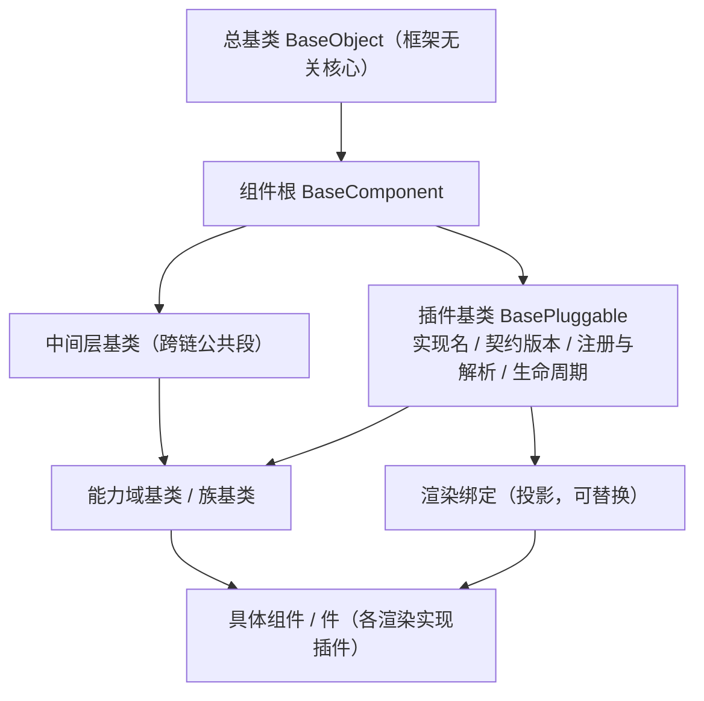

# 架构设计 · 前端组件体系

> BMS · 基类继承链、八类组件边界与实施约束

[架构设计](01_架构设计_总览.md) › 05-前端组件体系　|　[← 04-后端基础类体系](04_架构设计_后端基础类体系.md) · [06-核心交互时序 →](06_架构设计_核心交互时序.md)

> **本文档只写架构语义**：边界、职责、依赖方向、协作机制、约束与护栏原则。**实现细节**（代码落点、类与能力的命名、基类登记表、目录结构、护栏脚本与命令、任务编号与工时）一律不入本文——统一以《[前端基类清单](../../前端基类清单.md)》（实现侧单一权威：**继承链唯一权威**、基类登记表、落点与状态）与《[前端开发规范](../../规范/前端开发规范.md)》（强制口径与护栏规则）为准。**继承关系（谁继承谁、各族族谱）不在本节点重复描述，一律引用清单。**

## 1. 概述 

前端组件体系定义 PC 管理端通用组件的**架构定位、体系与边界、协作机制与实施约束**，是《[组件设计](../组件设计/01_组件设计_总览.md)》契约体系在架构层的落地依据。对应《[项目规划说明](../../规划/项目规划说明.md)》「前端页面清单与菜单机制」节「通用组件」与《[总体项目规划](../../规划/总体项目规划.md)》「阶段内容与完成标准」节阶段四；工程结构与页面体系见[08-前端架构](08_架构设计_前端架构.md)。

**为什么单列节点**：组件是前端开发的**前置基础**——列表页、表单页、弹窗、设计器等页面形态与全部业务模块都建立在通用组件之上，组件地基不完成，前端页面开发无法推进。因此组件体系不是前端架构的一个附属小节，而是与页面体系并列的独立架构面：组件语义与契约边界（职责 / 交互 / 取数与缓存语义）已在《组件设计》体系落定，架构层需要回答的是**继承链怎么叠、边界怎么划、与布局 / 页面 / 概要设计如何协作、如何分包加载与测试**——即本节点。组件实现落在**阶段四 前端组件库**（地基波），依赖后端能力的组件按对应阶段回补（见第 10 节）。

## 2. 体系定位与范围 

| 项 | 说明 |
| --- | --- |
| 面向 | 前端基座分层（框架无关核心 → 渲染绑定插件 → 渲染实现插件）与宿主装配；PC 管理端与移动端按「同接口多实现」各自组合 |
| 契约与实现 | 组件语义与契约边界见《[组件设计](../组件设计/01_组件设计_总览.md)》（实现侧命名与落点见《[前端基类清单](../../前端基类清单.md)》，实现契约细节见项目详细设计）；分层的职责、依赖方向、落点与状态以《前端基类清单》为准 |
| 规模 | 八类约 120 个设计节点（基础组件类 44、布局 11、容器 9、基础控件 8、字段 12、展示 14、交互 19、基础类 3） |
| 上游 | 《项目规划说明》（功能模块 / 页面清单与菜单机制节）、《[组件设计](../组件设计/01_组件设计_总览.md)》、《[布局设计](../布局设计/01_布局设计_总览.html)》、《[前端开发规范](../../规范/前端开发规范.md)》 |
| 下游 | 前端页面实现（阶段十五）、产品仓库前端模块（运行时加载，阶段五起） |
| 稳定性 | 稳定——组件契约或分层变更牵动使用该组件的全部页面，须先改设计节点再改代码 |

## 3. 前端基类体系（开放式，对齐后端基类体系） 

前端基类为**继承 + 抽象 + 开放扩展**：**主体内建（平台主线）一律沿继承链派生**（**总基类 → 组件根 → 插件基类 → 能力域基类 → 具体组件 / 件**），**横切功能即继承链上的基类**，公共字段 / 方法只在链上对应基类维护，任何组件与模块不得重复实现；**项目二次开发 / 定制走组合轨**（不继承平台基类、经统一注册通道接入、不回改平台基类）；两轨汇入同一登记与契约测试体系。与后端基类体系同构。强制口径见《[前端开发规范](../../规范/前端开发规范.md)》§1「架构铁律」与 §3；**各基类的身份、父基类、职责、代码位置、迁移映射与状态见《[前端基类清单](../../前端基类清单.md)》（前端继承链的唯一权威，全系统唯一一份，本节点不复制继承关系）**。

**结构语义**：**顶层固定三段**（**总基类 `BaseObject`** → **组件根 `BaseComponent`** → **插件基类 `BasePluggable`**，插件基类由平台《[扩展点与插件化](10_架构设计_子系统_扩展点与插件化.md)》§3「基类承载与双轨」承载「可替换实现」的装配语义——能力键 / 实现名 / 契约版本 / 注册与解析 / 生命周期）；其下**每条继承链按功能与抽象需要自行延伸、长短不一**——两条链出现公共段即提取**中间层基类**，同类组件的家族身份落为**族基类**（输入族 / 展示族 / 树族 / 图表族 / 编辑器族 …）；**不设固定层数、不做封闭枚举**。父子关系、族与族边界、落点与状态**一律以《[前端基类清单](../../前端基类清单.md)》§2 为准**。

- **依赖方向（强制）**：只准上位依赖下位，禁止反向依赖；框架无关核心不得依赖任何渲染框架 / UI 库 / 插件 / 宿主；插件之间不互相依赖；基类间依赖由继承关系确定并在登记表声明，链外不得自由挂接。
- **中间层基类**（挂载 / 资源释放 / 订阅 / 占位 / 标签语义 / 可校验 / 浮层 / 数据状态等跨链公共段）供其下位复用，不直接面向具体组件；**体系公共机制**（能力声明 / 占位 / 注册表 / 错误）由对应基类承载。
- **零例外**：一切基类从总基类派生（错误基座亦入链，`BaseError extends BaseObject, Error`，为唯一的有理由多重继承）。
- **演进**：新增基类 / 中间层 / 族基类走「候选 → 设计节点 → 评审确认 →《[前端基类清单](../../前端基类清单.md)》登记 → 契约用例」；不设层数 / 数量上限，不做封闭枚举。

### 框架无关核心与插件架构（设计变更，2026-09-16） 

**背景与根因**：原基类体系把渲染框架（前端框架 / UI 组件库）混进了基类层，由此产生一连串「技术冲突」——「双端同款（逐字节比对无差异）」「PC 依赖件无法移植到移动端」「移动端缺件」等，都是根因的表象。**正确口径**：「前端基类体系 = **纯 TS/JS 框架无关核心**；渲染框架与 UI 组件库只是**可替换的渲染插件**；移动端不是第二套前端，而是同一核心的另一插件实现」。与后端「纯 Python 基类 + 插件注册表 + 提供者」同构。

**目标分层（语义）**：

| 层 | 职责 | 约束 |
| --- | --- | --- |
| 框架无关核心 | 总基类 / 组件根 / 插件基类 / 中间层基类 / 能力域基类（含族基类）/ 领域逻辑 / 契约 | 不得依赖任何渲染框架、UI 库、插件与宿主；可独立测试、可换渲染实现 |
| 渲染绑定 | 组合式投影（核心实例 ↔ 框架响应式）、指令、令牌样式 | 依赖核心；投影只做适配、不承载判定逻辑 |
| 渲染实现插件 | UI 组件实现（PC 一套、移动端一套） | 依赖核心 + 绑定；插件之间不互相依赖；同契约多实现 |
| 宿主装配 | 路由 / 菜单运行时 / 页面 / 注入接线 | 依赖插件与核心；宿主不含基座实现 |

> 未来可加其他渲染引擎插件（React / Solid / Web Components…）——**换渲染框架只换绑定与渲染插件，核心与契约不动**。

**能力形态**：能力以「纯 TS 类 + 可订阅状态」承载（状态机 / 契约 / 生命周期在核心，不使用框架响应式）；核心提供**可订阅状态接口**（快照 / 订阅），供任意渲染引擎桥接；组件的调用面保持稳定。

**多实现与替换**：能力域注册表 + 提供者 + 实现名登记；**不注册不可用**（护栏 + 运行时校验）；PC 与移动端是**同契约的两个实现**，「双端同款」口径废止，改为「**同接口多实现 + 契约测试同一套断言**」。

**与后端同构对照**：

| 后端 | 前端（本变更后） |
| --- | --- |
| 纯 Python 基类体系（无 Web 框架） | 纯 TS 核心（无渲染框架、无 UI 库） |
| 能力域基类 → 插件中间层 → 能力域实现 | 能力域基类（纯 TS；链上逐级细化）→ 插件基类 `BasePluggable`（实现名 / 契约版本 / 注册与解析） |
| 插件注册表（键唯一） | 核心注册表（键唯一）+ 提供者 |
| 配置文件选择实现 | 实现名登记 + 配置选择（插件层装配） |
| 契约测试（所有实现同一套断言） | 契约测试（核心契约 + 各插件实现同一套断言） |
| 主体内建用继承、二次开发用组合 | 同（见《前端开发规范》§1「架构铁律」） |

**迁移与影响**：旧码处置——历史实现**降级为插件层参考实现**，框架无关核心按新分层重建；工程改为单仓多包 workspace；按阶段分批推进（**阶段划分、工时与验收见项目基线**：专项任务见《[02_07 框架无关核心重构](../../项目/04_前端组件库/任务/02_基础组件类/02_基础组件类_07_框架无关核心重构/02_基础组件类_07_框架无关核心重构.md)》）。影响面：前端规范 §3（分层与依赖护栏口径）、《前端基类清单》（按新分层重写）、组件设计各节点（框架无关契约 + 各端实现）、历史交付定位、用例与合规审计重跑。

### 执行护栏（机器强制） 

§3 的强制口径由**机器护栏**执行（不依赖自觉）；护栏规则与落点以《[前端开发规范](../../规范/前端开发规范.md)》§3.5 与《[前端基类清单](../../前端基类清单.md)》为准，随 CI 门禁（包级 lint / typecheck / test）执行：

| 护栏 | 强制内容 |
| --- | --- |
| 核心框架无关 | 框架无关核心不得依赖渲染框架 / UI 库 / 插件 / 宿主；核心包运行时依赖面为空 |
| 能力登记与依赖校验 | 链上各层必须登记并声明依赖；开发态校验（违规默认告警），无环、不反向 |
| 契约测试套件（同接口多实现） | 同一契约由各渲染实现插件跑**同一套断言** |
| 依赖方向 | 宿主 → 插件 → 核心；插件之间不互相依赖 |
| 清单对账 | 实现侧登记 ↔《前端基类清单》双向校验（漏登记 / 僵尸条目）；**待重建**（列入工程化待办） |
| 注册表「不注册不可用」 | 扩展点（路由·菜单 / 组件 / 字段渲染器 / 图标 / 工作台卡片）经注册表生效，未注册不生效（随微前端骨架落地） |

## 4. 八类组件与边界 

| 类别 | 编号 | 职责边界 | 继承 / 依赖（语义） |
| --- | --- | --- | --- |
| 基础组件类 | 44 | 总基类 / 组件根 + 插件基类 + 中间层基类 + 能力域基类（开放集合） | —（根与继承链上的各基类） |
| 布局组件类 | 01-11 | 页面 / 区域布局与结构（主框架 / 表单框架 / 页面容器 / 导航 / 主从 / 栅格 / 间距 / 分栏 / 页签 / 卡片 / 折叠） | 继承布局族基类（`BaseLayout`） |
| 容器组件类 | 01-09 | 承载内容的容器（弹窗抽屉 / 滚动 / 懒加载 / 全屏 / 自适应 / 虚拟列表 / 遮罩 / 分区 / 宽高比） | 继承容器族基类（`BaseContainer` / `BaseFormContainer` / `BaseOverlay`） |
| 基础控件类 | 01-08 | 无数据源、无特殊格式的基础输入（文本 / 文本域 / 密码 / 数字 / 下拉 / 单选 / 复选 / 开关） | 继承输入族基类（`BaseInput → BaseField → BaseValue`） |
| 字段类 | 01-12 | 带数据源、特殊交互或特殊格式的字段（字典 / 日期 / 数值金额 / 树选择 / 组织选择 / 上传 / 富文本 / 开关枚举 / 穿梭框 / 验证码 / 标签输入 / 级联） | 在输入族基类之上扩展（继承数据源族基类：`BaseOptionSource` / `BaseTreeData` / `BaseUploadEngine` 等） |
| 展示类 | 01-14 | 只读呈现（表格 / 筛选 / 标签描述 / 图表卡 / 异常空态 / 通知消息 / 全局搜索 / 文件预览 / 审计差异 / 指标卡 / 快捷入口 / 头像 / 二维码 / 水印） | 继承展示族基类（`BaseDisplay → BaseValue`；表格 / 列表沿 `BaseDataState`） |
| 交互类 | 01-19 | 承载操作流的容器、设计器与专用面板（导入导出 / 审批流 / 图标 / 代码编辑 / 表单设计器 / 流程建模 / 权限配置 / 报表 / 大屏 / AI / i18n / 表单渲染器 / 侧边菜单 / 向导 / 偏好 / 批量 / 主题 / 租户切换 / 打印） | 继承交互族基类（`BaseClickable` / `BaseDragDrop` / `BaseTabs` 等）与容器族基类 |
| 基础类 | 01-03 | 不带界面或横切的工具、指令与 store（请求封装 / 权限指令 / 格式化工具） | —（横切底座；非基类身份，落点见《前端基类清单》§8） |

边界原则：同一职责只落一处——布局只排结构不取数，展示只读不编辑，字段负责值语义与数据源，交互类负责操作流编排；跨类协作走继承链上的基类与契约，不直接耦合具体组件。

## 5. 与布局 / 页面 / 概要设计的关系 

- **布局设计之下、页面实现之上**：布局设计回答「页面怎么排」（主框架、列表页 / 表单页 / 弹窗形态、设计令牌），组件设计回答「排进去的通用组件怎么用、怎么交互、怎么取数」，页面实现只做组装；与布局设计冲突时以布局设计为准并先修订布局节点。
- **不推翻上游**：组件体系不做架构级新决策；涉及接口 / 缓存 / 数据表的组件变更（如字典字段批量接口）须先同步《[概要设计](../概要设计/01_概要设计_总览.md)》与架构对应节点，再落组件设计节点。
- **页面清单对应**：PC 页面（见[08-前端架构](08_架构设计_前端架构.md)第 5 节）由布局壳 + 通用组件组装；新增菜单 / 表单 / 按钮 / 字段无需发版，但新增或调整**组件**须先走组件设计节点。

## 6. 取数与缓存协作 

- 组件不直接拼 URL，统一经**契约 / 数据根**封装（落点见《[前端基类清单](../../前端基类清单.md)》「契约与横切底座」节）；响应统一按 `{code, message, data}` 解析，401 静默刷新。
- 字典、组织树等共享数据走对应 store 并复用缓存与版本比对，避免同屏重复请求；列表批量场景优先批量接口。
- 缓存策略（三防、key 规范、先写库后删缓存）以《[架构设计 · 数据架构](07_架构设计_数据架构.md)》「缓存架构」节为准，组件层只消费、不新造缓存。
- 组件固定文案走 i18n；业务数据 label 由接口按 locale 下发，组件只负责渲染（见[24-国际化](24_架构设计_子系统_国际化.md)）。

## 7. 分包与加载策略 

- 路由级按需分包；重组件（图表 / 大屏画布 / 表单设计器 / 流程建模 / 代码编辑器 / 富文本编辑器等，具体依赖见[08-前端架构](08_架构设计_前端架构.md)「技术要点」节）一律异步加载、独立分包，不进首屏主包。
- **运行时模块加载（阶段五起）**：产品与新业务页面以 Module Federation 远端模块运行时加载（独立构建产物、独立发布）；宿主维护**模块清单**（名称 / 入口 / 版本），共享依赖设单例模式防重复实例；平台自身页面维持主应用内构建期形态（过渡形态）。
- 基础组件类与基础控件类属高频基础设施，随主包或轻量公共 chunk 常驻；字段类 / 展示类按路由命中拆分。
- 性能预算与体积门禁以[08-前端架构](08_架构设计_前端架构.md)第 7 节与《[前端开发规范](../../规范/前端开发规范.md)》「构建体积预算」节为准；超预算页面列入优化清单跟踪。

## 8. 渲染器与扩展点注册机制 

需要「数据驱动渲染」的场景，前端以**渲染器 / 扩展点注册表**解耦元数据与具体组件：

- **表单渲染器**：按表单定制元数据分发字段组件（见[30-表单定制](30_架构设计_子系统_表单定制.md)）。
- **工作台卡片渲染器**：卡片元数据 → 内置功能卡渲染器；数据集类型走图表卡（见[29-首页工作台](29_架构设计_子系统_首页工作台.md)）。
- **图标**：统一经图标渲染件按 icon key 渲染，业务自绘图标按资产约定存放（见[03-总体架构](03_架构设计_总体架构.md)技术栈全景）。
- **扩展点注册（前端插件化）**：路由 / 菜单、页面区域、通用组件、字段渲染器、图标、工作台卡片、主题令牌统一以注册表组织，插件以注册方式挂接、组件不互相直接依赖；产品（biz / cw）前端模块以**运行时模块**加载（阶段五起；构建期合并为过渡形态）、注册即生效（见[08-前端架构](08_架构设计_前端架构.md)「前端插件化与运行时组合（微前端）」节与[10-扩展点与插件化](10_架构设计_子系统_扩展点与插件化.md)）。
- 注册表遵循「有新的能力就加一层，**新增即登记**」的扩展规则（《[前端开发规范](../../规范/前端开发规范.md)》§3.2）：候选 → 设计节点 → 评审确认 →《前端基类清单》登记；不设层数 / 数量上限，不做封闭枚举。新增 / 调整层或能力须同步《前端开发规范》章节、组件设计对应节点与本节点。

## 9. 组件测试与验收 

- **组件单测**：覆盖链上各层契约（受控值 / 三态 / `disabled` 合并 / 校验触发）与组件关键交互；覆盖率并入前端 coverage 门禁（整体 ≥ 70%，见[32-测试与质量](32_架构设计_测试与质量.md)）。
- **原型即验收基准**：《组件设计》各节点配套可交互原型为验收基线，实现须与原型交互与视觉一致。
- **同接口多实现**：同一契约由各渲染实现插件跑同一套断言（契约用例工厂），新增契约先落核心与契约用例。
- 组件语义与契约变更（行为 / 交互方式）须先更新组件设计节点，再改代码与引用页面。

## 10. 阶段落地（地基波 + 回补） 

组件实现拆两波：**地基波**在**阶段四 前端组件库**交付（前端页面开发的前置基础）；**依赖波**（字段 / 展示 / 交互类中依赖后端能力的组件）随对应阶段回补。任务树按八类收拢于阶段四目录，回补任务在计划表标依赖与窗口；**节点数、工时与排期见项目基线**（《[前端组件库计划](../../项目/04_前端组件库/计划/01_计划_前端组件库.md)》）。

| 波次 | 覆盖 | 交付阶段 |
| --- | --- | --- |
| 地基波 | 继承链上的基类（总基类 / 组件根 / 插件基类 / 中间层基类 / 能力域基类与族基类）、基础类、基础控件类、容器组件类、布局组件类（含侧边菜单），以及先行前置的展示类「异常与空状态」 | 四 前端组件库 |
| 依赖波 | 字段类（字典 / 组织选择 / 文件上传 / 验证码等） | 八 通用能力 / 七 RBAC 基础模块 / 六 认证与安全 |
| 依赖波 | 展示类（通知消息 / 文件预览 / 审计差异 / 全局搜索 / 图表卡等；异常与空状态已前置地基波） | 八 通用能力 / 十八 全文检索 / 十六 报表 BI |
| 依赖波 | 交互类（导入导出 / 权限配置 / 表单设计器 / 审批流 / 流程建模器 / 报表与大屏设计器 / AI 助手 / i18n 编辑器等；侧边菜单已前置地基波） | 八 通用能力 / 七 RBAC 基础模块 / 九 工作流引擎 / 十六 报表 BI / 十九 AI 能力 |

> 波次口径（2026-09-15 定案）：「异常与空状态」（展示类，被容器组件类与布局组件类主从空态复用）与「侧边菜单」（交互类，被主框架布局壳与宿主外壳复用）前置到地基波。具体节点数与工时以项目基线为准。

> 地基波不完成，则前端页面（阶段十五）与产品仓库前端模块无法推进——这是把组件库置于阶段一之后、前端页面之前的架构理由。阶段四同期交付**微前端骨架**（宿主薄壳与模块契约），阶段五完成运行时加载与模块清单，见 [08-前端架构](08_架构设计_前端架构.md) 与 [10-扩展点与插件化](10_架构设计_子系统_扩展点与插件化.md)。

> **2026-09-17 口径修正（第三次）**：本节与 §3 曾按「能力平铺 + 组合轨默认」（一次返工）与「能力入继承链 + 固定分层」（二次返工）表述；**本轮最终口径为：不设固定分层、横切功能即继承链上的基类、每条链长短由功能与抽象需要决定**（顶层固定三段：总基类 → 组件根 → 插件基类），主体内建走继承轨、平台之外的定制走组合轨。基类的身份、父基类、落点与迁移映射**统一归《[前端基类清单](../../前端基类清单.md)》（全系统唯一一份）**，强制口径见《[前端开发规范](../../规范/前端开发规范.md)》§1「架构铁律」与 §3.4。**本节点不复制继承关系。**

## 11. 关联节点 

- [08-前端架构](08_架构设计_前端架构.md)：双工程、动态菜单与页面体系
- [10-扩展点与插件化](10_架构设计_子系统_扩展点与插件化.md)：前端扩展点、注册表与运行时模块（构建期合并为过渡）
- [03-总体架构](03_架构设计_总体架构.md)：目录结构、技术栈全景、阶段映射
- [07-数据架构](07_架构设计_数据架构.md)：缓存架构与取数约束
- [29-首页工作台](29_架构设计_子系统_首页工作台.md)：卡片渲染器注册表
- [30-表单定制](30_架构设计_子系统_表单定制.md)：布局驱动的表单渲染器
- [24-国际化](24_架构设计_子系统_国际化.md)：组件 i18n 与业务文案来源
- [32-测试与质量](32_架构设计_测试与质量.md)：组件测试与覆盖率门禁

> 架构设计节点 · 与《项目规划说明》《组件设计》《前端开发规范》《文档生成规范》《命名规范》配套
