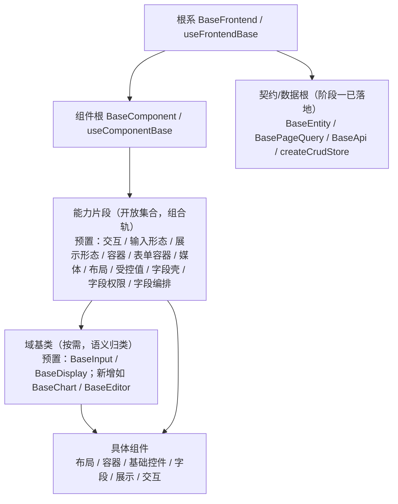

# 架构设计 · 前端组件体系

> BMS · 基础类分层、八类组件边界与实施约束

[架构设计](01_架构设计_总览.md) › 05-前端组件体系　|　[← 04-后端基础类体系](04_架构设计_后端基础类体系.md) · [06-核心交互时序 →](06_架构设计_核心交互时序.md)

## 1. 概述 

前端组件体系定义 PC 管理端（Vue 3 + Element Plus）通用组件的**架构定位、体系与边界、协作机制与实施约束**，是《[组件设计](../组件设计/01_组件设计_总览.md)》契约体系在架构层的落地依据。对应《[项目规划说明](../../规划/项目规划说明.md)》的「前端页面清单与菜单机制」节「通用组件」与「开发计划与验收标准」节阶段四；工程结构与页面体系见[08-前端架构](08_架构设计_前端架构.md)。

**为什么单列节点**：组件是前端开发的**前置基础**——列表页、表单页、弹窗、设计器等页面形态与全部业务模块都建立在通用组件之上，组件地基不完成，前端页面开发无法推进。因此组件体系不是前端架构的一个附属小节，而是与页面体系并列的独立架构面：组件契约（Props/事件/取数/边界）已在《组件设计》体系落定，架构层需要回答的是**分层怎么叠、边界怎么划、与布局/页面/概要设计如何协作、如何分包加载与测试**——即本节点。组件实现落在**阶段四 前端组件库**（地基波），依赖后端能力的组件按对应阶段回补（见第 10 节）。

## 2. 体系定位与范围 

| 项 | 说明 |
| --- | --- |
| 面向 | PC 管理端 `frontend/`；移动端 `frontend-mobile/`（Vant 生态）不套用 PC 组件 |
| 目录 | 契约文档 `bms文档/设计/组件设计/`；实现 `frontend/src/components/`、`frontend/src/utils/`、`frontend/src/stores/` |
| 规模 | 八类约 90 个节点（基础组件类 15：机制基类 2 + 能力片段 11（清单预置 31，新增设计节点随实施补建）+ 域基类 2；布局 11、容器 9、基础控件 8、字段 12、展示 14、交互 19、基础类 3） |
| 上游 | 《项目规划说明》（功能模块 / 页面清单与菜单机制节）、《[组件设计](../组件设计/01_组件设计_总览.md)》、《[布局设计](../布局设计/01_布局设计_总览.html)》、《[前端开发规范](../../规范/前端开发规范.md)》 |
| 下游 | 前端页面实现（阶段十五）、产品仓库前端片段（运行时加载，阶段五起） |
| 稳定性 | 稳定——组件契约或分层变更牵动使用该组件的全部页面，须先改设计节点再改代码 |

## 3. 前端基类体系（开放式，对齐后端基类体系） 

前端基类不做固定层号 / 数量枚举，按**角色 + 开放扩展**组织（与后端 `BaseObject → BaseCapability → BasePluggable` 中间层体系同构）：**公共字段/方法只在对应基类或能力片段维护，任何组件与模块不得重复实现**；新增能力 = 新增**片段**（或按需域基类）+ 登记，不改根。分层强制口径见《[前端开发规范](../../规范/前端开发规范.md)》「前端基类体系」节，权威清单见《[前端基类清单](../../前端基类清单.md)》，本节给出架构视角的角色关系与落地位置。

| 角色 | 基类 / 片段 | 代码落地位置 | 实施阶段 |
| --- | --- | --- | --- |
| 根系 | `BaseFrontend` / `useFrontendBase`：横切通用（命名空间 / 日志 / 错误上报 / 配置 / i18n / 生命周期），无 UI | `src/base/base.ts`（规划） | 阶段四 |
| 契约/数据根 | `BaseEntity` / `BasePageQuery` / `BaseApi` / `createCrudStore` / `stableStringify` | `src/api/`、`src/stores/`、`src/utils/` | **阶段一已落地**（不重复建设） |
| 组件根 | `BaseComponent` / `useComponentBase`：attrs 透传 / 尺寸密度 / 主题令牌 / i18n / 可访问性 / loading | `src/base/component.ts`（规划） | 阶段四 |
| 能力片段（开放集合） | 预置 31：交互 `useInteractive` / 输入形态 `useInputControl` / 展示形态 `useDisplayControl` / 容器 `useContainer` / 表单容器 `useFormContainer` / 媒体 `useMedia` / 布局 `useLayout` / 受控值 `useValue` / 字段壳 `useFieldShell` / 字段权限 `useFieldPerm` / 字段编排 `useField` / 选项源 `useOptionSource` / 上传引擎 `useUploadEngine` / 异步任务 `useAsyncTask` / 页签状态 `useTabs` / 偏好持久化 `usePersistedState` / 编辑器内核 `useEditorKernel` / 树数据 `useTreeData` / 用户展示 `useUserDisplay` / 权限上下文 `useAccess` / 列配置 `useColumnConfig` / 查询方案 `useQueryScheme` / 水印 `useWatermark` / 片段上下文 `useFragmentContext` / 动态路由 `useDynamicRoutes` / 表单元数据 `useFormMeta` / 预签名 `usePresignedUrl` / 拖拽基座 `useDragDrop` / 设计令牌 `useDesignToken` / 表单页 `useFormPage` / 语言上下文 `useLocale` | `src/components/base/<能力域>/index.ts`（规划） | 阶段四（预置）；**新增片段随需** |
| 域基类（按需） | 预置 `BaseInput`（输入域）/ `BaseDisplay`（展示域）；示例新增 `BaseTree` / `BaseChart`，后续按需（如 `BaseEditor`） | 同上 | 阶段四（预置）；**新增域随需** |

约定：

- **依赖方向**：只准上层依赖下层（具体组件 → 域基类/片段 → 组件根 → 根系）；基类不得依赖具体组件；片段之间依赖须单向并登记。层次由依赖关系决定，**不设层数上限**。
- **组合轨默认**：Vue 3 无类多继承，组件以**组合多个能力片段**为主（如展示域 = 展示形态片段 + 受控值片段）；需要语义归类时再派生域基类（可选，不强制固定长继承链）。
- **开放扩展（对齐后端）**：新增片段/基类走「候选 → 设计节点 → 评审确认 →《前端基类清单》登记」；七形态仅为首批**预置片段**，非封闭枚举；不做「第几层」绑定。
- **命名**：基类一律 `BaseXxx`、组合式 `useXxxBase` / `useXxx`；片段以能力命名（详见《[命名规范](../../规范/命名规范.md)》「前端命名」节）。
- **双端同款基线**：`frontend` 与 `frontend-mobile` 同步扩展基类能力，不得只在单端加。

## 4. 八类组件与边界 

| 类别 | 编号 | 职责边界 | 继承 / 依赖 |
| --- | --- | --- | --- |
| 基础组件类 | 15 | 机制基类（根系 / 组件根）+ 能力片段（开放集合）+ 域基类（按需） | —（根） |
| 布局组件类 | 01-11 | 页面/区域布局与结构（主框架/表单框架/页面容器/导航/主从/栅格/间距/分栏/页签/卡片/折叠） | 组合布局片段 `useLayout` |
| 容器组件类 | 01-09 | 承载内容的容器（弹窗抽屉/滚动/懒加载/全屏/自适应/虚拟列表/遮罩/分区/宽高比） | 组合容器 / 表单容器片段 |
| 基础控件类 | 01-08 | 无数据源、无特殊格式的基础输入（文本/文本域/密码/数字/下拉/单选/复选/开关） | 派生输入域基类（组合输入形态 + 字段链片段） |
| 字段类 | 01-12 | 带数据源、特殊交互或特殊格式的字段（字典/日期/数值金额/树选择/组织选择/上传/富文本/开关枚举/穿梭框/验证码/标签输入/级联） | 在基础控件之上扩展（新增片段随需） |
| 展示类 | 01-14 | 只读呈现（表格/筛选/标签描述/图表卡/异常空态/通知消息/全局搜索/文件预览/审计差异/指标卡/快捷入口/头像/二维码/水印） | 派生展示域基类（组合展示形态 + 受控值片段） |
| 交互类 | 01-19 | 承载操作流的容器、设计器与专用面板（导入导出/审批流/图标/code 编辑/表单设计器/流程建模/权限配置/报表/大屏/AI/i18n/表单渲染器/侧边菜单/向导/偏好/批量/主题/租户切换/打印） | 组合容器 + 展示 + 字段片段 |
| 基础类 | 01-03 | 不带界面或横切的工具、指令与 store（请求封装/权限指令/格式化工具） | — |

边界原则：同一职责只落一处——布局只排结构不取数，展示只读不编辑，字段负责值语义与数据源，交互类负责操作流编排；跨类协作走基类与契约，不直接耦合具体组件。

## 5. 与布局 / 页面 / 概要设计的关系 

- **布局设计之下、页面实现之上**：布局设计回答「页面怎么排」（主框架、列表页/表单页/弹窗形态、设计令牌），组件设计回答「排进去的通用组件怎么用、怎么交互、怎么取数」，页面实现只做组装；与布局设计冲突时以布局设计为准并先修订布局节点。
- **不推翻上游**：组件体系不做架构级新决策；涉及接口/缓存/数据表的组件变更（如字典字段批量接口）须先同步《[概要设计](../概要设计/01_概要设计_总览.md)》与架构对应节点，再落组件设计节点。
- **页面清单对应**：PC 页面（见[08-前端架构](08_架构设计_前端架构.md)第 5 节）由布局壳 + 通用组件组装；新增菜单/表单/按钮/字段无需发版，但新增或调整**组件**须先走组件设计节点。

## 6. 取数与缓存协作 

- 组件不直接拼 URL，统一经契约/数据根 `BaseApi` / `src/api/` 封装；响应统一按 `{code, message, data}` 解析，401 静默刷新。
- 字典、组织树等共享数据走对应 store 并复用缓存与版本比对，避免同屏重复请求；列表批量场景优先批量接口。
- 缓存策略（三防、key 规范、先写库后删缓存）以《[架构设计 · 数据架构](07_架构设计_数据架构.md)》「缓存架构」节为准，组件层只消费、不新造缓存。
- 组件固定文案走 vue-i18n；业务数据 label 由接口按 locale 下发，组件只负责渲染（见[24-国际化](24_架构设计_子系统_国际化.md)）。

## 7. 分包与加载策略 

- 路由级按需分包；重组件（ECharts/图表卡、大屏 vue-flow、表单设计器 vuedraggable、流程建模 bpmn-js、代码编辑器 CodeMirror 6、富文本 wangEditor）一律异步加载、独立分包，不进首屏主包。
- **运行时片段加载（阶段五起）**：产品与新业务页面以 Module Federation 远端模块运行时加载（独立构建产物、独立发布）；宿主维护**片段清单**（名称 / 入口 / 版本），`shared` 依赖（vue / pinia / vue-router / vue-i18n 等）设 `singleton` 防重复实例；平台自身页面维持主应用内构建期形态（过渡形态）。
- 基础组件类与基础控件类属高频基础设施，随主包或轻量公共 chunk 常驻；字段类 / 展示类按路由命中拆分。
- 性能预算（单页 JS 包 gzip ≤ 300KB、Core Web Vitals 目标）以[08-前端架构](08_架构设计_前端架构.md)第 7 节为准；超预算页面列入优化清单跟踪。

## 8. 渲染器与扩展点注册机制 

需要「数据驱动渲染」的场景，前端以**渲染器 / 扩展点注册表**解耦元数据与具体组件：

- **表单渲染器**（`FormRenderer`）：按 `sys_form_layout` + `sys_field`/`sys_field_ext` 元数据分发字段组件（见[30-表单定制](30_架构设计_子系统_表单定制.md)）。
- **工作台卡片渲染器**：`sys_dashboard_card.render_key` → 内置功能卡渲染器；`card_type=dataset` 走图表卡（见[29-首页工作台](29_架构设计_子系统_首页工作台.md)）。
- **图标**：icon key 统一经 `IconDisplay` 渲染，业务自绘 SVG 放 `src/assets/icons/`（见[03-总体架构](03_架构设计_总体架构.md)技术栈全景）。
- **扩展点注册（前端插件化）**：路由/菜单、页面区域、通用组件、字段渲染器、图标、工作台卡片、主题令牌统一以注册表组织，插件以注册方式挂接、组件不互相直接依赖；产品（biz/cw）前端模块以**运行时片段**加载（阶段五起；构建期合并为过渡形态）、注册即生效（见[08-前端架构](08_架构设计_前端架构.md)「前端插件化与运行时组合（微前端）」节与[10-扩展点与插件化](10_架构设计_子系统_扩展点与插件化.md)）。
- 注册表遵循「有新的能力就加一个片段/基类，**新增即登记**」的扩展规则（《[前端开发规范](../../规范/前端开发规范.md)》「扩展规则」节）：候选 → 设计节点 → 评审确认 →《前端基类清单》登记；不设层数 / 数量上限，不做封闭枚举。新增/调整基类或片段须同步《前端开发规范》章节、组件设计对应节点与本节点。

## 9. 组件测试与验收 

- **组件单测**：Vitest + @vue/test-utils，覆盖基类契约（受控值 / 三态 / `disabled` 合并 / 校验触发）与组件关键交互；覆盖率并入前端 Vitest coverage 门禁（整体 ≥ 70%，见[32-测试与质量](32_架构设计_测试与质量.md)）。
- **原型即验收基准**：《组件设计》各节点配套可交互原型为验收基线，实现须与原型交互与视觉一致（对齐 Element Plus 行为）。
- 组件契约变更（Props/事件/取数方式）须先更新组件设计节点，再改代码与引用页面。

## 10. 阶段落地（地基波 + 回补） 

组件实现拆两波：**地基波**在**阶段四 前端组件库**交付（前端页面开发的前置基础）；**依赖波**（字段 / 展示 / 交互类中依赖后端能力的组件）随对应阶段回补。任务树按八类收拢于阶段四目录，回补任务在计划表标依赖与窗口。

| 波次 | 覆盖 | 节点数 | 交付阶段 |
| --- | --- | --- | --- |
| 地基波 | 机制基类（根系 / 组件根）+ 能力片段（预置）+ 域基类（预置）、基础类、基础控件类、容器组件类、布局组件类（含侧边菜单），以及随地基波先行的展示类「异常与空状态」 | 48 | 四 前端组件库 |
| 依赖波 | 字段类（字典 / 组织选择 / 文件上传 / 验证码等） | 12 | 八 通用能力 / 七 RBAC 基础模块 / 六 认证与安全 |
| 依赖波 | 展示类（通知消息 / 文件预览 / 审计差异 / 全局搜索 / 图表卡等；异常与空状态已前置地基波） | 13 | 八 通用能力 / 十八 全文检索 / 十六 报表 BI |
| 依赖波 | 交互类（导入导出 / 权限配置 / 表单设计器 / 审批流 / 流程建模器 / 报表与大屏设计器 / AI 助手 / i18n 编辑器等；侧边菜单已前置地基波） | 18 | 八 通用能力 / 七 RBAC 基础模块 / 九 工作流引擎 / 十六 报表 BI / 十九 AI 能力 |

> 波次口径按阶段四任务重排（2026-09-15）同步：原列回补波的「异常与空状态」（展示类，被 03 容器组件类 `LoadingContainer`、02 布局组件类主从空态复用）与「侧边菜单」（交互类，被 02 主框架布局壳、09 宿主外壳复用）前置到地基波，故地基波 48 节点、回补 43 节点；阶段四任务顺序与工时（地基波 202h + 占位 49h + 回补 66h）见《前端组件库计划》。

> 地基波不完成，则前端页面（阶段十五）与产品仓库前端片段无法推进——这是把组件库置于阶段一之后、前端页面之前的架构理由。阶段四同期交付**微前端骨架**（宿主薄壳与片段契约），阶段五完成运行时加载与片段清单，见 [08-前端架构](08_架构设计_前端架构.md) 与 [10-扩展点与插件化](10_架构设计_子系统_扩展点与插件化.md)。

## 11. 关联节点 

- [08-前端架构](08_架构设计_前端架构.md)：双工程、动态菜单与页面体系（基类体系与目录登记见本节点）
- [10-扩展点与插件化](10_架构设计_子系统_扩展点与插件化.md)：前端扩展点、注册表与运行时片段（构建期合并为过渡）
- [03-总体架构](03_架构设计_总体架构.md)：目录结构、技术栈全景、阶段映射
- [07-数据架构](07_架构设计_数据架构.md)：缓存架构与取数约束
- [29-首页工作台](29_架构设计_子系统_首页工作台.md)：卡片渲染器注册表
- [30-表单定制](30_架构设计_子系统_表单定制.md)：布局驱动的表单渲染器
- [24-国际化](24_架构设计_子系统_国际化.md)：组件 i18n 与业务文案来源
- [32-测试与质量](32_架构设计_测试与质量.md)：组件测试与覆盖率门禁

> 架构设计节点 · 与《项目规划说明》《组件设计》《前端开发规范》《文档生成规范》《命名规范》配套
