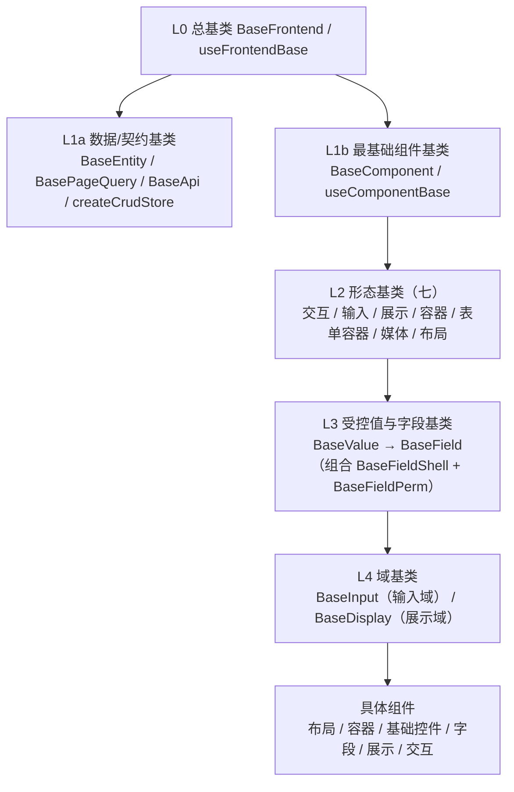

# 架构设计 · 前端组件体系

> BMS · 基础类分层、八类组件边界与实施约束

[架构设计](01_架构设计_总览.md) › 05-前端组件体系　|　[← 04-后端基础类体系](04_架构设计_后端基础类体系.md) · [06-核心交互时序 →](06_架构设计_核心交互时序.md)

## 1. 概述 

前端组件体系定义 PC 管理端（Vue 3 + Element Plus）通用组件的**架构定位、分层与边界、协作机制与实施约束**，是《[组件设计](../组件设计/01_组件设计_总览.md)》契约体系在架构层的落地依据。对应《[项目规划说明](../../规划/项目规划说明.md)》的「前端页面清单与菜单机制」节「通用组件」与「开发计划与验收标准」节阶段三；工程结构与页面体系见[30-前端架构](30_架构设计_前端架构.md)。

**为什么单列节点**：组件是前端开发的**前置基础**——列表页、表单页、弹窗、设计器等页面形态与全部业务模块都建立在通用组件之上，组件地基不完成，前端页面开发无法推进。因此组件体系不是前端架构的一个附属小节，而是与页面体系并列的独立架构面：组件契约（Props/事件/取数/边界）已在《组件设计》体系落定，架构层需要回答的是**分层怎么叠、边界怎么划、与布局/页面/概要设计如何协作、如何分包加载与测试**——即本节点。组件实现落在**阶段三 前端组件库**（地基波），依赖后端能力的组件按对应阶段回补（见第 10 节）。

## 2. 体系定位与范围 

| 项 | 说明 |
| --- | --- |
| 面向 | PC 管理端 `frontend/`；移动端 `frontend-mobile/`（Vant 生态）不套用 PC 组件 |
| 目录 | 契约文档 `bms文档/设计/组件设计/`；实现 `frontend/src/components/`、`frontend/src/utils/`、`frontend/src/stores/` |
| 规模 | 八类约 90 个节点（基础组件类 L0-L4 共 14、布局 11、容器 9、基础控件 8、字段 12、展示 14、交互 19、基础类 3） |
| 上游 | 《项目规划说明》（功能模块 / 页面清单与菜单机制节）、《[组件设计](../组件设计/01_组件设计_总览.md)》、《[布局设计](../布局设计/01_布局设计_总览.html)》、《[前端开发规范](../../规范/前端开发规范.md)》 |
| 下游 | 前端页面实现（阶段十三）、产品仓库前端模块（构建期合并） |
| 稳定性 | 稳定——组件契约或分层变更牵动使用该组件的全部页面，须先改设计节点再改代码 |

## 3. 基础类分层体系 

所有基类收敛为一套分层体系：**公共字段/方法只在对应层基类维护，任何组件与模块不得重复实现**；调整某一层基类即全链生效（适配海量字段与页面）。分层权威定义见《[前端开发规范](../../规范/前端开发规范.md)》「前端基础类体系」节，本节给出架构视角的层间关系与落地位置。

| 层 | 基类 / 能力 | 代码落地位置 | 实施阶段 |
| --- | --- | --- | --- |
| L0 | `BaseFrontend` / `useFrontendBase` | `src/components/base/`（L0） | 阶段三 |
| L1a | 数据/契约基类（`BaseEntity` / `BasePageQuery` / `BaseApi` / `createCrudStore` / `stableStringify`） | `src/api/`、`src/stores/`、`src/utils/` | **阶段一已落地**（组件库不重复建设） |
| L1b | `BaseComponent` / `useComponentBase` | `src/components/base/`（L1b） | 阶段三 |
| L2 | 七形态基类（交互 / 输入 / 展示 / 容器 / 表单容器 / 媒体 / 布局） | `src/components/base/`（L2） | 阶段三 |
| L3 | `BaseValue` → `BaseField`（组合 `BaseFieldShell` / `BaseFieldPerm`） | `src/components/base/`（L3） | 阶段三 |
| L4 | `BaseInput`（输入域） / `BaseDisplay`（展示域） | `src/components/base/`（L4） | 阶段三 |

约定：只准上层依赖下层，**禁止反向依赖**（L4 不得依赖具体组件，L0 不得依赖任何上层）；基类一律 `Base` 打头，非 `Base` 打头为具体组件；Vue 3 无类多继承，统一以**组合式函数 + 组件包装**模拟继承，一个组件可组合多个基类（如展示域 = 展示形态基类 + 受控值基类）；字段控件统一继承链为 `具体控件 → BaseInput(L4) → BaseField(L3) → BaseValue(L3) → BaseInputControl(L2) → BaseComponent(L1b) → BaseFrontend(L0)`；双端同款基线——`frontend` 与 `frontend-mobile` 同步扩展基类能力，不得只在单端加。

## 4. 八类组件与边界 

| 类别 | 编号 | 职责边界 | 继承 / 依赖 |
| --- | --- | --- | --- |
| 基础组件类 | L0-L4（14） | 被上层继承的抽象基类层 | —（根） |
| 布局组件类 | 01-11 | 页面/区域布局与结构（主框架/表单框架/页面容器/导航/主从/栅格/间距/分栏/页签/卡片/折叠） | 继承 L2-07 布局组件基类 |
| 容器组件类 | 01-09 | 承载内容的容器（弹窗抽屉/滚动/懒加载/全屏/自适应/虚拟列表/遮罩/分区/宽高比） | 继承 L2-04 / L2-05 |
| 基础控件类 | 01-08 | 无数据源、无特殊格式的基础输入（文本/文本域/密码/数字/下拉/单选/复选/开关） | 继承 L4-01 输入域基类 |
| 字段类 | 01-12 | 带数据源、特殊交互或特殊格式的字段（字典/日期/数值金额/树选择/组织选择/上传/富文本/开关枚举/穿梭框/验证码/标签输入/级联） | 在基础控件之上扩展 |
| 展示类 | 01-14 | 只读呈现（表格/筛选/标签描述/图表卡/异常空态/通知消息/全局搜索/文件预览/审计差异/指标卡/快捷入口/头像/二维码/水印） | 继承 L4-02 展示域基类 |
| 交互类 | 01-19 | 承载操作流的容器、设计器与专用面板（导入导出/审批流/图标/code 编辑/表单设计器/流程建模/权限配置/报表/大屏/AI/i18n/表单渲染器/侧边菜单/向导/偏好/批量/主题/租户切换/打印） | 组合容器 + 展示 + 字段 |
| 基础类 | 01-03 | 不带界面或横切的工具、指令与 store（请求封装/权限指令/格式化工具） | — |

边界原则：同一职责只落一处——布局只排结构不取数，展示只读不编辑，字段负责值语义与数据源，交互类负责操作流编排；跨类协作走基类与契约，不直接耦合具体组件。

## 5. 与布局 / 页面 / 概要设计的关系 

- **布局设计之下、页面实现之上**：布局设计回答「页面怎么排」（主框架、列表页/表单页/弹窗形态、设计令牌），组件设计回答「排进去的通用组件怎么用、怎么交互、怎么取数」，页面实现只做组装；与布局设计冲突时以布局设计为准并先修订布局节点。
- **不推翻上游**：组件体系不做架构级新决策；涉及接口/缓存/数据表的组件变更（如字典字段批量接口）须先同步《[概要设计](../概要设计/01_概要设计_总览.md)》与架构对应节点，再落组件设计节点。
- **页面清单对应**：PC 页面（见[30-前端架构](30_架构设计_前端架构.md)第 5 节）由布局壳 + 通用组件组装；新增菜单/表单/按钮/字段无需发版，但新增或调整**组件**须先走组件设计节点。

## 6. 取数与缓存协作 

- 组件不直接拼 URL，统一经 L1a `BaseApi` / `src/api/` 封装；响应统一按 `{code, message, data}` 解析，401 静默刷新。
- 字典、组织树等共享数据走对应 store 并复用缓存与版本比对，避免同屏重复请求；列表批量场景优先批量接口。
- 缓存策略（三防、key 规范、先写库后删缓存）以《[架构设计 · 数据架构](07_架构设计_数据架构.md)》「缓存架构」节为准，组件层只消费、不新造缓存。
- 组件固定文案走 vue-i18n；业务数据 label 由接口按 locale 下发，组件只负责渲染（见[22-国际化](22_架构设计_子系统_国际化.md)）。

## 7. 分包与加载策略 

- 路由级按需分包；重组件（ECharts/图表卡、大屏 vue-flow、表单设计器 vuedraggable、流程建模 bpmn-js、代码编辑器 CodeMirror 6、富文本 wangEditor）一律异步加载、独立分包，不进首屏主包。
- 基础组件类与基础控件类属高频基础设施，随主包或轻量公共 chunk 常驻；字段类 / 展示类按路由命中拆分。
- 性能预算（单页 JS 包 gzip ≤ 300KB、Core Web Vitals 目标）以[30-前端架构](30_架构设计_前端架构.md)第 7 节为准；超预算页面列入优化清单跟踪。

## 8. 渲染器注册机制 

需要「数据驱动渲染」的场景，前端以**渲染器注册表**解耦元数据与具体组件：

- **表单渲染器**（`FormRenderer`）：按 `sys_form_layout` + `sys_field`/`sys_field_ext` 元数据分发字段组件（见[28-表单定制](28_架构设计_子系统_表单定制.md)）。
- **工作台卡片渲染器**：`sys_dashboard_card.render_key` → 内置功能卡渲染器；`card_type=dataset` 走图表卡（见[27-首页工作台](27_架构设计_子系统_首页工作台.md)）。
- **图标**：icon key 统一经 `IconDisplay` 渲染，业务自绘 SVG 放 `src/assets/icons/`（见[03-总体架构](03_架构设计_总体架构.md)技术栈全景）。
- 注册表遵循「有新的类型就加一种基类、有新的扩展就加一层基类」的扩展规则（《[前端开发规范](../../规范/前端开发规范.md)》「扩展规则」节）；新增/调整基类须同步《前端开发规范》章节、组件设计对应节点与本节点。

## 9. 组件测试与验收 

- **组件单测**：Vitest + @vue/test-utils，覆盖基类契约（受控值 / 三态 / `disabled` 合并 / 校验触发）与组件关键交互；覆盖率并入前端 Vitest coverage 门禁（整体 ≥ 70%，见[31-测试与质量](31_架构设计_测试与质量.md)）。
- **原型即验收基准**：《组件设计》各节点配套可交互原型为验收基线，实现须与原型交互与视觉一致（对齐 Element Plus 行为）。
- 组件契约变更（Props/事件/取数方式）须先更新组件设计节点，再改代码与引用页面。

## 10. 阶段落地（地基波 + 回补） 

组件实现拆两波：**地基波**在**阶段三 前端组件库**交付（前端页面开发的前置基础）；**依赖波**（字段 / 展示 / 交互类中依赖后端能力的组件）随对应阶段回补。任务树按八类收拢于阶段三目录，回补任务在计划表标依赖与窗口。

| 波次 | 覆盖 | 节点数 | 交付阶段 |
| --- | --- | --- | --- |
| 地基波 | 基础组件类 L0-L4、布局组件类、容器组件类、基础控件类、基础类 | 约 45 | 二 前端组件库 |
| 依赖波 | 字段类（字典 / 组织选择 / 文件上传 / 验证码等） | 12 | 五 通用能力 / 四 RBAC / 三 认证 |
| 依赖波 | 展示类（通知消息 / 文件预览 / 审计差异 / 全局搜索 / 图表卡等） | 14 | 五 / 十五 全文检索 / 十三 报表 BI |
| 依赖波 | 交互类（导入导出 / 权限配置 / 表单设计器 / 审批流 / 流程建模器 / 报表与大屏设计器 / AI 助手 / i18n 编辑器等） | 19 | 五 / 四 / 六 工作流 / 十三 / 十六 AI |

> 地基波不完成，则前端页面（阶段十三）与产品仓库前端模块无法推进——这是把组件库置于阶段一之后、前端页面之前的架构理由。

## 11. 关联节点 

- [30-前端架构](30_架构设计_前端架构.md)：双工程、动态菜单与页面体系（组件分层登记见本节点）
- [03-总体架构](03_架构设计_总体架构.md)：目录结构、技术栈全景、阶段映射
- [07-数据架构](07_架构设计_数据架构.md)：缓存架构与取数约束
- [27-首页工作台](27_架构设计_子系统_首页工作台.md)：卡片渲染器注册表
- [28-表单定制](28_架构设计_子系统_表单定制.md)：布局驱动的表单渲染器
- [22-国际化](22_架构设计_子系统_国际化.md)：组件 i18n 与业务文案来源
- [31-测试与质量](31_架构设计_测试与质量.md)：组件测试与覆盖率门禁

> 架构设计节点 · 与《项目规划说明》《组件设计》《前端开发规范》《文档生成规范》《命名规范》配套
