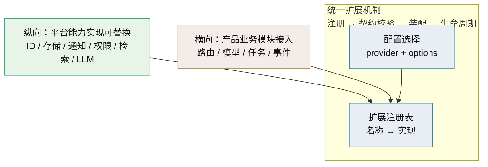
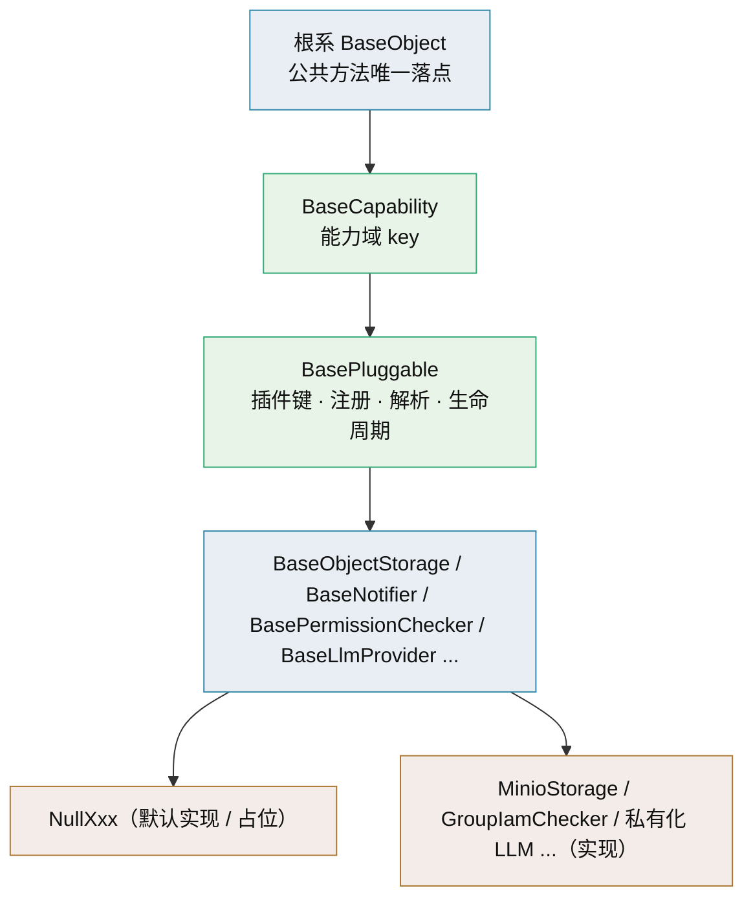
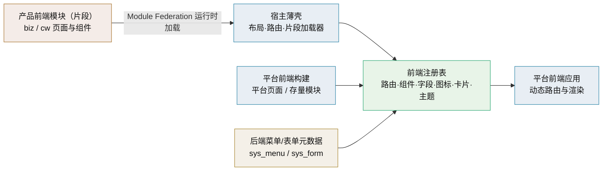

# 架构设计 · 子系统 · 扩展点与插件化

> BMS · 平台能力可替换（纵向）与产品模块接入（横向）的统一扩展机制

[架构设计](01_架构设计_总览.md) › 10-扩展点与插件化　|　[← 09-接口与集成](09_架构设计_接口与集成.md) · [11-模块注册 →](11_架构设计_子系统_模块注册.md)

## 1. 概述 <a id="overview"></a>

本节点定义 BMS 的**统一扩展机制**：平台自身能力的实现可替换（**纵向**，如 ID 生成、对象存储、通知、权限判定、检索、LLM 适配），与产品业务模块可挂接（**横向**，biz/cw 模块接入）。两轴共用同一套「注册 → 契约校验 → 装配 → 生命周期」机制，差异只在注册要素与权限边界。

对应[《项目规划说明》](../../规划/项目规划说明.md)「平台扩展接入流程」章节（23.10 平台能力插件化）与「选型说明」章节（插件化条目）；上承 [04-后端基础类体系](04_架构设计_后端基础类体系.md)（基类承载）与 [11-模块注册](11_架构设计_子系统_模块注册.md)（横向注册），机制策略见[《平台可扩展性规划》](../../规划/平台可扩展性规划.md)，实现细节与开发 SOP 见知识档案《[插件化架构](../../资料/知识档案/插件化架构/01_插件化架构_总览.md)》。

**设计动因**：平台技术栈以免费开源为主——上游可能停维护/换维护者/改许可，且非商业版功能深度有限、客户可能指定商业组件。可替换是**风险对冲**：把「选型错误」与「上游变化」的代价从「伤筋动骨」降为「换个适配器」（策略与迁移见知识档案《[开源与商业组件可替换](../../资料/知识档案/插件化架构/02_插件化架构_开源与商业组件可替换.md)》）。

## 2. 两轴模型 <a id="axes"></a>



| 轴 | 内容 | 注册要素 | 承载节点 |
| --- | --- | --- | --- |
| 纵向：能力可替换 | 平台内建能力的**实现**可选可换（多选一） | 能力名（`plugin_key`）+ 实现名（`plugin_name`） | 本节点、[04-后端基础类体系](04_架构设计_后端基础类体系.md) |
| 横向：模块接入 | 产品业务模块挂进平台运行 | 模块简称 / 表前缀 / 错误码段 / 事件域 | [11-模块注册](11_架构设计_子系统_模块注册.md)、[09-接口与集成](09_架构设计_接口与集成.md) |

**统一口径**：两轴都走「先注册、后装配、再运行」；注册要素唯一性在启动与 CI 校验，冲突即拒。纵向的注册是**能力实现名**，横向的注册是**模块标识**——机制同构、互不干扰。

### 2.1 平台能力清单（产品复用边界） <a id="capabilities"></a>

BMS 作为平台暴露的通用能力（产品通过既有 API / 机制复用，不复制实现）；「可用阶段」指该能力随开发阶段交付后方可被产品复用（阶段划分见[《总体项目规划》](../../规划/总体项目规划.md)「阶段内容与完成标准」节）；未就绪能力不阻塞产品规划（产品先在依赖台账登记、本地替代过渡，就绪后切换）。

| 能力 | 说明 | 产品接入方式 | 可用阶段 |
| --- | --- | --- | --- |
| 模块注册（接入入口） | 平台库 `sys_module` 登记模块简称 / 表前缀 / 错误码段 / 事件域，启动与 CI 校验唯一性 | 产品**先注册后建表**，注册要素即得权限码、事件域与错误码段 | 一 |
| 配置与密钥管理 | config.toml 分层 + 环境变量覆盖，密钥走 Secret 管理 | 产品配置并入平台配置体系，不自建配置中心 | 一 |
| 多租户隔离 | 租户独立库路由 | 产品业务数据落租户库，天然隔离 | 一（拓扑）/ 三（租户管理） |
| 缓存 | Redis 共享缓存 + 进程内字典缓存，key 空间按域划分 | 产品按 `bms:{租户}:{产品}:{域}:{键}` 口径使用，不自起缓存服务 | 一（基础）/ 十（三防） |
| 认证与会话 | 本地 + SSO（OIDC IdP、JIT 建号）、双 token、会话管理 | 产品用户以平台 SSO 登入，免自建认证 | 二 |
| 限流与安全防护 | slowapi 限流、图形验证码、账号锁定、数据脱敏 | 产品接口自动纳入平台限流与防护 | 二 / 十 |
| 用户与组织架构 | 部门 / 岗位 / 用户 / 角色 | 复用平台用户体系，产品侧做绑定展示 | 三 |
| RBAC 权限 | 菜单 / 表单 / 按钮 / 字段权限、动作级数据范围、动态菜单 | 产品注册菜单 / 表单 / 业务码 / 动作码即得权限 | 三 |
| 文件管理 | 分片上传 / 断点续传 / 在线预览 / 预签名下载 | 复用文件接口与对象存储 | 四 |
| 消息通知 | 站内信 / 邮件 / 短信 / 公告 | 复用通知中心与推送链路 | 四 |
| 实时推送 | Socket.IO 跨实例广播（待办、会话踢出） | 产品事件经平台推送通道，不自建长连接服务 | 四 |
| 任务调度 | 定时任务入库、Celery beat 自研数据库调度器 | 产品任务注册到平台调度器 | 四 |
| 事件总线 | RocketMQ 事件、Webhook 订阅 | 产品注册事件域、订阅 / 发布事件 | 四（基础设施）/ 六（事件模型与 Webhook） |
| 审计合规 | 操作 / 登录 / 字段级审计、哈希链防篡改、三权分立 | 对平台开放的能力自动纳入审计 | 四 |
| 国际化 | 文案入库、i18n 附表、动态语言 | 产品文案入 `sys_i18n_message` 免发版 | 四 |
| 字典与系统参数 | 通用数据字典、系统参数（平台默认值 + 租户覆盖） | 产品复用字典与参数机制，不自建配置表 | 四 |
| 导入导出 | 通用导入导出模板、异步大批量、失败行回执 | 产品登记导入导出模板即得导入导出能力 | 四 |
| 表单定制与工作台 | 表单设计器（自定义字段）、首页工作台卡片与布局 | 产品以配置方式挂接，免自研表单引擎与工作台 | 四（后端）/ 十一（前端设计器） |
| 回收站 | 逻辑删除 → 回收站 → 恢复 / 彻底删除，随租户隔离 | 产品表复用平台回收站机制，无需自建 | 四 |
| 工作流 | BPMN 建模与执行、会签 / 或签、待办 / 已办 | 产品单据挂流程定义即得审批链 | 五 |
| 开放接口 | `/api/open`、OAuth2 Client Credentials | 第三方与外部系统接入统一走平台开放接口 | 六 |
| 可观测性 | 结构化日志（structlog + Loki）、指标（Prometheus）、链路追踪（OpenTelemetry + Jaeger） | 产品接入平台日志 / 指标 / 追踪，不自建一套 | 九 |
| 归档与备份 | 两段式归档、三库备份与恢复演练 | 产品数据随平台备份策略纳管 | 九 |
| 报表与大屏 | 数据集管理、ECharts 报表设计器、大屏 | 产品数据集挂接平台报表能力 | 十二 |
| 全文检索 | 按产品模块独立索引、跨表检索、权限过滤 | 产品模块注册索引域，随接入扩展检索范围 | 十四 |
| AI 能力 | 统一 LLM 适配层（外部 API / 私有化端点可切）、AI 交互审计 `ai_chat_log`、AI 两开关 | 产品经适配层调用，不自建模型网关 | 十五 |
| 向量检索 | Milvus（依赖 etcd + MinIO），按租户 collection 隔离 | 产品语义检索复用平台向量库，不自建 | 十五 |

## 3. 基类承载与双轨 <a id="carrier"></a>

纵向能力替换**落在既有后端基类体系**上，不新造框架。能力基类即端口，`BasePluggable` 中间层承载「实现可替换」的装配语义。



**`BasePluggable`（中间层，单一职责＝实现可替换）**：

| 成员 | 说明 |
| --- | --- |
| `plugin_key` | 能力域键（如 `object_storage`） |
| `plugin_name` | 实现名（如 `minio`；默认实现用 `null`） |
| `contract_version` | 契约版本，装配时校验兼容 |
| `setup()` / `aclose()` | 生命周期钩子（由装配入口统一调用与释放） |
| `describe()` | 元信息，供插件清单与排障 |
| 注册与解析 | 子类登记进注册表；按 `(plugin_key, plugin_name)` 唯一校验、按配置解析 |

**双轨（继承 + 组合并存）**：

| 路径 | 适用 | 登记方式 | 契约保障 |
| --- | --- | --- | --- |
| 继承统一（主线） | 平台内建实现 | `__init_subclass__` 自动登记 | 抽象方法强制 + 契约测试 |
| 组合灵活（项目二次开发） | 客户定制、不便改基类 | 显式 `register_plugin(...)` / `BaseXxx.register(...)` 虚拟子类 / `Protocol` 结构化 | 契约测试 + `contract_version` 校验 |

> 继承与组合**不互斥**：两条路径汇入同一注册表，`resolve_plugin` 一视同仁。选型与语法细节见知识档案《[端口适配器](../../资料/知识档案/插件化架构/03_插件化架构_端口适配器.md)》「插件化中间层」与「双轨」小节。

**注册语义（阶段三口径）**：

- **自动登记范围**：`__init_subclass__` 仅对**可实例化子类**（无未实现抽象方法）生效；抽象端口（`BaseXxx`）与中间层本身不登记。
- **缺省实现**：`NullXxx` 自动登记为 `plugin_name = "null"`；`config.toml` 未配置 provider 时解析到 `null`（占位可跑）。
- **显式登记**：`register_plugin(plugin_key, plugin_name, impl)` 面向组合路径（虚拟子类 / `Protocol` 结构化）；`(plugin_key, plugin_name)` 冲突**启动即拒**（与 CI 离线校验同口径）。
- **契约版本**：`contract_version` 声明端口契约版本，装配时校验兼容（主版本一致；不匹配拒启并告警）。
- **改造面**：40 个能力域基类改继承 `BasePluggable`；35 个 `get_xxx(request)` 改为经 `resolve_plugin`（业务调用面不变）。
- **契约测试**：全部已登记实现（含 `NullXxx`）运行同一组端口契约测试，覆盖口径见「阶段三交付与验收（M3 口径）」节。

## 4. 注册表与三阶段发现 <a id="registry"></a>

**注册表**是名称 → 实现的映射，也是发现与选择的统一落点。发现方式按阶段演进：


| 成熟度 | 机制 | 隔离与边界 |
| --- | --- | --- |
| 一：显式注册 + 配置切换（项目阶段三 后端插件化） | 内建实现导入即登记（继承）或显式登记；`config.toml` 选实现，启动装配（重启生效） | 进程内、可信实现 |
| 二：运行时热插拔 | 实例级 holder 原子替换：新实现就绪 → 替换引用 → 优雅停旧（在途走完）；失败回滚 | 进程内、需状态迁移与并发安全 |
| 三：安装即发现 | `importlib.metadata` entry points（组 `bms.plugins.<domain>`）自动发现第三方实现 | 受控来源；不可信插件进程/容器隔离 |

**边界**：三阶段全部为**进程内**方案（构建期合并或安装期发现），不因插件化引入微服务或常驻服务；不做插件市场。**前端运行时组合（Module Federation）自阶段四 / 五引入**（见 [08-前端架构](08_架构设计_前端架构.md)），不属于本节后端三阶段发现；`iframe` / `qiankun` 沙箱式微前端仍不采用。发现与生命周期细节见知识档案《[插件发现机制](../../资料/知识档案/插件化架构/05_插件化架构_插件发现机制.md)》与《[生命周期与热插拔](../../资料/知识档案/插件化架构/12_插件化架构_生命周期与热插拔.md)》。

**注册表形态（阶段三）**：进程内两级映射 `plugin_key → {plugin_name → 实现}`，启动期构建、运行期**只读**；**不落库**——第三方治理表 `sys_plugin`（来源 / 版本 / 契约版本 / 状态）属演进项，阶段四评估后落地（引入受控第三方来源时启用）。

**切换审计**：provider 切换与插件启停属敏感操作，前后 provider 与操作人留痕，随操作日志与审计哈希链落审计（阶段三起生效；审计口径见 [19-审计哈希链](19_架构设计_子系统_审计哈希链.md)）。

**插件清单接口**（阶段三交付，只读）：

| 接口 | 返回 | 说明 |
| --- | --- | --- |
| `GET /api/v1/plugins` | 按能力分组：`plugin_key` / `plugin_name` / `contract_version` / `provider`（当前选中）/ `status` | 不含 `options` 密钥字段 |
| `GET /api/v1/plugins/{plugin_key}` | 单能力明细：已注册实现清单 + 当前 provider | 未登记能力 404（统一错误码） |

- 鉴权：平台超管接口，`platform:manage` 权限码校验随认证 / RBAC 阶段接入（当前暂不鉴权，与既有平台接口口径一致）。
- 数据来源：注册表运行时快照 + 当前配置 provider；不暴露实现内部细节。

## 5. 配置驱动装配 <a id="wiring"></a>

**装配唯一入口**负责选择实现并注入；业务代码只依赖能力基类与提供者 `get_xxx`，不直连具体实现。

```toml
# config.toml —— 能力实现选择（片段）
[storage]
provider = "minio"                 # minio | s3 | local
options = { bucket = "bms" }

[id_generator]
provider = "snowflake"             # snowflake | segment | uuid7
options = { worker_id = 1 }

[permission]
provider = "local"                 # local | group_iam
```

```python
# app/core/plugin.py（目标结构）：注册表 + 解析，唯一知道 provider 语义的地方
def resolve_plugin(plugin_key: str, provider: str | None):
    impl = _registry.get(plugin_key, provider or "null")
    if impl is None:
        raise RuntimeError(f"未注册的 {plugin_key} 实现：{provider}")
    return impl()

# 能力域提供者退化为薄封装，业务调用面不变
def get_object_storage():
    return resolve_plugin("object_storage", settings.storage.provider)
```

**装配规则**：

- **provider 名即契约**：稳定、小写；改名按破坏性变更走公告与过渡期（承诺口径见 [11-模块注册](11_架构设计_子系统_模块注册.md) 与[《平台可扩展性规划》](../../规划/平台可扩展性规划.md)）。
- **启动即校验**：provider 存在性、契约版本、依赖可用性在启动（与 CI）校验，失败即拒启，不静默回退默认实现。
- **运行期降级**：装配期严格拒启（上条）；运行期目标 provider 故障时按能力降级策略回退内建兜底（如存储回退本地、权限回退内建），降级动作登记降级矩阵与告警（见 [31-性能与安全](31_架构设计_性能与安全.md)「限流与降级」节）。
- **密钥与配置分离**：密钥只走 Secret（环境变量/密钥文件），配置文件只放非敏感项。
- **可选实现延迟导入**：实现内部重依赖懒加载，避免未选用的实现也拖入依赖。
- **可观测**：启动日志打印各能力当前 provider（不含密钥）；插件清单与指标见 [27-可观测性](27_架构设计_子系统_可观测性.md)。

**实例与生命周期**：

- 启动装配为每个能力解析出**唯一实例并缓存**（同 provider 复用实例）；请求期 `get_xxx(request)` 只取引用（薄封装，业务代码零改动）。
- `setup()` 随应用 lifespan 调用（依赖可用性校验在同一时机，失败即拒启）；`aclose()` 登记 `ResourceManager` 逆序回收。
- 可选实现**延迟导入**：实现模块在被解析时导入（重依赖懒加载），未选用实现不进启动路径。

## 6. 阶段三交付与验收（M3 口径） <a id="phase3"></a>

阶段三（后端插件化）交付物与验收口径以《项目规划说明》阶段三行与《总体项目规划》M3 行为准；**需求提取以本表为直接依据**：

| # | 交付物 | 内容 | 验收要点（M3） |
| --- | --- | --- | --- |
| 1 | `BasePluggable` + `core/plugin.py` | 插件键 / 实现名 / 契约版本 / 生命周期 / 双轨注册 + 插件注册表 + `resolve_plugin` | 基座可用；`(plugin_key, plugin_name)` 冲突拒启 |
| 2 | 能力域基类改造 | 40 个 `BaseXxx(BaseCapability, ABC)` 改继承 `BasePluggable`（业务方法不变） | 继承链就位；契约测试通过 |
| 3 | 提供者改造 | 35 个 `get_xxx(request)` 经 `resolve_plugin`（配置驱动装配） | 配置切换 provider 生效且业务代码零改动 |
| 4 | 代码结构对齐 | `base.py`（契约）/ `null.py`（默认实现）/ `<domain>/<impl>.py`（内建实现）；`app/plugins/` 可选 | 38 个 `NullXxx` 迁移后导入路径与测试全绿 |
| 5 | 启动与 CI 校验 | provider 存在性 / 契约版本 / 依赖可用性；CI 离线校验（与 `check_modules` 同构） | 非法 provider / 重名 / 契约版本不符启动被拒 |
| 6 | 插件清单接口 | `GET /api/v1/plugins`、`/api/v1/plugins/{plugin_key}` 只读（字段与鉴权见 §4） | 清单可查且不含密钥 |
| 7 | 契约测试基座 | 统一「注册表 + 全部注册实现」契约套件（唯一性 / 未命中语义 / Null 无副作用 / 聚合模板） | 契约测试覆盖全部注册实现 |
| 8 | 首个纵向能力接入验证 | **对象存储（MinIO）**：配置切换、延迟导入、密钥分离、消费方零改动 | 至少一个能力的多实现切换验证通过 |

> 三阶段演进（运行时热插拔、entry points 第三方）不在阶段三范围，见 §4 成熟度表；逐项需求落点见《[阶段三需求提出清单](../../项目/03_后端插件化/README.md)》。

## 7. 前端插件化 <a id="apps/desktop"></a>

后端「能力实现可替换」之外，前端以**扩展点 + 注册表 + 动态导入**组织可扩展面；产品（biz/cw）前端模块自阶段五起以**运行时片段**（Module Federation）接入平台前端应用，与后端插件化在机制上对称；构建期合并保留为过渡 / 存量形态。对应[《项目规划说明》](../../规划/项目规划说明.md)「前端」章节（前端插件化条目）；承载见 [05-前端组件体系](05_架构设计_前端组件体系.md) 与 [08-前端架构](08_架构设计_前端架构.md)。



**扩展点与注册表**：

| 扩展点 | 注册 / 解析 | 承载节点 |
| --- | --- | --- |
| 路由 / 菜单 | 后端菜单种子（sys_menu）下发 → 前端动态注册路由与侧边栏 | [08-前端架构](08_架构设计_前端架构.md)、[15-权限计算引擎](15_架构设计_子系统_权限计算引擎.md) |
| 页面区域 | 布局 / 插槽区域挂接 | [05-前端组件体系](05_架构设计_前端组件体系.md)、布局设计 |
| 通用组件 | 组件注册表（按型号解析具体组件） | [05-前端组件体系](05_架构设计_前端组件体系.md)、组件设计 |
| 字段渲染器 | `FormRenderer` 按 `sys_field` / `sys_field_ext` 元数据分发（字段类型注册） | [05-前端组件体系](05_架构设计_前端组件体系.md)、[30-表单定制](30_架构设计_子系统_表单定制.md) |
| 图标 | icon key → `IconDisplay`（iconRegistry） | [05-前端组件体系](05_架构设计_前端组件体系.md)、[03-总体架构](03_架构设计_总体架构.md) |
| 工作台卡片 | card_type / `render_key` → 卡片渲染器注册表 | [29-首页工作台](29_架构设计_子系统_首页工作台.md) |
| 主题令牌 | SCSS / CSS 变量驱动主题切换 | [08-前端架构](08_架构设计_前端架构.md) |

**模块来源与合并方式**：

| 方式 | 机制 | 采用 | 不采用 |
| --- | --- | --- | --- |
| 构建期合并 | 平台页面与存量模块产物并入平台前端构建，动态路由与注册表生效 | 平台页面 / 存量模块（过渡形态） | — |
| 运行时远程加载（Module Federation） | 宿主薄壳 + 片段契约（宿主注入上下文 / 片段注册声明）+ 片段清单；`shared` 依赖 singleton | **阶段五起主推**（新业务页面按片段形态） | — |
| 微前端（iframe / qiankun） | 子应用独立运行、宿主容器挂载 | 异构栈 / 强隔离时再评估 | **不采用** |

**约束**：插件页面一律**动态导入、独立分包**，不进首屏主包；扩展点经注册表挂接、组件不互相直接依赖；片段契约（宿主注入上下文 / 片段注册声明）与片段清单先行，新业务页面按片段形态（独立构建产物、独立发布）；契约类型由 OpenAPI 生成、与后端一致；前端显隐只是体验，真正鉴权在后端（动态菜单 + `v-perm` + 后端 `require_permission`）。

## 8. 代码结构（目标） <a id="structure"></a>

```text
backend/app/
├── core/
│   ├── plugin.py            # BasePluggable + 注册表 + resolve_plugin（机制唯一落点）
│   └── capability.py        # BaseCapability / BasePlaceholder / BaseNullObject
├── <domain>/                # 能力域：契约 + 默认实现
│   ├── base.py              # BaseXxx（端口，业务只依赖它）
│   ├── null.py              # NullXxx（默认实现）
│   └── <impl>.py            # 平台内建实现（如 storage/local.py、storage/minio.py；04-1 已落地）
└── plugins/                 # 可选：平台内建实现集中区（按能力分子目录；需要时启用）
```

**结构迁移（阶段三前置，已完成 02-3，2026-09-15）**：38 个 `NullXxx` 原与端口契约同在 `base.py` 等文件；已迁至同域 `null.py`（`base.py` 只保留端口契约 / 数据契约 / 常量，`db/null.py` 同构归位 `NullUnitOfWork`），导入路径全量调整、不留转发导出；登记见《[阶段三需求提出清单](../../项目/03_后端插件化/README.md)》。

第三方/产品插件为**独立发行包**，声明入口点（安装期发现）：

```toml
[project.entry-points."bms.plugins.object_storage"]
acme = "bms_plugin_acme.storage:AcmeStorage"
```

## 9. 关联节点 <a id="related"></a>

- [04-后端基础类体系](04_架构设计_后端基础类体系.md)：根系 / BaseCapability / BasePluggable 与能力域基类
- [05-前端组件体系](05_架构设计_前端组件体系.md)：前端扩展点与渲染器/注册表
- [08-前端架构](08_架构设计_前端架构.md)：前端插件化与运行时片段（构建期合并为过渡）
- [11-模块注册](11_架构设计_子系统_模块注册.md)：横向产品模块注册（两轴的另一半）
- [09-接口与集成](09_架构设计_接口与集成.md)：能力接口、错误码、事件命名契约
- [14-认证与会话](14_架构设计_子系统_认证与会话.md) / [15-权限计算引擎](15_架构设计_子系统_权限计算引擎.md)：身份源与权限判定的能力实现（权限可外置集团平台）
- [20-文件管理](20_架构设计_子系统_文件管理.md)：对象存储能力消费方
- [26-AI 服务](26_架构设计_子系统_AI服务.md)：LLM 适配层（供给侧切换的既有先例）
- [27-可观测性](27_架构设计_子系统_可观测性.md)：插件清单、指标、健康检查
- [03-总体架构](03_架构设计_总体架构.md)：技术栈全景与阶段映射
- [34-决策与风险](34_架构设计_决策与风险.md)：插件化 ADR
- [《项目规划说明》](../../规划/项目规划说明.md)：平台扩展接入流程（23.10）、选型说明、明确不采用
- [《平台可扩展性规划》](../../规划/平台可扩展性规划.md)：扩展点方向、契约承诺
- 知识档案《[插件化架构](../../资料/知识档案/插件化架构/01_插件化架构_总览.md)》：完整机制、三阶段、开发 SOP
- 《[阶段三需求提出清单](../../项目/03_后端插件化/README.md)》：本节点交付物的需求落点与基座先行项

> 架构设计节点 · 与《项目规划说明》《文档生成规范》《命名规范》配套
