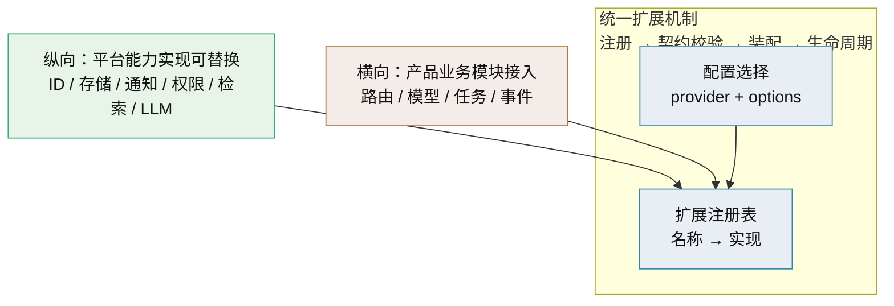
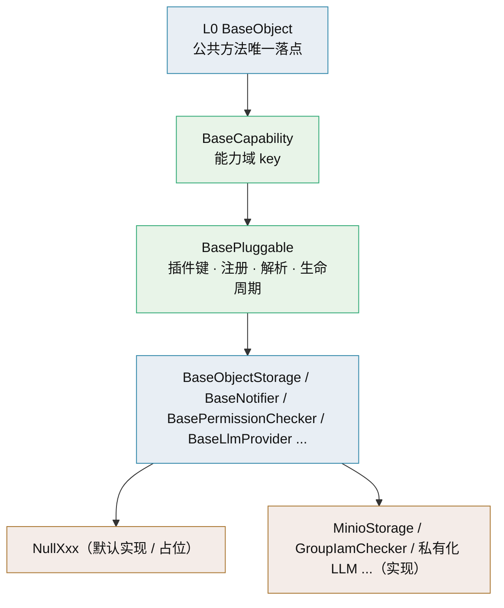
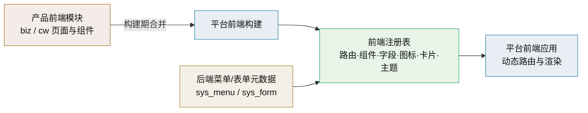

# 架构设计 · 子系统 · 扩展点与插件化

> BMS · 平台能力可替换（纵向）与产品模块接入（横向）的统一扩展机制

[架构设计](01_架构设计_总览.md) › 10-扩展点与插件化　|　[← 09-接口与集成](09_架构设计_接口与集成.md) · [11-模块注册 →](11_架构设计_子系统_模块注册.md)

## 1. 概述 <a id="overview"></a>

本节点定义 BMS 的**统一扩展机制**：平台自身能力的实现可替换（**纵向**，如 ID 生成、对象存储、通知、权限判定、检索、LLM 适配），与产品业务模块可挂接（**横向**，biz/cw 模块接入）。两轴共用同一套「注册 → 契约校验 → 装配 → 生命周期」机制，差异只在注册要素与权限边界。

对应[《项目规划说明》](../../规划/项目规划说明.md)「平台扩展接入流程」章节（23.10 平台能力插件化）与「选型说明」章节（插件化条目）；上承 [04-后端基础类体系](04_架构设计_后端基础类体系.md)（基类承载）与 [11-模块注册](11_架构设计_子系统_模块注册.md)（横向注册），机制策略见[《平台可扩展性规划》](../../规划/平台可扩展性规划.md)，实现细节与开发 SOP 见知识档案《[插件化架构](../../资料/知识档案/插件化架构/01_插件化架构_总览.md)》。

**设计动因**：平台技术栈以免费开源为主——上游可能停维护/换维护者/改许可，且非商业版功能深度有限、客户可能指定商业组件。可替换是**风险对冲**：把「选型错误」与「上游变化」的代价从「伤筋动骨」降为「换个适配器」（策略与迁移见知识档案《[开源与商业组件可替换](../../资料/知识档案/插件化架构/02_插件化架构_开源与商业组件可替换.md)》）。

## 2. 两轴模型 <a id="axes"></a>



| 轴 | 内容 | 注册要素 | 承载节点 |
| --- | --- | --- | --- |
| 纵向：能力可替换 | 平台内建能力的**实现**可选可换（多选一） | 能力名（`plugin_key`）+ 实现名（`plugin_name`） | 本节点、[04-后端基础类体系](04_架构设计_后端基础类体系.md) |
| 横向：模块接入 | 产品业务模块挂进平台运行 | 模块简称 / 表前缀 / 错误码段 / 事件域 | [11-模块注册](11_架构设计_子系统_模块注册.md)、[09-接口与集成](09_架构设计_接口与集成.md) |

**统一口径**：两轴都走「先注册、后装配、再运行」；注册要素唯一性在启动与 CI 校验，冲突即拒。纵向的注册是**能力实现名**，横向的注册是**模块标识**——机制同构、互不干扰。

## 3. 基类承载与双轨 <a id="carrier"></a>

纵向能力替换**落在既有后端基类体系**上，不新造框架。能力基类即端口，`BasePluggable` 中间层承载「实现可替换」的装配语义。



**`BasePluggable`（中间层，单一职责＝实现可替换）**：

| 成员 | 说明 |
| --- | --- |
| `plugin_key` | 能力域键（如 `object_storage`） |
| `plugin_name` | 实现名（如 `minio`；默认实现用 `null`） |
| `contract_version` | 契约版本，装配时校验兼容 |
| `setup()` / `aclose()` | 生命周期钩子（由装配入口统一调用与释放） |
| `describe()` | 元信息，供插件清单与排障 |
| 注册与解析 | 子类登记进注册表；按 `(plugin_key, plugin_name)` 唯一校验、按配置解析 |

**双轨（继承 + 组合并存）**：

| 路径 | 适用 | 登记方式 | 契约保障 |
| --- | --- | --- | --- |
| 继承统一（主线） | 平台内建实现 | `__init_subclass__` 自动登记 | 抽象方法强制 + 契约测试 |
| 组合灵活（项目二次开发） | 客户定制、不便改基类 | 显式 `register_plugin(...)` / `BaseXxx.register(...)` 虚拟子类 / `Protocol` 结构化 | 契约测试 + `contract_version` 校验 |

> 继承与组合**不互斥**：两条路径汇入同一注册表，`resolve_plugin` 一视同仁。选型与语法细节见知识档案《[端口适配器](../../资料/知识档案/插件化架构/03_插件化架构_端口适配器.md)》「插件化中间层」与「双轨」小节。

## 4. 注册表与三阶段发现 <a id="registry"></a>

**注册表**是名称 → 实现的映射，也是发现与选择的统一落点。发现方式按阶段演进：


| 阶段 | 机制 | 隔离与边界 |
| --- | --- | --- |
| 一：显式注册 + 配置切换 | 内建实现导入即登记（继承）或显式登记；`config.toml` 选实现，启动装配（重启生效） | 进程内、可信实现 |
| 二：运行时热插拔 | 实例级 holder 原子替换：新实现就绪 → 替换引用 → 优雅停旧（在途走完）；失败回滚 | 进程内、需状态迁移与并发安全 |
| 三：安装即发现 | `importlib.metadata` entry points（组 `bms.plugins.<domain>`）自动发现第三方实现 | 受控来源；不可信插件进程/容器隔离 |

**边界**：三阶段全部为**进程内**方案（构建期合并或安装期发现），不因插件化引入微服务或常驻服务；不做插件市场与运行时远程加载（见[《项目规划说明》](../../规划/项目规划说明.md)「明确不采用」章节）。发现与生命周期细节见知识档案《[插件发现机制](../../资料/知识档案/插件化架构/05_插件化架构_插件发现机制.md)》与《[生命周期与热插拔](../../资料/知识档案/插件化架构/12_插件化架构_生命周期与热插拔.md)》。

## 5. 配置驱动装配 <a id="wiring"></a>

**装配唯一入口**负责选择实现并注入；业务代码只依赖能力基类与提供者 `get_xxx`，不直连具体实现。

```toml
# config.toml —— 能力实现选择（片段）
[storage]
provider = "minio"                 # minio | s3 | local
options = { bucket = "bms" }

[id_generator]
provider = "snowflake"             # snowflake | segment | uuid7
options = { worker_id = 1 }

[permission]
provider = "local"                 # local | group_iam
```

```python
# app/core/plugin.py（目标结构）：注册表 + 解析，唯一知道 provider 语义的地方
def resolve_plugin(plugin_key: str, provider: str | None):
    impl = _registry.get(plugin_key, provider or "null")
    if impl is None:
        raise RuntimeError(f"未注册的 {plugin_key} 实现：{provider}")
    return impl()

# 能力域提供者退化为薄封装，业务调用面不变
def get_object_storage():
    return resolve_plugin("object_storage", settings.storage.provider)
```

**装配规则**：

- **provider 名即契约**：稳定、小写；改名按破坏性变更走公告与过渡期（承诺口径见 [11-模块注册](11_架构设计_子系统_模块注册.md) 与[《平台可扩展性规划》](../../规划/平台可扩展性规划.md)）。
- **启动即校验**：provider 存在性、契约版本、依赖可用性在启动（与 CI）校验，失败即拒启，不静默回退默认实现。
- **密钥与配置分离**：密钥只走 Secret（环境变量/密钥文件），配置文件只放非敏感项。
- **可选实现延迟导入**：实现内部重依赖懒加载，避免未选用的实现也拖入依赖。
- **可观测**：启动日志打印各能力当前 provider（不含密钥）；插件清单与指标见 [27-可观测性](27_架构设计_子系统_可观测性.md)。

## 6. 前端插件化 <a id="frontend"></a>

后端「能力实现可替换」之外，前端以**扩展点 + 注册表 + 动态导入**组织可扩展面；产品（biz/cw）前端模块经**产物构建期合并**进平台前端应用，与后端插件化在机制上对称。对应[《项目规划说明》](../../规划/项目规划说明.md)「前端」章节（前端插件化条目）；承载见 [05-前端组件体系](05_架构设计_前端组件体系.md) 与 [08-前端架构](08_架构设计_前端架构.md)。



**扩展点与注册表**：

| 扩展点 | 注册 / 解析 | 承载节点 |
| --- | --- | --- |
| 路由 / 菜单 | 后端菜单种子（sys_menu）下发 → 前端动态注册路由与侧边栏 | [08-前端架构](08_架构设计_前端架构.md)、[15-权限计算引擎](15_架构设计_子系统_权限计算引擎.md) |
| 页面区域 | 布局 / 插槽区域挂接 | [05-前端组件体系](05_架构设计_前端组件体系.md)、布局设计 |
| 通用组件 | 组件注册表（按型号解析具体组件） | [05-前端组件体系](05_架构设计_前端组件体系.md)、组件设计 |
| 字段渲染器 | `FormRenderer` 按 `sys_field` / `sys_field_ext` 元数据分发（字段类型注册） | [05-前端组件体系](05_架构设计_前端组件体系.md)、[30-表单定制](30_架构设计_子系统_表单定制.md) |
| 图标 | icon key → `IconDisplay`（iconRegistry） | [05-前端组件体系](05_架构设计_前端组件体系.md)、[03-总体架构](03_架构设计_总体架构.md) |
| 工作台卡片 | card_type / `render_key` → 卡片渲染器注册表 | [29-首页工作台](29_架构设计_子系统_首页工作台.md) |
| 主题令牌 | SCSS / CSS 变量驱动主题切换 | [08-前端架构](08_架构设计_前端架构.md) |

**模块来源与合并方式**：

| 方式 | 机制 | 采用 | 不采用 |
| --- | --- | --- | --- |
| 构建期合并 | 产品前端模块产物并入平台前端构建，动态路由与注册表生效、免发版 | MVP 主推（横向产品接入） | — |
| 运行时远程加载 | Module Federation / 远程组件 | 需独立发版时再评估 | **MVP 不采用** |
| 微前端（iframe / qiankun） | 子应用独立运行、宿主容器挂载 | 异构栈 / 强隔离时再评估 | **MVP 不采用** |

**约束**：插件页面一律**动态导入、独立分包**，不进首屏主包；扩展点经注册表挂接、组件不互相直接依赖；契约类型由 OpenAPI 生成、与后端一致；前端显隐只是体验，真正鉴权在后端（动态菜单 + `v-perm` + 后端 `require_permission`）。

## 7. 代码结构（目标） <a id="structure"></a>

```text
backend/app/
├── core/
│   ├── plugin.py            # BasePluggable + 注册表 + resolve_plugin（机制唯一落点）
│   └── capability.py        # BaseCapability / BasePlaceholder / BaseNullObject
├── <domain>/                # 能力域：契约 + 默认实现
│   ├── base.py              # BaseXxx（端口，业务只依赖它）
│   ├── null.py              # NullXxx（默认实现）
│   └── <impl>.py            # 平台内建实现（如 minio.py）
└── plugins/                 # 可选：平台内建实现集中区（按能力分子目录）
```

第三方/产品插件为**独立发行包**，声明入口点（安装期发现）：

```toml
[project.entry-points."bms.plugins.object_storage"]
acme = "bms_plugin_acme.storage:AcmeStorage"
```

## 8. 关联节点 <a id="related"></a>

- [04-后端基础类体系](04_架构设计_后端基础类体系.md)：L0 / BaseCapability / BasePluggable 与能力域基类
- [05-前端组件体系](05_架构设计_前端组件体系.md)：前端扩展点与渲染器/注册表
- [08-前端架构](08_架构设计_前端架构.md)：前端插件化与产品前端模块构建期合并
- [11-模块注册](11_架构设计_子系统_模块注册.md)：横向产品模块注册（两轴的另一半）
- [09-接口与集成](09_架构设计_接口与集成.md)：能力接口、错误码、事件命名契约
- [14-认证与会话](14_架构设计_子系统_认证与会话.md) / [15-权限计算引擎](15_架构设计_子系统_权限计算引擎.md)：身份源与权限判定的能力实现（权限可外置集团平台）
- [20-文件管理](20_架构设计_子系统_文件管理.md)：对象存储能力消费方
- [25-AI 服务](26_架构设计_子系统_AI服务.md)：LLM 适配层（供给侧切换的既有先例）
- [27-可观测性](27_架构设计_子系统_可观测性.md)：插件清单、指标、健康检查
- [03-总体架构](03_架构设计_总体架构.md)：技术栈全景与阶段映射
- [34-决策与风险](34_架构设计_决策与风险.md)：插件化 ADR
- [《项目规划说明》](../../规划/项目规划说明.md)：平台扩展接入流程（23.10）、选型说明、明确不采用
- [《平台可扩展性规划》](../../规划/平台可扩展性规划.md)：扩展点方向、契约承诺
- 知识档案《[插件化架构](../../资料/知识档案/插件化架构/01_插件化架构_总览.md)》：完整机制、三阶段、开发 SOP

> 架构设计节点 · 与《项目规划说明》《文档生成规范》《命名规范》配套
