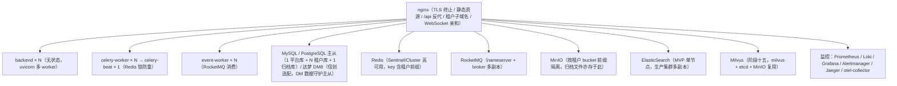

# 架构设计 · 部署与运维

> BMS · 拓扑、集群、配置、初始化与容灾

[架构设计](01_架构设计_总览.md) › 30-部署与运维　|　[← 29-测试与质量](29_架构设计_测试与质量.md)　|　[31-决策与风险 →](31_架构设计_决策与风险.md)

## 1. 概述 

本节点定义部署与运维架构：部署拓扑、集群设计要点、基础设施编排、配置分层、初始化数据、故障应对与备份恢复。对应[《项目规划说明》](../../规划/项目规划说明.md)的「部署与运维」「集群设计要点」「基础设施编排」「环境与配置」「初始化数据」「备份与恢复」章节。

## 2. 部署拓扑 

## 3. 集群设计要点 

- 无状态：JWT 无状态（会话标记存 Redis，鉴权顺带校验）；token 黑名单、限流计数存 Redis；文件存 MinIO；定时任务分布式执行——任一实例可随时停机、随时扩容
- 缓存一致性：统一走 Redis 作为共享缓存源；一般业务数据不引入本地内存缓存；字典为只读热配置例外——进程内内存字典缓存（全局版本号 `bms:{tenant}:dict:version` 惰性比对保证多实例一致）
- 分布式锁：Redis SETNX（幂等前置去重、beat 防重、引擎创建防重）
- 实时推送：Socket.IO 经 Redis 适配器广播；nginx ip_hash / Cookie 亲和
- 连接池：pool_size / max_overflow 按 worker 数规划，总连接数 ≤ 数据库 max_connections 的 70%
- 数据库高可用：主从 + 故障切换；主库故障预案（从库提升、只读模式）
- 消息队列高可用：RocketMQ 多副本（主从、同步刷盘 + 消息持久化）；Celery beat 单副本 + 锁
- 检索高可用：ES 多节点集群（多副本、故障自动分片迁移）；事件重放全量重建；故障降级 DB 模糊查询
- 安全响应头：nginx 统一配置 CSP、HSTS（dev 关闭）、X-Frame-Options（SAMEORIGIN，兼容 Grafana 嵌入）、X-Content-Type-Options、Referrer-Policy、Permissions-Policy
- 优雅停机：SIGTERM 后停止接收新请求、等待在途请求完成

## 4. 基础设施编排 

- 初版 Docker Compose：backend（多副本）+ celery-worker（多副本）+ celery-beat（单副本）+ event-worker（多副本）+ frontend（nginx，托管 PC + 移动端静态资源）+ redis + rocketmq（nameserver + broker）+ elasticsearch + milvus（含 etcd，MinIO 复用）+ minio + 数据库（按环境选择 MySQL、PostgreSQL 或达梦 DM8）+ 监控（Prometheus/Loki/Grafana/Alertmanager）+ jaeger（trace）+ otel-collector
- nginx 需支持 WebSocket：/socket.io 路径放行 Upgrade/Connection 头
- 健康检查：/healthz（存活）、/readyz（依赖就绪），供编排系统滚动发布
- TLS 与 HTTPS：nginx 层配置，cookie Secure 标志随环境启用
- 演进：数据量或部署规模增长后迁移 Kubernetes

## 5. 配置分层 

- 三套环境 dev / test / prod，config.toml 按环境分层（BMS_ENV 指定）+ 环境变量覆盖
- 密钥（DB/Redis 密码、JWT secret、MinIO 凭据、短信/AI key）走 Secret 管理（K8s Secret / Docker secrets），不落库不入镜像
- 开发环境依赖（Redis/RocketMQ/ES/MinIO）由 Docker Compose 统一提供；Milvus 随阶段十五加入；MySQL/PostgreSQL/达梦 DM8 三库常驻开发服务器（见《[开发部署规划](../../规划/开发部署规划.md)》）
- Python 版本 .python-version 固定 3.14（uv 管理）；前端 Node 版本 .nvmrc 固定
- CORS：dev 放行前端跨域；生产 nginx 同源反代不开放跨域
- 租户域名：生产泛域名 DNS（*.bms.example.com）+ 泛 TLS 证书
- git 分支：**单人开发期（2026-08-23 起）直推 main，不走 MR**——尚无基本产品且单人开发，MR 门禁收益为零、流程开销显著；含代码改动由 main 流水线自动冒烟验证。**MR 全流程暂缓**至产品成型或多人协作期恢复，恢复时口径：main 保护分支，feature 分支经 PR 合入（CI 通过方可合并），核心模块改动提交前经 AI 交叉评审；AI 修复代理提交的 fix/defect-* 分支仍人工 review 后合入（见《[Git协作规范](../../规范/Git协作规范.md)》）

## 6. 初始化数据 

> 种子数据与 i18n 英文文案量大，采用 **AI 辅助生成**：按《命名规范》与既有模块模式批量生成初稿、人工抽查校对；CI 校验完整性（菜单/表单/按钮/字段与业务/动作码挂接对齐、i18n key 缺失检测），不逐条手工编写。

- 初始菜单/表单/按钮/字段与业务/动作种子（后端模块定义与 sys_menu/sys_form/sys_button/sys_field/sys_business/sys_action 对齐，含 i18n 附表英文文案）
- 基础字典种子（状态、类型等通用字典，含 i18n）
- 工作流引擎随平台部署（业务流程模板由产品仓库提供并登记，biz 采购/付款审批等）
- 产品业务种子（支付渠道 manual 等）由产品仓库在其部署清单中维护，平台提供配置与渠道抽象机制
- 基础邮件模板种子（审批提醒、告警通知，中英文）
- 初始帮助分类与基础文章种子（快速上手/系统管理/业务操作等）
- 初始工作台卡片种子（待办/已办、通知、公告、快捷入口、帮助入口、数据统计等内置卡，含 i18n 英文文案）与平台默认模板种子（租户开通流程自动执行）
- 表单定制无独立布局种子：平台默认布局为空时渲染器按字段 sort 回退默认栅格（即既有表单页行为），租户/角色布局由管理员在线配置
- 初始定时任务种子（孤儿分片清理、日志归档、分片表预创建、每日全量备份）
- 平台库种子：平台超管账号（首次启动创建，强制改密）、平台统一菜单/表单/按钮/字段挂接与权限码、平台默认字典/参数/邮件模板
- 租户开通种子：三类内置管理员角色（权限互斥，分别预授权限）与初始系统管理员账号、默认 IdP 占位、归档策略（四类审计日志 90 天）
- 语言包种子：中文/英文语言与前后端文案
- 初始归档策略种子：四类审计日志（操作/登录/开放接口/数据变更）90 天归档（租户开通流程自动执行）

## 7. 故障应对 

| 故障 | 应对 |
| --- | --- |
| Redis 故障 | 缓存失效直连 DB + 日志告警；限流降级 memory 后端（slowapi）；会话校验降级（凭 access token 有效期）并告警 |
| 主库故障 | 只读模式：从库响应查询，写接口返回明确错误；从库提升预案 |
| RocketMQ 故障 | 审计/日志写入降级为同步直写（标记降级时段，恢复后补发）；业务主流程不受影响 |
| ElasticSearch 故障 | 检索降级数据库模糊查询兜底；恢复后重放事件重建索引 |
| MinIO 故障 | 上传/下载接口报错 + 告警；预签名依赖 MinIO，故障期间文件不可用 |
| 邮件/短信渠道故障 | 发送记录标记失败，重试策略生效；告警渠道可降级企业微信/钉钉 |
| 依赖接口故障 | httpx 短超时 + 熔断快速失败；Webhook 指数退避重试 |

## 8. 备份与恢复 

- 数据库：每日全量备份 + 开启 Binlog/WAL（时间点恢复 PITR），达梦 DM8 用 dmrman 备份/归档；保留 30 天，异机存储；归档库纳入备份范围
- 备份任务与记录由页面管理（sys_backup_task / sys_backup_log，Celery 调度，支持手动备份与恢复演练登记）
- MinIO：对象数据定期增量备份 + 生命周期策略；元数据随数据库备份
- 恢复：定期演练恢复流程，目标 RTO ≤ 4 小时、RPO ≤ 1 小时
- 数据归档：全表可配归档策略（sys_archive_policy），两段式流转（热表 → 归档库可在线查询 → 对象存储冷化）；过期归档文件与软删除残留由 Celery 物理清理

## 9. 版本与发布管理 

- **版本号策略**：产品版本语义化（主.次.修订）——主版本含破坏性变更（含 API 大版本升级），次版本为向后兼容新功能，修订号为缺陷修复；Git tag 与 CI 镜像一一对应
- **版本号与里程碑分层映射**：Alpha / Beta / GA 里程碑分层与版本号绑定——Alpha 阶段 `0.x.y`（阶段一 ~ 六内部迭代，0.6 结束收敛为 Alpha 候选），Beta 阶段 `0.7.x ~ 0.11.x`（阶段七 ~ 十一功能冻结，0.11 为 Beta 候选），GA 后首个正式发布 `1.0.0`；分层对应关系固定写入发布检查单，避免内外对"正式版"口径歧义
- **发布检查单**：CI 流水线绿色、三库迁移演练通过、当日备份可恢复、契约快照已归档、发布说明已编写；各项状态由 CI job 自动采集输出，人工仅最终放行
- **Schema 向后兼容**：滚动发布期间只加列不删列不改列，新列可空或带默认值；删列/改类型延后两个版本分步执行；不兼容变更随主版本停机窗口执行
- **应用回滚**：镜像按版本留存 Registry，回滚即切换上一 tag；迁移向前修复（forward-fix）优先，仅兼容性迁移允许 Alembic downgrade
- **发布流程**：main 打 tag → CI 构建 tag 镜像 → 发布检查单确认 → 生产滚动发布 → 冒烟回归通过即发布完成；失败触发回滚预案
- **灰度发布**（MVP Compose 口径）：test 先行 → 生产低峰滚动 → 内部/试点租户子域名走查核心链路后放量；按租户金丝雀列入 K8s 演进后能力

## 10. 容量规划 

- **基线容量模型**（首年）：50 租户 × 每租户 200 用户；单租户库首年 ≤ 10GB；审计日志月分表单表 ≤ 500 万行（超阈值归档流转）
- **ElasticSearch**：索引三类（主数据/日志/文件），日志索引按月滚动、热保留 90 天；单节点 JVM 堆 ≤ 31GB；磁盘水位 70% 告警
- **RocketMQ**：commitlog 保留 72 小时；消费滞后超阈值告警（审计链消费优先）
- **Redis**：maxmemory 上限 + volatile-lru 逐出；内存水位 70% 告警
- **可观测性栈保留期**：Prometheus 指标 15 天、Loki 日志热保留 30 天（MVP 单机口径）
- **复核节奏**：阶段九部署落地与阶段十压测后各修订一次基线，此后随运维复盘年度修订

## 11. 关联节点 

- [多租户路由](08_架构设计_子系统_多租户路由.md)：子域名与泛域名 TLS
- [事件总线](12_架构设计_子系统_事件总线.md)：event-worker 消费组
- [任务调度](13_架构设计_子系统_任务调度.md)：celery-beat 单副本
- [可观测性](23_架构设计_子系统_可观测性.md)：监控组件编排
- [性能与安全](27_架构设计_性能与安全.md)：降级矩阵/安全响应头
- [前端架构](28_架构设计_前端架构.md)：nginx 静态托管与 WebSocket 亲和

## 12. GA 正式上线计划 

> GA 上线是首次商用发布的整项目编排，区别于 9 节的日常版本发布；触发条件为 GA 里程碑达成且通过 MVP 准出标准。上线动作一次走完，重跑即走常规发布流程。

- **上线检查单**（GA 放量前逐项确认）：MVP 准出标准全部满足；三库 Alembic 迁移演练通过、备份当日成功且可恢复；`/api/open` 与内部接口契约快照导出归档；生产环境变量/密钥就位（config.toml + Secret，不含明文）；泛域名 DNS + 泛 TLS 证书签发并在 nginx 生效；监控告警阈值（SLO + 容量水位）配置完成；子域名租户路由与租户开通流程冒烟通过；发布说明（含 test 环境验证记录）已提供
- **上线步骤**：① test 环境全量预演（MVP 验收清单走查）→ ② 生产环境搭建（Compose 一键部署）→ ③ 种子数据初始化（6 节）→ ④ 平台库建库 + 首批试点租户开通（含迁移与种子）→ ⑤ 灰度：试点租户子域名走查登录→RBAC→工作流→报表核心链路（业务链路由对应产品仓库验收），SLO 无异常 → ⑥ 全量放量（60 分钟窗口观察监控），持续观察 24 小时核心链路 SLO
- **放量节奏**：MVP 单机口径下试点租户 3~5 个、观察 24~48 小时（含一次备份成功验证）后全量；全量后首周为重点观察期（配合 13 节运营支持）
- **回滚预案**：镜像回滚为主，GA 全量放量 72 小时内核心链路 SLO 连续超阈值或 P0 缺陷即触发回滚并复盘
- **上线后移交**：监控 dashboard 交付、运维手册签收、值班口径生效（13 节）、缺陷与支持渠道明确

## 13. 运营支持模型 

> 面向 GA 后（含自用/试点阶段）的平台运营口径；对外商业合同的 SLA 以合同为准，本文档为内部底线。

- **值班与响应**：平台运营以一人兼职为主，值班窗口内对上线的负载变化、监控告警、备份状态与缺陷渠道保持响应；重点观察期（GA 后首 2 周）响应时限收紧一倍
- **问题分级（内部底线 SLO）**：

| 级别 | 定义 | 响应时限 | 处置时限 |
| --- | --- | --- | --- |
| P0 | 平台不可用 / 数据泄露 / 审计链校验失败 | 15 分钟 | 4 小时 |
| P1 | 核心链路故障（登录/审批/推送） | 30 分钟 | 8 小时 |
| P2 | 单功能不可用或降级 | 4 小时 | 3 工作日 |
| P3 | 体验/轻微问题 | 24 小时 | 随版本修复 |

- **容量与成本监控**：按月走查容量水位与预算水位，超 70% 即评估扩容（先扩展磁盘/内存）；LLM/短信等外部 API 用量月度核对
- **License / 依赖健康**：Renovate 升级 PR 复核许可变化；核心依赖停维按"依赖健康度"风险项跟踪
- **机密与权限复核**：密钥轮换周期（JWT secret 双周期轮换、凭据季度抽查）、审计链校验巡检（定时任务）、数据权限回收审计（三权分立）
- **版本维护窗口**：版本 EOL 与安全更新窗口——每个发布版本支持期 ≥ 12 个月，过期版本不再享受常规支持但仍接受安全修复；主版本升级提前一个发布周期公告

> 架构设计节点 · 与《项目规划说明》《文档生成规范》《命名规范》配套