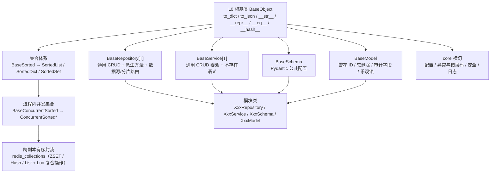

# 架构设计 · 后端基础类体系

> BMS · 基座分层、基类清单与贯穿全阶段的实施约束

[架构设计](01_架构设计_总览.md) › 33-后端基础类体系　|　[← 32-前端组件体系](32_架构设计_前端组件体系.md)

## 1. 概述 

后端基础类体系定义 backend（FastAPI）的**基座分层、各层基类清单与继承关系、扩展规则与阶段落地**，是《[后端开发规范](../../规范/后端开发规范.md)》第 3 节「后端基座体系」与「模块组织」「异步与并发」节在架构层的落地依据（本节点定分层与清单，规范定强制用法口径，二者同源）。对应[《项目规划说明》](../../规划/项目规划说明.md)的「开发计划与验收标准」节阶段二；工程结构与分层职责见[03-总体架构](03_架构设计_总体架构.md)、数据访问机制见[09-数据访问与分片](09_架构设计_子系统_数据访问与分片.md)。

**为什么单列节点**：后端基座是**影响全局、贯穿全程**的地基——core 基座（根基类、有序集合、并发集合、Redis 封装、异常、配置、安全）与模块基类（repository / service / schema / model）决定所有模块的写法，任一基类能力调整即全链生效；基座不完成，认证 / RBAC / 通用能力等全部后端模块无法按统一口径实现（CRUD、序列化、并发保护、异常语义在每个模块重复实现，口径必然发散）。因此后端基座与前端组件库（[32-前端组件体系](32_架构设计_前端组件体系.md)）并列，独立成**阶段二 后端基座**。

## 2. 体系定位与范围 

| 项 | 说明 |
| --- | --- |
| 面向 | backend（FastAPI，异步栈，Python 3.14+） |
| 目录 | 基座代码 `backend/app/core/`、`repositories/`、`services/`、`schemas/`、`models/`；规范 `bms文档/规范/后端开发规范.md` |
| 范围 | core 基座（根基类 / 有序集合 / 并发集合 / Redis 封装 / 配置 / 异常 / 安全）+ 模块基类（`BaseRepository` / `BaseService` / `BaseSchema` / `BaseModel`）+ 跨阶段基座（缓存 Region 分域 / 数据范围注入 / 分片路由 / 事件发布消费 / 任务 / 审计捕获） |
| 上游 | 《项目规划说明》（开发计划与阶段）、《后端开发规范》、《命名规范》 |
| 下游 | 全部后端模块（认证 / RBAC / 通用能力 / 工作流 / 集成 / 报表 / 检索 / AI）与产品仓库后端模块 |
| 稳定性 | 稳定——基类能力变更牵动全部模块；新公共能力只加到基类或新增基类层，模块类不动 |

## 3. 基座分层 

后端基座以 **L0 根基类**为根，向上分出三条支线：**集合体系**（有序 / 并发 / 跨副本）、**模块基类**（数据访问到模型）、**core 横切基座**（配置 / 异常 / 安全 / 日志）。公共字段与方法只在所属基类维护，模块类只写差异部分。

| 层 / 支线 | 基类 | 代码落地位置 | 实施阶段 |
| --- | --- | --- | --- |
| L0 根基类 | `BaseObject` | `app/core/base.py` | **阶段一已交付** |
| 有序集合 | `BaseSorted` → `SortedList` / `SortedDict` / `SortedSet` | `app/core/collections.py` | **阶段一已交付** |
| 进程内并发集合 | `BaseConcurrentSorted` → `ConcurrentSortedList` / `ConcurrentSortedDict` / `ConcurrentSortedSet`（四种锁策略） | `app/core/concurrent.py` | **阶段一已交付** |
| 跨副本有序封装 | Redis 有序封装 + Lua/WATCH 复合操作 | `app/core/redis_collections.py` | **阶段一已交付** |
| 数据访问基类 | `BaseRepository[T]`（模板方法：`_build` / `_apply`） | `app/repositories/base_repository.py` | **阶段一已交付**（同步基线；阶段二切异步） |
| 服务基类 | `BaseService[T]`（委派仓储 + 不存在语义） | `app/services/base_service.py` | **阶段一已交付** |
| 请求/响应基类 | `BaseSchema`（`from_attributes` / `str_strip_whitespace`） | `app/schemas/base.py` | **阶段一已交付** |
| ORM 模型基类 | `BaseModel`（雪花 ID / 软删除 / 审计字段 / 乐观锁 / 四库类型映射） | `app/models/base.py` | 阶段二 |
| core 横切：异常 | `BizError` 体系 + 统一响应 `{code, message, data}` | `app/core/exceptions.py` | 阶段二 |
| core 横切：配置 / 安全 / 日志 | 配置基座（config.toml + `BMS_` 覆盖）、安全基座、structlog 日志 | `app/core/config.py`、`app/core/security.py` | 配置/日志在阶段一，安全基座阶段二 |
| 跨阶段基座 | 缓存 Region 分域 / 数据范围注入 / 分片路由 / 事件发布消费 / 任务基座 / 审计捕获 | 分散于 `core/`、`repositories/`、`services/` | 按对应阶段回补（见第 8 节） |

约定：只准上层依赖下层；基类一律 `Base` 打头，非 `Base` 打头为继承基类的具体实现类（命名自由）；模块类必须继承对应基类，**禁止重复定义基类已提供的公共字段/方法**；新增公共能力只加到基类或新增基类层（`BaseObject` 是公共方法唯一落点）。

## 4. 基类清单与继承链 

| 基类 | 文件 | 职责 | 状态 |
| --- | --- | --- | --- |
| `BaseObject` | `core/base.py` | 所有可继承类的公共方法唯一落点（反射序列化 `to_dict`、稳定序 `to_json`、统一字符串输出、主键相等与哈希） | 已交付 |
| `BaseSorted[T]` | `core/collections.py` | 有序集合公共方法（`to_list` / `to_dict` / `to_json` / `sorted_by` / `chunk` / `merge` / 集合运算） | 已交付 |
| `BaseConcurrentSorted` | `core/concurrent.py` | 进程内并发集合基类：锁策略守卫 + SNAPSHOT 写时复制模板 | 已交付 |
| `ConcurrentSorted*` | `core/concurrent.py` | 进程内多线程共享集合：读-改-写走原子复合方法、遍历取快照 | 已交付 |
| Redis 有序封装 | `core/redis_collections.py` | 跨副本 / 多 worker 共享：Redis 为事实源 + 版本号只读快照；Lua/WATCH 原子复合操作 | 已交付 |
| `BaseRepository[ModelT]` | `repositories/base_repository.py` | 通用 CRUD 流程（模板方法）+ `exists` / `count` 派生方法；数据库实现覆写原子方法 | 已交付（同步基线） |
| `BaseService[ModelT]` | `services/base_service.py` | 委派仓储 + 统一不存在语义（抛 `NotFoundError` → `BizError` 体系） | 已交付（异常占位待阶段二接管） |
| `BaseSchema` | `schemas/base.py` | Pydantic 公共配置（`from_attributes` / `str_strip_whitespace`），继承 `BaseObject` 获得序列化 | 已交付 |
| `BaseModel` | `models/base.py` | ORM 公共字段与约定（雪花 ID、软删除、审计字段、乐观锁、四库类型映射） | 阶段二 |
| `BizError` 及子类 | `core/exceptions.py` | 统一业务异常基类（携带错误码与参数）+ 全局异常处理器 → 统一响应 | 阶段二 |
| 配置 / 安全基座 | `core/config.py`、`core/security.py` | 配置读取与环境覆盖、密码哈希与会话安全原语 | 配置/日志阶段一，安全基座阶段二 |

继承链：`模块类 → 对应基类 → BaseObject`；`BaseSchema → (pydantic.BaseModel, BaseObject)`；集合类 `Sorted* → BaseSorted → BaseObject`、`ConcurrentSorted* → BaseConcurrentSorted → BaseSorted → BaseObject`。

## 5. 有序与并发集合 

- **有序集合（强制）**：集合对象用 `SortedList` / `SortedDict` / `SortedSet`（插入即有序）；**对外输出必须稳定序**——序列化统一走 `to_json`（键排序兜底），禁止直接输出裸 `set`；公共位置（API 响应、日志字段、任务参数/结果、配置映射、缓存值与导出数据）一律使用有序集合，局部临时变量不限。
- **进程内并发集合（强制）**：多线程共享用 `ConcurrentSorted*`，锁策略按读写比选（RW 默认 / RLCK / SHARDED / SNAPSHOT）；读-改-写必须走原子复合方法（`put_if_absent` / `update_atomic` / `remove_atomic` 等）、遍历取快照；锁内禁止 IO 与外部回调。
- **跨副本共享（强制）**：跨副本 / 多 worker 用 `core/redis_collections.py`（Redis 为唯一事实源 + 本进程只读快照 + 版本号惰性比对，key 遵循 `bms:{租户|global}:{域}:{键}`），**禁止进程内集合跨副本共享**；复合操作（`replace_if_equal` / `get_and_remove` 用 Lua；`update_atomic` / `get_locked` 用 WATCH + MULTI 乐观重试）保证原子语义。

## 6. core 横切基座 

- **配置基座**：`config.toml` 分区 + `BMS_` 环境变量覆盖（12-factor），敏感项只走环境变量，不入库、不入镜像（阶段一交付）。
- **异常与错误码**：统一异常基类 `BizError`（携带错误码与参数），业务异常在 services 层抛出，全局处理器统一转 `{code, message, data}`；错误码分段见[06-接口与集成](06_架构设计_接口与集成.md)（阶段二交付）。
- **安全基座**：密码哈希、令牌与会话安全原语收敛到 `core/security.py`，供认证与会话子系统（见[10-认证与会话](10_架构设计_子系统_认证与会话.md)）复用（阶段二交付）。
- **日志基座**：structlog 结构化 JSON + `request_id` 贯穿，见[23-可观测性](23_架构设计_子系统_可观测性.md)（阶段一交付）。

## 7. 各层基类与模块约定 

| 模块类 | 必须继承 | 只写什么 |
| --- | --- | --- |
| `XxxRepository` | `BaseRepository[T]` | 内存基线只实现 `_build` / `_apply`；数据库实现覆写原子方法，`exists` / `count` 沿用 |
| `XxxService` | `BaseService[T]` | 通用 CRUD 走基类；业务规则以覆写 / 新增方法实现 |
| `XxxCreateRequest` / `XxxResponse` | `BaseSchema` | 字段与约束 |
| `XxxModel` | `BaseModel`（阶段二） | 表名、字段、关系 |

禁止：在模块类重复定义基类已提供的公共字段 / 方法；绕过基类另起炉灶（新增公共能力加到基类，改一处全局生效）。

## 8. 阶段落地（地基波 + 回补） 

后端基座分两波：**地基波**在**阶段二 后端基座**交付（阶段一已交付 core 基础部分）；**跨阶段基座**（依赖后端模块能力）随对应阶段回补，任务树按域收拢于阶段二目录并在计划表标回补窗口。

| 波次 | 覆盖 | 阶段 |
| --- | --- | --- |
| 已交付（阶段一） | `BaseObject`、有序集合、进程内并发集合、Redis 有序封装与复合操作、`BaseRepository` / `BaseService` / `BaseSchema`（同步基线） | 一 项目骨架 |
| 地基波（本阶段） | 异常体系 `BizError` + 统一响应、配置 / 安全基座、`BaseModel`、基类异步切换与数据访问底座、多租户数据拓扑、模块注册表、CI 与阶段验收 | 二 后端基座 |
| 跨阶段回补 | 缓存 Region 分域基座（→ 阶段六 通用能力）、数据范围注入基座（→ 阶段五 RBAC）、分片路由基座（→ 阶段十一 分布式与监控）、事件发布 / 消费基座（→ 阶段八 系统集成与消息）、Celery 任务基座（→ 阶段六）、ORM 审计捕获基座（→ 阶段六） | 各对应阶段 |

> 阶段一已交付的基座为**同步实现**，阶段二（数据访问底座落地时）在基类统一切换异步，调用面改动集中一次；达梦同步驱动例外口径见[09-数据访问与分片](09_架构设计_子系统_数据访问与分片.md)。

## 9. 关联节点 

- [03-总体架构](03_架构设计_总体架构.md)：分层视图、目录结构、阶段映射
- [09-数据访问与分片](09_架构设计_子系统_数据访问与分片.md)：多数据源、读写分离、分片、归档库
- [05-数据架构](05_架构设计_数据架构.md)：数据规范（雪花 ID / 软删除 / 审计字段 / 乐观锁）
- [10-认证与会话](10_架构设计_子系统_认证与会话.md)：安全基座消费方
- [12-事件总线](12_架构设计_子系统_事件总线.md)：事件发布 / 消费基座
- [13-任务调度](13_架构设计_子系统_任务调度.md)：Celery 任务基座
- [15-审计哈希链](15_架构设计_子系统_审计哈希链.md)：ORM 审计捕获基座
- [32-前端组件体系](32_架构设计_前端组件体系.md)：与后端基座对称的前端地基

> 架构设计节点 · 与《项目规划说明》《后端开发规范》《数据库开发规范》《命名规范》《文档生成规范》配套
