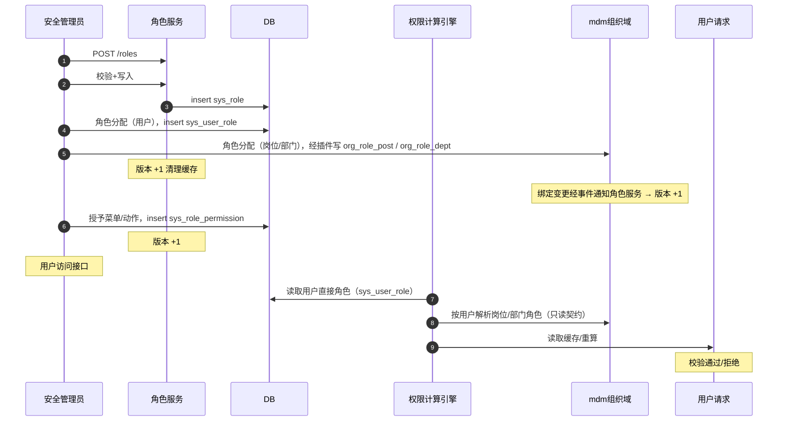

# 概要设计 · 角色管理

> BMS · 角色、授权与数据权限

[概要设计](01_概要设计_总览.md) › 06-角色管理　|　[← 04-用户喜好](04_概要设计_用户喜好.md) · [07-菜单管理 →](07_概要设计_菜单管理.md)

## 1. 模块概述与职责 

> **服务化归口（2026-09-22）**：本项目以微服务为目标架构（平台模块与产品全服务化，见《[微服务演进规划](../../规划/微服务演进规划.md)》）；本节点在服务化形态下对应**一个服务或服务内能力单元**——拥有独立库（每服务每租户一库）、独立部署与发布，与其他服务经**公开契约或事件**协同（服务边界与一致性见[架构设计 37](../架构设计/37_架构设计_子系统_服务间通信与一致性.md)）。

本节对应[《项目规划说明》](../../规划/项目规划说明.md)「功能模块」之**角色管理**模块，与「权限模型」「业务与动作清单（权限码总表）」「核心数据表清单」「[审计合规](28_概要设计_审计合规.md)」（三权分立）章节。架构设计依据[《架构设计》](../架构设计/01_架构设计_总览.md)15-权限计算引擎节点。

角色管理负责角色定义（`code / name / status`）、角色分配（用户分配：`sys_user_role` 角色 × 用户，与用户管理页「用户分配角色」**同一张表**；岗位分配 / 部门分配数据与契约归 **mdm 组织域**）、菜单/表单权限授予（业务权限按表单→业务对照关系推导）、操作权限授予（默认无）、数据权限配置（sys_data_scope：角色 × 基础数据字典结构化，默认无）与字段权限授予（sys_role_field，默认全部可见可编辑）。

> **角色分配归口（2026-10-06）**：「角色分配」页签内——**用户分配**由 bms 承载（`sys_user_role`，与用户管理页「用户分配角色」**同一张关系表**）；**岗位分配 / 部门分配**数据与契约**整体归 mdm 组织域**（用户-岗位 `org_user_post`、角色-岗位 `org_role_post`、角色-部门 `org_role_dept`），bms 经**具名插槽插件**呈现（插件缺失即隐藏，bms 单独运行无岗位/部门 Tab），**不落 bms 表**。主体链权限计算经 mdm「按用户解析角色」只读契约**跨服务汇总**（见 §3）。

职责边界：角色管理归**安全管理员**（三权分立），权限码命名 `业务:动作`；角色只做授权不承载业务数据；权限计算（主体链收敛、缓存与版本失效）由权限计算引擎承担，本模块维护授权数据（用户分配）与经 mdm 只读契约汇聚的岗位/部门分配。

## 2. 功能分解与业务流程 

### 2.1 功能点分解 

| 功能点 | 说明 | 权限码 |
| --- | --- | --- |
| 角色列表/详情 | 按 code/name/status 筛选分页 | role:query |
| 新建/修改/删除角色 | code/name/status（**角色码可改**；角色类型不可改）；删除前校验引用 | role:create / role:update / role:delete |
| 角色分配 | 用户分配：`sys_user_role`（`role_id` + `user_id`，与用户管理页「用户分配角色」**同一张表**）；岗位分配 / 部门分配：归 mdm 组织域（`org_role_post` / `org_role_dept`），经 mdm 插件挂接（具名插槽），bms 不落表 | role:grant |
| 菜单权限授予 | sys_role_permission perm_type=menu；**仅菜单入口**；勾选菜单入口**连带授予其表单查看权限**；选中菜单入口可配其表单的**操作权限 / 字段权限**（带来源判定） | role:grant |
| 表单权限（补充） | 「表单权限」页签列出**所有表单**（含无菜单入口的表单）；选中表单配操作权限 / 字段权限；表单级直接授予的可改，来自菜单入口的来源只读 | role:grant |
| 操作权限授予 | sys_role_permission perm_type=action（挂在表单 / 业务上），**默认无任何按钮权限**；带**来源标记**（`source_menu_id`）——本菜单入口连带生成的可改，非本入口来源（其它入口 / 预授等）只读 | role:grant |
| 数据权限配置 | 按**基础数据字典**结构化配置（数据选择 / 数据区域 / 数据匹配 / 扩展权限，**只选不编**；四类并集兜底），默认无数据权限，读写双向校验 | role:grant |
| 字段权限授予 | sys_role_field：visible/editable，默认全部可见可编辑，授予后收窄；同样带来源（本入口连带可改 / 非本入口只读） | role:grant |

### 2.2 业务规则 

- 角色 code 租户内唯一（复合唯一索引 `(code, deleted_at)`）、**创建后可修改**；内置角色（系统/安全/审计管理员，按 `role_type` 列判定）**不可删、不可停用、不可改类型**（角色码与名称可改）
- 三权分立：三类内置管理员角色权限互斥、同一用户不得兼任；安全管理员管理角色时不得授予/修改自己的越权权限
- 权限分层：菜单权限**连带授予其表单查看权限**（查看 = 表单权限）；表单权限隐含业务权限；业务权限不直接授予，由对照关系推导
- 菜单 ↔ 表单**多对多**（关联表 `sys_menu_form`）：不同菜单入口可指向同一表单、可分别授予不同权限；表单也可无菜单入口（「表单权限」页签直接授予）
- 操作权限默认全无：未授予按钮级动作的角色不显示任何按钮（前端显隐 + 后端 require_permission 双重控制）；操作 / 字段权限带**来源标记**（`source_menu_id`，`0` = 表单级直接授予），**本菜单入口连带生成的可改，非本入口来源的只读**
- 授权保存入口唯一：授权在角色记录页工具栏统一提交（组件内不另设保存）；**用户分配随宿主工具栏统一保存，岗位/部门分配插件页签各自即时提交**（数据归 mdm，与宿主保存解耦）
- 角色分配：用户分配写 `sys_user_role`（同一张用户-角色表）；岗位/部门分配由 mdm 插件写 mdm（`org_role_post` / `org_role_dept`）；**未注册 mdm 插件时不显示岗位/部门 Tab**（bms 单独运行无此二者）
- 数据权限**只选不编**：按基础数据字典结构化配置（数据选择 / 数据区域 / 数据匹配 / 扩展权限），**无自由规则表达式**，杜绝预设范围外；四类并集兜底；未配置即无数据权限；过滤结果强制叠加租户过滤，不得跨租户
- 字段权限默认全开：未授予 sys_role_field 的字段全部可见可编辑；授予后不可见字段读时过滤（不返回不渲染）、不可编辑字段写时拒绝
- 授权变更即时生效：角色/授权/角色分配变更 → 权限版本号 +1 并清理对应用户缓存；**岗位/部门分配在 mdm 侧变更经事件触发 bms 权限版本 +1**（跨服务）
- 防止自锁：删除/停用角色前校验是否仍有角色分配（用户分配 + 经 mdm 只读契约核验的岗位/部门分配）与有效授权引用

### 2.3 流程步骤 

1. **创建角色**：填写 code/name → 唯一性校验 → 入库 → 授权页面逐步授予菜单/表单/操作/字段权限与数据权限
2. **角色分配**：用户分配 → 写入 `sys_user_role`（同一张用户-角色表）；岗位/部门分配 → 由 mdm 插件写入 mdm（`org_role_post` / `org_role_dept`）→ 权限版本 +1 → 关联用户缓存失效
3. **权限授予**：勾选菜单入口（仅菜单，连带授予其表单查看权限）→ 在其右侧配置该表单操作权限（默认空，含来源判定）→ 批量写入 sys_role_permission
4. **数据权限配置**：选择基础数据字典 → 数据选择 / 数据区域 / 数据匹配 / 扩展权限 → 保存 sys_data_scope（结构化，只选不编）
5. **异常分支**：授予的菜单隐含表单/业务存在缺失（平台未挂接）→ 提示先完成菜单挂接；数据匹配通配符越界 / 扩展权限参数非法 → 拒绝保存；版本递增失败 → 回滚；**岗位/部门分配插件缺失 / mdm 不可达 → 对应 Tab 隐藏（降级，不阻塞页面其余部分）**

## 3. 关键时序与协作 

协作要点：授权数据写入后经版本失效即时生效（用户下次请求重算权限并回填缓存 `bms:{tenant}:perm:{user_id}:{version}`）；**用户直接角色读自 `sys_user_role`，岗位/部门角色经 mdm「按用户解析角色」只读契约跨服务汇总后取并集**；数据权限（字典结构化）在数据访问层过滤（读时）与写入口校验（写时）；角色/授权变更落字段级审计（审计哈希链）。

## 4. 数据模型与表设计 

### 4.1 核心表 

| 表 | 关键字段 | 说明 |
| --- | --- | --- |
| sys_role | code、name、status | 角色主表（租户库）；数据权限另按「角色 × 字典」存 sys_data_scope；软删除 + 审计字段 + version |
| sys_user_role | role_id、user_id | **角色 × 用户分配**（留 bms，授权归平台权限体系），联合主键（role_id+user_id）；**与用户管理页「用户分配角色」同一张关系表**；权限计算收敛用户直接角色。岗位/部门分配在 mdm（`org_role_post` / `org_role_dept`），bms 不落表，经只读契约汇聚 |
| sys_role_permission | role_id、perm_type（menu/form/action）、target_id、source_menu_id | 角色授予菜单权限与表单操作/字段权限（表单查看由菜单连带）；业务权限按表单→业务对照推导；`source_menu_id` 记录来源菜单入口（`0` = 表单级直接授予，判定可改性）；target_id 跨库逻辑引用平台码 |
| sys_role_field | role_id、form_id、field_id、visible、editable | 角色字段权限，联合主键（role_id+form_id+field_id）；默认全部可见可编辑，授予后收窄 |
| sys_data_scope | role_id、dict_type_id、policy_type（select/region/match/extension）、config | 角色 × 基础数据字典的结构化数据权限（只选不编；选择集 / 区域 / 匹配 / 扩展筛选）；写读双向校验，默认无数据权限 |

> 岗位/部门分配相关表（用户-岗位 `org_user_post`、角色-岗位 `org_role_post`、角色-部门 `org_role_dept`）与 mdm 组织域其余主数据表同归 **mdm 产品仓库**，在本仓只作引用与只读汇聚。

### 4.2 索引与唯一约束 

- `sys_role`：复合唯一索引 `(code, deleted_at)`；索引 status
- `sys_user_role`：联合主键 (role_id, user_id)；索引 (role_id)、索引 (user_id)
- `sys_role_permission`：索引 (role_id, perm_type)、索引 (target_id)（反查授权引用）；唯一含 `source_menu_id`（(role_id, perm_type, target_id, source_menu_id, deleted_at)），支持同一表单/动作由多入口分别授予
- `sys_role_field`：联合主键 (role_id, form_id, field_id)
- `sys_data_scope`：(role_id, dict_type_id, policy_type) 唯一（一角色对一字典一策略一条）

### 4.3 数据流转 

- 角色/授权/角色分配/字段权限/数据权限全部关键表，经 ORM 事件自动落字段级变更审计（sys_data_audit_log，按月分表）；岗位/部门分配在 mdm 侧按其审计口径处置
- 角色软删除进回收站（recycle 恢复）；删除前清理解绑引用，恢复后授权数据不自动回补（按回收语义人工重授）
- 角色数据纳入全文检索主数据索引（后续）

## 5. 接口设计 

### 5.1 接口清单 

| 方法 | 路径 | 说明 | 权限码 |
| --- | --- | --- | --- |
| GET | /api/v1/roles | 角色列表（code/name/status 筛选） | role:query |
| POST | /api/v1/roles | 新建角色 | role:create |
| GET | /api/v1/roles/{id} | 角色详情（含授权摘要） | role:query |
| PUT | /api/v1/roles/{id} | 修改角色（version 乐观锁） | role:update |
| DELETE | /api/v1/roles/{id} | 删除角色（有角色分配拒绝；含经 mdm 只读契约核验的岗位/部门分配） | role:delete |
| GET | /api/v1/roles/{id}/users | 用户分配列表 | role:query |
| POST | /api/v1/roles/{id}/users | 分配用户（批量） | role:grant |
| DELETE | /api/v1/roles/{id}/users/{user_id} | 解绑用户 | role:grant |
| GET | /api/v1/roles/{id}/permissions | 菜单权限与表单操作权限列表（含来源标记） | role:query |
| PUT | /api/v1/roles/{id}/permissions | 批量授予/撤销菜单权限与表单操作权限（含来源；全量覆盖） | role:grant |
| GET | /api/v1/roles/{id}/fields | 字段权限列表 | role:query |
| PUT | /api/v1/roles/{id}/fields | 批量设置字段权限（visible/editable） | role:grant |
| GET | /api/v1/roles/{id}/data-permissions | 数据权限列表（按基础数据字典） | role:query |
| PUT | /api/v1/roles/{id}/data-permissions | 配置数据权限（字典 → 选择 / 区域 / 匹配 / 扩展） | role:grant |

> 岗位分配 / 部门分配接口**归 mdm 组织域**（如角色-岗位 `org_role_post`、角色-部门 `org_role_dept` 契约），由 mdm 插件经注入 `api` 调用；bms 不提供其写接口，仅在删除保护时经 mdm **只读契约**核验。

### 5.2 分页/幂等/限流 

- 列表分页 `page/size`，响应 `{list, total, page, size}`；批量授予/用户分配接口支持 `Idempotency-Key` 幂等
- 批量授权为单事务全量覆盖提交（先删后插），失败整体回滚；变更后统一触发权限版本 +1（一次递增，避免多次失效）
- 限流：角色写操作按安全管理员维度叠加 slowapi 限制；授权接口敏感操作落操作日志（含操作前后权限概要）

### 5.3 事件发布 

本模块不发布领域事件；授权变更经权限版本失效机制即时生效，变更明细落字段级审计（sys_data_audit_log）与操作日志，审计链按租户分区有序消费保证顺序。**跨服务协同**：订阅 mdm 岗位/部门分配变更事件 → 触发权限版本 +1（绑定变更即时生效）；角色删除保护经 mdm 只读契约核验。

## 6. 权限与配置 

### 6.1 权限码 

本模块对应 `role` 业务（默认归属**安全管理员**），动作：`role:query`（查询）、`role:create / role:update / role:delete`（增删改）、`role:grant`（授权/分配：用户分配、菜单/表单/操作权限、字段权限、数据权限）。权限码命名统一 `业务:动作`；岗位/部门分配的权限码归 mdm 组织域。

### 6.2 菜单挂接 

- 菜单「角色管理」（form=role_form，挂 role 业务），含角色分配、数据权限配置页签
- 按钮挂接：新增/编辑/删除、分配用户/解绑（grant）、菜单权限与表单操作权限授权（grant）、字段权限（grant）、数据权限（grant）
- 三权分立：role 业务仅安全管理员内置角色持有；系统管理员/审计管理员互斥不可越权授予

### 6.3 sys_config 参数 

| 参数 | 默认 | 说明 |
| --- | --- | --- |
| role.code_pattern | ^[a-z][a-z0-9_-]{1,31}$ | 角色 code 格式约束 |
| role.max_per_subject | 20 | 单主体（用户）可绑定角色数上限 |
| role.protected_codes | ~~system_admin、security_admin、audit_admin~~ | **已退役（2026-10-08）**：内置判定改按 `sys_role.role_type` 列（`system` / `security` / `audit`），常量与系统参数删除 |

### 6.4 种子数据 

- 平台库种子：role 业务码与动作码（query/create/update/delete/grant）、角色管理菜单/表单/按钮/字段挂接与 i18n 文案
- 租户开通种子：三类内置管理员角色（系统/安全/审计，权限互斥）分别预授菜单/表单/动作权限；初始系统管理员账号由开通流程创建，由其创建另两类管理员

## 7. 错误码与异常处理 

本模块错误码段 3xxxx（用户与组织），文案由前端按 i18n 映射。

| 错误码 | 说明 |
| --- | --- |
| 30041 | 角色不存在 |
| 30042 | 角色 code 已存在 |
| 30043 | 内置角色不可删除 / 停用 / 变更类型 |
| 30044 | 角色仍存在角色分配（用户分配 / 经 mdm 核验的岗位·部门分配），禁止删除 |
| 30045 | 主体不存在或已停用（分配校验） |
| 30046 | 授权目标不存在或未挂接（菜单缺表单/表单缺业务） |
| 30047 | 数据匹配通配符值非法（含越界字符）或扩展权限参数不合法 |
| 30048 | 三权分立冲突：授予操作将造成管理员职责互斥或兼任 |
| 30049 | 字段权限配置与表单字段实体不匹配 |

异常处理要求：批量授权单事务回滚；版本递增与授权写入同事务（权限变更强一致）；授权接口为高敏感操作，记录操作人、前后差异与 IP；数据权限**只选不编**（无自由表达式，无注入面），数据匹配通配符值仅允许 `*` `?` 与中英文 / 数字 / 下划线（越界拒绝），扩展权限参数由对应扩展功能自行解析校验。

## 8. 页面清单与验收要点 

### 8.1 页面清单 

| 页面 | 端 | 说明 |
| --- | --- | --- |
| 角色管理 | PC | 角色列表、新建/编辑/删除、角色分配（用户分配内建 + 岗位/部门分配经 mdm 插件）、菜单/表单/操作授予、字段权限配置、数据权限配置 |

### 8.2 验收标准 

- 主体链权限计算正确（用户直接角色读 `sys_user_role`；岗位/部门链经 mdm 只读契约跨服务汇总；多链并集），越权访问被拒验证通过
- 权限分层正确：勾选菜单入口连带授予其表单查看权限（查看 = 表单权限）；操作权限默认无、来源判定正确（本入口连带可改、非本入口来源只读），按钮显隐验证通过
- 数据权限只选不编（结构化：数据选择 / 数据区域 / 数据匹配 / 扩展权限）；配置后读时过滤 / 写时校验双向生效；四类并集兜底；不跨租户
- 字段权限默认全开；收窄后不可见字段读时过滤（响应不返回）、不可编辑字段写时拒绝
- 授权变更即时生效（版本失效）；三权分立互斥（同一用户不得兼任两类管理员）验证通过
- 角色分配：用户分配与用户管理页「用户分配角色」同表一致；岗位/部门分配插件缺失即隐藏（bms 单独运行无此二者）、挂载后可用
- 角色/授权变更字段级审计与哈希链校验通过；批量授予幂等验证通过

> 概要设计节点 · 与《项目规划说明》《架构设计》《文档生成规范》《命名规范》配套
