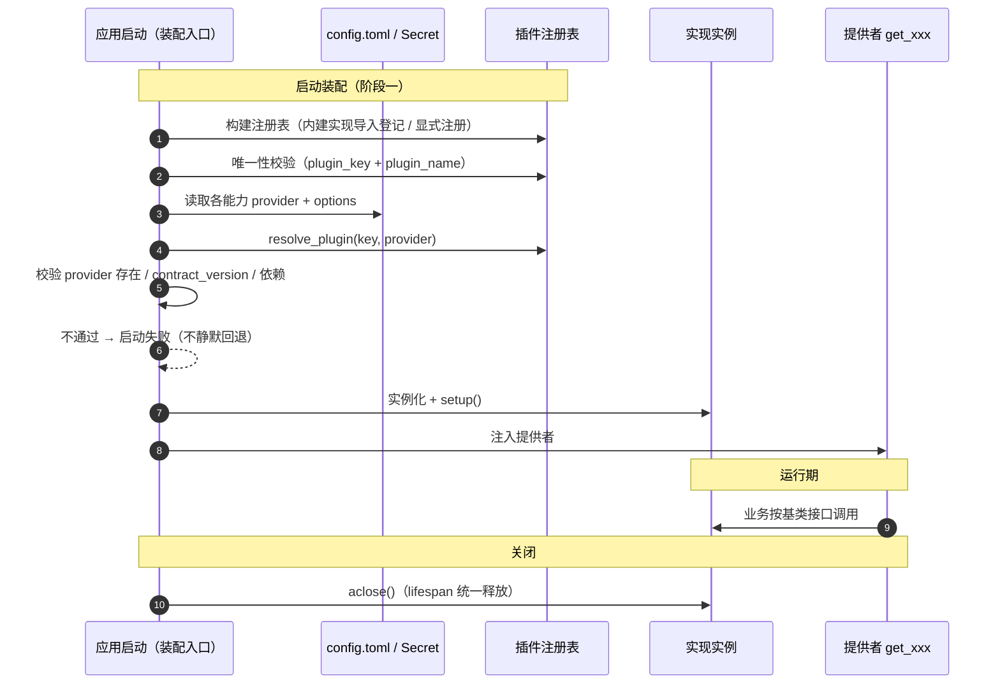

# 概要设计 · 扩展点与插件化

> BMS · 平台能力实现的注册、选择与装配（平台基础能力）

[概要设计](01_概要设计_总览.md) › 37-扩展点与插件化　|　[← 36-表单定制](36_概要设计_表单定制.md)

## 1. 模块概述与职责 

本节对应[《项目规划说明》](../../规划/项目规划说明.md)「平台扩展接入流程」（23.10 平台能力插件化）与「选型说明」（插件化条目）；架构设计依据[《架构设计》](../架构设计/01_架构设计_总览.md)[10-扩展点与插件化](../架构设计/10_架构设计_子系统_扩展点与插件化.md)节点，基类承载见 [04-后端基础类体系](../架构设计/04_架构设计_后端基础类体系.md)。

- **模块定位**：平台级基础能力（**非用户可见业务模块**），机制层——把「平台能力的实现可替换」收敛为「能力基类（端口）+ 插件注册表 + 配置选择 + 提供者」，支撑纵向能力替换（ID 生成 / 对象存储 / 通知 / 权限判定 / 检索 / LLM 等）与横向产品模块接入的统一机制。
- **职责边界**：只管「实现的注册、按配置选择、装配与生命周期、契约校验、插件清单可观测」；不管**业务模块注册**（归 [02-模块注册](02_概要设计_模块注册.md)，横向）与**各能力自身的业务逻辑**（归对应模块，如文件管理、AI 能力、权限计算）。
- **协作关系**：为各能力基类与装配入口提供注册/解析服务；与 02-模块注册同构（两轴），差异在注册要素（能力实现名 vs 模块标识）。

## 2. 功能分解与业务流程 

### 2.1 功能点分解 

| 功能点 | 说明 | 权限码 |
| --- | --- | --- |
| 实现注册 | 平台内建实现继承能力基类自动登记（`__init_subclass__`），或显式 `register_plugin(...)` / 虚拟子类登记；写进程内插件注册表 | —（开发期 / 启动期） |
| 唯一性校验 | `(plugin_key, plugin_name)` 唯一，重名在导入 / 启动期报错，不允许静默覆盖 | —（启动期） |
| 按配置选择与装配 | 读 `config.toml` 的 `provider` + `options`，经 `resolve_plugin` 实例化并注入；未指定用默认（Null/占位）实现 | —（启动期） |
| 启动校验 | provider 存在性、契约版本（`contract_version`）兼容、依赖可用性；失败即拒绝启动（不静默回退） | —（启动期） |
| 生命周期管理 | 装配入口统一调用 `setup()` / `aclose()`（异步）；随 `create_app` lifespan 释放 | —（运行期） |
| 插件清单查看 | 平台超管只读查看当前各能力 provider 与已注册实现（`describe()` 汇总） | sys（平台超管） |

### 2.2 业务规则 

- **只依赖基类**：业务代码只依赖能力基类与提供者 `get_xxx`，禁止直连具体实现；换实现只改 `config.toml`。
- **provider 即契约**：`provider` 名与实现名稳定、小写；改名按破坏性变更流程（公告 + 过渡期）。
- **双轨登记**：继承（主线，自动登记）与组合（二次开发，显式注册 / 虚拟子类 / `Protocol`）汇入同一注册表，均须过契约测试。
- **两轴分离**：能力实现替换（纵向，本节点）与产品模块接入（横向，02-模块注册）机制同构、注册要素不同。
- **阶段边界**：阶段一配置切换（重启生效）；阶段二运行时热插拔；阶段三第三方安装即发现（受控来源 + 隔离）。**不做插件市场与运行时远程加载**。
- **默认兜底**：每个能力有 `NullXxx` 默认实现，避免 `None` 判断；降级与熔断走能力域基座（`BaseFallbackPolicy` / `BaseCircuitBreaker`）。

### 2.3 流程步骤 

1. 定义能力基类：按需给某能力定端口（`BaseXxx`）+ 默认 `NullXxx` 实现（见《架构设计 · 后端基础类体系》）。
2. 编写实现：平台内建实现继承能力基类（或能力基类改继承 `BasePluggable` 后随之），声明 `plugin_key` / `plugin_name` / `contract_version`。
3. 登记：继承自动登记，或显式 `register_plugin(...)`；重名即失败。
4. 配置接入：`config.toml` 写 `provider` + `options`，密钥走 Secret。
5. 启动装配：装配入口建注册表 → 校验 provider / 版本 / 依赖 → `resolve_plugin` 实例化 → `setup()` → 注入提供者。
6. 契约测试与发布：实现跑同一组契约测试；随版本发布，provider 变更记发布说明。

## 3. 关键时序与协作 

协作要点：装配集中在启动一处（「唯一知道具体类型的地方」）；运行期只读注册表与提供者，无写路径；切换实现通过改配置 + 重启（阶段一）。

## 4. 数据模型与表设计 

- **不入库（进程内）**：插件注册表为**运行期内存结构**（启动构建、运行只读），不落平台库——它是「代码与实现」的映射，随构建产物确定。
- **配置而非表**：`provider` 是**环境配置**（每环境可不同、可环境变量覆盖），存 `config.toml`（`[<domain>] provider/options`），与 [02-模块注册](02_概要设计_模块注册.md)「为何用数据表」相反——**契约元数据入库、环境配置入文件**。
- **第三方治理表（阶段三评估，非 MVP）**：如引入第三方插件，新增 `sys_plugin`（平台库）登记第三方插件来源 / 版本 / `contract_version` / 启用状态，用于治理与清单；MVP 不做。

| 存储 | 内容 | 说明 |
| --- | --- | --- |
| 进程内插件注册表 | `(plugin_key, plugin_name) → 实现类` | 启动构建、运行只读；不持久化 |
| `config.toml` | `[<domain>] provider` + `options` | 环境配置，可 `BMS_` 环境变量覆盖；密钥走 Secret |
| sys_plugin（可选·阶段三） | 第三方插件来源 / 版本 / 状态 | 受控来源治理；MVP 不落地 |

## 5. 接口设计 

接口前缀与统一响应约定见[《API 接口规范》](../../规范/API接口规范.md)（第 2~3 节）。

### 5.1 接口清单 

| 方法 | 路径 | 说明 | 权限码 / 鉴权 |
| --- | --- | --- | --- |
| GET | /api/v1/plugins | 插件清单（各能力当前 provider + 已注册实现 `describe()`，只读） | sys（平台超管） |
| GET | /api/v1/plugins/{key} | 指定能力的实现清单与当前 provider | sys（平台超管） |

### 5.2 公共要求 

- 只读：本能力只提供清单查询，**不提供运行时切换 provider 的写接口**（阶段一改配置重启；阶段二热插拔另设计开关与审计）。
- 分页：能力项有限，清单接口通常不分页；按能力分组。
- 密钥：接口不返回任何 `options` 中的密钥字段（Secret 不落配置、不可查询）。

### 5.3 发布事件 

本能力不发布业务事件；provider 变更属发布/重启行为，随发布说明留痕，不进入运行时事件总线。

## 6. 权限与配置 

- **权限码**：无独立业务码；插件清单查看归平台超管（sys 业务）。
- **菜单挂接**：平台超管运营视图（可选菜单「插件清单」，随平台菜单种子下发）。
- **配置项**：各能力 `[<domain>] provider` + `options` 存 `config.toml`；**不通过 sys_config**（provider 是环境配置，非租户可改的运行期参数）。
- **密钥**：`options` 涉及的密钥一律走 Secret（环境变量/密钥文件），不进配置文件、不进日志。

## 7. 错误码与异常处理 

错误码 5/6 位数字，段号 + 段内序号，一经发布稳定不变；文案由前端按 i18n 映射（`error.{code}`），后端不承担文案拼装。本能力不新开段位，复用通用段：

| 段 | 区间 | 覆盖场景 |
| --- | --- | --- |
| 1xxxx（通用） | 10001-19999 | 插件注册冲突 / provider 非法 / 契约版本不兼容 / 依赖缺失等装配校验错误 |

- 覆盖场景：`(plugin_key, plugin_name)` 重名、provider 未注册、`contract_version` 不兼容、实现依赖不可用。
- 异常处理要求：**启动即校验、失败即拒启**，并输出冲突/缺失清单；运行期实现异常按能力基座统一错误码上抛、不拖垮主流程（异常隔离与降级见[《架构设计》](../架构设计/10_架构设计_子系统_扩展点与插件化.md)）。

## 8. 页面清单与验收要点 

| 端 | 页面 | 说明 |
| --- | --- | --- |
| PC 管理端 | 插件清单（平台超管运营视图，可选） | 只读展示各能力当前 provider 与已注册实现（名称 / 版本 / 状态），无切换入口 |
| 移动端 H5 | 无页面 | 平台基础能力，不面向租户 |

**验收要点**（对齐《项目规划说明》相关阶段完成标准）：

- 配置切换生效：改 `provider`（如对象存储 `minio → s3`）重启后生效，业务代码零改动；
- 非法拦截：provider 未注册 / 重名 / 契约版本不符 / 依赖缺失时启动被拒并给出清晰原因；
- 双轨可用：继承实现与组合登记（显式注册 / 虚拟子类 / `Protocol`）均能被解析调用；
- 契约测试：全部注册实现通过同一组契约测试；
- 默认兜底：未配置 provider 时使用 `NullXxx` 默认实现，无 `None` 崩溃；
- 边界：进程内、不新增常驻服务；不做插件市场与运行时远程加载；
- 可观测：插件清单可查询，启动日志打印各能力当前 provider（不含密钥）。

> 概要设计节点 · 与《项目规划说明》《架构设计》《文档生成规范》《命名规范》配套
