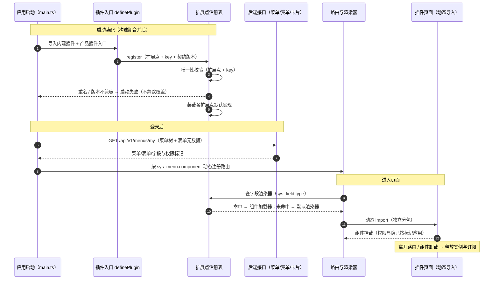

# 概要设计 · 前端插件化

> BMS · 前端扩展点的注册、解析与渲染（平台基础能力）

[概要设计](01_概要设计_总览.md) › 38-前端插件化　|　[← 37-后端插件化](37_概要设计_后端插件化.md)

## 1. 模块概述与职责 

本节对应[《项目规划说明》](../../规划/项目规划说明.md)「平台扩展接入流程」（23.10 平台能力插件化「前端插件化（配套）」）与「选型说明」（前端插件化条目）；架构设计依据[《架构设计》](../架构设计/01_架构设计_总览.md)[10-扩展点与插件化](../架构设计/10_架构设计_子系统_扩展点与插件化.md)「前端插件化」节、[08-前端架构](../架构设计/08_架构设计_前端架构.md)「前端插件化与产品模块合并」节与[05-前端组件体系](../架构设计/05_架构设计_前端组件体系.md)「渲染器与扩展点注册机制」节；知识铺垫见《[前端插件化](../../资料/知识档案/插件化架构/14_插件化架构_前端插件化.md)》。

- **模块定位**：平台级基础能力（**非用户可见业务模块**），机制层——把「前端可扩展面」收敛为「**扩展点 + 注册表 + 动态导入**」，支撑产品（biz/cw）前端模块挂接与前端能力（字段渲染器 / 卡片 / 图标 / 主题令牌）可替换。与 [37-后端插件化](37_概要设计_后端插件化.md)「能力基类（端口）+ 插件注册表 + 配置 provider + 提供者 `get_xxx`」同构，是同一机制在浏览器侧的对称面。
- **职责边界**：只管「扩展点的定义、注册、唯一性校验、按元数据解析、默认兜底、分包与隔离约束」；不管**后端能力实现替换**（归 [37-后端插件化](37_概要设计_后端插件化.md)）、**业务模块注册**（归 [02-模块注册](02_概要设计_模块注册.md)，横向）、**菜单/表单/字段元数据本身**（归 [07-菜单管理](07_概要设计_菜单管理.md)、[36-表单定制](36_概要设计_表单定制.md)）与**各组件自身契约**（归《[组件设计](../组件设计/01_组件设计_总览.md)》）。
- **协作关系**：
  - 后端插件化（[架构 10](../架构设计/10_架构设计_子系统_扩展点与插件化.md)）：机制同构——后端「端口选实现」对应前端「扩展点选组件」；差异在注册要素（能力实现名 vs 扩展点 key）与选择依据（`config.toml` provider vs 后端下发元数据 + 注册结果）。
  - 菜单管理（[07](07_概要设计_菜单管理.md)）：`sys_menu` / `sys_form` 的 `component`、`path`、字段类型等元数据是前端解析的输入，冲突在后端 `40003` 已校验。
  - 表单定制（[架构 30](../架构设计/30_架构设计_子系统_表单定制.md)）：`FormRenderer` 是本节点字段渲染器扩展点的消费方。
  - 首页工作台（[架构 29](../架构设计/29_架构设计_子系统_首页工作台.md)）：卡片注册表（内置功能卡 `render_key` / 图表卡 `card_type=dataset`）是本节点卡片扩展点的消费方。
  - 权限计算引擎（[架构 15](../架构设计/15_架构设计_子系统_权限计算引擎.md)）：菜单/按钮/字段显隐的数据来源；**前端显隐只是体验，真正鉴权在后端**。

## 2. 功能分解与业务流程 

### 2.1 功能点分解 

| 功能点 | 说明 | 权限码 |
| --- | --- | --- |
| 扩展点与注册表 | 统一注册表工厂 `createRegistry`；按扩展点分类实例化（路由/菜单、页面区域、通用组件、字段渲染器、图标、工作台卡片、主题令牌、i18n 文案包） | —（开发期） |
| 插件注册 | 平台内建与产品插件经 `definePlugin` + 应用初始化 `install` 登记，或显式 `registry.register(key, impl)`；写进程内注册表 | —（启动期） |
| 唯一性校验 | `(扩展点, key)` 唯一；重名在启动 / 构建期报错，不允许静默覆盖 | —（启动期） |
| 按元数据解析 | 路由按 `sys_menu.component`、字段按 `sys_field.type`、卡片按 `render_key` / `card_type` 查表解析组件 | 登录即可（渲染路径） |
| 默认兜底 | 未命中回落默认渲染器 / 空插槽 / 占位卡，不白屏、不抛未捕获异常 | 登录即可（渲染路径） |
| 动态导入与分包 | 插件页面与重组件一律动态 `import()` 异步加载、独立分包，不进首屏主包 | —（构建期） |
| 契约与类型对齐 | 请求/响应类型由 openapi-typescript 生成；字段类型 key 与后端字段类型注册表**同名对齐** | —（构建期） |
| 清单查看（开发期） | dev 环境输出各扩展点已注册项与当前解析结果（控制台 / 调试面板），生产不暴露 | —（开发期） |

### 2.2 业务规则 

- **只依赖扩展点与注册表**：业务页面与插件之间**不互相直接 import**；跨插件交互走注册表解析、事件或后端接口。
- **key 即契约**：扩展点 key 稳定、小写（字段类型 key 与后端字段类型注册表同名）；改名按破坏性变更流程（公告 + 过渡期，承诺口径见[《项目规划说明》](../../规划/项目规划说明.md)「平台对产品的兼容性承诺」节）。
- **双轨登记**：平台内建（源码内注册）与产品插件（构建期合并后注册）汇入同一注册表，均须过契约测试。
- **元数据驱动、不硬编码**：前端不写死路由表与字段组件映射；新增菜单/表单/按钮/字段走平台注册，**前端免发版**。
- **默认兜底**：每个扩展点有默认实现（默认渲染器 / 空插槽 / 占位卡），避免 `undefined` 判断与白屏。
- **阶段边界**：MVP 只做**构建期合并**（产品前端模块产物并入平台前端构建）；**不做运行时远程加载 / Module Federation / 微前端 / 插件市场**（见[《项目规划说明》](../../规划/项目规划说明.md)「明确不采用」节）。
- **权限边界**：前端显隐只是体验优化，真正鉴权在后端（动态菜单 + `v-perm` + 后端 `require_permission`）。
- **同一契约多实现**：注册表 / 基座扩展先落核心（`frontend/packages/core` + `@bms/vue` 投影），再按需在各渲染插件（`ui-ep` / `ui-vant`）实现并跑契约套件，不得只在一端扩展导致契约漂移（见[《前端开发规范》](../../规范/前端开发规范.md)「前端基类体系」节）。

### 2.3 流程步骤 

1. **定义扩展点**：按需给某可扩展面定扩展点类型 + 注册表实例 + 默认实现（遵循「加类型加基类、加扩展加一层基类」的扩展规则）。
2. **编写插件**：平台内建或产品模块实现组件 / 渲染器，声明扩展点 key 与契约版本 `contractVersion`。
3. **登记**：`definePlugin({ ... })` 在应用初始化 `install` 阶段注册，或显式 `registry.register(key, impl)`；重名即失败。
4. **构建期合并**：产品前端模块产物并入平台前端构建（`views/{模块}/`、组件与字段渲染器按注册表挂接），随平台构建产出**同一个应用**。
5. **启动装配**：应用初始化 → 导入内建与产品插件入口 → 注册表唯一性校验 → 解析默认实现 → 就绪。
6. **运行解析**：登录后取菜单树动态注册路由；进入页面时按元数据查注册表 + 动态 `import()` 加载组件。
7. **契约测试与发布**：全部注册实现跑同一组契约测试；随版本发布，扩展点 key 变更记发布说明。

## 3. 关键时序与协作 

协作要点：注册集中在应用初始化一处；运行期只读注册表、无写路径；插件页面一律动态导入。产品插件与平台页面同处一个应用进程（浏览器），**隔离靠样式作用域与注册表边界，不靠沙箱**——这与后端「进程内插件」的隔离假设一致（异常隔离要求见第 7 节）。

## 4. 数据模型与表设计 

- **不入库（进程内）**：扩展点注册表为**运行期内存结构**（启动构建、运行只读），不落平台库——它是「代码与组件」的映射，随构建产物确定；与 [37-后端插件化](37_概要设计_后端插件化.md)「插件注册表不入库」同口径。
- **元数据在后端**：菜单/表单/按钮/字段走 `sys_menu` / `sys_form` / `sys_field` / `sys_field_ext`；工作台卡片走 `sys_dashboard_card`（`render_key` / `card_type`）。前端只按元数据查注册表渲染，**不复制一份前端元数据**。
- **前端不新增表**：扩展点清单与插件来源治理均不入库；产品插件的来源与版本由产品仓库与构建流水线承载（区别于后端阶段四评估的 `sys_plugin`）。

| 存储 | 内容 | 说明 |
| --- | --- | --- |
| 进程内扩展点注册表 | `(扩展点, key) → 组件 / 渲染器 / 处理器` | 启动构建、运行只读；不持久化 |
| `sys_menu` / `sys_form` | `path` / `component` | 动态路由与页面组件的解析依据（平台库，含 i18n 附表） |
| `sys_field` / `sys_field_ext` | 字段 `type` | 字段渲染器分发的 key，与后端字段类型注册表同名 |
| `sys_dashboard_card` | `card_type` / `render_key` | 工作台卡片渲染器解析依据；`builtin` 卡 `render_key` 指向前端渲染器标识 |
| openapi-typescript 生成类型 | 请求/响应 TS 类型 | 与后端 Pydantic schema 同源，避免契约漂移 |

## 5. 接口设计 

本能力是**前端机制**，不提供 REST 接口。本节描述前端**消费的后端接口**与**扩展点解析契约**；接口前缀与统一响应约定见[《API 接口规范》](../../规范/API接口规范.md)（第 2~3 节）。

### 5.1 前端消费的后端接口 

| 方法 | 路径 | 前端用途 | 权限码 / 鉴权 |
| --- | --- | --- | --- |
| GET | /api/v1/menus/my | 当前用户动态菜单树 + 表单元数据（按钮/字段与可见可编辑状态）→ 动态注册路由与侧边栏 | —（登录用户） |
| GET | /api/v1/forms/{form_code}/layout-effective | 生效布局 + 合并字段清单 + 权限标记 → `FormRenderer` 按字段类型分发渲染器 | 登录即可 |
| GET | /api/v1/dashboard/layout | 当前用户工作台布局 + 可选用卡片清单 → 卡片注册表解析 | 登录即可 |
| GET | /api/v1/dashboard/cards | 卡片列表（`card_type` / `render_key`）→ 卡片注册表解析与可选面板 | dashboard:query |

### 5.2 扩展点清单（前端契约） 

| 扩展点 | 注册表 | key 来源 | 解析时机 | 默认兜底 | 承载 |
| --- | --- | --- | --- | --- | --- |
| 路由 / 菜单 | `routeRegistry` | `sys_menu.path` / `component` | 登录后按菜单树动态注册路由 | 未命中 → 404 页 | [08-前端架构](../架构设计/08_架构设计_前端架构.md)、[07-菜单管理](07_概要设计_菜单管理.md) |
| 页面区域（插槽） | `slotRegistry` | 区域标识（如 `layout.header`、`form.toolbar`） | 布局渲染时 | 空插槽（不渲染） | [05-前端组件体系](../架构设计/05_架构设计_前端组件体系.md)、[布局设计](../布局设计/01_布局设计_总览.html) |
| 通用组件 | `componentRegistry` | 组件型号 / 类型标识 | 按型号解析具体组件时 | 基础控件默认实现 | [05-前端组件体系](../架构设计/05_架构设计_前端组件体系.md) |
| 字段渲染器 | `fieldRendererRegistry` | `sys_field.type` / `sys_field_ext.type`（与后端字段类型同名） | `FormRenderer` 按元数据分发 | 文本只读渲染器 | [30-表单定制](../架构设计/30_架构设计_子系统_表单定制.md)、[36-表单定制](36_概要设计_表单定制.md) |
| 图标 | `iconRegistry` | `sys_menu.icon` 等 icon key | `IconDisplay` 渲染时 | 默认图标 | [05-前端组件体系](../架构设计/05_架构设计_前端组件体系.md) |
| 工作台卡片 | `cardRendererRegistry` | `sys_dashboard_card.render_key`（`builtin`）/ `card_type=dataset` | 工作台布局解析后渲染 | 未知卡片占位卡（提示未注册） | [29-首页工作台](../架构设计/29_架构设计_子系统_首页工作台.md)、[35-首页工作台](35_概要设计_首页工作台.md) |
| 主题令牌 | `themeRegistry` | 主题标识 / 租户品牌 | 应用启动与主题切换 | 平台默认主题令牌 | [布局设计-设计令牌](../布局设计/02_布局设计_设计令牌.html)、[08-前端架构](../架构设计/08_架构设计_前端架构.md) |
| 文案包（i18n） | `i18nPackRegistry` | 语言包 key（模块 / locale） | 应用启动与语言切换 | 回退默认语言与主表默认文案 | [24-国际化](../架构设计/24_架构设计_子系统_国际化.md)、[29-国际化管理](29_概要设计_国际化管理.md) |

### 5.3 公共要求 

- **只读解析**：线上不提供运行时注册 / 替换组件的写路径（dev 调试除外）；变更走代码与构建发布。
- **动态导入**：插件页面与重组件一律异步加载、独立分包，不进首屏主包（性能预算见 [08-前端架构](../架构设计/08_架构设计_前端架构.md)「前端性能」节）。
- **密钥**：前端不持有任何密钥；`options` 类敏感信息一律由后端经 Secret 管理，不下发、不落前端存储。
- **契约类型**：请求/响应类型由 openapi-typescript 从 OpenAPI schema 生成，前端不手写重复类型。

### 5.4 发布事件 

本能力不发布业务事件；扩展点注册属构建与启动行为，随发布说明留痕，不进入运行时事件总线。

## 6. 权限与配置 

- **权限码**：无独立业务码；渲染路径接口登录即可（菜单树、生效布局、工作台布局按用户权限集下发）。
- **菜单挂接**：无独立菜单；产品页面菜单由产品侧按平台扩展接入流程注册 `sys_menu` 种子，前端动态路由自动生效、平台前端免发版。
- **配置项**：无 `sys_config` 参数——扩展点选择由**后端下发元数据**（菜单/字段/卡片）驱动，不是租户可改的运行期参数；构建与分包行为由前端工程配置承载。
- **开发期开关**：dev 清单与注册告警走前端环境变量（见[《命名规范》](../../规范/命名规范.md)「基础设施命名」节 `BMS_` 前缀口径，前端构建变量按 Vite 约定），生产环境默认关闭。
- **密钥**：前端不持有密钥，不适用 Secret 通道。

## 7. 错误码与异常处理 

错误码 5/6 位数字，段号 + 段内序号，一经发布稳定不变；文案由前端按 i18n 映射（`error.{code}`）。**注册类冲突是前端构建/启动期错误，在启动与 CI 拒绝，不占用后端错误码段位**；运行期解析未命中走默认兜底，不向用户抛错。本能力不新开段位：

| 场景 | 处理 | 时机 |
| --- | --- | --- |
| `(扩展点, key)` 重名 | 启动抛错 + 构建期 / CI 拒绝，输出冲突清单 | 启动 / CI |
| `contractVersion` 不兼容 | 内建插件拒绝启动；产品插件跳过注册并告警，未跳过项仍可用 | 启动 |
| 注册项未命中 | 回落默认渲染器 / 空插槽 / 占位卡，dev 控制台告警 | 运行期 |
| 动态导入失败（网络抖动 / 版本漂移） | 路由级错误兜底页 + 重试入口，不白屏 | 运行期 |
| 插件组件未捕获异常 | 组件级错误边界隔离，不拖垮主框架；异常上报走[27-可观测性](../架构设计/27_架构设计_子系统_可观测性.md) | 运行期 |
| 插件页面调用后端接口失败 | 按后端错误码原样上抛（如菜单 `component` / `path` 冲突 `40003`），文案走 i18n | 运行期 |

- 异常处理要求：**启动即校验、冲突即拒**，并输出冲突清单；运行期插件异常被错误边界隔离，不影响主框架与其他插件（与后端「异常隔离、不拖垮主流程」同口径）。
- 样式与全局污染：插件样式一律作用域化（`scoped` / 命名前缀），禁止修改全局对象与原型；跨插件交互只经扩展点。

## 8. 页面清单与验收要点 

| 端 | 页面 | 说明 |
| --- | --- | --- |
| PC 管理端 | 无独立页面 | 平台基础机制；产品业务页面由产品仓库提供，构建期合并后经动态路由呈现 |
| PC 管理端（可选） | 扩展点清单调试面板 | 仅 dev 环境：展示各扩展点已注册项与当前解析结果，生产不暴露 |
| 移动端 H5 | 无独立页面 | 注册表机制与 PC 同契约（同接口多实现）；产品插件页面 MVP 不在移动端交付 |

**验收要点**（对齐《项目规划说明》相关阶段完成标准）：

- 产品页面挂接：biz/cw 前端模块经**构建期合并**进入平台前端应用后，菜单/路由/页面生效，**平台前端免发版**；
- 扩展点齐全：路由/菜单、页面区域、通用组件、字段渲染器、图标、工作台卡片、主题令牌、i18n 文案包八类注册表可用且均可被产品插件扩展；
- 唯一性冲突被拒：`(扩展点, key)` 重名与契约版本不兼容在启动 / CI 被拒绝并给出清晰原因；
- 默认兜底：未注册项回落默认渲染器 / 空插槽 / 占位卡，无白屏、无 `undefined` 崩溃；
- 分包达标：插件页面与重组件独立 chunk、不进首屏主包，单页 JS 包 gzip ≤ 300KB 预算不被突破；
- 契约一致：字段类型 key 与后端字段类型注册表同名对齐；TS 类型由 OpenAPI 生成，无手写重复类型；
- 权限边界：前端显隐只是体验，越权请求被后端 403 拦截；
- 隔离：插件样式作用域化，插件组件异常被错误边界隔离，不拖垮主框架；
- 边界：不做运行时远程加载 / Module Federation / 微前端 / 插件市场；不新增常驻服务；
- 可观测：dev 下可查看各扩展点注册清单与解析结果，生产不暴露。

> 概要设计节点 · 与《项目规划说明》《架构设计》《文档生成规范》《命名规范》配套
