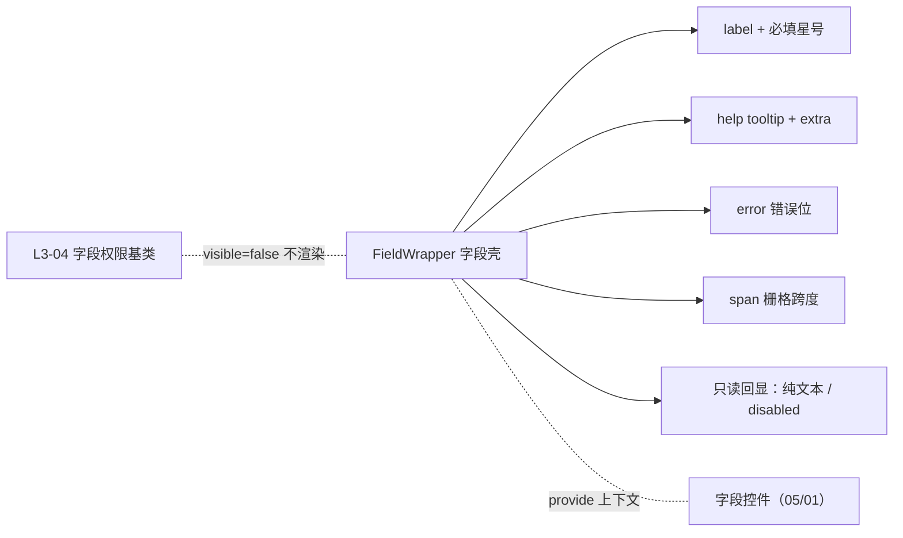

# 组件设计 · 字段壳

> FieldWrapper（所有字段控件的外层壳，被 05 基础控件类与 01 字段类包裹）

[文档首页](../../../../../文档首页.md) › [项目规划说明](../../../../../规划/项目规划说明.md) › [组件设计](../../../01_组件设计_总览.md) › 字段壳基类　|　[← 字段基类](../02_组件设计_字段基类/02_组件设计_字段基类.md)　[字段权限基类 →](../04_组件设计_字段权限基类/04_组件设计_字段权限基类.md)

> 可交互原型：[02_原型设计_字段壳基类.html](02_原型设计_字段壳基类.html)（演示 label/必填星号/帮助 tooltip/错误位/栅格跨度/只读回显切换，以及它与 00-01 基类、00-03 权限的配合）

## 1. 目的与适用范围 

定义 BMS 前端 `frontend/` **字段壳** `FieldWrapper.vue` 的组件设计：统一承载字段的**外层结构**——标签（label）、必填星号、帮助提示（help tooltip）、错误信息位、描述/额外说明（extra）、栅格跨度（span）、标签宽度/位置，以及**只读回显切换**（纯文本 / `disabled` 输入框）。它是 00 基础组件类的第 2 篇，**被 05 基础控件类与 01 字段类包裹**，与 [L4-01 输入域基类](../../L4_域基类/01_组件设计_输入域基类/01_组件设计_输入域基类.md)（控件行为）、[L3-04 字段权限基类](../../L3_受控值与字段基类/04_组件设计_字段权限基类/04_组件设计_字段权限基类.md)（可见/可编辑）共同构成字段的公共外层与行为契约。

### 1.1 定位与职责边界 

| 职责 | 归属 |
| --- | --- |
| label/必填星号/帮助/错误位/extra/栅格跨度/标签位置 | **本节点（字段壳）** |
| 只读回显结构（纯文本 vs disabled 输入框） | **本节点**（控件提供 `readonly` 渲染） |
| 受控值、`disabled` 合并、三态、校验触发 | [00-01 基类](../../L4_域基类/01_组件设计_输入域基类/01_组件设计_输入域基类.md) |
| `visible`/`editable`/`required`/脱敏 | [L3-04 字段权限基类](../../L3_受控值与字段基类/04_组件设计_字段权限基类/04_组件设计_字段权限基类.md) |
| 具体输入/展示控件 | 05 基础控件类、01 字段类 |
| 布局元数据取数、控件分发 | [03 交互类 13 表单渲染器](../../../03_交互类/13_组件设计_表单渲染器/13_组件设计_表单渲染器.md) |

上游依据：[《布局设计 · 表单页》](../../../../布局设计/08_布局设计_表单页.html)（三列主表、窄容器单列、长字段跨整行、只读/编辑分态）、[《布局设计 · 表单定制》](../../../../布局设计/14_布局设计_表单定制.html)（栅格与字段属性）、[《布局设计 · 表格明细》](../../../../布局设计/09_布局设计_表格明细.html)（明细行内字段）；数据口径依据[《概要设计 · 表单定制》](../../../../概要设计/36_概要设计_表单定制.md)（字段属性 `label/required/help/placeholder/span/spanEdit/spanView` 下发）。

> 本篇为组件设计体系 **00 基础组件类第 02 篇**。**范围边界**：**控件行为**归 00-01；**权限与必填判定来源**归 00-03；**具体控件**归 05/01；**全表布局与分区**归[13 表单渲染器](../../../03_交互类/13_组件设计_表单渲染器/13_组件设计_表单渲染器.md)；只读纯文本的**值格式化**归[L4-02 展示域基类](../../L4_域基类/02_组件设计_展示域基类/02_组件设计_展示域基类.md)。

## 2. 组件清单与职责 

| 组件 / 工具 | 位置 | 职责 |
| --- | --- | --- |
| `FieldWrapper.vue` | `src/components/base/` | 字段外层壳：label/必填星号/help/error/extra/span/labelWidth/labelPosition/只读回显切换；包裹控件并提供上下文 |
| `useFieldContext.ts`（复用 [00-01](../../L4_域基类/01_组件设计_输入域基类/01_组件设计_输入域基类.md)） | `src/components/base/` | 壳向控件 `provide` label/required/error/readonly/disabled/size/span；控件回传值变化与校验 |
| `FieldHelp.vue` | `src/components/base/` | 帮助提示（tooltip）：图标 + 说明文案（i18n），可选跳转字段说明 |

- 命名遵循[《命名规范》](../../../../../规范/命名规范.md)；目录遵循[《前端开发规范》](../../../../../规范/前端开发规范.md)（归 `base/`）。

## 3. Props 与事件（FieldWrapper） 

| 属性 | 类型 | 默认 | 说明 |
| --- | --- | --- | --- |
| `label` | string | '' | 字段标签（i18n） |
| `fieldKey` | string | '' | 字段标识（透传上下文、错误定位） |
| `required` | boolean \| `'auto'` | `'auto'` | 必填（`'auto'` 由元数据/校验规则推导，统一显示星号） |
| `help` | string | '' | 帮助说明（tooltip） |
| `extra` | string | '' | 额外说明（标签下方小字） |
| `error` | string | '' | 错误信息（优先于控件自身校验态；空则读上下文） |
| `span` | number | 1 | 栅格跨度（列数，主表默认 3 列布局；长字段跨整行） |
| `labelWidth` | string \| number | '' | 标签宽度（默认取表单/主题值） |
| `labelPosition` | 'left' \| 'right' \| 'top' | 'right' | 标签位置（窄容器/移动端转 `top`） |
| `colon` | boolean | true | 标签后是否加冒号 |
| `readonlyMode` | 'text' \| 'disabled' \| 'auto' | 'auto' | 只读回显方式：纯文本 / 禁用控件 / 按字段类型自动 |
| `showLabel` | boolean | true | 是否显示标签（明细行内/表头场景可隐藏） |

| 事件 | 载荷 | 说明 |
| --- | --- | --- |
| `validate` | result | 转发控件校验结果（供渲染器汇总） |
| `click-label` | fieldKey | 标签点击（帮助/聚焦，可选） |

- 作用域插槽：`default`（控件）、`label`、`help`、`error`、`extra`；`default` 插槽提供 `{ readonly, disabled, size }` 供控件使用。

## 4. 交互与渲染 

| 项 | 设计 |
| --- | --- |
| 标签与必填 | 左侧/顶部 label，`required` 显示红色星号；星号来源：字段属性 `required` 或校验规则含必填（`'auto'` 统一推导，避免两处不一致） |
| 帮助提示 | `help` 显示问号图标，hover/点击 tooltip（支持富文本说明，i18n）；不遮挡布局 |
| 错误位 | 控件校验失败或提交校验时在壳内展示 `error`（[13 表单渲染器](../../../03_交互类/13_组件设计_表单渲染器/13_组件设计_表单渲染器.md) 汇总），滚动定位到首个错误字段 |
| extra | 标签下方小字说明（如取值范围、格式提示） |
| 栅格跨度 | `span` 决定字段占用列数（主表 3 列，窄容器单列，长字段跨整行）；由布局元数据下发、壳消费 |
| 只读回显 | 查看态：`readonlyMode='text'` 用纯文本（经 [L4-02 展示域基类](../../L4_域基类/02_组件设计_展示域基类/02_组件设计_展示域基类.md) 格式化），`'disabled'` 保留控件置灰回显，`'auto'` 按字段类型（如富文本/上传用展示，简单文本用纯文本） |
| 标签位置 | 宽屏 `right`，窄容器/移动端 `top`；表单级可覆盖 |
| 明细行内 | `showLabel=false`，壳退化为单元格容器（[《布局设计 · 表格明细》](../../../../布局设计/09_布局设计_表格明细.html)） |
| 权限协作 | `visible=false` 时**整个壳不渲染**（由渲染器调用 00-03 判定后跳过），栅格自然收缩 |
| 语言 | label/help/extra 走 i18n；值不翻译 |
| 无控件空态 | 只读且值为空显示统一占位（`—`，口径见 00-04） |

## 5. 场景集成 

| 场景 | 说明 |
| --- | --- |
| 主表表单 | 3 列栅格，字段壳承载 label/必填/help/错误 |
| 窄容器/弹窗 | 单列、`labelPosition='top'` |
| 明细行内编辑 | `showLabel=false`，壳作为单元格 |
| 查看态 | `readonlyMode` 决定纯文本或禁用控件 |
| 查询筛选区 | 标签左置，错误位一般不启用（[02 展示类 02 查询筛选区](../../../02_展示类/02_组件设计_查询筛选区/02_组件设计_查询筛选区.md)） |

## 6. 依赖接口与上游变更 

### 6.1 上游接口与口径 

| 项 | 说明 | 目标文档 |
| --- | --- | --- |
| 字段属性 | `label/required/help/placeholder/span/spanEdit/spanView` | [《概要设计 · 表单定制》](../../../../概要设计/36_概要设计_表单定制.md)（登记项③） |
| 栅格布局 | 三列主表、窄容器单列、长字段跨整行 | [《布局设计 · 表单定制》](../../../../布局设计/14_布局设计_表单定制.html)（登记项②） |
| 字段与校验 | label/必填/错误/只读回显 | [《布局设计 · 表单页》](../../../../布局设计/08_布局设计_表单页.html)（登记项①） |
| 明细行内 | 无标签单元格 | [《布局设计 · 表格明细》](../../../../布局设计/09_布局设计_表格明细.html) |
| 校验规则 | 必填与规则工厂 | [04 基础类 03 格式化工具](../../../04_基础类/03_组件设计_格式化工具/03_组件设计_格式化工具.md)、[13 表单渲染器](../../../03_交互类/13_组件设计_表单渲染器/13_组件设计_表单渲染器.md) |
| 新增依赖 | **无**：复用 `el-form-item` + 栅格 | — |

### 6.2 需登记的上游变更 

| 变更点 | 目标文档 | 内容 |
| --- | --- | --- |
| ① 字段壳契约 | [《布局设计 · 表单页》](../../../../布局设计/08_布局设计_表单页.html)「字段与校验」节 | 明确字段壳统一的 label/必填星号/help/错误位/extra/只读回显（纯文本或 disabled）；必填星号由字段属性或校验规则统一推导；错误滚动定位；标注组件设计 00-02 为契约依据 |
| ② 栅格与跨度 | [《布局设计 · 表单定制》](../../../../布局设计/14_布局设计_表单定制.html)「栅格布局」节 | 明确 `span/spanEdit/spanView` 由元数据下发、字段壳消费；宽屏 3 列 / 窄容器单列 / 长字段跨整行；标签位置随断点切换 |
| ③ 字段属性下发 | [《概要设计 · 表单定制》](../../../../概要设计/36_概要设计_表单定制.md)「字段属性」节 | 明确字段属性 `label/required/help/extra/placeholder/span/spanEdit/spanView/labelPosition` 的元数据字段与默认值，供字段壳与渲染器消费 |

> 按[《文档生成规范》](../../../../../规范/文档生成规范.md)「引用与追溯」节，上述变更需用户确认后由上游文档同步；本节点只定义字段壳契约。

## 7. 权限 / i18n / 移动端 

- **权限**：`visible`/`editable` 由[L3-04 字段权限基类](../../L3_受控值与字段基类/04_组件设计_字段权限基类/04_组件设计_字段权限基类.md)判定；壳负责"不可见不渲染、不可编辑传入上下文置 disabled"；`required` 与脱敏按字段属性。
- **i18n**：label/help/extra/错误文案按 locale；值不翻译。
- **移动端**：独立工程，字段壳概念同源（label 顶部、单列、错误位一致），组件不复用。

## 8. 性能与边界 

| 场景 | 设计 |
| --- | --- |
| 渲染 | 壳为轻量容器；help tooltip 懒渲染 |
| 校验 | 错误信息由上下文集中，避免每字段重复监听 |
| 边界 | 必填星号与校验规则不一致、label 过长换行/省略、help 与 extra 并存、span 超出列数、只读回显类型与字段不匹配（富文本/上传）、长表单错误定位、明细无标签、标签位置断点切换抖动 |
| 不支持 | 控件行为（00-01）、权限判定（00-03）、具体控件（05/01）、全表布局（13）、值格式化（00-04） |

## 9. 检查清单 

- □ 契约：label/required（含 `'auto'`）/help/extra/error/span/labelWidth/labelPosition/readonlyMode/showLabel
- □ 渲染：必填星号统一推导、help tooltip、错误位与滚动定位、extra、`span` 栅格、标签位置随断点
- □ 只读回显：`text`/`disabled`/`auto` 三选，`auto` 按字段类型；空值统一占位
- □ 权限协作：`visible=false` 整壳不渲染、`editable=false` 上下文置 disabled
- □ 明细行内 `showLabel=false`；查询区形态适配
- □ 权限/i18n/移动端符合第 7 节；性能边界（懒渲染、集中校验）符合第 8 节
- □ 三项上游登记已确认：字段壳契约、栅格与跨度、字段属性下发

> 组件设计节点 · 与[《布局设计 · 表单页》](../../../../布局设计/08_布局设计_表单页.html)[《布局设计 · 表单定制》](../../../../布局设计/14_布局设计_表单定制.html)[《布局设计 · 表格明细》](../../../../布局设计/09_布局设计_表格明细.html)[《概要设计 · 表单定制》](../../../../概要设计/36_概要设计_表单定制.md)[L4-01 输入域基类](../../L4_域基类/01_组件设计_输入域基类/01_组件设计_输入域基类.md)[L3-04 字段权限基类](../../L3_受控值与字段基类/04_组件设计_字段权限基类/04_组件设计_字段权限基类.md)[L4-02 展示域基类](../../L4_域基类/02_组件设计_展示域基类/02_组件设计_展示域基类.md)[03 交互类 13 表单渲染器](../../../03_交互类/13_组件设计_表单渲染器/13_组件设计_表单渲染器.md)[02 展示类 02 查询筛选区](../../../02_展示类/02_组件设计_查询筛选区/02_组件设计_查询筛选区.md)[04 基础类 03 格式化工具](../../../04_基础类/03_组件设计_格式化工具/03_组件设计_格式化工具.md)《命名规范》配套
