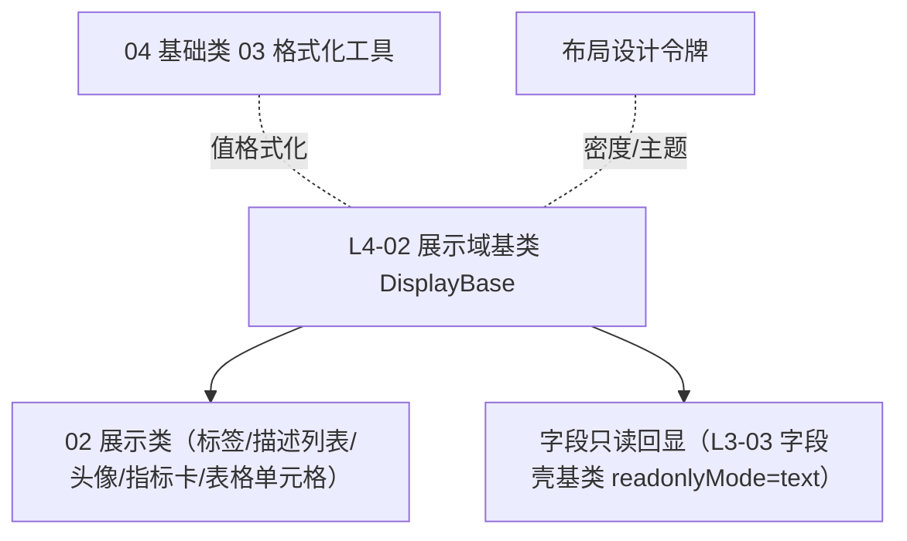

# 组件设计 · 展示域基类

> DisplayBase · useDisplayBase（被 02 展示类与字段只读回显继承）

[文档首页](../../../../../文档首页.md) › [项目规划说明](../../../../../规划/项目规划说明.md) › [组件设计](../../../01_组件设计_总览.md) › 展示域基类　|　[← 输入域基类](../01_组件设计_输入域基类/01_组件设计_输入域基类.md)　[字典字段 →](../../../01_字段类/01_组件设计_字典字段/01_组件设计_字典字段.md)

> 可交互原型：[02_原型设计_展示域基类.html](02_原型设计_展示域基类.html)（演示值格式化、空值统一占位、密度切换、只读不校验、可复制与超长省略，及它被展示类继承的关系）

## 1. 目的与适用范围 

定义 BMS 前端 `frontend/` **基础展示组件基类**的组件设计：`DisplayBase.vue`（只读值渲染的抽象基类）与 `useDisplayBase.ts`（值格式化、空值占位、密度、主题令牌、可复制/省略等只读行为）。它是 00 基础组件类第 4 篇，与 [L4-01 输入域基类](../../L4_域基类/01_组件设计_输入域基类/01_组件设计_输入域基类.md)（输入侧基类）对称，**被 02 展示类（[状态标签与描述列表](../../../02_展示类/03_组件设计_状态标签与描述列表/03_组件设计_状态标签与描述列表.md)/[头像与用户信息](../../../02_展示类/12_组件设计_头像与用户信息/12_组件设计_头像与用户信息.md)/[指标卡](../../../02_展示类/10_组件设计_指标卡/10_组件设计_指标卡.md) 等）与字段控件只读回显继承**，统一"值怎么格式化、空值怎么显示、密度/主题怎么消费"。

### 1.1 定位与职责边界 

| 职责 | 归属 |
| --- | --- |
| 只读值渲染、空值占位、密度、可复制/省略、主题令牌消费 | **本节点（展示基类）** |
| 具体格式化规则（金额/日期/枚举文本） | [04 基础类 03 格式化工具](../../../04_基础类/03_组件设计_格式化工具/03_组件设计_格式化工具.md)（本类调用） |
| 输入侧行为（受控/校验） | [L4-01 输入域基类](../../L4_域基类/01_组件设计_输入域基类/01_组件设计_输入域基类.md) |
| 具体展示组件（标签/头像/图表） | 02 展示类 |
| 空状态（整块无数据） | [02 展示类 05 异常与空状态](../../../02_展示类/05_组件设计_异常与空状态/05_组件设计_异常与空状态.md) |

上游依据：[《布局设计 · 设计令牌》](../../../../布局设计/02_布局设计_设计令牌.html)（密度/字号/色令牌，展示组件只消费令牌）、[《布局设计 · 表格明细》](../../../../布局设计/09_布局设计_表格明细.html)（单元格只读渲染）、[《布局设计 · 列表页》](../../../../布局设计/07_布局设计_列表页.html)（列表展示）、[《布局设计 · 异常与空状态》](../../../../布局设计/12_布局设计_异常与空状态.html)（空值与空状态分工）。

> 本篇为组件设计体系 **00 基础组件类第 04 篇**。**范围边界**：**格式化规则本体**归[04 基础类 03 格式化工具](../../../04_基础类/03_组件设计_格式化工具/03_组件设计_格式化工具.md)；**具体展示组件**归 02 展示类；**整块空状态**归[02 展示类 05 异常与空状态](../../../02_展示类/05_组件设计_异常与空状态/05_组件设计_异常与空状态.md)；**输入侧**归 00-01。

## 2. 组件清单与职责 

| 组件 / 工具 | 位置 | 职责 |
| --- | --- | --- |
| `DisplayBase.vue` | `src/components/base/` | 只读值渲染抽象基类：接收原始值 + formatter，输出文本/节点；统一空值占位、超长省略、tooltip、可复制 |
| `useDisplayBase.ts` | `src/components/base/` | 组合式基类：格式化调度、空值判定、密度映射、主题令牌、只读标记（不校验、不可编辑） |

- 命名遵循[《命名规范》](../../../../../规范/命名规范.md)；目录遵循[《前端开发规范》](../../../../../规范/前端开发规范.md)（归 `base/`）。
- 展示组件统一**只读**：不接收 `modelValue`、不参与校验；需要交互（点击/跳转）由具体展示组件扩展。

## 3. Props 与事件（DisplayBase） 

| 属性 | 类型 | 默认 | 说明 |
| --- | --- | --- | --- |
| `value` | any | `null` | 原始值（由 formatter/默认格式化渲染） |
| `formatter` | string \| (v, row?) => string | '' | 格式化器名（金额/日期/枚举/布尔等，见 04-03）或函数 |
| `emptyText` | string | `'—'` | 空值占位（统一口径，可覆盖） |
| `density` | 'compact' \| 'default' \| 'loose' | 继承 | 密度（随表格/表单/用户偏好） |
| `copyable` | boolean | false | 是否显示复制按钮 |
| `ellipsis` | boolean \| number | false | 超长省略（true/最大宽度） |
| `tooltip` | boolean \| 'overflow' | 'overflow' | 省略时悬浮显示完整值 |

| 事件 | 载荷 | 说明 |
| --- | --- | --- |
| `copy` | value | 复制成功 |
| `click-value` | value | 点击值（可选，供扩展跳转） |

- 作用域插槽：`default`（自定义渲染，如标签/头像/链接），提供 `{ value, text }`；`empty`（自定义空态）。

## 4. 行为与约定 

| 项 | 设计 |
| --- | --- |
| 值格式化 | 按 `formatter` 调度 [04 基础类 03 格式化工具](../../../04_基础类/03_组件设计_格式化工具/03_组件设计_格式化工具.md)（金额千分位、日期、枚举文本、布尔是/否）；未指定则默认 `String(value)` |
| 空值占位 | `null`/`undefined`/`''`/`[]`/`{}` 统一显示 `emptyText`（默认 `—`）；**空值与空状态区分**：单元格空值用占位，整块无数据用空状态组件（[02 展示类 05 异常与空状态](../../../02_展示类/05_组件设计_异常与空状态/05_组件设计_异常与空状态.md)） |
| 密度 | 由 `density` 或上下文（表格/表单/用户偏好）决定行高与字号，映射[《布局设计 · 设计令牌》](../../../../布局设计/02_布局设计_设计令牌.html) |
| 主题令牌 | 颜色/字号/间距只消费令牌，不硬编码；随品牌色与亮暗主题自动适配（[03 交互类 20 主题与品牌化](../../../03_交互类/20_组件设计_主题与品牌化/20_组件设计_主题与品牌化.md)） |
| 只读 | 不参与校验、不可编辑；与输入侧组件严格区分（不共用 `modelValue`） |
| 省略与 tooltip | 超长省略 + 悬浮完整值；表格默认 `tooltip='overflow'` |
| 可复制 | `copyable` 显示复制按钮（复制**格式化后**文本或原值，按配置） |
| i18n | 布尔/枚举文本等按 locale（格式化工具负责）；占位符文案走 vue-i18n |
| 标题/描述 | label 渲染归字段壳（[00-02](../../L3_受控值与字段基类/03_组件设计_字段壳基类/03_组件设计_字段壳基类.md)）与描述列表，不在基类 |

## 5. 场景集成 

| 场景 | 说明 |
| --- | --- |
| 表格单元格 | 只读列渲染 + 空值占位 + 省略/tooltip（[02 展示类 01 通用表格](../../../02_展示类/01_组件设计_通用表格/01_组件设计_通用表格.md)） |
| 描述列表 | 详情字段值渲染（[02 展示类 03 状态标签与描述列表](../../../02_展示类/03_组件设计_状态标签与描述列表/03_组件设计_状态标签与描述列表.md)） |
| 字段只读回显 | 字段壳 `readonlyMode='text'` 使用展示基类格式化（[L3-03 字段壳基类](../../L3_受控值与字段基类/03_组件设计_字段壳基类/03_组件设计_字段壳基类.md)） |
| 指标卡/图表卡 | 数值/同比格式化（[02 展示类 10 指标卡](../../../02_展示类/10_组件设计_指标卡/10_组件设计_指标卡.md)） |
| 头像与用户信息 | 名称/部门文本渲染 |

## 6. 依赖接口与上游变更 

### 6.1 上游接口与口径 

| 项 | 说明 | 目标文档 |
| --- | --- | --- |
| 设计令牌 | 密度/字号/色令牌，展示只消费 | [《布局设计 · 设计令牌》](../../../../布局设计/02_布局设计_设计令牌.html)（登记项②） |
| 只读渲染 | 单元格/描述展示口径 | [《布局设计 · 表格明细》](../../../../布局设计/09_布局设计_表格明细.html)（登记项①） |
| 空值与空状态 | 空值占位与整块空状态分工 | [《布局设计 · 异常与空状态》](../../../../布局设计/12_布局设计_异常与空状态.html)（登记项③） |
| 格式化规则 | 金额/日期/枚举/布尔 | [04 基础类 03 格式化工具](../../../04_基础类/03_组件设计_格式化工具/03_组件设计_格式化工具.md) |
| 新增依赖 | **无** | — |

### 6.2 需登记的上游变更 

| 变更点 | 目标文档 | 内容 |
| --- | --- | --- |
| ① 只读展示基类契约 | [《布局设计 · 表格明细》](../../../../布局设计/09_布局设计_表格明细.html)「只读渲染」节 | 明确只读值统一经展示基类渲染：格式化、空值占位 `—`、省略与 tooltip、可复制；组件不硬编码色值；标注组件设计 00-04 为契约依据 |
| ② 展示令牌与密度 | [《布局设计 · 设计令牌》](../../../../布局设计/02_布局设计_设计令牌.html)「展示令牌」节 | 明确展示组件的密度（compact/default/loose）与字号/行高/色令牌映射；展示组件只消费令牌、随主题品牌自动适配 |
| ③ 空值与空状态分工 | [《布局设计 · 异常与空状态》](../../../../布局设计/12_布局设计_异常与空状态.html)「空值展示」节 | 明确单元格/字段空值统一占位 `—`（展示基类），整块无数据用空状态组件；两者不混用；占位可配置 |

> 按[《文档生成规范》](../../../../../规范/文档生成规范.md)「引用与追溯」节，上述变更需用户确认后由上游文档同步；本节点只定义展示基类契约。

## 7. 权限 / i18n / 移动端 

- **权限**：展示值是否可见由字段权限/数据范围决定（[L3-04 字段权限基类](../../L3_受控值与字段基类/04_组件设计_字段权限基类/04_组件设计_字段权限基类.md)）；脱敏字段的展示由 `v-plain`/`maskValue` 控制；展示基类不判断权限。
- **i18n**：布尔/枚举文本按 locale（格式化工具负责）；占位与复制提示走 vue-i18n。
- **移动端**：独立工程，展示语义同源（格式化、空值占位、密度），组件不复用。

## 8. 性能与边界 

| 场景 | 设计 |
| --- | --- |
| 渲染 | 纯文本渲染轻量；tooltip/复制按需挂载 |
| 大表格 | 单元格格式化结果可缓存；避免每格创建重组件 |
| 边界 | 空值判定差异（`0`/`false` 非空）、超长文本省略与 tooltip 冲突、可复制与脱敏（脱敏值不应可复制明文）、密度上下文缺失、主题令牌缺失回退、格式化器不存在回退原值 |
| 不支持 | 格式化规则本体（04-03）、具体展示组件（02 展示类）、空状态（02-05）、输入侧（00-01）、权限判定（00-03） |

## 9. 检查清单 

- □ 基类契约：`value`/`formatter`/`emptyText`/`density`/`copyable`/`ellipsis`/`tooltip`
- □ 行为：格式化调度（04-03）、空值统一占位、密度令牌、主题令牌、只读不校验、省略/tooltip、可复制、i18n
- □ 空值 vs 空状态分工清晰；`0`/`false` 不被误判为空
- □ 脱敏值不可复制明文（与 00-03 协作）
- □ 被 02 展示类与字段只读回显继承；不硬编码色值
- □ 权限/i18n/移动端符合第 7 节；性能边界（缓存/按需挂载/回退）符合第 8 节
- □ 三项上游登记已确认：只读展示基类契约、展示令牌与密度、空值与空状态分工

> 组件设计节点 · 与[《布局设计 · 设计令牌》](../../../../布局设计/02_布局设计_设计令牌.html)[《布局设计 · 表格明细》](../../../../布局设计/09_布局设计_表格明细.html)[《布局设计 · 列表页》](../../../../布局设计/07_布局设计_列表页.html)[《布局设计 · 异常与空状态》](../../../../布局设计/12_布局设计_异常与空状态.html)[L4-01 输入域基类](../../L4_域基类/01_组件设计_输入域基类/01_组件设计_输入域基类.md)[L3-03 字段壳基类](../../L3_受控值与字段基类/03_组件设计_字段壳基类/03_组件设计_字段壳基类.md)[L3-04 字段权限基类](../../L3_受控值与字段基类/04_组件设计_字段权限基类/04_组件设计_字段权限基类.md)[02 展示类 05 异常与空状态](../../../02_展示类/05_组件设计_异常与空状态/05_组件设计_异常与空状态.md)[02 展示类 03 状态标签与描述列表](../../../02_展示类/03_组件设计_状态标签与描述列表/03_组件设计_状态标签与描述列表.md)[03 交互类 20 主题与品牌化](../../../03_交互类/20_组件设计_主题与品牌化/20_组件设计_主题与品牌化.md)[04 基础类 03 格式化工具](../../../04_基础类/03_组件设计_格式化工具/03_组件设计_格式化工具.md)《命名规范》配套
