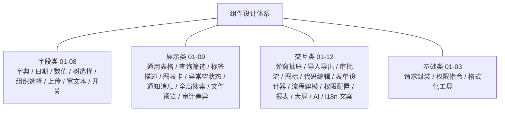

# 组件设计

> BMS 基础管理系统 · 总纲

[文档首页](../../文档首页.md) › [项目规划说明](../../规划/项目规划说明.md) › 01_组件设计_总览　|　[字典字段 →](01_字段类/01_组件设计_字典字段/01_组件设计_字典字段.md)

## 1. 文档目的 <a id="purpose"></a>

本文档是 BMS（基础管理系统）组件设计的**总纲**：说明组件设计体系的定位、设计依据、组织方式、编号规则与组件路线图，并作为入口引用全部组件设计节点文件。组件设计在[《项目规划说明》](../../规划/项目规划说明.md)、[《架构设计 · 前端架构》](../架构设计/28_架构设计_前端架构.md)与[《布局设计》](../布局设计/01_布局设计_总览.html)之上，把管理端反复出现的界面元素（表单字段、数据展示、交互容器、基础工具）沉淀为**可复用的通用组件**，落到「组件清单与职责、Props 与事件、取数与缓存、交互与边界、性能与协作」的粒度，供前端直接实现，也为后续《详细设计》划定边界。

> 组件设计是**布局设计之下、具体页面实现之上**的一层：布局设计回答"页面怎么排"，组件设计回答"排进去的通用组件怎么用、怎么交互、怎么取数"；组件设计不推翻布局设计已定案的框架与形态，与[《布局设计》](../布局设计/01_布局设计_总览.html)冲突时以布局设计为准并先修订布局节点。

## 2. 体系定位 <a id="position"></a>

| 项 | 说明 |
| --- | --- |
| 目录 | `bms文档/设计/组件设计/` |
| 回答的问题 | 通用组件/工具的职责、Props 与事件、数据获取与缓存、交互与边界、性能约束 |
| 稳定性 | 稳定（改则牵动使用该组件的全部页面） |
| 上游 | 规划（功能模块）、架构（[28-前端架构](../架构设计/28_架构设计_前端架构.md)）、概要设计（模块接口）、布局设计（页面形态） |
| 下游 | 前端实施（`frontend/src/components/`、`src/utils/`、`src/stores/`）；组件变更须先改本体系节点再改代码 |

- 组件设计节点与具体框架解耦地描述**契约**（做什么、怎么交互、边界在哪），实现细节（Element Plus 用法、样式）在代码中落地；PC 与移动端为独立工程，本文档面向 PC 管理端 `frontend/`（Vue 3 + Element Plus），移动端 `frontend-mobile/`（Vant）不套用 PC 组件（节点如涉及移动端会单独说明）。
- 命名遵循[《命名规范》](../../规范/命名规范.md)：组件 PascalCase、Store `useXxxStore`、工具函数 camelCase；目录约定遵循[《前端开发规范》](../../规范/前端开发规范.md)。

## 3. 设计依据 <a id="basis"></a>

| 依据 | 路径 | 作用 |
| --- | --- | --- |
| 项目规划说明 | [`../../规划/项目规划说明.md`](../../规划/项目规划说明.md) | 功能模块、技术选型（Vue 3 + Element Plus）、性能与缓存策略定案 |
| 架构设计·前端架构 | [`../架构设计/28_架构设计_前端架构.md`](../架构设计/28_架构设计_前端架构.md) | 双工程结构、组件目录与状态管理、动态路由与权限渲染 |
| 架构设计·数据架构 | [`../架构设计/05_架构设计_数据架构.md`](../架构设计/05_架构设计_数据架构.md) | 缓存三防、降级协议等取数机制约束 |
| 概要设计 | [`../概要设计/01_概要设计_总览.md`](../概要设计/01_概要设计_总览.md) | 各组件依赖的模块接口、权限码与数据模型 |
| 布局设计 | [`../布局设计/01_布局设计_总览.html`](../布局设计/01_布局设计_总览.html) | 主框架、列表页/表单页/弹窗等页面形态与设计令牌 |
| 前端开发规范 | [`../../规范/前端开发规范.md`](../../规范/前端开发规范.md) | 目录、TypeScript、Props/emit、状态管理、请求封装的编码约定 |
| 文档生成规范 | [`../../规范/文档生成规范.md`](../../规范/文档生成规范.md) | 本文档及全部节点文件的格式与布局要求 |
| 命名规范 | [`../../规范/命名规范.md`](../../规范/命名规范.md) | 组件、Store、工具函数的命名约定 |

## 4. 组织方式与编号规则 <a id="organization"></a>

- 组件设计采用「**总纲 + 类别文件夹 + 节点**」结构：`01_组件设计_总览.md` 为总纲（本文档），其下按四类分文件夹（`01_字段类/`、`02_展示类/`、`03_交互类/`、`04_基础类/`），每个组件/工具主题独立成篇、自包含可单独阅读，总纲统一引用。
- 节点采用「**节点文件夹**」组织：文件夹与设计文档同名（`{类别夹}/{编号}_组件设计_{主题}/`，内含 `{编号}_组件设计_{主题}.md`），可交互原型资产（`{编号}_原型设计_{主题}.html`）与设计文档同目录，便于组件与原型一并评审。

```text
组件设计/
├── 01_组件设计_总览.md                    # 本总纲（体系导航 + 组件路线图）
├── 01_字段类/                             # 类别文件夹（编号即类别阅读顺序）
│   └── 01_组件设计_字典字段/              # 组件节点文件夹（类内从 01 编号）
│       ├── 01_组件设计_字典字段.md        # 组件设计文档（契约与交互）
│       └── 01_原型设计_字典字段.html      # 可交互原型（Element Plus 模拟，评审基准）
├── 02_展示类/
├── 03_交互类/
└── 04_基础类/
```

- 编号分两级：**类别编号**（01 字段类 / 02 展示类 / 03 交互类 / 04 基础类）与**类内节点编号**（各类从 01 顺延）；新增节点在其类别内顺延，不与既有编号冲突。节点开头标注对应规划章节与上游设计节点，保证 规划 → 架构 → 概要 →（布局）→ 组件 可追溯。
- 原型遵循[《文档生成规范》](../../规范/文档生成规范.md) 8.5：可点击交互、引用 `../../../原型设计/资源/`（原型样式 + Element Plus 组件库）、顶部带原型条、内置模拟数据。

## 5. 组件路线图 <a id="roadmap"></a>

组件按四类规划，类内编号（各类从 01 顺延）；下表「状态」列标注是否已建，编号即阅读顺序：

| 类别 | 编号 | 节点 | 文件 | 状态 |
| --- | --- | --- | --- | --- |
| 字段类 | 01 | 字典字段 | [01_组件设计_字典字段.md](01_字段类/01_组件设计_字典字段/01_组件设计_字典字段.md) | 已建 |
| 字段类 | 02 | 日期时间字段 | [02_组件设计_日期时间字段.md](01_字段类/02_组件设计_日期时间字段/02_组件设计_日期时间字段.md) | 已建 |
| 字段类 | 03 | 数值与金额字段 | [03_组件设计_数值与金额字段.md](01_字段类/03_组件设计_数值与金额字段/03_组件设计_数值与金额字段.md) | 已建 |
| 字段类 | 04 | 树选择字段（部门/菜单） | [04_组件设计_树选择字段.md](01_字段类/04_组件设计_树选择字段/04_组件设计_树选择字段.md) | 已建 |
| 字段类 | 05 | 人员/部门/岗位选择字段 | [05_组件设计_组织选择字段.md](01_字段类/05_组件设计_组织选择字段/05_组件设计_组织选择字段.md) | 已建 |
| 字段类 | 06 | 文件上传字段 | [06_组件设计_文件上传字段.md](01_字段类/06_组件设计_文件上传字段/06_组件设计_文件上传字段.md) | 已建 |
| 字段类 | 07 | 富文本字段 | [07_组件设计_富文本字段.md](01_字段类/07_组件设计_富文本字段/07_组件设计_富文本字段.md) | 已建 |
| 字段类 | 08 | 开关与枚举字段 | [08_组件设计_开关与枚举字段.md](01_字段类/08_组件设计_开关与枚举字段/08_组件设计_开关与枚举字段.md) | 已建 |
| 展示类 | 01 | 通用表格 ProTable | [01_组件设计_通用表格.md](02_展示类/01_组件设计_通用表格/01_组件设计_通用表格.md) | 已建 |
| 展示类 | 02 | 查询筛选区 | [02_组件设计_查询筛选区.md](02_展示类/02_组件设计_查询筛选区/02_组件设计_查询筛选区.md) | 已建 |
| 展示类 | 03 | 状态标签与描述列表 | [03_组件设计_状态标签与描述列表.md](02_展示类/03_组件设计_状态标签与描述列表/03_组件设计_状态标签与描述列表.md) | 已建 |
| 展示类 | 04 | 图表卡 | [04_组件设计_图表卡.md](02_展示类/04_组件设计_图表卡/04_组件设计_图表卡.md) | 已建 |
| 展示类 | 05 | 异常与空状态 | [05_组件设计_异常与空状态.md](02_展示类/05_组件设计_异常与空状态/05_组件设计_异常与空状态.md) | 已建 |
| 展示类 | 06 | 通知与消息 | （待建） | 规划中 |
| 展示类 | 07 | 全局搜索 | （待建） | 规划中 |
| 展示类 | 08 | 文件预览 | （待建） | 规划中 |
| 展示类 | 09 | 审计差异查看 | （待建） | 规划中 |
| 交互类 | 01 | 弹窗/抽屉表单 | [01_组件设计_弹窗抽屉表单.md](03_交互类/01_组件设计_弹窗抽屉表单/01_组件设计_弹窗抽屉表单.md) | 已建 |
| 交互类 | 02 | 导入导出 | [02_组件设计_导入导出.md](03_交互类/02_组件设计_导入导出/02_组件设计_导入导出.md) | 已建 |
| 交互类 | 03 | 审批流展示 | [03_组件设计_审批流展示.md](03_交互类/03_组件设计_审批流展示/03_组件设计_审批流展示.md) | 已建 |
| 交互类 | 04 | 图标选择器 | [04_组件设计_图标选择器.md](03_交互类/04_组件设计_图标选择器/04_组件设计_图标选择器.md) | 已建 |
| 交互类 | 05 | 代码/表达式编辑器 | [05_组件设计_代码表达式编辑器.md](03_交互类/05_组件设计_代码表达式编辑器/05_组件设计_代码表达式编辑器.md) | 已建 |
| 交互类 | 06 | 表单设计器 | [06_组件设计_表单设计器.md](03_交互类/06_组件设计_表单设计器/06_组件设计_表单设计器.md) | 已建 |
| 交互类 | 07 | 流程建模器 | [07_组件设计_流程建模器.md](03_交互类/07_组件设计_流程建模器/07_组件设计_流程建模器.md) | 已建 |
| 交互类 | 08 | 权限配置 | [08_组件设计_权限配置.md](03_交互类/08_组件设计_权限配置/08_组件设计_权限配置.md) | 已建 |
| 交互类 | 09 | 报表设计器 | [09_组件设计_报表设计器.md](03_交互类/09_组件设计_报表设计器/09_组件设计_报表设计器.md) | 已建 |
| 交互类 | 10 | 大屏设计器与播放 | [10_组件设计_大屏设计器与播放.md](03_交互类/10_组件设计_大屏设计器与播放/10_组件设计_大屏设计器与播放.md) | 已建 |
| 交互类 | 11 | AI 助手 | [11_组件设计_AI助手.md](03_交互类/11_组件设计_AI助手/11_组件设计_AI助手.md) | 已建 |
| 交互类 | 12 | 国际化文案编辑器 | [12_组件设计_国际化文案编辑器.md](03_交互类/12_组件设计_国际化文案编辑器/12_组件设计_国际化文案编辑器.md) | 已建 |
| 基础类 | 01 | 请求封装与错误处理 | [01_组件设计_请求封装.md](04_基础类/01_组件设计_请求封装/01_组件设计_请求封装.md) | 已建 |
| 基础类 | 02 | 权限指令与字段权限 | [02_组件设计_权限指令.md](04_基础类/02_组件设计_权限指令/02_组件设计_权限指令.md) | 已建 |
| 基础类 | 03 | 格式化工具与组合式函数 | [03_组件设计_格式化工具.md](04_基础类/03_组件设计_格式化工具/03_组件设计_格式化工具.md) | 已建 |

- 四类的职责边界：**字段类**是表单输入控件（值绑定、校验、只读回显、字典/组织等数据源）；**展示类**是只读呈现（表格、筛选、标签、图表、反馈与查看）；**交互类**是承载操作流的容器、设计器与专用面板；**基础类**是不带界面或横切的工具、指令与 store。
- 表中「规划中」节点为主题与类内编号的**预登记**，开工写该节点时最终确定；优先级随模块开发推进（如工作流做流程建模器、报表中心做报表/大屏设计器），逐个建立。
- 基础类节点只描述**组件化/工具契约**层面的设计，编码风格与通用约定仍以[《前端开发规范》](../../规范/前端开发规范.md)为准，不重复。



## 6. 通用设计约定 <a id="conventions"></a>

- **受控组件**：字段类组件统一 `modelValue` / `update:modelValue` 双向绑定，变更额外抛 `change`；只读态不做两套组件，统一以 `disabled` 置灰回显（见[《布局设计·表单页》](../布局设计/08_布局设计_表单页.html)只读/编辑分态与字段权限）。
- **字段权限协作**：`visible=false` 由表单页不渲染；`editable=false` 由表单页传 `disabled`，组件不感知权限逻辑。
- **数据来源**：字典、组织树等数据统一走对应 store/接口并复用缓存与版本比对，避免同屏重复请求；列表批量场景优先批量接口（组件设计节点给出具体契约）。
- **i18n**：组件内固定文案（占位、空结果）走 vue-i18n 语言包；业务数据 label 由接口按 locale 下发，组件只负责渲染。
- **可访问性与一致性**：交互与视觉对齐 Element Plus 行为，不自定义与组件库冲突的交互；原型即验收基准。

## 7. 阅读指南 <a id="reading"></a>

1. **先读总纲**（本文档）：了解体系定位、编号规则与组件路线图
2. **再读基础类节点**（基础类 01-03）：请求封装、权限指令、格式化工具为多数组件共用，先读可避免重复约定
3. **按需读组件节点**：开发某页面时，对照[《布局设计》](../布局设计/01_布局设计_总览.html)对应页面形态，读该形态用到的组件节点；节点内「可交互原型」链接可直接打开 demos 评审
4. **交叉对照**：契约以本体系节点为准，编码约定以[《前端开发规范》](../../规范/前端开发规范.md)为准，页面形态以[《布局设计》](../布局设计/01_布局设计_总览.html)为准，三者冲突先修订上游

## 8. 与上下游文档的关系 <a id="coordination"></a>

- **上游**：规划与架构定技术选型与工程结构，概要设计定模块接口与权限，布局设计定页面形态；组件设计只做组件契约落地展开，每篇节点开头标注对应上游节点。
- **下游**：前端按本体系节点实现 `src/components/`、`src/utils/`、`src/stores/`；组件契约变更（Props/事件/取数方式）须先更新本体系节点，再改代码与引用页面。
- **变更传导**：涉及接口/缓存/数据表的组件变更（如字典字段的批量接口）须先同步[《概要设计》](../概要设计/01_概要设计_总览.md)与[《架构设计》](../架构设计/01_架构设计_总览.md)对应节点，再落组件设计节点。

> 组件设计总纲 · 与《项目规划说明》《架构设计·前端架构》《概要设计》《布局设计》《前端开发规范》《文档生成规范》《命名规范》配套
