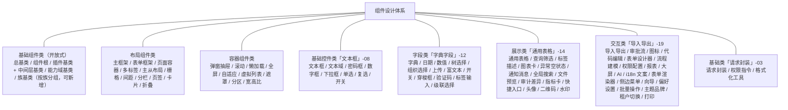

# 组件设计

> BMS 基础管理系统 · 总纲
> 实现侧命名与落点见《[前端基类清单](../../前端基类清单.md)》，实现契约细节见项目详细设计。

[文档首页](../../文档首页.md) › [项目规划说明](../../规划/项目规划说明.md) › 01_组件设计_总览　|　[总基类 →](02_基础组件类/01_机制基类/01_组件设计_根系基类/01_组件设计_根系基类.md)

## 1. 文档目的 <a id="purpose"></a>

本文档是 BMS（基础管理系统）组件设计的**总纲**：说明组件设计体系的定位、设计依据、组织方式、编号规则与组件路线图，并作为入口引用全部组件设计节点文件。组件设计在[《项目规划说明》](../../规划/项目规划说明.md)、[《架构设计 · 前端架构》](../架构设计/08_架构设计_前端架构.md)与[《布局设计》](../布局设计/01_布局设计_总览.html)之上，把管理端反复出现的界面元素（表单字段、数据展示、交互容器、基础工具）沉淀为**可复用的通用组件**，以「职责与边界、交互与行为、取数与缓存语义、性能与边界」的粒度定稿；它是通用组件/件的**概要设计层**，实现侧命名与落点见《[前端基类清单](../../前端基类清单.md)》、实现契约细节见项目详细设计。

> 组件设计是**布局设计之下、具体页面实现之上**的一层：布局设计回答"页面怎么排"，组件设计回答"排进去的通用组件怎么用、怎么交互、怎么取数"；组件设计不推翻布局设计已定案的框架与形态，与[《布局设计》](../布局设计/01_布局设计_总览.html)冲突时以布局设计为准并先修订布局节点。

## 2. 体系定位 <a id="position"></a>

| 项 | 说明 |
| --- | --- |
| 目录 | `bms文档/设计/组件设计/` |
| 回答的问题 | 通用组件/件的职责与边界、交互与行为、取数与缓存语义、性能约束 |
| 稳定性 | 稳定（改则牵动使用该组件的全部页面） |
| 上游 | 规划（功能模块）、架构（[08-前端架构](../架构设计/08_架构设计_前端架构.md)、[05-前端组件体系](../架构设计/05_架构设计_前端组件体系.md)）、概要设计（模块接口）、布局设计（页面形态） |
| 下游 | 前端实施（实现侧命名与落点见《[前端基类清单](../../前端基类清单.md)》；实现契约细节见项目详细设计）；组件语义与契约变更须先改本体系节点再改代码 |

- 组件设计节点与具体框架解耦地描述**语义与契约边界**（做什么、怎么交互、边界在哪），实现（组件库用法、样式）在代码中落地；**同一契约多实现**——PC 与移动端各自实现，一致性由同一套契约断言保证（节点如涉及移动端会单独说明）。

## 3. 设计依据 <a id="basis"></a>

| 依据 | 路径 | 作用 |
| --- | --- | --- |
| 项目规划说明 | [`../../规划/项目规划说明.md`](../../规划/项目规划说明.md) | 功能模块、技术选型、性能与缓存策略定案 |
| 架构设计·前端架构 | [`../架构设计/08_架构设计_前端架构.md`](../架构设计/08_架构设计_前端架构.md) | 双工程结构、组件目录与状态管理、动态路由与权限渲染 |
| 架构设计·数据架构 | [`../架构设计/07_架构设计_数据架构.md`](../架构设计/07_架构设计_数据架构.md) | 缓存三防、降级协议等取数机制约束 |
| 概要设计 | [`../概要设计/01_概要设计_总览.md`](../概要设计/01_概要设计_总览.md) | 各组件依赖的模块接口、权限码与数据模型 |
| 布局设计 | [`../布局设计/01_布局设计_总览.html`](../布局设计/01_布局设计_总览.html) | 主框架、列表页/表单页/弹窗等页面形态与设计令牌 |
| 前端开发规范 | [`../../规范/前端开发规范.md`](../../规范/前端开发规范.md) | 目录、分层、基类体系与组件语义契约的强制口径 |
| 文档生成规范 | [`../../规范/文档生成规范.md`](../../规范/文档生成规范.md) | 本文档及全部节点文件的格式与布局要求 |
| 命名规范 | [`../../规范/命名规范.md`](../../规范/命名规范.md) | 组件、Store、工具函数的命名约定 |

## 4. 组织方式与编号规则 <a id="organization"></a>

- 组件设计采用「**总纲 + 类别文件夹 + 节点**」结构：`01_组件设计_总览.md` 为总纲（本文档），其下按八类分文件夹（`02_基础组件类/`、`03_布局组件类/`、`04_容器组件类/`、`05_基础控件类/`、`06_字段类/`、`07_展示类/`、`08_交互类/`、`09_基础类/`），每个组件/工具主题独立成篇、自包含可单独阅读，总纲统一引用。
- 节点采用「**节点文件夹**」组织：文件夹与设计文档同名（`{类别夹}/{编号}_组件设计_{主题}/`，内含 `{编号}_组件设计_{主题}.md`），可交互原型资产（`{编号}_原型设计_{主题}.html`）与设计文档同目录，便于组件与原型一并评审。

```text
组件设计/
├── 01_组件设计_总览.md                    # 本总纲（体系导航 + 组件路线图）
├── 02_基础组件类/                         # 开放式基类体系（按角色分组，可无限扩展）
│   ├── 01_机制基类/                       # 总基类 / 组件根 / 插件基类 / 中间层基类（能力机制 / 占位 / 异步资源 / 订阅 / 注册表 / 错误）
│   ├── 02_能力类/                         # 能力域基类（原「能力」，按族分组：值 / 字段 / 形态 / 复用；可新增）
│   └── 03_域基类/                         # 族基类 / 域语义基类（输入 / 展示 / 树 / 图表 / 编辑器；按需新增）
├── 03_布局组件类/                         # 布局：主框架/表单框架/页面容器/导航/栅格/分栏/卡片等
├── 04_容器组件类/                         # 容器：弹窗抽屉/滚动/懒加载/全屏/自适应/虚拟/遮罩/分区/宽高比
├── 05_基础控件类/                         # 基础控件（继承 基础组件类 输入族基类 BaseInput）
├── 06_字段类/                             # 带数据源/特殊交互/特殊格式的字段
├── 07_展示类/
├── 08_交互类/
└── 09_基础类/
```

- 编号分两级：**类别编号**（基础组件类 / 布局组件类 / 容器组件类 / 基础控件类 / 字段类 / 展示类 / 交互类 / 基础类）与**类内节点编号**（各类从 01 顺延）；新增节点在其类别内顺延，不与既有编号冲突。节点开头标注对应规划章节与上游设计节点，保证 规划 → 架构 → 概要 →（布局）→ 组件 可追溯。
- 原型遵循[《文档生成规范》](../../规范/文档生成规范.md) 8.5：可点击交互、引用 `../../../原型设计/资源/`（原型样式 + vendor 组件库）、顶部带原型条、内置模拟数据。

## 5. 组件路线图 <a id="roadmap"></a>

组件按八类规划，类内编号（各类从 01 顺延）；下表「状态」列标注是否已建，编号即阅读顺序：

| 类别 | 编号 | 节点 | 文件 | 状态 |
| --- | --- | --- | --- | --- |
| 基础组件类 · 机制/中间层基类 | 01 | 总基类 | [01_组件设计_根系基类/01_组件设计_根系基类.md](02_基础组件类/01_机制基类/01_组件设计_根系基类/01_组件设计_根系基类.md) | 已建 |
| 基础组件类 · 机制/中间层基类 | 02 | 组件根基类 | [02_组件设计_组件根基类/02_组件设计_组件根基类.md](02_基础组件类/01_机制基类/02_组件设计_组件根基类/02_组件设计_组件根基类.md) | 已建 |
| 基础组件类 · 机制/中间层基类 | 03 | 能力机制 | [03_组件设计_能力机制/03_组件设计_能力机制.md](02_基础组件类/01_机制基类/03_组件设计_能力机制/03_组件设计_能力机制.md) | 已建 |
| 基础组件类 · 机制/中间层基类 | 04 | 占位基类 | [04_组件设计_占位基类/04_组件设计_占位基类.md](02_基础组件类/01_机制基类/04_组件设计_占位基类/04_组件设计_占位基类.md) | 已建 |
| 基础组件类 · 机制/中间层基类 | 05 | 异步资源基类 | [05_组件设计_异步资源基类/05_组件设计_异步资源基类.md](02_基础组件类/01_机制基类/05_组件设计_异步资源基类/05_组件设计_异步资源基类.md) | 已建 |
| 基础组件类 · 机制/中间层基类 | 06 | 注册表基类 | [06_组件设计_注册表基类/06_组件设计_注册表基类.md](02_基础组件类/01_机制基类/06_组件设计_注册表基类/06_组件设计_注册表基类.md) | 已建 |
| 基础组件类 · 机制/中间层基类 | 07 | 错误基类 | [07_组件设计_错误基类/07_组件设计_错误基类.md](02_基础组件类/01_机制基类/07_组件设计_错误基类/07_组件设计_错误基类.md) | 已建 |
| 基础组件类 · 机制/中间层基类 | 08 | 订阅基类 | [08_组件设计_订阅基类/08_组件设计_订阅基类.md](02_基础组件类/01_机制基类/08_组件设计_订阅基类/08_组件设计_订阅基类.md) | 已建 |
| 基础组件类 · 能力域基类 | 01 | 交互能力 | [01_组件设计_交互能力/01_组件设计_交互能力.md](02_基础组件类/02_能力类/01_组件设计_交互能力/01_组件设计_交互能力.md) | 已建 |
| 基础组件类 · 能力域基类 | 02 | 输入形态能力 | [02_组件设计_输入形态能力/02_组件设计_输入形态能力.md](02_基础组件类/02_能力类/02_组件设计_输入形态能力/02_组件设计_输入形态能力.md) | 已建 |
| 基础组件类 · 能力域基类 | 03 | 展示形态能力 | [03_组件设计_展示形态能力/03_组件设计_展示形态能力.md](02_基础组件类/02_能力类/03_组件设计_展示形态能力/03_组件设计_展示形态能力.md) | 已建 |
| 基础组件类 · 能力域基类 | 04 | 容器能力 | [04_组件设计_容器能力/04_组件设计_容器能力.md](02_基础组件类/02_能力类/04_组件设计_容器能力/04_组件设计_容器能力.md) | 已建 |
| 基础组件类 · 能力域基类 | 05 | 表单容器能力 | [05_组件设计_表单容器能力/05_组件设计_表单容器能力.md](02_基础组件类/02_能力类/05_组件设计_表单容器能力/05_组件设计_表单容器能力.md) | 已建 |
| 基础组件类 · 能力域基类 | 06 | 媒体能力 | [06_组件设计_媒体能力/06_组件设计_媒体能力.md](02_基础组件类/02_能力类/06_组件设计_媒体能力/06_组件设计_媒体能力.md) | 已建 |
| 基础组件类 · 能力域基类 | 07 | 布局能力 | [07_组件设计_布局能力/07_组件设计_布局能力.md](02_基础组件类/02_能力类/07_组件设计_布局能力/07_组件设计_布局能力.md) | 已建 |
| 基础组件类 · 能力域基类 | 08 | 受控值能力 | [08_组件设计_受控值能力/08_组件设计_受控值能力.md](02_基础组件类/02_能力类/08_组件设计_受控值能力/08_组件设计_受控值能力.md) | 已建 |
| 基础组件类 · 能力域基类 | 09 | 字段编排能力 | [09_组件设计_字段编排能力/09_组件设计_字段编排能力.md](02_基础组件类/02_能力类/09_组件设计_字段编排能力/09_组件设计_字段编排能力.md) | 已建 |
| 基础组件类 · 能力域基类 | 10 | 字段壳能力 | [10_组件设计_字段壳能力/10_组件设计_字段壳能力.md](02_基础组件类/02_能力类/10_组件设计_字段壳能力/10_组件设计_字段壳能力.md) | 已建 |
| 基础组件类 · 能力域基类 | 11 | 字段权限能力 | [11_组件设计_字段权限能力/11_组件设计_字段权限能力.md](02_基础组件类/02_能力类/11_组件设计_字段权限能力/11_组件设计_字段权限能力.md) | 已建 |
| 基础组件类 · 能力域基类 | 12 | 选项源能力 | [12_组件设计_选项源能力/12_组件设计_选项源能力.md](02_基础组件类/02_能力类/12_组件设计_选项源能力/12_组件设计_选项源能力.md) | 已建 |
| 基础组件类 · 能力域基类 | 13 | 上传引擎能力 | [13_组件设计_上传引擎能力/13_组件设计_上传引擎能力.md](02_基础组件类/02_能力类/13_组件设计_上传引擎能力/13_组件设计_上传引擎能力.md) | 已建 |
| 基础组件类 · 能力域基类 | 14 | 异步任务能力 | [14_组件设计_异步任务能力/14_组件设计_异步任务能力.md](02_基础组件类/02_能力类/14_组件设计_异步任务能力/14_组件设计_异步任务能力.md) | 已建 |
| 基础组件类 · 能力域基类 | 15 | 页签状态能力 | [15_组件设计_页签状态能力/15_组件设计_页签状态能力.md](02_基础组件类/02_能力类/15_组件设计_页签状态能力/15_组件设计_页签状态能力.md) | 已建 |
| 基础组件类 · 能力域基类 | 16 | 偏好持久化能力 | [16_组件设计_偏好持久化能力/16_组件设计_偏好持久化能力.md](02_基础组件类/02_能力类/16_组件设计_偏好持久化能力/16_组件设计_偏好持久化能力.md) | 已建 |
| 基础组件类 · 能力域基类 | 17 | 编辑器内核能力 | [17_组件设计_编辑器内核能力/17_组件设计_编辑器内核能力.md](02_基础组件类/02_能力类/17_组件设计_编辑器内核能力/17_组件设计_编辑器内核能力.md) | 已建 |
| 基础组件类 · 能力域基类 | 18 | 树数据能力 | [18_组件设计_树数据能力/18_组件设计_树数据能力.md](02_基础组件类/02_能力类/18_组件设计_树数据能力/18_组件设计_树数据能力.md) | 已建 |
| 基础组件类 · 能力域基类 | 19 | 用户展示能力 | [19_组件设计_用户展示能力/19_组件设计_用户展示能力.md](02_基础组件类/02_能力类/19_组件设计_用户展示能力/19_组件设计_用户展示能力.md) | 已建 |
| 基础组件类 · 能力域基类 | 20 | 动态路由能力 | [20_组件设计_动态路由能力/20_组件设计_动态路由能力.md](02_基础组件类/02_能力类/20_组件设计_动态路由能力/20_组件设计_动态路由能力.md) | 已建 |
| 基础组件类 · 能力域基类 | 21 | 表单元数据能力 | [21_组件设计_表单元数据能力/21_组件设计_表单元数据能力.md](02_基础组件类/02_能力类/21_组件设计_表单元数据能力/21_组件设计_表单元数据能力.md) | 已建 |
| 基础组件类 · 能力域基类 | 22 | 预签名能力 | [22_组件设计_预签名能力/22_组件设计_预签名能力.md](02_基础组件类/02_能力类/22_组件设计_预签名能力/22_组件设计_预签名能力.md) | 已建 |
| 基础组件类 · 能力域基类 | 23 | 拖拽基座能力 | [23_组件设计_拖拽基座能力/23_组件设计_拖拽基座能力.md](02_基础组件类/02_能力类/23_组件设计_拖拽基座能力/23_组件设计_拖拽基座能力.md) | 已建 |
| 基础组件类 · 能力域基类 | 24 | 设计令牌能力 | [24_组件设计_设计令牌能力/24_组件设计_设计令牌能力.md](02_基础组件类/02_能力类/24_组件设计_设计令牌能力/24_组件设计_设计令牌能力.md) | 已建 |
| 基础组件类 · 能力域基类 | 25 | 表单页组合能力 | [25_组件设计_表单页组合能力/25_组件设计_表单页组合能力.md](02_基础组件类/02_能力类/25_组件设计_表单页组合能力/25_组件设计_表单页组合能力.md) | 已建 |
| 基础组件类 · 能力域基类 | 26 | 语言上下文能力 | [26_组件设计_语言上下文能力/26_组件设计_语言上下文能力.md](02_基础组件类/02_能力类/26_组件设计_语言上下文能力/26_组件设计_语言上下文能力.md) | 已建 |
| 基础组件类 · 能力域基类 | 27 | 权限上下文能力 | [27_组件设计_权限上下文能力/27_组件设计_权限上下文能力.md](02_基础组件类/02_能力类/27_组件设计_权限上下文能力/27_组件设计_权限上下文能力.md) | 已建 |
| 基础组件类 · 能力域基类 | 28 | 列配置能力 | [28_组件设计_列配置能力/28_组件设计_列配置能力.md](02_基础组件类/02_能力类/28_组件设计_列配置能力/28_组件设计_列配置能力.md) | 已建 |
| 基础组件类 · 能力域基类 | 29 | 查询方案能力 | [29_组件设计_查询方案能力/29_组件设计_查询方案能力.md](02_基础组件类/02_能力类/29_组件设计_查询方案能力/29_组件设计_查询方案能力.md) | 已建 |
| 基础组件类 · 能力域基类 | 30 | 水印能力 | [30_组件设计_水印能力/30_组件设计_水印能力.md](02_基础组件类/02_能力类/30_组件设计_水印能力/30_组件设计_水印能力.md) | 已建 |
| 基础组件类 · 能力域基类 | 31 | 模块上下文能力 | [31_组件设计_模块上下文能力/31_组件设计_模块上下文能力.md](02_基础组件类/02_能力类/31_组件设计_模块上下文能力/31_组件设计_模块上下文能力.md) | 已建 |
| 基础组件类 · 族基类 | 01 | 输入域基类 | [01_组件设计_输入域基类/01_组件设计_输入域基类.md](02_基础组件类/03_域基类/01_组件设计_输入域基类/01_组件设计_输入域基类.md) | 已建 |
| 基础组件类 · 族基类 | 02 | 展示域基类 | [02_组件设计_展示域基类/02_组件设计_展示域基类.md](02_基础组件类/03_域基类/02_组件设计_展示域基类/02_组件设计_展示域基类.md) | 已建 |
| 基础组件类 · 族基类 | 03 | 树域基类 | [03_组件设计_树域基类/03_组件设计_树域基类.md](02_基础组件类/03_域基类/03_组件设计_树域基类/03_组件设计_树域基类.md) | 已建 |
| 基础组件类 · 族基类 | 04 | 图表域基类 | [04_组件设计_图表域基类/04_组件设计_图表域基类.md](02_基础组件类/03_域基类/04_组件设计_图表域基类/04_组件设计_图表域基类.md) | 已建 |
| 基础组件类 · 族基类 | 05 | 编辑器域基类 | [05_组件设计_编辑器域基类/05_组件设计_编辑器域基类.md](02_基础组件类/03_域基类/05_组件设计_编辑器域基类/05_组件设计_编辑器域基类.md) | 已建 |
| 布局组件类 | 01 | 主框架布局壳 | [01_组件设计_主框架布局壳/01_组件设计_主框架布局壳.md](03_布局组件类/01_组件设计_主框架布局壳/01_组件设计_主框架布局壳.md) | 已建 |
| 布局组件类 | 02 | 表单框架壳 | [02_组件设计_表单框架壳/02_组件设计_表单框架壳.md](03_布局组件类/02_组件设计_表单框架壳/02_组件设计_表单框架壳.md) | 已建 |
| 布局组件类 | 03 | 页面容器 | [03_组件设计_页面容器/03_组件设计_页面容器.md](03_布局组件类/03_组件设计_页面容器/03_组件设计_页面容器.md) | 已建 |
| 布局组件类 | 06 | 栅格 | [06_组件设计_栅格/06_组件设计_栅格.md](03_布局组件类/06_组件设计_栅格/06_组件设计_栅格.md) | 已建 |
| 布局组件类 | 07 | 间距与分割线 | [07_组件设计_间距与分割线.md](03_布局组件类/07_组件设计_间距与分割线/07_组件设计_间距与分割线.md) | 已建 |
| 布局组件类 | 08 | 分栏 | [08_组件设计_分栏/08_组件设计_分栏.md](03_布局组件类/08_组件设计_分栏/08_组件设计_分栏.md) | 已建 |
| 布局组件类 | 09 | 内容页签 | [09_组件设计_内容页签/09_组件设计_内容页签.md](03_布局组件类/09_组件设计_内容页签/09_组件设计_内容页签.md) | 已建 |
| 布局组件类 | 10 | 卡片 | [10_组件设计_卡片/10_组件设计_卡片.md](03_布局组件类/10_组件设计_卡片/10_组件设计_卡片.md) | 已建 |
| 布局组件类 | 11 | 折叠面板 | [11_组件设计_折叠面板/11_组件设计_折叠面板.md](03_布局组件类/11_组件设计_折叠面板/11_组件设计_折叠面板.md) | 已建 |
| 布局组件类 | 04 | 多标签导航 | [04_组件设计_多标签导航/04_组件设计_多标签导航.md](03_布局组件类/04_组件设计_多标签导航/04_组件设计_多标签导航.md) | 已建 |
| 布局组件类 | 05 | 树形主从布局 | [05_组件设计_树形主从布局/05_组件设计_树形主从布局.md](03_布局组件类/05_组件设计_树形主从布局/05_组件设计_树形主从布局.md) | 已建 |
| 容器组件类 | 01 | 弹窗抽屉表单 | [01_组件设计_弹窗抽屉表单/01_组件设计_弹窗抽屉表单.md](04_容器组件类/01_组件设计_弹窗抽屉表单/01_组件设计_弹窗抽屉表单.md) | 已建 |
| 容器组件类 | 02 | 滚动容器 | [02_组件设计_滚动容器/02_组件设计_滚动容器.md](04_容器组件类/02_组件设计_滚动容器/02_组件设计_滚动容器.md) | 已建 |
| 容器组件类 | 03 | 懒加载容器 | [03_组件设计_懒加载容器/03_组件设计_懒加载容器.md](04_容器组件类/03_组件设计_懒加载容器/03_组件设计_懒加载容器.md) | 已建 |
| 容器组件类 | 04 | 全屏容器 | [04_组件设计_全屏容器/04_组件设计_全屏容器.md](04_容器组件类/04_组件设计_全屏容器/04_组件设计_全屏容器.md) | 已建 |
| 容器组件类 | 05 | 自适应高度容器 | [05_组件设计_自适应高度容器/05_组件设计_自适应高度容器.md](04_容器组件类/05_组件设计_自适应高度容器/05_组件设计_自适应高度容器.md) | 已建 |
| 容器组件类 | 06 | 虚拟列表容器 | [06_组件设计_虚拟列表容器/06_组件设计_虚拟列表容器.md](04_容器组件类/06_组件设计_虚拟列表容器/06_组件设计_虚拟列表容器.md) | 已建 |
| 容器组件类 | 07 | 加载遮罩容器 | [07_组件设计_加载遮罩容器/07_组件设计_加载遮罩容器.md](04_容器组件类/07_组件设计_加载遮罩容器/07_组件设计_加载遮罩容器.md) | 已建 |
| 容器组件类 | 08 | 分区容器 | [08_组件设计_分区容器/08_组件设计_分区容器.md](04_容器组件类/08_组件设计_分区容器/08_组件设计_分区容器.md) | 已建 |
| 容器组件类 | 09 | 宽高比容器 | [09_组件设计_宽高比容器.md](04_容器组件类/09_组件设计_宽高比容器/09_组件设计_宽高比容器.md) | 已建 |
| 基础控件类 | 01 | 文本框 | [01_组件设计_文本框/01_组件设计_文本框.md](05_基础控件类/01_组件设计_文本框/01_组件设计_文本框.md) | 已建 |
| 基础控件类 | 02 | 文本域 | [02_组件设计_文本域/02_组件设计_文本域.md](05_基础控件类/02_组件设计_文本域/02_组件设计_文本域.md) | 已建 |
| 基础控件类 | 03 | 密码框 | [03_组件设计_密码框/03_组件设计_密码框.md](05_基础控件类/03_组件设计_密码框/03_组件设计_密码框.md) | 已建 |
| 基础控件类 | 04 | 数字框 | [04_组件设计_数字框/04_组件设计_数字框.md](05_基础控件类/04_组件设计_数字框/04_组件设计_数字框.md) | 已建 |
| 基础控件类 | 05 | 下拉框 | [05_组件设计_下拉框/05_组件设计_下拉框.md](05_基础控件类/05_组件设计_下拉框/05_组件设计_下拉框.md) | 已建 |
| 基础控件类 | 06 | 单选 | [06_组件设计_单选/06_组件设计_单选.md](05_基础控件类/06_组件设计_单选/06_组件设计_单选.md) | 已建 |
| 基础控件类 | 07 | 复选 | [07_组件设计_复选/07_组件设计_复选.md](05_基础控件类/07_组件设计_复选/07_组件设计_复选.md) | 已建 |
| 基础控件类 | 08 | 开关 | [08_组件设计_开关/08_组件设计_开关.md](05_基础控件类/08_组件设计_开关/08_组件设计_开关.md) | 已建 |
| 字段类 | 01 | 字典字段 | [01_组件设计_字典字段/01_组件设计_字典字段.md](06_字段类/01_组件设计_字典字段/01_组件设计_字典字段.md) | 已建 |
| 字段类 | 02 | 日期时间字段 | [02_组件设计_日期时间字段/02_组件设计_日期时间字段.md](06_字段类/02_组件设计_日期时间字段/02_组件设计_日期时间字段.md) | 已建 |
| 字段类 | 03 | 数值与金额字段 | [03_组件设计_数值与金额字段/03_组件设计_数值与金额字段.md](06_字段类/03_组件设计_数值与金额字段/03_组件设计_数值与金额字段.md) | 已建 |
| 字段类 | 04 | 树选择字段 | [04_组件设计_树选择字段/04_组件设计_树选择字段.md](06_字段类/04_组件设计_树选择字段/04_组件设计_树选择字段.md) | 已建 |
| 字段类 | 05 | 组织选择字段 | [05_组件设计_组织选择字段/05_组件设计_组织选择字段.md](06_字段类/05_组件设计_组织选择字段/05_组件设计_组织选择字段.md) | 已建 |
| 字段类 | 06 | 文件上传字段 | [06_组件设计_文件上传字段/06_组件设计_文件上传字段.md](06_字段类/06_组件设计_文件上传字段/06_组件设计_文件上传字段.md) | 已建 |
| 字段类 | 07 | 富文本字段 | [07_组件设计_富文本字段/07_组件设计_富文本字段.md](06_字段类/07_组件设计_富文本字段/07_组件设计_富文本字段.md) | 已建 |
| 字段类 | 08 | 开关与枚举字段 | [08_组件设计_开关与枚举字段/08_组件设计_开关与枚举字段.md](06_字段类/08_组件设计_开关与枚举字段/08_组件设计_开关与枚举字段.md) | 已建 |
| 字段类 | 09 | 穿梭框 | [09_组件设计_穿梭框/09_组件设计_穿梭框.md](06_字段类/09_组件设计_穿梭框/09_组件设计_穿梭框.md) | 已建 |
| 字段类 | 10 | 验证码 | [10_组件设计_验证码/10_组件设计_验证码.md](06_字段类/10_组件设计_验证码/10_组件设计_验证码.md) | 已建 |
| 字段类 | 11 | 标签输入 | [11_组件设计_标签输入/11_组件设计_标签输入.md](06_字段类/11_组件设计_标签输入/11_组件设计_标签输入.md) | 已建 |
| 字段类 | 12 | 级联选择 | [12_组件设计_级联选择/12_组件设计_级联选择.md](06_字段类/12_组件设计_级联选择/12_组件设计_级联选择.md) | 已建 |
| 展示类 | 01 | 通用表格 | [01_组件设计_通用表格/01_组件设计_通用表格.md](07_展示类/01_组件设计_通用表格/01_组件设计_通用表格.md) | 已建 |
| 展示类 | 02 | 查询筛选区 | [02_组件设计_查询筛选区/02_组件设计_查询筛选区.md](07_展示类/02_组件设计_查询筛选区/02_组件设计_查询筛选区.md) | 已建 |
| 展示类 | 03 | 状态标签与描述列表 | [03_组件设计_状态标签与描述列表/03_组件设计_状态标签与描述列表.md](07_展示类/03_组件设计_状态标签与描述列表/03_组件设计_状态标签与描述列表.md) | 已建 |
| 展示类 | 04 | 图表卡 | [04_组件设计_图表卡/04_组件设计_图表卡.md](07_展示类/04_组件设计_图表卡/04_组件设计_图表卡.md) | 已建 |
| 展示类 | 05 | 异常与空状态 | [05_组件设计_异常与空状态/05_组件设计_异常与空状态.md](07_展示类/05_组件设计_异常与空状态/05_组件设计_异常与空状态.md) | 已建 |
| 展示类 | 06 | 通知与消息 | [06_组件设计_通知与消息/06_组件设计_通知与消息.md](07_展示类/06_组件设计_通知与消息/06_组件设计_通知与消息.md) | 已建 |
| 展示类 | 07 | 全局搜索 | [07_组件设计_全局搜索/07_组件设计_全局搜索.md](07_展示类/07_组件设计_全局搜索/07_组件设计_全局搜索.md) | 已建 |
| 展示类 | 08 | 文件预览 | [08_组件设计_文件预览/08_组件设计_文件预览.md](07_展示类/08_组件设计_文件预览/08_组件设计_文件预览.md) | 已建 |
| 展示类 | 09 | 审计差异查看 | [09_组件设计_审计差异查看/09_组件设计_审计差异查看.md](07_展示类/09_组件设计_审计差异查看/09_组件设计_审计差异查看.md) | 已建 |
| 展示类 | 10 | 指标卡 | [10_组件设计_指标卡/10_组件设计_指标卡.md](07_展示类/10_组件设计_指标卡/10_组件设计_指标卡.md) | 已建 |
| 展示类 | 11 | 快捷入口 | [11_组件设计_快捷入口/11_组件设计_快捷入口.md](07_展示类/11_组件设计_快捷入口/11_组件设计_快捷入口.md) | 已建 |
| 展示类 | 12 | 头像与用户信息 | [12_组件设计_头像与用户信息/12_组件设计_头像与用户信息.md](07_展示类/12_组件设计_头像与用户信息/12_组件设计_头像与用户信息.md) | 已建 |
| 展示类 | 13 | 二维码 | [13_组件设计_二维码/13_组件设计_二维码.md](07_展示类/13_组件设计_二维码/13_组件设计_二维码.md) | 已建 |
| 展示类 | 14 | 水印 | [14_组件设计_水印/14_组件设计_水印.md](07_展示类/14_组件设计_水印/14_组件设计_水印.md) | 已建 |
| 交互类 | 01 | 导入导出 | [01_组件设计_导入导出/01_组件设计_导入导出.md](08_交互类/01_组件设计_导入导出/01_组件设计_导入导出.md) | 已建 |
| 交互类 | 02 | 审批流展示 | [02_组件设计_审批流展示/02_组件设计_审批流展示.md](08_交互类/02_组件设计_审批流展示/02_组件设计_审批流展示.md) | 已建 |
| 交互类 | 03 | 图标选择器 | [03_组件设计_图标选择器/03_组件设计_图标选择器.md](08_交互类/03_组件设计_图标选择器/03_组件设计_图标选择器.md) | 已建 |
| 交互类 | 04 | 代码表达式编辑器 | [04_组件设计_代码表达式编辑器/04_组件设计_代码表达式编辑器.md](08_交互类/04_组件设计_代码表达式编辑器/04_组件设计_代码表达式编辑器.md) | 已建 |
| 交互类 | 05 | 表单设计器 | [05_组件设计_表单设计器/05_组件设计_表单设计器.md](08_交互类/05_组件设计_表单设计器/05_组件设计_表单设计器.md) | 已建 |
| 交互类 | 06 | 流程建模器 | [06_组件设计_流程建模器/06_组件设计_流程建模器.md](08_交互类/06_组件设计_流程建模器/06_组件设计_流程建模器.md) | 已建 |
| 交互类 | 07 | 权限配置 | [07_组件设计_权限配置/07_组件设计_权限配置.md](08_交互类/07_组件设计_权限配置/07_组件设计_权限配置.md) | 已建 |
| 交互类 | 08 | 报表设计器 | [08_组件设计_报表设计器/08_组件设计_报表设计器.md](08_交互类/08_组件设计_报表设计器/08_组件设计_报表设计器.md) | 已建 |
| 交互类 | 09 | 大屏设计器与播放 | [09_组件设计_大屏设计器与播放/09_组件设计_大屏设计器与播放.md](08_交互类/09_组件设计_大屏设计器与播放/09_组件设计_大屏设计器与播放.md) | 已建 |
| 交互类 | 10 | AI助手 | [10_组件设计_AI助手/10_组件设计_AI助手.md](08_交互类/10_组件设计_AI助手/10_组件设计_AI助手.md) | 已建 |
| 交互类 | 11 | 国际化文案编辑器 | [11_组件设计_国际化文案编辑器/11_组件设计_国际化文案编辑器.md](08_交互类/11_组件设计_国际化文案编辑器/11_组件设计_国际化文案编辑器.md) | 已建 |
| 交互类 | 12 | 表单渲染器 | [12_组件设计_表单渲染器/12_组件设计_表单渲染器.md](08_交互类/12_组件设计_表单渲染器/12_组件设计_表单渲染器.md) | 已建 |
| 交互类 | 13 | 侧边菜单 | [13_组件设计_侧边菜单/13_组件设计_侧边菜单.md](08_交互类/13_组件设计_侧边菜单/13_组件设计_侧边菜单.md) | 已建 |
| 交互类 | 14 | 向导与步骤 | [14_组件设计_向导与步骤/14_组件设计_向导与步骤.md](08_交互类/14_组件设计_向导与步骤/14_组件设计_向导与步骤.md) | 已建 |
| 交互类 | 15 | 偏好设置面板 | [15_组件设计_偏好设置面板/15_组件设计_偏好设置面板.md](08_交互类/15_组件设计_偏好设置面板/15_组件设计_偏好设置面板.md) | 已建 |
| 交互类 | 16 | 批量操作栏 | [16_组件设计_批量操作栏/16_组件设计_批量操作栏.md](08_交互类/16_组件设计_批量操作栏/16_组件设计_批量操作栏.md) | 已建 |
| 交互类 | 17 | 主题与品牌化 | [17_组件设计_主题与品牌化/17_组件设计_主题与品牌化.md](08_交互类/17_组件设计_主题与品牌化/17_组件设计_主题与品牌化.md) | 已建 |
| 交互类 | 18 | 租户切换 | [18_组件设计_租户切换/18_组件设计_租户切换.md](08_交互类/18_组件设计_租户切换/18_组件设计_租户切换.md) | 已建 |
| 交互类 | 19 | 打印与导出PDF | [19_组件设计_打印与导出PDF/19_组件设计_打印与导出PDF.md](08_交互类/19_组件设计_打印与导出PDF/19_组件设计_打印与导出PDF.md) | 已建 |
| 基础类 | 01 | 请求封装 | [01_组件设计_请求封装/01_组件设计_请求封装.md](09_基础类/01_组件设计_请求封装/01_组件设计_请求封装.md) | 已建 |
| 基础类 | 02 | 权限指令 | [02_组件设计_权限指令/02_组件设计_权限指令.md](09_基础类/02_组件设计_权限指令/02_组件设计_权限指令.md) | 已建 |
| 基础类 | 03 | 格式化工具 | [03_组件设计_格式化工具/03_组件设计_格式化工具.md](09_基础类/03_组件设计_格式化工具/03_组件设计_格式化工具.md) | 已建 |

- 八类的职责边界：**基础组件类**是开放式基类体系（总基类 / 组件根 / 插件基类 + 中间层基类：能力机制 / 占位 / 异步资源 / 订阅 / 注册表 / 错误；能力域基类：值 / 字段 / 输入 / 展示 / 容器 / 布局 / 交互 / 数据状态等按族分组，可新增；族基类：输入 / 展示 / 树 / 图表 / 编辑器，按需新增），**继承链唯一权威见《[前端基类清单](../../前端基类清单.md)》**（全系统唯一一份）、强制口径见[《前端开发规范》](../../规范/前端开发规范.md)「前端基类体系」节；**布局组件类**是页面/区域布局与结构（主框架布局壳/表单框架壳/页面容器/多标签导航/树形主从布局/栅格/间距分割线/分栏/内容页签/卡片/折叠面板，继承布局族基类 `BaseLayout`）；**容器组件类**是承载内容的容器（弹窗抽屉/滚动/懒加载/全屏/自适应高度/虚拟列表/加载遮罩/分区/宽高比，继承容器族基类 `BaseContainer` / `BaseFormContainer`）；**基础控件类**是无数据源/无特殊格式的基础输入控件（文本框/文本域/密码/数字/下拉/单选/复选/开关，继承输入族基类 `BaseInput`）；**字段类**是带数据源/特殊交互/特殊格式的字段控件（继承基础控件类）；**展示类**是只读呈现（表格、筛选、标签、图表、反馈与查看）；**交互类**是承载操作流的容器、设计器与专用面板；**基础类**是不带界面或横切的工具、指令与状态逻辑。
- 全部节点已建成（见上表「已建」），供界面设计与原型复用。
- 基础类节点只描述**工具语义与契约**层面的设计，编码风格与通用约定仍以[《前端开发规范》](../../规范/前端开发规范.md)为准，不重复。



## 6. 通用设计约定 <a id="conventions"></a>

- **继承链**：字段控件统一继承[输入族基类](02_基础组件类/03_域基类/01_组件设计_输入域基类/01_组件设计_输入域基类.md)（`BaseInput`）——受控绑定、变更通知、三态、禁用合并、校验触发在基类定义一次；外层结构（标签/必填/错误/栅格）由[字段壳能力](02_基础组件类/02_能力类/10_组件设计_字段壳能力/10_组件设计_字段壳能力.md)装配。只读态不做两套组件，统一以禁用控件或纯文本回显（见[《布局设计·表单页》](../布局设计/08_布局设计_表单页.html)）。
- **字段权限协作**：字段不可见不渲染、不可编辑下发禁用、必填与脱敏，统一由[字段权限能力](02_基础组件类/02_能力类/11_组件设计_字段权限能力/11_组件设计_字段权限能力.md)与字段壳判定，组件不感知权限逻辑。
- **数据来源**：字典、组织树等数据统一走对应数据源并复用缓存与版本比对，避免同屏重复请求；列表批量场景优先批量接口（组件设计节点给出语义与边界）。
- **i18n**：组件内固定文案（占位、空结果）走全局语言能力；业务数据标签由接口按 locale 下发，组件只负责渲染。
- **可访问性与一致性**：交互与视觉对齐所选渲染实现的行为，不自定义与组件库冲突的交互；原型即验收基准。

## 7. 阅读指南 <a id="reading"></a>

1. **先读总纲**（本文档）：了解体系定位、编号规则与组件路线图
2. **再读基础组件类与基础类节点**（基础组件类 开放式基类体系、基础类「请求封装」-03）：中间层基类（能力机制 / 占位 / 异步资源 / 注册表 / 错误 / 订阅）、输入族基类 / 字段壳能力 / 字段权限能力 / 展示族基类 / 树族基类 与请求封装、权限指令、格式化工具为多数组件共用，先读可避免重复约定
3. **按需读组件节点**：开发某页面时，对照[《布局设计》](../布局设计/01_布局设计_总览.html)对应页面形态，读该形态用到的组件节点；节点内「可交互原型」链接可直接打开 demos 评审
4. **交叉对照**：语义与契约以本体系节点为准，编码约定以[《前端开发规范》](../../规范/前端开发规范.md)为准，页面形态以[《布局设计》](../布局设计/01_布局设计_总览.html)为准，三者冲突先修订上游

## 8. 与上下游文档的关系 <a id="coordination"></a>

- **上游**：规划与架构定技术选型与工程结构（组件分层、八类边界、分包加载与阶段落地见《[架构设计 · 前端组件体系](../架构设计/05_架构设计_前端组件体系.md)》），概要设计定模块接口与权限，布局设计定页面形态；组件设计只做语义与契约落地展开，每篇节点开头标注对应上游节点。
- **下游**：前端按本体系节点的语义与契约实施（实现侧命名与落点见《[前端基类清单](../../前端基类清单.md)》，实现契约细节见项目详细设计）；组件语义与契约变更须先更新本体系节点，再改代码与引用页面。
- **变更传导**：涉及接口/缓存/数据表的组件变更（如字典字段的批量接口）须先同步[《概要设计》](../概要设计/01_概要设计_总览.md)与[《架构设计》](../架构设计/01_架构设计_总览.md)对应节点，再落组件设计节点。

> 组件设计总纲 · 与《项目规划说明》《架构设计·前端架构》《概要设计》《布局设计》《前端开发规范》《文档生成规范》《命名规范》配套
