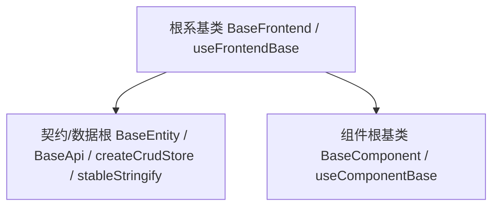

# 组件设计 · 根系基类

> BaseFrontend · useFrontendBase（一切前端基类之根）

[文档首页](../../../../../文档首页.md) › [项目规划说明](../../../../../规划/项目规划说明.md) › [组件设计](../../../01_组件设计_总览.md) › 根系基类　|　[← 组件设计总览](../../../01_组件设计_总览.md)　[组件根基类 →](../../01_机制基类/02_组件设计_组件根基类/02_组件设计_组件根基类.md)

> 可交互原型：[01_原型设计_根系基类.html](01_原型设计_根系基类.html)（演示通用字段/方法：命名空间、日志、错误上报、配置/环境读取、i18n、生命周期钩子，以及数据/契约基类与 UI 组件基类并列继承 根系）

## 1. 目的与适用范围 

定义 BMS 前端 `frontend/`（`frontend-mobile/` 同款）**根系基类**的组件设计：抽象类 `BaseFrontend` 与组合式 `useFrontendBase`，为**一切前端基类**（数据/契约基类 `BaseApi`/`createCrudStore` 与 UI 组件基类 `BaseComponent` 等）提供**通用字段与通用方法**。它是组件设计体系 **根系**，与后端「基础类」体系对齐，分层权威见[《前端开发规范》](../../../../../规范/前端开发规范.md)第 3 节「前端基类体系（开放式）」。

### 1.1 定位与分层 

| 职责 | 归属 |
| --- | --- |
| 所有基类共有的通用字段/方法（日志、错误上报、配置/环境、i18n 取词、生命周期钩子） | **本节点（根系）** |
| 数据/契约基类（响应类型、请求、CRUD store、稳定序列化） | [《前端开发规范》](../../../../../规范/前端开发规范.md) 契约/数据根 + 项目骨架《前端基础类》 |
| UI 组件公共能力（透传、尺寸/密度/主题、i18n、可访问性、loading/disabled…） | [组件根基类](../../01_机制基类/02_组件设计_组件根基类/02_组件设计_组件根基类.md) |
| 形态/受控值/字段/域基类 | 能力片段、能力片段（值 / 字段链）、域基类（各节点详见总览路线图） |

上游依据：[《前端开发规范》](../../../../../规范/前端开发规范.md)（§3 分层权威、依赖方向与扩展规则）、[《架构设计 · 前端架构》](../../../../架构设计/08_架构设计_前端架构.md)（组件分层与目录）。

> 本篇为 **基础组件类 · 根系**。**范围边界**：根系 只放"所有基类共有"的横切能力；数据/UI 特有逻辑不得上提 根系；具体能力见各上层节点。

## 2. 组件清单与职责 

| 组件 / 工具 | 位置 | 职责 |
| --- | --- | --- |
| `BaseFrontend` | `src/base/BaseFrontend.ts` | 抽象类：通用字段（命名空间 `ns`、实例标识）与通用方法（日志、错误上报、配置/环境读取、i18n、生命周期钩子） |
| `useFrontendBase.ts` | `src/base/useFrontendBase.ts` | 组合式：为组合式基类提供与 `BaseFrontend` 等价的通用能力（Vue 以组合式模拟继承） |
| `BaseFrontend.vue` | `src/base/BaseFrontend.vue` | 可选组件包装：以根系组合式装配，经默认插槽向子树下发根系能力，并绑定组件生命周期钩子（`created` / `disposed`） |

- 命名遵循[《命名规范》](../../../../../规范/命名规范.md)；目录遵循[《前端开发规范》](../../../../../规范/前端开发规范.md)（根系 归 `src/base/`）。

## 3. 契约（Props 与能力） 

| 通用字段 | 类型 | 说明 |
| --- | --- | --- |
| `ns` | string | 命名空间（用于日志前缀、样式前缀、埋点域） |
| `identifier` | string | 实例/组件标识（用于日志与错误上报定位） |
| `env` | 'dev' \| 'test' \| 'prod' | 运行环境（由配置读取） |
| `config` | Readonly\<Record\<string, any\>\> | 只读配置视图（按命名空间隔离） |

| 通用方法 | 签名 | 说明 |
| --- | --- | --- |
| `log` | (level, message, meta?) => void | 统一日志（级别、命名空间、时间戳；生产分级） |
| `reportError` | (error, meta?) => void | 统一错误上报（去重、限流；不阻断业务） |
| `getConfig` | (key, fallback?) => any | 配置/环境读取（含默认值） |
| `t` | (key, params?) => string | i18n 取词（委托 vue-i18n） |
| `onBaseCreated` / `onBaseDisposed` | hook | 生命周期钩子（供子类扩展） |

- 事件/钩子：子类通过覆写钩子接入，不直接改 根系 行为；组合式通过返回值接入。

## 4. 继承与实现约定 

| 项 | 设计 |
| --- | --- |
| 派生关系 | `BaseApi`/`createCrudStore`（契约/数据根）与 `BaseComponent`（组件根）均继承/组合 `BaseFrontend`/`useFrontendBase` |
| 模拟继承 | Vue 3 无类多继承：组合式组件用 `useFrontendBase()`，非组件类可 `extends BaseFrontend`；二者能力等价 |
| 依赖方向 | 根系 只被上层依赖，**不得依赖任何上层**；不得引用 UI、store、业务 |
| 横切边界 | 只有"所有基类共有"的能力才进 根系；单侧（数据或 UI）特有逻辑不得上提 |
| 扩展 | 出现新的"所有基类共有"能力时增补 根系；出现"某一侧共有"能力时增补对应组件根基类 |
| 双端同款 | frontend 与 frontend-mobile 同步实现 |

## 5. 场景集成 

| 场景 | 说明 |
| --- | --- |
| 数据/契约基类 | `BaseApi` 等在构造时接入 `useFrontendBase` 的日志/错误上报/配置 |
| UI 组件基类 | `BaseComponent` 继承 根系，再向 能力片段_能力片段/能力片段_能力片段（值 / 字段链）/域基类 传递通用能力 |
| 具体组件 | 通过继承链获得日志/配置/i18n，不各自实现 |

## 6. 依赖接口与上游变更 

### 6.1 上游接口与口径 

| 项 | 说明 | 目标文档 |
| --- | --- | --- |
| 分层权威 | 开放式基类体系 体系、依赖方向、扩展规则 | [《前端开发规范》](../../../../../规范/前端开发规范.md) 第 3 节（登记项①） |
| 组件分层 | `src/base` 目录与继承链登记 | [《架构设计 · 前端架构》](../../../../架构设计/08_架构设计_前端架构.md)（登记项②） |
| 配置/环境 | 环境与配置来源 | [《概要设计 · 系统参数》](../../../../概要设计/10_概要设计_系统参数.md)（登记项③） |
| 日志/错误上报 | 前端日志与错误上报口径 | [《前端开发规范》](../../../../../规范/前端开发规范.md)、[《日志规范》](../../../../../规范/日志规范.md) |
| 新增依赖 | **无** | — |

### 6.2 需登记的上游变更 

| 变更点 | 目标文档 | 内容 |
| --- | --- | --- |
| ① 前端基础类分层 | [《前端开发规范》](../../../../../规范/前端开发规范.md) 第 3 节 | 根系基类提供通用字段/方法（命名空间、日志、错误上报、配置/环境、i18n、生命周期钩子）；数据/契约基类与 UI 基类并列继承 根系（本节点为组件侧契约落地） |
| ② 组件分层与目录 | [《架构设计 · 前端架构》](../../../../架构设计/08_架构设计_前端架构.md)「组件分层」节 | 新增 `src/base`…`l4` 与 `src/components/base/` 目录约定；登记继承链与依赖方向 |
| ③ 前端配置与环境 | [《概要设计 · 系统参数》](../../../../概要设计/10_概要设计_系统参数.md)「前端配置」节 | 明确前端可读配置/环境来源（构建期与运行期），供 `getConfig`/`env` 消费 |

> 按[《文档生成规范》](../../../../../规范/文档生成规范.md)「引用与追溯」节，上述变更需用户确认后由上游文档同步。
>
> **开放项（2026-09-16 登记，未决、不立归口，需要时按「新增片段 / 兼容变更」流程另开）**：① `dispose()` 后是否停止日志与上报（当前行为：不停止，仅释放订阅与登记资源）；② `getConfig` 是否支持点分键（当前行为：只支持扁平键，构建期 `VITE_*` 已归一为扁平键）。

## 7. 权限 / i18n / 移动端 

- **权限**：根系 不含权限判定（字段权限见 [字段权限片段](../../02_能力片段/11_组件设计_字段权限片段/11_组件设计_字段权限片段.md)，动作权限见 [基础类「权限指令」](../../../09_基础类/02_组件设计_权限指令/02_组件设计_权限指令.md)）。
- **i18n**：`t` 委托 vue-i18n，不硬编码文案。
- **移动端**：独立工程，根系 能力同款实现。

## 8. 性能与边界 

| 场景 | 设计 |
| --- | --- |
| 开销 | 根系 无 DOM、无响应式，纯能力集合；`log`/`reportError` 生产分级与限流 |
| 边界 | 配置缺失（回退默认）、环境判断错误、日志风暴、错误上报重复、i18n 未就绪、命名空间冲突 |
| 不支持 | 数据/契约基类（契约/数据根）、UI 能力（组件根）、形态/值/字段/域基类（能力片段-域基类）、权限判定 |

## 9. 检查清单 

- □ 通用字段：`ns`/`identifier`/`env`/`config`；通用方法：`log`/`reportError`/`getConfig`/`t`/生命周期钩子
- □ 派生：契约/数据根 与 组件根 均继承；依赖方向单向（根系 不依赖上层）
- □ 只放共有能力，不掺 UI/业务/权限
- □ 模拟继承（组合式 + 类）能力等价；双端同款
- □ 权限/i18n/移动端符合第 7 节；性能边界符合第 8 节
- □ 三项上游登记已确认：前端基础类分层、组件分层与目录、前端配置与环境

> 组件设计节点（根系）· 与[《前端开发规范》](../../../../../规范/前端开发规范.md)[《架构设计 · 前端架构》](../../../../架构设计/08_架构设计_前端架构.md)[《概要设计 · 系统参数》](../../../../概要设计/10_概要设计_系统参数.md)[《日志规范》](../../../../../规范/日志规范.md)[组件根基类](../../01_机制基类/02_组件设计_组件根基类/02_组件设计_组件根基类.md)《命名规范》配套
