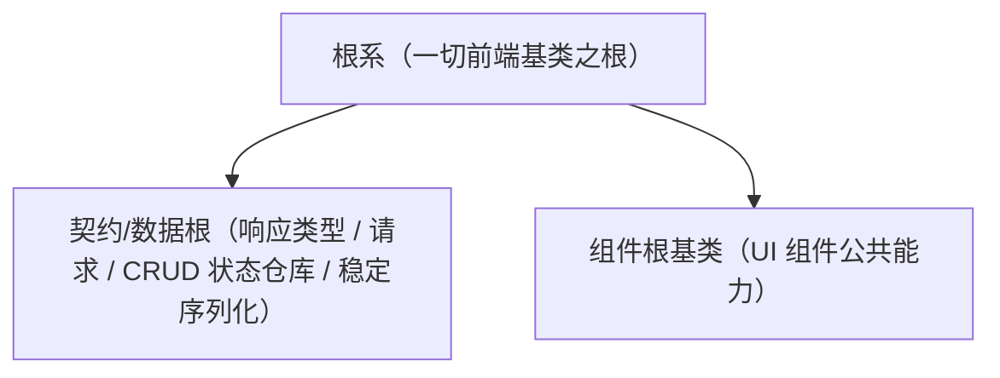

# 组件设计 · 根系基类

> 一切前端基类之根：通用字段（命名空间、实例标识、运行环境、只读配置）与通用方法（日志、错误上报、配置读取、i18n 取词、生命周期钩子）
> 实现侧命名与落点见《[前端基类清单](../../../../../前端基类清单.md)》（「根系 根基类」节），实现契约细节见项目详细设计。

[文档首页](../../../../../文档首页.md) › [项目规划说明](../../../../../规划/项目规划说明.md) › [组件设计](../../../01_组件设计_总览.md) › 根系基类　|　[← 组件设计总览](../../../01_组件设计_总览.md)　[组件根基类 →](../../01_机制基类/02_组件设计_组件根基类/02_组件设计_组件根基类.md)

> 可交互原型：[01_原型设计_根系基类.html](01_原型设计_根系基类.html)（演示通用字段/方法：命名空间、日志、错误上报、配置/环境读取、i18n、生命周期钩子，以及契约/数据根与组件根并列继承根系）

## 1. 目的与适用范围 

定义 BMS 前端**根系基类**的组件设计：为**一切前端基类**（契约/数据根与 UI 组件根等）提供**通用字段与通用方法**。它是组件设计体系的**根系**，与后端「基础类」体系对齐，分层权威见[《前端开发规范》](../../../../../规范/前端开发规范.md)第 3 节「前端基类体系（开放式）」。

### 1.1 定位与分层 

| 职责 | 归属 |
| --- | --- |
| 所有基类共有的通用字段/方法（日志、错误上报、配置/环境、i18n 取词、生命周期钩子） | **本节点（根系）** |
| 契约/数据根（响应类型、请求、CRUD 状态仓库、稳定序列化） | [《前端开发规范》](../../../../../规范/前端开发规范.md) 契约/数据根 + 宿主实现（落点与状态见《[前端基类清单](../../../../../前端基类清单.md)》） |
| UI 组件公共能力（透传、尺寸/密度/主题、i18n、可访问性、加载/禁用…） | [组件根基类](../../01_机制基类/02_组件设计_组件根基类/02_组件设计_组件根基类.md) |
| 形态/受控值/字段/域语义 | 能力与域基类节点（详见[总览](../../../01_组件设计_总览.md)路线图） |

上游依据：[《前端开发规范》](../../../../../规范/前端开发规范.md)（§3 分层权威、依赖方向与扩展规则）、[《架构设计 · 前端架构》](../../../../架构设计/08_架构设计_前端架构.md)（组件分层与目录）。

> 本篇为 **基础组件类 · 根系**。**范围边界**：根系只放"所有基类共有"的横切能力；数据/UI 特有逻辑不得上提根系；具体能力见各上层节点。

## 2. 职责与组成 

| 组成部分 | 职责 |
| --- | --- |
| 根系核心 | 通用字段与通用方法（纯逻辑、框架无关） |
| 响应式投影（按需） | 核心实例与 Vue 响应式的桥接，提供等价的响应式入口；投影只做桥接，不重复实现 |
| 模板包装件（按需） | 模板层的包装形态，按需评估 |

## 3. 交互与契约语义 

| 语义项 | 说明 |
| --- | --- |
| 命名空间与实例标识 | 用于日志前缀、样式前缀、埋点域与错误上报定位 |
| 运行环境与配置 | 只读配置视图（按命名空间隔离）；配置缺失回退默认值 |
| 日志 | 统一日志（级别、命名空间、时间戳；生产分级） |
| 错误上报 | 统一上报（去重、限流；不阻断业务） |
| i18n 取词 | 委托全局语言能力（支持参数），不硬编码文案 |
| 生命周期钩子 | 创建/销毁钩子供子类扩展；子类通过覆写钩子接入，不直接改根系行为 |

## 4. 继承与分层关系 

| 项 | 设计 |
| --- | --- |
| 派生关系 | 契约/数据根与组件根均继承根系；组件侧经响应式投影取得等价能力 |
| 双入口等价 | 核心实现与投影能力等价；投影只做「核心实例 ↔ Vue 响应式」桥接，不重复实现 |
| 依赖方向 | 根系只被上层依赖，**不得依赖任何上层**；不得引用 UI、状态、业务 |
| 横切边界 | 只有"所有基类共有"的能力才进根系；单侧（数据或 UI）特有逻辑不得上提 |
| 扩展 | 出现新的"所有基类共有"能力时增补根系；出现"某一侧共有"能力时增补对应根 |
| 多实现一致 | PC 与移动端按同一契约多实现，由同一套契约断言保障 |

## 5. 场景集成 

| 场景 | 说明 |
| --- | --- |
| 契约/数据根 | 继承根系，取得日志/错误上报/配置读取 |
| UI 组件根 | 继承根系，再向能力与域基类传递通用能力 |
| 具体组件 | 通过继承链获得日志/配置/i18n，不各自实现 |

## 6. 依赖接口与上游变更 

### 6.1 上游接口与口径 

| 项 | 说明 | 目标文档 |
| --- | --- | --- |
| 分层权威 | 开放式基类体系、依赖方向、扩展规则 | [《前端开发规范》](../../../../../规范/前端开发规范.md) 第 3 节（登记项①） |
| 组件分层 | 核心 / 投影 / 渲染插件 / 宿主分层与继承链登记 | [《架构设计 · 前端架构》](../../../../架构设计/08_架构设计_前端架构.md)（登记项②） |
| 配置/环境 | 环境与配置来源 | [《概要设计 · 系统参数》](../../../../概要设计/10_概要设计_系统参数.md)（登记项③） |
| 日志/错误上报 | 前端日志与错误上报口径 | [《前端开发规范》](../../../../../规范/前端开发规范.md)、[《日志规范》](../../../../../规范/日志规范.md) |
| 新增依赖 | **无** | — |

### 6.2 需登记的上游变更 

| 变更点 | 目标文档 | 内容 |
| --- | --- | --- |
| ① 前端基础类分层 | [《前端开发规范》](../../../../../规范/前端开发规范.md) 第 3 节 | 根系提供通用字段/方法（命名空间、日志、错误上报、配置/环境、i18n、生命周期钩子）；契约/数据根与 UI 组件根并列继承根系（本节点为组件侧设计落地） |
| ② 组件分层与目录 | [《架构设计 · 前端架构》](../../../../架构设计/08_架构设计_前端架构.md)「组件体系（基类体系与目录登记）」节 | 登记核心 / 投影 / 渲染插件 / 宿主四层落点（新体系），继承链与依赖方向以《[前端基类清单](../../../../../前端基类清单.md)》为准 |
| ③ 前端配置与环境 | [《概要设计 · 系统参数》](../../../../概要设计/10_概要设计_系统参数.md)「前端配置」节 | 明确前端可读配置/环境来源（构建期与运行期），供配置读取与环境判断消费 |

> 按[《文档生成规范》](../../../../../规范/文档生成规范.md)「引用与追溯」节，上述变更需用户确认后由上游文档同步。

## 7. 权限 / i18n / 移动端 

- **权限**：根系不含权限判定（字段权限见[字段权限能力](../../02_能力类/11_组件设计_字段权限能力/11_组件设计_字段权限能力.md)，动作权限见[基础类「权限指令」](../../../09_基础类/02_组件设计_权限指令/02_组件设计_权限指令.md)）。
- **i18n**：取词委托全局语言能力，不硬编码文案。
- **移动端**：PC 与移动端按同一契约多实现（同一套契约断言保障）。

## 8. 性能与边界 

| 场景 | 设计 |
| --- | --- |
| 开销 | 根系无渲染开销，纯能力集合；日志与上报分级、限流 |
| 边界 | 配置缺失（回退默认）、环境判断错误、日志风暴、错误上报重复、i18n 未就绪、命名空间冲突 |
| 不支持 | 契约/数据根、UI 组件公共能力（组件根）、形态/受控值/字段/域语义、权限判定 |

## 9. 检查清单 

- □ 通用字段与通用方法齐备：命名空间/实例标识/运行环境/配置；日志/错误上报/配置读取/i18n 取词/生命周期钩子
- □ 派生：契约/数据根与组件根均继承根系；依赖方向单向（根系不依赖上层）
- □ 只放共有能力，不掺 UI/业务/权限
- □ 核心实现与响应式投影能力等价；PC 与移动端同一契约多实现
- □ 权限/i18n/移动端符合第 7 节；性能边界符合第 8 节
- □ 三项上游登记已确认：前端基础类分层、组件分层与目录、前端配置与环境

> 组件设计节点（根系）· 与[《前端开发规范》](../../../../../规范/前端开发规范.md)[《架构设计 · 前端架构》](../../../../架构设计/08_架构设计_前端架构.md)[《概要设计 · 系统参数》](../../../../概要设计/10_概要设计_系统参数.md)[《日志规范》](../../../../../规范/日志规范.md)[组件根基类](../../01_机制基类/02_组件设计_组件根基类/02_组件设计_组件根基类.md)《命名规范》配套
