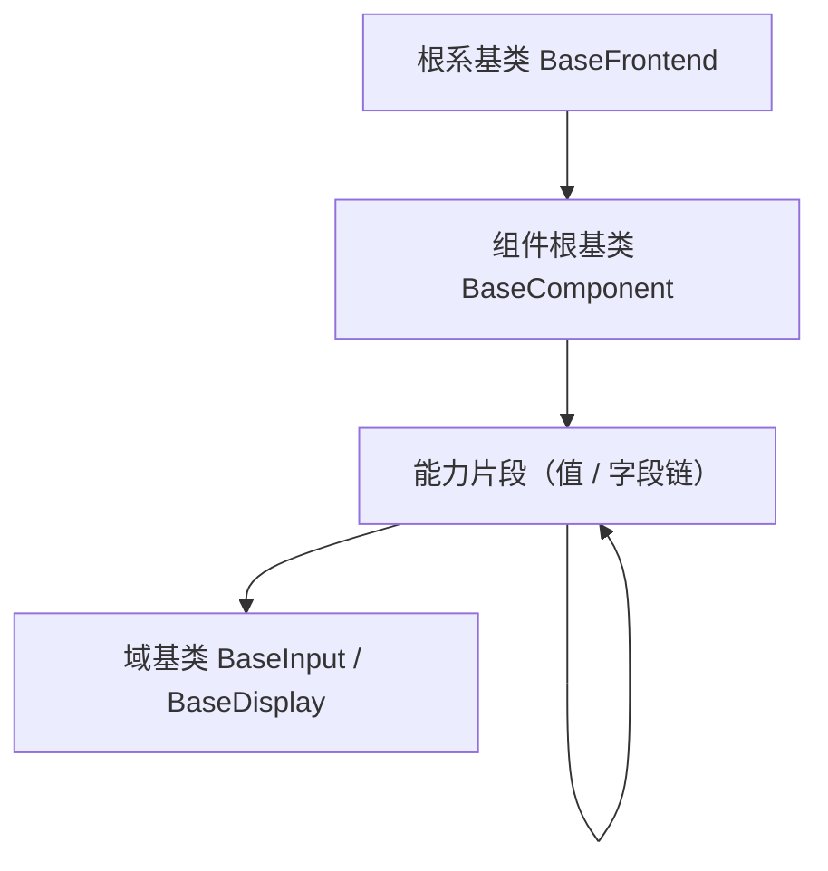

# 组件设计 · 组件根基类

> BaseComponent · useComponentBase（所有 UI 组件通用）

[文档首页](../../../../../文档首页.md) › [项目规划说明](../../../../../规划/项目规划说明.md) › [组件设计](../../../01_组件设计_总览.md) › 组件根基类　|　[← 根系基类](../../01_机制基类/01_组件设计_根系基类/01_组件设计_根系基类.md)　[片段机制 →](../03_组件设计_片段机制/03_组件设计_片段机制.md)

> 可交互原型：[02_原型设计_组件根基类.html](02_原型设计_组件根基类.html)（演示 attrs 透传与根元素、尺寸/密度/主题令牌、i18n 与命名空间、生命周期埋点、可访问性与 expose、通用 loading/disabled/显隐）

## 1. 目的与适用范围 

定义 BMS 前端 `apps/desktop/`（`frontend-mobile/` 同款）**组件根基类**的组件设计：抽象类 `BaseComponent` 与组合式 `useComponentBase`，为**所有 UI 组件**（03 基础控件、字段类、展示类、交互类）提供公共能力——attrs 透传与根元素约定、尺寸/密度/主题令牌、i18n 与命名空间、生命周期与埋点、可访问性与 `expose`、通用 `loading`/`disabled`/显隐。它是组件设计体系 **组件根 层**，继承 [根系基类](../../01_机制基类/01_组件设计_根系基类/01_组件设计_根系基类.md)。

### 1.1 定位与分层 

| 职责 | 归属 |
| --- | --- |
| 所有 UI 组件通用：透传与根元素、尺寸/密度/主题、i18n/命名空间、生命周期埋点、可访问性与 expose、loading/disabled/显隐 | **本节点（组件根）** |
| 通用字段/方法（日志、错误上报、配置/环境、i18n 取词、生命周期钩子） | [根系基类](../../01_机制基类/01_组件设计_根系基类/01_组件设计_根系基类.md) |
| 形态差异（交互/输入/展示/容器/表单容器/媒体/布局/布局） | 能力片段 各能力片段 |
| 值语义、字段语义 | 能力片段 受控值/字段编排片段 |

上游依据：[《前端开发规范》](../../../../../规范/前端开发规范.md)（§3 分层权威、§5 Vue 组件规范、样式命名空间）、[《架构设计 · 前端架构》](../../../../架构设计/08_架构设计_前端架构.md)（组件分层）、[《布局设计 · 设计令牌》](../../../../布局设计/02_布局设计_设计令牌.html)（尺寸/密度/主题令牌，展示只消费）。

> 本篇为 **基础组件类 · 组件根 层**。**范围边界**：通用字段/方法归 根系；形态归 能力片段；值/字段语义归 能力片段（`useValue`/`useField`）；域细化归 域基类。

## 2. 组件清单与职责 

| 组件 / 工具 | 位置 | 职责 |
| --- | --- | --- |
| `BaseComponent` | `src/base/BaseComponent.ts` | 抽象类：通用 props、根元素与 attrs 透传、尺寸/密度/主题、i18n/命名空间、生命周期埋点、可访问性、`expose` 规范 |
| `useComponentBase.ts` | `src/base/useComponentBase.ts` | 组合式：等价能力，供 `<script setup>` 组件使用（取值优先级：props 提供的键 > 运行期更新 > 构造默认值） |
| `BaseComponent.vue` | `src/base/BaseComponent.vue` | 可选组件包装：单根元素 + attrs 透传合并，经默认插槽下发 `{ base }`，事件 `base-mounted` / `base-unmounted` |

- 命名遵循[《命名规范》](../../../../../规范/命名规范.md)；目录遵循[《前端开发规范》](../../../../../规范/前端开发规范.md)（`src/base/`）。

## 3. 契约（通用 Props 与能力） 

| 属性 | 类型 | 默认 | 说明 |
| --- | --- | --- | --- |
| `size` | 'small' \| 'default' \| 'large' | 'default' | 尺寸（映射设计令牌） |
| `density` | 'compact' \| 'default' \| 'loose' | 继承 | 密度（表格/表单/用户偏好） |
| `ns` | string | '' | 命名空间（样式前缀、埋点域；缺省取应用级） |
| `loading` | boolean | false | 通用加载态（展示 loading 或禁用交互，按组件语义） |
| `disabled` | boolean | false | 通用禁用态 |
| `visible` | boolean | true | 通用显隐（`false` 时不渲染） |
| `dataTest` | string | '' | 测试标识（渲染为 `data-test`） |

| 能力 | 说明 |
| --- | --- |
| attrs 透传 | 未声明属性/事件透传根元素（`id`/`class`/`style`/`data-*`）；约定**单根元素** |
| 主题令牌 | 颜色/尺寸/间距只消费设计令牌，随亮暗与租户品牌自动适配（[交互类「主题与品牌化」](../../../08_交互类/17_组件设计_主题与品牌化/17_组件设计_主题与品牌化.md)） |
| 命名空间/样式前缀 | class 前缀由 `ns` 派生（如 `bms-`），避免全局污染 |
| i18n | 通过 根系 `t` 取词，组件不硬编码文案 |
| 生命周期与埋点 | `onMounted`/`onUnmounted` 统一埋点钩子（曝光/点击按需） |
| 可访问性 | 根元素 `aria-*`、角色与键盘焦点基础约定（可交互组件由 交互片段 细化） |
| `expose` 规范 | 统一通过 `defineExpose` 暴露公共方法（如 `focus`/`blur`/`validate`，按组件而定）；组件包装暴露 `{ base, mechanisms, setProps }` |
| 令牌属性协议 | 档位只写根元素属性 `data-size` / `data-density`（未设 `density` 不写，表示继承），测试标识写 `data-test`；可访问性基础 `aria-disabled`（禁用）/ `aria-busy`（加载）与状态类 `is-loading` / `is-disabled` 统一由组件根产出；视觉由 `src/styles/tokens.scss` 的属性选择器映射（组件只消费 `--bms-size-*` / `--bms-density-*`） |
| 机制装配点 | `mechanisms`：机制基类（占位 / 异步资源 / 订阅）经 `attach` 挂接、`detach` 脱离；组件根 `dispose()` 逆序**释放联动**（取消订阅 / 释放资源）；脱离组件根独立使用时开发态告警（不阻断） |

- 事件：`base-mounted`/`base-unmounted`（可选）供埋点；具体组件事件另定义。

## 4. 继承与实现约定 

| 项 | 设计 |
| --- | --- |
| 派生 | 能力片段 七能力片段继承 组件根；能力片段_能力片段（值 / 字段链）/域基类 经 能力片段 间接继承 |
| 模拟继承 | 组合式 `useComponentBase()` + 组件包装；单根元素 + `inheritAttrs` |
| 依赖方向 | 只依赖 根系；不得依赖 能力片段-域基类 或具体组件 |
| 令牌消费 | 不得硬编码色值/尺寸；密度/尺寸走令牌，主题切换自动生效 |
| 双端同款 | apps/desktop 与 frontend-mobile 同步 |

## 5. 场景集成 

| 场景 | 说明 |
| --- | --- |
| 所有 UI 组件 | 通过 能力片段-域基类 继承链获得透传/尺寸/主题/i18n/可访问性 |
| 主题与品牌化 | 令牌消费使所有组件随主题/品牌变化 |
| 埋点与测试 | 生命周期钩子与 `data-test` 支撑埋点与自动化测试 |

## 6. 依赖接口与上游变更 

### 6.1 上游接口与口径 

| 项 | 说明 | 目标文档 |
| --- | --- | --- |
| 分层权威 | 组件根 职责与继承约定 | [《前端开发规范》](../../../../../规范/前端开发规范.md) 第 3 节（登记项①） |
| 组件分层 | `src/base` 目录与继承链 | [《架构设计 · 前端架构》](../../../../架构设计/08_架构设计_前端架构.md)（登记项②） |
| 设计令牌 | 尺寸/密度/主题令牌 | [《布局设计 · 设计令牌》](../../../../布局设计/02_布局设计_设计令牌.html)（登记项③） |
| i18n | 取词委托 | [交互类「国际化文案编辑器」](../../../08_交互类/11_组件设计_国际化文案编辑器/11_组件设计_国际化文案编辑器.md) |
| 新增依赖 | **无** | — |

### 6.2 需登记的上游变更 

| 变更点 | 目标文档 | 内容 |
| --- | --- | --- |
| ① 组件根基类契约 | [《前端开发规范》](../../../../../规范/前端开发规范.md) 第 3 节 | 组件根 通用 props（`size`/`density`/`ns`/`loading`/`disabled`/`visible`/`dataTest`）、attrs 透传与单根元素、命名空间/样式前缀、可访问性与 `expose` 规范（本节点为组件侧契约落地） |
| ② 组件分层与目录 | [《架构设计 · 前端架构》](../../../../架构设计/08_架构设计_前端架构.md)「组件分层」节 | 登记 `src/base`…`l4`、`src/components/base/` 目录与 组件根→能力片段→能力片段→域基类 继承链、依赖方向 |
| ③ 尺寸与密度令牌 | [《布局设计 · 设计令牌》](../../../../布局设计/02_布局设计_设计令牌.html)「组件令牌」节 | 明确 `size`（small/default/large）与 `density`（compact/default/loose）令牌映射；组件只消费令牌 |

> 按[《文档生成规范》](../../../../../规范/文档生成规范.md)「引用与追溯」节，上述变更需用户确认后由上游文档同步。

## 7. 权限 / i18n / 移动端 

- **权限**：不做权限判定；字段权限见 [字段权限片段](../../02_能力片段/11_组件设计_字段权限片段/11_组件设计_字段权限片段.md)，动作权限见 [基础类「权限指令」](../../../09_基础类/02_组件设计_权限指令/02_组件设计_权限指令.md)。
- **i18n**：统一经 根系 `t`；不硬编码。
- **移动端**：独立工程，能力同款。

## 8. 性能与边界 

| 场景 | 设计 |
| --- | --- |
| 渲染 | 基类薄；透传不产生额外包裹元素（单根） |
| 埋点 | 生命周期钩子按需启用，生产可关闭细粒度埋点 |
| 边界 | 多根元素透传冲突、attrs 与声明 props 冲突、命名空间缺失回退应用级、主题令牌缺失回退、密度上下文缺失、`visible=false` 与 v-show 混淆、expose 未声明 |
| 不支持 | 通用字段/方法（根系）、形态差异（能力片段）、值/字段语义（能力片段）、域细化（域基类）、权限判定 |

## 9. 检查清单 

- □ 通用 props：`size`/`density`/`ns`/`loading`/`disabled`/`visible`/`dataTest`
- □ attrs 透传与单根元素；命名空间/样式前缀；令牌消费（不硬编码色值/尺寸）
- □ i18n 经 根系；生命周期埋点与 `data-test`；可访问性与 `expose` 规范
- □ 继承 根系、被 能力片段 继承，依赖方向单向；双端同款
- □ 权限/i18n/移动端符合第 7 节；性能边界符合第 8 节
- □ 三项上游登记已确认：组件根基类契约、组件分层与目录、尺寸与密度令牌

> 组件设计节点（组件根 层）· 与[《前端开发规范》](../../../../../规范/前端开发规范.md)[《架构设计 · 前端架构》](../../../../架构设计/08_架构设计_前端架构.md)[《布局设计 · 设计令牌》](../../../../布局设计/02_布局设计_设计令牌.html)[根系基类](../../01_机制基类/01_组件设计_根系基类/01_组件设计_根系基类.md)[交互片段](../../02_能力片段/01_组件设计_交互片段/01_组件设计_交互片段.md)[交互类「主题与品牌化」](../../../08_交互类/17_组件设计_主题与品牌化/17_组件设计_主题与品牌化.md)[交互类「国际化文案编辑器」](../../../08_交互类/11_组件设计_国际化文案编辑器/11_组件设计_国际化文案编辑器.md)《命名规范》配套
