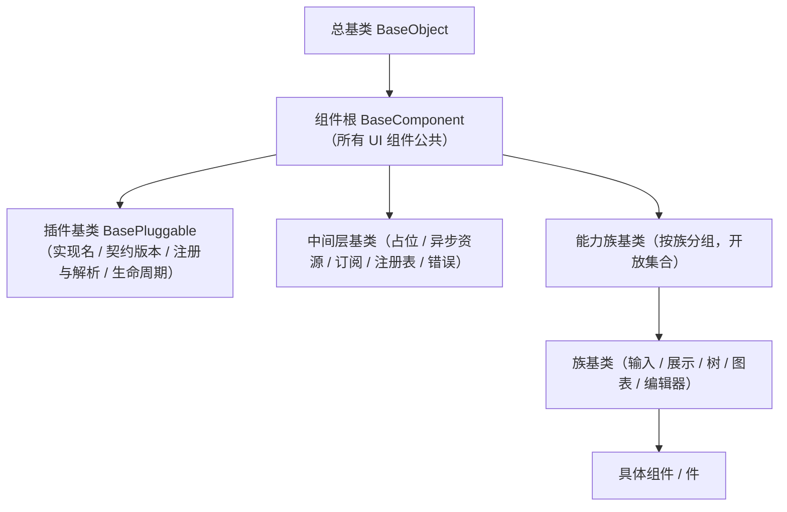

# 组件设计 · 组件根基类

> 所有 UI 组件通用之根：透传与根元素约定 / 尺寸·密度·主题令牌 / i18n 与命名空间 / 生命周期与埋点 / 可访问性与对外暴露 / 通用加载·禁用·显隐
> 实现侧命名与落点见《[前端基类清单](../../../../../前端基类清单.md)》（「组件根」节），实现契约细节见项目详细设计。

[文档首页](../../../../../文档首页.md) › [项目规划说明](../../../../../规划/项目规划说明.md) › [组件设计](../../../01_组件设计_总览.md) › 组件根基类　|　[← 总基类](../../01_机制基类/01_组件设计_根系基类/01_组件设计_根系基类.md)　[能力机制 →](../03_组件设计_能力机制/03_组件设计_能力机制.md)

> 可交互原型：[02_原型设计_组件根基类.html](02_原型设计_组件根基类.html)（演示未声明属性透传与根元素、尺寸/密度/主题令牌、i18n 与命名空间、生命周期埋点、可访问性与对外暴露、通用加载/禁用/显隐）

## 1. 目的与适用范围 

定义 BMS 前端**组件根基类**的组件设计：为**所有 UI 组件**（基础控件、字段、展示、交互类）提供公共能力——透传与根元素约定、尺寸/密度/主题令牌、i18n 与命名空间、生命周期与埋点、可访问性与对外暴露、通用加载/禁用/显隐。它是继承链上的 **组件根 `BaseComponent`**（所有 UI 组件的公共协议），继承**总基类 `BaseObject`**；父基类与继承链见《[前端基类清单](../../../../../前端基类清单.md)》（**全系统唯一一份**）。

### 1.1 定位与分层 

| 职责 | 归属 |
| --- | --- |
| 所有 UI 组件通用：透传与根元素、尺寸/密度/主题、i18n/命名空间、生命周期埋点、可访问性与对外暴露、加载/禁用/显隐 | **本节点（组件根）** |
| 通用字段 / 方法（日志、错误上报、配置 / 环境、i18n 取词、生命周期钩子） | [总基类](../../01_机制基类/01_组件设计_根系基类/01_组件设计_根系基类.md)（`BaseObject`） |
| 形态差异（交互 / 输入 / 展示 / 容器 / 表单容器 / 媒体 / 布局 / 令牌） | 能力族基类各节点 |
| 值语义、字段语义 | 能力族基类各节点（值族 / 字段族） |
| 族细化（输入 / 展示 / 树 …） | [族基类](../../03_域基类/01_组件设计_输入域基类/01_组件设计_输入域基类.md)（能力族基类的一类，作为族内派生起点） |

上游依据：[《前端开发规范》](../../../../../规范/前端开发规范.md)（§1 架构铁律、§3 分层权威、依赖方向与扩展规则、样式命名空间）、[《架构设计 · 前端架构》](../../../../架构设计/08_架构设计_前端架构.md)（组件分层）、[《布局设计 · 设计令牌》](../../../../布局设计/02_布局设计_设计令牌.html)（尺寸/密度/主题令牌，展示只消费）。

> 本篇为 **基础组件类 · 组件根**。**范围边界**：通用字段 / 方法归总基类；形态 / 值 / 字段语义归能力族基类；族细化归族基类；继承关系以《[前端基类清单](../../../../../前端基类清单.md)》§2.1 为准。

## 2. 职责与组成 

| 组成部分 | 职责 |
| --- | --- |
| 组件根核心 | 通用契约、根元素协议与未声明属性透传、尺寸/密度/令牌、生命周期通知、机制装配点 |
| 响应式投影（按需） | 核心实例与响应式框架的桥接，提供等价入口；投影只做桥接，不重复实现 |
| 模板包装件（按需） | 模板层的包装形态，按需评估 |
| 机制装配点 | 中间层基类经装配点挂接 / 脱离；组件根释放时逆序**释放联动**（取消订阅 / 释放资源）；脱离组件根独立使用时开发态告警（不阻断） |

## 3. 交互与契约语义 

| 语义项 | 说明 |
| --- | --- |
| 尺寸 | small / default / large 三档（映射设计令牌；缺省 default） |
| 密度 | compact / default / loose 三档（表格/表单/用户偏好；未设时继承上下文） |
| 命名空间与样式前缀 | 类名前缀、埋点域与错误上报定位按命名空间派生（缺省取应用级），避免全局污染 |
| 加载 | 通用加载态（展示加载或禁用交互，按组件语义） |
| 禁用 | 通用禁用态 |
| 显隐 | 关闭时不渲染 |
| 测试标识 | 渲染为测试定位标识 |
| 未声明属性透传 | id / class / style / data-* 等透传根元素；约定**单根元素** |
| 主题令牌 | 颜色/尺寸/间距只消费设计令牌，随亮暗与租户品牌自动适配（[交互类「主题与品牌化」](../../../08_交互类/17_组件设计_主题与品牌化/17_组件设计_主题与品牌化.md)） |
| i18n | 通过总基类取词，组件不硬编码文案 |
| 生命周期与埋点 | 挂载/卸载统一埋点钩子（曝光/点击按需） |
| 可访问性 | 根元素可访问性属性、角色与键盘焦点基础约定（可交互组件由 交互能力 细化） |
| 对外暴露 | 统一暴露公共方法（聚焦/失焦/校验等，按组件而定） |
| 令牌属性协议 | 档位只写根元素属性 data-size / data-density（未设密度不写，表示继承），测试标识写 data-test；禁用/加载的可访问性属性与状态类由组件根统一产出；视觉按令牌属性选择器映射，组件只消费令牌 |
| 机制装配 | 中间层基类（占位 / 异步资源 / 订阅）经装配点挂接、脱离；组件根释放时逆序释放联动；脱离组件根独立使用时开发态告警（不阻断） |
| 生命周期事件 | 挂载/卸载事件（可选）供埋点；具体组件事件另定义 |

## 4. 继承与分层关系 

| 项 | 设计 |
| --- | --- |
| 继承位置 | 组件根继承总基类；插件基类 / 中间层基类 / 能力族基类与族基类自组件根向下按需派生（**每条链长短不一，不设固定层**） |
| 派生关系 | 中间层基类供其下位复用；能力族基类（开放集合）按族在链上派生并经继承取得组件根公共职责；族基类作为族内派生起点 |
| 依赖方向 | 只依赖总基类；不得依赖能力族基类或具体组件 |
| 令牌消费 | 不得硬编码色值/尺寸；密度/尺寸走令牌，主题切换自动生效 |
| 多实现一致 | PC 与移动端按同一契约多实现（同一套契约断言保障） |
| 扩展 | 出现新的「所有 UI 组件共有」职责时增补组件根；出现横切功能 / 族语义时新增能力族基类或族基类（两条链出现公共段则提取中间层基类） |

## 5. 场景集成 

| 场景 | 说明 |
| --- | --- |
| 所有 UI 组件 | 通过继承链（组件根 + 插件基类 / 中间层基类 + 能力族基类与族基类）获得透传 / 尺寸 / 主题 / i18n / 可访问性 |
| 主题与品牌化 | 令牌消费使所有组件随主题/品牌变化 |
| 埋点与测试 | 生命周期钩子与测试标识支撑埋点与自动化测试 |

## 6. 依赖接口与上游变更 

### 6.1 上游接口与口径 

| 项 | 说明 | 目标文档 |
| --- | --- | --- |
| 分层权威 | 组件根 职责与继承约定 | [《前端开发规范》](../../../../../规范/前端开发规范.md) 第 3 节（登记项①） |
| 组件分层 | 核心 / 投影 / 渲染插件 / 宿主分层与继承链登记 | [《架构设计 · 前端架构》](../../../../架构设计/08_架构设计_前端架构.md)（登记项②） |
| 设计令牌 | 尺寸/密度/主题令牌 | [《布局设计 · 设计令牌》](../../../../布局设计/02_布局设计_设计令牌.html)（登记项③） |
| i18n | 取词委托 | [交互类「国际化文案编辑器」](../../../08_交互类/11_组件设计_国际化文案编辑器/11_组件设计_国际化文案编辑器.md) |
| 新增依赖 | **无** | — |

### 6.2 需登记的上游变更 

| 变更点 | 目标文档 | 内容 |
| --- | --- | --- |
| ① 组件根基类契约 | [《前端开发规范》](../../../../../规范/前端开发规范.md) 第 3 节 | 组件根 通用契约（尺寸/密度/命名空间/加载/禁用/显隐/测试标识）、未声明属性透传与单根元素、命名空间/样式前缀、可访问性与对外暴露规范（本节点为组件侧契约落地） |
| ② 组件分层与目录 | [《架构设计 · 前端架构》](../../../../架构设计/08_架构设计_前端架构.md)「组件体系（基类体系与目录登记）」节 | 登记组件工程分包（核心 / 投影 / 渲染插件 / 宿主）与目录；**继承关系以《[前端基类清单](../../../../../前端基类清单.md)》为唯一权威，不在此重复** |
| ③ 尺寸与密度令牌 | [《布局设计 · 设计令牌》](../../../../布局设计/02_布局设计_设计令牌.html)「组件令牌」节 | 明确 size（small/default/large）与 density（compact/default/loose）令牌映射；组件只消费令牌 |

> 按[《文档生成规范》](../../../../../规范/文档生成规范.md)「引用与追溯」节，上述变更需用户确认后由上游文档同步。

## 7. 权限 / i18n / 移动端 

- **权限**：不做权限判定；字段权限见 [字段权限能力](../../02_能力类/11_组件设计_字段权限能力/11_组件设计_字段权限能力.md)，动作权限见 [基础类「权限指令」](../../../09_基础类/02_组件设计_权限指令/02_组件设计_权限指令.md)。
- **i18n**：统一经总基类取词；不硬编码。
- **移动端**：PC 与移动端按同一契约多实现（同一套契约断言保障）。

## 8. 性能与边界 

| 场景 | 设计 |
| --- | --- |
| 渲染 | 基类薄；透传不产生额外包裹元素（单根） |
| 埋点 | 生命周期钩子按需启用，生产可关闭细粒度埋点 |
| 边界 | 多根元素透传冲突、透传与声明属性冲突、命名空间缺失回退应用级、主题令牌缺失回退、密度上下文缺失、显隐与视觉隐藏混淆、对外暴露未声明 |
| 不支持 | 通用字段 / 方法（总基类）、形态差异与值 / 字段语义（能力族基类）、族细化（族基类）、权限判定 |

## 9. 检查清单 

- □ 通用契约：尺寸/密度/命名空间/加载/禁用/显隐/测试标识
- □ 未声明属性透传与单根元素；命名空间/样式前缀；令牌消费（不硬编码色值/尺寸）
- □ i18n 经总基类；生命周期埋点与测试标识；可访问性与对外暴露规范
- □ 继承：组件根继承总基类，向插件基类 / 中间层基类 / 能力族基类传递；依赖方向单向；同一契约多实现
- □ 权限/i18n/移动端符合第 7 节；性能边界符合第 8 节
- □ 三项上游登记已确认：组件根基类契约、组件分层与目录、尺寸与密度令牌

> 组件设计节点（组件根）· 与[《前端开发规范》](../../../../../规范/前端开发规范.md)[《架构设计 · 前端架构》](../../../../架构设计/08_架构设计_前端架构.md)[《布局设计 · 设计令牌》](../../../../布局设计/02_布局设计_设计令牌.html)[总基类](../../01_机制基类/01_组件设计_根系基类/01_组件设计_根系基类.md)[交互能力](../../02_能力类/01_组件设计_交互能力/01_组件设计_交互能力.md)[交互类「主题与品牌化」](../../../08_交互类/17_组件设计_主题与品牌化/17_组件设计_主题与品牌化.md)[交互类「国际化文案编辑器」](../../../08_交互类/11_组件设计_国际化文案编辑器/11_组件设计_国际化文案编辑器.md)《命名规范》配套
