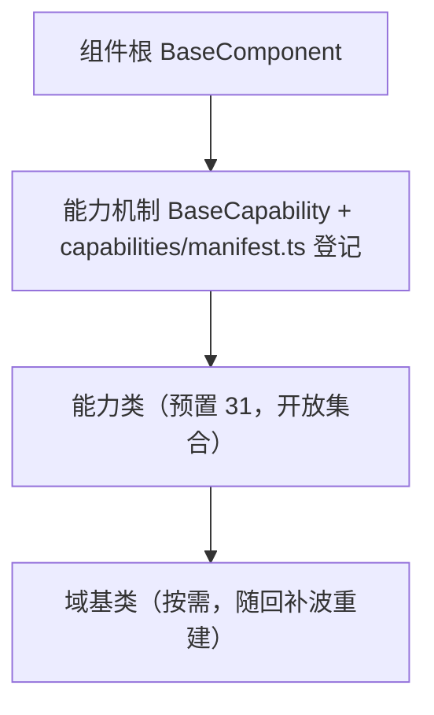

# 组件设计 · 片段机制

> BaseCapability（能力机制，原「片段机制」：能力标识 `key` / 依赖声明 / 单向依赖校验 / 开发态告警 + `capabilities/manifest.ts` 登记；核心 `frontend/packages/core/src/mechanisms/capability.ts`）

[文档首页](../../../../../文档首页.md) › [项目规划说明](../../../../../规划/项目规划说明.md) › [组件设计](../../../01_组件设计_总览.md) › 片段机制　|　[← 组件根基类](../../01_机制基类/02_组件设计_组件根基类/02_组件设计_组件根基类.md)　[占位基类 →](../04_组件设计_占位基类/04_组件设计_占位基类.md)

> 可交互原型：[03_原型设计_片段机制.html](03_原型设计_片段机制.html)（演示能力声明（`key` / `depends` / `describe`）、依赖单向校验与非法依赖的开发态告警）

## 1. 目的与适用范围 

定义 BMS 前端（核心 `frontend/packages/core` 纯 TS；渲染插件与宿主按同一契约装配）**能力机制**（原「片段机制」）的组件设计：核心类 `BaseCapability` 与能力登记表 `frontend/packages/core/src/capabilities/manifest.ts`，为**全部能力类**提供公共机制——能力标识、依赖声明、单向依赖校验、开发态告警。它是组件设计体系 **机制基类「能力机制」**，对齐后端 `BaseCapability`（能力域标识 `key`）的机制口径，继承 [组件根基类](../../01_机制基类/02_组件设计_组件根基类/02_组件设计_组件根基类.md)。

### 1.1 定位与分层 

| 职责 | 归属 |
| --- | --- |
| 能力标识、依赖声明、单向依赖校验、开发态告警、登记入口 | **本节点（能力机制）** |
| UI 通用能力（透传、尺寸/密度、可访问性、loading/disabled） | [组件根基类](../../01_机制基类/02_组件设计_组件根基类/02_组件设计_组件根基类.md) |
| 每能力的具体横切能力 | [能力类](../../02_能力片段/01_组件设计_交互片段/01_组件设计_交互片段.md) 各节点 |
| 域语义归类 | [域基类](../../03_域基类/01_组件设计_输入域基类/01_组件设计_输入域基类.md) 各节点 |

上游依据：[《前端开发规范》](../../../../../规范/前端开发规范.md)（§3.1 依赖方向、§3.2 扩展规则）、[《架构设计 · 前端组件体系》](../../../../架构设计/05_架构设计_前端组件体系.md)（组合轨默认与开放扩展）、[《架构设计 · 前端架构》](../../../../架构设计/08_架构设计_前端架构.md)（基类体系与目录登记）。

> 本篇为 **基础组件类 · 机制基类「能力机制」**。**范围边界**：具体能力归各能力类；域细化归域基类；本机制只做「能力如何声明、如何依赖、如何被校验与登记」，不做任何 UI 或业务语义。

## 2. 组件清单与职责 

| 组件 / 工具 | 位置 | 职责 |
| --- | --- | --- |
| `BaseCapability` | `frontend/packages/core/src/mechanisms/capability.ts` | 核心类：能力标识 `key`、元信息 `describe()`、依赖声明 `depends`、开发态单向校验与告警 |
| `capabilities/manifest.ts` | `frontend/packages/core/src/capabilities/manifest.ts` | 能力登记表（`key` / `depends` 权威源，模块加载即向能力机制登记；与《前端基类清单》『能力』节逐项对齐） |
| `CapabilityRegistry`（`capabilities/registry.ts`） | `frontend/packages/core/src/capabilities/registry.ts` | 能力注册表：`registerCapability` / `createCapability`（未注册不可用，冲突码 `10003`），登记入口与「注册表基类」衔接 |

- 命名与落点遵循[《命名规范》](../../../../../规范/命名规范.md)与[《前端开发规范》](../../../../../规范/前端开发规范.md)：核心类 `BaseXxx`、能力 `key` kebab-case；核心落点 `frontend/packages/core/src/{mechanisms,capabilities}/`，投影只落 `frontend/packages/vue/src/bindings/`（本机制无投影）。
- **实现口径（2026-09-17，新体系）**：已知能力表由**能力层**经 `registerKnownCapabilities` 注入（`frontend/packages/core/src/capabilities/manifest.ts`，与《前端基类清单》『能力』节 逐项对齐），机制层不反向依赖能力层；开发态校验「依赖已登记 / 无循环 / `key` kebab-case」，违规默认经根系告警（`strict` 抛 `BaseError` 码 `10001`，对齐平台 PARAM 段位），生产态零开销；「不得依赖上层（反向）」由核心护栏（`frontend/packages/core/tests/guard-core-framework-agnostic.spec.ts` 的 import 方向扫描）把关。旧「片段」声明方式（组合式声明 + 片段登记表）已随旧层删除（历史经 git 追溯）。

## 3. 契约（Props 与方法） 

| 属性 | 类型 | 默认 | 说明 |
| --- | --- | --- | --- |
| `key` | string | 必填 | 能力标识（全局唯一，登记与依赖引用用；如 `value` / `field` / `option-source`） |
| `depends` | string[] | `[]` | 依赖能力标识（只准依赖下层或同层已登记能力，单方向） |
| `enabled` | boolean | true | 是否启用（false 时跳过校验与登记，供预览/测试） |
| `onWarn` | (message) => void | 开发态告警 | 开发态告警回调（生产不执行） |

| 方法 / 事件 | 说明 |
| --- | --- |
| `describe()` | 能力元信息（标识、职责、依赖），登记与调试用 |
| `assertDeps()` | 单向依赖校验：反向依赖（依赖上层）或依赖未登记能力时告警/抛错（开发态） |
| `register()` | 能力登记入口（与「注册表基类」对接，供 09 类注册表复用） |
| `fragment:mounted` / `fragment:warn` | 可选事件：能力挂载与告警（调试面板/埋点） |

## 4. 行为与实现约定 

| 项 | 设计 |
| --- | --- |
| 声明 | 能力类继承 `BaseCapability`；`key` / `depends` 经 `frontend/packages/core/src/capabilities/manifest.ts` 登记；组件组合能力不改能力内部实现 |
| 依赖方向 | 只准上层依赖下层（组件 → 域基类/能力 → 组件根 → 根系）；能力之间依赖须**单向并登记** |
| 校验时机 | 开发态在能力类实例化时校验；生产态跳过（零开销） |
| 校验规则 | ① 依赖必须是已登记能力；② 不得形成循环依赖；③ 不得依赖上层（反向） |
| 告警 | 违规用 `onWarn` 输出（含能力、依赖、原因）；校验失败不阻断渲染，仅告警（可配置严格模式抛错） |
| 登记 | 能力新增走「候选 → 设计节点 → 评审确认 →《前端基类清单》登记 → `capabilities/manifest.ts` 登记」，`key` 与清单一致 |
| 组合 | 能力正交可组合；同一组件可声明多个能力，机制只保证依赖合法 |
| 依赖方向 | 本机制只依赖 组件根；不得依赖任何能力类或具体组件 |

## 5. 场景集成 

| 场景 | 说明 |
| --- | --- |
| 全部能力类 | 各能力类继承 `BaseCapability`、经 `capabilities/manifest.ts` 登记标识与依赖（如 `value` → 无依赖、`field` → `value`+`field-shell`+`field-perm`） |
| 组件组合 | 组件按需组合能力，能力依赖由机制统一校验 |
| 注册表对接 | `CapabilityRegistry`（`registerCapability` / `createCapability`）与 [注册表基类](../06_组件设计_注册表基类/06_组件设计_注册表基类.md) 衔接，供扩展点登记 |
| 调试 | `describe()` 汇总能力依赖关系，供调试面板与文档生成 |

## 6. 依赖接口与上游变更 

### 6.1 上游接口与口径 

| 项 | 说明 | 目标文档 |
| --- | --- | --- |
| 分层权威 | 能力声明、依赖方向与校验口径 | [《前端开发规范》](../../../../../规范/前端开发规范.md) 第 3 节（登记项①） |
| 组件分层 | `frontend/packages/core/src/mechanisms/capability.ts`、`capabilities/manifest.ts` 与能力机制 | [《架构设计 · 前端架构》](../../../../架构设计/08_架构设计_前端架构.md)（登记项②） |
| 体系登记 | 能力清单与 `key` 登记 | [《前端基类清单》](../../../../../前端基类清单.md)（登记项③） |
| 新增依赖 | **无** | — |

### 6.2 需登记的上游变更 

| 变更点 | 目标文档 | 内容 |
| --- | --- | --- |
| ① 能力机制契约 | [《前端开发规范》](../../../../../规范/前端开发规范.md) 第 3 节 | 明确 能力机制：能力标识 `key`、依赖声明、单向校验（无循环/不依赖上层/须登记）、开发态告警 |
| ② 组件分层与目录 | [《架构设计 · 前端架构》](../../../../架构设计/08_架构设计_前端架构.md)「组件体系（基类体系与目录登记）」节 | 登记 `frontend/packages/core/src/mechanisms/capability.ts` + `capabilities/{manifest,registry}.ts` 与「组件根 → 能力机制 → 能力类」机制链 |
| ③ 能力清单登记 | [《前端基类清单》](../../../../../前端基类清单.md)「能力」节 | 每能力登记 `key` 与依赖；新增能力走候选→评审→登记流程 |

> 按[《文档生成规范》](../../../../../规范/文档生成规范.md)「引用与追溯」节，上述变更需用户确认后由上游文档同步。

## 7. 权限 / i18n / 移动端 

- **权限**：不做权限判定（字段权限见[字段权限能力](../../02_能力片段/11_组件设计_字段权限片段/11_组件设计_字段权限片段.md)，动作权限见[基础类「权限指令」](../../../09_基础类/02_组件设计_权限指令/02_组件设计_权限指令.md)）。
- **i18n**：告警与元信息为开发态文案，不进语言包。
- **移动端**：机制同款（核心纯 TS，PC 与移动端共用同一实现；渲染插件 `ui-ep` / `ui-vant` 同一契约多实现）。

## 8. 性能与边界 

| 场景 | 设计 |
| --- | --- |
| 开销 | 校验仅开发态执行；生产为静态声明，无运行时开销 |
| 边界 | `key` 重复、`depends` 未登记、循环依赖、反向依赖、严格模式误开、生产态误依赖告警 |
| 不支持 | UI 能力（组件根）、能力类具体能力（各能力类）、域语义（域基类）、权限判定 |

## 9. 检查清单 

- □ 契约：`key` / `depends` / `enabled` / `onWarn` + `describe` / `assertDeps` / `register`
- □ 校验：无循环、不依赖上层、依赖已登记；生产态零开销；告警含能力与原因
- □ 能力 `key` 与《前端基类清单》一致；新增能力走候选→评审→登记
- □ 权限/i18n/移动端符合第 7 节；性能边界符合第 8 节
- □ 三项上游登记已确认

> 组件设计节点（片段机制）· 与[《前端开发规范》](../../../../../规范/前端开发规范.md)[《架构设计 · 前端组件体系》](../../../../架构设计/05_架构设计_前端组件体系.md)[《架构设计 · 前端架构》](../../../../架构设计/08_架构设计_前端架构.md)[《前端基类清单》](../../../../../前端基类清单.md)[组件根基类](../../01_机制基类/02_组件设计_组件根基类/02_组件设计_组件根基类.md)[注册表基类](../06_组件设计_注册表基类/06_组件设计_注册表基类.md)《命名规范》配套
