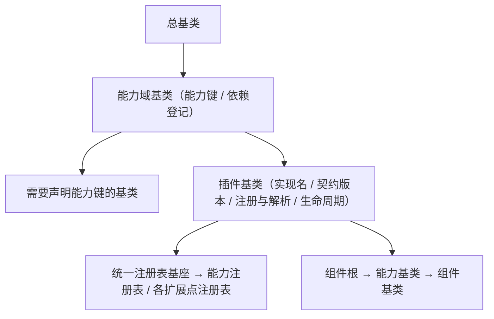

# 组件设计 · 能力机制

> 能力组合的公共机制：能力标识与依赖声明 / 单向依赖校验 / 开发态告警 / 能力登记入口（对齐后端能力域标识机制）
> 实现侧命名与落点见《[前端基类清单](../../../../../前端基类清单.md)》（§2.1 全量基类登记表；继承链全系统唯一一份），实现契约细节见项目详细设计。

[文档首页](../../../../../文档首页.md) › [项目规划说明](../../../../../规划/项目规划说明.md) › [组件设计](../../../01_组件设计_总览.md) › 能力机制　|　[← 组件根基类](../../01_机制基类/02_组件设计_组件根基类/02_组件设计_组件根基类.md)　[占位基类 →](../04_组件设计_占位基类/04_组件设计_占位基类.md)

> 可交互原型：[03_原型设计_能力机制.html](03_原型设计_能力机制.html)（演示能力声明（能力标识 / 依赖声明 / 元信息说明）、依赖单向校验与非法依赖的开发态告警）

## 1. 目的与适用范围 

定义 BMS 前端**能力域基类**的组件设计：为需要声明能力的外层基类提供公共机制——能力键、依赖声明、单向依赖校验、开发态告警。它是继承链上的**能力域基类**（**固定前三段的第 2 段**，父基类为总基类；对齐后端能力域基类）；**需要声明能力键的基类才继承它**，能力基类不统一继承（父基类与落点见《[前端基类清单](../../../../../前端基类清单.md)》§2.1 / §3.2）。

### 1.1 定位与继承链位置 

| 职责 | 归属 |
| --- | --- |
| 能力标识、依赖声明、单向依赖校验、开发态告警、登记入口 | **本节点（能力机制）** |
| UI 通用能力（透传、尺寸/密度、可访问性、加载/禁用） | [组件根基类](../../01_机制基类/02_组件设计_组件根基类/02_组件设计_组件根基类.md) |
| 每能力的具体横切能力 | [能力基类](../../02_能力类/01_组件设计_交互能力/01_组件设计_交互能力.md) 各节点 |
| 域语义细化 | [组件基类](../../03_域基类/01_组件设计_输入域基类/01_组件设计_输入域基类.md) 各节点（能力基类的一类） |

上游依据：[《前端开发规范》](../../../../../规范/前端开发规范.md)（§1 架构铁律、§3.1 依赖方向、§3.2 扩展规则）、[《架构设计 · 前端组件体系》](../../../../架构设计/05_架构设计_前端组件体系.md)（继承轨与开放扩展：横切功能即继承链上的基类）、[《架构设计 · 前端架构》](../../../../架构设计/08_架构设计_前端架构.md)（基类体系与目录登记）。

> 本篇为 **基础组件类 · 能力域基类**。**范围边界**：具体横切功能归各能力基类；族细化归组件基类；本机制只做「能力如何声明、如何依赖、如何被校验与登记」，不做任何 UI 或业务语义。

## 2. 职责与组成 

| 组成部分 | 职责 |
| --- | --- |
| 能力机制核心 | 能力标识、元信息说明、依赖声明、开发态单向校验与告警 |
| 能力登记表 | 能力标识与依赖的权威登记源（模块加载即登记；与《[前端基类清单](../../../../../前端基类清单.md)》「能力」节逐项对齐） |
| 能力注册表 | 能力登记与创建入口（未注册不可用、冲突拒重，冲突码 10003），与[注册表基类](../06_组件设计_注册表基类/06_组件设计_注册表基类.md)衔接 |

## 3. 交互与契约语义 

| 语义项 | 说明 |
| --- | --- |
| 能力标识 | 必填、全局唯一（登记与依赖引用用；新增能力与《[前端基类清单](../../../../../前端基类清单.md)》一致） |
| 依赖声明 | 只准依赖下层或同层已登记能力，单方向；缺省取登记值 |
| 启用开关 | 关闭时跳过校验与登记（供预览 / 测试） |
| 严格模式 | 违规时抛错（能力声明违规码 10001）而非仅告警 |
| 告警出口 | 开发态告警出口（生产不执行） |
| 元信息说明 | 汇总能力标识与依赖，登记与调试用 |
| 释放状态 | 能力释放可观测（具体释放动作由能力自身承担） |
| 校验时机与规则 | 开发态在能力实例化时校验：依赖已登记 / 无循环依赖 / 不依赖上层 |

## 4. 行为与约定 

| 项 | 设计 |
| --- | --- |
| 声明 | 需要声明能力键的基类继承能力域基类（能力域基类）；能力键与依赖经统一登记表登记；下位基类经继承取得能力语义、不改基类内部实现 |
| 依赖方向 | 只准上位依赖下位（具体组件 → 能力基类 / 组件基类 → 公共基类 / 插件基类 → 组件根 → 总基类）；基类之间依赖须**单向并登记** |
| 校验时机 | 开发态在能力类实例化时校验；生产态跳过（零开销） |
| 校验规则 | ① 依赖必须是已登记能力；② 不得形成循环依赖；③ 不得依赖上层（反向） |
| 告警 | 违规输出（含能力、依赖与原因）；校验失败不阻断渲染，仅告警（严格模式抛错） |
| 登记 | 能力新增走「候选 → 设计节点 → 评审确认 →《前端基类清单》登记 → 能力登记表登记」，标识与清单一致 |
| 组合 | 能力正交可组合；同一组件可声明多个能力，机制只保证依赖合法 |
| 机制自身依赖 | 本机制只依赖组件根；不得依赖任何能力基类或具体组件；能力依赖登记表由能力基类侧注入，机制不反向依赖 |

## 5. 场景集成 

| 场景 | 说明 |
| --- | --- |
| 各能力基类 | 需要声明的基类继承能力域基类、经能力依赖登记表登记能力键与依赖（如 字段能力基类 依赖 `value` + `field-shell` + `field-perm`） |
| 组件实现 | 具体组件经继承链取得能力语义，基类依赖由机制统一校验 |
| 注册表对接 | 能力注册表（登记 / 创建）与[注册表基类](../06_组件设计_注册表基类/06_组件设计_注册表基类.md)衔接，供扩展点登记 |
| 调试 | 元信息说明汇总能力依赖关系，供调试面板与文档生成 |

## 6. 依赖接口与上游变更 

### 6.1 上游接口与口径 

| 项 | 说明 | 目标文档 |
| --- | --- | --- |
| 继承链权威 | 能力域基类的父基类、能力基类的族与落点 | 《[前端基类清单](../../../../../前端基类清单.md)》§2.1 / §3.3 / §9（登记项①，唯一权威） |
| 组件分层 | 能力机制与能力登记表 | [《架构设计 · 前端架构》](../../../../架构设计/08_架构设计_前端架构.md)（登记项②） |
| 体系登记 | 能力清单与标识登记 | [《前端基类清单》](../../../../../前端基类清单.md)（登记项③） |
| 新增依赖 | **无** | — |

### 6.2 需登记的上游变更 

| 变更点 | 目标文档 | 内容 |
| --- | --- | --- |
| ① 能力机制契约 | [《前端开发规范》](../../../../../规范/前端开发规范.md) 第 3 节 | 明确能力机制：能力标识、依赖声明、单向校验（无循环 / 不依赖上层 / 须登记）、开发态告警 |
| ② 组件分层与目录 | [《架构设计 · 前端架构》](../../../../架构设计/08_架构设计_前端架构.md)「组件体系（基类体系与目录登记）」节 | 登记「组件根 → 能力机制 → 能力域基类 → 组件基类」机制链与依赖方向（落点以《[前端基类清单](../../../../../前端基类清单.md)》为准） |
| ③ 能力清单登记 | [《前端基类清单》](../../../../../前端基类清单.md)「能力」节 | 每能力登记标识与依赖；新增能力走候选→评审→登记流程 |

> 按[《文档生成规范》](../../../../../规范/文档生成规范.md)「引用与追溯」节，上述变更需用户确认后由上游文档同步。

## 7. 权限 / i18n / 移动端 

- **权限**：不做权限判定（字段权限见[字段权限能力](../../02_能力类/11_组件设计_字段权限能力/11_组件设计_字段权限能力.md)，动作权限见[基础类「权限指令」](../../../09_基础类/02_组件设计_权限指令/02_组件设计_权限指令.md)）。
- **i18n**：告警与元信息为开发态文案，不进语言包。
- **移动端**：机制同款（PC 与移动端共用同一实现；渲染插件同一契约多实现）。

## 8. 性能与边界 

| 场景 | 设计 |
| --- | --- |
| 开销 | 校验仅开发态执行；生产为静态声明，无运行时开销 |
| 边界 | 能力标识重复、依赖未登记、循环依赖、反向依赖、严格模式误开、生产态误依赖告警 |
| 不支持 | UI 能力（组件根）、能力基类具体职责（各能力节点）、域语义（组件基类）、权限判定 |

## 9. 检查清单 

- □ 契约语义：能力标识 / 依赖声明 / 启用开关 / 严格模式 / 告警出口 + 元信息说明 / 释放状态
- □ 校验：无循环、不依赖上层、依赖已登记；生产态零开销；告警含能力与原因
- □ 能力标识与《前端基类清单》一致；新增能力走候选→评审→登记
- □ 权限/i18n/移动端符合第 7 节；性能边界符合第 8 节
- □ 三项上游登记已确认

> 组件设计节点（能力机制）· 与[《前端开发规范》](../../../../../规范/前端开发规范.md)[《架构设计 · 前端组件体系》](../../../../架构设计/05_架构设计_前端组件体系.md)[《架构设计 · 前端架构》](../../../../架构设计/08_架构设计_前端架构.md)[《前端基类清单》](../../../../../前端基类清单.md)[组件根基类](../../01_机制基类/02_组件设计_组件根基类/02_组件设计_组件根基类.md)[注册表基类](../06_组件设计_注册表基类/06_组件设计_注册表基类.md)《命名规范》配套
