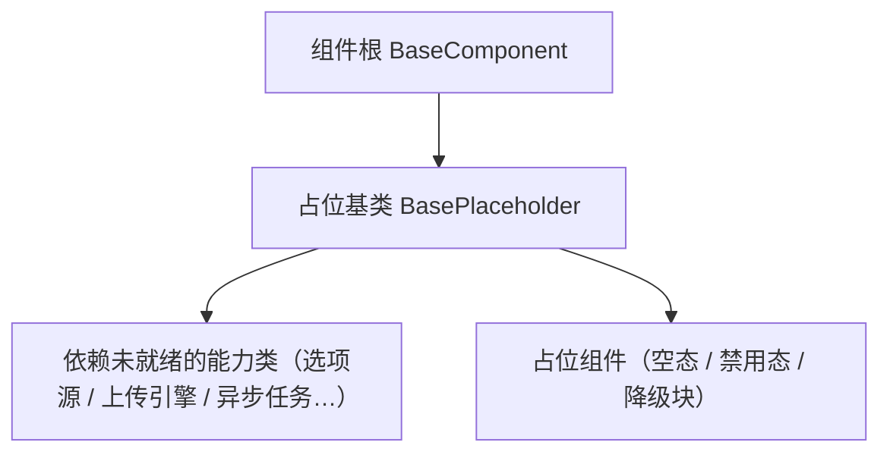

# 组件设计 · 占位基类

> BasePlaceholder（占位先行承载：占位标记 / `describe` / 空态·禁用·降级语义，对齐后端 BasePlaceholder / BaseNullObject / BaseStub；核心 `frontend/packages/core/src/mechanisms/placeholder.ts`）

[文档首页](../../../../../文档首页.md) › [项目规划说明](../../../../../规划/项目规划说明.md) › [组件设计](../../../01_组件设计_总览.md) › 占位基类　|　[← 片段机制](../03_组件设计_片段机制/03_组件设计_片段机制.md)　[异步资源基类 →](../05_组件设计_异步资源基类/05_组件设计_异步资源基类.md)

> 可交互原型：[04_原型设计_占位基类.html](04_原型设计_占位基类.html)（演示占位标记与 `describe`、三类占位原因（待实现 / 空实现 / 未实现）、空态·禁用·降级三种降级语义）

## 1. 目的与适用范围 

定义 BMS 前端（核心 `frontend/packages/core` 纯 TS；渲染插件与宿主按同一契约装配）**占位基类**的组件设计：核心类 `BasePlaceholder`，为**占位组件与依赖未就绪的能力（原片段）**提供统一标记与语义——占位标记、`describe` 说明、空态·禁用·降级。它是组件设计体系 **机制基类「占位基类」**，对齐后端 `BasePlaceholder`（占位标记 + `describe()`）/ `BaseNullObject`（空实现）/ `BaseStub`（未实现统一抛错），继承 [组件根基类](../../01_机制基类/02_组件设计_组件根基类/02_组件设计_组件根基类.md)。

### 1.1 定位与分层 

| 职责 | 归属 |
| --- | --- |
| 占位标记、`describe` 说明、占位原因（待实现 / 空实现 / 未实现）、降级语义（空态 / 禁用 / 隐藏） | **本节点（占位基类）** |
| UI 通用能力（透传、尺寸/密度、可访问性） | [组件根基类](../../01_机制基类/02_组件设计_组件根基类/02_组件设计_组件根基类.md) |
| 空态视觉与文案 | [展示类「异常与空状态」](../../../07_展示类/05_组件设计_异常与空状态/05_组件设计_异常与空状态.md) |
| 依赖未就绪时的具体降级行为 | 各能力类自身（本节点只定义语义与标记） |

上游依据：[《前端开发规范》](../../../../../规范/前端开发规范.md)（§3 机制基类）、[《后端基类清单》](../../../../../后端基类清单.md)「中间层基类」节（占位三件套对齐口径）、[《架构设计 · 前端组件体系》](../../../../架构设计/05_架构设计_前端组件体系.md)（机制基类定位与护栏）。

> 本篇为 **基础组件类 · 机制基类「占位基类」**。**范围边界**：空态视觉归展示类「异常与空状态」；能力具体行为归各能力类；本节点只定义"如何标记占位、如何降级、如何说明"，不做业务语义。

## 2. 组件清单与职责 

| 组件 / 工具 | 位置 | 职责 |
| --- | --- | --- |
| `BasePlaceholder` | `frontend/packages/core/src/mechanisms/placeholder.ts` | 核心类：占位原因 `reason`、降级语义 `fallback`、占位说明 `note`、元信息 `describe()` |

- 命名与落点遵循[《命名规范》](../../../../../规范/命名规范.md)与[《前端开发规范》](../../../../../规范/前端开发规范.md)：核心类 `BaseXxx`；核心落点 `frontend/packages/core/src/mechanisms/`；投影只落 `frontend/packages/vue/src/bindings/`（本机制无投影）。
- 旧组合式入口（占位 / 异步资源 / 注册表 / 订阅）已随旧层删除（历史经 git 追溯）；如需组合式入口，按「核心类 + `@bms/vue` 投影」口径按需补（当前投影仅根系 / 组件根 / 值 / 字段 / 容器 / 页签 / 偏好 / 权限 / 动态路由 / 可视区）。
- **与后端对齐**：后端占位三件套——`BasePlaceholder`（公共父：标记 + `describe()`）、`BaseNullObject`（空实现，无副作用）、`BaseStub`（未实现，统一抛错）；前端以 `reason` 三值（`pending` / `null` / `stub`）承载同等语义，不拆三个类。

## 3. 契约（Props 与方法） 

| 属性（构造选项） | 类型 | 默认 | 说明 |
| --- | --- | --- | --- |
| `reason` | 'pending' \| 'null' \| 'stub' | 'pending' | 占位原因：待实现（依赖后端能力未就绪）/ 空实现（恒空、恒成功）/ 未实现（调用即抛错） |
| `fallback` | 'empty' \| 'disabled' \| 'hidden' | 'empty' | 降级语义：空态占位 / 置为禁用 / 整块隐藏 |
| `note` | string | — | 占位说明（开发态展示；`describe()` 携带） |

| 方法 | 说明 |
| --- | --- |
| `describe()` | 占位元信息（`reason` + `fallback` + `note`，供调试与文档生成） |

> 原设计面（未落码）：`mark()` 打标（`data-placeholder`）/ `assertImplemented()`（`stub` 统一抛错）/ `silentInProd` / `placeholder:fallback` 事件——按使用方需要再补（当前核心类只承载语义与元信息）。

## 4. 行为与实现约定 

| 项 | 设计 |
| --- | --- |
| 占位标记 | 开发态：使用方可在组件根节点加 `data-placeholder`（值取 `reason`）并输出 `describe()`；生产态静默（`mark()` / `silentInProd` 为原设计面，未落码） |
| 降级语义 | `empty`＝渲染空态占位（文案取自 `note` 或空态组件默认）；`disabled`＝保留结构但整体禁用（不请求、不可交互）；`hidden`＝整块不渲染 |
| 不请求 | 占位态**不发起网络请求**、不写缓存、不产生副作用（对齐后端 Null 对象"无副作用"） |
| 可替换 | 占位 → 真实实现切换不改调用方（调用方只依赖能力契约；真实能力随对应阶段回补） |
| 契约测试 | 占位实现纳入契约套件（`@bms/core/testing`）：空结果 / 降级 / 禁用态断言；占位与真实实现跑同一套断言 |
| 依赖方向 | 只依赖组件根；不得依赖具体组件或具体能力类 |

## 5. 场景集成 

| 场景 | 说明 |
| --- | --- |
| 依赖未就绪的能力类 | 选项源 `BaseOptionSource`、上传引擎 `BaseUploadEngine`、异步任务 `BaseAsyncTask` 等以占位语义先行（空结果 / 降级 / 禁用） |
| 占位组件 | 空态块、禁用态表单区、待实现面板（如后端能力未就绪的统计卡） |
| 降级协作 | 依赖故障时的降级动作选取本基类 `fallback`；视觉呈现复用展示类「异常与空状态」 |
| 调试与文档 | `describe()` 汇总当前占位项，供调试面板与实施台账（占位 → 回补）核对 |

## 6. 依赖接口与上游变更 

### 6.1 上游接口与口径 

| 项 | 说明 | 目标文档 |
| --- | --- | --- |
| 分层权威 | 占位基类职责与标记口径 | [《前端开发规范》](../../../../../规范/前端开发规范.md) 第 3 节（登记项①） |
| 后端对齐 | 占位三件套与 Null 对象口径 | [《后端基类清单》](../../../../../后端基类清单.md)「中间层基类」节（登记项②） |
| 空态呈现 | 空态 / 禁用视觉与文案 | [展示类「异常与空状态」](../../../07_展示类/05_组件设计_异常与空状态/05_组件设计_异常与空状态.md)（登记项③） |
| 新增依赖 | **无** | — |

### 6.2 需登记的上游变更 

| 变更点 | 目标文档 | 内容 |
| --- | --- | --- |
| ① 占位基类契约 | [《前端开发规范》](../../../../../规范/前端开发规范.md) 第 3 节 | 明确占位基类：占位标记 + `describe` + 占位原因（待实现 / 空实现 / 未实现）+ 降级语义（空态 / 禁用 / 隐藏）+ 占位不请求 |
| ② 占位三件套对齐 | [《后端基类清单》](../../../../../后端基类清单.md) | 前端以 `reason` 三值对齐后端 `BasePlaceholder` / `BaseNullObject` / `BaseStub` 语义（登记前端对应行） |
| ③ 空态与降级呈现 | [展示类「异常与空状态」](../../../07_展示类/05_组件设计_异常与空状态/05_组件设计_异常与空状态.md) | 占位空态 / 禁用态的视觉与文案口径（组件层消费，不重复定义） |

> 按[《文档生成规范》](../../../../../规范/文档生成规范.md)「引用与追溯」节，上述变更需用户确认后由上游文档同步。

## 7. 权限 / i18n / 移动端 

- **权限**：不做权限判定；越权字段不渲染由[字段权限能力](../../02_能力片段/11_组件设计_字段权限片段/11_组件设计_字段权限片段.md)与字段壳处理。
- **i18n**：占位文案取 `note`（开发态）或空态组件默认文案（经 vue-i18n）；不硬编码。
- **移动端**：渲染插件 `frontend/packages/ui-vant` 与 `ui-ep` 按同一契约多实现（占位语义与标记一致；契约套件同一套断言）。

## 8. 性能与边界 

| 场景 | 设计 |
| --- | --- |
| 开销 | 开发态标记与告警可关；生产态零额外渲染（`hidden` 直接不渲染） |
| 边界 | 占位被误当空数据、占位态发起请求、`stub` 未抛错、降级动作与用户预期不符、占位长期未回补（以台账核对） |
| 不支持 | 空态视觉（展示类「异常与空状态」）、能力类具体行为（各能力类）、权限判定 |

## 9. 检查清单 

- □ 契约：`reason`（pending / null / stub）/ `fallback`（empty / disabled / hidden）/ `note` + `describe`；原设计面（`mark` / `assertImplemented` / `silentInProd`）按需补
- □ 行为：占位不请求不写缓存；`stub` 语义约束按使用方落地（统一抛错为原设计面）；占位与真实实现同套契约测试
- □ 对齐后端占位三件套语义；依赖方向单向（只依赖组件根）
- □ 权限/i18n/移动端符合第 7 节；性能边界符合第 8 节
- □ 三项上游登记已确认

> 组件设计节点（占位基类）· 与[《前端开发规范》](../../../../../规范/前端开发规范.md)[《后端基类清单》](../../../../../后端基类清单.md)[《架构设计 · 前端组件体系》](../../../../架构设计/05_架构设计_前端组件体系.md)[组件根基类](../../01_机制基类/02_组件设计_组件根基类/02_组件设计_组件根基类.md)[片段机制](../03_组件设计_片段机制/03_组件设计_片段机制.md)[展示类「异常与空状态」](../../../07_展示类/05_组件设计_异常与空状态/05_组件设计_异常与空状态.md)《命名规范》配套
