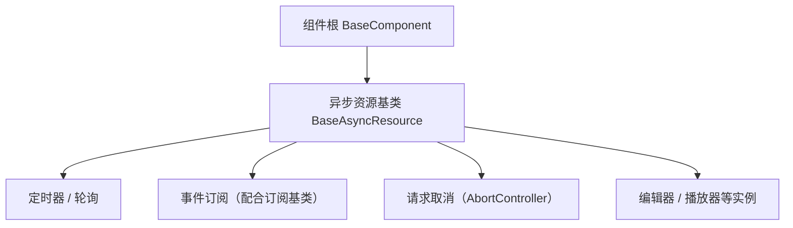

# 组件设计 · 异步资源基类

> BaseAsyncResource（订阅 / 定时器 / 请求等异步资源的生命周期统一登记与自动释放，对齐后端 BaseAsyncResource；核心 `frontend/packages/core/src/mechanisms/resource.ts`）

[文档首页](../../../../../文档首页.md) › [项目规划说明](../../../../../规划/项目规划说明.md) › [组件设计](../../../01_组件设计_总览.md) › 异步资源基类　|　[← 占位基类](../04_组件设计_占位基类/04_组件设计_占位基类.md)　[注册表基类 →](../06_组件设计_注册表基类/06_组件设计_注册表基类.md)

> 可交互原型：[05_原型设计_异步资源基类.html](05_原型设计_异步资源基类.html)（演示定时器 / 事件订阅 / 请求取消的统一登记、卸载自动释放与逆序回收）

## 1. 目的与适用范围 

定义 BMS 前端（核心 `frontend/packages/core` 纯 TS；渲染插件与宿主按同一契约装配）**异步资源基类**的组件设计：核心类 `BaseAsyncResource`，为**订阅、定时器、请求（AbortController）、编辑器实例等异步资源**提供统一生命周期——登记、自动释放、逆序回收、幂等释放。它是组件设计体系 **机制基类「异步资源基类」**，对齐后端 `BaseAsyncResource`（`aclose()` + `async with` 生命周期）与 `ResourceManager`（登记 + 逆序回收），继承 [组件根基类](../../01_机制基类/02_组件设计_组件根基类/02_组件设计_组件根基类.md)。

### 1.1 定位与分层 

| 职责 | 归属 |
| --- | --- |
| 异步资源登记、卸载自动释放、逆序回收、幂等释放、释放钩子 | **本节点（异步资源基类）** |
| 事件订阅语义（注册 / 取消 / 占位实现） | [订阅基类](../08_组件设计_订阅基类/08_组件设计_订阅基类.md)（释放动作走本节点） |
| UI 通用能力 | [组件根基类](../../01_机制基类/02_组件设计_组件根基类/02_组件设计_组件根基类.md) |
| 具体资源行为（轮询间隔、请求参数…） | 各能力类 / 具体组件 |

上游依据：[《前端开发规范》](../../../../../规范/前端开发规范.md)（§3 机制基类）、[《后端基类清单》](../../../../../后端基类清单.md)「中间层基类」（`BaseAsyncResource` / `ResourceManager` 对齐）、[《架构设计 · 前端组件体系》](../../../../架构设计/05_架构设计_前端组件体系.md)（机制基类定位与护栏）。

> 本篇为 **基础组件类 · 机制基类「异步资源基类」**。**范围边界**：订阅语义归订阅基类；注册表归注册表基类；本节点只做"资源登记与释放"，不做具体资源的行为。

## 2. 组件清单与职责 

| 组件 / 工具 | 位置 | 职责 |
| --- | --- | --- |
| `BaseAsyncResource` | `frontend/packages/core/src/mechanisms/resource.ts` | 核心类：资源登记 `track()`、释放 `releaseAll()`、释放钩子 `onRelease()`、幂等 `dispose()` |

- 命名与落点遵循[《命名规范》](../../../../../规范/命名规范.md)与[《前端开发规范》](../../../../../规范/前端开发规范.md)：核心类 `BaseXxx`；核心落点 `frontend/packages/core/src/mechanisms/`；投影只落 `frontend/packages/vue/src/bindings/`（本机制无投影）。
- 旧组合式入口（占位 / 异步资源 / 注册表 / 订阅）已随旧层删除（历史经 git 追溯）；如需组合式入口，按「核心类 + `@bms/vue` 投影」口径按需补（当前投影仅根系 / 组件根 / 值 / 字段 / 容器 / 页签 / 偏好 / 权限 / 动态路由 / 可视区）。
- **与后端对齐**：后端 `BaseAsyncResource` 提供 `aclose()` + `async with`；前端等价物是核心类的释放语义（释放时机由宿主 / 渲染插件在组件卸载钩子触发，核心不绑定渲染框架），语义一致、形态随平台。

## 3. 契约（Props 与方法） 

| 属性 | 类型 | 默认 | 说明 |
| --- | --- | --- | --- |
| `kind` | 'timer' \| 'subscription' \| 'request' \| 'instance' | 'instance' | 资源类型（调试与释放日志分类） |
| `autoRelease` | boolean | true | 作用域销毁时自动释放（false 供长生命周期宿主显式管理） |
| `onError` | (error) => void | — | 释放异常回调（单个资源释放失败不阻断其余资源） |

| 方法 / 事件 | 说明 |
| --- | --- |
| `track(handle, kind?)` | 登记资源（定时器 id / 取消函数 / AbortController / 实例），返回释放函数 |
| `releaseAll()` | 释放全部已登记资源（默认**逆序**，对齐后端 `ResourceManager`） |
| `onRelease(cb)` | 注册释放钩子（资源自身清理逻辑，如保存草稿、断开连接） |
| `dispose()` | 幂等释放入口（重复调用不重复执行；释放后拒绝新登记） |
| `resource:released` | 可选事件：释放完成上报（埋点 / 调试面板） |

## 4. 行为与实现约定 

| 项 | 设计 |
| --- | --- |
| 自动释放 | 释放时机由宿主 / 渲染插件在组件卸载钩子触发（核心不绑定渲染框架），调用 `releaseAll()`；**组件卸载不需要各组件手写清理** |
| 释放顺序 | 逆序释放（后登记先释放），与后端 `ResourceManager` 一致；单个失败不阻断（`onError` 上报） |
| 幂等 | 释放函数、`dispose()` 均幂等；释放后 `track()` 拒绝登记并开发态告警 |
| 典型资源 | `setInterval` / `setTimeout`（清定时器）、事件订阅（取消订阅）、`AbortController`（abort 请求）、编辑器 / 播放器实例（destroy） |
| 与请求协作 | 请求层（宿主 `BaseApi` / `useRequest`）的竞态取消经本基类登记（`track`），卸载自动 abort |
| 依赖方向 | 只依赖组件根；不得依赖具体组件 |

## 5. 场景集成 

| 场景 | 说明 |
| --- | --- |
| 轮询与防抖定时器 | 列表页轮询、导入进度轮询（配合异步任务能力） |
| 事件订阅 | 与[订阅基类](../08_组件设计_订阅基类/08_组件设计_订阅基类.md)组合：订阅注册，释放走本基类 |
| 请求竞态取消 | 搜索联想、快速切换 Tab 时的 `AbortController` 统一取消 |
| 实例销毁 | 编辑器内核 `BaseEditorKernel`（`editor-kernel`）、播放器、图表实例的销毁登记 |

## 6. 依赖接口与上游变更 

### 6.1 上游接口与口径 

| 项 | 说明 | 目标文档 |
| --- | --- | --- |
| 分层权威 | 异步资源基类职责与自动释放口径 | [《前端开发规范》](../../../../../规范/前端开发规范.md) 第 3 节（登记项①） |
| 后端对齐 | `BaseAsyncResource` / `ResourceManager` 语义 | [《后端基类清单》](../../../../../后端基类清单.md)「中间层基类」节（登记项②） |
| 请求取消 | 请求竞态与取消口径 | [基础类「请求封装」](../../../09_基础类/01_组件设计_请求封装/01_组件设计_请求封装.md)（登记项③） |
| 新增依赖 | **无** | — |

### 6.2 需登记的上游变更 

| 变更点 | 目标文档 | 内容 |
| --- | --- | --- |
| ① 异步资源基类契约 | [《前端开发规范》](../../../../../规范/前端开发规范.md) 第 3 节 | 明确异步资源基类：登记 / 卸载自动释放 / 逆序回收 / 幂等释放 / 释放后拒绝登记 |
| ② 后端对齐 | [《后端基类清单》](../../../../../后端基类清单.md) | 登记前端 `BaseAsyncResource`（核心）与后端同名基类的对应关系 |
| ③ 请求取消协作 | [基础类「请求封装」](../../../09_基础类/01_组件设计_请求封装/01_组件设计_请求封装.md) | 请求竞态取消（`AbortController`）经异步资源登记实现卸载自动 abort |

> 按[《文档生成规范》](../../../../../规范/文档生成规范.md)「引用与追溯」节，上述变更需用户确认后由上游文档同步。

## 7. 权限 / i18n / 移动端 

- **权限**：不做权限判定。
- **i18n**：无文案（释放日志为开发态）。
- **移动端**：渲染插件 `frontend/packages/ui-vant` 与 `ui-ep` 按同一契约多实现（资源释放语义一致；切后台 / 卸载均释放）。

## 8. 性能与边界 

| 场景 | 设计 |
| --- | --- |
| 开销 | 登记为轻量数组操作；释放仅执行已登记句柄 |
| 边界 | 泄漏（未登记资源）、重复释放、释放失败（单资源不阻断）、释放后回调再次登记、定时器在释放竞态中触发 |
| 不支持 | 订阅语义（订阅基类）、注册表（注册表基类）、具体资源行为（各能力类） |

## 9. 检查清单 

- □ 契约：`kind` / `autoRelease` / `onError` + `track` / `releaseAll` / `onRelease` / `dispose`
- □ 行为：卸载自动释放（宿主 / 渲染插件在卸载钩子触发）、逆序回收、幂等、释放后拒绝登记、单资源失败不阻断
- □ 与订阅基类 / 请求封装的协作口径明确；依赖方向单向（只依赖组件根）
- □ 权限/i18n/移动端符合第 7 节；性能边界符合第 8 节
- □ 三项上游登记已确认

> 组件设计节点（异步资源基类）· 与[《前端开发规范》](../../../../../规范/前端开发规范.md)[《后端基类清单》](../../../../../后端基类清单.md)[《架构设计 · 前端组件体系》](../../../../架构设计/05_架构设计_前端组件体系.md)[组件根基类](../../01_机制基类/02_组件设计_组件根基类/02_组件设计_组件根基类.md)[订阅基类](../08_组件设计_订阅基类/08_组件设计_订阅基类.md)[基础类「请求封装」](../../../09_基础类/01_组件设计_请求封装/01_组件设计_请求封装.md)《命名规范》配套
