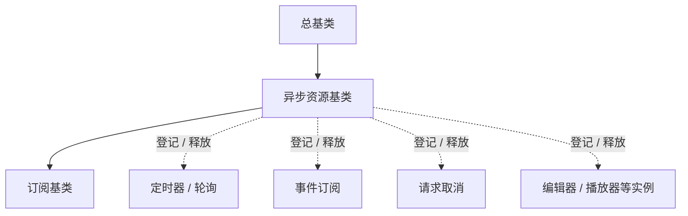

# 组件设计 · 异步资源基类

> 异步资源生命周期统一：登记 / 卸载自动释放 / 逆序回收 / 幂等释放 / 释放后拒绝登记（对齐后端异步资源与资源管理器）
> 实现侧命名与落点见《[前端基类清单](../../../../../前端基类清单.md)》（§2.1 全量基类登记表；继承链全系统唯一一份），实现契约细节见项目详细设计。

[文档首页](../../../../../文档首页.md) › [项目规划说明](../../../../../规划/项目规划说明.md) › [组件设计](../../../01_组件设计_总览.md) › 异步资源基类　|　[← 占位基类](../04_组件设计_占位基类/04_组件设计_占位基类.md)　[注册表基类 →](../06_组件设计_注册表基类/06_组件设计_注册表基类.md)

> 可交互原型：[05_原型设计_异步资源基类.html](05_原型设计_异步资源基类.html)（演示定时器 / 事件订阅 / 请求取消的统一登记、卸载自动释放与逆序回收）

## 1. 目的与适用范围 

定义 BMS 前端**异步资源基类**的组件设计：为**订阅、定时器、请求取消、编辑器实例等异步资源**提供统一生命周期——登记、自动释放、逆序回收、幂等释放。它是继承链上的**异步资源基类**（父基类链：总基类 → 异步资源基类 → 订阅基类），对齐后端异步资源与资源管理器（登记 + 逆序回收）；父子关系见《[前端基类清单](../../../../../前端基类清单.md)》§2.1 / §6.1。

### 1.1 定位与继承链位置 

| 职责 | 归属 |
| --- | --- |
| 异步资源登记、卸载自动释放、逆序回收、幂等释放、释放钩子 | **本节点（异步资源基类）** |
| 事件订阅语义（注册 / 取消 / 占位实现） | [订阅基类](../08_组件设计_订阅基类/08_组件设计_订阅基类.md)（释放动作走本节点） |
| UI 通用职责 | [组件根基类](../../01_机制基类/02_组件设计_组件根基类/02_组件设计_组件根基类.md)（组件根） |
| 具体资源行为（轮询间隔、请求参数…） | 各能力类 / 具体组件 |

上游依据：[《前端开发规范》](../../../../../规范/前端开发规范.md)（§3 前端基类体系与 §3.4 双轨）、[《后端基类清单》](../../../../../后端基类清单.md)「公共基类」（异步资源 / 资源管理器对齐）、[《架构设计 · 前端组件体系》](../../../../架构设计/05_架构设计_前端组件体系.md)（公共基类定位与护栏）。

> 本篇为 **基础组件类 · 公共基类「异步资源基类」**。**范围边界**：订阅语义归订阅基类；注册表归注册表基类；本节点只做"资源登记与释放"，不做具体资源的行为。

## 2. 职责与组成 

| 组成部分 | 职责 |
| --- | --- |
| 异步资源基类核心 | 资源登记、释放（逆序 + 幂等）、释放状态 |

- **与后端对齐**：后端异步资源提供关闭与上下文生命周期；前端等价物是核心的释放语义（释放时机由宿主 / 渲染插件在组件卸载钩子触发，核心不绑定渲染框架），语义一致、形态随平台。

## 3. 交互与契约语义 

| 语义项 | 说明 |
| --- | --- |
| 资源登记 | 登记释放函数（定时器取消 / 退订 / 请求取消 / 实例销毁），返回同一函数；释放后拒绝登记（抛未实现类错误） |
| 释放 | 释放全部已登记资源（**逆序** + 幂等，对齐后端资源管理器）；单个失败经总基类统一上报，不阻断其余 |
| 释放状态 | 释放状态可观测 |

## 4. 行为与约定 

| 项 | 设计 |
| --- | --- |
| 自动释放 | 释放时机由宿主 / 渲染插件在组件卸载钩子触发（核心不绑定渲染框架）；**组件卸载不需要各组件手写清理** |
| 释放顺序 | 逆序释放（后登记先释放），与后端资源管理器一致；单个失败不阻断（经总基类统一上报） |
| 幂等 | 释放句柄与整体释放均幂等；释放后拒绝登记（抛未实现类错误） |
| 典型资源 | 定时器 / 轮询、事件订阅（取消订阅）、请求取消、编辑器 / 播放器实例（销毁） |
| 与请求协作 | 请求层的竞态取消经本基类登记，卸载自动取消 |
| 依赖方向 | 只依赖组件根；不得依赖具体组件 |

## 5. 场景集成 

| 场景 | 说明 |
| --- | --- |
| 轮询与防抖定时器 | 列表页轮询、导入进度轮询（配合异步任务能力） |
| 事件订阅 | 与[订阅基类](../08_组件设计_订阅基类/08_组件设计_订阅基类.md)组合：订阅注册，释放走本基类 |
| 请求竞态取消 | 搜索联想、快速切换 Tab 时的请求统一取消 |
| 实例销毁 | 编辑器内核、播放器、图表实例的销毁登记 |

## 6. 依赖接口与上游变更 

### 6.1 上游接口与口径 

| 项 | 说明 | 目标文档 |
| --- | --- | --- |
| 继承链权威 | 异步资源与订阅的父基类链 | 《[前端基类清单](../../../../../前端基类清单.md)》§2.1 / §6.1（登记项①，唯一权威） |
| 后端对齐 | 异步资源 / 资源管理器语义 | [《后端基类清单》](../../../../../后端基类清单.md)「公共基类」节（登记项②） |
| 请求取消 | 请求竞态与取消口径 | [基础类「请求封装」](../../../09_基础类/01_组件设计_请求封装/01_组件设计_请求封装.md)（登记项③） |
| 新增依赖 | **无** | — |

### 6.2 需登记的上游变更 

| 变更点 | 目标文档 | 内容 |
| --- | --- | --- |
| ① 异步资源基类契约 | [《前端开发规范》](../../../../../规范/前端开发规范.md) 第 3 节 | 明确异步资源基类：登记 / 卸载自动释放 / 逆序回收 / 幂等释放 / 释放后拒绝登记 |
| ② 后端对齐 | [《后端基类清单》](../../../../../后端基类清单.md) | 登记前端异步资源基类与后端同职责基类的对应关系 |
| ③ 请求取消协作 | [基础类「请求封装」](../../../09_基础类/01_组件设计_请求封装/01_组件设计_请求封装.md) | 请求竞态取消经异步资源登记实现卸载自动取消 |

> 按[《文档生成规范》](../../../../../规范/文档生成规范.md)「引用与追溯」节，上述变更需用户确认后由上游文档同步。

## 7. 权限 / i18n / 移动端 

- **权限**：不做权限判定。
- **i18n**：无文案（释放日志为开发态）。
- **移动端**：PC 与移动端按同一契约多实现（资源释放语义一致；切后台 / 卸载均释放）。

## 8. 性能与边界 

| 场景 | 设计 |
| --- | --- |
| 开销 | 登记为轻量集合操作；释放仅执行已登记句柄 |
| 边界 | 泄漏（未登记资源）、重复释放、释放失败（单资源不阻断）、释放后回调再次登记、定时器在释放竞态中触发 |
| 不支持 | 订阅语义（订阅基类）、注册表（注册表基类）、具体资源行为（各能力节点） |

## 9. 检查清单 

- □ 契约语义：资源登记 / 释放（逆序 + 幂等）/ 释放状态；释放后拒绝登记（抛未实现类错误）
- □ 行为：卸载自动释放（宿主 / 渲染插件在卸载钩子触发）、逆序回收、幂等、单资源失败不阻断
- □ 与订阅基类 / 请求封装的协作口径明确；依赖方向单向（只依赖组件根）
- □ 权限/i18n/移动端符合第 7 节；性能边界符合第 8 节
- □ 三项上游登记已确认

> 组件设计节点（异步资源基类）· 与[《前端开发规范》](../../../../../规范/前端开发规范.md)[《后端基类清单》](../../../../../后端基类清单.md)[《架构设计 · 前端组件体系》](../../../../架构设计/05_架构设计_前端组件体系.md)[组件根基类](../../01_机制基类/02_组件设计_组件根基类/02_组件设计_组件根基类.md)[订阅基类](../08_组件设计_订阅基类/08_组件设计_订阅基类.md)[基础类「请求封装」](../../../09_基础类/01_组件设计_请求封装/01_组件设计_请求封装.md)《命名规范》配套
