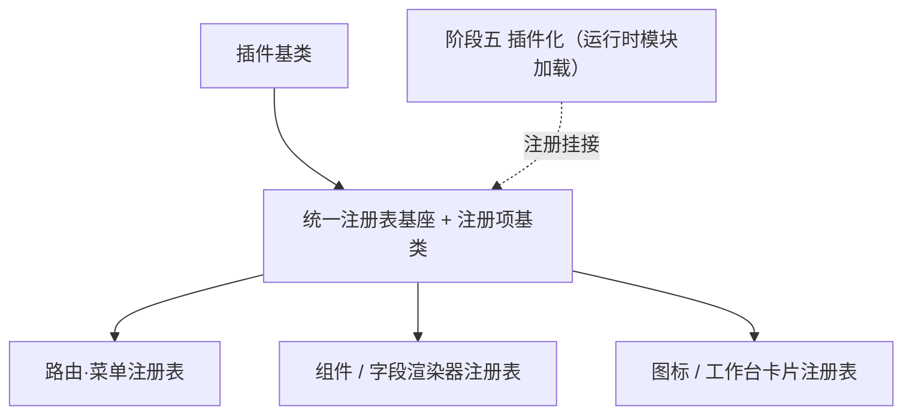

# 组件设计 · 注册表基类

> 注册表公共实现与注册项契约：唯一性拒重 / 解析未命中 / 保序清单 / 只读快照（对齐后端同名基类；插件基类之下）
> 实现侧命名与落点见《[前端基类清单](../../../../../前端基类清单.md)》（§2.1 全量基类登记表；继承链全系统唯一一份），实现契约细节见项目详细设计。

[文档首页](../../../../../文档首页.md) › [项目规划说明](../../../../../规划/项目规划说明.md) › [组件设计](../../../01_组件设计_总览.md) › 注册表基类　|　[← 异步资源基类](../05_组件设计_异步资源基类/05_组件设计_异步资源基类.md)　[错误基类 →](../07_组件设计_错误基类/07_组件设计_错误基类.md)

> 可交互原型：[06_原型设计_注册表基类.html](06_原型设计_注册表基类.html)（演示登记 / 唯一性拒重 / 解析命中与未命中 / 保序清单与只读快照）

## 1. 目的与适用范围 

定义 BMS 前端**注册表基类**的组件设计：为**前端扩展点**（路由·菜单、通用组件、字段渲染器、图标、工作台卡片等）提供统一的注册表公共实现——登记唯一性、解析、保序清单、只读快照。它是继承链上的**提供者注册表基座**（父基类为插件基类），注册项基类为**注册项基类**（对齐后端同名基类）；父子关系见《[前端基类清单](../../../../../前端基类清单.md)》§2.1 / §3.3。

### 1.1 定位与继承链位置 

| 职责 | 归属 |
| --- | --- |
| 注册表公共实现（唯一性 / 未命中 / 保序 / 快照）与注册项契约（唯一标识 + 元信息说明） | **本节点（注册表基类）** |
| 各域特有聚合（如按类型查询、按分组渲染） | 各域注册表（本基座之上的薄封装） |
| 插件加载与运行时组合（微前端） | [《架构设计 · 前端架构》](../../../../架构设计/08_架构设计_前端架构.md) 与阶段五（本基座是注册入口） |
| 能力声明与依赖登记 | [能力公共基类](../03_组件设计_能力机制/03_组件设计_能力机制.md)（注册入口对接） |

上游依据：[《前端开发规范》](../../../../../规范/前端开发规范.md)（§3 前端基类体系与 §3.4 双轨）、[《后端基类清单》](../../../../../后端基类清单.md)「公共基类」（注册表 / 注册项对齐）、[《架构设计 · 前端架构》](../../../../架构设计/08_架构设计_前端架构.md)「前端插件化与运行时组合」节。

> 本篇为 **基础组件类 · 公共基类「注册表基类」**。**范围边界**：各域注册表的特有聚合归各域（如字段渲染器的类型映射）；插件运行时加载归阶段五；本节点只做注册表的公共实现与注册项契约。

## 2. 职责与组成 

| 组成部分 | 职责 |
| --- | --- |
| 注册项契约 | 唯一标识 + 元信息说明（具体实现按域补充字段——组件 / 函数 / 配置对象） |
| 注册表基座 | 登记唯一性拒重 / 解析未命中返回空 / 保序清单 / 只读快照 / 已登记数量 |

- **与后端对齐**：后端注册表基类（登记唯一性拒重 / 未命中返回空 / 保序清单）与注册项基类（抽象标识 + 抽象说明）；前端同口径，**注册项不继承注册表，经登记汇入**。

## 3. 交互与契约语义 

**注册项契约**：

| 语义项 | 说明 |
| --- | --- |
| 唯一标识 | 注册项标识（域内唯一；如字段类型 / 图标标识） |
| 元信息说明 | 必填；供调试、清单与冲突定位 |
| 域扩展字段 | 按域定义（如字段渲染器的组件、图标的图形、卡片的取数） |

**注册表基座**：

| 语义项 | 说明 |
| --- | --- |
| 登记 | 同标识拒重（严格域抛注册表冲突码 10003，否则告警并保留首个）；登记顺序保留 |
| 解析 | 未命中返回空（**不抛错**，调用方按域语义兜底） |
| 保序清单 | 按登记顺序输出（便于确定性渲染与测试） |
| 只读快照 | 冻结副本，防外部直接改动注册表 |
| 数量 | 已登记数量 |

## 4. 行为与约定 

| 项 | 设计 |
| --- | --- |
| 唯一性 | 同标识重复登记：严格域抛注册表冲突（码 10003）、缺省告警并保留首个（对齐后端唯一性拒重） |
| 未命中 | 解析返回空；各域自行决定兜底（渲染占位、兜底组件或抛错），公共基座不替各域裁决 |
| 保序 | 保序清单按登记顺序输出（稳定渲染、稳定测试） |
| 快照 | 只读快照返回冻结副本，防调用方直接改写 |
| 生命周期 | 声明式登记（模块初始化）与运行时登记（插件 / 能力类）双入口；注销随热更新 / 插件化场景演进 |
| 依赖方向 | **继承插件基类 插件基类**（插件基类之下）；各域注册表基于基座扩展（如能力注册表）并补充聚合（如按类型解析），不得另起登记实现 |

## 5. 场景集成 

| 场景 | 说明 |
| --- | --- |
| 字段渲染器注册表 | 表单元数据类型 → 渲染组件映射（表单渲染器按注册表分发） |
| 路由·菜单注册表 | 动态路由与侧边菜单注册（配合动态路由能力） |
| 组件 / 图标注册表 | 通用组件按名解析、图标选择器取图标集 |
| 工作台卡片注册表 | 卡片提供者登记与解析（后端工作台卡片基座的展示侧） |
| 插件化挂接 | 阶段五运行时模块经登记挂入各域；未注册即不可用 |

## 6. 依赖接口与上游变更 

### 6.1 上游接口与口径 

| 项 | 说明 | 目标文档 |
| --- | --- | --- |
| 继承链权威 | 注册表 / 注册项的父基类与落点 | 《[前端基类清单](../../../../../前端基类清单.md)》§2.1 / §3.3（登记项①，唯一权威） |
| 后端对齐 | 注册表 / 注册项同职责口径 | [《后端基类清单》](../../../../../后端基类清单.md)「公共基类」节（登记项②） |
| 扩展点登记 | 前端扩展点与运行时组合 | [《架构设计 · 前端架构》](../../../../架构设计/08_架构设计_前端架构.md)「前端插件化与运行时组合」节（登记项③） |
| 新增依赖 | **无** | — |

### 6.2 需登记的上游变更 

| 变更点 | 目标文档 | 内容 |
| --- | --- | --- |
| ① 注册表基类契约 | [《前端开发规范》](../../../../../规范/前端开发规范.md) 第 3 节 | 明确注册表基类：登记唯一性拒重 / 解析未命中返回空 / 保序 / 只读快照；注册项唯一标识 + 元信息说明强约束 |
| ② 后端对齐 | [《后端基类清单》](../../../../../后端基类清单.md) | 登记前端注册表基类 / 注册项契约与后端同职责基类的对应（注册项不继承注册表，经登记汇入） |
| ③ 扩展点与注册表 | [《架构设计 · 前端架构》](../../../../架构设计/08_架构设计_前端架构.md) | 各扩展点（路由·菜单 / 组件 / 字段渲染器 / 图标 / 工作台卡片）统一经本基座登记与解析 |

> 按[《文档生成规范》](../../../../../规范/文档生成规范.md)「引用与追溯」节，上述变更需用户确认后由上游文档同步。

## 7. 权限 / i18n / 移动端 

- **权限**：不做权限判定（动态路由与菜单过滤由权限上下文处理后再登记 / 展示）。
- **i18n**：注册项元信息不参与展示文案；域文案各域自备。
- **移动端**：PC 与移动端按同一契约多实现（注册表语义一致；各自维护注册集）。

## 8. 性能与边界 

| 场景 | 设计 |
| --- | --- |
| 开销 | 键值存取；快照仅在显式调用时生成 |
| 边界 | 标识冲突（拒重）、未命中未兜底（渲染空白）、注册顺序变化影响渲染顺序、热更新残留旧项、快照被误当可变数据 |
| 不支持 | 各域特有聚合（域注册表）、插件加载（后续）、权限判定 |

## 9. 检查清单 

- □ 契约语义：登记 / 解析 / 保序清单 / 只读快照 / 数量；注册项唯一标识 + 元信息说明约束
- □ 行为：唯一性拒重、未命中返回空、保序、只读快照、双入口登记（声明式 / 运行时）
- □ 各域注册表基于基座扩展（泛型参数化）补充聚合、不另起登记实现；基座继承组件根
- □ 权限/i18n/移动端符合第 7 节；性能边界符合第 8 节
- □ 三项上游登记已确认

> 组件设计节点（注册表基类）· 与[《前端开发规范》](../../../../../规范/前端开发规范.md)[《后端基类清单》](../../../../../后端基类清单.md)[《架构设计 · 前端架构》](../../../../架构设计/08_架构设计_前端架构.md)[《架构设计 · 前端组件体系》](../../../../架构设计/05_架构设计_前端组件体系.md)[组件根基类](../../01_机制基类/02_组件设计_组件根基类/02_组件设计_组件根基类.md)[能力机制](../03_组件设计_能力机制/03_组件设计_能力机制.md)[异步资源基类](../05_组件设计_异步资源基类/05_组件设计_异步资源基类.md)《命名规范》配套
