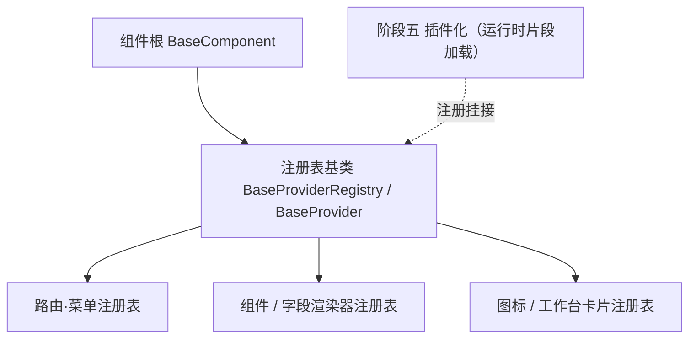

# 组件设计 · 注册表基类

> BaseProviderRegistry · BaseProvider（注册表公共实现 + 注册项契约：唯一性拒重 / 未命中 / 保序清单，对齐后端 BaseProviderRegistry / BaseProvider）

[文档首页](../../../../../文档首页.md) › [项目规划说明](../../../../../规划/项目规划说明.md) › [组件设计](../../../01_组件设计_总览.md) › 注册表基类　|　[← 异步资源基类](../05_组件设计_异步资源基类/05_组件设计_异步资源基类.md)　[错误基类 →](../07_组件设计_错误基类/07_组件设计_错误基类.md)

> 可交互原型：[06_原型设计_注册表基类.html](06_原型设计_注册表基类.html)（演示登记 / 唯一性拒重 / 解析命中与未命中 / 保序清单与只读快照）

## 1. 目的与适用范围 

定义 BMS 前端 `frontend/`（`frontend-mobile/` 同款）**注册表基类**的组件设计：类 `BaseProviderRegistry` 与注册项契约 `BaseProvider`，为**前端扩展点**（路由·菜单、通用组件、字段渲染器、图标、工作台卡片等）提供统一的注册表公共实现——登记唯一性、解析、保序清单、只读快照。它是组件设计体系 **机制基类「注册表基类」**，对齐后端 `BaseProviderRegistry[ItemT]` / `BaseProvider`（**组合轨**，不继承插件轨 `BasePluggable`），继承 [组件根基类](../../01_机制基类/02_组件设计_组件根基类/02_组件设计_组件根基类.md)。

### 1.1 定位与分层 

| 职责 | 归属 |
| --- | --- |
| 注册表公共实现（唯一性 / 未命中 / 保序 / 快照）与注册项契约（`key` + `describe`） | **本节点（注册表基类）** |
| 各域特有聚合（如按类型查询、按分组渲染） | 各域注册表（本基座之上的薄封装） |
| 插件加载与运行时组合（微前端） | [《架构设计 · 前端架构》](../../../../架构设计/08_架构设计_前端架构.md) 与阶段五（本基座是注册入口） |
| 片段声明与依赖登记 | [片段机制](../03_组件设计_片段机制/03_组件设计_片段机制.md)（`register()` 对接） |

上游依据：[《前端开发规范》](../../../../../规范/前端开发规范.md)（§3 机制基类）、[《后端基类清单》](../../../../../后端基类清单.md)「中间层基类」（`BaseProviderRegistry` / `BaseProvider` 对齐）、[《架构设计 · 前端架构》](../../../../架构设计/08_架构设计_前端架构.md)「前端插件化与运行时组合」节。

> 本篇为 **基础组件类 · 机制基类「注册表基类」**。**范围边界**：各域注册表的特有聚合归各域（如字段渲染器的类型映射）；插件运行时加载归阶段五；本节点只做注册表的公共实现与注册项契约。

## 2. 组件清单与职责 

| 组件 / 工具 | 位置 | 职责 |
| --- | --- | --- |
| `BaseProvider` | `src/base/provider.ts` | 注册项契约（抽象 `key` + 抽象 `describe()`；具体实现按域补充字段——组件 / 函数 / 配置对象） |
| `BaseProviderRegistry` | `src/base/provider.ts` | 注册表基类：`register` 唯一性拒重 / `unregister` / `get` 未命中返回 `undefined` / `keys` / `values` 保序 / `snapshot` 只读快照 |
| `useProviderRegistry.ts` | `src/base/provider.ts` | 组合式：创建域注册表实例（绑定作用域，可选卸载自动注销） |

- 命名遵循[《命名规范》](../../../../../规范/命名规范.md)：机制基类 `BaseXxx`；目录遵循[《前端开发规范》](../../../../../规范/前端开发规范.md)（机制层归 `src/base/`）。
- **与后端对齐**：后端 `BaseProviderRegistry`（`register` 唯一性拒重 / `get` 未命中 `None` / `keys` / `values` 保序）与 `BaseProvider`（抽象 `key` + 抽象 `describe`）；前端同名同口径，**组合轨**——注册项不继承注册表，经 `register()` 汇入。

## 3. 契约（方法） 

**注册项 `BaseProvider`**：

| 成员 | 类型 | 说明 |
| --- | --- | --- |
| `key` | string | 注册项标识（域内唯一；如字段类型 `dict` / 图标 `user`） |
| `describe()` | () => string | 元信息（必填；供调试、清单与冲突定位） |
| 域扩展字段 | — | 按域定义（如字段渲染器的 `component`、图标的 `svg`、卡片的 `fetch`） |

**注册表 `BaseProviderRegistry`**：

| 方法 | 说明 |
| --- | --- |
| `register(provider)` | 登记：同 `key` 拒重（抛错或开发态告警，按域 `strict` 配置）；登记顺序保留 |
| `unregister(key)` | 注销（返回是否命中；片段卸载 / 热更新用） |
| `get(key)` | 解析：未命中返回 `undefined`（**不抛错**，调用方按域语义兜底） |
| `has(key)` | 存在判定 |
| `keys()` / `values()` / `list()` | 保序清单（登记顺序，便于确定性渲染与测试） |
| `snapshot()` | 只读快照（防外部直接改动注册表） |
| `size` | 已登记数量 |

- 事件：`provider:registered` / `provider:unregistered`（可选，调试与热更新）。

## 4. 行为与实现约定 

| 项 | 设计 |
| --- | --- |
| 唯一性 | 同 `key` 重复登记：严格域（核心扩展点）抛错、一般域警告并保留首个（对齐后端"唯一性拒重"） |
| 未命中 | `get` 返回 `undefined`；各域自行决定兜底（渲染占位、兜底组件或抛错），公共基类不替各域裁决 |
| 保序 | `keys` / `values` 按登记顺序输出（稳定渲染、稳定测试） |
| 快照 | `snapshot()` 返回冻结副本，防调用方直接改写；注册表内部以 Map 维护 |
| 生命周期 | 声明式登记（模块初始化）与运行时登记（插件 / 片段）双入口；卸载走 `unregister` 或 `useProviderRegistry` 作用域自动注销 |
| 依赖方向 | 只依赖组件根；各域注册表继承本基座并补充聚合（如 `resolve(type)`），不得另起 Map 登记实现 |

## 5. 场景集成 

| 场景 | 说明 |
| --- | --- |
| 字段渲染器注册表 | 表单元数据 `type` → 渲染组件映射（表单渲染器按注册表分发） |
| 路由·菜单注册表 | 动态路由与侧边菜单注册（配合 `useDynamicRoutes`） |
| 组件 / 图标注册表 | 通用组件按名解析（FormFrame 组件名映射）、图标选择器取图标集 |
| 工作台卡片注册表 | 卡片提供者登记与解析（后端工作台卡片基座的展示侧） |
| 插件化挂接 | 阶段五运行时片段以 `register()` 挂入各域；未注册即不可用 |

## 6. 依赖接口与上游变更 

### 6.1 上游接口与口径 

| 项 | 说明 | 目标文档 |
| --- | --- | --- |
| 分层权威 | 注册表基类职责与未命中 / 唯一性口径 | [《前端开发规范》](../../../../../规范/前端开发规范.md) 第 3 节（登记项①） |
| 后端对齐 | `BaseProviderRegistry` / `BaseProvider` 组合轨口径 | [《后端基类清单》](../../../../../后端基类清单.md)「中间层基类」节（登记项②） |
| 扩展点登记 | 前端扩展点与运行时组合 | [《架构设计 · 前端架构》](../../../../架构设计/08_架构设计_前端架构.md)「前端插件化与运行时组合」节（登记项③） |
| 新增依赖 | **无** | — |

### 6.2 需登记的上游变更 

| 变更点 | 目标文档 | 内容 |
| --- | --- | --- |
| ① 注册表基类契约 | [《前端开发规范》](../../../../../规范/前端开发规范.md) 第 3 节 | 明确注册表基类：`register` 唯一性拒重 / `get` 未命中返回 `undefined` / 保序 / 只读快照；注册项 `key` + `describe` 强约束 |
| ② 后端对齐 | [《后端基类清单》](../../../../../后端基类清单.md) | 登记前端 `BaseProviderRegistry` / `BaseProvider` 与后端同名基类的对应（组合轨） |
| ③ 扩展点与注册表 | [《架构设计 · 前端架构》](../../../../架构设计/08_架构设计_前端架构.md) | 各扩展点（路由·菜单 / 组件 / 字段渲染器 / 图标 / 工作台卡片）统一经本基座登记与解析（09-2 落最小实现） |

> 按[《文档生成规范》](../../../../../规范/文档生成规范.md)「引用与追溯」节，上述变更需用户确认后由上游文档同步。

## 7. 权限 / i18n / 移动端 

- **权限**：不做权限判定（动态路由与菜单过滤由权限上下文 `useAccess` 处理后再登记/展示）。
- **i18n**：注册项元信息不参与展示文案；域文案各域自备。
- **移动端**：独立工程，注册表语义同款（各自维护注册集）。

## 8. 性能与边界 

| 场景 | 设计 |
| --- | --- |
| 开销 | Map 存取；快照仅在显式调用时生成 |
| 边界 | key 冲突（拒重）、未命中未兜底（渲染空白）、注册顺序变化影响渲染顺序、热更新残留旧项、快照被误当可变数据 |
| 不支持 | 各域特有聚合（域注册表）、插件加载（阶段五）、权限判定 |

## 9. 检查清单 

- □ 契约：`register` / `unregister` / `get` / `has` / `keys` / `values` / `list` / `snapshot`；注册项 `key` + `describe` 强约束
- □ 行为：唯一性拒重、未命中返回 `undefined`、保序、只读快照、双入口登记（声明式 / 运行时）
- □ 各域注册表继承本基座补充聚合、不另起 Map；依赖方向单向
- □ 权限/i18n/移动端符合第 7 节；性能边界符合第 8 节
- □ 三项上游登记已确认

> 组件设计节点（注册表基类）· 与[《前端开发规范》](../../../../../规范/前端开发规范.md)[《后端基类清单》](../../../../../后端基类清单.md)[《架构设计 · 前端架构》](../../../../架构设计/08_架构设计_前端架构.md)[《架构设计 · 前端组件体系》](../../../../架构设计/05_架构设计_前端组件体系.md)[组件根基类](../../01_机制基类/02_组件设计_组件根基类/02_组件设计_组件根基类.md)[片段机制](../03_组件设计_片段机制/03_组件设计_片段机制.md)[异步资源基类](../05_组件设计_异步资源基类/05_组件设计_异步资源基类.md)《命名规范》配套
