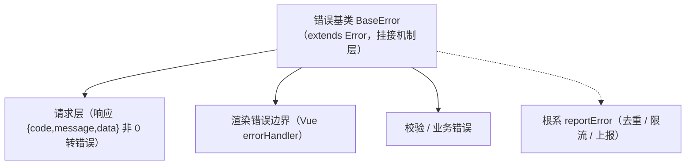

# 组件设计 · 错误基类

> BaseError（错误码 + 用户提示映射 + 上报钩子，对齐后端 BizError 体系；核心 `frontend/packages/core/src/mechanisms/error.ts`）

[文档首页](../../../../../文档首页.md) › [项目规划说明](../../../../../规划/项目规划说明.md) › [组件设计](../../../01_组件设计_总览.md) › 错误基类　|　[← 注册表基类](../06_组件设计_注册表基类/06_组件设计_注册表基类.md)　[订阅基类 →](../08_组件设计_订阅基类/08_组件设计_订阅基类.md)

> 可交互原型：[07_原型设计_错误基类.html](07_原型设计_错误基类.html)（演示错误码到用户提示的映射与回退、统一响应解析、上报去重限流）

## 1. 目的与适用范围 

定义 BMS 前端（核心 `frontend/packages/core` 纯 TS；渲染插件与宿主按同一契约装配）**错误基类**的组件设计：核心类 `BaseError`，为**请求错误、校验错误、渲染边界与业务异常**提供统一错误语义——错误码、用户提示映射、上报钩子。它是组件设计体系 **机制基类「错误基类」**，对齐后端 `BizError` 体系（错误码 / `http_status` / `data`；错误码段位登记）——按标准 `Error` 派生（保留 `instanceof Error` 与堆栈），**挂接在核心机制层**（`frontend/packages/core/src/mechanisms/`），不继承 UI 能力；上报最终汇入 [根系基类](../../01_机制基类/01_组件设计_根系基类/01_组件设计_根系基类.md) 的 `reportError`。

### 1.1 定位与分层 

| 职责 | 归属 |
| --- | --- |
| 错误码与用户提示映射、统一响应解析、上报入口、错误边界承接 | **本节点（错误基类）** |
| 上报通道（去重 / 限流 / 不阻断业务） | [根系基类](../../01_机制基类/01_组件设计_根系基类/01_组件设计_根系基类.md) `reportError` |
| 请求层拦截（401 刷新、统一解析） | [基础类「请求封装」](../../../09_基础类/01_组件设计_请求封装/01_组件设计_请求封装.md) |
| 后端错误码与段位 | [《后端基类清单》](../../../../../后端基类清单.md)「core 横切」（`BizError` / `ErrorCode` / `ErrorSegment`） |

上游依据：[《前端开发规范》](../../../../../规范/前端开发规范.md)（§3 机制基类）、[《后端基类清单》](../../../../../后端基类清单.md)「core 横切基座」（异常与错误码对齐）、[《命名规范》](../../../../../规范/命名规范.md)（错误码文案 i18n key `error.{code}`）。

> 本篇为 **基础组件类 · 机制基类「错误基类」**。**范围边界**：请求拦截与重试归请求封装；上报通道归根系；本节点只定义"错误怎么表示、怎么提示、怎么进入上报"。

## 2. 组件清单与职责 

| 组件 / 工具 | 位置 | 职责 |
| --- | --- | --- |
| `BaseError` | `frontend/packages/core/src/mechanisms/error.ts` | 核心类：`code` / `message` / `userMessage` / `data` / `cause`；`fromResponse()` 统一响应解析、`toUserMessage()` 提示映射、`report()` 上报 |
| `ErrorCodes` | `frontend/packages/core/src/mechanisms/error.ts` | 前端内建错误码表（`10001` 能力声明违规 / `10002` 扩展点未登记 / `10003` 注册表冲突 / `19001` 未实现…，段位对齐平台） |
| 提示映射 `error.{code}` | `frontend/apps/*/src/api/error.ts`（宿主 `ApiError` / `errorMessage`）+ 渲染插件 i18n | 错误码 → 用户提示映射（i18n key `error.{code}`，缺失回退通用文案；核心只携带 `code` / `userMessage`） |

- 命名与落点遵循[《命名规范》](../../../../../规范/命名规范.md)与[《前端开发规范》](../../../../../规范/前端开发规范.md)：核心类 `BaseError`；核心落点 `frontend/packages/core/src/mechanisms/`（挂接机制层，不入组件根继承链）；投影只落 `frontend/packages/vue/src/bindings/`（本机制无投影）。
- **与后端对齐**：后端 `BizError`（携带错误码 / `http_status` / `data`，段位基 1xxxx / 2xxxx / 3xxxx / 4xxxx / 8xxxx）；前端以核心 `BaseError` 携带同一 `code` 映射用户提示（`error.{code}`），不在前端重新发明错误码。

## 3. 契约（字段与方法） 

| 字段 | 类型 | 说明 |
| --- | --- | --- |
| `code` | number | 错误码（对齐后端段位：1xxxx 通用 / 2xxxx 认证 / 3xxxx 用户组织 / 4xxxx 配置 / 8xxxx 开放·租户） |
| `message` | string | 技术信息（日志与开发态展示；不直接展示给用户） |
| `userMessage` | string | 用户提示（映射 i18n `error.{code}`；未映射时回退领域通用文案） |
| `data` | unknown | 附加数据（如校验明细、冲突对象 id） |
| `cause` | unknown | 原始错误 / 响应（保留现场供上报） |

| 方法 | 说明 |
| --- | --- |
| `fromResponse(response)` | 由统一响应 `{code, message, data}` 构造（`code !== 0` 时；供请求层调用） |
| `toUserMessage()` | 用户提示映射（i18n 优先 → 回退通用文案；供消息组件展示） |
| `report(meta?)` | 上报（委托根系 `reportError`，附带错误码 / 页面 / 组件标识） |
| `isAuth()` / `isPermission()` / `isRateLimit()` | 段位判定便捷方法（供拦截层决定刷新、跳转、提示策略） |

## 4. 行为与实现约定 

| 项 | 设计 |
| --- | --- |
| 响应解析 | 请求层统一判断 `code !== 0` 构造 `BaseError`；401（2xxxx 认证段）由请求层静默刷新重试，不进入用户提示 |
| 提示映射 | `userMessage` 取 i18n `error.{code}`；未映射回退"操作失败，请稍后重试"（或领域文案）；**禁止组件内硬编码错误文案** |
| 段位判定 | 认证段（2xxxx）→ 跳登录 / 刷新；权限段（如 30001 权限）→ 提示并刷新权限缓存；限流段（10005）→ 提示稍后再试 |
| 错误边界 | 渲染错误（Vue `errorHandler` / `onErrorCaptured`）统一转 `BaseError`（code 段位取通用）并上报；**不白屏**，由展示类「异常与空状态」兜底 |
| 上报 | 经根系 `reportError`：去重（同码同栈短时合并）、限流、生产分级；上报不阻断业务、失败静默 |
| 用户取消 | 主动取消（切换页面 / AbortController）不算错误，不提示、不上报 |
| 依赖方向 | 与组件根解耦（挂接核心机制层）；上报委托宿主根系；不得依赖具体组件或具体域 |

## 5. 场景集成 

| 场景 | 说明 |
| --- | --- |
| 请求错误 | `BaseError.fromResponse()` → `toUserMessage()` 交给消息组件提示；认证/权限段位分流 |
| 表单校验 | 校验结果可包装为 `BaseError`（`data` 携带字段明细），字段壳按字段展示 |
| 渲染错误 | 页面级 `onErrorCaptured` 捕获 → 占位降级 + 上报（配合展示类「异常与空状态」） |
| 监控与告警 | `report()` 汇入根系 `reportError`，统一去重限流后送监控端点 |

## 6. 依赖接口与上游变更 

### 6.1 上游接口与口径 

| 项 | 说明 | 目标文档 |
| --- | --- | --- |
| 分层权威 | 错误基类职责与提示映射口径 | [《前端开发规范》](../../../../../规范/前端开发规范.md) 第 3 节（登记项①） |
| 错误码体系 | 错误码段位与文案 key | [《后端基类清单》](../../../../../后端基类清单.md)「core 横切基座」节（登记项②） |
| 上报口径 | 前端日志与错误上报 | [根系基类](../../01_机制基类/01_组件设计_根系基类/01_组件设计_根系基类.md)（登记项③） |
| 新增依赖 | **无** | — |

### 6.2 需登记的上游变更 

| 变更点 | 目标文档 | 内容 |
| --- | --- | --- |
| ① 错误基类契约 | [《前端开发规范》](../../../../../规范/前端开发规范.md) 第 3 节 | 明确错误基类：`code` / `message` / `userMessage` / `data` / `cause` + 统一响应解析 + 提示映射（i18n `error.{code}`）+ 上报委托根系 |
| ② 错误码对齐 | [《后端基类清单》](../../../../../后端基类清单.md) | 前端提示映射与后端错误码段位（1xxxx / 2xxxx / 3xxxx / 4xxxx / 8xxxx）同源登记 |
| ③ 上报通道 | [根系基类](../../01_机制基类/01_组件设计_根系基类/01_组件设计_根系基类.md) | 错误上报统一走根系 `reportError`（去重 / 限流 / 生产分级），错误基类不另建通道 |

> 按[《文档生成规范》](../../../../../规范/文档生成规范.md)「引用与追溯」节，上述变更需用户确认后由上游文档同步。

## 7. 权限 / i18n / 移动端 

- **权限**：不做权限判定；权限失败（错误码）由本基类提供段位判定，动作权限见[基础类「权限指令」](../../../09_基础类/02_组件设计_权限指令/02_组件设计_权限指令.md)。
- **i18n**：用户提示经 `error.{code}` 映射；技术信息不展示给用户。
- **移动端**：渲染插件 `frontend/packages/ui-vant` 与 `ui-ep` 按同一契约多实现（错误语义与映射一致；契约套件同一套断言）。

## 8. 性能与边界 

| 场景 | 设计 |
| --- | --- |
| 开销 | 构造与映射为纯内存操作；上报去重限流由根系统一 |
| 边界 | 错误码未映射（回退文案）、重复上报风暴、401 循环刷新、用户取消误报、原始错误信息泄露（生产只上报码与上下文） |
| 不支持 | 请求拦截与重试（请求封装）、上报通道（根系）、具体提示组件（展示类「通知与消息」） |

## 9. 检查清单 

- □ 契约：`code` / `message` / `userMessage` / `data` / `cause` + `fromResponse` / `toUserMessage` / `report` / 段位判定
- □ 行为：统一响应解析、i18n 提示映射与回退、401 静默刷新不提示、用户取消不报、上报走去重限流
- □ 禁止组件内硬编码错误文案；机制层挂接、上报委托根系（不另建通道）
- □ 权限/i18n/移动端符合第 7 节；性能边界符合第 8 节
- □ 三项上游登记已确认

> 组件设计节点（错误基类）· 与[《前端开发规范》](../../../../../规范/前端开发规范.md)[《后端基类清单》](../../../../../后端基类清单.md)[《命名规范》](../../../../../规范/命名规范.md)[组件根基类](../../01_机制基类/02_组件设计_组件根基类/02_组件设计_组件根基类.md)[根系基类](../../01_机制基类/01_组件设计_根系基类/01_组件设计_根系基类.md)[基础类「请求封装」](../../../09_基础类/01_组件设计_请求封装/01_组件设计_请求封装.md)《命名规范》配套
