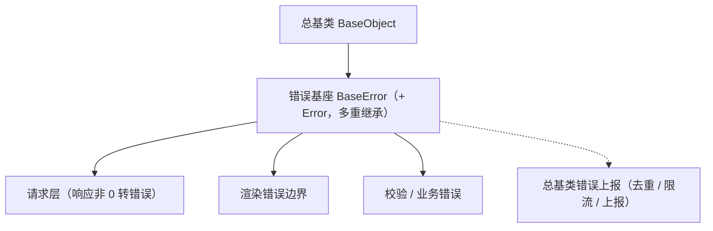

# 组件设计 · 错误基类

> 错误码 + 用户提示映射 + 上报委托：统一请求错误、校验错误与渲染异常的语义（对齐后端错误体系；错误码段位登记）
> 实现侧命名与落点见《[前端基类清单](../../../../../前端基类清单.md)》（§2.1 全量基类登记表；继承链全系统唯一一份），实现契约细节见项目详细设计。

[文档首页](../../../../../文档首页.md) › [项目规划说明](../../../../../规划/项目规划说明.md) › [组件设计](../../../01_组件设计_总览.md) › 错误基类　|　[← 注册表基类](../06_组件设计_注册表基类/06_组件设计_注册表基类.md)　[订阅基类 →](../08_组件设计_订阅基类/08_组件设计_订阅基类.md)

> 可交互原型：[07_原型设计_错误基类.html](07_原型设计_错误基类.html)（演示错误码到用户提示的映射与回退、统一响应解析、上报去重限流）

## 1. 目的与适用范围 

定义 BMS 前端**错误基类**的组件设计：为**请求错误、校验错误、渲染边界与业务异常**提供统一错误语义——错误码、用户提示映射、上报委托。它是继承链上的**错误基座 `BaseError`**，采用**多重继承 `BaseError extends BaseObject, Error`**（本体系唯一的有理由多重继承，与后端 `BaseSchema` 同类先例）——既入继承链由总基类派生，又保留原生 `instanceof Error` 与堆栈；上报最终汇入 [总基类](../../01_机制基类/01_组件设计_根系基类/01_组件设计_根系基类.md)的错误上报（口径与落点见《[前端基类清单](../../../../../前端基类清单.md)》§2.1 / §3.4）。

### 1.1 定位与继承链位置 

| 职责 | 归属 |
| --- | --- |
| 错误码表示（错误码 / 技术信息 / 用户提示 / 原始原因）、错误边界承接 | **本节点（错误基类）** |
| 上报通道（去重 / 限流 / 不阻断业务） | [总基类](../../01_机制基类/01_组件设计_根系基类/01_组件设计_根系基类.md)（错误上报） |
| 请求层拦截（认证刷新、统一解析、提示映射） | [基础类「请求封装」](../../../09_基础类/01_组件设计_请求封装/01_组件设计_请求封装.md) |
| 后端错误码与段位 | [《后端基类清单》](../../../../../后端基类清单.md)「core 横切」（错误体系 / 错误码 / 错误码段位） |

上游依据：[《前端开发规范》](../../../../../规范/前端开发规范.md)（§3 前端基类体系与 §3.4 双轨）、[《后端基类清单》](../../../../../后端基类清单.md)「core 横切基座」（异常与错误码对齐）、[《命名规范》](../../../../../规范/命名规范.md)（错误码文案 i18n key `error.{code}`）。

> 本篇为 **基础组件类 · 中间层基类「错误基类」**。**范围边界**：请求拦截与重试、提示映射归请求封装；上报通道归总基类；本节点只定义"错误怎么表示"。

## 2. 职责与组成 

| 组成部分 | 职责 |
| --- | --- |
| 错误核心 | 多重继承入链（`BaseError extends BaseObject, Error`）：错误码 / 技术信息 / 用户提示 / 原始原因；原生 `instanceof Error` 与堆栈保留；提示映射与上报由宿主请求层承载 |
| 内建错误码表 | 前端内建错误码（能力声明违规 10001 / 扩展点未登记 10002 / 注册表冲突 10003 / 未实现 19001…，段位对齐平台） |
| 提示映射 | 错误码 → 用户提示映射（i18n key `error.{code}`，缺失回退通用文案；核心只携带错误码与用户提示） |

- **与后端对齐**：后端错误体系（携带错误码 / HTTP 状态 / 数据，段位基 1xxxx / 2xxxx / 3xxxx / 4xxxx / 8xxxx）；前端以同一错误码映射用户提示（`error.{code}`），不在前端重新发明错误码。

## 3. 交互与契约语义 

| 语义项 | 说明 |
| --- | --- |
| 错误码 | 对齐后端段位：1xxxx 通用 / 2xxxx 认证 / 3xxxx 用户组织 / 4xxxx 配置 / 8xxxx 开放·租户 |
| 技术信息 | 日志与开发态展示，不直接展示给用户 |
| 用户提示 | 可选；宿主映射 i18n `error.{code}`，未映射时回退领域通用文案 |
| 原始原因 | 原始错误 / 响应（保留现场供上报） |
| 构造 | 由错误码、技术信息与选项（用户提示 / 原始原因）构造；保留标准错误的捕获语义与堆栈 |

## 4. 行为与约定 

| 项 | 设计 |
| --- | --- |
| 响应解析 | 宿主请求层统一判断响应非 0 构造错误；认证段（2xxxx）由请求层静默刷新重试，不进入用户提示 |
| 提示映射 | 用户提示取 i18n `error.{code}`；未映射回退"操作失败，请稍后重试"（或领域文案）；**禁止组件内硬编码错误文案** |
| 段位判定 | 认证段（2xxxx）→ 跳登录 / 刷新；权限段（如 30001）→ 提示并刷新权限缓存；限流段（10005）→ 提示稍后再试 |
| 错误边界 | 渲染错误统一转错误语义（段位取通用）并上报；**不白屏**，由展示类「异常与空状态」兜底 |
| 上报 | 经总基类统一上报：去重（同码同栈短时合并）、限流、生产分级；上报不阻断业务、失败静默 |
| 用户取消 | 主动取消（切换页面 / 请求取消）不算错误，不提示、不上报 |
| 依赖方向 | 继承总基类 + `Error`（唯一多重继承）；上报委托总基类；不得依赖具体组件或具体能力族基类 |

## 5. 场景集成 

| 场景 | 说明 |
| --- | --- |
| 请求错误 | 宿主请求层解析响应构造错误并映射用户提示，交给消息组件；认证 / 权限段位分流 |
| 表单校验 | 校验结果可包装为错误语义（宿主扩展字段携带字段明细），字段壳按字段展示 |
| 渲染错误 | 页面级错误边界捕获 → 占位降级 + 上报（配合展示类「异常与空状态」） |
| 监控与告警 | 宿主上报汇入总基类错误上报口径，统一去重限流后送监控端点 |

## 6. 依赖接口与上游变更 

### 6.1 上游接口与口径 

| 项 | 说明 | 目标文档 |
| --- | --- | --- |
| 继承链权威 | 错误基座的父基类（多重继承例外）与落点 | 《[前端基类清单](../../../../../前端基类清单.md)》§2.1 / §3.4（登记项①，唯一权威） |
| 错误码体系 | 错误码段位与文案 key | [《后端基类清单》](../../../../../后端基类清单.md)「core 横切基座」节（登记项②） |
| 上报口径 | 前端日志与错误上报 | [总基类](../../01_机制基类/01_组件设计_根系基类/01_组件设计_根系基类.md)（登记项③） |
| 新增依赖 | **无** | — |

### 6.2 需登记的上游变更 

| 变更点 | 目标文档 | 内容 |
| --- | --- | --- |
| ① 错误基类契约 | [《前端开发规范》](../../../../../规范/前端开发规范.md) 第 3 节 | 明确错误基类：错误码 / 技术信息 / 用户提示 / 原始原因 + 统一响应解析 + 提示映射（i18n `error.{code}`）+ 上报委托总基类 |
| ② 错误码对齐 | [《后端基类清单》](../../../../../后端基类清单.md) | 前端提示映射与后端错误码段位（1xxxx / 2xxxx / 3xxxx / 4xxxx / 8xxxx）同源登记 |
| ③ 上报通道 | [总基类](../../01_机制基类/01_组件设计_根系基类/01_组件设计_根系基类.md) | 错误上报统一走总基类错误上报（去重 / 限流 / 生产分级），错误基类不另建通道 |

> 按[《文档生成规范》](../../../../../规范/文档生成规范.md)「引用与追溯」节，上述变更需用户确认后由上游文档同步。

## 7. 权限 / i18n / 移动端 

- **权限**：不做权限判定；权限失败由宿主拦截层按错误码段位判定；动作权限见[基础类「权限指令」](../../../09_基础类/02_组件设计_权限指令/02_组件设计_权限指令.md)。
- **i18n**：用户提示经 `error.{code}` 映射；技术信息不展示给用户。
- **移动端**：PC 与移动端按同一契约多实现（错误语义与映射一致；同一套契约断言保障）。

## 8. 性能与边界 

| 场景 | 设计 |
| --- | --- |
| 开销 | 构造与映射为纯内存操作；上报去重限流由总基类统一 |
| 边界 | 错误码未映射（回退文案）、重复上报风暴、认证段循环刷新、用户取消误报、原始错误信息泄露（生产只上报码与上下文） |
| 不支持 | 请求拦截与重试（请求封装）、上报通道（总基类）、具体提示组件（展示类「通知与消息」） |

## 9. 检查清单 

- □ 契约语义：错误码 / 技术信息 / 用户提示 / 原始原因 + 标准错误派生；统一响应解析与段位判定由宿主请求层承载
- □ 行为（宿主请求层）：统一响应解析、i18n 提示映射与回退、认证段静默刷新不提示、用户取消不报、上报走去重限流
- □ 禁止组件内硬编码错误文案；多重继承入链（保留 `instanceof Error` 与堆栈）、上报委托总基类（不另建通道）
- □ 权限/i18n/移动端符合第 7 节；性能边界符合第 8 节
- □ 三项上游登记已确认

> 组件设计节点（错误基类）· 与[《前端开发规范》](../../../../../规范/前端开发规范.md)[《后端基类清单》](../../../../../后端基类清单.md)[《命名规范》](../../../../../规范/命名规范.md)[组件根基类](../../01_机制基类/02_组件设计_组件根基类/02_组件设计_组件根基类.md)[总基类](../../01_机制基类/01_组件设计_根系基类/01_组件设计_根系基类.md)[基础类「请求封装」](../../../09_基础类/01_组件设计_请求封装/01_组件设计_请求封装.md)《命名规范》配套
